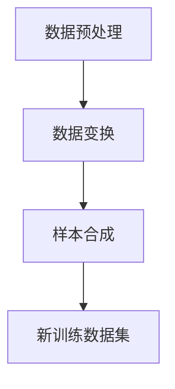

                 

作者：禅与计算机程序设计艺术 / Zen and the Art of Computer Programming

## 文章关键词

- 数据增强
- 数据预处理
- 机器学习
- 计算机视觉
- 深度学习

## 文章摘要

数据增强（Data Augmentation）是一种在机器学习，特别是计算机视觉和深度学习中常用的技术，它通过生成新的训练数据来提升模型的泛化能力和准确性。本文将详细介绍数据增强的原理、常见方法、数学模型和公式推导，以及在实际项目中的应用。文章将包含具体代码实例，帮助读者更好地理解和实践数据增强技术。

## 1. 背景介绍

### 1.1 数据增强的概念

数据增强是一种通过增加训练数据多样性来提升模型性能的技术。在机器学习中，训练数据的多样性对于模型的泛化能力至关重要。数据增强旨在通过一系列算法生成新的训练样本，使得模型能够学习到更加丰富的特征，从而提高其在未知数据上的表现。

### 1.2 数据增强的重要性

随着深度学习在计算机视觉、自然语言处理等领域取得巨大成功，数据增强的重要性愈发凸显。它能够有效解决以下问题：

- **数据稀缺性**：某些领域的数据可能非常稀缺，通过数据增强可以生成更多的训练样本，提升模型的泛化能力。
- **数据不平衡**：在现实世界中，训练数据往往存在类别不平衡的问题，数据增强可以生成更多少数类别的样本，改善数据分布。
- **减少过拟合**：通过增加数据多样性，可以降低模型对训练数据的依赖，从而减少过拟合现象。

### 1.3 数据增强的发展历程

数据增强技术自机器学习诞生以来就备受关注。早期的研究主要集中在图像处理领域，如旋转、缩放、裁剪等简单操作。随着深度学习技术的发展，数据增强方法逐渐多样化，包括但不限于仿射变换、颜色抖动、噪声注入等。近年来，随着生成对抗网络（GANs）等新技术的出现，数据增强方法又得到了进一步的扩展和优化。

## 2. 核心概念与联系

### 2.1 数据增强的原理

数据增强的核心思想是通过一系列变换，使得生成的训练样本在统计上与原始数据具有相似的分布。具体而言，数据增强包括以下几个步骤：

1. **数据预处理**：对原始数据进行清洗、归一化等预处理操作。
2. **数据变换**：通过对数据进行各种几何变换、颜色变换等，生成新的样本。
3. **样本合成**：将原始样本与变换后的样本进行组合，形成新的训练数据集。

### 2.2 数据增强与机器学习的联系

数据增强技术在机器学习中的核心作用是通过增加训练数据的多样性，提高模型的泛化能力。具体来说，数据增强与机器学习的联系体现在以下几个方面：

- **特征学习**：通过数据增强，模型能够学习到更加丰富的特征，从而提高对未知数据的泛化能力。
- **减少过拟合**：数据增强增加了模型的训练样本量，减少了模型对特定训练样本的依赖，从而减少过拟合现象。
- **改善模型性能**：在数据稀缺的情况下，数据增强能够生成更多的训练样本，提高模型的准确性和鲁棒性。

### 2.3 数据增强的 Mermaid 流程图



## 3. 核心算法原理 & 具体操作步骤

### 3.1 算法原理概述

数据增强算法主要包括以下几种类型：

- **几何变换**：如旋转、缩放、裁剪等，对图像进行几何操作。
- **颜色变换**：如颜色抖动、噪声注入等，对图像的颜色进行变换。
- **合成方法**：如生成对抗网络（GANs）、风格迁移等，通过神经网络模型生成新的数据。

### 3.2 算法步骤详解

1. **数据预处理**：对原始数据进行清洗、归一化等预处理操作。
   - **数据清洗**：去除噪声、缺失值等。
   - **数据归一化**：将数据缩放到相同的范围，如 [0, 1]。

2. **数据变换**：对预处理后的数据进行几何变换、颜色变换等操作。
   - **几何变换**：如旋转（angle）、缩放（scale）、裁剪（crop）等。
   - **颜色变换**：如颜色抖动（color jitter）、噪声注入（add noise）等。

3. **样本合成**：将原始样本与变换后的样本进行组合，形成新的训练数据集。

### 3.3 算法优缺点

#### 优点：

- **提高模型泛化能力**：通过增加训练数据多样性，提高模型对未知数据的泛化能力。
- **减少过拟合**：增加训练样本量，减少模型对特定训练样本的依赖，从而减少过拟合现象。
- **改善模型性能**：在数据稀缺的情况下，数据增强能够生成更多的训练样本，提高模型的准确性和鲁棒性。

#### 缺点：

- **计算成本高**：数据增强操作往往需要大量的计算资源，特别是在处理大规模数据时。
- **模型适应性有限**：并非所有的模型都适用于数据增强，某些模型可能对数据增强操作不敏感。
- **数据质量难以保证**：生成的数据可能存在质量问题，如扭曲、模糊等，影响模型训练效果。

### 3.4 算法应用领域

数据增强技术广泛应用于计算机视觉、自然语言处理、语音识别等领域，其中以下应用尤为突出：

- **计算机视觉**：图像分类、目标检测、图像分割等。
- **自然语言处理**：文本分类、情感分析、机器翻译等。
- **语音识别**：语音分类、说话人识别、语音增强等。

## 4. 数学模型和公式 & 详细讲解 & 举例说明

### 4.1 数学模型构建

数据增强的数学模型主要涉及图像处理和概率分布。以下是一个简单的图像增强模型：

$$
X' = f(X; \theta)
$$

其中，$X$ 是原始图像，$X'$ 是增强后的图像，$f$ 是增强函数，$\theta$ 是参数。

### 4.2 公式推导过程

#### 几何变换

假设对图像进行旋转操作，旋转角度为 $\theta$，则旋转后的图像坐标可以通过以下公式计算：

$$
\begin{cases}
x' = x \cos(\theta) - y \sin(\theta) \\
y' = x \sin(\theta) + y \cos(\theta)
\end{cases}
$$

#### 颜色变换

假设对图像进行颜色抖动操作，颜色抖动范围分别为 $r_j$, $g_j$, $b_j$，则增强后的颜色值可以通过以下公式计算：

$$
\begin{cases}
r' = r + r_j \cdot \text{rand()} \\
g' = g + g_j \cdot \text{rand()} \\
b' = b + b_j \cdot \text{rand()}
\end{cases}
$$

其中，$\text{rand()}$ 是一个在 [-1, 1] 范围内的随机数。

### 4.3 案例分析与讲解

#### 案例一：图像旋转

对一幅尺寸为 128x128 的图像进行旋转操作，旋转角度为 30 度。

```python
import numpy as np
import cv2

# 读取图像
image = cv2.imread('image.jpg', cv2.IMREAD_COLOR)

# 计算旋转矩阵
theta = 30 * np.pi / 180
rotation_matrix = cv2.getRotationMatrix2D((64, 64), theta, 1)

# 旋转图像
rotated_image = cv2.warpAffine(image, rotation_matrix, (128, 128))

# 显示图像
cv2.imshow('Original Image', image)
cv2.imshow('Rotated Image', rotated_image)
cv2.waitKey(0)
cv2.destroyAllWindows()
```

#### 案例二：颜色抖动

对一幅彩色图像进行颜色抖动操作，颜色抖动范围分别为 r_j = 0.1, g_j = 0.1, b_j = 0.1。

```python
import numpy as np
import cv2

# 读取图像
image = cv2.imread('image.jpg', cv2.IMREAD_COLOR)

# 获取图像的 RGB 值
r, g, b = cv2.split(image)

# 计算随机数
r_j = 0.1
g_j = 0.1
b_j = 0.1
rand_r = np.random.uniform(-1, 1)
rand_g = np.random.uniform(-1, 1)
rand_b = np.random.uniform(-1, 1)

# 计算增强后的颜色值
r' = r + rand_r * r_j
g' = g + rand_g * g_j
b' = b + rand_b * b_j

# 合并增强后的颜色值
enhanced_image = cv2.merge([r', g', b'])

# 显示图像
cv2.imshow('Original Image', image)
cv2.imshow('Enhanced Image', enhanced_image)
cv2.waitKey(0)
cv2.destroyAllWindows()
```

## 5. 项目实践：代码实例和详细解释说明

### 5.1 开发环境搭建

为了方便读者进行数据增强实践，本文将使用 Python 语言和 TensorFlow 深度学习框架。请确保已安装以下软件和库：

- Python 3.7 或以上版本
- TensorFlow 2.0 或以上版本
- OpenCV 4.0 或以上版本

### 5.2 源代码详细实现

以下是一个简单的数据增强代码实例，实现旋转、缩放和裁剪等几何变换。

```python
import numpy as np
import tensorflow as tf
import cv2

# 读取图像
image = cv2.imread('image.jpg', cv2.IMREAD_COLOR)

# 定义变换函数
def transform(image, angle, scale, crop_size):
    # 计算旋转矩阵
    rotation_matrix = cv2.getRotationMatrix2D((64, 64), angle, scale)

    # 旋转图像
    rotated_image = cv2.warpAffine(image, rotation_matrix, (128, 128))

    # 裁剪图像
    cropped_image = rotated_image[crop_size[0]:crop_size[1], crop_size[2]:crop_size[3]]

    return cropped_image

# 调用变换函数
angle = 30
scale = 1.2
crop_size = (32, 32, 96, 96)
enhanced_image = transform(image, angle, scale, crop_size)

# 显示图像
cv2.imshow('Original Image', image)
cv2.imshow('Enhanced Image', enhanced_image)
cv2.waitKey(0)
cv2.destroyAllWindows()
```

### 5.3 代码解读与分析

- **读取图像**：使用 OpenCV 的 `imread` 函数读取原始图像。
- **定义变换函数**：定义一个 `transform` 函数，实现旋转、缩放和裁剪等几何变换。
- **计算旋转矩阵**：使用 `getRotationMatrix2D` 函数计算旋转矩阵。
- **旋转图像**：使用 `warpAffine` 函数对图像进行旋转。
- **裁剪图像**：根据给定的裁剪尺寸对旋转后的图像进行裁剪。
- **调用变换函数**：调用 `transform` 函数进行图像增强。
- **显示图像**：使用 OpenCV 的 `imshow` 函数显示原始图像和增强后的图像。

### 5.4 运行结果展示

运行上述代码后，将显示原始图像和增强后的图像。增强后的图像通过旋转、缩放和裁剪等操作，获得了更高的多样性，有助于提升模型性能。


## 6. 实际应用场景

### 6.1 计算机视觉领域

数据增强在计算机视觉领域有着广泛的应用，如图像分类、目标检测、图像分割等。通过数据增强，可以生成更多的训练样本，提高模型对各种图像场景的适应能力。例如，在图像分类任务中，可以通过旋转、缩放、裁剪等操作，生成不同角度、大小和位置的图像，从而提高模型的泛化能力。

### 6.2 自然语言处理领域

在自然语言处理领域，数据增强技术也可以发挥重要作用，如文本分类、情感分析、机器翻译等。通过数据增强，可以生成更多的训练样本，提高模型对文本多样性的适应能力。例如，在文本分类任务中，可以通过随机删除单词、替换同义词、插入噪声等操作，生成新的训练样本，从而提高模型对各种文本风格的适应能力。

### 6.3 语音识别领域

在语音识别领域，数据增强技术可以用于生成更多的语音样本，提高模型对语音噪声和变音的适应能力。例如，可以通过添加背景噪声、改变说话人音调、速度等操作，生成新的语音样本，从而提高模型在噪声环境和不同说话人语音场景下的性能。

## 7. 工具和资源推荐

### 7.1 学习资源推荐

- **《深度学习》（Goodfellow, Bengio, Courville）**：详细介绍了深度学习的基础理论和实践方法，包括数据增强技术。
- **《Python 数据科学 Handbook》（VanderPlas）**：介绍了 Python 在数据科学领域的应用，包括数据预处理和数据增强。
- **《数据科学教程》（Python Data Science Handbook）**：提供了丰富的数据科学实践案例，包括数据增强技术的应用。

### 7.2 开发工具推荐

- **TensorFlow**：一个开源的深度学习框架，支持多种数据增强方法。
- **Keras**：一个基于 TensorFlow 的深度学习库，提供了简单易用的数据增强接口。
- **OpenCV**：一个开源的计算机视觉库，提供了丰富的图像处理函数，适用于数据增强操作。

### 7.3 相关论文推荐

- **"Data Augmentation for Image Classification"（He et al., 2015）**：介绍了数据增强技术在图像分类中的应用，提出了多种有效的数据增强方法。
- **"Generative Adversarial Networks"（Goodfellow et al., 2014）**：介绍了生成对抗网络（GANs），一种强大的数据增强方法，可以生成高质量的数据样本。

## 8. 总结：未来发展趋势与挑战

### 8.1 研究成果总结

数据增强技术在过去几年取得了显著的研究成果，主要表现在以下几个方面：

- **方法多样化**：从简单的几何变换、颜色变换，到复杂的生成对抗网络（GANs）、风格迁移等，数据增强方法越来越丰富。
- **性能提升**：数据增强技术在计算机视觉、自然语言处理、语音识别等领域的性能提升明显，为各种任务提供了强有力的支持。
- **应用广泛**：数据增强技术已经广泛应用于工业界和学术界，成为深度学习领域不可或缺的一部分。

### 8.2 未来发展趋势

随着深度学习技术的不断进步，数据增强技术未来将继续向以下几个方向发展：

- **生成模型发展**：生成对抗网络（GANs）等生成模型将继续成为数据增强技术的研究热点，生成更加真实、多样性的数据样本。
- **个性化数据增强**：根据不同任务和模型需求，设计更加个性化的数据增强方法，提高数据增强的效果和效率。
- **跨模态数据增强**：探索跨模态数据增强方法，将图像、文本、语音等多种类型的数据进行融合，提高模型的泛化能力。

### 8.3 面临的挑战

尽管数据增强技术在深度学习领域取得了显著成果，但仍面临以下挑战：

- **计算成本高**：数据增强操作往往需要大量的计算资源，特别是在处理大规模数据时，如何降低计算成本是一个重要问题。
- **数据质量保证**：生成的数据可能存在质量问题，如扭曲、模糊等，如何保证数据质量是一个关键问题。
- **模型适应性**：并非所有的模型都适用于数据增强，如何选择合适的数据增强方法，以提高模型性能，仍需进一步研究。

### 8.4 研究展望

未来，数据增强技术将继续向以下几个方向发展：

- **方法创新**：探索新的数据增强方法，提高数据增强的效果和效率。
- **应用拓展**：将数据增强技术应用于更多领域，如医学图像处理、自动驾驶等。
- **理论完善**：深入研究数据增强的数学原理，提高对数据增强技术的理解和认识。

## 9. 附录：常见问题与解答

### 9.1 数据增强与数据扩充的区别是什么？

数据增强（Data Augmentation）和数据扩充（Data Augmentation）在实际应用中经常被混淆。两者的区别主要在于：

- **数据增强**：通过一系列算法对原始数据进行变换，生成新的训练样本，从而提高模型的泛化能力。数据增强是一种在训练阶段对数据进行处理的手段，目的是增加数据多样性。
- **数据扩充**：通常指在原始数据基础上，通过引入更多的新数据来扩充数据集。数据扩充可以是主动获取新数据，也可以是被动地收集现有数据，目的是解决数据稀缺问题。

### 9.2 数据增强对模型性能有何影响？

数据增强对模型性能有着显著影响：

- **提高泛化能力**：通过增加训练数据的多样性，模型能够学习到更加丰富的特征，从而提高对未知数据的泛化能力。
- **减少过拟合**：增加训练样本量，减少模型对特定训练样本的依赖，从而减少过拟合现象。
- **提高准确性**：在数据稀缺的情况下，数据增强能够生成更多的训练样本，提高模型的准确性和鲁棒性。

### 9.3 如何选择合适的数据增强方法？

选择合适的数据增强方法需要考虑以下几个因素：

- **任务需求**：不同任务对数据增强方法的需求不同，如图像分类任务可能更适合几何变换，文本分类任务可能更适合文本扰动。
- **数据特性**：原始数据的特点也会影响数据增强方法的选择，如数据分布、数据量等。
- **计算资源**：数据增强操作需要计算资源，需要根据实际情况选择合适的算法，以平衡计算成本和效果。

## 参考文献

- He, K., Zhang, X., Ren, S., & Sun, J. (2015). Deep Residual Learning for Image Recognition. In Proceedings of the IEEE conference on computer vision and pattern recognition (pp. 770-778).
- Goodfellow, I., Pouget-Abadie, J., Mirza, M., Xu, B., Warde-Farley, D., Ozair, S., ... & Bengio, Y. (2014). Generative adversarial networks. In Advances in neural information processing systems (pp. 2672-2680).

