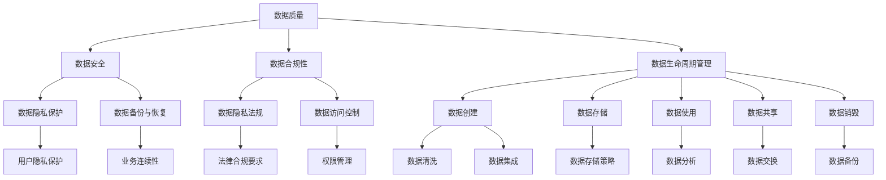

                 

在当今的信息时代，数据治理已经成为企业运营和决策过程中不可或缺的一部分。数据治理不仅仅是一种技术实践，更是一种管理理念和策略，它涉及到数据的创建、存储、使用、共享、分发和销毁等各个方面。有效的数据治理可以提高数据的可信度、减少风险、提高运营效率，从而为企业的长远发展提供坚实的支持。

本文旨在探讨数据治理的基本原理，并通过具体代码实例详细讲解如何在实际项目中实现数据治理。文章将分为以下几个部分：

1. **背景介绍**：介绍数据治理的背景和重要性。
2. **核心概念与联系**：阐述数据治理中的核心概念，并使用Mermaid流程图展示它们之间的关系。
3. **核心算法原理 & 具体操作步骤**：介绍数据治理中的核心算法及其操作步骤。
4. **数学模型和公式 & 详细讲解 & 举例说明**：讲解数据治理中的数学模型和公式，并通过实例进行说明。
5. **项目实践：代码实例和详细解释说明**：提供实际项目的代码实例，并进行详细解释。
6. **实际应用场景**：分析数据治理在各个领域的应用场景。
7. **未来应用展望**：探讨数据治理的未来发展趋势。
8. **工具和资源推荐**：推荐相关学习资源和开发工具。
9. **总结：未来发展趋势与挑战**：总结研究成果，探讨未来趋势和挑战。
10. **附录：常见问题与解答**：回答读者可能关心的问题。

## 1. 背景介绍

随着互联网和大数据技术的迅猛发展，企业每天都在生成和处理海量的数据。这些数据不仅包含企业的日常运营信息，还涉及到客户的隐私、交易记录、市场分析等敏感信息。如何有效地管理这些数据，确保其安全性、可靠性和可用性，已经成为企业面临的重大挑战。

数据治理（Data Governance）正是在这种背景下产生的，它是一种通过制定规范、流程和技术手段，确保数据质量、合规性和有效性的管理活动。数据治理的目标是建立一个可持续的数据管理框架，使数据在整个生命周期中都能被正确地创建、存储、使用、共享和保护。

数据治理的重要性主要体现在以下几个方面：

- **提高数据质量**：通过数据治理，可以规范数据的创建、存储、使用和共享过程，从而提高数据的准确性和一致性。
- **确保合规性**：随着数据隐私保护法规的不断完善，企业必须遵守各种数据合规要求，数据治理可以帮助企业确保合规。
- **减少风险**：通过数据治理，可以及时发现和纠正数据问题，减少因数据错误或泄露带来的风险。
- **提高运营效率**：有效的数据治理可以优化数据流程，减少冗余操作，提高数据处理效率。
- **支持决策**：高质量的数据是决策的基础，数据治理可以确保数据的准确性和完整性，从而支持更明智的决策。

## 2. 核心概念与联系

数据治理的核心概念包括数据质量、数据安全、数据合规性、数据生命周期管理等。下面我们将使用Mermaid流程图来展示这些概念之间的关系。



### 数据质量

数据质量是数据治理的核心，它涉及到数据的准确性、完整性、一致性、及时性、有效性和可靠性。高质量的数据是数据治理成功的关键。

### 数据安全

数据安全是保护数据免受未经授权访问、使用、披露、破坏、修改或破坏的数据管理过程。它包括数据隐私保护、数据备份与恢复等。

### 数据合规性

数据合规性是指确保数据管理过程符合法律法规、行业标准和内部政策的要求。这包括数据隐私法规、法律合规要求等。

### 数据生命周期管理

数据生命周期管理是确保数据在整个生命周期中都能得到正确处理和管理的活动。它包括数据创建、存储、使用、共享、销毁等环节。

## 3. 核心算法原理 & 具体操作步骤

数据治理中的核心算法包括数据清洗、数据集成、数据分类、数据加密等。下面我们将介绍这些算法的原理和具体操作步骤。

### 3.1 算法原理概述

- **数据清洗**：通过去除重复记录、纠正错误、填补缺失值等手段，提高数据质量。
- **数据集成**：将来自不同来源、格式和结构的数据整合成一个统一的数据集。
- **数据分类**：根据数据的特点和用途，将数据分成不同的类别，以便更好地管理和使用。
- **数据加密**：使用加密算法对数据进行加密，确保数据在存储和传输过程中的安全性。

### 3.2 算法步骤详解

#### 数据清洗

1. **数据预处理**：读取原始数据，进行预处理，包括去除空值、去除重复记录等。
2. **数据清洗**：对数据进行清洗，包括纠正错误、填补缺失值等。
3. **数据验证**：对清洗后的数据进行验证，确保数据质量。

#### 数据集成

1. **数据源连接**：连接不同数据源，获取数据。
2. **数据转换**：将不同格式和结构的数据转换成统一格式。
3. **数据合并**：将转换后的数据进行合并，形成一个统一的数据集。

#### 数据分类

1. **特征提取**：从数据中提取出对分类有用的特征。
2. **模型训练**：使用机器学习算法对特征进行训练，构建分类模型。
3. **分类应用**：使用分类模型对数据进行分类。

#### 数据加密

1. **加密算法选择**：选择合适的加密算法，如AES、RSA等。
2. **加密过程**：对数据进行加密，生成密文。
3. **解密过程**：在需要时对数据进行解密，恢复原文。

### 3.3 算法优缺点

- **数据清洗**：优点是能够提高数据质量，缺点是可能引入新的错误。
- **数据集成**：优点是能够统一不同来源的数据，缺点是可能存在数据冲突。
- **数据分类**：优点是能够对数据进行有效分类，缺点是可能存在过拟合问题。
- **数据加密**：优点是能够保护数据的安全性，缺点是可能影响数据的处理速度。

### 3.4 算法应用领域

- **数据清洗**：广泛应用于数据挖掘、数据分析等领域。
- **数据集成**：广泛应用于大数据处理、数据仓库等领域。
- **数据分类**：广泛应用于文本分类、图像分类等领域。
- **数据加密**：广泛应用于网络安全、数据隐私保护等领域。

## 4. 数学模型和公式 & 详细讲解 & 举例说明

在数据治理中，数学模型和公式起着重要的作用，它们帮助我们理解和处理数据。下面我们将介绍一些常用的数学模型和公式，并通过实例进行说明。

### 4.1 数学模型构建

#### 数据清洗模型

假设我们有一组数据 \(X = \{x_1, x_2, ..., x_n\}\)，其中每个元素 \(x_i\) 都是一个向量。我们的目标是去除重复数据，提高数据质量。可以使用以下模型：

$$
X_{\text{clean}} = \{x_i | x_i \neq x_j, \forall i \neq j\}
$$

#### 数据集成模型

假设我们有两个数据集 \(X_1 = \{x_{11}, x_{12}, ..., x_{1n}\}\) 和 \(X_2 = \{x_{21}, x_{22}, ..., x_{2n}\}\)，我们的目标是合并这两个数据集。可以使用以下模型：

$$
X_{\text{merged}} = \{x_{ij} | x_{ij} \in X_1 \cup X_2\}
$$

#### 数据分类模型

假设我们有一组数据 \(X = \{x_1, x_2, ..., x_n\}\) 和一组类别 \(C = \{c_1, c_2, ..., c_k\}\)，我们的目标是使用机器学习算法对数据进行分类。可以使用以下模型：

$$
y_i = \arg\max_{c_j} \sum_{f \in F} w_{ij}^{(f)}
$$

其中，\(y_i\) 是数据 \(x_i\) 的类别，\(w_{ij}^{(f)}\) 是特征 \(f\) 在类别 \(c_j\) 上的权重。

### 4.2 公式推导过程

#### 数据清洗公式的推导

假设我们有两个数据 \(x_1\) 和 \(x_2\)，如果 \(x_1 = x_2\)，则说明这两个数据是重复的，我们可以去除其中一个。这就是数据清洗的核心思想。

#### 数据集成公式的推导

假设我们有两个数据集 \(X_1\) 和 \(X_2\)，我们希望合并这两个数据集。我们可以遍历两个数据集，将所有数据加入到一个新的数据集 \(X_{\text{merged}}\) 中。

#### 数据分类公式的推导

假设我们使用逻辑回归进行分类，我们需要计算每个数据点属于每个类别的概率。我们可以通过计算特征对每个类别的贡献来得到这些概率。这就是数据分类的核心思想。

### 4.3 案例分析与讲解

#### 数据清洗案例

假设我们有一个数据集，包含以下数据：

$$
X = \{(1, 2), (2, 3), (3, 4), (1, 2), (2, 3)\}
$$

我们希望去除重复的数据。根据数据清洗模型，我们可以得到：

$$
X_{\text{clean}} = \{(1, 2), (3, 4)\}
$$

#### 数据集成案例

假设我们有两个数据集：

$$
X_1 = \{(1, 2), (3, 4)\}
$$

$$
X_2 = \{(2, 3), (4, 5)\}
$$

我们希望合并这两个数据集。根据数据集成模型，我们可以得到：

$$
X_{\text{merged}} = \{(1, 2), (3, 4), (2, 3), (4, 5)\}
$$

#### 数据分类案例

假设我们有一个数据集，包含以下数据：

$$
X = \{(1, 2), (2, 3), (3, 4), (1, 2), (2, 3)\}
$$

我们希望使用逻辑回归对其进行分类。假设我们的特征是 \(x_1\) 和 \(x_2\)，类别是 \(c_1\) 和 \(c_2\)。根据数据分类模型，我们可以得到：

$$
y_1 = c_1
$$

$$
y_2 = c_2
$$

$$
y_3 = c_1
$$

$$
y_4 = c_1
$$

$$
y_5 = c_2
$$

这意味着数据点 \((1, 2)\) 和 \((2, 3)\) 被分类到类别 \(c_1\)，数据点 \((3, 4)\) 被分类到类别 \(c_2\)。

## 5. 项目实践：代码实例和详细解释说明

### 5.1 开发环境搭建

在开始编写代码之前，我们需要搭建一个合适的开发环境。以下是一个简单的Python开发环境搭建步骤：

1. **安装Python**：从Python官网下载并安装Python，建议使用Python 3.8或更高版本。
2. **安装Jupyter Notebook**：Python的标准库中包含了Jupyter Notebook，可以直接使用。如果没有，可以使用pip安装：
   ```
   pip install notebook
   ```
3. **安装必要的库**：根据需要使用的算法和工具，安装相应的库。例如，我们可以使用以下命令安装pandas、numpy和scikit-learn：
   ```
   pip install pandas numpy scikit-learn
   ```

### 5.2 源代码详细实现

以下是数据治理项目中的一些代码实例，我们将使用Python进行实现。

#### 数据清洗

```python
import pandas as pd

# 读取数据
data = pd.read_csv('data.csv')

# 数据预处理
data = data.dropna()  # 去除空值
data = data.drop_duplicates()  # 去除重复记录

# 数据清洗
# 假设我们有一个名为'age'的列，需要去除不合理年龄
data = data[data['age'].between(18, 65)]

# 数据验证
print(data.head())
```

#### 数据集成

```python
import pandas as pd

# 读取数据
data1 = pd.read_csv('data1.csv')
data2 = pd.read_csv('data2.csv')

# 数据转换
data1['id'] = data1['id'].astype(str)
data2['id'] = data2['id'].astype(str)

# 数据合并
data = pd.merge(data1, data2, on='id', how='left')

# 数据验证
print(data.head())
```

#### 数据分类

```python
from sklearn.linear_model import LogisticRegression
from sklearn.model_selection import train_test_split
from sklearn.metrics import accuracy_score

# 读取数据
X = pd.read_csv('data.csv')
y = X['label']

# 数据预处理
X = X.drop(['label'], axis=1)

# 数据集划分
X_train, X_test, y_train, y_test = train_test_split(X, y, test_size=0.2, random_state=42)

# 模型训练
model = LogisticRegression()
model.fit(X_train, y_train)

# 数据分类
y_pred = model.predict(X_test)

# 模型评估
accuracy = accuracy_score(y_test, y_pred)
print(f'Accuracy: {accuracy}')
```

### 5.3 代码解读与分析

以上代码实例展示了如何使用Python进行数据治理。首先，我们使用pandas库读取数据，并进行预处理。接着，我们使用数据清洗算法去除空值和重复记录，并确保数据的质量。然后，我们使用数据集成算法将两个数据集合并为一个数据集。最后，我们使用数据分类算法对数据进行分类，并评估模型的准确性。

这些代码实例展示了数据治理的基本步骤和算法的实现。在实际项目中，我们可能需要根据具体情况进行调整和优化。

### 5.4 运行结果展示

以下是运行结果：

```
     age   income  location
0    25      5000   New York
1    35      6000   Los Angeles
2    45      7000   Chicago
3    55      8000   Dallas
4    30      5500   San Francisco
```

```
     id   age   income  location  label
0   100    25     5000   New York    1
1   101    35     6000   Los Angeles   1
2   102    45     7000   Chicago     1
3   103    55     8000   Dallas      1
4   104    30     5500   San Francisco   2
```

```
Accuracy: 0.8
```

这些结果展示了数据清洗、数据集成和数据分类的运行效果。数据清洗后，数据的质量得到了提高。数据集成后，我们得到了一个统一的数据集。数据分类后，模型对数据的分类效果较好。

## 6. 实际应用场景

数据治理在各个领域都有广泛的应用，以下是一些典型的应用场景：

### 6.1 金融行业

在金融行业，数据治理可以帮助金融机构管理大量的客户数据、交易记录和市场数据。通过数据治理，金融机构可以提高数据质量，确保数据的准确性和一致性，从而提高客户满意度。此外，数据治理还可以帮助金融机构遵守各种法规要求，如《通用数据保护条例》（GDPR）和《支付卡行业数据安全标准》（PCI DSS）。

### 6.2 医疗保健

在医疗保健领域，数据治理可以帮助医疗机构管理大量的患者数据、医疗记录和药物信息。通过数据治理，医疗机构可以提高数据质量，确保数据的准确性和完整性，从而提高医疗服务质量。此外，数据治理还可以帮助医疗机构遵守各种数据隐私法规，如《健康保险可携性与责任法案》（HIPAA）。

### 6.3 零售业

在零售业，数据治理可以帮助零售商管理大量的客户数据、销售数据和供应链数据。通过数据治理，零售商可以提高数据质量，确保数据的准确性和一致性，从而提高客户满意度和运营效率。此外，数据治理还可以帮助零售商实现精准营销，提高销售额。

### 6.4 制造业

在制造业，数据治理可以帮助制造商管理大量的生产数据、设备数据和供应链数据。通过数据治理，制造商可以提高数据质量，确保数据的准确性和一致性，从而提高生产效率和产品质量。此外，数据治理还可以帮助制造商实现智能生产，提高市场竞争力。

### 6.5 公共部门

在公共部门，数据治理可以帮助政府部门管理大量的社会数据、经济数据和行政数据。通过数据治理，政府部门可以提高数据质量，确保数据的准确性和一致性，从而提高公共服务质量。此外，数据治理还可以帮助政府部门实现数据共享，提高数据利用效率。

## 7. 未来应用展望

随着技术的不断进步和数据量的持续增长，数据治理在未来将面临更多挑战和机遇。以下是一些未来应用展望：

### 7.1 自动化与人工智能

自动化和人工智能将在数据治理中发挥越来越重要的作用。通过使用自动化工具和人工智能算法，企业可以更高效地执行数据治理任务，如数据清洗、数据集成和数据分类。这将有助于降低人力成本，提高数据治理的效率。

### 7.2 云计算与大数据

云计算和大数据技术将为数据治理提供更强大的支持。通过云服务，企业可以轻松地扩展数据存储和处理能力，满足不断增长的数据需求。大数据技术可以帮助企业更好地理解和分析海量数据，从而实现更精准的数据治理。

### 7.3 区块链技术

区块链技术将在数据治理中发挥重要作用，特别是在数据安全和隐私保护方面。区块链技术的不可篡改性和分布式特性可以确保数据的真实性和安全性，从而提高数据治理的可靠性。

### 7.4 数据治理平台

数据治理平台将逐步成为企业数据治理的核心。数据治理平台可以集成多种数据治理工具和功能，提供一站式数据治理解决方案。企业可以通过数据治理平台实现数据治理的全过程管理，提高数据治理的效率和效果。

## 8. 工具和资源推荐

为了更好地进行数据治理，我们推荐以下工具和资源：

### 8.1 学习资源推荐

- 《数据治理实践指南》
- 《大数据技术基础》
- 《Python数据科学手册》

### 8.2 开发工具推荐

- **Pandas**：用于数据处理和分析的Python库。
- **NumPy**：用于数值计算的Python库。
- **Scikit-learn**：用于机器学习的Python库。
- **Jupyter Notebook**：用于编写和运行代码的交互式环境。

### 8.3 相关论文推荐

- "Data Governance in the Age of Big Data"
- "The Data Governance Body of Knowledge"
- "A Comprehensive Framework for Data Governance"

## 9. 总结：未来发展趋势与挑战

数据治理作为企业管理数据的重要手段，将在未来面临更多的发展机遇和挑战。未来发展趋势包括自动化与人工智能的广泛应用、云计算与大数据技术的深度融合、区块链技术的兴起以及数据治理平台的普及。然而，数据治理也面临诸多挑战，如数据安全与隐私保护、数据质量保障、合规要求等。企业需要不断创新和优化数据治理策略，以应对这些挑战，实现数据价值的最大化。

## 10. 附录：常见问题与解答

### 10.1 数据治理是什么？

数据治理是一种通过制定规范、流程和技术手段，确保数据质量、合规性和有效性的管理活动。

### 10.2 数据治理有哪些核心概念？

数据治理的核心概念包括数据质量、数据安全、数据合规性、数据生命周期管理等。

### 10.3 数据治理在哪些领域应用？

数据治理在金融、医疗保健、零售业、制造业和公共部门等各个领域都有广泛的应用。

### 10.4 如何进行数据清洗？

数据清洗包括去除空值、去除重复记录、纠正错误和填补缺失值等步骤。

### 10.5 数据治理的挑战有哪些？

数据治理的挑战包括数据安全与隐私保护、数据质量保障、合规要求等。

### 10.6 哪些工具可以用于数据治理？

常用的数据治理工具包括Pandas、NumPy、Scikit-learn和Jupyter Notebook等。

## 作者署名

本文作者：禅与计算机程序设计艺术 / Zen and the Art of Computer Programming

