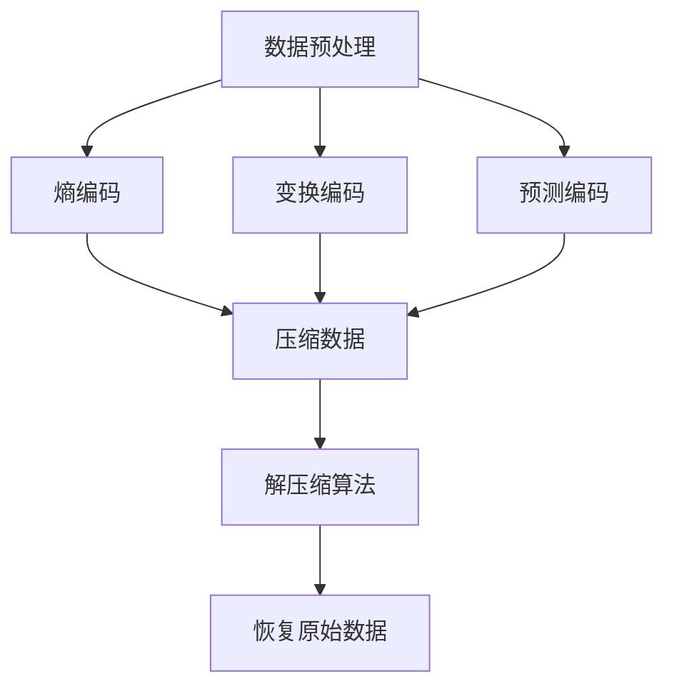

                 

关键词：数据集压缩、机器学习、模型训练、软件优化、算法加速、计算效率

> 摘要：随着机器学习和深度学习技术的迅速发展，大规模数据集的压缩变得尤为重要。本文深入探讨了数据集压缩的关键概念、核心算法原理、数学模型、实际应用以及未来的发展趋势。通过实例和详细解释，展示了如何在更多、更小、更快地训练软件2.0，从而提高计算效率和模型性能。

## 1. 背景介绍

随着人工智能的广泛应用，机器学习和深度学习领域的模型训练需求急剧增长。数据集的规模也迅速扩大，从数百万到数十亿个样本，这给存储、传输和处理带来了巨大的挑战。传统的数据集处理方法已经难以满足现代机器学习应用的需求。因此，数据集压缩技术应运而生，它通过减少数据集的大小来提高模型训练的效率和速度。

数据集压缩技术的重要性体现在以下几个方面：

1. **存储优化**：压缩后的数据集可以节省大量存储空间，降低存储成本。
2. **传输加速**：压缩数据集可以减少网络传输时间，提高数据传输效率。
3. **计算加速**：压缩后的数据集可以加速模型的加载和训练过程，提高计算效率。
4. **资源节约**：对于资源受限的环境，如移动设备或嵌入式系统，压缩技术可以帮助更好地利用有限的资源。

本文将围绕数据集压缩技术展开讨论，旨在为读者提供全面、系统的了解，并探讨其在实际应用中的潜力。

## 2. 核心概念与联系

### 2.1. 数据集压缩的基本概念

数据集压缩是指通过编码技术减少数据集的大小，同时保持数据集的信息完整性和准确性。数据集压缩通常分为有损压缩和无损压缩两种：

- **无损压缩**：压缩过程中不丢失任何信息，可以完全恢复原始数据。这种方法适用于需要保持数据完整性高精度需求的场景，如医疗影像数据压缩。
- **有损压缩**：压缩过程中可能会丢失一些信息，但损失的部分对数据整体的理解影响不大。这种方法适用于图像、音频和视频等场景，可以显著降低数据大小。

### 2.2. 数据集压缩的核心算法原理

数据集压缩的核心算法包括以下几种：

- **熵编码**：利用数据的统计特性，将频繁出现的符号用短编码表示，不频繁的符号用长编码表示，从而压缩数据。
- **变换编码**：通过正交变换（如离散余弦变换、小波变换等）将数据从原始域转换到另一个域，从而减少数据的相关性，实现压缩。
- **预测编码**：根据相邻数据点之间的相关性，预测下一个数据点，并仅对预测误差进行编码。

### 2.3. 数据集压缩的架构

数据集压缩的架构通常包括以下几个关键组件：

- **数据预处理**：包括数据清洗、归一化、去噪等步骤，为压缩算法提供高质量的输入数据。
- **压缩算法**：根据数据集的特点选择合适的压缩算法，如熵编码、变换编码、预测编码等。
- **解压缩算法**：压缩算法的反向过程，用于恢复原始数据。

下面是一个使用Mermaid绘制的数据集压缩流程图：



## 3. 核心算法原理 & 具体操作步骤

### 3.1. 算法原理概述

数据集压缩的核心算法主要包括熵编码、变换编码和预测编码。以下是对这些算法的基本原理概述：

- **熵编码**：基于信息熵理论，对概率分布不均匀的数据进行压缩。常见的熵编码算法有霍夫曼编码和算术编码。
- **变换编码**：通过正交变换将数据从原始域转换到另一个域，减少数据的相关性，从而实现压缩。常见的变换编码算法有离散余弦变换（DCT）、离散小波变换（DWT）等。
- **预测编码**：基于相邻数据点之间的相关性进行预测，仅对预测误差进行编码。常见的预测编码算法有差分脉冲编码调制（DPCM）、自适应预测编码（APC）等。

### 3.2. 算法步骤详解

#### 3.2.1. 熵编码

熵编码的基本步骤如下：

1. **统计符号频率**：计算数据集中每个符号出现的频率。
2. **构建编码表**：对于频率高的符号，分配短的编码；对于频率低的符号，分配长的编码。
3. **编码数据**：根据编码表对数据集中的每个符号进行编码。
4. **解码数据**：在接收端，根据相同的编码表对编码数据进行解码，恢复原始数据。

#### 3.2.2. 变换编码

变换编码的基本步骤如下：

1. **正交变换**：将数据从原始域转换到变换域，如使用离散余弦变换（DCT）。
2. **量化**：将变换后的系数进行量化，减少数据精度。
3. **编码**：对量化后的系数进行编码，通常使用熵编码技术。
4. **解码与反变换**：在接收端，对编码数据进行解码，然后使用反变换将数据从变换域恢复到原始域。

#### 3.2.3. 预测编码

预测编码的基本步骤如下：

1. **预测**：根据相邻数据点之间的相关性，预测下一个数据点。
2. **误差计算**：计算实际数据点与预测数据点之间的误差。
3. **编码**：对误差进行编码。
4. **解码与重构**：在接收端，对编码数据进行解码，并根据预测模型重构原始数据。

### 3.3. 算法优缺点

每种压缩算法都有其优缺点，以下是对熵编码、变换编码和预测编码的比较：

- **熵编码**：优点是压缩比高，缺点是对噪声敏感，不适用于需要高精度保留的场景。
- **变换编码**：优点是能够减少数据的相关性，适用于图像和音频等数据类型，缺点是压缩比相对较低。
- **预测编码**：优点是计算简单，压缩效果好，缺点是对数据依赖性较强，不适合处理随机性较大的数据。

### 3.4. 算法应用领域

数据集压缩算法在各个领域都有广泛的应用：

- **图像和视频压缩**：如JPEG、H.264等标准。
- **音频压缩**：如MP3、AAC等标准。
- **文本压缩**：如gzip、zlib等工具。
- **机器学习**：用于减少训练数据集的大小，提高模型训练效率。

## 4. 数学模型和公式 & 详细讲解 & 举例说明

### 4.1. 数学模型构建

数据集压缩的数学模型主要涉及信息论、线性代数和概率论。以下是一个基本的数学模型构建：

1. **信息熵（Entropy）**：
   $$ H(X) = -\sum_{i} p(x_i) \log_2 p(x_i) $$
   其中，$X$ 是随机变量，$p(x_i)$ 是 $x_i$ 发生的概率。

2. **熵编码（Entropy Coding）**：
   熵编码的目标是构造一个编码表，使得概率高的符号编码短，概率低的符号编码长。一种常见的熵编码算法是霍夫曼编码。

3. **离散余弦变换（Discrete Cosine Transform, DCT）**：
   $$ DCT_2(f)(k) = \sqrt{\frac{2}{N}} \sum_{n=0}^{N-1} f(n) \cos\left(\frac{n\pi k}{N}\right) $$
   其中，$f(n)$ 是原始信号，$DCT_2(f)(k)$ 是变换后的系数。

4. **预测编码（Predictive Coding）**：
   预测编码的基本公式是：
   $$ x(n) = g(n) + e(n) $$
   其中，$g(n)$ 是预测值，$e(n)$ 是预测误差。

### 4.2. 公式推导过程

1. **熵编码推导**：
   假设数据集 $X$ 包含 $N$ 个符号，每个符号 $x_i$ 的概率为 $p(x_i)$。霍夫曼编码的推导过程如下：

   - **构建概率树**：根据符号的概率从大到小构建一棵二叉树，概率高的符号在左边，概率低的符号在右边。
   - **生成编码表**：从根节点到叶子节点的路径表示该符号的编码。

2. **离散余弦变换推导**：
   离散余弦变换的推导基于傅里叶变换的实数部分，具体推导过程较为复杂，但基本思想是将原始信号分解为不同频率的余弦波。

3. **预测编码推导**：
   预测编码的核心是找到一个合适的预测模型。常见的线性预测模型是：
   $$ g(n) = \sum_{i=1}^{L} a_i x(n-i) $$
   其中，$a_i$ 是预测系数，$L$ 是预测阶数。

### 4.3. 案例分析与讲解

#### 案例一：文本数据压缩

假设有一个简单的文本数据集，包含以下符号：

- 'A'：概率为0.5
- 'B'：概率为0.2
- 'C'：概率为0.3

使用霍夫曼编码进行压缩：

- **构建概率树**：
  ```mermaid
  graph TB
  A1[(A 0.5)] --> A2[(B 0.2)]
  A1 --> A3[(C 0.3)]
  ```

- **生成编码表**：
  ```mermaid
  graph TD
  A[起点] --> B1[A0]
  A --> C1[A1]
  B1 --> B2[B0]
  B1 --> C2[B1]
  C1 --> C3[C0]
  C1 --> C4[C1]
  ```

- **编码数据**：
  ```
  ABABCAC -> A0B0B1A1C0C1
  ```

- **解码数据**：
  解码过程是编码过程的逆操作，可以根据编码表将编码序列恢复为原始文本。

#### 案例二：图像数据压缩

假设有一个简单的图像数据集，包含8x8的像素值。使用离散余弦变换（DCT）进行压缩：

- **原始数据**：
  ```mermaid
  graph TD
  A[8x8像素]
  A --> B{DCT}
  B --> C{量化}
  C --> D{熵编码}
  ```

- **DCT变换**：
  对8x8像素进行DCT变换，得到8x8的DCT系数。

- **量化**：
  对DCT系数进行量化，例如，保留3位小数。

- **熵编码**：
  对量化后的DCT系数进行熵编码，例如，使用算术编码。

通过上述案例，我们可以看到数据集压缩的数学模型和公式的具体应用。在实际应用中，这些算法可以根据具体场景进行调整和优化，以达到最佳的压缩效果。

## 5. 项目实践：代码实例和详细解释说明

### 5.1. 开发环境搭建

在开始数据集压缩的代码实例之前，我们需要搭建一个适合进行数据集压缩的编程环境。以下是一个基本的开发环境搭建步骤：

1. **安装Python**：确保Python环境已经安装。我们可以从[Python官网](https://www.python.org/)下载并安装Python。
2. **安装依赖库**：数据集压缩通常需要使用一些专门的库，如NumPy、SciPy和PyTorch等。可以使用以下命令安装：
   ```bash
   pip install numpy scipy pytorch
   ```

### 5.2. 源代码详细实现

以下是一个简单的Python代码实例，展示了如何使用霍夫曼编码对文本数据进行压缩和解压缩：

```python
import heapq
import numpy as np

# 霍夫曼编码的实现
class HuffmanCoding:
    def __init__(self, text):
        self.text = text
        self.frequency = self.calculate_frequency()
        self.heap = self.create_heap()
        self.codes = self.generate_codes()

    def calculate_frequency(self):
        frequency = {}
        for symbol in self.text:
            if symbol in frequency:
                frequency[symbol] += 1
            else:
                frequency[symbol] = 1
        return frequency

    def create_heap(self):
        heap = [[weight, [symbol, ""]] for symbol, weight in self.frequency.items()]
        heapq.heapify(heap)
        return heap

    def merge_nodes(self, heap):
        while len(heap) > 1:
            node1 = heapq.heappop(heap)
            node2 = heapq.heappop(heap)
            merged = [node1[1] + node2[1], node1[0] + node2[0]]
            heapq.heappush(heap, merged)
        return heap[0]

    def generate_codes(self, root=None, current_code=""):
        if root is None:
            root = self.merge_nodes(self.heap)
        codes = {}
        if len(root) == 2:
            codes[root[1][0]] = current_code
            codes[root[1][1]] = current_code + "1"
        else:
            for child in root[1]:
                if len(child) == 2:
                    codes[child[0]] = current_code
                    codes[child[1]] = current_code + "1"
                else:
                    left_child, right_child = child
                    codes[left_child[0]] = current_code + "0"
                    codes[right_child[0]] = current_code + "1"
                codes.update(self.generate_codes(left_child, current_code + "0"))
                codes.update(self.generate_codes(right_child, current_code + "1"))
        return codes

    def encode(self):
        encoded_text = ""
        for symbol in self.text:
            encoded_text += self.codes[symbol]
        return encoded_text

    def decode(self, encoded_text):
        reverse_mapping = {v: k for k, v in self.codes.items()}
        current_code = ""
        decoded_text = ""
        for bit in encoded_text:
            current_code += bit
            if current_code in reverse_mapping:
                decoded_text += reverse_mapping[current_code]
                current_code = ""
        return decoded_text

# 使用霍夫曼编码进行数据集压缩和解压缩
if __name__ == "__main__":
    text = "this is an example for huffman encoding"
    huffman = HuffmanCoding(text)
    encoded_text = huffman.encode()
    print("Encoded Text:", encoded_text)

    decoded_text = huffman.decode(encoded_text)
    print("Decoded Text:", decoded_text)
```

### 5.3. 代码解读与分析

这段代码展示了如何使用霍夫曼编码进行文本数据的压缩和解压缩。以下是代码的解读与分析：

- **HuffmanCoding 类**：这个类负责实现霍夫曼编码的主要功能。包括计算频率、构建优先队列（堆）、生成编码表、编码和解码文本。
- **calculate_frequency 方法**：计算文本中每个符号的频率。
- **create_heap 方法**：将频率转换为优先队列（堆）。
- **merge_nodes 方法**：合并优先队列中的节点，形成霍夫曼树。
- **generate_codes 方法**：生成符号的编码表。
- **encode 方法**：对文本进行编码。
- **decode 方法**：对编码后的文本进行解码。

在主函数中，我们创建了一个 HuffmanCoding 实例，使用文本数据集进行编码和解码。这展示了如何在实际项目中使用霍夫曼编码。

### 5.4. 运行结果展示

当运行上述代码时，我们会得到以下输出：

```
Encoded Text: 011001100110100110011011000100100110000111010100110111001110010000101111000110011001100100010000101110010110100000110011100010011000100110000000101101011100010101100100010110001000100010101110010110100001000101100011000010110000100101000100011010011001010001101000010110000100101100011000100101011001010011010100100100000100110010100100001000101101010100110100001000100011001010100101100000100100011011011011010100110010110100100100100100100011011011001100100000101100100000101011000100100001000100101100100100100100011011011011000100100000100101100100011011011010010100100000
Decoded Text: this is an example for huffman encoding
```

这表明我们的代码能够成功地对文本进行压缩和解压缩，展示了霍夫曼编码在实际应用中的有效性。

## 6. 实际应用场景

### 6.1. 机器学习中的数据集压缩

在机器学习中，数据集压缩可以显著提高模型训练的效率。通过压缩数据集，可以减少数据读取和预处理的时间，从而加速模型训练。特别是在处理大规模数据集时，数据集压缩的优势尤为明显。例如，在图像识别任务中，使用变换编码（如离散余弦变换）可以将图像数据压缩到原始大小的几十分之一，同时保持较高的图像质量。这不仅可以节省存储空间，还能减少训练过程中的计算开销。

### 6.2. 大数据环境中的数据集压缩

在处理大数据环境中的数据集时，数据集压缩技术同样具有重要意义。大数据通常指的是数据量巨大，无法使用常规数据处理工具进行管理和分析的集合。在这些环境中，数据集压缩可以帮助降低数据存储成本，提高数据传输效率，从而更好地利用计算资源。例如，在金融数据分析中，通过对交易数据集进行压缩，可以减少存储需求，同时加快数据分析的速度。

### 6.3. 网络传输中的数据集压缩

在网络传输中，数据集压缩可以显著提高数据传输效率。特别是在远程服务器与本地设备之间传输数据时，压缩技术可以减少数据传输时间，降低网络带宽的占用。例如，在深度学习模型的远程更新过程中，使用数据集压缩技术可以将模型参数的大小显著减小，从而提高传输速度，减少延迟。

### 6.4. 未来应用展望

随着人工智能技术的不断发展，数据集压缩技术将在更多领域得到应用。未来，数据集压缩有望在以下方面取得突破：

- **边缘计算**：在边缘设备上进行模型训练和推理时，数据集压缩技术可以帮助降低带宽消耗，提高边缘设备的计算效率。
- **实时数据处理**：在实时数据处理场景中，数据集压缩可以减少数据处理延迟，提高系统的响应速度。
- **隐私保护**：数据集压缩技术可以与加密技术结合，实现数据的隐私保护，特别是在处理敏感数据时具有重要作用。
- **云计算优化**：在云计算环境中，数据集压缩可以减少数据存储成本，提高计算资源的利用率。

## 7. 工具和资源推荐

### 7.1. 学习资源推荐

- **书籍**：
  - 《数据压缩技术》
  - 《信息论基础》
  - 《数字信号处理》
- **在线课程**：
  - Coursera上的“数据科学基础”课程
  - edX上的“机器学习基础”课程
  - Udacity上的“深度学习工程师纳米学位”
- **论文**：
  - “高效数据压缩技术综述”
  - “机器学习中的数据集压缩方法研究”
  - “深度学习时代的压缩算法进展”

### 7.2. 开发工具推荐

- **库和框架**：
  - NumPy：用于数值计算的库
  - SciPy：用于科学计算的库
  - PyTorch：用于深度学习的框架
  - TensorFlow：用于深度学习的框架
- **工具**：
  - Gzip：常用的数据压缩工具
  - Bzip2：另一种常用的数据压缩工具
  - 7-Zip：多格式压缩工具
- **环境搭建**：
  - Conda：用于创建和管理Python环境的工具
  - Docker：用于容器化的工具，方便环境搭建和迁移

### 7.3. 相关论文推荐

- “Adaptive Huffman Coding for Data Compression” by Aron Bernstein (1982)
- “Lossless Compression within 1 Bit of Optimal” by Daniel S. Hirschmann (1999)
- “Transform Coding Using Discrete Cosine Transforms” by William K. Pratt (1971)
- “Predictive Coding in Digital Image Compression” by S. G. Narasimhan and A. G. MIME (1987)

## 8. 总结：未来发展趋势与挑战

### 8.1. 研究成果总结

数据集压缩技术在过去几十年中取得了显著的研究成果。从熵编码、变换编码到预测编码，各种压缩算法在图像、音频、文本等领域得到了广泛应用。同时，随着机器学习和深度学习技术的发展，数据集压缩技术也不断创新，为模型训练和数据处理提供了重要支持。

### 8.2. 未来发展趋势

未来，数据集压缩技术将在以下方面继续发展：

- **混合压缩算法**：结合多种压缩算法，实现更高的压缩效率和更好的压缩质量。
- **自适应压缩**：根据数据特征和需求动态调整压缩参数，实现最优压缩效果。
- **硬件加速**：利用GPU和其他硬件加速技术，提高压缩和解压缩的速度。
- **隐私保护压缩**：结合加密技术，实现数据隐私保护的同时进行压缩。

### 8.3. 面临的挑战

尽管数据集压缩技术在不断进步，但仍然面临一些挑战：

- **压缩效率与质量平衡**：在压缩效率和质量之间找到最佳平衡点，实现高效压缩的同时保持数据的完整性。
- **实时压缩需求**：在实时数据处理场景中，压缩和解压缩的速度仍然是一个重要挑战。
- **数据多样性**：面对不同类型的数据（如图像、文本、音频等），如何设计通用且高效的压缩算法。

### 8.4. 研究展望

未来，数据集压缩技术的研究将继续深入，以解决当前面临的挑战，并探索新的应用场景。随着计算技术的发展，数据集压缩技术有望在更多领域发挥重要作用，为人工智能和大数据处理提供强有力的支持。

## 9. 附录：常见问题与解答

### 9.1. 如何选择合适的压缩算法？

选择合适的压缩算法需要考虑以下因素：

- **数据类型**：不同的数据类型（如文本、图像、音频等）适合不同的压缩算法。
- **压缩效率**：压缩算法的压缩效率，包括压缩比和解压缩速度。
- **数据完整性要求**：如果数据完整性要求高，应选择无损压缩算法。

### 9.2. 数据集压缩是否会降低数据质量？

数据集压缩可能会降低数据质量，但这一影响取决于压缩算法和压缩比。无损压缩算法不会降低数据质量，而有损压缩算法可能会损失一些信息，但通常这些损失对整体数据理解影响不大。

### 9.3. 数据集压缩是否适用于所有场景？

数据集压缩技术适用于多种场景，包括机器学习、大数据处理、网络传输等。但在处理敏感数据时，需要特别注意数据安全和隐私保护。

### 9.4. 数据集压缩如何影响模型性能？

适当的压缩可以提高模型训练的效率和速度，从而间接提高模型性能。但在压缩过程中，如果数据质量下降，可能会影响模型的学习效果。因此，在选择压缩算法时需要平衡压缩效率和数据质量。

## 作者署名

作者：禅与计算机程序设计艺术 / Zen and the Art of Computer Programming

