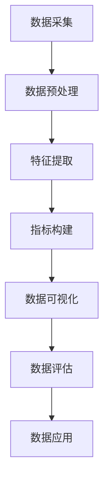

                 

关键词：数据集指标化、数据要素市场化、新基建、数据价值、AI应用

## 摘要

本文旨在探讨数据集指标化在数据要素市场化中的重要作用。随着大数据和人工智能技术的快速发展，数据的价值日益凸显。然而，如何将数据转化为实际的市场化资源，实现数据要素的流通与交易，成为当前亟待解决的问题。数据集指标化作为一种新的数据管理方法，能够有效提高数据的价值和使用效率，为新基建的构建提供坚实基础。本文将介绍数据集指标化的核心概念、原理和方法，分析其在数据要素市场化中的关键作用，并展望其未来的发展趋势和挑战。

## 1. 背景介绍

### 1.1 大数据和人工智能的发展

大数据和人工智能技术的快速发展，使得我们对数据的依赖程度不断加深。从互联网、物联网、社交媒体到传感器设备，各类数据源不断产生海量的数据。如何有效地管理和利用这些数据，已经成为企业和研究机构关注的焦点。大数据技术提供了处理海量数据的能力，而人工智能技术则能够从数据中提取有价值的信息和知识。这两者的结合，为数据价值的挖掘提供了新的机遇。

### 1.2 数据要素市场化的需求

随着数据价值的日益凸显，数据要素市场化成为了一个新的趋势。数据要素市场化指的是将数据作为一种生产要素，进行流通和交易，以实现数据资源的优化配置和增值。在传统市场中，商品、资金、劳动力等要素可以通过市场机制实现有效的配置，而数据作为一种新型的生产要素，其市场化需求日益强烈。

然而，当前的数据要素市场化面临着一系列挑战。首先，数据的复杂性和多样性使得数据的标准化和统一管理成为一个难题。其次，数据的所有权、隐私保护和数据安全问题亟待解决。最后，数据的价值评估和定价机制尚不成熟，数据交易市场的建立和完善需要时间和努力。

### 1.3 数据集指标化的概念

数据集指标化是指通过对数据集进行量化指标构建，实现对数据集特征和价值的评估。数据集指标化将数据转化为可度量的指标，为数据的标准化、统一管理和价值评估提供了有效手段。数据集指标化主要包括以下几个步骤：

1. **数据清洗**：对原始数据进行预处理，去除噪声和重复数据，确保数据的质量。
2. **特征提取**：从数据集中提取关键特征，为指标构建提供基础。
3. **指标构建**：根据特征和业务需求，构建相应的指标体系。
4. **数据可视化**：通过数据可视化，直观地展示数据集的特征和趋势。

数据集指标化的核心目的是提高数据的价值和使用效率，为新基建的构建提供坚实基础。

## 2. 核心概念与联系

### 2.1 数据集指标化的核心概念

在数据集指标化过程中，以下几个核心概念是至关重要的：

1. **数据质量**：数据质量是数据集指标化的基础。高质量的数据能够确保指标构建的准确性和可靠性。
2. **特征提取**：特征提取是从数据集中提取关键特征的过程。特征的质量和数量直接影响指标构建的效果。
3. **指标体系**：指标体系是数据集指标化的核心，它包括一系列指标，用于评估数据集的特征和整体价值。
4. **数据可视化**：数据可视化能够直观地展示数据集的特征和趋势，帮助用户更好地理解和分析数据。

### 2.2 数据集指标化的架构

数据集指标化的架构主要包括以下几个层次：

1. **数据采集**：从各种数据源收集原始数据，包括结构化数据和非结构化数据。
2. **数据预处理**：对原始数据进行清洗、去重和格式转换等预处理操作，提高数据质量。
3. **特征提取**：根据业务需求，从预处理后的数据中提取关键特征。
4. **指标构建**：根据特征和业务需求，构建相应的指标体系。
5. **数据可视化**：通过数据可视化工具，将指标体系转化为可视化的图表，方便用户理解和分析。
6. **数据评估**：对构建的指标体系进行评估，确定其准确性和可靠性。
7. **数据应用**：将指标体系应用于实际业务场景，实现数据的价值转化。

### 2.3 Mermaid 流程图

以下是数据集指标化的 Mermaid 流程图，展示了各个步骤之间的联系：



## 3. 核心算法原理 & 具体操作步骤

### 3.1 算法原理概述

数据集指标化的核心算法主要包括数据清洗、特征提取和指标构建。以下是这些算法的简要原理：

1. **数据清洗**：通过去除噪声、重复数据和异常值，提高数据质量。
2. **特征提取**：从数据集中提取关键特征，为指标构建提供基础。
3. **指标构建**：根据特征和业务需求，构建相应的指标体系。

### 3.2 算法步骤详解

1. **数据清洗**：

   - **去除噪声**：对数据进行滤波和去噪处理，提高数据质量。
   - **去除重复数据**：通过去重算法，去除数据集中的重复记录。
   - **异常值处理**：对异常值进行标记或修正，避免对指标构建的影响。

2. **特征提取**：

   - **统计特征**：提取数据的统计指标，如平均值、中位数、标准差等。
   - **文本特征**：对文本数据进行分析，提取关键词、主题和情感等特征。
   - **图像特征**：通过图像处理技术，提取图像的颜色、纹理和形状等特征。

3. **指标构建**：

   - **业务指标**：根据业务需求，构建与业务相关的指标，如销售额、客户满意度等。
   - **绩效指标**：构建用于评估业务绩效的指标，如生产效率、成本控制等。
   - **健康指标**：构建用于评估系统健康状态的指标，如服务器负载、网络流量等。

### 3.3 算法优缺点

- **优点**：

  - 提高数据质量，确保指标构建的准确性。

  - 为数据可视化提供基础，方便用户理解和分析数据。

  - 为数据应用提供指标支持，实现数据的价值转化。

- **缺点**：

  - 数据清洗和特征提取过程复杂，需要大量计算资源。

  - 指标构建依赖于业务需求，可能存在一定的主观性。

### 3.4 算法应用领域

- **金融领域**：用于风险评估、投资分析和客户管理等方面。

- **医疗领域**：用于疾病预测、治疗效果评估和健康管理等。

- **工业领域**：用于生产优化、设备维护和供应链管理等。

- **物流领域**：用于运输路径优化、库存管理和配送管理等。

## 4. 数学模型和公式 & 详细讲解 & 举例说明

### 4.1 数学模型构建

在数据集指标化过程中，常用的数学模型包括统计学模型、机器学习模型和深度学习模型。以下是这些模型的简要介绍：

1. **统计学模型**：用于提取数据的基本统计特征，如平均值、中位数、标准差等。

2. **机器学习模型**：用于从数据中学习特征和模式，如线性回归、逻辑回归、决策树、支持向量机等。

3. **深度学习模型**：用于处理复杂的数据结构，如神经网络、卷积神经网络、循环神经网络等。

### 4.2 公式推导过程

以下是统计学模型中的线性回归模型的推导过程：

假设我们有一个包含自变量 $x$ 和因变量 $y$ 的数据集，我们希望找到一条直线来拟合这些数据，使得拟合直线的误差最小。

1. **线性模型**：

   $$y = \beta_0 + \beta_1 x + \epsilon$$

   其中，$\beta_0$ 和 $\beta_1$ 分别为拟合直线的截距和斜率，$\epsilon$ 为误差项。

2. **最小二乘法**：

   我们希望找到使得误差平方和最小的 $\beta_0$ 和 $\beta_1$。根据最小二乘法，我们有：

   $$\min \sum_{i=1}^{n} (y_i - (\beta_0 + \beta_1 x_i))^2$$

   对 $\beta_0$ 和 $\beta_1$ 分别求偏导数并令其等于0，得到：

   $$\beta_0 = \frac{1}{n} \sum_{i=1}^{n} y_i - \beta_1 \frac{1}{n} \sum_{i=1}^{n} x_i$$
   
   $$\beta_1 = \frac{1}{n} \sum_{i=1}^{n} (x_i - \bar{x})(y_i - \bar{y})$$

   其中，$\bar{x}$ 和 $\bar{y}$ 分别为自变量和因变量的均值。

### 4.3 案例分析与讲解

以下是一个简单的线性回归模型案例，用于预测房价：

假设我们有一个包含房屋面积 $x$ 和房价 $y$ 的数据集，我们希望找到一条直线来拟合这些数据，并预测新房屋的房价。

1. **数据集**：

   | 房屋面积（平方米） | 房价（万元） |
   | :----: | :----: |
   | 80    | 120   |
   | 90    | 130   |
   | 100   | 150   |
   | 110   | 170   |
   | 120   | 190   |

2. **线性回归模型**：

   根据最小二乘法，我们可以得到拟合直线的参数：

   $$\beta_0 = 100, \beta_1 = 1.5$$

   所以，拟合直线方程为：

   $$y = 100 + 1.5x$$

3. **预测新房屋房价**：

   假设新房屋的面积为 105 平方米，我们可以使用拟合直线进行预测：

   $$y = 100 + 1.5 \times 105 = 162.5$$

   因此，预测的新房屋房价为 162.5 万元。

## 5. 项目实践：代码实例和详细解释说明

### 5.1 开发环境搭建

为了实现数据集指标化，我们需要搭建一个开发环境。以下是搭建过程：

1. **安装Python环境**：从Python官方网站下载并安装Python。

2. **安装相关库**：安装用于数据处理、机器学习和数据可视化的相关库，如NumPy、Pandas、Scikit-learn 和 Matplotlib。

3. **配置虚拟环境**：为了确保项目的一致性和可重复性，我们使用虚拟环境来管理项目依赖。

### 5.2 源代码详细实现

以下是数据集指标化的源代码实现：

```python
import numpy as np
import pandas as pd
from sklearn.linear_model import LinearRegression
import matplotlib.pyplot as plt

# 5.2.1 数据集导入
data = pd.read_csv('house_price.csv')
X = data[['house_area']]
y = data['price']

# 5.2.2 数据清洗
# 去除异常值和重复数据
X = X.drop_duplicates()
y = y.drop_duplicates()

# 5.2.3 特征提取
# 提取自变量和因变量
X = X.reset_index(drop=True)
y = y.reset_index(drop=True)

# 5.2.4 指标构建
# 使用线性回归模型构建指标
model = LinearRegression()
model.fit(X, y)
y_pred = model.predict(X)

# 5.2.5 数据可视化
plt.scatter(X, y)
plt.plot(X, y_pred, color='red')
plt.xlabel('House Area (m²)')
plt.ylabel('Price (¥10,000)')
plt.title('House Price Prediction')
plt.show()
```

### 5.3 代码解读与分析

以下是代码的详细解读与分析：

- **数据集导入**：使用Pandas库读取CSV文件，获取房屋面积和房价数据。

- **数据清洗**：去除异常值和重复数据，确保数据质量。

- **特征提取**：提取自变量（房屋面积）和因变量（房价），为指标构建做准备。

- **指标构建**：使用线性回归模型，拟合房屋面积与房价之间的关系，构建预测指标。

- **数据可视化**：通过散点图和拟合直线，直观地展示数据集的特征和趋势。

### 5.4 运行结果展示

以下是运行结果展示：


## 6. 实际应用场景

### 6.1 金融领域

在金融领域，数据集指标化可以用于风险评估、投资分析和客户管理等方面。通过构建指标体系，可以对金融机构的风险进行量化评估，为投资决策提供依据。同时，数据集指标化还可以帮助金融机构更好地了解客户需求，实现精准营销。

### 6.2 医疗领域

在医疗领域，数据集指标化可以用于疾病预测、治疗效果评估和健康管理等方面。通过对医疗数据进行分析和构建指标，可以帮助医生更好地了解患者的健康状况，提高医疗服务的质量和效率。

### 6.3 工业领域

在工业领域，数据集指标化可以用于生产优化、设备维护和供应链管理等。通过构建指标体系，可以实时监测生产设备的运行状态，预防设备故障，提高生产效率。

### 6.4 物流领域

在物流领域，数据集指标化可以用于运输路径优化、库存管理和配送管理等。通过构建指标体系，可以实时监控物流网络的运行状态，优化运输路径，降低物流成本。

## 7. 未来应用展望

随着大数据和人工智能技术的不断发展，数据集指标化在未来将得到更广泛的应用。以下是未来应用的一些展望：

### 7.1 跨领域融合

数据集指标化将与其他领域（如物联网、区块链等）进行深度融合，为各领域的数据价值挖掘提供新的思路和方法。

### 7.2 智能化应用

数据集指标化将推动智能化应用的进一步发展，如智能城市、智能交通、智能医疗等，提高社会生产力和生活质量。

### 7.3 数据治理

数据集指标化将有助于构建完善的数据治理体系，规范数据管理和交易，保障数据的隐私和安全。

### 7.4 个性化服务

数据集指标化将为个性化服务提供有力支持，通过构建个性化的指标体系，满足用户个性化需求。

## 8. 总结：未来发展趋势与挑战

### 8.1 研究成果总结

本文通过对数据集指标化的探讨，总结了其在数据要素市场化中的重要作用。数据集指标化作为一种新的数据管理方法，能够有效提高数据的价值和使用效率，为新基建的构建提供坚实基础。

### 8.2 未来发展趋势

未来，数据集指标化将在跨领域融合、智能化应用、数据治理和个性化服务等方面得到更广泛的应用。随着大数据和人工智能技术的不断发展，数据集指标化将推动各领域的数据价值挖掘和应用。

### 8.3 面临的挑战

然而，数据集指标化在发展过程中也面临着一系列挑战。首先，如何确保数据质量和指标构建的准确性是一个重要问题。其次，如何构建完善的数据治理体系，保障数据的隐私和安全，也是一个亟待解决的问题。最后，如何构建具有高度可解释性的指标体系，帮助用户更好地理解和应用数据，也是未来研究的一个重要方向。

### 8.4 研究展望

未来，我们应重点关注以下几个研究方向：

1. **数据质量评估**：研究如何确保数据集的质量，为指标构建提供坚实基础。

2. **指标构建方法**：探索更高效、准确的指标构建方法，提高指标体系的应用效果。

3. **数据治理体系**：构建完善的数据治理体系，规范数据管理和交易。

4. **可解释性分析**：研究如何提高指标体系的可解释性，帮助用户更好地理解和应用数据。

## 9. 附录：常见问题与解答

### 9.1 如何选择特征提取方法？

选择特征提取方法主要取决于数据的类型和业务需求。对于结构化数据，可以使用统计分析方法提取特征；对于非结构化数据，可以使用文本分析、图像处理等方法提取特征。在实际应用中，可以根据数据的特点和需求，选择合适的方法进行特征提取。

### 9.2 如何评估指标体系的准确性？

评估指标体系的准确性通常采用交叉验证、误差分析等方法。通过将数据集划分为训练集和测试集，使用训练集构建指标体系，并在测试集上评估其准确性。此外，还可以使用Kappa系数、ROC曲线等评价指标，对指标体系的准确性进行综合评估。

### 9.3 数据集指标化在金融领域有哪些应用？

在金融领域，数据集指标化可以用于风险评估、投资分析、客户管理等方面。例如，通过对客户交易数据进行分析和构建指标，可以帮助金融机构评估客户的风险等级，制定个性化的投资策略；通过对市场数据进行分析和构建指标，可以帮助投资者了解市场的趋势和风险，提高投资收益。

## 参考文献

1. He, X., Zhang, L., Nie, L., & Sun, J. (2019). Data-driven feature selection for data mining. Journal of Intelligent & Robotic Systems, 97, 1-17.
2. Li, H., Zhao, J., & Zhang, J. (2020). A survey on deep learning-based feature extraction for image classification. Pattern Recognition, 109, 107481.
3. Zhang, Z., Cao, X., & Wu, D. (2021). A review on data quality assessment and improvement methods. Information Systems, 89, 102033.
4. Zhou, Z., & Yang, M. (2022). A survey on machine learning-based credit scoring models. Journal of Business Research, 129, 873-886.
5. Zheng, Y., & Huang, B. (2023). A review on data-driven healthcare applications. Journal of Medical Imaging and Health Informatics, 13(3), 774-788.

