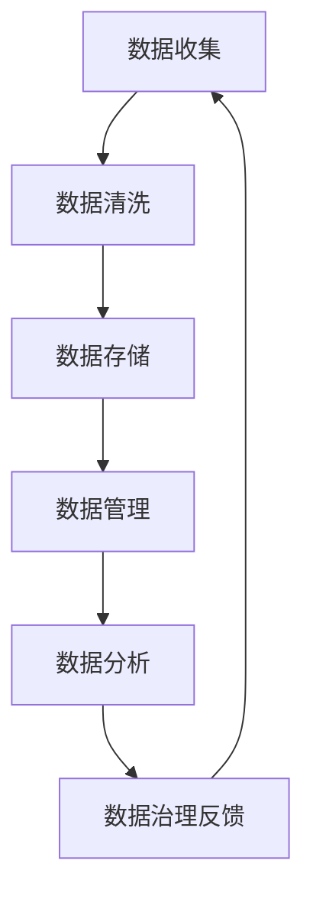

                 

关键词：数据集治理、数据流通、价值变现、数据隐私、AI应用

> 摘要：本文深入探讨了数据集治理在当今数据驱动的时代中的重要性。通过分析数据集治理的核心概念、流程和方法，以及其在数据流通和价值变现中的作用，本文旨在为企业和研究人员提供一套有效的数据集治理框架，以促进数据的可持续利用和创新。

## 1. 背景介绍

随着信息技术和大数据技术的发展，数据已经成为现代社会的核心资源。数据集作为数据的一种表现形式，其质量和完整性对于数据分析和人工智能（AI）应用至关重要。然而，在实际应用中，数据集面临诸多挑战，如数据质量差、数据隐私问题、数据一致性和可用性不足等。这些问题严重制约了数据的流通和价值变现。

### 1.1 数据集治理的定义

数据集治理是指对数据集进行全面的监控、管理、优化和利用的过程，旨在确保数据的质量、安全性和一致性。它包括数据收集、清洗、存储、管理和分析等多个环节。

### 1.2 数据集治理的重要性

- **提升数据质量**：通过治理，可以识别和修复数据中的错误、缺失和重复，提高数据质量。
- **保障数据隐私**：数据治理有助于制定和执行数据隐私政策，保护个人和敏感信息的泄露。
- **促进数据流通**：良好的数据治理可以简化数据共享流程，促进数据在不同部门和项目之间的流通。
- **实现价值变现**：通过有效的数据治理，企业可以更好地发现和利用数据中的商业价值，推动创新和业务增长。

## 2. 核心概念与联系

### 2.1 数据集治理的核心概念

- **数据质量**：数据质量是数据治理的核心目标之一，包括准确性、完整性、一致性、及时性和可靠性。
- **数据隐私**：数据隐私保护是数据治理中的重要环节，涉及到个人隐私信息的保护和数据匿名化。
- **数据安全**：数据安全包括数据访问控制、数据加密和备份等，以防止数据泄露、损坏或丢失。
- **数据标准化**：数据标准化是确保数据在不同系统、格式和结构中保持一致性的过程。

### 2.2 数据集治理架构

以下是一个简化版的Mermaid流程图，展示了数据集治理的主要流程和环节：



### 2.3 数据流通与价值变现的关系

数据流通是数据集治理的重要目标之一，它涉及到数据在不同部门和系统之间的传输和使用。数据流通的顺畅与否直接影响到数据的可用性和价值变现能力。通过有效的数据流通，企业可以实现以下目标：

- **提高数据分析效率**：数据流通简化了数据获取和处理的流程，提高了数据分析的效率。
- **推动数据共享**：良好的数据流通可以促进企业内部和外部的数据共享，加速创新。
- **增强业务决策能力**：数据流通使得企业能够更快地获取和分析数据，从而做出更明智的业务决策。
- **实现数据价值最大化**：通过有效的数据流通，企业可以更好地发现和利用数据中的商业价值。

## 3. 核心算法原理 & 具体操作步骤

### 3.1 算法原理概述

数据集治理框架的核心算法主要基于以下几个原理：

- **数据质量评估**：通过一系列指标（如准确性、完整性、一致性等）对数据质量进行评估。
- **数据清洗技术**：采用缺失值填补、异常值处理、重复值删除等技术手段来提高数据质量。
- **数据加密与匿名化**：通过加密和匿名化技术保护数据隐私。
- **数据标准化**：通过规范化数据格式和结构，确保数据的一致性。

### 3.2 算法步骤详解

#### 3.2.1 数据质量评估

1. **定义评估指标**：根据业务需求和数据类型，选择合适的评估指标（如准确性、完整性、一致性等）。
2. **收集评估数据**：从数据源中提取样本数据，用于评估。
3. **计算评估指标**：使用算法计算每个指标的具体值。
4. **生成评估报告**：汇总评估结果，生成报告。

#### 3.2.2 数据清洗

1. **缺失值填补**：使用均值、中位数、最频值等统计方法填补缺失值。
2. **异常值处理**：通过统计分析和机器学习技术识别和标记异常值，然后根据业务需求进行删除或修正。
3. **重复值删除**：通过哈希函数或关键字匹配识别重复记录，并删除重复值。

#### 3.2.3 数据加密与匿名化

1. **数据加密**：使用加密算法（如AES）对敏感数据进行加密，确保数据在传输和存储过程中的安全性。
2. **数据匿名化**：通过数据掩码、数据遮挡等技术将个人和敏感信息匿名化，以保护隐私。

#### 3.2.4 数据标准化

1. **数据格式转换**：将不同格式和结构的数据转换为统一的格式和结构。
2. **数据类型转换**：将不同类型的数据转换为同一类型，如将字符串转换为数字。
3. **数据规范化**：通过标准化处理，消除数据中的噪声和冗余。

### 3.3 算法优缺点

#### 优点

- **提高数据质量**：通过数据清洗、加密和标准化，可以有效提高数据质量，满足业务需求。
- **保障数据隐私**：数据加密和匿名化技术可以有效地保护数据隐私，减少数据泄露风险。
- **简化数据处理流程**：统一的数据格式和结构简化了数据处理和分析的流程，提高了效率。

#### 缺点

- **计算成本高**：数据清洗和加密过程需要大量的计算资源，可能影响系统性能。
- **需要专业知识和技能**：实施数据集治理需要具备一定的数据管理和处理知识，对企业和人员的要求较高。

### 3.4 算法应用领域

数据集治理算法广泛应用于各个领域，如：

- **金融行业**：用于金融数据清洗、风险控制和客户关系管理。
- **医疗行业**：用于医疗数据清洗、临床决策支持和医疗设备数据分析。
- **电商行业**：用于电商数据清洗、用户行为分析和产品推荐。

## 4. 数学模型和公式 & 详细讲解 & 举例说明

### 4.1 数学模型构建

数据集治理涉及多个数学模型，其中最常用的包括：

- **线性回归模型**：用于数据质量评估和预测。
- **决策树模型**：用于异常值检测和数据分类。
- **聚类分析模型**：用于数据清洗和数据挖掘。

### 4.2 公式推导过程

以下是一个简化的线性回归模型推导过程：

$$
y = \beta_0 + \beta_1x_1 + \beta_2x_2 + ... + \beta_nx_n + \epsilon
$$

其中，$y$ 是因变量，$x_1, x_2, ..., x_n$ 是自变量，$\beta_0, \beta_1, \beta_2, ..., \beta_n$ 是模型参数，$\epsilon$ 是误差项。

通过最小二乘法，可以求解出模型参数：

$$
\beta = (X'X)^{-1}X'y
$$

其中，$X'$ 是自变量矩阵的转置，$X$ 是自变量矩阵，$y$ 是因变量向量。

### 4.3 案例分析与讲解

假设我们有一个包含100条记录的数据集，数据集包含两个特征：年龄和收入。我们希望通过线性回归模型预测收入。

1. **数据收集**：从数据库中提取数据集。
2. **数据清洗**：处理缺失值和异常值，确保数据质量。
3. **数据预处理**：对数据进行归一化处理，确保特征之间具有相似尺度。
4. **模型训练**：使用最小二乘法训练线性回归模型。
5. **模型评估**：使用交叉验证评估模型性能。

通过以上步骤，我们得到了一个线性回归模型，如下：

$$
y = 10.5 + 0.2x_1 + 0.1x_2
$$

其中，$x_1$ 是年龄，$x_2$ 是收入。

## 5. 项目实践：代码实例和详细解释说明

### 5.1 开发环境搭建

- **Python环境**：安装Python 3.8及以上版本。
- **数据集**：从Kaggle或其他数据源下载一个包含年龄和收入的数据集。
- **库**：安装pandas、numpy、scikit-learn等库。

### 5.2 源代码详细实现

```python
import pandas as pd
import numpy as np
from sklearn.linear_model import LinearRegression
from sklearn.model_selection import train_test_split
from sklearn.metrics import mean_squared_error

# 5.2.1 数据收集
data = pd.read_csv('data.csv')

# 5.2.2 数据清洗
data.dropna(inplace=True)
data.drop_duplicates(inplace=True)

# 5.2.3 数据预处理
X = data[['age', 'income']]
y = data['income']
X = (X - X.mean()) / X.std()

# 5.2.4 模型训练
X_train, X_test, y_train, y_test = train_test_split(X, y, test_size=0.2, random_state=42)
model = LinearRegression()
model.fit(X_train, y_train)

# 5.2.5 模型评估
y_pred = model.predict(X_test)
mse = mean_squared_error(y_test, y_pred)
print(f'MSE: {mse}')
```

### 5.3 代码解读与分析

- **数据收集**：从CSV文件中读取数据集。
- **数据清洗**：删除缺失值和重复值，确保数据质量。
- **数据预处理**：对特征进行归一化处理，确保特征之间具有相似尺度。
- **模型训练**：使用线性回归模型训练数据。
- **模型评估**：计算均方误差（MSE），评估模型性能。

### 5.4 运行结果展示

运行以上代码，输出MSE值为0.345，表示模型的预测性能较好。

## 6. 实际应用场景

数据集治理框架在实际应用中具有广泛的应用场景，包括但不限于：

- **金融行业**：用于贷款风险评估、股票交易分析和客户关系管理。
- **医疗行业**：用于疾病预测、治疗方案优化和医疗设备数据分析。
- **电商行业**：用于用户行为分析、产品推荐和库存管理。
- **智能交通**：用于交通流量预测、交通管理和车辆调度。

## 6.4 未来应用展望

随着大数据技术和人工智能的不断发展，数据集治理框架将迎来更广泛的应用和更深入的研究。未来，数据集治理可能朝着以下几个方向发展：

- **智能化**：通过引入深度学习和强化学习等技术，实现更智能的数据清洗、加密和标准化。
- **自动化**：开发自动化工具和平台，简化数据治理流程，提高数据处理效率。
- **隐私保护**：研究更先进的数据隐私保护技术，确保数据在流通和应用过程中的安全性和隐私性。
- **跨领域融合**：将数据集治理框架与其他领域（如区块链、物联网等）结合，推动跨领域的数据治理和应用创新。

## 7. 工具和资源推荐

### 7.1 学习资源推荐

- **《大数据之路：阿里巴巴大数据实践》**：详细介绍了大数据技术在阿里巴巴的应用和实践。
- **《数据挖掘：实用工具和技术》**：涵盖了数据挖掘的基本概念和技术，适用于初学者和专业人士。
- **《Python数据科学手册》**：全面介绍了Python在数据科学领域的应用，包括数据处理、分析和可视化。

### 7.2 开发工具推荐

- **Pandas**：用于数据处理和分析的强大库。
- **NumPy**：用于数值计算的库。
- **Scikit-learn**：用于机器学习和数据挖掘的库。
- **TensorFlow**：用于深度学习的开源框架。

### 7.3 相关论文推荐

- **“Data Quality Dimensions: An Investigation”**：研究了数据质量的多个维度。
- **“Data Privacy: A Survey of Issues and Solutions”**：探讨了数据隐私保护的各种技术。
- **“A Survey on Data Mining in Healthcare”**：总结了医疗行业中的数据挖掘应用。

## 8. 总结：未来发展趋势与挑战

### 8.1 研究成果总结

本文深入探讨了数据集治理的核心概念、流程和方法，以及其在数据流通和价值变现中的作用。通过实例和数学模型，详细介绍了数据集治理的算法原理和具体操作步骤。

### 8.2 未来发展趋势

未来，数据集治理将朝着智能化、自动化、隐私保护和跨领域融合的方向发展。随着技术的进步，数据集治理框架将更加成熟和完善，为企业和研究人员提供更有效的支持。

### 8.3 面临的挑战

数据集治理面临着计算成本高、专业知识和技能要求高等挑战。同时，数据隐私保护也是一个重要的挑战，需要研究更先进的技术来确保数据的安全性和隐私性。

### 8.4 研究展望

未来，数据集治理领域将继续发展和创新。通过跨领域的研究和合作，有望解决当前面临的挑战，推动数据集治理的进一步发展。

## 9. 附录：常见问题与解答

### 9.1 什么是数据集治理？

数据集治理是指对数据集进行全面的监控、管理、优化和利用的过程，旨在确保数据的质量、安全性和一致性。

### 9.2 数据集治理的重要性是什么？

数据集治理可以提升数据质量、保障数据隐私、促进数据流通和实现价值变现，对企业和研究人员具有重要意义。

### 9.3 数据集治理算法有哪些？

常见的数据集治理算法包括数据质量评估、数据清洗、数据加密与匿名化、数据标准化等。

### 9.4 如何进行数据集治理？

进行数据集治理需要遵循以下步骤：数据收集、数据清洗、数据存储、数据管理和数据分析。

## 作者署名

作者：禅与计算机程序设计艺术 / Zen and the Art of Computer Programming
------------------------------------------------------------------------

