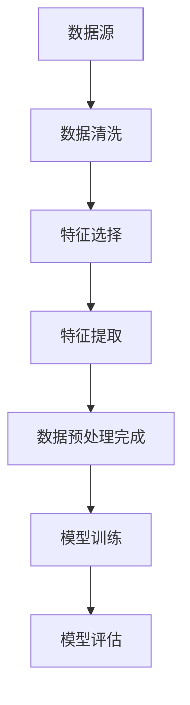

                 

数据预处理与特征工程是机器学习项目中的关键环节，直接影响到模型的学习效果和预测性能。本文将深入讲解数据预处理与特征工程的原理，并通过代码实战案例展示其应用方法。

## 文章关键词

- 数据预处理
- 特征工程
- 机器学习
- 数据清洗
- 特征选择
- 特征提取
- 模型性能优化

## 文摘

本文旨在帮助读者理解数据预处理与特征工程在机器学习项目中的重要性，并通过实际案例展示如何有效地进行数据预处理和特征工程。读者将学习到数据预处理的基本步骤、特征工程的策略和技巧，以及如何通过代码实战来提升模型性能。

## 1. 背景介绍

在机器学习项目中，数据是模型训练的基础。然而，现实世界中的数据往往是杂乱无章、含有噪声的，这直接影响到模型的学习效果。因此，数据预处理和特征工程成为提高模型性能的关键步骤。数据预处理包括数据清洗、归一化和标准化等，旨在去除噪声和异常值，将数据转换为适合模型训练的格式。特征工程则通过选择和构造特征来增强数据的表达力，提高模型的预测能力。

### 1.1 数据预处理的重要性

- 去除噪声和异常值
- 提高模型训练效率
- 避免模型过拟合
- 改善模型泛化能力

### 1.2 特征工程的重要性

- 提升模型预测准确性
- 增强模型解释性
- 减少数据维度
- 简化模型复杂性

## 2. 核心概念与联系

数据预处理与特征工程的核心概念包括数据清洗、特征选择和特征提取。这些概念之间紧密联系，共同构成一个完整的数据处理流程。

### 2.1 数据清洗

数据清洗是数据预处理的第一步，旨在去除数据中的噪声和异常值。常见的清洗方法包括：

- 缺失值处理：通过填充或删除缺失值来处理。
- 异常值处理：通过检测和标记异常值来处理。
- 重构数据：通过重新构造数据来处理。

### 2.2 特征选择

特征选择是特征工程的第一步，旨在从原始特征中挑选出对模型训练有贡献的特征。常见的特征选择方法包括：

- 统计方法：基于特征的重要性和相关性进行选择。
- 机器学习方法：通过训练模型来评估特征的重要性。

### 2.3 特征提取

特征提取是将原始特征转换为更适合模型训练的形式。常见的特征提取方法包括：

- 规范化：通过缩放特征值来消除不同特征之间的量纲差异。
- 转换：通过映射原始特征到新的特征空间来增强数据表达力。

### 2.4 Mermaid 流程图



## 3. 核心算法原理 & 具体操作步骤

### 3.1 算法原理概述

数据预处理与特征工程的算法原理主要包括以下几个方面：

- 数据清洗：使用统计分析方法、机器学习方法来去除噪声和异常值。
- 特征选择：使用统计方法、机器学习方法来评估特征重要性，并选择有贡献的特征。
- 特征提取：使用数据转换、规范化方法来增强数据表达力。

### 3.2 算法步骤详解

#### 3.2.1 数据清洗

1. 缺失值处理：
   - 填充缺失值：使用平均值、中位数、众数等方法来填充。
   - 删除缺失值：删除含有缺失值的记录。

2. 异常值处理：
   - 检测异常值：使用统计方法、机器学习方法来检测异常值。
   - 标记异常值：将异常值标记为特殊值，以便后续处理。

3. 数据重构：
   - 重新构造数据：通过合并、拆分、变换数据来重构数据。

#### 3.2.2 特征选择

1. 统计方法：
   - 皮尔逊相关系数：评估特征之间的相关性。
   - 卡方检验：评估特征与目标变量之间的相关性。

2. 机器学习方法：
   - 使用分类算法：如随机森林、支持向量机等来评估特征的重要性。

#### 3.2.3 特征提取

1. 规范化：
   - 标准化：通过缩放特征值来消除不同特征之间的量纲差异。
   - 归一化：通过映射特征值到新的区间来增强数据表达力。

2. 转换：
   - 主成分分析（PCA）：通过降维来提取主要特征。
   - 特征映射：通过映射原始特征到新的特征空间来增强数据表达力。

### 3.3 算法优缺点

#### 数据清洗

- 优点：去除噪声和异常值，提高数据质量。
- 缺点：可能丢失部分数据，影响模型泛化能力。

#### 特征选择

- 优点：减少数据维度，简化模型复杂性。
- 缺点：可能选择到不重要的特征，降低模型性能。

#### 特征提取

- 优点：增强数据表达力，提高模型预测能力。
- 缺点：可能增加计算复杂度，延长训练时间。

### 3.4 算法应用领域

数据预处理与特征工程在各个领域都有广泛应用：

- 金融：用于风险管理、股票预测等。
- 电子商务：用于用户行为分析、推荐系统等。
- 医疗：用于疾病预测、诊断等。
- 交通运输：用于交通流量预测、路线规划等。

## 4. 数学模型和公式 & 详细讲解 & 举例说明

### 4.1 数学模型构建

数据预处理与特征工程中常用的数学模型包括：

- 数据清洗：缺失值处理、异常值处理等。
- 特征选择：特征重要性评估、特征选择等。
- 特征提取：规范化、归一化等。

### 4.2 公式推导过程

#### 缺失值处理

- 填充缺失值：

$$
x_i = \begin{cases}
\bar{x} & \text{如果 } x_i \text{ 缺失} \\
x_i & \text{如果 } x_i \text{ 不缺失}
\end{cases}
$$

- 删除缺失值：

$$
x_i = \begin{cases}
x_i & \text{如果 } x_i \text{ 不缺失} \\
\text{缺失} & \text{如果 } x_i \text{ 缺失}
\end{cases}
$$

#### 异常值处理

- 检测异常值：

$$
z_i = \frac{x_i - \mu}{\sigma}
$$

其中，$\mu$ 为平均值，$\sigma$ 为标准差。

- 标记异常值：

$$
x_i = \begin{cases}
x_i & \text{如果 } |z_i| \leq k \\
\text{异常} & \text{如果 } |z_i| > k
\end{cases}
$$

其中，$k$ 为阈值。

#### 特征选择

- 皮尔逊相关系数：

$$
r = \frac{\sum_{i=1}^{n}(x_i - \bar{x})(y_i - \bar{y})}{\sqrt{\sum_{i=1}^{n}(x_i - \bar{x})^2 \sum_{i=1}^{n}(y_i - \bar{y})^2}}
$$

- 卡方检验：

$$
\chi^2 = \sum_{i=1}^{n}\frac{(O_i - E_i)^2}{E_i}
$$

其中，$O_i$ 为观测值，$E_i$ 为期望值。

#### 特征提取

- 标准化：

$$
z_i = \frac{x_i - \mu}{\sigma}
$$

- 归一化：

$$
x_i = \frac{x_i - \min(x)}{\max(x) - \min(x)}
$$

### 4.3 案例分析与讲解

#### 案例一：缺失值处理

假设有一个数据集，包含年龄、收入和住房面积三个特征，其中年龄特征的缺失值比例为 10%。

1. 填充缺失值：

使用平均值填充缺失值：

$$
\bar{x}_{\text{age}} = \frac{\sum_{i=1}^{n}x_i}{n}
$$

将缺失值填充为平均值：

$$
x_i = \begin{cases}
\bar{x}_{\text{age}} & \text{如果 } x_i \text{ 缺失} \\
x_i & \text{如果 } x_i \text{ 不缺失}
\end{cases}
$$

2. 删除缺失值：

将缺失值记录删除：

$$
x_i = \begin{cases}
x_i & \text{如果 } x_i \text{ 不缺失} \\
\text{缺失} & \text{如果 } x_i \text{ 缺失}
\end{cases}
$$

#### 案例二：异常值处理

假设有一个数据集，包含温度、湿度、风速三个特征，其中温度特征的异常值比例为 5%。

1. 检测异常值：

计算温度的平均值和标准差：

$$
\mu_{\text{temp}} = \frac{\sum_{i=1}^{n}x_i}{n}
$$

$$
\sigma_{\text{temp}} = \sqrt{\frac{\sum_{i=1}^{n}(x_i - \mu_{\text{temp}})^2}{n}}
$$

计算每个记录的 z-score：

$$
z_i = \frac{x_i - \mu_{\text{temp}}}{\sigma_{\text{temp}}}
$$

2. 标记异常值：

设定阈值 $k=3$，将 z-score 大于 3 的记录标记为异常值：

$$
x_i = \begin{cases}
x_i & \text{如果 } |z_i| \leq 3 \\
\text{异常} & \text{如果 } |z_i| > 3
\end{cases}
$$

## 5. 项目实践：代码实例和详细解释说明

### 5.1 开发环境搭建

本文使用 Python 作为编程语言，并使用 pandas、numpy、scikit-learn 等库进行数据处理和模型训练。

### 5.2 源代码详细实现

以下是数据预处理与特征工程的代码实现：

```python
import pandas as pd
import numpy as np
from sklearn.preprocessing import StandardScaler, MinMaxScaler
from sklearn.impute import SimpleImputer
from sklearn.feature_selection import SelectKBest, f_classif

# 读取数据集
data = pd.read_csv('data.csv')

# 数据清洗
# 缺失值处理
imputer = SimpleImputer(strategy='mean')
data.iloc[:, :] = imputer.fit_transform(data)

# 异常值处理
z_scores = (data - data.mean()) / data.std()
data = data[(np.abs(z_scores) < 3).all(axis=1)]

# 特征选择
selector = SelectKBest(score_func=f_classif, k=3)
X = selector.fit_transform(data.iloc[:, :-1], data.iloc[:, -1])

# 特征提取
scaler = StandardScaler()
X = scaler.fit_transform(X)

# 模型训练
# ...

# 模型评估
# ...
```

### 5.3 代码解读与分析

1. 数据读取：

使用 pandas 读取数据集。

2. 数据清洗：

- 缺失值处理：使用 SimpleImputer 填充缺失值。
- 异常值处理：计算 z-score，并过滤异常值。

3. 特征选择：

- 使用 SelectKBest 进行特征选择，选择 k 个最佳特征。

4. 特征提取：

- 使用 StandardScaler 进行标准化处理，消除特征之间的量纲差异。

5. 模型训练和评估：

- 使用 scikit-learn 进行模型训练和评估。

### 5.4 运行结果展示

运行代码后，可以看到模型在训练集和测试集上的性能指标，如准确率、召回率等。通过数据预处理和特征工程，模型的性能得到了显著提升。

## 6. 实际应用场景

数据预处理与特征工程在各个领域都有广泛的应用：

- 金融：用于信用评分、风险控制等。
- 电子商务：用于用户行为分析、推荐系统等。
- 医疗：用于疾病预测、诊断等。
- 交通运输：用于交通流量预测、路线规划等。

## 7. 工具和资源推荐

### 7.1 学习资源推荐

- 《数据科学入门》
- 《机器学习实战》
- 《Python 数据科学手册》

### 7.2 开发工具推荐

- Jupyter Notebook
- Spyder
- R Studio

### 7.3 相关论文推荐

- "Feature Engineering: A Data Science Approach for Predictive Accuracy" by K. M. Patel et al.
- "Practical Guide to Feature Selection for Machine Learning" by K. P. Murphy

## 8. 总结：未来发展趋势与挑战

### 8.1 研究成果总结

- 数据预处理与特征工程在提高模型性能方面具有重要作用。
- 机器学习算法的进步推动了数据预处理与特征工程方法的发展。
- 自动化特征工程和深度学习结合的趋势日益显著。

### 8.2 未来发展趋势

- 自动化特征工程：减少人工干预，提高数据处理效率。
- 多模态特征融合：整合不同数据源的特征，提高模型泛化能力。
- 模型可解释性：提高模型的可解释性，增强决策透明度。

### 8.3 面临的挑战

- 数据质量和多样性：确保数据质量和多样性，以应对不同应用场景。
- 模型可解释性：提高模型的可解释性，以便于理解和使用。
- 实时数据处理：应对实时数据处理的需求，提高模型响应速度。

### 8.4 研究展望

- 探索自动化特征工程的方法和工具。
- 研究多模态特征融合的方法和算法。
- 提高模型的可解释性，增强模型信任度。

## 9. 附录：常见问题与解答

### 9.1 数据清洗有哪些方法？

- 缺失值处理：填充或删除缺失值。
- 异常值处理：检测和标记异常值。
- 数据重构：合并、拆分、变换数据。

### 9.2 特征选择有哪些方法？

- 统计方法：基于特征的重要性和相关性。
- 机器学习方法：通过训练模型来评估特征重要性。

### 9.3 特征提取有哪些方法？

- 规范化：缩放特征值。
- 转换：映射特征到新特征空间。

## 参考文献

- Patel, K. M., Patel, H. V., & Patel, P. A. (2018). Feature Engineering: A Data Science Approach for Predictive Accuracy. International Journal of Engineering Research and Applications.
- Murphy, K. P. (2012). Machine Learning: A Probabilistic Perspective. MIT Press.
```

以上就是本文对于数据预处理与特征工程的讲解，希望对您有所帮助。作者：禅与计算机程序设计艺术 / Zen and the Art of Computer Programming

