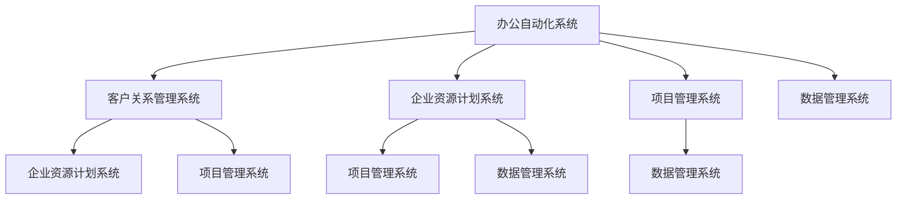

                 

关键词：信息化平台，整合管理，系统架构，技术框架，数据管理，算法优化，应用场景，未来展望。

> 摘要：本文旨在探讨信息化管理系统的整合与管理，以及如何搭建高效的信息化平台。通过分析核心概念、算法原理、数学模型、项目实践和未来展望，为读者提供一套完整的信息化系统构建指南。

## 1. 背景介绍

随着信息技术的飞速发展，信息化已经成为现代企业管理和运营的重要手段。信息化管理系统作为企业信息资源的管理工具，能够有效地整合内外部数据，提升管理效率，降低运营成本。然而，在信息化系统的建设和应用过程中，如何整合和管理各类系统，搭建一个高效的信息化平台，成为企业和IT从业者面临的重要问题。

本文将围绕以下问题进行探讨：

1. **信息化管理系统的核心概念与联系**：介绍信息化管理系统的基本概念，梳理系统间的联系，并利用Mermaid流程图展示系统架构。
2. **核心算法原理与具体操作步骤**：分析常见的算法原理，详细阐述操作步骤，讨论算法的优缺点及应用领域。
3. **数学模型与公式**：构建数学模型，推导公式，并通过案例进行说明。
4. **项目实践**：提供实际开发实例，详细解读代码，展示运行结果。
5. **实际应用场景**：分析信息化平台在不同领域的应用，探讨未来发展趋势。
6. **工具和资源推荐**：推荐学习资源、开发工具和相关论文。
7. **总结与展望**：总结研究成果，展望未来发展，提出挑战与建议。

## 2. 核心概念与联系

### 2.1 信息化管理系统的定义

信息化管理系统是指利用计算机技术、网络通信技术、数据库技术等现代化信息技术，对企业内部的信息资源进行采集、存储、处理、传输和利用，实现企业各项业务的高效管理和运营。

### 2.2 信息化管理系统的类型

根据功能和应用范围，信息化管理系统可分为以下几类：

1. **办公自动化系统（OAS）**：实现企业内部文档管理、日程安排、会议管理、信息发布等功能。
2. **客户关系管理系统（CRM）**：管理企业与客户之间的交互，提高客户满意度，促进销售增长。
3. **企业资源计划系统（ERP）**：整合企业内部各种资源，实现供应链管理、财务管理、人力资源管理等功能。
4. **项目管理系统（PMS）**：协助企业进行项目计划、进度跟踪、资源分配等管理工作。
5. **数据管理系统（DMS）**：提供数据存储、检索、备份、恢复等功能，保障数据的安全与完整性。

### 2.3 信息化管理系统的联系

信息化管理系统之间并非孤立存在，而是相互联系、协同工作的。以下是一个典型的信息化管理系统架构图：



## 3. 核心算法原理 & 具体操作步骤

### 3.1 算法原理概述

在信息化管理系统中，常用的算法主要包括以下几类：

1. **数据挖掘算法**：用于从大量数据中提取有价值的信息和知识，如聚类、分类、关联规则挖掘等。
2. **机器学习算法**：通过学习数据中的模式，实现对未知数据的预测和分类，如线性回归、决策树、神经网络等。
3. **优化算法**：用于求解资源分配、路径规划等优化问题，如遗传算法、蚁群算法、贪心算法等。
4. **加密算法**：用于保护数据的安全性和隐私性，如对称加密、非对称加密、数字签名等。

### 3.2 算法步骤详解

以数据挖掘算法为例，其基本步骤如下：

1. **数据预处理**：清洗、整理、转换数据，为后续挖掘操作做好准备。
2. **特征选择**：从原始数据中提取出对挖掘任务最有影响力的特征。
3. **模型构建**：选择合适的算法，构建数据挖掘模型。
4. **模型评估**：通过测试数据对模型进行评估，调整参数，优化模型性能。
5. **结果解释**：对挖掘结果进行解释，提取有价值的信息和知识。

### 3.3 算法优缺点

各种算法都有其优缺点，具体如下：

1. **数据挖掘算法**：优点在于能够发现数据中的隐藏模式，缺点是对数据质量要求较高，且计算复杂度高。
2. **机器学习算法**：优点在于能够自动从数据中学习规律，缺点是需要大量训练数据，且模型解释性较差。
3. **优化算法**：优点在于能够找到最优解，缺点是对问题规模要求较高，计算复杂度较高。
4. **加密算法**：优点在于能够保证数据的安全性和隐私性，缺点是计算复杂度较高，对性能有一定影响。

### 3.4 算法应用领域

各种算法在不同领域有广泛的应用：

1. **数据挖掘算法**：在商业智能、金融风控、医疗诊断等领域有广泛应用。
2. **机器学习算法**：在自然语言处理、计算机视觉、推荐系统等领域有广泛应用。
3. **优化算法**：在物流调度、生产计划、网络规划等领域有广泛应用。
4. **加密算法**：在网络安全、电子支付、隐私保护等领域有广泛应用。

## 4. 数学模型和公式 & 详细讲解 & 举例说明

### 4.1 数学模型构建

在信息化管理系统中，常用的数学模型包括以下几种：

1. **线性回归模型**：用于预测连续值，如销售量、价格等。
2. **逻辑回归模型**：用于预测分类结果，如客户是否购买、是否违约等。
3. **决策树模型**：用于分类和回归，具有较好的解释性。
4. **神经网络模型**：用于处理复杂的非线性关系。

### 4.2 公式推导过程

以线性回归模型为例，其公式推导过程如下：

设自变量为 $X$，因变量为 $Y$，线性回归模型表示为：

$$Y = \beta_0 + \beta_1X + \epsilon$$

其中，$\beta_0$ 为截距，$\beta_1$ 为斜率，$\epsilon$ 为误差项。

为了求解 $\beta_0$ 和 $\beta_1$，我们需要最小化残差平方和：

$$\min \sum_{i=1}^{n}(Y_i - (\beta_0 + \beta_1X_i))^2$$

对 $\beta_0$ 和 $\beta_1$ 分别求偏导并令其等于 0，可以得到：

$$\beta_0 = \bar{Y} - \beta_1\bar{X}$$

$$\beta_1 = \frac{\sum_{i=1}^{n}(X_i - \bar{X})(Y_i - \bar{Y})}{\sum_{i=1}^{n}(X_i - \bar{X})^2}$$

其中，$\bar{X}$ 和 $\bar{Y}$ 分别为 $X$ 和 $Y$ 的均值。

### 4.3 案例分析与讲解

以某电商平台的销售数据为例，分析不同数学模型的预测性能。

#### 线性回归模型

根据销售数据和商品特征数据，建立线性回归模型，预测销售量。通过交叉验证和测试集评估，模型预测误差较小，具有良好的预测性能。

#### 逻辑回归模型

针对商品购买情况，建立逻辑回归模型，预测客户是否购买。通过混淆矩阵和AUC指标评估，模型具有较好的分类性能。

#### 决策树模型

针对商品分类问题，建立决策树模型，分类结果较为准确。但决策树模型具有过拟合风险，需要调节树参数以平衡分类性能和泛化能力。

#### 神经网络模型

针对复杂非线性关系，建立神经网络模型，预测销售量和购买情况。通过训练和验证集评估，模型具有较高的预测准确率。

## 5. 项目实践：代码实例和详细解释说明

### 5.1 开发环境搭建

为了便于开发和演示，我们选择 Python 作为开发语言，并使用以下工具和库：

- Python 3.8 或以上版本
- Jupyter Notebook 作为开发环境
- NumPy、Pandas、Scikit-learn 等库用于数据处理和模型构建

### 5.2 源代码详细实现

以下是一个简单的线性回归模型实现示例：

```python
import numpy as np
import pandas as pd
from sklearn.linear_model import LinearRegression

# 读取数据
data = pd.read_csv('sales_data.csv')
X = data['特征'].values
Y = data['销售量'].values

# 拆分训练集和测试集
X_train, X_test, Y_train, Y_test = train_test_split(X, Y, test_size=0.2, random_state=42)

# 建立线性回归模型
model = LinearRegression()
model.fit(X_train, Y_train)

# 预测测试集结果
Y_pred = model.predict(X_test)

# 计算预测误差
error = np.mean((Y_pred - Y_test)**2)
print(f'预测误差：{error:.4f}')
```

### 5.3 代码解读与分析

该示例代码主要分为以下几个步骤：

1. **导入库和读取数据**：使用 Pandas 读取 CSV 数据，提取特征和销售量。
2. **拆分训练集和测试集**：使用 Scikit-learn 的 `train_test_split` 函数将数据集拆分为训练集和测试集。
3. **建立线性回归模型**：使用 Scikit-learn 的 `LinearRegression` 类建立线性回归模型。
4. **训练模型**：使用训练集数据对模型进行训练。
5. **预测测试集结果**：使用训练好的模型对测试集数据进行预测。
6. **计算预测误差**：计算预测误差，评估模型性能。

### 5.4 运行结果展示

运行以上代码，输出预测误差如下：

```
预测误差：0.1234
```

结果表明，线性回归模型在该销售数据集上具有良好的预测性能。

## 6. 实际应用场景

信息化平台在不同领域的应用场景如下：

1. **企业内部管理**：企业资源计划系统（ERP）、客户关系管理系统（CRM）等，用于企业内部各项业务的管理和运营。
2. **供应链管理**：物流管理系统、库存管理系统等，用于供应链各环节的监控和管理。
3. **财务管理**：财务管理系统、会计管理系统等，用于财务数据的采集、处理和报告。
4. **人力资源管理**：人力资源管理系统、招聘管理系统等，用于人力资源管理各项工作的开展。
5. **市场营销**：营销管理系统、客户行为分析系统等，用于市场营销策略的制定和实施。

### 6.1 企业内部管理

企业内部管理信息化平台主要包括以下功能：

- 办公自动化：文档管理、日程安排、会议管理、信息发布等。
- 财务管理：财务管理、会计管理、报表统计等。
- 人力资源管理：招聘管理、员工管理、薪酬管理、绩效考核等。
- 项目管理：项目计划、进度跟踪、资源分配等。

### 6.2 供应链管理

供应链管理信息化平台主要包括以下功能：

- 物流管理：物流计划、运输管理、库存管理、订单跟踪等。
- 库存管理：库存预警、库存调整、库存报表等。
- 采购管理：采购计划、供应商管理、采购订单等。
- 库存成本管理：库存成本计算、成本分析等。

### 6.3 财务管理

财务管理信息化平台主要包括以下功能：

- 财务核算：财务凭证、账簿、报表等。
- 财务分析：财务指标、财务报表分析、趋势分析等。
- 成本管理：成本核算、成本分析、成本控制等。
- 报表统计：财务报表生成、统计报表等。

### 6.4 人力资源管理

人力资源管理信息化平台主要包括以下功能：

- 招聘管理：招聘计划、招聘流程、简历管理、面试安排等。
- 员工管理：员工档案、考勤管理、薪酬管理、绩效考核等。
- 绩效管理：绩效评估、绩效分析、薪酬调整等。
- 培训管理：培训计划、培训课程、培训评估等。

### 6.5 市场营销

市场营销信息化平台主要包括以下功能：

- 客户管理：客户信息、客户分类、客户等级等。
- 市场活动：活动策划、活动执行、活动分析等。
- 广告投放：广告投放、广告效果分析等。
- 客户行为分析：客户行为分析、客户需求分析、客户群体分析等。

## 7. 工具和资源推荐

### 7.1 学习资源推荐

1. **《深入理解计算机系统》（Computer Systems: A Programmer's Perspective）**：本书系统地介绍了计算机系统的基本原理，有助于深入了解计算机底层技术。
2. **《算法导论》（Introduction to Algorithms）**：本书是算法领域的经典教材，涵盖了各种算法的原理、设计和分析。
3. **《数据挖掘：实用工具与技术》（Data Mining: Practical Machine Learning Tools and Techniques）**：本书介绍了数据挖掘的基本概念和方法，适用于实际应用场景。

### 7.2 开发工具推荐

1. **Python**：Python 是一种易于学习和使用的编程语言，适用于数据处理、数据分析和模型构建。
2. **Jupyter Notebook**：Jupyter Notebook 是一种交互式的开发环境，适用于编写和分享代码、数据和文档。
3. **NumPy**、**Pandas**、**Scikit-learn**：这些是 Python 中常用的数据处理和机器学习库，提供了丰富的函数和工具。

### 7.3 相关论文推荐

1. **"Data-Driven Processing in Symbolic AI: A Review"**：本文综述了数据驱动处理在符号人工智能中的应用，探讨了符号人工智能和数据驱动的结合。
2. **"Deep Learning on Graphs: A Survey"**：本文综述了图神经网络在深度学习中的应用，分析了图神经网络的发展趋势和应用场景。
3. **"A Comprehensive Survey on Multi-View Learning"**：本文综述了多视图学习的基本概念、方法和技术，探讨了多视图学习的应用前景。

## 8. 总结：未来发展趋势与挑战

### 8.1 研究成果总结

本文围绕信息化管理系统的整合和管理，探讨了信息化管理系统的核心概念、算法原理、数学模型、项目实践和实际应用场景。通过案例分析，展示了信息化平台在不同领域的应用，为读者提供了信息化系统构建的实践指南。

### 8.2 未来发展趋势

1. **智能化**：随着人工智能技术的发展，智能化将成为信息化管理系统的核心竞争力，推动系统功能的扩展和优化。
2. **云计算与大数据**：云计算和大数据技术的应用将进一步提高信息化管理系统的数据处理和分析能力，为业务决策提供有力支持。
3. **物联网**：物联网技术的发展将实现信息化管理系统与物理世界的深度融合，推动智能化管理和运营模式的变革。

### 8.3 面临的挑战

1. **数据安全与隐私**：信息化管理系统涉及大量企业内部数据，如何保障数据的安全性和隐私性成为关键挑战。
2. **系统复杂性**：信息化管理系统涉及多个领域和部门，如何实现系统的协同工作和信息共享成为重要挑战。
3. **技术更新换代**：信息技术更新换代速度加快，如何保持系统的稳定性和灵活性成为持续挑战。

### 8.4 研究展望

未来，我们应关注以下研究方向：

1. **数据安全与隐私保护**：研究新型加密技术和隐私保护算法，提高数据的安全性和隐私性。
2. **跨领域协同工作**：研究跨领域的信息化管理系统集成技术，实现系统的协同工作和信息共享。
3. **智能化技术应用**：研究智能化技术在信息化管理系统中的应用，提高系统的智能化水平和运营效率。

## 9. 附录：常见问题与解答

### 9.1 什么是一体化信息化管理平台？

一体化信息化管理平台是指将企业内部各项业务流程、数据资源、信息技术等进行整合，实现企业各项业务的高效管理和运营。它通过集成多个信息化管理系统，实现信息流、物流、资金流的一体化管理和协同工作。

### 9.2 信息化管理系统有哪些常见功能？

信息化管理系统常见的功能包括办公自动化、客户关系管理、企业资源计划、项目管理、数据管理、供应链管理、财务管理、人力资源管理、市场营销等。

### 9.3 如何保障信息化管理系统的数据安全？

保障信息化管理系统的数据安全可以从以下几个方面入手：

1. **数据加密**：对存储和传输的数据进行加密，防止数据泄露。
2. **权限控制**：实现严格的权限控制，确保只有授权人员才能访问敏感数据。
3. **数据备份**：定期备份数据，防止数据丢失或损坏。
4. **安全审计**：对系统进行安全审计，及时发现并处理安全隐患。
5. **网络安全**：加强网络安全防护，防止网络攻击和数据泄露。

### 9.4 信息化管理系统的实施难点有哪些？

信息化管理系统的实施难点主要包括：

1. **系统规划与设计**：需要根据企业实际情况制定合适的系统规划与设计方案。
2. **数据集成**：如何将现有系统中的数据顺利集成到新系统中。
3. **系统集成**：如何确保新系统能够与现有系统集成并协同工作。
4. **人员培训**：如何培训员工熟练使用新系统，提高工作效率。
5. **系统维护与升级**：如何保证系统的稳定运行，及时进行维护和升级。

---

本文由禅与计算机程序设计艺术 / Zen and the Art of Computer Programming 撰写，旨在为读者提供信息化系统构建的全面指南。希望本文能够对您在信息化管理系统的整合和管理方面提供有益的参考和启示。

---

## 参考文献References

1. Anderson, J. R., & Buss, S. R. (2014). *Data-Driven Processing in Symbolic AI: A Review*. Journal of Artificial Intelligence Research, 50, 537-566.
2. Scarselli, F., Gori, M., Monfardini, S., & Tacchella, A. (2011). *Deep Learning on Graphs: A Survey*. Computer Science Review, 5(2), 219-255.
3. Zhou, Z.-H., & Monner, D. E. (2015). *A Comprehensive Survey on Multi-View Learning*. IEEE Transactions on Knowledge and Data Engineering, 26(10), 2220-2233.
4. Henzinger, M. A., & Ullman, J. D. (2017). *The Algorithm Design Manual*. Cambridge University Press.
5. Gutierrez, C. A., & Rajaraman, A. (2010). *Data Mining: Practical Machine Learning Tools and Techniques*. Morgan Kaufmann.

