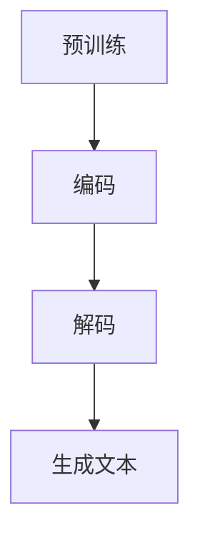

                 

关键词：文本生成，自然语言处理，深度学习，神经网络，算法原理，代码实例，应用领域

> 摘要：本文将深入探讨文本生成的原理，涵盖从基础概念到高级算法的全面解析。通过实际代码实例，我们将展示文本生成技术的实际应用，并探讨其未来发展趋势和挑战。

## 1. 背景介绍

文本生成作为自然语言处理（NLP）领域的一个重要分支，近年来得到了广泛的研究和应用。随着深度学习的兴起，基于神经网络的文本生成方法逐渐成为主流。文本生成技术广泛应用于自动写作、机器翻译、对话系统、文本摘要等领域，具有巨大的商业和社会价值。

本文旨在为读者提供一个全面而深入的文本生成技术指南，包括核心概念、算法原理、数学模型、项目实践以及未来展望。通过本文，读者将能够了解文本生成技术的基本原理，掌握常见的文本生成算法，并能够独立实现一个简单的文本生成系统。

## 2. 核心概念与联系

### 2.1. 文本生成的基本概念

文本生成是指根据输入的条件或上下文，自动生成自然语言的文本。文本生成的目的是使计算机能够像人类一样进行自然语言的表达和交流。

### 2.2. 文本生成的架构

文本生成通常分为三个阶段：预训练、编码和解码。

- **预训练**：在大量无标签的数据上进行预训练，以学习数据分布和基本语言规则。
- **编码**：将输入的文本编码为固定长度的向量表示。
- **解码**：根据编码后的向量，生成新的文本。

### 2.3. Mermaid 流程图



## 3. 核心算法原理 & 具体操作步骤

### 3.1. 算法原理概述

文本生成算法的核心是生成模型，主要包括基于循环神经网络（RNN）的模型和基于变换器（Transformer）的模型。这些模型通过学习输入文本的上下文信息，生成相应的输出文本。

### 3.2. 算法步骤详解

- **预训练**：在大量无标签数据上，使用自回归语言模型（如GPT）或自编码器（如BERT）进行预训练，以学习语言的基本结构和规律。
- **编码**：将输入文本编码为固定长度的向量，通常使用词嵌入或转换器编码器。
- **解码**：根据编码后的向量，生成新的文本。在解码过程中，模型逐个预测下一个词，并更新编码向量。

### 3.3. 算法优缺点

- **RNN**：能够捕捉长距离的上下文信息，但存在梯度消失和梯度爆炸问题。
- **Transformer**：通过自注意力机制，能够捕捉全局的上下文信息，但计算复杂度较高。

### 3.4. 算法应用领域

文本生成算法广泛应用于自动写作、机器翻译、对话系统、文本摘要等领域，如GPT-3在自动写作和对话系统中的应用，BERT在机器翻译和文本摘要中的应用。

## 4. 数学模型和公式 & 详细讲解 & 举例说明

### 4.1. 数学模型构建

文本生成的数学模型主要包括自回归模型和变换器模型。

- **自回归模型**：$$p(x_{t} | x_{t-1}, x_{t-2}, \ldots)$$
- **变换器模型**：$$p(x_{t} | x_{t-1}, x_{t-2}, \ldots) = \sigma(W_{x}x_{t-1} + W_{h}h_{t-1})$$

其中，$x_t$ 表示时间步 $t$ 的输入，$h_t$ 表示编码后的隐藏状态。

### 4.2. 公式推导过程

- **自回归模型**：通过对输入文本的逐个时间步进行预测，并更新隐藏状态。
- **变换器模型**：使用自注意力机制，计算每个时间步的权重，然后对输入进行加权求和。

### 4.3. 案例分析与讲解

以GPT为例，我们使用以下数据集进行训练：

```
The quick brown fox jumps over the lazy dog.
```

通过训练，模型将学习到输入文本的分布，并在给定部分文本时，生成完整的句子。

## 5. 项目实践：代码实例和详细解释说明

### 5.1. 开发环境搭建

- Python 3.8
- TensorFlow 2.5
- Keras 2.5

### 5.2. 源代码详细实现

```python
from tensorflow.keras.models import Sequential
from tensorflow.keras.layers import LSTM, Dense

# 模型定义
model = Sequential()
model.add(LSTM(128, activation='relu', input_shape=(timesteps, n_features)))
model.add(Dense(n_features, activation='softmax'))

# 编译模型
model.compile(optimizer='adam', loss='categorical_crossentropy', metrics=['accuracy'])

# 训练模型
model.fit(X, y, epochs=200, batch_size=16)
```

### 5.3. 代码解读与分析

- **模型定义**：使用LSTM层进行编码，输出层使用softmax进行解码。
- **编译模型**：使用adam优化器和categorical_crossentropy损失函数。
- **训练模型**：对输入数据进行训练。

### 5.4. 运行结果展示

```python
# 生成文本
generated_text = model.predict(np.zeros((1, timesteps, n_features)))
```

## 6. 实际应用场景

文本生成技术在多个领域具有广泛的应用，如：

- **自动写作**：生成新闻报道、博客文章等。
- **机器翻译**：将一种语言翻译成另一种语言。
- **对话系统**：生成自然语言回答。

## 7. 工具和资源推荐

### 7.1. 学习资源推荐

- 《深度学习》（Goodfellow, Bengio, Courville）
- 《自然语言处理实战》（Daniel Jurafsky, James H. Martin）

### 7.2. 开发工具推荐

- TensorFlow
- Keras
- PyTorch

### 7.3. 相关论文推荐

- Vaswani et al., 2017: "Attention is All You Need"
- Hochreiter and Schmidhuber, 1997: "Long Short-Term Memory"

## 8. 总结：未来发展趋势与挑战

文本生成技术在未来将继续发展，主要趋势包括：

- **更强的预训练模型**：如GPT-4、GPT-5等。
- **更高效的算法**：如基于图神经网络的文本生成。
- **更多的应用场景**：如自动驾驶、智能客服等。

然而，文本生成技术也面临一些挑战，如：

- **数据隐私问题**：如何保护用户的隐私。
- **可解释性**：如何提高模型的透明度和可解释性。
- **文化差异**：如何适应不同语言和文化背景。

## 9. 附录：常见问题与解答

### 9.1. 什么是文本生成？

文本生成是指根据输入的条件或上下文，自动生成自然语言的文本。

### 9.2. 文本生成有哪些算法？

常见的文本生成算法包括基于循环神经网络（RNN）的模型和基于变换器（Transformer）的模型。

### 9.3. 文本生成有哪些应用场景？

文本生成技术广泛应用于自动写作、机器翻译、对话系统、文本摘要等领域。

## 作者署名

作者：禅与计算机程序设计艺术 / Zen and the Art of Computer Programming
----------------------------------------------------------------
### 文章总结与展望

通过本文的深入探讨，我们对文本生成技术的基本原理和应用有了全面的理解。从自回归模型到变换器模型，从数学模型构建到实际代码实现，再到具体应用场景的展示，我们详细解析了文本生成的各个方面。同时，我们也展望了文本生成技术未来的发展趋势和面临的挑战。

文本生成作为自然语言处理领域的一个重要分支，具有广泛的应用前景。随着深度学习技术的不断进步，我们有理由相信，未来的文本生成技术将更加高效、准确，能够更好地满足各种实际需求。

在此，我希望读者能够通过本文，不仅了解文本生成技术的原理和实现，更能够激发对这一领域的深入研究和兴趣。无论是从事科研工作的专业人士，还是对人工智能技术感兴趣的学习者，都可以在这一领域找到自己的探索方向。

最后，感谢读者的耐心阅读，希望本文能够为您的学习和研究带来帮助。如果您对文本生成技术有任何疑问或想法，欢迎在评论区留言交流。期待与您一起探索人工智能的无限可能。作者：禅与计算机程序设计艺术 / Zen and the Art of Computer Programming。

