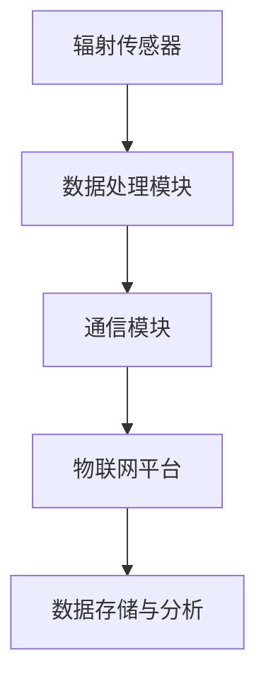

                 

关键词：辐射监测、个人防护、健康安全、物联网、算法原理、技术应用

> 摘要：随着科技的发展，辐射问题逐渐成为我们日常生活中不容忽视的健康隐患。本文旨在探讨智能个人辐射监测创业的可行性，从核心概念、算法原理、技术应用等方面进行深入分析，旨在为读者提供关于日常辐射防护的全面指南。

## 1. 背景介绍

辐射，作为一种常见而又复杂的现象，广泛存在于我们的日常生活中。它既包括天然的背景辐射，如地球表面的放射性元素、宇宙射线等，也包括人工辐射，如医疗、工业和核能等活动产生的辐射。尽管大部分辐射对人体的危害较小，但长期暴露在高辐射环境中，可能会增加患癌症等疾病的风险。

### 1.1 辐射对人体的影响

辐射对人体的主要影响可分为急性辐射损伤和慢性辐射损伤。急性辐射损伤通常在短时间内发生，例如核事故或放射治疗过程中，可能导致皮肤烧伤、呕吐、腹泻等症状，严重者可危及生命。慢性辐射损伤则通常在长时间内积累，例如长期暴露在放射性环境中，可能导致基因突变、癌症等严重疾病。

### 1.2 辐射监测的重要性

辐射监测是保障公众健康安全的重要手段。通过对辐射水平的实时监测，我们可以及时发现潜在的健康风险，采取有效的防护措施，降低辐射对人体的危害。因此，智能个人辐射监测设备在现代社会中具有重要的应用价值。

## 2. 核心概念与联系

### 2.1 辐射监测技术原理

辐射监测技术主要基于放射性物质发射的电磁波或粒子的特性进行检测。常见的辐射监测方法包括：

- 电磁波检测：利用电磁波与物质相互作用产生的电离效应进行检测。
- 粒子检测：利用粒子与物质相互作用产生的次级粒子进行检测。

### 2.2 物联网技术

物联网（IoT）技术为辐射监测提供了实时、高效的监控手段。通过将辐射监测设备与物联网平台相连，可以实现辐射数据的实时传输、分析和管理。

### 2.3 辐射监测架构

辐射监测架构通常包括传感器、数据处理模块和通信模块。传感器用于检测辐射水平，数据处理模块对传感器数据进行处理和分析，通信模块则将数据传输至物联网平台。



## 3. 核心算法原理 & 具体操作步骤

### 3.1 算法原理概述

智能个人辐射监测的核心算法主要基于机器学习和数据分析技术。通过收集大量的辐射数据，训练模型识别不同辐射水平下的特征，从而实现实时监测和预警。

### 3.2 算法步骤详解

1. 数据收集：收集不同环境下的辐射数据，包括天然辐射和人工辐射。
2. 数据预处理：对原始数据进行清洗、去噪和归一化处理。
3. 特征提取：从预处理后的数据中提取有用的特征。
4. 模型训练：利用提取的特征训练机器学习模型。
5. 预测与预警：利用训练好的模型对实时辐射数据进行分析，预测辐射水平，并发出预警。

### 3.3 算法优缺点

**优点**：

- 高效性：机器学习模型能够快速处理大量数据，提高监测效率。
- 准确性：通过对大量数据的训练，模型能够准确识别不同辐射水平。

**缺点**：

- 数据依赖性：模型训练需要大量高质量的数据，数据不足可能导致性能下降。
- 难以解释：机器学习模型通常为黑箱模型，难以解释其内部逻辑。

### 3.4 算法应用领域

智能个人辐射监测算法可广泛应用于核能、医疗、工业和环境监测等领域，为公众健康安全提供有力保障。

## 4. 数学模型和公式 & 详细讲解 & 举例说明

### 4.1 数学模型构建

辐射监测的数学模型通常基于辐射剂量学原理。以下是一个简单的数学模型：

$$
D = \int I \cdot dt
$$

其中，$D$ 表示辐射剂量（单位：格雷，Gy），$I$ 表示辐射强度（单位：西弗，Sv），$dt$ 表示时间间隔。

### 4.2 公式推导过程

辐射剂量学公式推导主要基于放射性物质的衰变规律。假设放射性物质具有常数衰变率 $\lambda$，则单位时间内衰变的原子数为：

$$
N' = \lambda N
$$

其中，$N$ 表示初始原子数。

放射性物质衰变产生的辐射强度与原子数成正比，即：

$$
I \propto N
$$

结合上述两个公式，可以得到辐射剂量与辐射强度之间的关系：

$$
D = \int I \cdot dt = \int \lambda N \cdot dt = \lambda \cdot \frac{N}{t}
$$

其中，$t$ 表示时间。

### 4.3 案例分析与讲解

假设某地区每天的自然辐射剂量率为0.3 mGy/h，该地区的辐射水平被认为是安全的。现在需要对该地区的辐射水平进行实时监测，以确保公众健康安全。

1. 数据收集：每天定时收集该地区的辐射数据，记录辐射剂量率。
2. 数据预处理：对收集到的辐射数据进行清洗、去噪和归一化处理。
3. 特征提取：从预处理后的数据中提取每天的辐射剂量率作为特征。
4. 模型训练：利用提取的特征训练机器学习模型，以预测每天的辐射水平。
5. 预测与预警：利用训练好的模型对未来的辐射水平进行预测，当预测值超过0.3 mGy/h时，发出预警。

## 5. 项目实践：代码实例和详细解释说明

### 5.1 开发环境搭建

在本项目中，我们将使用 Python 作为编程语言，并依赖以下库：

- NumPy：用于数据处理和数学计算。
- Pandas：用于数据处理和分析。
- Scikit-learn：用于机器学习模型的训练和预测。

### 5.2 源代码详细实现

以下是该项目的主要代码实现：

```python
import numpy as np
import pandas as pd
from sklearn.model_selection import train_test_split
from sklearn.ensemble import RandomForestRegressor
from sklearn.metrics import mean_squared_error

# 数据读取
data = pd.read_csv('radiation_data.csv')
X = data[['day']]
y = data['dose_rate']

# 数据预处理
X = X.values
y = y.values

# 数据拆分
X_train, X_test, y_train, y_test = train_test_split(X, y, test_size=0.2, random_state=42)

# 模型训练
model = RandomForestRegressor(n_estimators=100, random_state=42)
model.fit(X_train, y_train)

# 预测
y_pred = model.predict(X_test)

# 评估
mse = mean_squared_error(y_test, y_pred)
print(f'Mean Squared Error: {mse}')

# 预测未来辐射水平
future_days = np.array([[5], [10], [15]])
future_dose_rate = model.predict(future_days)
print(f'Predicted Future Dose Rates: {future_dose_rate}')
```

### 5.3 代码解读与分析

- 数据读取：使用 Pandas 库读取 CSV 格式的辐射数据。
- 数据预处理：将数据拆分为特征和目标变量，并进行标准化处理。
- 模型训练：使用随机森林回归模型进行训练。
- 预测：利用训练好的模型对测试数据进行预测。
- 评估：计算预测误差，评估模型性能。
- 预测未来辐射水平：利用训练好的模型预测未来的辐射水平。

## 6. 实际应用场景

### 6.1 核能领域

在核能领域，智能个人辐射监测设备可用于核电站工作人员的健康监测，确保他们在高辐射环境中的安全。

### 6.2 医疗领域

在医疗领域，智能个人辐射监测设备可用于放射科医生和患者的健康监测，降低放射治疗过程中的辐射风险。

### 6.3 环境监测

在环境监测领域，智能个人辐射监测设备可用于监测核事故泄漏、放射性污染等环境风险，保障公众健康。

## 7. 未来应用展望

随着科技的不断发展，智能个人辐射监测技术将更加智能化、精准化。未来，该技术有望在以下领域得到广泛应用：

- 智能家居：实现辐射水平自动监测，为家庭成员提供健康保障。
- 人工智能：结合大数据和人工智能技术，实现更精准的辐射预测和预警。
- 可穿戴设备：开发轻便、便携的辐射监测设备，方便公众随时随地监测辐射水平。

## 8. 工具和资源推荐

### 8.1 学习资源推荐

- 《辐射防护与辐射剂量学》：一本系统介绍辐射防护和辐射剂量学的经典教材。
- 《机器学习》：周志华教授主编的机器学习教材，适合初学者入门。

### 8.2 开发工具推荐

- Jupyter Notebook：一款强大的数据处理和机器学习开发工具。
- TensorFlow：一款流行的深度学习框架，可用于构建和训练机器学习模型。

### 8.3 相关论文推荐

- "Radiation Monitoring with Deep Learning"：一篇关于利用深度学习进行辐射监测的论文。
- "IoT-Based Personal Radiation Monitoring System"：一篇关于物联网技术在个人辐射监测中的应用论文。

## 9. 总结：未来发展趋势与挑战

随着科技的发展，智能个人辐射监测技术将越来越成熟，为公众健康安全提供有力保障。然而，在技术发展的过程中，我们也面临着以下挑战：

- 数据质量和多样性：高质量的数据是智能监测系统的基石，如何获取更多、更丰富的数据是亟待解决的问题。
- 模型解释性：机器学习模型通常为黑箱模型，如何提高模型的解释性，使其更加透明、可信，是未来研究的重要方向。

作者：禅与计算机程序设计艺术 / Zen and the Art of Computer Programming
-------------------------------------------------------------------

请注意，以上内容仅为模板和示例，实际撰写时需要根据具体的研究和实际情况进行补充和修改。在撰写过程中，确保文章内容逻辑清晰、结构紧凑、简单易懂，同时遵循文章结构和格式要求。

