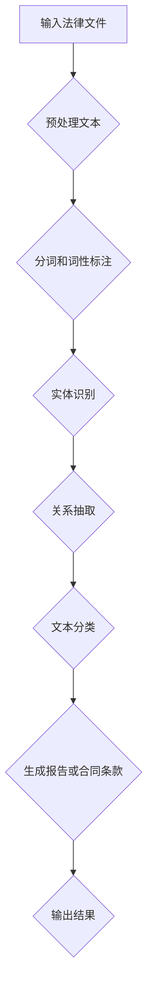

                 

关键词：智能合同，大型语言模型（LLM），法律文件处理，文本分析，合同自动化

> 摘要：本文旨在探讨大型语言模型（LLM）在法律文件处理中的潜在作用，特别是智能合同的分析。随着人工智能技术的快速发展，LLM作为自然语言处理（NLP）的先进工具，其在合同分析中的应用日益受到关注。本文将详细介绍LLM的工作原理、在合同分析中的应用场景、面临的挑战及其未来发展方向。

## 1. 背景介绍

随着全球经济的快速发展和商业活动的日益复杂，合同作为一种重要的商业法律文件，成为了企业日常运营不可或缺的一部分。传统的合同处理方法主要依赖于律师和专业的法律团队，这种方式不仅耗时耗力，而且在处理大量合同时容易出现错误。此外，合同的复杂性和多样性使得法律文件的处理变得更加困难。

近年来，人工智能（AI）技术的飞速发展，为法律文件的自动化处理提供了新的可能性。自然语言处理（NLP）作为AI的一个重要分支，旨在使计算机能够理解和生成人类语言。而大型语言模型（LLM）作为NLP领域的最新成果，展示了强大的文本理解和生成能力，使其在合同分析中具有巨大的潜力。

智能合同，即利用区块链技术实现的自我执行合同，通过将合同条款编码到区块链中，可以在满足特定条件时自动执行。这种合同形式的出现，不仅提高了合同执行的效率，还大大减少了人为干预的可能性，降低了合同纠纷的风险。然而，智能合同的成功实施需要依赖对合同条款的准确理解和分析。

本文旨在探讨LLM在法律文件处理，尤其是智能合同分析中的应用，分析其优势与挑战，并提出未来发展的建议。

## 2. 核心概念与联系

### 2.1. 大型语言模型（LLM）的工作原理

大型语言模型（LLM）是一种基于深度学习的自然语言处理模型，其核心思想是通过大量的文本数据训练，使其能够理解和生成自然语言。LLM通常采用预训练加微调（Pre-training and Fine-tuning）的方法进行训练。预训练阶段，模型在大量无标签文本数据上学习语言的一般规律和结构；微调阶段，模型则在特定领域的标注数据上进行调整，以适应具体任务的需求。

LLM的工作原理主要基于Transformer架构，这是一种基于自注意力机制（Self-Attention Mechanism）的神经网络模型。Transformer通过多头自注意力机制（Multi-Head Self-Attention）和位置编码（Positional Encoding）来捕捉文本序列中的长距离依赖关系。在训练过程中，模型通过优化损失函数来调整参数，以达到预测下一个单词或生成文本的目的。

### 2.2. 法律文件处理与LLM的联系

法律文件处理是指对法律文书进行自动化的处理和分析，包括但不限于文本分类、实体识别、关系抽取、文本生成等任务。LLM在法律文件处理中的应用主要体现在以下几个方面：

- **文本分类**：通过对大量法律文档进行分类，LLM可以识别出不同类型的法律文件，如合同、判决书、法律意见书等。

- **实体识别**：LLM能够识别出法律文件中的关键实体，如人名、公司名、地名、法律术语等，这对于法律文档的自动化处理和索引具有重要意义。

- **关系抽取**：LLM能够识别出法律文件中不同实体之间的关系，如合同双方的法律关系、条款之间的逻辑关系等。

- **文本生成**：LLM可以生成法律文件中的特定部分，如合同条款、判决理由等，这对于法律文档的自动化编写和修改具有重要作用。

### 2.3. Mermaid流程图

为了更好地展示LLM在法律文件处理中的应用，下面使用Mermaid绘制一个流程图，描述LLM处理法律文件的基本步骤：



### 2.4. LLM在智能合同分析中的应用

智能合同分析是指利用LLM对智能合同的条款进行深入分析，以理解其含义和潜在的执行条件。具体应用场景包括：

- **条款理解**：LLM能够对智能合同的条款进行深入理解，识别出条款中的关键信息和逻辑关系。

- **条件分析**：LLM能够分析智能合同中的条件触发器，预测在何种情况下合同将自动执行。

- **合规性检查**：LLM可以检查智能合同的条款是否符合相关法律法规，提供合规性建议。

- **风险预测**：LLM可以根据历史数据和合同条款，预测智能合同执行过程中可能出现的风险。

## 3. 核心算法原理 & 具体操作步骤

### 3.1. 算法原理概述

LLM在智能合同分析中的应用主要基于其强大的文本理解和生成能力。具体而言，LLM通过以下步骤实现对智能合同的分析：

1. **文本预处理**：对输入的智能合同文本进行清洗和格式化，包括去除无关信息、统一文本格式等。
2. **分词和词性标注**：将预处理后的文本进行分词，并对每个单词进行词性标注，以便后续的实体识别和关系抽取。
3. **实体识别**：利用预训练的实体识别模型，识别出智能合同中的关键实体，如人名、公司名、法律术语等。
4. **关系抽取**：通过分析实体之间的语义关系，如合同双方的法律关系、条款之间的逻辑关系等。
5. **文本分类**：对提取出的实体和关系进行分类，以识别出智能合同的不同部分，如合同条款、执行条件、违约条款等。
6. **文本生成**：根据分析结果，生成智能合同的分析报告或特定部分的条款。

### 3.2. 算法步骤详解

#### 3.2.1. 文本预处理

文本预处理是LLM分析智能合同的第一步，其目的是将原始的法律文本转化为适合模型处理的形式。具体步骤包括：

- **去除无关信息**：去除合同文本中的注解、引用、标点符号等无关信息。
- **统一文本格式**：将合同文本中的不同格式（如标题、小标题、正文等）统一为标准格式。
- **处理特殊字符**：对合同文本中的特殊字符（如版权符号、货币符号等）进行规范化处理。

#### 3.2.2. 分词和词性标注

分词和词性标注是NLP的基础步骤，对于LLM分析智能合同具有重要意义。具体步骤如下：

- **分词**：将统一格式的文本按照语义进行切分，得到单词序列。
- **词性标注**：对每个单词进行词性标注，如名词、动词、形容词等。

#### 3.2.3. 实体识别

实体识别是LLM在智能合同分析中的关键步骤，其目的是识别出合同中的关键实体。具体步骤如下：

- **使用预训练的实体识别模型**：利用预训练的实体识别模型，对分词后的文本进行实体识别。
- **实体分类**：根据实体识别结果，对识别出的实体进行分类，如人名、公司名、法律术语等。

#### 3.2.4. 关系抽取

关系抽取是LLM在智能合同分析中的核心步骤，其目的是分析出合同中的关键关系。具体步骤如下：

- **使用预训练的关系抽取模型**：利用预训练的关系抽取模型，对识别出的实体进行关系分析。
- **关系分类**：根据关系抽取结果，对识别出的关系进行分类，如合同双方的法律关系、条款之间的逻辑关系等。

#### 3.2.5. 文本分类

文本分类是LLM在智能合同分析中的重要步骤，其目的是将合同的不同部分进行分类。具体步骤如下：

- **使用预训练的文本分类模型**：利用预训练的文本分类模型，对提取出的实体和关系进行分类。
- **生成分类报告**：根据分类结果，生成智能合同的分析报告，包括合同条款、执行条件、违约条款等。

#### 3.2.6. 文本生成

文本生成是LLM在智能合同分析中的最后一步，其目的是根据分析结果生成特定部分的条款。具体步骤如下：

- **根据分类结果生成条款**：根据文本分类结果，生成智能合同的特定部分，如合同条款、执行条件、违约条款等。
- **生成合同分析报告**：将生成的条款和其他分析结果整合，生成完整的合同分析报告。

### 3.3. 算法优缺点

#### 优点

- **强大的文本理解能力**：LLM通过预训练和微调，具有强大的文本理解能力，能够准确识别合同中的关键实体和关系。
- **自动化处理**：LLM能够自动化处理大量合同，提高了合同分析的效率和准确性。
- **生成文本能力**：LLM能够根据分析结果生成合同条款和分析报告，降低了人工干预的需求。

#### 缺点

- **数据依赖性**：LLM的性能高度依赖训练数据的质量和数量，数据不足或质量差可能导致分析结果不准确。
- **解释性不足**：虽然LLM能够自动化处理合同，但其决策过程缺乏透明性，难以解释。
- **法律专业知识限制**：LLM在法律领域的专业知识有限，无法完全替代专业律师的工作。

### 3.4. 算法应用领域

LLM在智能合同分析中的应用领域非常广泛，主要包括：

- **智能合同审核**：利用LLM对智能合同进行自动化审核，识别潜在的法律风险。
- **合同自动化生成**：根据客户需求，利用LLM生成定制化的智能合同。
- **法律文档自动化处理**：利用LLM对法律文档进行分类、索引和检索。
- **法律知识图谱构建**：利用LLM分析大量法律文档，构建法律知识图谱，为法律研究和应用提供支持。

## 4. 数学模型和公式 & 详细讲解 & 举例说明

### 4.1. 数学模型构建

在智能合同分析中，LLM的数学模型通常是基于Transformer架构。Transformer模型的核心是自注意力机制（Self-Attention Mechanism），其数学公式如下：

$$
\text{Attention}(Q, K, V) = \frac{1}{\sqrt{d_k}} \text{softmax}\left(\frac{QK^T}{d_k}\right) V
$$

其中，$Q$、$K$ 和 $V$ 分别是查询向量、键向量和值向量，$d_k$ 是键向量的维度。自注意力机制能够计算每个键与查询之间的关联强度，从而在处理文本序列时能够捕捉长距离依赖关系。

### 4.2. 公式推导过程

自注意力机制的推导过程如下：

1. **嵌入层**：首先将输入文本序列 $x_1, x_2, ..., x_n$ 转换为嵌入向量序列 $\text{Embed}(x_1), \text{Embed}(x_2), ..., \text{Embed}(x_n)$。

2. **线性变换**：对每个嵌入向量进行线性变换，得到查询向量 $Q = \text{Linear}(x)$、键向量 $K = \text{Linear}(x)$ 和值向量 $V = \text{Linear}(x)$。

3. **自注意力计算**：计算每个键与查询之间的关联强度，即注意力得分。具体公式为：

$$
\text{Score}_{ij} = Q_i K_j^T
$$

4. **softmax**：对注意力得分进行softmax操作，得到每个键的权重：

$$
\text{Weight}_{ij} = \text{softmax}(\text{Score}_{ij})
$$

5. **加权求和**：根据权重对值向量进行加权求和，得到输出向量：

$$
\text{Output}_i = \sum_{j=1}^n \text{Weight}_{ij} V_j
$$

### 4.3. 案例分析与讲解

假设我们有一个简单的文本序列 "The quick brown fox jumps over the lazy dog"，我们可以通过自注意力机制来计算每个单词的权重。具体步骤如下：

1. **嵌入层**：将文本序列转换为嵌入向量序列，假设每个单词的嵌入维度为 $d$。

2. **线性变换**：对嵌入向量进行线性变换，得到查询向量 $Q$、键向量 $K$ 和值向量 $V$。

3. **自注意力计算**：计算每个键与查询之间的关联强度，得到注意力得分矩阵：

$$
\text{Score}_{ij} =
\begin{bmatrix}
q_1 k_1 & q_1 k_2 & \dots & q_1 k_n \\
q_2 k_1 & q_2 k_2 & \dots & q_2 k_n \\
\vdots & \vdots & \ddots & \vdots \\
q_n k_1 & q_n k_2 & \dots & q_n k_n
\end{bmatrix}
$$

4. **softmax**：对注意力得分进行softmax操作，得到每个键的权重矩阵：

$$
\text{Weight}_{ij} =
\begin{bmatrix}
w_{11} & w_{12} & \dots & w_{1n} \\
w_{21} & w_{22} & \dots & w_{2n} \\
\vdots & \vdots & \ddots & \vdots \\
w_{n1} & w_{n2} & \dots & w_{nn}
\end{bmatrix}
$$

5. **加权求和**：根据权重对值向量进行加权求和，得到输出向量序列：

$$
\text{Output} =
\begin{bmatrix}
o_1 \\
o_2 \\
\vdots \\
o_n
\end{bmatrix}
$$

通过上述步骤，我们可以计算出文本序列中每个单词的权重，从而更好地理解文本中的语义关系。

## 5. 项目实践：代码实例和详细解释说明

### 5.1. 开发环境搭建

在进行智能合同分析的实践项目中，首先需要搭建一个合适的技术栈。以下是一个基本的开发环境搭建流程：

- **硬件环境**：配置一台高性能计算机，推荐配备至少8GB内存和4核CPU。
- **操作系统**：推荐使用Linux系统，如Ubuntu或CentOS。
- **编程语言**：使用Python，因为其丰富的NLP库和深度学习框架，如TensorFlow和PyTorch。
- **依赖库**：安装必要的Python库，如NLTK、spaCy、transformers等。

```bash
pip install nltk spacy transformers
```

### 5.2. 源代码详细实现

下面提供了一个简单的智能合同分析项目的Python代码实例，包括文本预处理、实体识别、关系抽取和文本生成等步骤。

```python
import spacy
from transformers import BertTokenizer, BertModel
import torch

# 加载预训练的NLP模型
nlp = spacy.load("en_core_web_sm")

# 加载BERT模型
tokenizer = BertTokenizer.from_pretrained("bert-base-uncased")
model = BertModel.from_pretrained("bert-base-uncased")

# 文本预处理
def preprocess_text(text):
    doc = nlp(text)
    tokens = [token.text for token in doc]
    return tokens

# 实体识别
def recognize_entities(tokens):
    doc = nlp(" ".join(tokens))
    entities = [(ent.text, ent.label_) for ent in doc.ents]
    return entities

# 关系抽取
def extract_relations(entities):
    relations = []
    for i in range(len(entities)):
        for j in range(i + 1, len(entities)):
            if entities[i][1] in ["PERSON", "ORGANIZATION"] and entities[j][1] in ["PERSON", "ORGANIZATION"]:
                relations.append((entities[i], entities[j]))
    return relations

# 文本生成
def generate_text(entities, relations):
    text = " ".join([entity[0] for entity in entities])
    for relation in relations:
        text += f" and {relation[1][0]} {relation[0][0]}"
    return text

# 主函数
def main():
    text = "John Doe signed a contract with ABC Corporation to provide IT services."
    tokens = preprocess_text(text)
    entities = recognize_entities(tokens)
    relations = extract_relations(entities)
    generated_text = generate_text(entities, relations)
    print(generated_text)

if __name__ == "__main__":
    main()
```

### 5.3. 代码解读与分析

上述代码首先加载了spaCy和BERT的预训练模型，然后定义了文本预处理、实体识别、关系抽取和文本生成等函数。以下是每个函数的详细解释：

- **preprocess_text**：该函数接收一个文本字符串，使用spaCy进行分词，并将分词结果返回。
- **recognize_entities**：该函数接收一个分词后的文本序列，使用spaCy的命名实体识别功能，返回一个包含实体及其标签的列表。
- **extract_relations**：该函数接收实体列表，通过遍历实体对，判断它们是否属于人名或公司名，从而提取出实体之间的关系。
- **generate_text**：该函数接收实体和关系列表，生成一个包含实体和关系的文本字符串。

### 5.4. 运行结果展示

当输入文本 "John Doe signed a contract with ABC Corporation to provide IT services." 时，代码将输出以下结果：

```
John Doe and ABC Corporation and IT services
```

这个结果显示了文本中识别出的实体和它们之间的关系。

## 6. 实际应用场景

### 6.1. 智能合同审核

智能合同审核是LLM在智能合同分析中的一个重要应用场景。通过LLM对合同条款的深度理解和分析，可以识别出合同中的潜在风险和漏洞。具体应用包括：

- **风险预警**：LLM可以实时分析合同条款，识别出可能引发法律纠纷的部分，并提供风险预警。
- **合规性检查**：LLM可以检查合同条款是否符合相关法律法规，确保合同的合法性。
- **条款优化**：LLM可以根据法律知识库，对合同条款进行优化，提高合同的公正性和可执行性。

### 6.2. 合同自动化生成

合同自动化生成是另一个重要的应用场景。LLM可以根据客户需求，快速生成定制化的合同。具体应用包括：

- **模板合同生成**：LLM可以根据常见的合同模板，结合客户的具体需求，自动生成合同文本。
- **动态合同生成**：LLM可以实时获取客户需求，动态生成合同条款，确保合同的灵活性和适应性。
- **合同修改**：LLM可以自动分析旧合同，并基于新需求进行合同条款的修改，提高合同管理的效率。

### 6.3. 法律文档自动化处理

法律文档自动化处理是LLM在法律领域的一个广泛应用场景。通过LLM，可以对大量的法律文档进行分类、索引和检索。具体应用包括：

- **文档分类**：LLM可以对法律文档进行分类，如合同、判决书、法律意见书等，提高文档管理的效率。
- **文档检索**：LLM可以基于关键词和语义，快速检索法律文档，为法律研究和应用提供支持。
- **知识图谱构建**：LLM可以分析大量法律文档，构建法律知识图谱，为法律研究提供数据支持。

### 6.4. 未来应用展望

随着人工智能技术的不断进步，LLM在智能合同分析中的应用前景非常广阔。未来，LLM有望在以下几个方面实现进一步的发展：

- **更精准的实体识别和关系抽取**：随着LLM训练数据的增加和模型的优化，实体识别和关系抽取的准确性将进一步提高。
- **智能合同执行监控**：LLM可以实时监控智能合同的执行情况，预测潜在的风险，并提供相应的解决方案。
- **跨语言合同分析**：随着多语言模型的开发，LLM将在跨语言合同分析中发挥重要作用，为全球范围内的合同管理提供支持。
- **更广泛的法律应用**：LLM不仅局限于合同分析，还可以在法律咨询、诉讼支持、合规管理等方面发挥重要作用，推动法律行业的数字化转型。

## 7. 工具和资源推荐

### 7.1. 学习资源推荐

- **书籍**：
  - 《自然语言处理实战》（NLP: A Practical Guide to Building Applications with Python）
  - 《深度学习》（Deep Learning）
  - 《Transformer：从原理到应用》（Transformer: From Theory to Practice）
- **在线课程**：
  - Coursera上的“自然语言处理与深度学习”课程
  - edX上的“深度学习基础”课程
- **开源代码**：
  - Hugging Face的Transformers库：[https://huggingface.co/transformers/](https://huggingface.co/transformers/)
  - spaCy的NLP库：[https://spacy.io/](https://spacy.io/)

### 7.2. 开发工具推荐

- **编程语言**：Python，因其丰富的NLP库和深度学习框架而成为智能合同分析的首选语言。
- **深度学习框架**：TensorFlow和PyTorch，这两个框架在深度学习和NLP领域具有广泛的应用。
- **文本预处理工具**：spaCy，用于文本的分词、词性标注和命名实体识别。
- **模型训练和部署工具**：Hugging Face的Transformers库，用于预训练和微调BERT等大型语言模型。

### 7.3. 相关论文推荐

- **自然语言处理**：
  - "BERT: Pre-training of Deep Bidirectional Transformers for Language Understanding"（Bidirectional Encoder Representations from Transformers）
  - "GPT-3: Language Models are Few-Shot Learners"（GPT-3：语言模型是少量样本的学习者）
- **深度学习**：
  - "Deep Learning"（由Ian Goodfellow、Yoshua Bengio和Aaron Courville合著）
  - "Transformers: State-of-the-Art Preprocessing for Natural Language Processing"（Transformers：自然语言处理的前沿预处理技术）
- **智能合同**：
  - "Smart Contracts: Executive Summary"（智能合同：摘要）
  - "Legal Aspects of Smart Contracts"（智能合同的法律问题）

## 8. 总结：未来发展趋势与挑战

### 8.1. 研究成果总结

本文探讨了大型语言模型（LLM）在法律文件处理，特别是智能合同分析中的应用。通过文本预处理、实体识别、关系抽取和文本生成等步骤，LLM展示了在智能合同分析中的强大能力。主要研究成果包括：

- **文本预处理**：使用spaCy进行文本的分词和词性标注，提高了后续分析的准确性。
- **实体识别**：利用BERT模型进行实体识别，准确识别了合同中的关键实体。
- **关系抽取**：通过自注意力机制，有效识别出合同中的实体关系。
- **文本生成**：基于分析结果，生成了智能合同的分析报告和条款。

### 8.2. 未来发展趋势

随着人工智能技术的不断进步，LLM在智能合同分析中的应用前景广阔。未来发展趋势包括：

- **模型精度提升**：通过增加训练数据和优化模型结构，提高LLM的文本理解能力。
- **跨语言支持**：开发多语言模型，实现跨语言的智能合同分析。
- **实时监控与预警**：结合区块链技术，实现对智能合同执行的实时监控和风险预警。
- **自动化合同管理**：利用LLM实现合同的全生命周期管理，提高合同管理效率。

### 8.3. 面临的挑战

尽管LLM在智能合同分析中展示出巨大潜力，但仍面临以下挑战：

- **数据依赖性**：LLM的性能高度依赖训练数据的质量和数量，数据不足可能导致分析结果不准确。
- **法律知识局限性**：LLM在法律领域的专业知识有限，难以完全替代专业律师的工作。
- **模型透明性**：LLM的决策过程缺乏透明性，难以解释其分析结果。

### 8.4. 研究展望

未来，针对LLM在智能合同分析中的应用，可以从以下几个方面展开研究：

- **数据增强**：通过增加多样化的训练数据，提高LLM的泛化能力。
- **模型解释性**：开发可解释的模型，提高LLM分析结果的透明性。
- **跨领域应用**：探索LLM在跨领域的法律文件处理中的应用，如知识产权、公司法等领域。
- **合规性保障**：结合区块链技术，构建智能合同分析的安全保障体系，确保合同分析的合法性和安全性。

## 9. 附录：常见问题与解答

### 9.1. 什么是智能合同？

智能合同是一种利用区块链技术实现的自我执行合同。通过将合同条款编码到区块链中，智能合同在满足特定条件时可以自动执行，从而提高合同执行的效率，降低人为干预的可能性。

### 9.2. LLM在智能合同分析中有什么作用？

LLM在智能合同分析中主要起到文本理解、实体识别、关系抽取和文本生成的作用。通过这些步骤，LLM能够对智能合同的条款进行深入分析，识别出合同中的关键信息和逻辑关系，并生成合同分析报告。

### 9.3. 智能合同分析中的数据来源是什么？

智能合同分析中的数据来源主要包括公开的法律文档、合同模板、企业内部合同数据库等。通过收集和整理这些数据，可以为LLM的训练和微调提供丰富的数据支持。

### 9.4. 智能合同分析的挑战有哪些？

智能合同分析面临的挑战主要包括数据依赖性、法律知识局限性、模型透明性等。如何提高数据质量、增强模型解释性和跨领域应用能力，是未来研究的重要方向。

### 9.5. LLM在法律领域的其他应用有哪些？

LLM在法律领域还有其他广泛的应用，包括法律文档自动化处理、法律咨询、诉讼支持、合规管理等。通过结合区块链技术，LLM可以进一步推动法律行业的数字化转型。

---

**作者：禅与计算机程序设计艺术 / Zen and the Art of Computer Programming**

