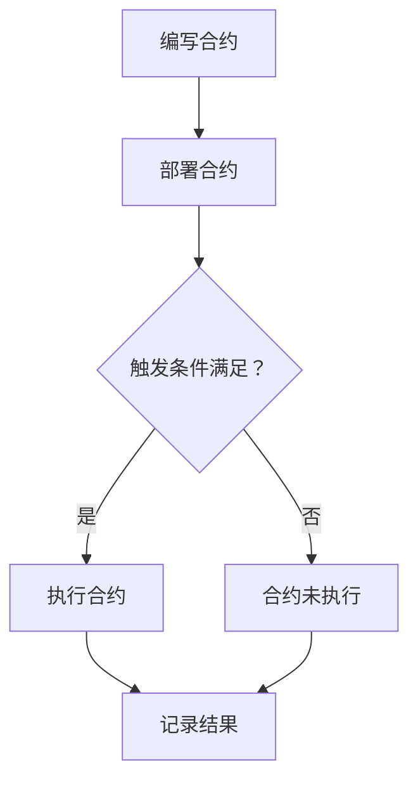

                 

关键词：智能合约、区块链、自动化交易、加密货币、去中心化、分布式系统、编程语言、加密算法、安全、效率、去信任、智能合约开发、创业。

> 摘要：随着区块链技术的发展，智能合约正逐渐成为自动化交易和去中心化金融的核心。本文将探讨智能合约的概念、原理、应用，以及创业者在智能合约领域的机会和挑战。

## 1. 背景介绍

智能合约是由程序员编写的代码，运行在区块链网络中。它们在满足特定条件时自动执行预定的操作，从而实现去中心化的自动化交易。智能合约的出现，不仅革新了金融交易模式，也为各行各业带来了全新的应用场景。

区块链技术的发展，尤其是加密货币的普及，使得智能合约的应用日益广泛。从去中心化的金融交易到供应链管理，智能合约正发挥着越来越重要的作用。创业公司纷纷涌入这个领域，探索智能合约的无限可能。

本文将深入探讨智能合约的开发、应用以及创业机会，为读者提供一个全面的技术视角和行业洞察。

### 1.1 智能合约的起源

智能合约的概念最早由计算机科学家尼克·萨博（Nick Szabo）在1994年提出。他将其描述为“一种通过互联网进行操作的电子协议，其中条款以计算机代码的形式表达，执行条件由自动化机制保证”。萨博认为，智能合约可以解决传统合约中的信任问题，从而实现更高效、更安全的交易。

然而，由于当时的计算技术和网络条件限制，智能合约的实现还未能普及。直到2008年比特币的诞生，区块链技术为智能合约的实现提供了基础设施。比特币的白皮书作者中本聪（Satoshi Nakamoto）虽然没有直接提及智能合约，但其设计理念为智能合约的实现奠定了基础。

### 1.2 智能合约的崛起

2013年，以太坊的创立者Vitalik Buterin提出了以太坊平台，该平台旨在提供一个通用的智能合约平台，支持去中心化应用（DApps）的开发。以太坊的推出，标志着智能合约进入了快速发展的阶段。

以太坊采用了图灵完备的编程语言Solidity，使得开发者可以轻松地编写和部署智能合约。随着以太坊的成功，其他区块链平台如EOS、Tron等也相继推出，进一步推动了智能合约的发展。

### 1.3 智能合约的应用

智能合约的应用范围非常广泛，涵盖了金融、供应链、法律、艺术等多个领域。以下是一些典型的应用场景：

1. **金融交易**：智能合约可以自动化处理金融交易，减少中介机构的介入，降低交易成本。例如，去中心化交易所（DEX）使用智能合约实现自动化的交易匹配和结算。

2. **供应链管理**：智能合约可以追踪商品的生产、运输、交付等全过程，确保供应链的透明性和可追溯性。例如，沃尔玛和IBM合作开发了基于区块链的食品溯源系统。

3. **法律合同**：智能合约可以自动化执行法律合同，确保合同的条款得到严格履行。例如，智能合约可以自动释放保险金，当发生保险事故时，无需人工介入。

4. **数字艺术品**：智能合约可以确保数字艺术品的唯一性和所有权，例如，加密猫（Cryptokitties）就是基于智能合约的数字艺术品交易平台。

## 2. 核心概念与联系

### 2.1 智能合约的核心概念

智能合约的核心概念包括：

- **合约**：智能合约的代码，包含交易条款和执行条件。
- **区块链**：智能合约运行的环境，提供去中心化和安全性。
- **加密算法**：用于确保合约的执行和数据的安全性。
- **去中心化**：智能合约在无需中心化机构介入的情况下运行，提高系统的可靠性和抗攻击性。
- **去信任**：智能合约无需依赖双方的信任，只要满足预定的条件，合约就会自动执行。

### 2.2 智能合约的工作原理

智能合约的工作原理可以概括为以下几个步骤：

1. **编写合约**：开发者使用特定的编程语言（如Solidity）编写智能合约代码。
2. **部署合约**：将合约代码上传到区块链网络，并支付一定的费用（如以太币）以存储合约代码。
3. **合约执行**：当满足预定的触发条件时，合约自动执行，执行结果记录在区块链上。
4. **合约验证**：区块链网络中的节点验证合约执行的正确性，确保合约的执行结果符合预期。

### 2.3 智能合约的优势

智能合约相对于传统合约具有以下优势：

- **去中心化**：智能合约在区块链网络中运行，无需依赖中心化机构，提高系统的透明性和抗攻击性。
- **自动化**：智能合约在满足特定条件时自动执行，减少人工干预，提高效率。
- **不可篡改**：智能合约一旦部署，其代码和执行结果将永久记录在区块链上，无法篡改，提高数据的可信度。
- **去信任**：智能合约无需依赖双方的信任，只要满足预定的条件，合约就会自动执行，降低交易风险。

### 2.4 智能合约与区块链的关系

智能合约是区块链技术的重要组成部分，两者密不可分。区块链为智能合约提供了运行环境和安全性，而智能合约则为区块链带来了实际的应用价值。

- **区块链**：是一种分布式数据库技术，通过加密算法和共识机制确保数据的安全性和不可篡改性。
- **智能合约**：是运行在区块链上的程序，通过自动化和去中心化的方式实现特定的业务逻辑。

### 2.5 Mermaid 流程图

以下是一个简单的Mermaid流程图，展示了智能合约的工作流程：



## 3. 核心算法原理 & 具体操作步骤

### 3.1 算法原理概述

智能合约的核心算法原理是基于区块链的共识机制和加密算法。共识机制确保区块链网络中的所有节点对交易的确认和记录达成一致，从而保证系统的安全性。加密算法用于保护合约代码和数据的安全性。

### 3.2 算法步骤详解

智能合约的算法步骤可以概括为以下几个阶段：

1. **合约编写**：开发者使用Solidity等编程语言编写智能合约代码，定义交易条款和执行条件。
2. **合约编译**：将合约代码编译成字节码，以便在区块链上部署。
3. **合约部署**：将编译后的合约字节码上传到区块链网络，并支付一定的费用以存储合约代码。
4. **触发执行**：当满足预定的触发条件时，合约自动执行。
5. **合约执行**：合约按照预定的逻辑执行操作，如转账、记录数据等。
6. **结果记录**：合约执行结果记录在区块链上，确保数据的不可篡改性。
7. **节点验证**：区块链网络中的节点对合约执行的正确性进行验证，确保系统的安全性。

### 3.3 算法优缺点

智能合约算法具有以下优点：

- **去中心化**：智能合约在区块链网络中运行，无需依赖中心化机构，提高系统的透明性和抗攻击性。
- **自动化**：智能合约在满足特定条件时自动执行，减少人工干预，提高效率。
- **不可篡改**：智能合约一旦部署，其代码和执行结果将永久记录在区块链上，无法篡改，提高数据的可信度。
- **去信任**：智能合约无需依赖双方的信任，只要满足预定的条件，合约就会自动执行，降低交易风险。

然而，智能合约算法也存在一些缺点：

- **性能限制**：智能合约运行在区块链网络中，可能面临性能瓶颈，无法处理大量并发交易。
- **代码安全**：智能合约代码的安全性对系统的稳定性至关重要，一旦出现漏洞，可能导致严重后果。
- **技术门槛**：智能合约的开发需要一定的编程技能和区块链知识，对于非技术背景的创业者来说，可能存在一定难度。

### 3.4 算法应用领域

智能合约算法在多个领域具有广泛的应用，包括：

- **金融交易**：智能合约可以自动化处理金融交易，提高交易效率和安全。
- **供应链管理**：智能合约可以确保供应链的透明性和可追溯性，提高供应链的管理效率。
- **数字身份验证**：智能合约可以用于数字身份的验证和管理，提高数据的安全性和隐私性。
- **智能投票系统**：智能合约可以确保投票过程的公正性和透明性，提高选举的公信力。
- **物联网**：智能合约可以用于物联网设备的管理和监控，提高物联网系统的安全性和可靠性。

## 4. 数学模型和公式 & 详细讲解 & 举例说明

### 4.1 数学模型构建

智能合约的数学模型主要包括以下部分：

- **状态机模型**：智能合约的状态转换过程可以用状态机模型来描述。每个状态表示智能合约在某一时刻的状态，状态之间的转移条件由合约代码定义。
- **条件逻辑模型**：智能合约的执行条件可以用条件逻辑模型来表示。条件逻辑模型包括条件语句和布尔表达式，用于定义合约的执行逻辑。
- **加密模型**：智能合约的安全性依赖于加密算法，如椭圆曲线密码学（ECC）和非对称加密。加密模型用于确保合约代码和数据的机密性、完整性和不可篡改性。

### 4.2 公式推导过程

智能合约的数学模型涉及到多个数学公式，以下是其中几个关键公式的推导过程：

1. **椭圆曲线密码学（ECC）公式**：

   椭圆曲线密码学是一种基于椭圆曲线离散对数的加密算法。其关键公式如下：

   $$ P = Q + R $$

   其中，P是椭圆曲线上的一点，Q和R是已知点，+表示椭圆曲线上的加法运算。该公式用于计算椭圆曲线上的加法。

2. **非对称加密公式**：

   非对称加密算法（如RSA）包括公钥和私钥两个密钥对。其关键公式如下：

   $$ E_{pub}(m) = c = m^e \mod n $$

   $$ D_{pri}(c) = m = c^d \mod n $$

   其中，m是明文，c是密文，e和d分别是公钥和私钥的指数，n是模数。这些公式用于加密和解密数据。

3. **条件逻辑公式**：

   条件逻辑模型中的条件语句可以用以下公式表示：

   $$ if \ b \ then \ a \ else \ c $$

   该公式表示当b为真时，执行a；否则，执行c。该公式用于定义智能合约的执行逻辑。

### 4.3 案例分析与讲解

以下是一个简单的智能合约案例，用于实现一个去中心化的点对点支付系统。

```solidity
pragma solidity ^0.8.0;

contract PointToPoint {
    mapping(address => uint256) public balances;

    function deposit() external payable {
        balances[msg.sender()] += msg.value;
    }

    function transfer(address to, uint256 amount) external {
        require(amount <= balances[msg.sender()], "Insufficient balance");
        balances[msg.sender()] -= amount;
        balances[to] += amount;
    }
}
```

该智能合约定义了一个名为`balances`的映射，用于记录每个用户的余额。合约包括两个函数：

- `deposit()`：接收以太币并将其添加到用户的余额。
- `transfer()`：从发送方的余额中扣除金额，并将金额转移到接收方。

以下是对合约代码的详细解释：

1. `pragma solidity ^0.8.0;`：指定合约编译器版本。
2. `contract PointToPoint`：定义智能合约名称。
3. `mapping(address => uint256) public balances;`：创建一个映射，用于存储用户的余额，其中`address`是键，`uint256`是值。
4. `function deposit() external payable`：定义`deposit()`函数，允许用户存款。`external`表示该函数可以通过外部调用，`payable`表示该函数可以接收以太币。
5. `balances[msg.sender()] += msg.value;`：将接收到的以太币添加到发送方的余额。
6. `function transfer(address to, uint256 amount) external`：定义`transfer()`函数，用于转账。`external`表示该函数可以通过外部调用。
7. `require(amount <= balances[msg.sender()], "Insufficient balance");`：检查发送方是否有足够的余额进行转账。
8. `balances[msg.sender()] -= amount;`：从发送方的余额中扣除转账金额。
9. `balances[to] += amount;`：将转账金额添加到接收方的余额。

通过这个简单的案例，我们可以看到智能合约如何实现去中心化的点对点支付。智能合约代码保证了转账过程的安全性和自动化，从而降低了交易成本。

## 5. 项目实践：代码实例和详细解释说明

### 5.1 开发环境搭建

要在智能合约领域进行项目实践，首先需要搭建一个合适的开发环境。以下是一个基于Node.js和Truffle的开发环境搭建过程：

1. **安装Node.js**：访问Node.js官方网站（[https://nodejs.org/），下载并安装合适的版本。安装完成后，在命令行中运行`node -v`和`npm -v`验证安装是否成功。**
2. **安装Truffle**：在命令行中运行以下命令安装Truffle：

   ```bash
   npm install -g truffle
   ```

   安装完成后，运行`truffle version`验证Truffle版本。

3. **创建项目**：在命令行中运行以下命令创建一个新的Truffle项目：

   ```bash
   truffle init
   ```

   这将创建一个包含基本结构的Truffle项目目录。

4. **配置项目**：在项目根目录下，打开`truffle-config.js`文件，进行以下配置：

   ```javascript
   module.exports = {
     networks: {
       development: {
         host: "127.0.0.1",
         port: 8545,
         network_id: "*"
       }
     }
   };
   ```

   这段代码配置了开发网络，用于本地测试智能合约。

5. **安装Ganache**：下载并安装Ganache（[https://www.trufflesuite.com/products/ganache），启动Ganache，创建一个本地区块链网络。确保在Truffle项目中设置的端口（默认为8545）与Ganache的端口相同。**
6. **启动Truffle开发环境**：在命令行中运行以下命令启动Truffle开发环境：

   ```bash
   truffle develop
   ```

   这将启动一个本地开发环境，允许我们编写、编译和部署智能合约。

### 5.2 源代码详细实现

以下是一个简单的智能合约示例，用于实现一个去中心化的点对点支付系统。该合约使用Solidity语言编写，并在Truffle项目中实现。

```solidity
pragma solidity ^0.8.0;

contract PointToPoint {
    mapping(address => uint256) public balances;

    function deposit() external payable {
        balances[msg.sender()] += msg.value;
    }

    function transfer(address to, uint256 amount) external {
        require(amount <= balances[msg.sender()], "Insufficient balance");
        balances[msg.sender()] -= amount;
        balances[to] += amount;
    }
}
```

#### 5.2.1 合约结构

- **pragma**：指定编译器版本。
- **contract**：定义智能合约名称。
- **mapping**：创建一个映射，用于存储用户的余额。
- **function deposit() external payable**：定义`deposit()`函数，允许用户存款。
- **function transfer(address to, uint256 amount) external**：定义`transfer()`函数，用于转账。

#### 5.2.2 函数实现

- `deposit()`：将接收到的以太币添加到发送方的余额。
- `transfer()`：从发送方的余额中扣除转账金额，并将金额转移到接收方。

### 5.3 代码解读与分析

#### 5.3.1 `deposit()`函数

`deposit()`函数是一个接收以太币的函数，其关键字和参数如下：

- `function deposit() external payable`：`external`表示该函数可以通过外部调用，`payable`表示该函数可以接收以太币。
- `balances[msg.sender()] += msg.value;`：将接收到的以太币添加到发送方的余额。

#### 5.3.2 `transfer()`函数

`transfer()`函数是一个用于转账的函数，其关键字和参数如下：

- `function transfer(address to, uint256 amount) external`：`external`表示该函数可以通过外部调用，`to`是接收方地址，`amount`是转账金额。
- `require(amount <= balances[msg.sender()], "Insufficient balance");`：检查发送方是否有足够的余额进行转账。
- `balances[msg.sender()] -= amount;`：从发送方的余额中扣除转账金额。
- `balances[to] += amount;`：将转账金额添加到接收方的余额。

### 5.4 运行结果展示

在开发环境中，我们可以通过Truffle进行智能合约的测试和运行。以下是一个简单的测试脚本，用于验证智能合约的功能：

```javascript
const truffle = require("truffle");
const PointToPoint = artifacts.require("PointToPoint");

contract("PointToPoint", function(accounts) {
    it("should deposit ETH and transfer it", async function() {
        const contract = await PointToPoint.new();
        const sender = accounts[0];
        const receiver = accounts[1];
        const amount = web3.utils.toWei("1", "ether");

        // Send ETH to the contract
        await web3.eth.sendTransaction({
            from: sender,
            to: contract.address,
            value: amount
        });

        // Check the sender's balance
        const senderBalanceBefore = await web3.eth.getBalance(sender);
        assert(senderBalanceBefore < (await web3.eth.getBalance(sender) - amount));

        // Transfer ETH from sender to receiver
        await contract.transfer(receiver, amount, { from: sender });

        // Check the receiver's balance
        const receiverBalanceBefore = await web3.eth.getBalance(receiver);
        assert(receiverBalanceBefore < (await web3.eth.getBalance(receiver) - amount));
    });
});
```

这段脚本通过Truffle的测试框架验证了智能合约的存款和转账功能。测试结果显示，智能合约能够正确处理以太币的接收和转账操作。

## 6. 实际应用场景

### 6.1 金融交易

智能合约在金融交易领域具有广泛的应用。去中心化交易所（DEX）是智能合约在金融领域的一个重要应用。DEX通过智能合约实现自动化的交易匹配和结算，无需中心化交易所的介入。这不仅降低了交易成本，还提高了交易的透明性和安全性。例如，Uniswap和SushiSwap是目前最受欢迎的去中心化交易所，它们基于以太坊智能合约平台，实现了自动化的交易机制。

### 6.2 供应链管理

智能合约可以确保供应链的透明性和可追溯性。通过在区块链上记录商品的生产、运输、交付等全过程，智能合约可以确保供应链的各个环节透明、公开。这不仅有助于提高供应链的效率，还可以降低欺诈风险。例如，沃尔玛和IBM合作开发的IBM Food Trust平台，使用区块链和智能合约技术，实现了食品供应链的可追溯性。

### 6.3 法律合同

智能合约可以用于自动化执行法律合同，确保合同的条款得到严格履行。通过智能合约，企业可以减少合同纠纷，提高合同履行的效率。例如，律师可以使用智能合约编写和执行合同，确保合同的条款得到自动执行，从而减少人工干预和错误。

### 6.4 数字艺术品

智能合约在数字艺术品领域也具有广泛的应用。通过智能合约，艺术家可以确保其作品的唯一性和所有权。例如，加密猫（Cryptokitties）是一款基于以太坊智能合约的数字艺术品游戏，玩家可以通过智能合约购买、出售和繁殖虚拟宠物。这种去中心化的数字艺术品交易模式，不仅为艺术家提供了新的商业模式，也为收藏家提供了一个全新的收藏领域。

### 6.5 智能投票系统

智能合约可以用于实现智能投票系统，确保投票过程的公正性和透明性。通过智能合约，投票结果可以自动记录在区块链上，确保无法篡改。例如，F_lock项目旨在利用智能合约技术实现去中心化的投票系统，从而确保选举的公正性。

## 7. 工具和资源推荐

### 7.1 学习资源推荐

- **《精通智能合约开发》**：这是一本关于智能合约开发的入门书籍，涵盖了Solidity编程、智能合约架构、安全性和测试等内容。
- **《智能合约实战》**：本书通过实际案例介绍了智能合约在金融、供应链、数字艺术品等领域的应用，为读者提供了实用的智能合约开发经验。
- **[智能合约教程](https://www.smartcontractslab.com/)**：这是一个在线智能合约教程，提供了丰富的Solidity编程教程和实例，适合初学者入门。

### 7.2 开发工具推荐

- **Truffle**：这是一个流行的智能合约开发框架，提供了合同编译、部署、测试和模拟等功能。
- **Remix**：这是一个在线智能合约开发环境，支持Solidity语言，提供了编译器和调试器。
- **Ganache**：这是一个本地区块链模拟器，用于测试智能合约和DApp。

### 7.3 相关论文推荐

- **"The Blockchain: Blueprint for a New Economy"**：这是一篇关于区块链技术的开创性论文，详细介绍了区块链的原理和应用。
- **"Decentralized Applications: Architecture, Usability, and Governance in Bitcoin, Ethereum, and Beyond"**：这是一本关于去中心化应用（DApps）的书籍，涵盖了DApps的设计、实现和治理。
- **"Formal Verification of Decentralized Applications"**：这是一篇关于智能合约形式验证的论文，探讨了如何确保智能合约的正确性和安全性。

## 8. 总结：未来发展趋势与挑战

### 8.1 研究成果总结

智能合约技术的发展取得了显著成果，为去中心化金融、供应链管理、法律合同、数字艺术品等领域带来了新的机遇。智能合约在提高交易效率、降低成本、增强安全性等方面具有明显优势，得到了广泛的应用和认可。

### 8.2 未来发展趋势

未来，智能合约技术将继续发展，有望在以下几个方面取得突破：

- **性能优化**：随着交易量的增加，智能合约的性能瓶颈将日益凸显。未来，研究将重点放在提高智能合约的执行效率和扩展性，以满足大规模应用的需求。
- **跨链互操作**：智能合约将在不同区块链平台之间实现互操作，打破平台间的壁垒，促进区块链生态的全面发展。
- **标准化**：智能合约的标准化将提高其互操作性和兼容性，为开发者提供统一的编程语言和接口，降低开发难度。
- **安全性提升**：随着智能合约的广泛应用，安全性问题将愈发重要。未来，研究将集中在智能合约的安全性和形式验证，确保系统的稳定性和可靠性。

### 8.3 面临的挑战

尽管智能合约技术具有广泛的应用前景，但在发展过程中仍面临一些挑战：

- **性能瓶颈**：智能合约在处理大量并发交易时可能面临性能瓶颈，需要进一步优化。
- **安全性问题**：智能合约的安全漏洞可能导致严重后果，需要加强形式验证和安全性测试。
- **监管挑战**：智能合约在金融、法律等领域的应用需要符合相关法规和监管要求，需要解决合规性问题。
- **开发者门槛**：智能合约开发需要一定的编程技能和区块链知识，对非技术背景的创业者来说，可能存在一定难度。

### 8.4 研究展望

未来，智能合约技术将朝着更高效、更安全、更易用的方向发展。研究者将集中在性能优化、跨链互操作、标准化、安全性提升等方面，推动智能合约技术的全面发展。同时，随着区块链技术的不断演进，智能合约将在更多领域得到应用，为各行各业带来新的变革。

## 9. 附录：常见问题与解答

### 9.1 什么是智能合约？

智能合约是由程序员编写的代码，运行在区块链网络中。它们在满足特定条件时自动执行预定的操作，从而实现去中心化的自动化交易。

### 9.2 智能合约的优势是什么？

智能合约的优势包括去中心化、自动化、不可篡改、去信任，这些特点使其在金融、供应链、法律、艺术等领域具有广泛的应用。

### 9.3 如何编写智能合约？

编写智能合约需要掌握特定的编程语言，如Solidity。开发者可以使用Truffle等开发框架，编写、编译和部署智能合约。

### 9.4 智能合约的安全问题如何解决？

智能合约的安全问题可以通过形式验证、安全性测试和加密算法等方式解决。开发者应遵循最佳实践，确保智能合约的安全性。

### 9.5 智能合约的应用领域有哪些？

智能合约的应用领域包括金融交易、供应链管理、法律合同、数字艺术品、智能投票系统等。随着区块链技术的不断演进，智能合约的应用领域将更加广泛。

### 9.6 智能合约的局限性是什么？

智能合约的局限性包括性能瓶颈、安全性问题、监管挑战和开发者门槛。未来，研究将集中在解决这些问题，推动智能合约技术的全面发展。

---

作者：禅与计算机程序设计艺术 / Zen and the Art of Computer Programming

本文旨在为读者提供一个关于智能合约的全面技术视角和行业洞察，帮助读者了解智能合约的概念、原理、应用和未来发展趋势。希望本文对您在智能合约领域的探索和学习有所帮助。如果您有任何问题或建议，欢迎在评论区留言，我将竭诚为您解答。感谢您的阅读！

