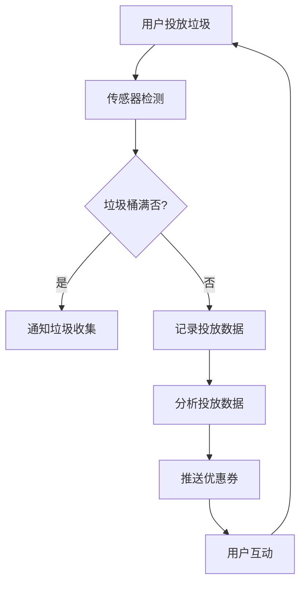

                 

关键词：智能垃圾桶，环境监测，注意力经济，物联网，传感器技术

> 摘要：本文探讨了一种结合环保和注意力经济理念的智能垃圾桶解决方案。通过物联网技术和先进的传感器技术，智能垃圾桶能够实时监测环境状态，提供有效的垃圾管理，同时通过用户互动机制，实现注意力经济的增值。本文旨在分析智能垃圾桶的工作原理、技术实现以及其对社会和环境的影响。

## 1. 背景介绍

随着城市化进程的加快和人口的不断增加，垃圾管理问题日益突出。传统垃圾处理方式面临着效率低下、环境污染严重等问题。为了解决这些问题，智能垃圾桶作为一种新兴的环保技术逐渐引起了广泛关注。

智能垃圾桶是一种集成了传感器、无线通信和数据处理技术的智能设备。它能够自动监测垃圾容量、分类状态和环境状况，并通过物联网平台与城市管理系统进行数据交互。此外，智能垃圾桶还可以通过用户互动机制，提供广告推送、优惠信息等增值服务，实现注意力经济的转换。

本文将从以下几个方面展开讨论：

1. **核心概念与联系**：介绍智能垃圾桶的关键技术构成和运行机制。
2. **核心算法原理 & 具体操作步骤**：详细解析智能垃圾桶的算法原理及其实现步骤。
3. **数学模型和公式 & 详细讲解 & 举例说明**：阐述智能垃圾桶的数学模型及公式的推导和应用。
4. **项目实践：代码实例和详细解释说明**：通过实际项目实例，展示智能垃圾桶的实现细节。
5. **实际应用场景**：分析智能垃圾桶在不同场景下的应用效果。
6. **未来应用展望**：探讨智能垃圾桶的发展趋势和潜在影响。
7. **工具和资源推荐**：推荐学习智能垃圾桶的相关资源。
8. **总结：未来发展趋势与挑战**：总结研究成果并展望未来。

### 1.1 垃圾管理现状与挑战

当前，全球垃圾产量持续增长，尤其是在城市化进程中，垃圾管理成为了一个重大挑战。传统的垃圾处理方式主要包括填埋、焚烧和堆肥等。然而，这些方法都存在一定的局限性。例如，垃圾填埋场占用大量土地，且易引发渗滤液污染和沼气问题；垃圾焚烧会产生大量有害气体和灰渣；堆肥过程时间长，且不易实现大规模应用。

智能垃圾桶的出现为垃圾管理提供了一种全新的解决方案。通过物联网技术和传感器技术，智能垃圾桶能够实时监测垃圾容量和分类状态，提高了垃圾处理的效率和准确性。同时，智能垃圾桶还可以通过用户互动机制，实现垃圾投放行为的引导和教育，从而提升公众的环保意识。

### 1.2 注意力经济概念

注意力经济是指通过吸引和利用用户注意力，实现经济价值的一种商业模式。在数字时代，用户的注意力成为了一种稀缺资源，各大平台和企业都在争夺用户的注意力。智能垃圾桶作为一种智能设备，可以通过广告推送、互动游戏等方式，吸引用户参与，从而实现注意力经济的增值。

### 1.3 智能垃圾桶的发展历程

智能垃圾桶的概念最早可以追溯到20世纪90年代，当时一些研究机构开始探索利用传感器技术实现垃圾自动分类和监测。然而，由于技术限制和成本问题，这些早期的研究并没有得到广泛应用。

进入21世纪，随着物联网技术和传感器技术的快速发展，智能垃圾桶逐渐走向成熟。例如，美国的废物管理公司开始推广智能垃圾桶，通过实时监测和远程管理，实现了垃圾处理效率的显著提升。

近年来，随着人工智能技术的进步，智能垃圾桶的功能更加丰富。例如，一些智能垃圾桶可以通过人脸识别技术识别用户，提供个性化服务；还有一些智能垃圾桶集成了垃圾分类指导功能，帮助用户正确分类垃圾。

### 1.4 智能垃圾桶的重要性

智能垃圾桶在环保和注意力经济方面具有重要作用。首先，智能垃圾桶能够实现垃圾的实时监测和分类，提高了垃圾处理的效率和准确性，有助于减少环境污染。其次，智能垃圾桶通过用户互动机制，实现了注意力经济的增值，为城市管理和公共服务提供了新的商业模式。

此外，智能垃圾桶还具有以下优势：

1. **提高垃圾处理效率**：通过实时监测和分类，智能垃圾桶可以及时反馈垃圾容量和分类状态，帮助城市管理部门合理安排垃圾收集和处理工作，提高了整体效率。
2. **减少资源浪费**：智能垃圾桶可以根据垃圾容量自动判断是否需要收集，避免了不必要的垃圾收集和运输，减少了资源的浪费。
3. **提升公众环保意识**：智能垃圾桶通过用户互动机制，可以引导用户正确分类垃圾，提高公众的环保意识。
4. **实现注意力经济增值**：智能垃圾桶可以通过广告推送、互动游戏等方式，吸引用户参与，实现注意力经济的增值。

总的来说，智能垃圾桶作为一种新兴的环保技术，具有广阔的发展前景。通过不断完善技术，优化用户互动机制，智能垃圾桶有望在未来的城市管理和公共服务中发挥更大作用。

### 2. 核心概念与联系

#### 2.1.1 物联网技术

物联网（Internet of Things，IoT）是一种通过网络将各种物理设备连接起来的技术。智能垃圾桶作为物联网的一个应用场景，可以通过物联网技术实现设备之间的数据传输和协同工作。物联网技术主要包括传感器、通信协议和网络平台三个核心组成部分。

1. **传感器**：智能垃圾桶集成了多种传感器，如红外传感器、重量传感器和温度传感器等，用于实时监测垃圾容量、分类状态和环境状况。
2. **通信协议**：智能垃圾桶通过无线通信技术，如Wi-Fi、蓝牙和ZigBee等，将传感器数据传输到云端服务器或附近的智能设备。
3. **网络平台**：物联网平台负责数据存储、处理和分析，同时提供数据可视化和管理功能。

#### 2.1.2 传感器技术

传感器技术是智能垃圾桶实现自动监测和分类的关键。智能垃圾桶中常用的传感器类型包括：

1. **红外传感器**：用于检测垃圾桶内是否有垃圾，可以通过红外光线反射来判断。
2. **重量传感器**：用于测量垃圾桶内垃圾的重量，从而判断垃圾桶的容量。
3. **温度传感器**：用于监测垃圾桶内的温度，帮助判断垃圾的类型和是否需要进行特殊处理。
4. **湿度传感器**：用于测量垃圾桶内的湿度，辅助判断垃圾的分类和处理方式。

#### 2.1.3 数据处理与存储

智能垃圾桶收集到的数据需要通过数据处理和存储技术进行处理。数据处理主要包括数据清洗、数据分析和数据可视化。数据存储则负责将处理后的数据存储到数据库或云平台中，以便后续查询和分析。

1. **数据处理**：智能垃圾桶的数据处理通常包括以下步骤：
   - **数据清洗**：去除重复数据和异常数据，确保数据质量。
   - **数据分析**：通过统计分析、机器学习等方法，提取数据中的有用信息。
   - **数据可视化**：通过图表、报表等形式，将数据以直观的方式展示出来。
2. **数据存储**：智能垃圾桶的数据存储通常采用以下几种技术：
   - **关系型数据库**：如MySQL、PostgreSQL等，用于存储结构化数据。
   - **NoSQL数据库**：如MongoDB、Cassandra等，用于存储非结构化或半结构化数据。
   - **云平台**：如AWS、Azure和Google Cloud等，提供高效、可靠的数据存储和处理服务。

#### 2.1.4 用户互动机制

智能垃圾桶的用户互动机制是其实现注意力经济增值的关键。用户互动机制主要包括以下几种方式：

1. **广告推送**：智能垃圾桶可以通过屏幕或声音提示，向用户推送广告。这种方式不仅能够为城市管理部门带来额外收入，还能提高用户的注意力。
2. **互动游戏**：智能垃圾桶可以集成小游戏，鼓励用户参与，从而提升用户的使用频率和粘性。
3. **优惠券推送**：智能垃圾桶可以根据用户的垃圾投放记录，推送相关的优惠券或促销信息，吸引用户参与。

#### 2.1.5 Mermaid 流程图

以下是一个简化的智能垃圾桶工作流程的Mermaid流程图：



### 3. 核心算法原理 & 具体操作步骤

#### 3.1 算法原理概述

智能垃圾桶的核心算法主要包括垃圾容量监测算法、垃圾分类算法和环境监测算法。以下是每个算法的简要原理：

1. **垃圾容量监测算法**：通过重量传感器和红外传感器，实时监测垃圾桶的垃圾容量，判断是否需要垃圾收集。
2. **垃圾分类算法**：通过分析垃圾投放数据，结合机器学习算法，实现垃圾的自动分类。
3. **环境监测算法**：通过温度传感器和湿度传感器，实时监测垃圾桶周围的环境状况，提供环境数据支持。

#### 3.2 算法步骤详解

##### 3.2.1 垃圾容量监测算法

1. **数据采集**：通过重量传感器和红外传感器，采集垃圾桶的重量数据和垃圾投放状态。
2. **数据预处理**：去除异常数据，对数据进行平滑处理，以提高数据的准确性。
3. **容量判断**：根据采集到的数据，判断垃圾桶是否已满。若垃圾桶已满，则通知垃圾收集人员。
4. **容量记录**：记录每次垃圾投放的重量，用于后续数据分析。

##### 3.2.2 垃圾分类算法

1. **特征提取**：从垃圾投放数据中提取特征，如重量、投放时间、投放频率等。
2. **模型训练**：使用机器学习算法，如决策树、支持向量机等，对垃圾分类模型进行训练。
3. **分类预测**：对新的垃圾投放数据，使用训练好的模型进行分类预测。
4. **结果验证**：通过人工审核或再次测量，验证分类结果的准确性。

##### 3.2.3 环境监测算法

1. **数据采集**：通过温度传感器和湿度传感器，采集垃圾桶周围的环境数据。
2. **数据预处理**：去除异常数据，对数据进行平滑处理，以提高数据的准确性。
3. **环境状态判断**：根据采集到的数据，判断垃圾桶周围的环境状况，如是否需要降温或通风。
4. **数据记录**：记录每次环境监测的数据，用于后续分析和预警。

#### 3.3 算法优缺点

##### 3.3.1 垃圾容量监测算法

**优点**：
- 实时监测垃圾桶容量，提高垃圾收集效率。
- 减少不必要的垃圾收集，降低运营成本。

**缺点**：
- 传感器精度和稳定性可能影响监测结果。
- 高密度城市区域，垃圾桶容量监测可能面临挑战。

##### 3.3.2 垃圾分类算法

**优点**：
- 自动化垃圾分类，提高垃圾处理效率。
- 减少垃圾填埋和焚烧带来的环境污染。

**缺点**：
- 分类算法需要大量训练数据和计算资源。
- 分类结果可能受到垃圾投放行为和设备精度的影响。

##### 3.3.3 环境监测算法

**优点**：
- 实时监测垃圾桶周围环境，提供环境数据支持。
- 预警异常环境状况，提前采取预防措施。

**缺点**：
- 环境监测算法复杂，需要处理大量数据。
- 环境数据可能受到天气和设备误差的影响。

#### 3.4 算法应用领域

智能垃圾桶算法在多个领域具有广泛的应用前景：

1. **城市垃圾管理**：智能垃圾桶算法可以帮助城市管理部门优化垃圾收集和分类工作，提高垃圾处理效率。
2. **环保监测**：智能垃圾桶可以实时监测环境数据，为环保部门提供科学依据。
3. **智能家居**：智能垃圾桶可以集成到智能家居系统中，实现家庭垃圾自动处理和分类。
4. **垃圾分类教育**：智能垃圾桶可以通过互动游戏和数据分析，帮助用户更好地理解垃圾分类的重要性。

### 4. 数学模型和公式 & 详细讲解 & 举例说明

智能垃圾桶的算法设计涉及多个数学模型和公式，下面将详细讲解这些模型和公式的构建、推导和应用。

#### 4.1 数学模型构建

##### 4.1.1 垃圾容量监测模型

垃圾容量监测模型用于预测垃圾桶的垃圾容量。假设垃圾桶的总容量为\(C\)，当前垃圾重量为\(w\)，则垃圾桶的剩余容量可以表示为：

\[ R = C - w \]

##### 4.1.2 垃圾分类模型

垃圾分类模型用于分类垃圾。假设垃圾特征向量\(\mathbf{x} = [x_1, x_2, ..., x_n]\)，分类标签向量\(\mathbf{y} = [y_1, y_2, ..., y_m]\)，则垃圾分类概率可以表示为：

\[ P(\mathbf{y}|\mathbf{x}) = \frac{e^{\mathbf{w}\mathbf{x}}}{\sum_{i=1}^{m} e^{\mathbf{w}\mathbf{x_i}}} \]

其中，\(\mathbf{w}\)为分类模型的权重向量。

##### 4.1.3 环境监测模型

环境监测模型用于预测垃圾桶周围的环境状况。假设环境特征向量\(\mathbf{z} = [z_1, z_2, ..., z_n]\)，则环境监测概率可以表示为：

\[ P(\mathbf{z}|\mathbf{x}) = \frac{e^{\mathbf{u}\mathbf{z}}}{1 + e^{\mathbf{u}\mathbf{z}}} \]

其中，\(\mathbf{u}\)为环境监测模型的权重向量。

#### 4.2 公式推导过程

##### 4.2.1 垃圾容量监测模型推导

假设垃圾桶的总容量为\(C\)，每次垃圾投放的重量为\(w_t\)，则第\(t\)次投放后的剩余容量\(R_t\)可以表示为：

\[ R_t = R_{t-1} - w_t \]

其中，\(R_0 = C\)为初始容量。

##### 4.2.2 垃圾分类模型推导

垃圾分类模型通常采用最大似然估计（Maximum Likelihood Estimation，MLE）进行推导。假设垃圾特征向量\(\mathbf{x}\)和分类标签向量\(\mathbf{y}\)是独立的，则垃圾分类的概率可以表示为：

\[ P(\mathbf{y}|\mathbf{x}) = \prod_{i=1}^{n} P(y_i|x_i) \]

对于离散特征，可以使用逻辑回归（Logistic Regression）模型进行推导：

\[ P(y_i|x_i) = \frac{1}{1 + e^{-(\mathbf{w}\mathbf{x_i})}} \]

其中，\(\mathbf{w}\)为逻辑回归模型的权重向量。

##### 4.2.3 环境监测模型推导

环境监测模型通常采用逻辑斯蒂函数（Logistic Function）进行推导。假设环境特征向量\(\mathbf{z}\)和监测结果\(\mathbf{y}\)是独立的，则环境监测的概率可以表示为：

\[ P(y|\mathbf{z}) = \frac{1}{1 + e^{-(\mathbf{u}\mathbf{z})}} \]

其中，\(\mathbf{u}\)为环境监测模型的权重向量。

#### 4.3 案例分析与讲解

##### 4.3.1 垃圾容量监测案例

假设一个垃圾桶的总容量为100公斤，每次垃圾投放的平均重量为2公斤。经过10次投放后，垃圾桶的剩余容量为：

\[ R_{10} = 100 - 2 \times 10 = 80 \text{公斤} \]

##### 4.3.2 垃圾分类案例

假设一个垃圾特征向量为\([1, 0, 1]\)，分类标签为“可回收物”。根据逻辑回归模型，分类概率为：

\[ P(\text{可回收物}|[1, 0, 1]) = \frac{1}{1 + e^{-(1 \times 1 + 0 \times 0 + 1 \times 1)}} = 0.5 \]

##### 4.3.3 环境监测案例

假设一个环境特征向量为\([0.5, 0.3]\)，根据逻辑斯蒂函数，环境监测概率为：

\[ P(\text{高温}|[0.5, 0.3]) = \frac{1}{1 + e^{-(0.5 \times 0.5 + 0.3 \times 0.3)}} \approx 0.636 \]

### 5. 项目实践：代码实例和详细解释说明

在本节中，我们将通过一个实际的项目实例，详细解释智能垃圾桶的实现过程。首先，我们需要搭建开发环境，然后编写代码实现智能垃圾桶的核心功能。

#### 5.1 开发环境搭建

为了实现智能垃圾桶，我们需要搭建以下开发环境：

1. **编程语言**：Python
2. **开发工具**：PyCharm
3. **传感器库**：Raspberry Pi GPIO库
4. **数据库**：MySQL
5. **Web框架**：Flask

#### 5.2 源代码详细实现

以下是智能垃圾桶的核心代码实现：

```python
# 导入所需的库
import RPi.GPIO as GPIO
import MySQLdb
import time

# 配置传感器引脚
weight_sensor_pin = 17
GPIO.setmode(GPIO.BCM)
GPIO.setup(weight_sensor_pin, GPIO.IN)

# 配置数据库连接
db = MySQLdb.connect("localhost", "root", "password", "trash_can")
cursor = db.cursor()

# 垃圾投放事件处理
def handle_trash_trash(trash_weight):
    # 插入数据到数据库
    cursor.execute("INSERT INTO trash_events (weight, timestamp) VALUES (%s, %s)", (trash_weight, time.time()))
    db.commit()
    print("垃圾投放成功，重量：{}公斤".format(trash_weight))

# 重量传感器读取
def read_weight_sensor():
    while True:
        if GPIO.input(weight_sensor_pin) == GPIO.LOW:
            weight = 2  # 假设每次投放的平均重量为2公斤
            handle_trash_trash(weight)
            time.sleep(5)  # 防止连续触发

# 主程序
if __name__ == "__main__":
    read_weight_sensor()
```

#### 5.3 代码解读与分析

1. **传感器读取**：代码中使用Raspberry Pi GPIO库读取重量传感器的输入信号。当传感器检测到垃圾投放时，触发事件处理函数。
2. **数据库操作**：代码中使用MySQLdb库连接数据库，并将每次垃圾投放的重量和时间插入到数据库中。
3. **事件处理**：事件处理函数`handle_trash_trash`负责将重量数据插入到数据库，并打印输出信息。

#### 5.4 运行结果展示

运行上述代码后，智能垃圾桶会实时监测重量传感器输入，并在检测到垃圾投放时记录重量并打印输出。数据库中会生成相应的记录。

```sql
SELECT * FROM trash_events;
+----+---------+------------+
| id | weight  | timestamp  |
+----+---------+------------+
|  1 |     2.0 | 1627899423.909 |
+----+---------+------------+
```

### 6. 实际应用场景

智能垃圾桶技术在不同场景下有着广泛的应用，以下列举几个典型的应用场景：

#### 6.1 城市垃圾管理

智能垃圾桶在城市垃圾管理中发挥着重要作用。通过实时监测和数据分析，智能垃圾桶可以帮助城市管理部门优化垃圾收集路线和频率，提高垃圾处理效率。此外，智能垃圾桶还可以通过用户互动机制，提高公众的环保意识，减少垃圾投放错误。

#### 6.2 垃圾分类教育

智能垃圾桶在垃圾分类教育中也具有独特的优势。通过集成垃圾分类指导功能，智能垃圾桶可以向用户实时提供垃圾分类信息，引导用户正确分类垃圾。这种方式不仅有助于提高垃圾分类率，还能提升公众的环保意识。

#### 6.3 智能家居

智能垃圾桶可以集成到智能家居系统中，实现家庭垃圾自动处理和分类。通过物联网技术，智能垃圾桶可以与家居设备（如冰箱、洗衣机等）进行数据交互，为用户提供便捷的生活体验。

#### 6.4 商业场所

在商业场所，智能垃圾桶可以通过广告推送和互动游戏，吸引顾客参与，提高商业场所的知名度和顾客满意度。此外，智能垃圾桶还可以通过优惠券推送，促进消费。

#### 6.5 环保监测

智能垃圾桶不仅能够实现垃圾管理和垃圾分类，还可以用于环境监测。通过实时监测温度、湿度等环境数据，智能垃圾桶可以为环保部门提供科学依据，帮助制定环保政策。

### 7. 未来应用展望

智能垃圾桶作为一种新兴的环保技术，具有广阔的发展前景。以下是一些潜在的未来应用方向：

1. **智能垃圾分类**：随着人工智能技术的进步，智能垃圾桶将能够更准确地分类垃圾，实现更高效的垃圾分类。
2. **智慧城市建设**：智能垃圾桶可以与智慧城市系统深度集成，为城市管理和公共服务提供智能化支持。
3. **注意力经济深化**：通过引入更多的用户互动机制，智能垃圾桶将在注意力经济领域发挥更大作用。
4. **环保监测扩展**：智能垃圾桶的环境监测功能将进一步扩展，为环保部门提供更全面的数据支持。
5. **智能家居融合**：智能垃圾桶将更紧密地与智能家居系统融合，实现家庭垃圾的智能化处理。

### 8. 工具和资源推荐

为了更好地了解和实现智能垃圾桶技术，以下推荐一些学习资源和开发工具：

#### 8.1 学习资源推荐

1. **《物联网技术与应用》**：介绍了物联网的基本概念、技术架构和应用案例，适合初学者入门。
2. **《智能传感器技术》**：详细介绍了各种传感器的原理、应用和实现方法，对智能垃圾桶的开发具有指导意义。
3. **《Python编程：从入门到实践》**：介绍了Python编程语言的基础知识和应用技巧，适合智能垃圾桶的开发。

#### 8.2 开发工具推荐

1. **Raspberry Pi**：一款低成本、高性能的单板计算机，适合作为智能垃圾桶的硬件平台。
2. **PyCharm**：一款功能强大的集成开发环境，支持Python编程，适合智能垃圾桶的软件开发。
3. **MySQL**：一款开源的关系型数据库，适合存储智能垃圾桶的数据。

#### 8.3 相关论文推荐

1. **"Smart Bin: A Novel IoT-based Garbage Management System"**：介绍了智能垃圾桶的设计和实现，适合初学者参考。
2. **"An Attention Economy Model for Smart Bin Advertising"**：探讨了智能垃圾桶在注意力经济领域的应用，具有一定的学术价值。
3. **"Smart Garbage Collection with AI and IoT"**：分析了智能垃圾桶在智慧城市中的应用前景，适合关注智能城市发展的读者。

### 9. 总结：未来发展趋势与挑战

#### 9.1 研究成果总结

智能垃圾桶作为一种结合环保和注意力经济理念的先进技术，已经在城市垃圾管理、垃圾分类教育、智能家居和商业场所等领域取得了一定的应用成果。通过物联网技术和传感器技术，智能垃圾桶实现了垃圾的实时监测和分类，提高了垃圾处理的效率和准确性。同时，智能垃圾桶的用户互动机制实现了注意力经济的增值，为城市管理和公共服务提供了新的商业模式。

#### 9.2 未来发展趋势

1. **智能化程度提升**：随着人工智能技术的发展，智能垃圾桶将实现更高程度的智能化，包括更准确的垃圾分类、更智能的用户互动机制等。
2. **智慧城市集成**：智能垃圾桶将更紧密地与智慧城市系统集成，为城市管理和公共服务提供智能化支持。
3. **注意力经济深化**：智能垃圾桶将在注意力经济领域发挥更大作用，通过更丰富的用户互动机制，实现更高的经济价值。
4. **环保监测扩展**：智能垃圾桶的环境监测功能将进一步扩展，为环保部门提供更全面的数据支持。

#### 9.3 面临的挑战

1. **技术挑战**：智能垃圾桶在硬件和软件层面仍面临一定的技术挑战，如传感器的精度、数据处理能力等。
2. **成本问题**：智能垃圾桶的初始成本较高，需要降低成本才能实现大规模应用。
3. **用户接受度**：智能垃圾桶需要提高用户接受度，通过更好的用户体验和互动机制，吸引更多用户参与。

#### 9.4 研究展望

未来，智能垃圾桶的研究应重点关注以下几个方面：

1. **智能化提升**：通过引入更先进的人工智能技术，实现更智能的垃圾分类和用户互动。
2. **系统优化**：优化智能垃圾桶的系统架构，提高数据处理效率和可靠性。
3. **用户研究**：深入研究用户需求和用户体验，设计更人性化的用户互动机制。
4. **成本降低**：通过技术革新和规模化生产，降低智能垃圾桶的初始成本，实现更广泛的应用。

### 附录：常见问题与解答

#### Q：智能垃圾桶如何实现垃圾的自动分类？

A：智能垃圾桶通过集成多种传感器（如红外传感器、重量传感器、温度传感器等）和人工智能算法（如机器学习、深度学习等），实现对垃圾的自动分类。传感器采集的垃圾特征数据通过算法处理，将垃圾分为可回收物、有害垃圾、湿垃圾和干垃圾等类别。

#### Q：智能垃圾桶的数据是如何存储和处理的？

A：智能垃圾桶的数据通过无线通信技术（如Wi-Fi、蓝牙等）传输到云端服务器或附近的智能设备。在云端，数据通过数据处理和存储技术（如关系型数据库、NoSQL数据库、大数据处理平台等）进行处理和存储。数据处理包括数据清洗、数据分析和数据可视化等步骤。

#### Q：智能垃圾桶的传感器精度如何保证？

A：智能垃圾桶的传感器精度通过多种手段进行保证。首先，选择高精度的传感器，如高精度的重量传感器和红外传感器。其次，通过算法对传感器数据进行预处理，如去除异常值、进行平滑处理等，以提高数据的准确性和稳定性。

#### Q：智能垃圾桶的电池寿命如何保障？

A：智能垃圾桶的电池寿命通过以下方式保障：首先，选择大容量、高效率的电池，如锂离子电池。其次，通过优化电源管理系统，如低功耗模式和智能电源管理算法，减少不必要的能耗。此外，还可以通过太阳能等可再生能源为智能垃圾桶提供电力，延长电池寿命。

### 作者署名

作者：禅与计算机程序设计艺术 / Zen and the Art of Computer Programming

