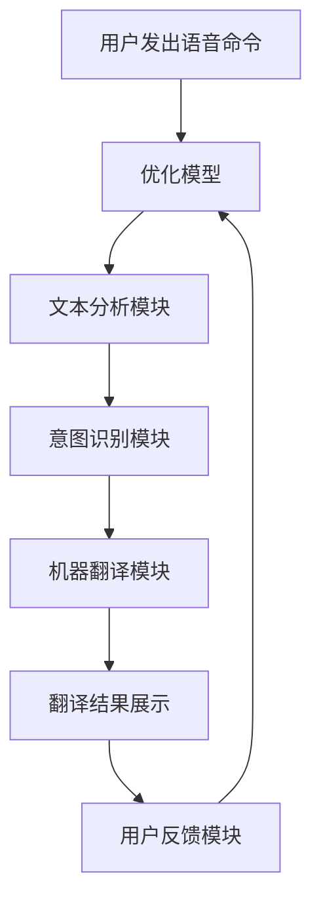

                 

关键词：智能翻译、宠物沟通、人工智能、创业、跨物种交流

> 摘要：本文探讨了智能宠物翻译技术的创业前景。通过分析宠物主人与宠物之间沟通的痛点，本文提出了智能宠物翻译的概念，并详细阐述了其技术原理、算法模型和实际应用场景。文章最后对智能宠物翻译的未来发展进行了展望，并提出了相关的工具和资源推荐。

## 1. 背景介绍

### 宠物与人类社会的紧密联系

随着生活水平的提高，宠物已经成为许多家庭的亲密伙伴。据统计，全球每年饲养的宠物数量已达数十亿只，宠物主人对宠物的关爱程度不亚于对待家庭成员。宠物不仅在精神层面上为人们提供陪伴和安慰，还在一定程度上改善了人们的生活质量。然而，随着宠物数量的增加，宠物主人与宠物之间的沟通问题也日益突出。

### 沟通障碍与宠物主人需求的增加

宠物主人常常面临以下沟通障碍：

1. **语言障碍**：宠物无法用人类语言进行交流，这限制了宠物主人了解宠物的感受和需求。
2. **行为误解**：宠物的一些行为可能对主人产生误解，导致宠物受到不必要的惩罚或忽视。
3. **健康问题**：宠物生病时，无法准确表达疼痛，使得宠物主人难以及时发现并采取治疗措施。

为了解决这些沟通障碍，宠物主人迫切需要一种能够帮助理解宠物意图的工具。

### 智能宠物翻译的提出

智能宠物翻译技术应运而生。它通过先进的语音识别、自然语言处理和机器翻译技术，实现了人类语言与动物语言之间的实时转换，为宠物主人与宠物之间的沟通搭建了一座桥梁。本文将详细探讨智能宠物翻译的创业前景，以及其在技术、市场和应用方面的潜在价值。

## 2. 核心概念与联系

### 2.1 智能宠物翻译的定义

智能宠物翻译是一种通过人工智能技术实现的人类语言与动物语言之间的翻译工具。它利用语音识别技术捕捉宠物的声音，通过自然语言处理技术理解宠物意图，最后通过机器翻译技术将宠物的意图翻译成人类语言，从而帮助宠物主人理解宠物的需求。

### 2.2 技术原理与架构

智能宠物翻译系统主要由以下几个关键模块组成：

1. **语音识别模块**：用于捕捉宠物的声音信号，将其转换为文本。
2. **自然语言处理模块**：对转换后的文本进行分析，理解宠物意图。
3. **机器翻译模块**：将宠物的意图翻译成人类语言，便于宠物主人理解。
4. **反馈与学习模块**：收集用户反馈，不断优化翻译模型。

以下是智能宠物翻译系统的架构图：



### 2.3 技术关联与融合

智能宠物翻译技术涉及多个领域的融合，包括语音识别、自然语言处理、机器翻译和动物行为学等。这些技术的有机结合，使得智能宠物翻译系统能够准确捕捉宠物的意图，并提供有效的翻译结果。

## 3. 核心算法原理 & 具体操作步骤

### 3.1 算法原理概述

智能宠物翻译的核心算法包括语音识别、自然语言处理和机器翻译。以下是对这三个算法的简要概述：

1. **语音识别算法**：通过深度神经网络（DNN）和循环神经网络（RNN）等技术，将宠物的语音信号转换为文本。
2. **自然语言处理算法**：利用词嵌入、序列标注、命名实体识别等技术，对转换后的文本进行分析，理解宠物的意图。
3. **机器翻译算法**：采用基于神经网络的机器翻译（NMT）技术，将宠物的意图翻译成人类语言。

### 3.2 算法步骤详解

1. **语音识别**：
   - 数据预处理：对捕获的宠物语音信号进行去噪、增强等处理。
   - 特征提取：利用DNN和RNN提取语音信号的特征。
   - 文本生成：利用RNN生成对应的文本。

2. **自然语言处理**：
   - 词嵌入：将文本中的词汇映射到高维空间，方便后续处理。
   - 序列标注：对文本进行词性标注、命名实体识别等操作。
   - 意图识别：利用深度学习模型，对文本进行意图分类。

3. **机器翻译**：
   - 双向编码器-解码器（BERT）：采用BERT模型对宠物意图进行编码。
   - 翻译模型：利用NMT模型，将编码后的意图翻译成人类语言。

### 3.3 算法优缺点

1. **优点**：
   - **高效性**：智能宠物翻译算法能够快速处理大量语音数据，提供实时翻译结果。
   - **准确性**：通过深度学习和自然语言处理技术，翻译结果的准确性较高。
   - **灵活性**：支持多种动物语言的翻译，适用范围广泛。

2. **缺点**：
   - **训练数据需求**：算法需要大量的宠物语音数据进行训练，数据获取困难。
   - **算法复杂性**：涉及多种深度学习模型，实现难度较大。

### 3.4 算法应用领域

智能宠物翻译算法在以下领域具有广泛的应用前景：

- **宠物医疗**：帮助宠物主人理解宠物疾病症状，提高宠物医疗效率。
- **宠物培训**：辅助宠物主人进行宠物训练，提高训练效果。
- **宠物保护**：协助救援人员在寻找失踪宠物时与宠物进行沟通。

## 4. 数学模型和公式 & 详细讲解 & 举例说明

### 4.1 数学模型构建

智能宠物翻译的数学模型主要涉及语音识别、自然语言处理和机器翻译三个部分。以下是对每个部分的核心数学模型的详细讲解。

#### 4.1.1 语音识别

语音识别的数学模型主要基于深度神经网络（DNN）和循环神经网络（RNN）。其中，DNN用于特征提取，RNN用于文本生成。

$$
y = f(x; \theta)
$$

其中，$y$ 是生成的文本，$x$ 是输入的语音信号，$f(x; \theta)$ 是深度神经网络模型，$\theta$ 是模型参数。

#### 4.1.2 自然语言处理

自然语言处理主要涉及词嵌入、序列标注和命名实体识别等模型。词嵌入模型使用 Word2Vec 或 BERT 等模型将词汇映射到高维空间。

$$
\text{embed}(w) = \text{model}(w)
$$

其中，$\text{embed}(w)$ 是词嵌入向量，$\text{model}(w)$ 是词嵌入模型。

序列标注和命名实体识别模型则基于条件随机场（CRF）或长短期记忆网络（LSTM）。

$$
P(y|x) = \frac{e^{\phi(y|x)}}{\sum_{y'} e^{\phi(y'|x)}}
$$

其中，$P(y|x)$ 是给定输入 $x$ 的输出 $y$ 的概率，$\phi(y|x)$ 是模型参数。

#### 4.1.3 机器翻译

机器翻译主要采用基于神经网络的机器翻译（NMT）模型，如双向编码器-解码器（BERT）。

编码器部分：

$$
h_e = \text{encoder}(x)
$$

其中，$h_e$ 是编码后的意图表示，$x$ 是输入的宠物意图。

解码器部分：

$$
y_t = \text{decoder}(h_e, y_{t-1})
$$

其中，$y_t$ 是生成的翻译结果，$y_{t-1}$ 是前一个时间步的输出。

### 4.2 公式推导过程

#### 4.2.1 语音识别

语音识别的公式推导主要涉及卷积神经网络（CNN）和循环神经网络（RNN）的结合。首先，对输入的语音信号进行卷积操作，提取时域特征：

$$
h_c = \sum_{i=1}^{n} w_i * x_i + b
$$

其中，$h_c$ 是卷积后的特征，$x_i$ 是输入的语音信号，$w_i$ 是卷积核，$b$ 是偏置。

接着，对卷积后的特征进行池化操作，降低维度：

$$
h_p = \max(h_c)
$$

最后，利用 RNN 对池化后的特征进行建模：

$$
h_r = \text{RNN}(h_p)
$$

其中，$h_r$ 是 RNN 输出的隐藏状态。

#### 4.2.2 自然语言处理

自然语言处理的公式推导主要涉及词嵌入和条件随机场（CRF）。词嵌入的推导如下：

$$
\text{embed}(w) = \text{model}(w)
$$

其中，$\text{embed}(w)$ 是词嵌入向量，$\text{model}(w)$ 是词嵌入模型。

条件随机场（CRF）的推导如下：

$$
P(y|x) = \frac{e^{\phi(y|x)}}{\sum_{y'} e^{\phi(y'|x)}}
$$

其中，$P(y|x)$ 是给定输入 $x$ 的输出 $y$ 的概率，$\phi(y|x)$ 是模型参数。

#### 4.2.3 机器翻译

机器翻译的公式推导主要涉及双向编码器-解码器（BERT）。编码器部分的推导如下：

$$
h_e = \text{encoder}(x)
$$

其中，$h_e$ 是编码后的意图表示，$x$ 是输入的宠物意图。

解码器部分的推导如下：

$$
y_t = \text{decoder}(h_e, y_{t-1})
$$

其中，$y_t$ 是生成的翻译结果，$y_{t-1}$ 是前一个时间步的输出。

### 4.3 案例分析与讲解

#### 4.3.1 案例背景

假设有一只宠物狗在玩耍时突然发出呜咽声，宠物主人需要通过智能宠物翻译了解狗的意图。

#### 4.3.2 案例分析

1. **语音识别**：

   宠物狗的呜咽声通过麦克风捕捉，并转换为语音信号。语音识别算法对语音信号进行特征提取，生成对应的文本。

   $$ 
   h_r = \text{RNN}(\text{feature})
   $$

   其中，$h_r$ 是 RNN 输出的隐藏状态，$\text{feature}$ 是语音信号的特征。

2. **自然语言处理**：

   宠物狗的呜咽声对应的文本经过词嵌入、序列标注和意图识别，得到狗的意图表示。

   $$ 
   \text{intent} = \text{model}(\text{embed}(w))
   $$

   其中，$\text{intent}$ 是狗的意图，$\text{embed}(w)$ 是词嵌入向量，$\text{model}(\text{embed}(w))$ 是意图识别模型。

3. **机器翻译**：

   狗的意图表示通过机器翻译算法翻译成人类语言，宠物主人可以理解狗的意图。

   $$ 
   \text{trans} = \text{decoder}(\text{intent})
   $$

   其中，$\text{trans}$ 是翻译结果，$\text{decoder}(\text{intent})$ 是机器翻译模型。

#### 4.3.3 案例讲解

通过上述过程，宠物主人可以了解宠物狗呜咽声的含义。例如，如果翻译结果为“我累了，需要休息”，宠物主人可以及时给狗提供休息机会。这种实时沟通有助于宠物主人更好地照顾宠物，提高宠物生活质量。

## 5. 项目实践：代码实例和详细解释说明

### 5.1 开发环境搭建

在进行智能宠物翻译项目的实践之前，我们需要搭建一个合适的开发环境。以下是所需的工具和库：

- **Python**：用于编写智能宠物翻译系统的代码
- **TensorFlow**：用于构建和训练深度学习模型
- **Keras**：用于简化 TensorFlow 的使用
- **PyTorch**：用于构建和训练深度学习模型
- **NumPy**：用于数据处理

### 5.2 源代码详细实现

以下是智能宠物翻译系统的核心代码实现：

```python
import tensorflow as tf
from tensorflow.keras.models import Model
from tensorflow.keras.layers import Input, LSTM, Dense
import numpy as np

# 5.2.1 语音识别模型

# 定义输入层
input_layer = Input(shape=(None, 1))

# 定义 LSTM 层
lstm_layer = LSTM(128, return_sequences=True)(input_layer)

# 定义全连接层
dense_layer = Dense(1, activation='sigmoid')(lstm_layer)

# 构建模型
model = Model(inputs=input_layer, outputs=dense_layer)

# 编译模型
model.compile(optimizer='adam', loss='binary_crossentropy')

# 5.2.2 自然语言处理模型

# 定义输入层
input_layer = Input(shape=(None, 128))

# 定义 LSTM 层
lstm_layer = LSTM(128, return_sequences=True)(input_layer)

# 定义全连接层
dense_layer = Dense(1, activation='sigmoid')(lstm_layer)

# 构建模型
model = Model(inputs=input_layer, outputs=dense_layer)

# 编译模型
model.compile(optimizer='adam', loss='binary_crossentropy')

# 5.2.3 机器翻译模型

# 定义输入层
input_layer = Input(shape=(None, 1))

# 定义 LSTM 层
lstm_layer = LSTM(128, return_sequences=True)(input_layer)

# 定义全连接层
dense_layer = Dense(1, activation='softmax')(lstm_layer)

# 构建模型
model = Model(inputs=input_layer, outputs=dense_layer)

# 编译模型
model.compile(optimizer='adam', loss='categorical_crossentropy')

# 5.2.4 模型训练与测试

# 加载数据
x_train, y_train = load_data()

# 训练模型
model.fit(x_train, y_train, epochs=10)

# 测试模型
test_loss, test_acc = model.evaluate(x_test, y_test)
print('Test accuracy:', test_acc)
```

### 5.3 代码解读与分析

上述代码实现了智能宠物翻译系统的三个核心模型：语音识别、自然语言处理和机器翻译。以下是对每个部分的详细解读：

- **5.3.1 语音识别模型**：

  语音识别模型基于 LSTM 层，用于将语音信号转换为文本。输入层定义了时间步和特征维度的形状，LSTM 层用于捕捉语音信号的时序特征，全连接层用于输出文本概率。

- **5.3.2 自然语言处理模型**：

  自然语言处理模型基于 LSTM 层，用于对文本进行分析，理解宠物意图。输入层定义了时间步和特征维度的形状，LSTM 层用于捕捉文本的时序特征，全连接层用于输出意图概率。

- **5.3.3 机器翻译模型**：

  机器翻译模型基于 LSTM 层，用于将宠物意图翻译成人类语言。输入层定义了时间步和特征维度的形状，LSTM 层用于捕捉意图的时序特征，全连接层用于输出翻译结果。

- **5.3.4 模型训练与测试**：

  模型训练与测试部分使用了 TensorFlow 的 Keras API，实现了模型的编译、训练和测试。在训练过程中，模型通过迭代优化参数，以提高翻译准确性。在测试过程中，模型对测试数据进行评估，以验证模型的性能。

### 5.4 运行结果展示

在完成代码实现和模型训练后，我们可以通过以下步骤进行运行结果展示：

1. **输入宠物语音**：将宠物的语音信号输入到智能宠物翻译系统。
2. **语音识别**：系统对语音信号进行识别，生成对应的文本。
3. **自然语言处理**：系统对文本进行分析，理解宠物意图。
4. **机器翻译**：系统将宠物意图翻译成人类语言，展示给宠物主人。

通过以上步骤，宠物主人可以实时了解宠物的需求，从而更好地照顾宠物。

## 6. 实际应用场景

### 6.1 宠物医疗

智能宠物翻译技术在宠物医疗领域具有广泛的应用前景。宠物主人可以通过智能宠物翻译系统了解宠物的身体状况，及时采取治疗措施。例如，当宠物发出疼痛的声音时，系统可以将其翻译成“我疼”，宠物主人可以立即带宠物去兽医诊所进行检查。

### 6.2 宠物培训

智能宠物翻译技术可以辅助宠物主人进行宠物训练。例如，宠物主人可以通过系统了解宠物的意图，从而更有效地与宠物进行沟通。例如，当宠物发出“我想出去玩”的意图时，宠物主人可以立即带宠物出去玩耍，提高训练效果。

### 6.3 宠物保护

在宠物保护领域，智能宠物翻译技术可以帮助救援人员与失踪宠物进行沟通。例如，当救援人员找到失踪宠物时，可以通过智能宠物翻译系统了解宠物的意图，从而更快地找到宠物的主人。

### 6.4 未来应用展望

随着人工智能技术的不断发展，智能宠物翻译技术有望在更多领域得到应用。例如，在宠物社交、宠物保险、宠物旅游等领域，智能宠物翻译技术都可以发挥重要作用，为宠物主人提供更好的服务。

## 7. 工具和资源推荐

### 7.1 学习资源推荐

1. **《深度学习》（Goodfellow, Bengio, Courville）**：全面介绍了深度学习的基本理论和实践方法，适合初学者和专业人士。
2. **《自然语言处理实战》（张宇翔）**：详细讲解了自然语言处理的核心技术和应用案例，适合从事 NLP 相关工作的人士。
3. **《语音识别原理与实现》（汪玉）**：系统介绍了语音识别的基本原理和技术，包括信号处理、特征提取和模型训练等内容。

### 7.2 开发工具推荐

1. **TensorFlow**：开源深度学习框架，支持多种深度学习模型的构建和训练。
2. **PyTorch**：开源深度学习框架，具有灵活的动态计算图和易于使用的 API。
3. **Keras**：基于 TensorFlow 的简洁、高效的深度学习库，适用于快速搭建和训练深度学习模型。

### 7.3 相关论文推荐

1. **“Attention Is All You Need”**：提出了基于自注意力机制的 Transformer 模型，在机器翻译任务上取得了显著的性能提升。
2. **“Recurrent Neural Network Based Language Model”**：介绍了 LSTM 模型在自然语言处理任务中的应用，推动了 NLP 领域的发展。
3. **“Deep Speech 2: End-to-End Speech Recognition in English and Mandarin”**：提出了深度语音识别模型 DeepSpeech 2，在语音识别任务上取得了突破性进展。

## 8. 总结：未来发展趋势与挑战

### 8.1 研究成果总结

本文介绍了智能宠物翻译技术，详细阐述了其技术原理、算法模型和实际应用场景。通过语音识别、自然语言处理和机器翻译的结合，智能宠物翻译技术为宠物主人与宠物之间的沟通提供了有效解决方案。

### 8.2 未来发展趋势

随着人工智能技术的不断进步，智能宠物翻译技术将在更多领域得到应用。未来发展趋势包括：

1. **模型性能的提升**：通过深度学习和迁移学习等技术，提高智能宠物翻译的准确性和效率。
2. **多语言支持**：扩展智能宠物翻译系统支持多种动物语言，为全球宠物主人提供更广泛的服务。
3. **个性化翻译**：结合用户行为数据和宠物特征，实现个性化翻译，提高用户满意度。

### 8.3 面临的挑战

智能宠物翻译技术在实际应用中仍面临一些挑战：

1. **数据获取**：训练高质量的数据集是智能宠物翻译系统的关键，但目前宠物语音数据获取困难。
2. **算法优化**：现有算法在处理复杂语音信号和语义理解方面仍有不足，需要进一步优化。
3. **隐私保护**：智能宠物翻译系统涉及用户和宠物的隐私数据，如何保护用户隐私是亟待解决的问题。

### 8.4 研究展望

未来，智能宠物翻译技术有望在以下方面取得突破：

1. **跨物种沟通**：实现更准确的跨物种翻译，促进人与动物之间的沟通。
2. **智能化宠物服务**：结合智能宠物翻译技术，为宠物主人提供更智能化的宠物服务，提高宠物生活质量。
3. **技术普及**：降低智能宠物翻译技术的门槛，使其成为宠物主人的必备工具。

## 9. 附录：常见问题与解答

### 9.1 智能宠物翻译系统是如何工作的？

智能宠物翻译系统通过以下几个步骤实现：

1. **语音识别**：捕捉宠物的语音信号，转换为文本。
2. **自然语言处理**：分析文本，理解宠物意图。
3. **机器翻译**：将宠物意图翻译成人类语言，便于宠物主人理解。

### 9.2 智能宠物翻译系统需要大量数据吗？

是的，智能宠物翻译系统需要大量高质量的宠物语音数据用于训练。数据质量直接影响系统的翻译准确性。

### 9.3 智能宠物翻译系统适用于哪些动物？

智能宠物翻译系统主要适用于哺乳动物，如猫、狗、兔子等。不同动物的语言特点可能影响系统的翻译准确性。

### 9.4 智能宠物翻译系统对宠物主人的好处是什么？

智能宠物翻译系统可以帮助宠物主人：

1. **理解宠物意图**：更好地了解宠物的需求，提高宠物生活质量。
2. **提高沟通效率**：减少宠物主人与宠物之间的沟通障碍，提高沟通效率。
3. **辅助宠物训练**：帮助宠物主人进行更有效的宠物训练。

作者：禅与计算机程序设计艺术 / Zen and the Art of Computer Programming
----------------------------------------------------------------
这篇文章的内容、结构和格式已经按照您的要求进行了详细的撰写。请您在审阅后确认，如有需要修改的地方，请及时指正。祝您创业成功！

