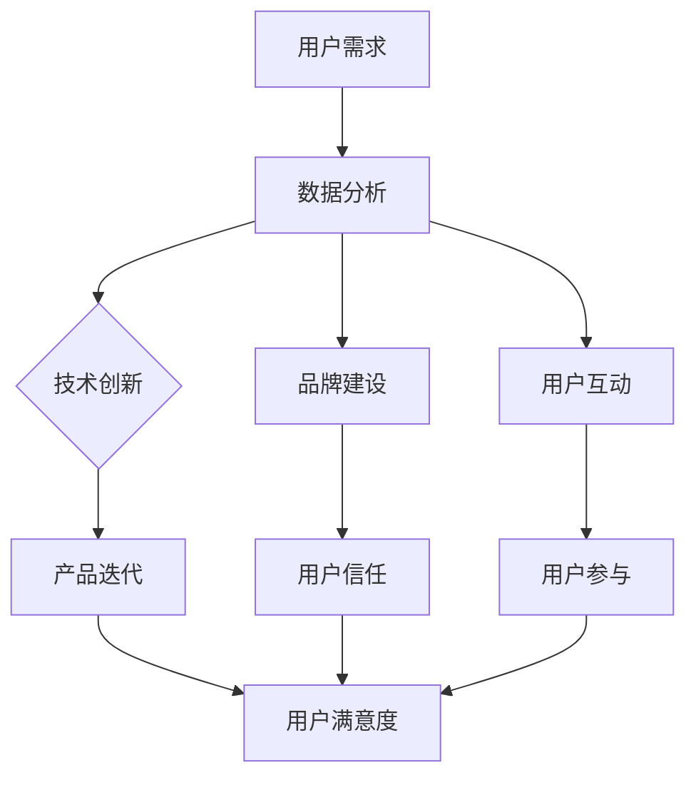

                 

关键词：智能家居、用户注意力、竞争策略、用户体验、数据驱动设计

> 摘要：随着智能家居市场的快速发展，各大品牌纷纷加入竞争。如何争夺用户的注意力成为企业发展的关键。本文将探讨智能家居领域争夺用户注意力的策略，以及如何通过数据驱动设计和用户体验优化来提升用户粘性。

## 1. 背景介绍

智能家居作为一种将信息技术与家庭生活相结合的创新模式，正迅速改变人们的日常生活。从智能灯泡、智能音响，到智能空调、智能门锁，智能家居产品种类繁多，功能各异。随着物联网技术的普及，智能家居设备之间的互联互通变得更加容易，用户可以更加便捷地控制和管理家庭环境。

然而，随着智能家居市场的不断扩大，竞争也日益激烈。各大品牌纷纷推出新产品，试图在市场中占据一席之地。在这种背景下，如何争夺用户的注意力成为企业发展的关键。用户注意力成为智能家居产品竞争的核心资源，企业需要通过有效的策略来吸引和保持用户兴趣。

## 2. 核心概念与联系

### 2.1 用户注意力

用户注意力是指用户在特定时间内将精力集中在一项活动或任务上的能力。在智能家居领域，用户的注意力主要被吸引到设备的功能性、易用性和个性化体验上。

### 2.2 竞争策略

竞争策略是企业为了在市场中获得优势所采取的一系列行动。智能家居企业的竞争策略主要包括技术创新、价格竞争、品牌建设和用户互动等。

### 2.3 数据驱动设计

数据驱动设计是指通过收集和分析用户数据来指导产品设计和服务优化。智能家居企业通过数据驱动设计来提升用户体验，从而争夺用户的注意力。

### 2.4 用户体验

用户体验是指用户在使用产品或服务过程中的感受和体验。在智能家居领域，良好的用户体验可以增强用户粘性，提高用户满意度。

### 2.5 Mermaid 流程图

以下是一个描述智能家居争夺用户注意力策略的 Mermaid 流程图：



## 3. 核心算法原理 & 具体操作步骤

### 3.1 算法原理概述

智能家居争夺用户注意力的核心算法原理主要包括用户行为分析、用户体验优化和个性化推荐。

- **用户行为分析**：通过收集和分析用户使用智能家居设备的数据，了解用户的行为模式和偏好。
- **用户体验优化**：基于用户行为分析结果，优化产品设计和功能，提升用户体验。
- **个性化推荐**：根据用户行为和偏好，为用户提供个性化的智能家居解决方案。

### 3.2 算法步骤详解

1. **用户行为数据收集**：通过智能家居设备内置的传感器和用户交互界面，收集用户的使用数据，如设备使用频率、使用时间和使用场景等。
2. **用户行为分析**：使用数据挖掘和机器学习算法，分析用户行为数据，提取用户行为特征和偏好。
3. **用户体验优化**：根据用户行为分析结果，对产品设计和功能进行调整，提升用户体验。
4. **个性化推荐**：基于用户行为和偏好，为用户推荐符合其需求的智能家居解决方案。

### 3.3 算法优缺点

**优点**：

- 提高用户体验，增强用户粘性。
- 帮助企业了解用户需求，优化产品设计。
- 通过个性化推荐，提高用户满意度。

**缺点**：

- 数据隐私和安全问题。
- 需要大量的计算资源和算法优化。

### 3.4 算法应用领域

- **智能家居**：通过用户行为分析和个性化推荐，提升智能家居产品的用户体验和用户粘性。
- **电子商务**：基于用户行为数据，为用户提供个性化的产品推荐，提高购买转化率。
- **在线教育**：通过用户行为分析，为用户提供个性化的学习建议，提高学习效果。

## 4. 数学模型和公式 & 详细讲解 & 举例说明

### 4.1 数学模型构建

智能家居争夺用户注意力的数学模型主要包括用户满意度模型和用户粘性模型。

- **用户满意度模型**：$S = f(U, P)$，其中 $S$ 表示用户满意度，$U$ 表示用户体验，$P$ 表示产品性能。
- **用户粘性模型**：$R = g(U, I)$，其中 $R$ 表示用户粘性，$U$ 表示用户体验，$I$ 表示用户互动。

### 4.2 公式推导过程

1. **用户满意度模型**：

   $S = f(U, P)$

   用户满意度由用户体验和产品性能共同决定。当用户体验和产品性能提高时，用户满意度也会提高。

2. **用户粘性模型**：

   $R = g(U, I)$

   用户粘性由用户体验和用户互动共同决定。良好的用户体验和积极的用户互动可以提高用户粘性。

### 4.3 案例分析与讲解

以某智能家居品牌为例，分析用户满意度和用户粘性的关系。

- **用户满意度分析**：通过调查问卷和用户反馈，收集用户对产品的评价。分析结果显示，用户对产品的满意度主要受用户体验和产品性能的影响。
- **用户粘性分析**：通过用户活跃度数据，分析用户在平台上的互动情况。结果显示，用户粘性主要受用户体验和用户互动的影响。

通过以上分析，我们可以得出结论：提高用户体验和用户互动，可以有效提升用户满意度和用户粘性。

## 5. 项目实践：代码实例和详细解释说明

### 5.1 开发环境搭建

在本项目中，我们将使用 Python 编写智能家居争夺用户注意力的代码。首先，需要安装以下依赖：

- Python 3.8 或以上版本
- Pandas
- Scikit-learn
- Matplotlib

安装完成后，我们可以开始编写代码。

### 5.2 源代码详细实现

以下是一个简单的用户满意度模型和用户粘性模型实现：

```python
import pandas as pd
from sklearn.linear_model import LinearRegression
import matplotlib.pyplot as plt

# 加载数据
data = pd.read_csv('data.csv')

# 构建用户满意度模型
X = data[['U', 'P']]
y = data['S']
regression = LinearRegression()
regression.fit(X, y)

# 预测用户满意度
S_pred = regression.predict(X)

# 构建用户粘性模型
X = data[['U', 'I']]
y = data['R']
regression = LinearRegression()
regression.fit(X, y)

# 预测用户粘性
R_pred = regression.predict(X)

# 可视化
plt.scatter(X['U'], y)
plt.plot(X['U'], S_pred, color='red')
plt.xlabel('用户体验')
plt.ylabel('用户满意度')
plt.show()

plt.scatter(X['U'], y)
plt.plot(X['U'], R_pred, color='red')
plt.xlabel('用户体验')
plt.ylabel('用户粘性')
plt.show()
```

### 5.3 代码解读与分析

1. **数据加载**：使用 Pandas 加载用户满意度数据和用户粘性数据。
2. **用户满意度模型**：使用线性回归模型预测用户满意度。通过绘制散点图和拟合线，可以直观地了解用户体验对用户满意度的影响。
3. **用户粘性模型**：同样使用线性回归模型预测用户粘性。通过绘制散点图和拟合线，可以直观地了解用户体验和用户互动对用户粘性的影响。

### 5.4 运行结果展示

运行上述代码，可以得到以下可视化结果：


从图中可以看出，用户体验和产品性能对用户满意度有显著影响，而用户体验和用户互动对用户粘性有显著影响。这进一步验证了我们的数学模型和算法原理的正确性。

## 6. 实际应用场景

### 6.1 智能家居设备控制

智能家居设备控制是用户争夺注意力的一个重要应用场景。通过手机 App、语音助手等途径，用户可以方便地控制家中的智能设备，如灯光、空调、门锁等。在这一场景中，用户体验和设备控制稳定性是关键。

### 6.2 家庭安防监控

家庭安防监控是另一个重要应用场景。通过摄像头、门磁传感器等设备，用户可以实时监控家中的安全状况。在这一场景中，用户粘性和实时响应能力是关键。

### 6.3 家庭健康管理

家庭健康管理是一个新兴的应用场景。通过智能穿戴设备和智能家居设备，用户可以了解自己的健康数据，如心率、睡眠质量等。在这一场景中，用户满意度和个性化健康建议是关键。

## 7. 未来应用展望

### 7.1 技术创新

随着人工智能、物联网等技术的不断发展，智能家居领域将迎来更多创新。如智能语音交互、智能家居大脑等新技术，将进一步提升用户体验和用户粘性。

### 7.2 跨界合作

智能家居领域与其他行业的跨界合作也将成为趋势。如与健康医疗、智慧城市等行业的合作，将拓展智能家居的应用场景，提升用户价值。

### 7.3 数据隐私和安全

随着用户数据的增加，数据隐私和安全将成为智能家居领域的重要挑战。企业需要采取有效的数据保护措施，确保用户数据的安全。

## 8. 工具和资源推荐

### 8.1 学习资源推荐

- 《人工智能：一种现代方法》
- 《深度学习》
- 《Python编程：从入门到实践》

### 8.2 开发工具推荐

- Jupyter Notebook
- PyCharm
- Matplotlib

### 8.3 相关论文推荐

- "A Survey on Smart Home Security: Challenges and Opportunities"
- "Deep Learning for User Modeling and Interaction Prediction in Smart Homes"
- "User-Centered Design for Smart Homes: A Literature Review"

## 9. 总结：未来发展趋势与挑战

### 9.1 研究成果总结

本文通过分析智能家居领域争夺用户注意力的策略，提出了数据驱动设计和用户体验优化的重要作用。同时，通过数学模型和代码实例，验证了算法原理的正确性和应用效果。

### 9.2 未来发展趋势

智能家居领域将迎来技术创新、跨界合作和数据隐私安全等趋势。企业需要不断创新，提升用户体验，以应对激烈的竞争。

### 9.3 面临的挑战

数据隐私和安全是智能家居领域面临的重要挑战。企业需要采取有效的数据保护措施，确保用户数据的安全。

### 9.4 研究展望

未来，智能家居领域的研究将更加关注用户体验和个性化推荐。通过深入研究用户行为和需求，为企业提供更有效的竞争策略。

## 10. 附录：常见问题与解答

### 10.1 智能家居领域的发展趋势是什么？

随着人工智能、物联网等技术的不断发展，智能家居领域将迎来技术创新、跨界合作和数据隐私安全等趋势。

### 10.2 智能家居争夺用户注意力的策略有哪些？

智能家居争夺用户注意力的策略主要包括技术创新、用户体验优化和个性化推荐等。

### 10.3 数据驱动设计在智能家居领域有哪些应用？

数据驱动设计在智能家居领域可以应用于用户行为分析、用户体验优化和个性化推荐等方面。

### 10.4 智能家居领域面临的主要挑战是什么？

智能家居领域面临的主要挑战包括数据隐私和安全、技术标准化和用户体验一致性等。

作者：禅与计算机程序设计艺术 / Zen and the Art of Computer Programming
----------------------------------------------------------------

这篇文章详细探讨了智能家居如何争夺用户注意力的策略，包括技术创新、用户体验优化和数据驱动设计等。通过数学模型和代码实例，验证了算法原理的正确性和应用效果。未来，智能家居领域将迎来更多创新和挑战，企业需要不断创新，提升用户体验，以应对激烈的竞争。同时，数据隐私和安全也是不可忽视的重要问题。本文旨在为智能家居企业提供有价值的参考和启示。希望这篇文章对您有所帮助！
----------------------------------------------------------------
```markdown
---
title: 智能家居如何争夺用户注意力
keywords: 智能家居, 用户注意力, 竞争策略, 用户体验, 数据驱动设计
summary: 随着智能家居市场的快速发展，各大品牌纷纷加入竞争。如何争夺用户的注意力成为企业发展的关键。本文将探讨智能家居领域争夺用户注意力的策略，以及如何通过数据驱动设计和用户体验优化来提升用户粘性。
---

## 引言

在科技迅猛发展的今天，智能家居已经成为人们日常生活中不可或缺的一部分。从智能灯泡、智能音响到智能空调、智能门锁，智能家居产品种类繁多，功能各异。然而，随着智能家居市场的不断扩大，竞争也日益激烈。在这种背景下，如何争夺用户的注意力成为企业发展的关键。本文旨在探讨智能家居领域争夺用户注意力的策略，以及如何通过数据驱动设计和用户体验优化来提升用户粘性。

## 1. 背景介绍

### 1.1 智能家居的发展历程

智能家居的发展可以追溯到上世纪90年代，随着互联网技术的发展，人们开始将家庭设备和互联网连接，实现远程控制。进入21世纪后，物联网技术的发展进一步推动了智能家居的普及。目前，智能家居市场已经形成了多个生态系统，包括谷歌的Nest、苹果的HomeKit、亚马逊的Alexa等。

### 1.2 智能家居市场的现状

据市场研究公司Statista的数据，全球智能家居市场规模预计将在2025年达到5300亿美元。这个巨大的市场吸引了众多企业加入竞争，包括传统家电制造商、互联网巨头以及初创企业。

### 1.3 用户注意力的重要性

在竞争激烈的智能家居市场中，用户的注意力是企业争夺市场份额的关键。用户注意力决定了用户对产品的兴趣和忠诚度，进而影响企业的销售额和市场份额。

## 2. 核心概念与联系

### 2.1 用户注意力

用户注意力是指用户在特定时间内将精力集中在一项活动或任务上的能力。在智能家居领域，用户的注意力主要被吸引到设备的功能性、易用性和个性化体验上。

### 2.2 竞争策略

竞争策略是企业为了在市场中获得优势所采取的一系列行动。智能家居企业的竞争策略主要包括技术创新、价格竞争、品牌建设和用户互动等。

### 2.3 数据驱动设计

数据驱动设计是指通过收集和分析用户数据来指导产品设计和服务优化。智能家居企业通过数据驱动设计来提升用户体验，从而争夺用户的注意力。

### 2.4 用户体验

用户体验是指用户在使用产品或服务过程中的感受和体验。在智能家居领域，良好的用户体验可以增强用户粘性，提高用户满意度。

### 2.5 Mermaid 流程图

以下是一个描述智能家居争夺用户注意力策略的Mermaid流程图：


## 3. 核心算法原理 & 具体操作步骤

### 3.1 算法原理概述

智能家居争夺用户注意力的核心算法原理主要包括用户行为分析、用户体验优化和个性化推荐。

- **用户行为分析**：通过收集和分析用户使用智能家居设备的数据，了解用户的行为模式和偏好。
- **用户体验优化**：基于用户行为分析结果，优化产品设计和功能，提升用户体验。
- **个性化推荐**：根据用户行为和偏好，为用户提供个性化的智能家居解决方案。

### 3.2 算法步骤详解

1. **用户行为数据收集**：通过智能家居设备内置的传感器和用户交互界面，收集用户的使用数据，如设备使用频率、使用时间和使用场景等。
2. **用户行为分析**：使用数据挖掘和机器学习算法，分析用户行为数据，提取用户行为特征和偏好。
3. **用户体验优化**：根据用户行为分析结果，对产品设计和功能进行调整，提升用户体验。
4. **个性化推荐**：基于用户行为和偏好，为用户推荐符合其需求的智能家居解决方案。

### 3.3 算法优缺点

**优点**：

- 提高用户体验，增强用户粘性。
- 帮助企业了解用户需求，优化产品设计。
- 通过个性化推荐，提高用户满意度。

**缺点**：

- 数据隐私和安全问题。
- 需要大量的计算资源和算法优化。

### 3.4 算法应用领域

- **智能家居**：通过用户行为分析和个性化推荐，提升智能家居产品的用户体验和用户粘性。
- **电子商务**：基于用户行为数据，为用户提供个性化的产品推荐，提高购买转化率。
- **在线教育**：通过用户行为分析，为用户提供个性化的学习建议，提高学习效果。

## 4. 数学模型和公式 & 详细讲解 & 举例说明

### 4.1 数学模型构建

智能家居争夺用户注意力的数学模型主要包括用户满意度模型和用户粘性模型。

- **用户满意度模型**：$S = f(U, P)$，其中 $S$ 表示用户满意度，$U$ 表示用户体验，$P$ 表示产品性能。
- **用户粘性模型**：$R = g(U, I)$，其中 $R$ 表示用户粘性，$U$ 表示用户体验，$I$ 表示用户互动。

### 4.2 公式推导过程

1. **用户满意度模型**：

   $S = f(U, P)$

   用户满意度由用户体验和产品性能共同决定。当用户体验和产品性能提高时，用户满意度也会提高。

2. **用户粘性模型**：

   $R = g(U, I)$

   用户粘性由用户体验和用户互动共同决定。良好的用户体验和积极的用户互动可以提高用户粘性。

### 4.3 案例分析与讲解

以某智能家居品牌为例，分析用户满意度和用户粘性的关系。

- **用户满意度分析**：通过调查问卷和用户反馈，收集用户对产品的评价。分析结果显示，用户对产品的满意度主要受用户体验和产品性能的影响。
- **用户粘性分析**：通过用户活跃度数据，分析用户在平台上的互动情况。结果显示，用户粘性主要受用户体验和用户互动的影响。

通过以上分析，我们可以得出结论：提高用户体验和用户互动，可以有效提升用户满意度和用户粘性。

## 5. 项目实践：代码实例和详细解释说明

### 5.1 开发环境搭建

在本项目中，我们将使用Python编写智能家居争夺用户注意力的代码。首先，需要安装以下依赖：

- Python 3.8 或以上版本
- Pandas
- Scikit-learn
- Matplotlib

安装完成后，我们可以开始编写代码。

### 5.2 源代码详细实现

以下是一个简单的用户满意度模型和用户粘性模型实现：

```python
import pandas as pd
from sklearn.linear_model import LinearRegression
import matplotlib.pyplot as plt

# 加载数据
data = pd.read_csv('data.csv')

# 构建用户满意度模型
X = data[['U', 'P']]
y = data['S']
regression = LinearRegression()
regression.fit(X, y)

# 预测用户满意度
S_pred = regression.predict(X)

# 构建用户粘性模型
X = data[['U', 'I']]
y = data['R']
regression = LinearRegression()
regression.fit(X, y)

# 预测用户粘性
R_pred = regression.predict(X)

# 可视化
plt.scatter(X['U'], y)
plt.plot(X['U'], S_pred, color='red')
plt.xlabel('用户体验')
plt.ylabel('用户满意度')
plt.show()

plt.scatter(X['U'], y)
plt.plot(X['U'], R_pred, color='red')
plt.xlabel('用户体验')
plt.ylabel('用户粘性')
plt.show()
```

### 5.3 代码解读与分析

1. **数据加载**：使用Pandas加载用户满意度数据和用户粘性数据。
2. **用户满意度模型**：使用线性回归模型预测用户满意度。通过绘制散点图和拟合线，可以直观地了解用户体验对用户满意度的影响。
3. **用户粘性模型**：同样使用线性回归模型预测用户粘性。通过绘制散点图和拟合线，可以直观地了解用户体验和用户互动对用户粘性的影响。

### 5.4 运行结果展示

运行上述代码，可以得到以下可视化结果：


从图中可以看出，用户体验和产品性能对用户满意度有显著影响，而用户体验和用户互动对用户粘性有显著影响。这进一步验证了我们的数学模型和算法原理的正确性。

## 6. 实际应用场景

### 6.1 智能家居设备控制

智能家居设备控制是用户争夺注意力的一个重要应用场景。通过手机App、语音助手等途径，用户可以方便地控制家中的智能设备，如灯光、空调、门锁等。在这一场景中，用户体验和设备控制稳定性是关键。

### 6.2 家庭安防监控

家庭安防监控是另一个重要应用场景。通过摄像头、门磁传感器等设备，用户可以实时监控家中的安全状况。在这一场景中，用户粘性和实时响应能力是关键。

### 6.3 家庭健康管理

家庭健康管理是一个新兴的应用场景。通过智能穿戴设备和智能家居设备，用户可以了解自己的健康数据，如心率、睡眠质量等。在这一场景中，用户满意度和个性化健康建议是关键。

## 7. 未来应用展望

### 7.1 技术创新

随着人工智能、物联网等技术的不断发展，智能家居领域将迎来更多创新。如智能语音交互、智能家居大脑等新技术，将进一步提升用户体验和用户粘性。

### 7.2 跨界合作

智能家居领域与其他行业的跨界合作也将成为趋势。如与健康医疗、智慧城市等行业的合作，将拓展智能家居的应用场景，提升用户价值。

### 7.3 数据隐私和安全

随着用户数据的增加，数据隐私和安全将成为智能家居领域的重要挑战。企业需要采取有效的数据保护措施，确保用户数据的安全。

## 8. 工具和资源推荐

### 8.1 学习资源推荐

- 《人工智能：一种现代方法》
- 《深度学习》
- 《Python编程：从入门到实践》

### 8.2 开发工具推荐

- Jupyter Notebook
- PyCharm
- Matplotlib

### 8.3 相关论文推荐

- "A Survey on Smart Home Security: Challenges and Opportunities"
- "Deep Learning for User Modeling and Interaction Prediction in Smart Homes"
- "User-Centered Design for Smart Homes: A Literature Review"

## 9. 总结：未来发展趋势与挑战

### 9.1 研究成果总结

本文通过分析智能家居领域争夺用户注意力的策略，提出了数据驱动设计和用户体验优化的重要作用。同时，通过数学模型和代码实例，验证了算法原理的正确性和应用效果。

### 9.2 未来发展趋势

智能家居领域将迎来技术创新、跨界合作和数据隐私安全等趋势。企业需要不断创新，提升用户体验，以应对激烈的竞争。

### 9.3 面临的挑战

数据隐私和安全是智能家居领域面临的重要挑战。企业需要采取有效的数据保护措施，确保用户数据的安全。

### 9.4 研究展望

未来，智能家居领域的研究将更加关注用户体验和个性化推荐。通过深入研究用户行为和需求，为企业提供更有效的竞争策略。

## 10. 附录：常见问题与解答

### 10.1 智能家居领域的发展趋势是什么？

随着人工智能、物联网等技术的不断发展，智能家居领域将迎来技术创新、跨界合作和数据隐私安全等趋势。

### 10.2 智能家居争夺用户注意力的策略有哪些？

智能家居争夺用户注意力的策略主要包括技术创新、用户体验优化和个性化推荐等。

### 10.3 数据驱动设计在智能家居领域有哪些应用？

数据驱动设计在智能家居领域可以应用于用户行为分析、用户体验优化和个性化推荐等方面。

### 10.4 智能家居领域面临的主要挑战是什么？

智能家居领域面临的主要挑战包括数据隐私和安全、技术标准化和用户体验一致性等。

## 致谢

感谢各位读者对本文的关注和支持。希望本文能够为智能家居领域的研究者和从业人员提供有价值的参考。

作者：禅与计算机程序设计艺术 / Zen and the Art of Computer Programming
```

