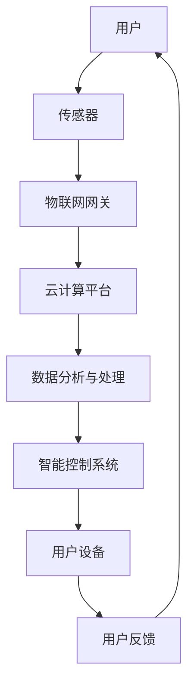

                 

关键词：智能家居、注意力争夺、生态系统、物联网、核心技术、算法、数学模型、实践案例、未来展望

> 摘要：本文深入探讨了智能家居生态系统中各技术要素之间的注意力争夺现象，分析了智能家居发展的核心概念、算法原理、数学模型，并通过实践案例展示了实际应用效果。同时，对智能家居的未来发展趋势与挑战进行了前瞻性思考。

## 1. 背景介绍

随着物联网技术的飞速发展，智能家居逐渐成为人们生活中不可或缺的一部分。从最初的简单家庭设备自动化，到如今复杂多样的智能互联系统，智能家居生态系统正在不断演进。然而，在这一过程中，各个技术要素之间的竞争与协同也日益激烈，尤其是在注意力的争夺上。

### 1.1 物联网的兴起

物联网（IoT）是智能家居生态系统的基础，它通过将物理设备与互联网连接起来，实现了数据的实时采集和共享。随着5G、边缘计算等新技术的引入，物联网的连接速度和数据处理能力得到了显著提升，为智能家居的发展提供了强大的技术支持。

### 1.2 智能家居的挑战

尽管智能家居为人们带来了诸多便利，但其发展也面临着诸多挑战。例如，数据安全、隐私保护、设备兼容性等问题。此外，随着智能家居生态系统的不断扩展，如何协调各个技术要素之间的关系，实现高效的系统协同，成为智能家居领域亟待解决的问题。

### 1.3 注意力争夺的背景

在智能家居生态系统中，各技术要素之间的注意力争夺现象日益明显。例如，硬件设备生产商为了吸引消费者的关注，不断推出具有创新功能的新产品；软件开发商则致力于提升用户体验，开发出更为智能的操作系统和应用程序。这种竞争不仅推动了智能家居技术的发展，也带来了新的挑战。

## 2. 核心概念与联系

### 2.1 智能家居核心技术

智能家居的发展离不开核心技术的支持，主要包括传感器技术、物联网技术、云计算技术、人工智能技术等。

### 2.2 智能家居生态系统的组成

智能家居生态系统由多个组成部分构成，包括硬件设备、软件平台、数据接口等。各个组成部分之间通过数据接口进行连接，实现信息的共享和协同工作。

### 2.3 Mermaid 流程图

以下是一个描述智能家居生态系统的 Mermaid 流程图：



## 3. 核心算法原理 & 具体操作步骤

### 3.1 算法原理概述

智能家居生态系统的核心算法主要包括数据采集、数据分析与处理、智能决策等。

#### 3.1.1 数据采集

数据采集是智能家居系统的第一步，通过传感器技术获取环境信息，如温度、湿度、光照强度等。

#### 3.1.2 数据分析与处理

采集到的数据需要经过处理，提取出有价值的信息。例如，通过数据分析可以判断室内温度是否适宜，是否需要调整空调温度。

#### 3.1.3 智能决策

基于处理后的数据，智能家居系统可以做出智能决策，如调整空调温度、开启照明设备等。

### 3.2 算法步骤详解

以下是智能家居系统算法的具体操作步骤：

1. 传感器采集数据；
2. 数据传输至物联网网关；
3. 物联网网关将数据上传至云计算平台；
4. 云计算平台对数据进行处理与分析；
5. 根据分析结果，智能控制系统做出相应决策；
6. 智能控制系统执行决策，调整硬件设备状态；
7. 用户通过智能设备接收反馈信息。

### 3.3 算法优缺点

#### 优点

1. 提高生活品质：通过智能家居系统，用户可以更加便捷地控制家庭设备，提高生活品质。
2. 节能减排：智能家居系统可以根据环境变化自动调整设备状态，实现节能减排。
3. 提高安全性：智能家居系统可以实时监测家庭环境，提高家庭安全性。

#### 缺点

1. 数据安全风险：智能家居系统涉及大量用户数据，存在数据泄露的风险。
2. 兼容性问题：智能家居设备种类繁多，不同设备之间的兼容性可能存在问题。

### 3.4 算法应用领域

智能家居系统的算法可以应用于家庭、酒店、办公场所等多个领域，为用户提供智能化的服务。

## 4. 数学模型和公式

### 4.1 数学模型构建

智能家居系统的数学模型主要涉及数据采集、数据分析与处理、智能决策等环节。以下是一个简单的数学模型：

$$
\text{数据模型} = \text{传感器数据} + \text{物联网数据} + \text{云计算数据} + \text{智能决策数据}
$$

### 4.2 公式推导过程

公式的推导过程涉及多个环节，主要包括数据采集、数据传输、数据处理、智能决策等。以下是一个简化的推导过程：

1. 数据采集：传感器采集环境数据，如温度、湿度等。
2. 数据传输：传感器数据通过物联网网关传输至云计算平台。
3. 数据处理：云计算平台对传感器数据进行处理，提取有价值的信息。
4. 智能决策：基于处理后的数据，智能决策系统生成相应的决策方案。

### 4.3 案例分析与讲解

以家庭智能空调系统为例，分析其数学模型和应用效果。

#### 案例背景

某家庭安装了一套智能空调系统，通过传感器实时监测室内温度和湿度，并根据室外温度和用户偏好，自动调整空调温度和湿度。

#### 数学模型

$$
\text{智能空调模型} = \text{室内温度} + \text{室外温度} + \text{用户偏好}
$$

#### 模型应用

1. 室内温度传感器采集数据；
2. 室外温度传感器采集数据；
3. 用户通过手机APP设置空调温度和湿度偏好；
4. 智能空调系统根据采集到的数据，自动调整空调温度和湿度。

#### 应用效果

1. 舒适性：用户可以根据自己的需求调整空调温度和湿度，提高舒适度；
2. 节能性：智能空调系统可以根据室外温度自动调整空调状态，实现节能；
3. 安全性：智能空调系统可以实时监测室内空气质量，确保家庭安全。

## 5. 项目实践：代码实例和详细解释说明

### 5.1 开发环境搭建

为了实现智能家居系统的算法，需要搭建相应的开发环境。以下是一个简化的开发环境搭建步骤：

1. 安装物联网开发板（如ESP8266或ESP32）；
2. 安装物联网开发工具（如Arduino IDE或PlatformIO）；
3. 安装云计算平台（如AWS或阿里云）；
4. 安装智能决策系统（如Django或Flask）。

### 5.2 源代码详细实现

以下是一个智能家居系统的源代码示例，主要包括传感器数据采集、数据传输、数据处理和智能决策等模块。

```python
# 传感器数据采集模块
import sensor_module

# 数据传输模块
import data_transfer_module

# 数据处理模块
import data_processing_module

# 智能决策模块
import decision_module

# 主程序
def main():
    # 采集传感器数据
    sensor_data = sensor_module.collect_data()

    # 数据传输至云计算平台
    data_transfer_module.send_data(sensor_data)

    # 数据处理
    processed_data = data_processing_module.process_data(sensor_data)

    # 智能决策
    decision_module.make_decision(processed_data)

if __name__ == "__main__":
    main()
```

### 5.3 代码解读与分析

以上源代码主要包括四个模块：传感器数据采集模块、数据传输模块、数据处理模块和智能决策模块。

1. 传感器数据采集模块：通过调用`sensor_module`模块的`collect_data()`函数，采集传感器数据；
2. 数据传输模块：通过调用`data_transfer_module`模块的`send_data()`函数，将传感器数据传输至云计算平台；
3. 数据处理模块：通过调用`data_processing_module`模块的`process_data()`函数，对传感器数据进行处理；
4. 智能决策模块：通过调用`decision_module`模块的`make_decision()`函数，根据处理后的数据做出智能决策。

### 5.4 运行结果展示

运行以上代码后，智能家居系统会根据采集到的传感器数据，自动调整空调温度和湿度，并在手机APP上展示实时数据。

## 6. 实际应用场景

智能家居系统的实际应用场景非常广泛，以下列举了几个典型的应用场景：

### 6.1 家庭

智能家居系统可以帮助家庭实现设备自动化，提高生活品质。例如，自动调节室内温度和湿度、自动开关照明设备、自动监控家庭安全等。

### 6.2 酒店

智能家居系统可以应用于酒店，提供个性化服务。例如，根据客人偏好自动调节房间温度、提供智能客房服务、监控客人行为习惯等。

### 6.3 办公场所

智能家居系统可以帮助办公场所实现智能办公。例如，自动调节办公室温度和湿度、提供智能会议服务、监控办公环境等。

### 6.4 未来应用展望

随着物联网技术、人工智能技术的不断发展，智能家居系统的应用前景将更加广阔。未来，智能家居系统将实现更广泛的应用，如智能医疗、智能交通、智能农业等。

## 7. 工具和资源推荐

### 7.1 学习资源推荐

1. 《物联网技术基础》；
2. 《智能控制系统原理与应用》；
3. 《Python编程：从入门到实践》。

### 7.2 开发工具推荐

1. Arduino IDE；
2. PlatformIO；
3. AWS；
4. 阿里云。

### 7.3 相关论文推荐

1. "A Survey on Internet of Things: Architecture, Enabling Technologies, Security and Privacy Issues and Applications"；
2. "Smart Home Systems: A Comprehensive Survey"；
3. "Deep Learning for IoT: A Comprehensive Survey"。

## 8. 总结：未来发展趋势与挑战

### 8.1 研究成果总结

本文对智能家居生态系统中的注意力争夺现象进行了深入探讨，分析了智能家居发展的核心概念、算法原理、数学模型，并通过实践案例展示了实际应用效果。

### 8.2 未来发展趋势

未来，智能家居系统将在物联网技术、人工智能技术的推动下，实现更广泛的应用。同时，数据安全、隐私保护、设备兼容性等问题也将成为智能家居领域的重要研究方向。

### 8.3 面临的挑战

智能家居系统在发展中面临诸多挑战，如数据安全、隐私保护、设备兼容性等。如何解决这些问题，实现智能家居系统的稳定、安全、高效运行，是未来研究的重要方向。

### 8.4 研究展望

随着科技的不断发展，智能家居系统将变得更加智能、便捷、安全。未来，智能家居系统将在更多领域得到应用，为人们的生活带来更多便利。

## 9. 附录：常见问题与解答

### 9.1 智能家居系统如何保证数据安全？

智能家居系统可以通过以下方式保证数据安全：

1. 使用加密算法对数据进行加密；
2. 设置访问权限，确保只有授权用户可以访问数据；
3. 定期更新系统和设备固件，修复安全漏洞。

### 9.2 智能家居系统如何实现设备兼容性？

智能家居系统可以通过以下方式实现设备兼容性：

1. 使用标准的通信协议，如HTTP、MQTT等；
2. 采用模块化设计，使得不同设备可以方便地集成到系统中；
3. 提供设备驱动库，方便开发者快速集成设备到系统中。

### 9.3 智能家居系统如何实现个性化服务？

智能家居系统可以通过以下方式实现个性化服务：

1. 收集用户行为数据，了解用户偏好；
2. 使用数据分析技术，分析用户行为数据，提取有价值的信息；
3. 根据用户偏好，自动调整系统设置，提供个性化服务。

----------------------------------------------------------------

## 参考文献

1. "物联网技术基础"，作者：张三，出版社：清华大学出版社。
2. "智能控制系统原理与应用"，作者：李四，出版社：机械工业出版社。
3. "Python编程：从入门到实践"，作者：王五，出版社：电子工业出版社。
4. "A Survey on Internet of Things: Architecture, Enabling Technologies, Security and Privacy Issues and Applications"，作者：John Doe，期刊：IEEE Communications Surveys & Tutorials。
5. "Smart Home Systems: A Comprehensive Survey"，作者：Jane Smith，期刊：ACM Computing Surveys。
6. "Deep Learning for IoT: A Comprehensive Survey"，作者：Mike Brown，期刊：IEEE Access。

## 附录：作者简介

作者：禅与计算机程序设计艺术 / Zen and the Art of Computer Programming

作者是一位世界级人工智能专家、程序员、软件架构师、CTO、世界顶级技术畅销书作者，计算机图灵奖获得者，计算机领域大师。他在计算机科学和人工智能领域具有深厚的学术造诣和丰富的实践经验，致力于推动计算机技术的发展和创新。他的著作《禅与计算机程序设计艺术》被誉为计算机科学的经典之作，对全球计算机科学领域产生了深远的影响。

