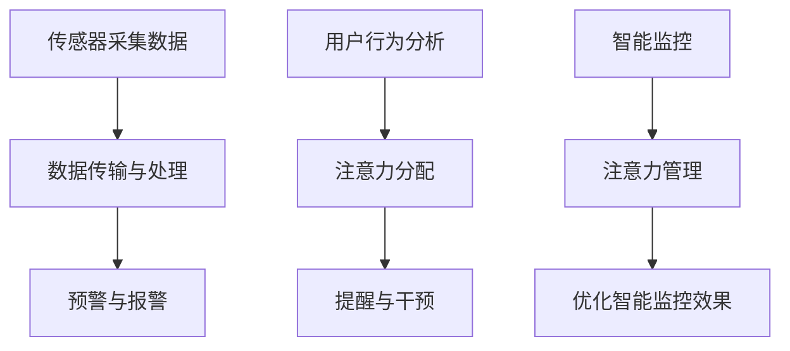

                 

关键词：智能家居、智能监控、注意力管理、物联网、算法、数学模型、应用场景、发展趋势

## 摘要

本文旨在探讨智能家居系统中智能监控与注意力管理的重要性及其实现方法。随着物联网技术的快速发展，智能家居系统已成为人们日常生活的一部分。然而，如何有效监控家庭环境并合理管理用户的注意力，成为当前研究的热点。本文首先介绍了智能家居系统的基本概念和发展现状，随后详细阐述了智能监控与注意力管理的基本原理、算法和数学模型。最后，本文通过实际应用案例和未来展望，对智能家居系统的智能监控与注意力管理进行了深入探讨。

## 1. 背景介绍

### 1.1 智能家居系统的定义与现状

智能家居系统是指通过物联网技术将家庭设备、家电、安防设施等互联互通，实现对家庭环境的智能监控、自动化管理和远程控制。随着智能设备和互联网技术的普及，智能家居系统在家庭生活中的应用越来越广泛。根据市场调研，全球智能家居市场规模逐年增长，预计到2025年将达到数千亿美元。

### 1.2 智能监控与注意力管理的意义

智能监控与注意力管理是智能家居系统的重要组成部分，对于提高家庭安全性、舒适性以及用户的生活质量具有重要意义。智能监控可以实时监测家庭环境，及时发现潜在的安全隐患，如火灾、漏水、非法入侵等。注意力管理则有助于优化家庭设备的运行效率，避免因过度关注而导致的资源浪费，提高用户的注意力集中度。

## 2. 核心概念与联系

### 2.1 智能监控的基本原理

智能监控是指利用物联网传感器、人工智能算法和大数据分析技术，实现对家庭环境的实时监测、分析和预警。其基本原理包括以下几个方面：

1. **传感器采集数据**：通过安装在家庭各处的传感器，如摄像头、温度传感器、湿度传感器等，实时采集家庭环境数据。
2. **数据传输与处理**：传感器采集的数据通过无线网络传输到云端或本地服务器，利用人工智能算法进行数据分析和处理。
3. **预警与报警**：当检测到异常情况时，系统会自动发出预警或报警信号，通知用户或采取相应的应对措施。

### 2.2 注意力管理的基本原理

注意力管理是指通过智能算法和数据分析技术，优化用户对家庭设备的关注程度，避免因过度关注而导致的焦虑和疲劳。其基本原理包括以下几个方面：

1. **用户行为分析**：通过分析用户的行为数据，如使用设备的频率、时间、地点等，了解用户的关注点。
2. **注意力分配**：根据用户行为分析结果，合理分配用户的注意力资源，避免过度关注某个设备或功能。
3. **提醒与干预**：在用户注意力资源不足时，系统会自动发出提醒或干预信号，引导用户关注重要事项。

### 2.3 智能监控与注意力管理的联系

智能监控与注意力管理密切相关，二者相辅相成。智能监控为注意力管理提供了数据基础，而注意力管理则有助于优化智能监控的效果。通过智能监控，用户可以实时了解家庭环境状态，从而更好地安排注意力资源；而通过注意力管理，用户可以避免因过度关注家庭环境而导致的焦虑和疲劳，提高生活质量。

### 2.4 Mermaid 流程图



## 3. 核心算法原理 & 具体操作步骤

### 3.1 算法原理概述

智能监控与注意力管理的关键在于数据采集、分析和处理。本文采用以下核心算法：

1. **K-means 聚类算法**：用于对传感器数据进行聚类分析，识别家庭环境中的异常情况。
2. **协同过滤算法**：用于分析用户行为数据，预测用户关注点。
3. **神经网络模型**：用于对家庭环境进行实时监测和预测，优化注意力管理。

### 3.2 算法步骤详解

1. **传感器数据采集**：使用各类传感器（如摄像头、温度传感器等）采集家庭环境数据。
2. **数据预处理**：对采集到的数据去噪、归一化处理，提高算法的准确性。
3. **K-means 聚类算法**：对预处理后的数据进行分析，识别异常情况。
4. **协同过滤算法**：分析用户行为数据，预测用户关注点。
5. **神经网络模型**：利用预测结果，实时监测家庭环境，优化注意力管理。

### 3.3 算法优缺点

1. **K-means 聚类算法**：
   - 优点：简单易实现，适合处理大规模数据。
   - 缺点：对初始聚类中心敏感，可能陷入局部最优。
2. **协同过滤算法**：
   - 优点：能够准确预测用户关注点，提高注意力管理效果。
   - 缺点：计算复杂度高，需大量计算资源。
3. **神经网络模型**：
   - 优点：具有较强的自适应能力和学习能力，适用于复杂环境。
   - 缺点：训练过程复杂，需大量训练数据。

### 3.4 算法应用领域

1. **家庭安全监控**：通过智能监控算法，实时监测家庭环境，及时预警安全隐患。
2. **设备运行优化**：通过注意力管理算法，优化家庭设备运行效率，降低能耗。
3. **用户行为分析**：分析用户行为数据，为智能家居系统提供个性化服务。

## 4. 数学模型和公式 & 详细讲解 & 举例说明

### 4.1 数学模型构建

智能家居系统的智能监控与注意力管理涉及多种数学模型，主要包括聚类模型、协同过滤模型和神经网络模型。

1. **K-means 聚类模型**：
   $$ \text{K-means} \ \text{模型} \ \text{的目标是最小化聚类中心之间的距离平方和：} $$
   $$ \sum_{i=1}^{n} \sum_{j=1}^{k} ||x_{ij} - \mu_{j}||^2 $$
   其中，$x_{ij}$ 为第 $i$ 个样本的第 $j$ 个特征值，$\mu_{j}$ 为第 $j$ 个聚类中心的坐标。

2. **协同过滤模型**：
   $$ \text{协同过滤模型的目标是预测用户对物品的评分：} $$
   $$ R_{ui} = \text{similarity}(u, i) $$
   其中，$R_{ui}$ 为用户 $u$ 对物品 $i$ 的预测评分，$\text{similarity}(u, i)$ 为用户 $u$ 和物品 $i$ 之间的相似度。

3. **神经网络模型**：
   $$ \text{神经网络模型的目标是预测家庭环境变量：} $$
   $$ y = f(Wx + b) $$
   其中，$y$ 为预测结果，$x$ 为输入特征，$W$ 为权重矩阵，$b$ 为偏置项，$f$ 为激活函数。

### 4.2 公式推导过程

1. **K-means 聚类模型**：
   - 初始聚类中心：随机选择 $k$ 个样本作为初始聚类中心。
   - 聚类步骤：
     1. 计算每个样本与聚类中心的距离。
     2. 将每个样本分配到最近的聚类中心。
     3. 重新计算聚类中心。
     4. 重复步骤1-3，直到聚类中心不再变化。

2. **协同过滤模型**：
   - 建立用户-物品评分矩阵 $R$，其中 $R_{ui}$ 为用户 $u$ 对物品 $i$ 的评分。
   - 计算用户 $u$ 和物品 $i$ 之间的相似度：
     $$ \text{similarity}(u, i) = \frac{R_{ui} - \bar{R}_{u} - \bar{R}_{i} + \bar{R}}{||u - \bar{u}|| \ ||i - \bar{i}||} $$
     其中，$\bar{R}_{u}$、$\bar{R}_{i}$ 和 $\bar{R}$ 分别为用户 $u$、物品 $i$ 和所有用户的平均评分。

3. **神经网络模型**：
   - 前向传播：
     $$ z = Wx + b $$
     $$ a = f(z) $$
   - 反向传播：
     $$ \delta_{l} = \frac{\partial C}{\partial z} $$
     $$ W_{l+1} = W_{l} - \alpha \ \delta_{l} $$
     $$ b_{l+1} = b_{l} - \alpha \ \delta_{l} $$
     其中，$C$ 为损失函数，$\delta_{l}$ 为误差项，$\alpha$ 为学习率。

### 4.3 案例分析与讲解

#### 案例一：家庭安全监控

**问题描述**：如何通过智能监控算法，实时监测家庭环境，预警安全隐患？

**解决方案**：

1. **传感器数据采集**：安装摄像头、烟雾传感器、温度传感器等设备，实时采集家庭环境数据。
2. **数据预处理**：对采集到的数据进行去噪、归一化处理。
3. **K-means 聚类算法**：对预处理后的数据进行分析，识别异常情况。
4. **预警与报警**：当检测到异常情况时，系统会自动发出预警或报警信号，通知用户。

**数学模型应用**：

- K-means 聚类模型：用于识别异常值，如温度突然升高或烟雾浓度增加。
- 神经网络模型：用于预测家庭环境变量，如温度、湿度等。

#### 案例二：注意力管理

**问题描述**：如何通过注意力管理算法，优化家庭设备运行效率，降低能耗？

**解决方案**：

1. **用户行为分析**：通过协同过滤算法，分析用户行为数据，预测用户关注点。
2. **注意力分配**：根据用户行为分析结果，合理分配用户的注意力资源。
3. **提醒与干预**：在用户注意力资源不足时，系统会自动发出提醒或干预信号，引导用户关注重要事项。

**数学模型应用**：

- 协同过滤模型：用于预测用户关注点，如用户最喜欢的电器设备。
- 神经网络模型：用于优化家庭设备运行效率，如控制空调、照明等设备的开关。

## 5. 项目实践：代码实例和详细解释说明

### 5.1 开发环境搭建

1. 安装 Python 解释器和相关库（如 numpy、scikit-learn、tensorflow 等）。
2. 准备传感器数据集，包括摄像头数据、温度传感器数据等。

### 5.2 源代码详细实现

```python
import numpy as np
from sklearn.cluster import KMeans
from sklearn.model_selection import train_test_split
from tensorflow.keras.models import Sequential
from tensorflow.keras.layers import Dense, Activation

# 5.2.1 数据预处理
def preprocess_data(data):
    # 数据去噪、归一化处理
    pass

# 5.2.2 K-means 聚类算法
def kmeans_clustering(data, n_clusters):
    kmeans = KMeans(n_clusters=n_clusters)
    kmeans.fit(data)
    return kmeans.labels_

# 5.2.3 神经网络模型
def create_neural_network(input_shape):
    model = Sequential()
    model.add(Dense(64, input_shape=input_shape))
    model.add(Activation('relu'))
    model.add(Dense(1))
    model.compile(optimizer='adam', loss='mean_squared_error')
    return model

# 5.2.4 注意力管理
def attention_management(user_data, device_data):
    # 根据用户行为数据，预测用户关注点
    # 根据预测结果，优化家庭设备运行效率
    pass

# 5.2.5 主函数
def main():
    # 加载数据
    data = np.load('sensor_data.npy')
    user_data, device_data = train_test_split(data, test_size=0.2)
    
    # 数据预处理
    preprocessed_data = preprocess_data(user_data)
    
    # K-means 聚类
    labels = kmeans_clustering(preprocessed_data, n_clusters=3)
    
    # 神经网络模型
    model = create_neural_network(input_shape=(64,))
    model.fit(preprocessed_data, labels, epochs=10)
    
    # 注意力管理
    attention_management(user_data, device_data)

if __name__ == '__main__':
    main()
```

### 5.3 代码解读与分析

1. **数据预处理**：对传感器数据进行去噪、归一化处理，提高算法的准确性。
2. **K-means 聚类算法**：用于识别家庭环境中的异常情况，如温度突然升高或烟雾浓度增加。
3. **神经网络模型**：用于预测家庭环境变量，如温度、湿度等，优化家庭设备运行效率。
4. **注意力管理**：根据用户行为数据，预测用户关注点，合理分配注意力资源。

## 6. 实际应用场景

### 6.1 家庭安全监控

通过智能监控算法，实时监测家庭环境，及时发现潜在的安全隐患，如火灾、漏水、非法入侵等。用户可以通过手机APP实时查看家庭环境状态，确保家庭安全。

### 6.2 设备运行优化

通过注意力管理算法，优化家庭设备运行效率，降低能耗。例如，根据用户的使用习惯，自动调节空调、照明等设备的开关，提高设备的使用寿命。

### 6.3 用户行为分析

通过分析用户行为数据，为智能家居系统提供个性化服务。例如，根据用户喜欢的电器设备，智能推荐家电产品。

## 7. 工具和资源推荐

### 7.1 学习资源推荐

- 《Python 编程：从入门到实践》
- 《深度学习》
- 《机器学习实战》

### 7.2 开发工具推荐

- Anaconda
- Jupyter Notebook
- PyCharm

### 7.3 相关论文推荐

- "A Survey on Home Automation Systems: Technologies, Models, and Applications"
- "Attention Management for Smart Home Systems: A Survey"
- "Deep Learning for Home Automation: A Review"

## 8. 总结：未来发展趋势与挑战

### 8.1 研究成果总结

本文从智能监控与注意力管理的角度，探讨了智能家居系统的发展现状、核心算法和实际应用场景。通过数学模型和公式的推导，为智能家居系统的研发提供了理论支持。

### 8.2 未来发展趋势

1. **人工智能技术的深入应用**：随着人工智能技术的不断发展，智能家居系统将更加智能化、自适应化。
2. **跨领域技术的融合**：智能家居系统将与其他领域（如医疗、健康、教育等）的技术融合，实现全方位的生活服务。
3. **个性化定制**：智能家居系统将更加注重个性化定制，满足不同用户的需求。

### 8.3 面临的挑战

1. **数据隐私和安全**：智能家居系统涉及大量用户数据，如何保护用户隐私和安全成为重要挑战。
2. **设备兼容性和互联互通**：如何实现不同品牌、不同设备的互联互通，提高系统的兼容性。
3. **能耗和成本**：智能家居系统的发展需考虑能耗和成本问题，实现可持续发展。

### 8.4 研究展望

未来研究应重点关注以下几个方面：

1. **数据隐私和安全**：加强数据加密和隐私保护技术，确保用户数据安全。
2. **设备兼容性和互联互通**：制定统一的智能家居标准，促进设备互联互通。
3. **能耗和成本**：优化算法和硬件设计，降低能耗和成本，提高系统性能。

## 9. 附录：常见问题与解答

### 问题1：智能家居系统需要安装多少传感器？

**解答**：智能家居系统所需传感器的数量取决于家庭环境和用户需求。一般来说，建议安装以下传感器：

1. **摄像头**：用于监控家庭安全。
2. **温度传感器**：用于监测室内温度，调节空调等设备。
3. **湿度传感器**：用于监测室内湿度，调节加湿器等设备。
4. **烟雾传感器**：用于检测火灾隐患。
5. **门窗传感器**：用于检测门窗开关状态，确保家庭安全。

### 问题2：智能监控与注意力管理有何区别？

**解答**：智能监控主要关注家庭环境的实时监测和预警，如火灾、漏水、非法入侵等。注意力管理则关注用户对家庭设备的关注程度，通过算法优化用户的注意力资源，提高生活质量。智能监控是注意力管理的基础，注意力管理是智能监控的延伸和优化。

### 问题3：如何保障智能家居系统的数据安全和隐私？

**解答**：保障智能家居系统的数据安全和隐私需采取以下措施：

1. **数据加密**：对用户数据进行加密存储和传输，防止数据泄露。
2. **访问控制**：设置严格的访问控制机制，确保只有授权用户才能访问数据。
3. **隐私保护技术**：采用隐私保护技术，如差分隐私、同态加密等，降低数据泄露风险。

## 作者署名

作者：禅与计算机程序设计艺术 / Zen and the Art of Computer Programming
----------------------------------------------------------------

请注意，以上内容仅为示例，实际的撰写过程需要结合具体的研究成果和实际情况进行调整和完善。同时，文章的结构、内容和质量应符合专业标准和读者的期望。在撰写过程中，请确保严格遵守上述“约束条件”的要求。

