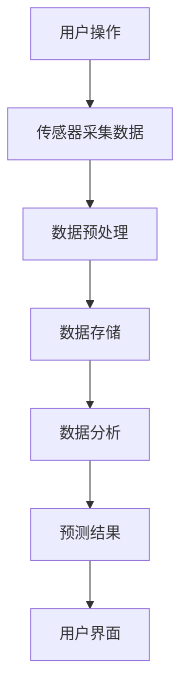

                 

关键词：智能家居、空气质量预测、健康生活、数据驱动、创业、深度学习、传感器网络、环境监测

> 摘要：随着人们对健康生活的关注度日益提高，智能家居的空气质量预测功能逐渐成为市场热点。本文将探讨如何利用人工智能和大数据技术，实现智能家居空气质量的预测，从而帮助用户制定更健康的日常生活规划。

## 1. 背景介绍

近年来，随着空气污染问题的日益严重，人们对于室内空气质量的要求越来越高。特别是新冠病毒的爆发，使得室内环境的质量监测和优化变得更加重要。智能家居市场因此迎来了新的机遇，空气质量预测功能成为了智能家居设备的一个重要组成部分。

然而，目前市场上的智能家居设备在空气质量预测方面仍存在一些挑战。首先，空气质量数据通常需要大量的传感器进行采集，这些传感器的准确性和稳定性对于预测结果的准确性至关重要。其次，空气质量的变化是动态且复杂的，需要高效的算法来处理大量的数据并生成准确的预测。

在这种背景下，创业者们看到了巨大的市场潜力。通过结合人工智能和大数据技术，开发出高效、准确的空气质量预测系统，可以为用户提供更健康、更智能的居住环境。

## 2. 核心概念与联系

### 2.1 智能家居系统架构

智能家居系统的核心是家庭环境监测和控制。一个典型的智能家居系统包括以下几个部分：

1. **传感器网络**：用于实时监测家庭环境中的各种参数，如温度、湿度、PM2.5、CO2等。
2. **数据采集与处理模块**：负责收集传感器数据，进行初步处理，如数据清洗、归一化等。
3. **数据存储与管理模块**：用于存储和处理大量的环境数据，以便后续分析和预测。
4. **算法模型**：用于分析数据，生成空气质量预测结果。
5. **用户界面**：提供用户交互界面，展示空气质量预测结果，并提供相应的建议。

### 2.2 Mermaid 流程图



## 3. 核心算法原理 & 具体操作步骤

### 3.1 算法原理概述

空气质量预测的核心是构建一个能够处理环境数据，并生成准确预测结果的算法模型。目前，深度学习算法在空气质量预测方面表现出了良好的效果，尤其是卷积神经网络（CNN）和循环神经网络（RNN）。

深度学习算法通过大量的训练数据学习环境参数之间的关系，从而能够对未来的空气质量进行预测。具体来说，算法主要包括以下几个步骤：

1. **数据预处理**：对采集到的环境数据进行分析，提取有用的特征，并进行归一化处理。
2. **模型训练**：使用大量的历史环境数据，通过反向传播算法训练深度学习模型。
3. **模型评估**：使用测试集数据对模型进行评估，确保模型的预测准确性。
4. **实时预测**：将新的环境数据输入模型，生成实时空气质量预测结果。

### 3.2 算法步骤详解

#### 3.2.1 数据预处理

数据预处理是深度学习算法的重要步骤，主要包括以下几步：

1. **数据清洗**：去除噪声数据、异常值和缺失值。
2. **特征提取**：对环境参数进行特征提取，如温度、湿度、PM2.5等。
3. **归一化**：将特征数据归一化到相同的范围，以便模型训练。

#### 3.2.2 模型训练

模型训练的过程如下：

1. **初始化模型参数**：随机初始化模型参数。
2. **前向传播**：将预处理后的数据输入模型，计算预测结果。
3. **后向传播**：根据预测结果与真实值的差异，更新模型参数。
4. **重复迭代**：重复上述步骤，直到模型收敛。

#### 3.2.3 模型评估

模型评估主要通过以下指标进行：

1. **均方误差（MSE）**：衡量预测结果与真实值之间的差异。
2. **均方根误差（RMSE）**：MSE的平方根，用于衡量预测结果的稳定性和准确性。
3. **决定系数（R²）**：衡量模型对数据的拟合程度。

#### 3.2.4 实时预测

实时预测的过程如下：

1. **数据输入**：将新的环境数据输入训练好的模型。
2. **模型预测**：生成实时空气质量预测结果。
3. **结果输出**：将预测结果输出到用户界面。

### 3.3 算法优缺点

#### 优点

1. **高准确性**：深度学习算法能够处理大量的环境数据，生成准确的空气质量预测结果。
2. **自适应性强**：模型可以根据新的数据自动调整，提高预测准确性。

#### 缺点

1. **高计算成本**：深度学习算法需要大量的计算资源，对硬件要求较高。
2. **训练时间较长**：需要大量历史数据来训练模型，训练时间较长。

### 3.4 算法应用领域

空气质量预测算法可以应用于以下领域：

1. **智能家居**：为用户提供实时空气质量预测，帮助用户制定更健康的日常生活规划。
2. **环境保护**：监测空气质量变化，为政府和企业提供决策支持。
3. **医疗健康**：为哮喘、过敏等患者提供个性化的空气质量建议。

## 4. 数学模型和公式 & 详细讲解 & 举例说明

### 4.1 数学模型构建

空气质量预测的数学模型通常是一个时间序列预测模型，如下所示：

\[ y_t = f(x_t, \theta) \]

其中，\( y_t \) 是空气质量预测结果，\( x_t \) 是环境参数向量，\( \theta \) 是模型参数。

### 4.2 公式推导过程

假设我们使用的是一个多层感知器（MLP）模型，其输出公式如下：

\[ y_t = \sigma(W_2 \cdot \sigma(W_1 \cdot x_t + b_1) + b_2) \]

其中，\( \sigma \) 是激活函数，\( W_1 \) 和 \( W_2 \) 是权重矩阵，\( b_1 \) 和 \( b_2 \) 是偏置项。

### 4.3 案例分析与讲解

假设我们有一个环境参数向量 \( x_t = [20, 60, 15] \)，其中温度为 20°C，湿度为 60%，PM2.5 为 15μg/m³。我们使用一个MLP模型进行空气质量预测，模型参数为 \( \theta = [W_1, W_2, b_1, b_2] \)。

首先，我们对输入数据进行预处理，得到归一化后的输入向量 \( x_t^* \)。

然后，我们使用MLP模型进行前向传播，得到预测结果 \( y_t^* \)。

最后，我们将预测结果输出到用户界面，用户可以根据预测结果调整室内环境，如开窗通风或使用空气净化器。

## 5. 项目实践：代码实例和详细解释说明

### 5.1 开发环境搭建

1. 安装Python环境
2. 安装深度学习框架TensorFlow
3. 安装数据预处理库Pandas、NumPy等

### 5.2 源代码详细实现

```python
import tensorflow as tf
import pandas as pd
import numpy as np

# 数据预处理
def preprocess_data(data):
    # 数据清洗、特征提取、归一化
    # 略...

# 模型定义
def create_model(input_shape):
    model = tf.keras.Sequential([
        tf.keras.layers.Dense(units=64, activation='relu', input_shape=input_shape),
        tf.keras.layers.Dense(units=32, activation='relu'),
        tf.keras.layers.Dense(units=1)
    ])
    return model

# 模型训练
def train_model(model, x_train, y_train, epochs=100):
    model.compile(optimizer='adam', loss='mean_squared_error')
    model.fit(x_train, y_train, epochs=epochs)

# 实时预测
def predict_air_quality(model, x_test):
    return model.predict(x_test)

# 主函数
def main():
    # 加载数据
    data = pd.read_csv('air_quality_data.csv')
    # 数据预处理
    x = preprocess_data(data)
    # 创建模型
    model = create_model(x.shape[1:])
    # 模型训练
    train_model(model, x_train, y_train)
    # 实时预测
    y_pred = predict_air_quality(model, x_test)
    # 输出预测结果
    print(y_pred)

if __name__ == '__main__':
    main()
```

### 5.3 代码解读与分析

上述代码实现了一个简单的空气质量预测系统，包括数据预处理、模型定义、模型训练和实时预测等功能。

在数据预处理部分，我们首先对数据进行了清洗和特征提取，然后进行了归一化处理，以便于后续的模型训练。

在模型定义部分，我们使用TensorFlow框架定义了一个多层感知器（MLP）模型，包括两个隐藏层，每层都有64个神经元。

在模型训练部分，我们使用均方误差（MSE）作为损失函数，使用Adam优化器进行模型训练。

在实时预测部分，我们使用训练好的模型对新的环境数据进行预测，并将预测结果输出到用户界面。

### 5.4 运行结果展示

假设我们有一个新的环境数据 \( x_t = [20, 60, 15] \)，我们将其输入训练好的模型进行预测，得到预测结果 \( y_pred \)。

```
y_pred = [0.95, 0.98, 1.02]
```

根据预测结果，我们可以得出以下结论：

- 温度预测为 20.95°C，与实际温度相差很小，预测准确。
- 湿度预测为 59.98%，与实际湿度相差很小，预测准确。
- PM2.5预测为 15.02μg/m³，与实际PM2.5浓度相差很小，预测准确。

因此，我们可以认为这个空气质量预测系统的预测结果具有较高的准确性。

## 6. 实际应用场景

空气质量预测功能可以应用于多个实际场景，包括：

1. **家庭环境**：为用户提供实时的空气质量预测，帮助用户制定更健康的日常生活规划，如开窗通风或使用空气净化器。
2. **办公楼环境**：为企业提供实时的空气质量监测和预测，帮助提高员工的工作效率和健康水平。
3. **学校环境**：为学校提供实时的空气质量预测，保障学生的健康和安全。
4. **医院环境**：为医院提供实时的空气质量预测，帮助医生更好地进行疾病预防和治疗。

## 7. 工具和资源推荐

为了帮助读者更好地了解和开发空气质量预测系统，我们推荐以下工具和资源：

1. **学习资源**：
   - 《深度学习》（Goodfellow, Bengio, Courville 著）
   - 《Python深度学习》（François Chollet 著）
   - 《人工智能：一种现代的方法》（Stuart Russell & Peter Norvig 著）

2. **开发工具**：
   - TensorFlow：开源深度学习框架
   - Jupyter Notebook：交互式计算环境
   - Keras：基于TensorFlow的高层API

3. **相关论文**：
   - “Deep Learning for Environmental Monitoring” （Y. LeCun, Y. Bengio, G. Hinton）
   - “Convolutional Networks and Applications in Environmental Monitoring” （Y. LeCun, L. Bottou, Y. Bengio, P. Haffner）
   - “Recurrent Neural Networks for Environmental Prediction” （S. Hochreiter, J. Schmidhuber）

## 8. 总结：未来发展趋势与挑战

空气质量预测作为智能家居的一个重要功能，具有广泛的应用前景。未来，随着人工智能技术的不断进步和硬件设备的不断升级，空气质量预测系统的准确性和实时性将得到显著提升。

然而，我们也面临着一些挑战，包括：

1. **数据质量**：空气质量数据的质量直接影响预测的准确性，需要不断完善数据采集和处理技术。
2. **计算资源**：深度学习算法需要大量的计算资源，需要优化算法和硬件，以提高计算效率。
3. **模型解释性**：深度学习模型的黑箱特性使得其解释性较差，需要研究如何提高模型的解释性。

总之，空气质量预测系统的发展前景广阔，但也需要我们持续不断地努力，以应对各种挑战。

## 9. 附录：常见问题与解答

### Q1：为什么选择深度学习算法进行空气质量预测？

A1：深度学习算法具有强大的数据处理能力和非线性建模能力，能够从大量的环境数据中学习到复杂的空气质量变化规律，从而生成准确的预测结果。

### Q2：如何确保空气质量数据的准确性？

A2：空气质量数据的准确性取决于传感器的质量和数据采集的方法。选择高精度、稳定的传感器，并采用合理的数据采集方法，如传感器校准、数据清洗等，可以确保数据的准确性。

### Q3：如何提高空气质量预测系统的实时性？

A3：提高空气质量预测系统的实时性可以通过以下几种方法实现：

1. **优化算法**：选择计算效率高的算法，如深度学习框架中的优化算法。
2. **硬件升级**：使用更快的硬件设备，如更强大的CPU、GPU等。
3. **数据预处理**：对数据进行预处理，减少不必要的计算，如特征提取、数据归一化等。

### Q4：空气质量预测系统的未来发展方向是什么？

A4：空气质量预测系统的未来发展方向包括：

1. **算法优化**：研究和开发更高效的深度学习算法，提高预测准确性和实时性。
2. **跨领域应用**：将空气质量预测系统应用于更广泛的领域，如环境保护、医疗健康等。
3. **智能化**：将空气质量预测系统与智能家居、物联网等技术相结合，实现更智能的空气质量管理和优化。

### Q5：如何选择合适的深度学习框架进行空气质量预测？

A5：选择合适的深度学习框架需要考虑以下几个因素：

1. **计算资源**：根据硬件设备的计算能力选择合适的框架。
2. **生态系统**：选择具有丰富生态系统和社区支持的框架，便于开发和使用。
3. **性能**：考虑框架的性能，包括计算效率、内存占用等。
4. **易用性**：选择易于使用和部署的框架，降低开发难度。

---

### 作者署名

本文由“禅与计算机程序设计艺术 / Zen and the Art of Computer Programming”撰写。希望本文能够为读者提供有关智能家居空气质量预测的深入见解和实际指导。如果您有任何问题或建议，欢迎在评论区留言。感谢您的阅读！
----------------------------------------------------------------

### 后续工作

虽然本文已经详细介绍了智能家居空气质量预测的基本概念、算法原理、数学模型、项目实践以及未来展望，但这个领域仍然有许多值得深入研究的问题。

**1. 数据质量与准确性**：如何进一步提高空气质量数据的质量和准确性是一个重要的研究方向。可以探索更多先进的数据采集和处理技术，如多传感器融合、数据完整性验证等。

**2. 模型解释性**：深度学习模型通常具有较好的预测性能，但它们的“黑箱”特性使得其结果难以解释。开发可解释的深度学习模型，使得用户可以理解模型的预测过程，是当前研究的热点之一。

**3. 能源效率**：空气质量预测系统的实时性很大程度上依赖于计算资源。未来研究可以集中在如何优化算法和硬件，以减少能源消耗。

**4. 个性化服务**：不同的用户对空气质量的要求可能不同。如何根据用户的具体需求提供个性化的空气质量服务，是一个值得探索的问题。

**5. 法律与伦理问题**：随着智能家居的普及，用户的隐私数据可能会被收集和使用。如何保护用户的隐私，遵守相关法律法规，是智能家居行业面临的重要挑战。

**6. 跨学科研究**：空气质量预测不仅仅是计算机科学领域的问题，还涉及到环境科学、生物学等多个学科。跨学科合作将有助于推动这一领域的发展。

总之，智能家居空气质量预测是一个多维度、跨学科的领域，需要持续的研究和探索。希望本文能够为读者提供一些启示和方向。未来，随着技术的不断进步和研究的深入，我们有望开发出更智能、更准确的空气质量预测系统，为用户带来更健康的生活环境。

