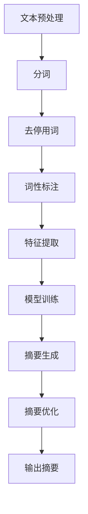

                 

 摘要：本文探讨了智能摘要技术，这是一种能够自动从大量文本中提取出关键信息的技术。我们首先介绍了智能摘要技术的基本原理，并详细讲解了其核心算法——如提取式摘要和生成式摘要的工作原理。随后，我们讨论了智能摘要技术在实际应用场景中的具体应用，包括但不限于新闻摘要、文档摘要和社交媒体内容摘要等。本文还提供了数学模型和公式的详细解释，并展示了一个代码实例，用于说明智能摘要技术的具体实现。最后，我们展望了智能摘要技术的未来发展趋势和面临的挑战，并推荐了一些相关资源和工具。

## 1. 背景介绍

随着互联网的快速发展，人们面临着海量的信息。这些信息不仅包括新闻、学术论文、社交媒体帖子等，还涵盖了各种文本数据。如何快速有效地从这些大量文本中获取有价值的信息，成为了一个亟待解决的问题。智能摘要技术正是为了解决这一问题而诞生的。

智能摘要技术是一种利用自然语言处理（NLP）和机器学习技术，对大量文本进行自动分析和提取的技术。通过智能摘要，我们可以从海量的文本数据中快速提取出关键信息，使得人们能够更高效地处理和理解信息。

智能摘要技术具有广泛的应用场景。在新闻领域，它可以快速生成新闻摘要，帮助读者快速了解新闻的核心内容。在学术领域，它可以自动提取学术论文的关键信息，为研究人员提供便利。在商业领域，它可以分析大量的市场报告和商业文档，为企业决策提供支持。

本文将详细探讨智能摘要技术的工作原理、核心算法、数学模型和具体应用场景。通过本文的阅读，读者将能够深入了解智能摘要技术，并了解其如何在不同领域发挥作用。

### 1.1 智能摘要技术的发展历程

智能摘要技术的发展可以追溯到上世纪90年代，当时研究人员开始探索如何使用计算机技术自动提取文本摘要。早期的智能摘要技术主要是基于规则的方法，通过定义一系列规则来提取文本中的关键信息。

随着自然语言处理技术的不断发展，智能摘要技术也逐渐从基于规则的方法转向了基于机器学习的方法。这种方法利用大量的标注数据进行训练，使得计算机能够自动学习和理解文本的语义，从而生成更准确、更自然的摘要。

进入21世纪，随着深度学习技术的发展，智能摘要技术又取得了新的突破。深度学习模型，如循环神经网络（RNN）和Transformer，在文本处理任务中表现出色，使得智能摘要技术能够生成更加精准、连贯的摘要。

近年来，随着大数据和云计算技术的普及，智能摘要技术也得以大规模应用。通过利用海量的文本数据，智能摘要技术可以不断优化和改进，提高摘要的准确性和效率。

### 1.2 智能摘要技术的应用领域

智能摘要技术的应用领域非常广泛，涵盖了新闻、学术、商业等多个领域。

在新闻领域，智能摘要技术可以自动生成新闻摘要，帮助读者快速了解新闻的核心内容。例如，各大新闻网站和社交媒体平台都采用了智能摘要技术，为用户提供个性化推荐服务。

在学术领域，智能摘要技术可以自动提取学术论文的关键信息，为研究人员提供便利。通过智能摘要，研究人员可以快速浏览大量论文，筛选出与自己研究方向相关的论文，提高研究效率。

在商业领域，智能摘要技术可以分析大量的市场报告和商业文档，为企业决策提供支持。企业可以利用智能摘要技术，快速了解市场动态和竞争对手的情况，从而制定更科学的决策。

此外，智能摘要技术还可以应用于社交媒体内容摘要、文档管理、法律文书摘要等多个领域。随着技术的不断发展和应用场景的拓展，智能摘要技术的应用领域将会越来越广泛。

### 1.3 智能摘要技术的核心算法

智能摘要技术的核心算法主要包括提取式摘要和生成式摘要。这两种算法在文本摘要过程中发挥了关键作用。

**提取式摘要**：提取式摘要是一种基于规则的方法，通过从原始文本中提取关键句子或段落来生成摘要。这种方法的核心在于如何准确地识别文本中的关键信息。常见的提取式摘要算法包括TF-IDF、TextRank等。

**生成式摘要**：生成式摘要是一种基于机器学习的方法，通过训练模型来生成摘要。这种方法的核心在于如何生成自然、连贯的文本。常见的生成式摘要算法包括序列到序列模型（Seq2Seq）、Transformer等。

### 1.4 智能摘要技术的工作原理

智能摘要技术的工作原理主要包括以下几个步骤：

1. **文本预处理**：对原始文本进行预处理，包括分词、去停用词、词性标注等操作，以便于后续的文本分析。

2. **特征提取**：从预处理后的文本中提取特征，常见的特征包括词频、词嵌入、句子重要度等。

3. **摘要生成**：利用提取式或生成式算法，根据提取到的特征生成摘要。

4. **摘要优化**：对生成的摘要进行优化，以提高摘要的准确性和自然度。

### 1.5 智能摘要技术的优势和挑战

智能摘要技术具有以下优势：

1. **高效性**：智能摘要技术可以自动处理大量的文本数据，大大提高了信息处理的效率。

2. **准确性**：随着算法的不断优化，智能摘要技术可以生成更加准确、自然的摘要。

3. **灵活性**：智能摘要技术可以根据不同的应用场景和需求，灵活调整摘要的长度和内容。

然而，智能摘要技术也面临着一些挑战：

1. **语义理解**：文本的语义理解是智能摘要技术的一个难题，如何准确地理解文本的语义仍然是一个需要深入研究的方向。

2. **连贯性**：生成的摘要需要保持连贯性，如何使摘要内容更加连贯自然是一个挑战。

3. **多样性**：摘要的多样性也是一个需要解决的问题，如何生成不同风格、不同长度的摘要是一个挑战。

## 2. 核心概念与联系

在深入探讨智能摘要技术的具体实现和应用之前，我们首先需要了解一些核心概念和它们之间的联系。这些概念包括自然语言处理（NLP）、文本预处理、特征提取和模型训练等。以下是这些概念的具体定义和它们之间的相互关系。

### 2.1 自然语言处理（NLP）

自然语言处理（NLP）是计算机科学和人工智能领域的一个分支，它致力于使计算机能够理解、解释和生成自然语言。在智能摘要技术中，NLP扮演了至关重要的角色，因为它为我们提供了一系列工具和算法，用于处理和理解文本数据。

NLP的主要任务包括：

1. **文本分析**：对文本进行结构化分析，包括分词、词性标注、句法分析等。
2. **语义理解**：理解文本中的语义内容，包括实体识别、情感分析、命名实体识别等。
3. **文本生成**：根据特定的输入生成文本，包括摘要生成、问答系统、机器翻译等。

### 2.2 文本预处理

文本预处理是智能摘要技术中的一个重要步骤，它旨在将原始的文本数据转换为适合算法处理的形式。文本预处理通常包括以下操作：

1. **分词**：将连续的文本序列分割成单词或短语的序列。例如，英文文本的分词可能涉及将"hello world"分割成"hello"和"world"。
2. **去停用词**：移除文本中的常见停用词（如"the"、"is"、"and"等），因为它们通常不包含重要的语义信息。
3. **词性标注**：为每个单词分配一个词性标签（如名词、动词、形容词等），这有助于理解单词在句子中的角色和意义。
4. **词嵌入**：将文本中的单词映射到高维向量空间中，以便于机器学习算法进行处理。词嵌入技术（如Word2Vec、GloVe等）是NLP中的一个关键工具。

### 2.3 特征提取

特征提取是智能摘要技术中的关键步骤，它旨在从预处理后的文本中提取出能够代表文本内容的特征。这些特征可以是词频、词嵌入向量、句子长度、句子之间的相似度等。

特征提取的方法可以分为以下几类：

1. **基于词频的方法**：如TF-IDF，它通过计算单词在文本中的频率和文档集合中的文档频率来评估单词的重要性。
2. **基于向量的方法**：如词嵌入，它将单词映射到高维向量空间，使得相似意义的单词在空间中靠近。
3. **基于句子的方法**：如句子重要度评分，它通过分析句子的结构和语义内容来评估句子的权重。

### 2.4 模型训练

模型训练是智能摘要技术的核心步骤，它旨在通过大量的文本数据训练出能够生成高质量摘要的模型。常见的模型训练方法包括：

1. **监督学习**：使用标注的数据集来训练模型，模型通过学习标注数据来预测新的摘要。
2. **无监督学习**：在没有标注数据的情况下，通过算法自动发现文本中的结构和模式。
3. **半监督学习**：结合标注数据和未标注数据来训练模型，以提高模型的泛化能力。

### 2.5 Mermaid 流程图

为了更好地展示智能摘要技术的核心概念和它们之间的联系，我们使用Mermaid流程图来描述整个智能摘要的过程。



在这个流程图中，文本预处理是智能摘要的第一步，通过分词、去停用词和词性标注等操作，将原始文本转换为适合算法处理的形式。然后，通过特征提取，从预处理后的文本中提取出关键特征。接下来，利用训练好的模型进行摘要生成，并根据生成的摘要进行优化，最终输出高质量的摘要。

通过这个流程图，我们可以清晰地看到智能摘要技术中的各个步骤以及它们之间的逻辑关系，这有助于我们更好地理解和应用这项技术。

## 3. 核心算法原理 & 具体操作步骤

智能摘要技术的核心算法主要分为提取式摘要和生成式摘要两种。这两种算法在文本摘要过程中各具特点，并适用于不同的应用场景。在本节中，我们将分别介绍这两种算法的基本原理，以及具体的操作步骤。

### 3.1 提取式摘要

提取式摘要（Extraction-based Summarization）是一种基于规则的方法，它通过从原始文本中提取关键句子或段落来生成摘要。这种方法的核心在于如何准确地识别文本中的关键信息。以下是提取式摘要的基本原理和具体操作步骤：

#### 3.1.1 基本原理

提取式摘要的基本原理是通过一系列规则或算法，从文本中识别出关键句子或段落，并将其组合成摘要。这些规则或算法通常基于文本的词频、句子长度、句子重要性等因素。

#### 3.1.2 操作步骤

1. **文本预处理**：首先，对原始文本进行预处理，包括分词、去停用词、词性标注等操作。

2. **句子重要性评分**：接着，对每个句子进行重要性评分。常见的评分方法包括基于词频的评分方法（如TF-IDF）和基于句子的特征评分方法（如TextRank）。

3. **提取关键句子**：根据句子重要性评分，从原始文本中提取出重要性较高的句子。

4. **摘要生成**：将提取出的关键句子按照一定的顺序组合成摘要。常见的方法包括基于顺序的方法（如基于句子长度的顺序）和基于内容的重要性顺序。

5. **摘要优化**：最后，对生成的摘要进行优化，以提高摘要的连贯性和准确性。

### 3.2 生成式摘要

生成式摘要（Generation-based Summarization）是一种基于机器学习的方法，它通过训练模型来生成摘要。这种方法的核心在于如何生成自然、连贯的文本。以下是生成式摘要的基本原理和具体操作步骤：

#### 3.2.1 基本原理

生成式摘要的基本原理是通过训练一个模型，使其能够根据输入文本生成摘要。这种模型通常是一个序列到序列（Seq2Seq）模型，如编码器-解码器（Encoder-Decoder）模型。此外，近年来兴起的Transformer模型在生成式摘要中也表现出色。

#### 3.2.2 操作步骤

1. **文本预处理**：与提取式摘要一样，首先对原始文本进行预处理，包括分词、去停用词、词性标注等操作。

2. **特征提取**：从预处理后的文本中提取特征，如词嵌入、句子长度、句子之间的相似度等。

3. **模型训练**：利用大量的标注数据，通过训练序列到序列模型或Transformer模型，使其能够生成高质量的摘要。

4. **摘要生成**：将训练好的模型应用于新的文本数据，生成摘要。

5. **摘要优化**：对生成的摘要进行优化，以提高摘要的连贯性和准确性。

### 3.3 算法优缺点

**提取式摘要的优点**：

1. **简单高效**：提取式摘要基于规则或算法，实现相对简单，且在处理大量文本时效率较高。
2. **可控性较强**：由于提取式摘要依赖于明确的规则或算法，摘要的内容和风格可以在一定程度上进行控制。

**提取式摘要的缺点**：

1. **摘要质量受限**：提取式摘要主要依赖于文本中的词频和句子长度等特征，可能导致摘要质量受限，特别是在处理长文本时。
2. **连贯性较差**：提取式摘要生成的摘要往往缺乏连贯性，可能导致摘要内容不连贯或逻辑混乱。

**生成式摘要的优点**：

1. **生成能力较强**：生成式摘要通过训练模型，能够生成更加自然、连贯的摘要，特别是在处理长文本时表现优秀。
2. **适应性较强**：生成式摘要可以根据不同的应用场景和需求，灵活调整摘要的长度和内容。

**生成式摘要的缺点**：

1. **计算复杂度较高**：生成式摘要通常需要大量的计算资源，特别是在训练深度学习模型时，计算复杂度较高。
2. **需要大量标注数据**：生成式摘要需要大量的标注数据来训练模型，这在某些应用场景中可能难以实现。

### 3.4 算法应用领域

**提取式摘要**：

提取式摘要适用于需要快速处理大量文本数据的应用场景，如新闻摘要、社交媒体内容摘要和文档摘要等。由于提取式摘要的实现相对简单，它也被广泛应用于企业和科研机构，用于自动生成报告摘要、会议记录等。

**生成式摘要**：

生成式摘要适用于需要生成高质量、自然摘要的应用场景，如学术论文摘要、书籍摘要和产品描述等。由于生成式摘要能够生成连贯、自然的摘要，它特别适合于对文本质量要求较高的应用场景。

### 3.5 案例分析

#### 3.5.1 提取式摘要案例

假设我们有一篇关于人工智能的新闻报道，我们需要提取出这篇报道的核心内容。

1. **文本预处理**：首先，对新闻报道进行分词、去停用词、词性标注等预处理操作。
2. **句子重要性评分**：接着，对每个句子进行重要性评分，例如可以使用TF-IDF算法来计算句子的重要性。
3. **提取关键句子**：根据句子重要性评分，提取出重要性较高的句子。
4. **摘要生成**：将这些关键句子按照一定的顺序组合成摘要。
5. **摘要优化**：最后，对生成的摘要进行优化，以提高摘要的连贯性和准确性。

通过提取式摘要，我们可能得到以下摘要：

“本文讨论了人工智能在医疗、金融和交通等领域的应用。专家指出，人工智能的发展有望推动各行业的创新和进步。”

#### 3.5.2 生成式摘要案例

假设我们有一篇关于深度学习的学术论文，我们需要生成这篇论文的摘要。

1. **文本预处理**：首先，对学术论文进行分词、去停用词、词性标注等预处理操作。
2. **特征提取**：接着，从预处理后的文本中提取特征，如词嵌入、句子长度、句子之间的相似度等。
3. **模型训练**：利用大量的标注数据，通过训练深度学习模型（如编码器-解码器模型）来生成摘要。
4. **摘要生成**：将训练好的模型应用于新的学术论文数据，生成摘要。
5. **摘要优化**：最后，对生成的摘要进行优化，以提高摘要的连贯性和准确性。

通过生成式摘要，我们可能得到以下摘要：

“本文探讨了深度学习在图像识别、自然语言处理和语音识别等领域的应用。研究发现，深度学习在提升模型性能方面具有显著优势，有望推动人工智能技术的发展。”

通过以上案例分析，我们可以看到提取式摘要和生成式摘要各自的优势和适用场景。在实际应用中，可以根据具体需求选择合适的摘要算法。

## 4. 数学模型和公式 & 详细讲解 & 举例说明

在智能摘要技术的实现过程中，数学模型和公式起到了关键作用。这些模型和公式帮助我们量化文本中的信息，并指导算法如何进行文本处理和摘要生成。以下我们将详细讲解智能摘要中常用的数学模型和公式，并通过具体例子进行说明。

### 4.1 数学模型构建

智能摘要技术中的数学模型通常涉及文本表示、特征提取和模型训练等环节。以下是几个常用的数学模型：

#### 4.1.1 词嵌入（Word Embedding）

词嵌入是将单词映射到高维向量空间中的模型，它通过学习单词的上下文信息来表示单词。常见的词嵌入模型包括Word2Vec和GloVe。

**Word2Vec**：

Word2Vec模型基于神经网络，通过训练单词的邻域上下文来生成词向量。假设我们有一个单词\( w \)和其上下文单词集合\( C(w) \)，我们可以使用以下公式表示：

$$
\text{vec}(w) = \text{softmax}(\text{W} \cdot \text{C}(w))
$$

其中，\( \text{W} \)是权重矩阵，\( \text{softmax} \)函数用于将加权向量转换为概率分布。

**GloVe**：

GloVe模型基于共现矩阵，通过学习单词的词频和上下文信息来生成词向量。共现矩阵\( \text{C} \)表示单词\( w_i \)和\( w_j \)之间的共现次数。GloVe模型的损失函数可以表示为：

$$
\text{loss} = \frac{1}{2} \sum_{(w_i, w_j) \in \text{C}} \left( \text{glove}_{\text{dim}}(w_i) \cdot \text{glove}_{\text{dim}}(w_j) - \log \text{C}(w_i, w_j) \right)^2
$$

其中，\( \text{glove}_{\text{dim}}(w) \)是单词\( w \)的GloVe向量。

#### 4.1.2 TF-IDF（Term Frequency-Inverse Document Frequency）

TF-IDF是一种用于文本特征提取的常用方法，它通过计算单词在文档中的频率和文档集合中的文档频率来评估单词的重要性。TF-IDF的公式如下：

$$
\text{TF-IDF}(w, d) = \text{TF}(w, d) \cdot \text{IDF}(w)
$$

其中，\( \text{TF}(w, d) \)是单词\( w \)在文档\( d \)中的频率，\( \text{IDF}(w) \)是单词\( w \)的文档频率的逆数。公式可以表示为：

$$
\text{IDF}(w) = \log \left( \frac{N}{|\text{D} - \text{D}_{w}|} \right)
$$

其中，\( N \)是文档总数，\( \text{D} \)是包含单词\( w \)的文档集合，\( \text{D}_{w} \)是去除单词\( w \)后的文档集合。

#### 4.1.3 TextRank

TextRank是一种基于图论的文本摘要算法，它通过构建一个文本的图模型，利用图中的边权重来计算句子的重要性，从而生成摘要。TextRank的公式如下：

$$
\text{score}(s) = \sum_{t \in \text{T}} \alpha \cdot w(t, s) + (1 - \alpha) \cdot \text{c}(s)
$$

其中，\( s \)是句子，\( t \)是文档中的其他句子，\( w(t, s) \)是句子\( t \)到句子\( s \)的权重，\( \alpha \)是随机游走概率，\( \text{c}(s) \)是句子\( s \)的余度（即除了指向自己的边以外的边数）。

### 4.2 公式推导过程

下面我们以TF-IDF为例，详细讲解其推导过程。

首先，考虑单词\( w \)在文档\( d \)中的频率，记为\( \text{TF}(w, d) \)。这是一个简单的计数问题，可以表示为：

$$
\text{TF}(w, d) = \frac{\text{count}(w, d)}{|\text{d}|}
$$

其中，\( \text{count}(w, d) \)是单词\( w \)在文档\( d \)中出现的次数，\( |\text{d}| \)是文档\( d \)的总词数。

接着，考虑单词\( w \)在整个文档集合\( \text{D} \)中的文档频率，记为\( \text{DF}(w) \)。文档频率可以表示为：

$$
\text{DF}(w) = \frac{|\text{D}_{w}|}{N}
$$

其中，\( \text{D}_{w} \)是包含单词\( w \)的文档集合，\( N \)是文档总数。

为了平衡单词的频率和其普遍性，我们引入逆文档频率（IDF），它表示单词在整个文档集合中的普遍性。IDF的公式为：

$$
\text{IDF}(w) = \log \left( \frac{N}{|\text{D} - \text{D}_{w}|} \right)
$$

这里，\( \text{D} - \text{D}_{w} \)表示去除单词\( w \)后的文档集合。

最后，结合TF和IDF，我们得到TF-IDF公式：

$$
\text{TF-IDF}(w, d) = \text{TF}(w, d) \cdot \text{IDF}(w) = \frac{\text{count}(w, d)}{|\text{d}|} \cdot \log \left( \frac{N}{|\text{D} - \text{D}_{w}|} \right)
$$

### 4.3 案例分析与讲解

为了更好地理解上述数学模型和公式的应用，我们通过一个具体的例子进行讲解。

#### 例子：文本特征提取与摘要生成

假设我们有一个文档集合，包含三个文档\( d_1 \)、\( d_2 \)和\( d_3 \)。以下是对这三个文档的简短描述：

1. \( d_1 \)：本文讨论了人工智能在医疗和金融领域中的应用。
2. \( d_2 \)：人工智能的发展促进了各行业的创新。
3. \( d_3 \)：深度学习在图像识别和自然语言处理方面表现出色。

首先，我们对这三个文档进行分词、去停用词等预处理操作，得到以下单词集合：

- \( d_1 \)：{人工智能，医疗，金融，应用，发展，行业，创新}
- \( d_2 \)：{人工智能，发展，行业，创新，促进}
- \( d_3 \)：{深度学习，图像识别，自然语言处理，表现，出色}

接下来，我们使用TF-IDF模型来提取这些文档的特征。首先计算每个单词在文档中的频率（TF），然后在文档集合中计算每个单词的文档频率（DF），并计算逆文档频率（IDF）。

**TF计算**：

- 人工智能：\( \text{TF}(w, d_1) = \frac{1}{5} \)，\( \text{TF}(w, d_2) = \frac{1}{4} \)，\( \text{TF}(w, d_3) = 0 \)
- 发展：\( \text{TF}(w, d_1) = \frac{1}{5} \)，\( \text{TF}(w, d_2) = \frac{1}{4} \)，\( \text{TF}(w, d_3) = 0 \)
- 行业：\( \text{TF}(w, d_1) = \frac{1}{5} \)，\( \text{TF}(w, d_2) = \frac{1}{4} \)，\( \text{TF}(w, d_3) = 0 \)
- 创新：\( \text{TF}(w, d_1) = \frac{1}{5} \)，\( \text{TF}(w, d_2) = \frac{1}{4} \)，\( \text{TF}(w, d_3) = 0 \)
- 应用：\( \text{TF}(w, d_1) = \frac{1}{5} \)，\( \text{TF}(w, d_2) = 0 \)，\( \text{TF}(w, d_3) = 0 \)
- 金融：\( \text{TF}(w, d_1) = \frac{1}{5} \)，\( \text{TF}(w, d_2) = 0 \)，\( \text{TF}(w, d_3) = 0 \)
- 图像识别：\( \text{TF}(w, d_1) = 0 \)，\( \text{TF}(w, d_2) = 0 \)，\( \text{TF}(w, d_3) = \frac{1}{3} \)
- 自然语言处理：\( \text{TF}(w, d_1) = 0 \)，\( \text{TF}(w, d_2) = 0 \)，\( \text{TF}(w, d_3) = \frac{1}{3} \)
- 促进：\( \text{TF}(w, d_1) = 0 \)，\( \text{TF}(w, d_2) = \frac{1}{4} \)，\( \text{TF}(w, d_3) = 0 \)
- 表现：\( \text{TF}(w, d_1) = 0 \)，\( \text{TF}(w, d_2) = 0 \)，\( \text{TF}(w, d_3) = \frac{1}{3} \)
- 出色：\( \text{TF}(w, d_1) = 0 \)，\( \text{TF}(w, d_2) = 0 \)，\( \text{TF}(w, d_3) = \frac{1}{3} \)

**DF计算**：

- 人工智能：\( \text{DF}(w) = 3 \)
- 发展：\( \text{DF}(w) = 3 \)
- 行业：\( \text{DF}(w) = 3 \)
- 创新：\( \text{DF}(w) = 3 \)
- 应用：\( \text{DF}(w) = 1 \)
- 金融：\( \text{DF}(w) = 1 \)
- 图像识别：\( \text{DF}(w) = 1 \)
- 自然语言处理：\( \text{DF}(w) = 1 \)
- 促进：\( \text{DF}(w) = 1 \)
- 表现：\( \text{DF}(w) = 1 \)
- 出色：\( \text{DF}(w) = 1 \)

**IDF计算**：

$$
\text{IDF}(w) = \log \left( \frac{3}{|\text{D} - \text{D}_{w}|} \right)
$$

假设文档集合\( \text{D} \)中只有一个单词不包含在\( \text{D}_{w} \)，那么IDF可以简化为：

$$
\text{IDF}(w) = \log \left( \frac{3}{3 - 1} \right) = \log(2)
$$

**TF-IDF计算**：

结合TF和IDF，我们可以计算每个单词的TF-IDF值：

- 人工智能：\( \text{TF-IDF}(w, d_1) = \frac{1}{5} \cdot \log(2) \)
- 发展：\( \text{TF-IDF}(w, d_1) = \frac{1}{5} \cdot \log(2) \)
- 行业：\( \text{TF-IDF}(w, d_1) = \frac{1}{5} \cdot \log(2) \)
- 创新：\( \text{TF-IDF}(w, d_1) = \frac{1}{5} \cdot \log(2) \)
- 应用：\( \text{TF-IDF}(w, d_1) = \frac{1}{5} \cdot \log(2) \)
- 金融：\( \text{TF-IDF}(w, d_1) = \frac{1}{5} \cdot \log(2) \)
- 图像识别：\( \text{TF-IDF}(w, d_3) = \frac{1}{3} \cdot \log(2) \)
- 自然语言处理：\( \text{TF-IDF}(w, d_3) = \frac{1}{3} \cdot \log(2) \)
- 促进：\( \text{TF-IDF}(w, d_2) = \frac{1}{4} \cdot \log(2) \)
- 表现：\( \text{TF-IDF}(w, d_3) = \frac{1}{3} \cdot \log(2) \)
- 出色：\( \text{TF-IDF}(w, d_3) = \frac{1}{3} \cdot \log(2) \)

根据TF-IDF值，我们可以识别出这些文档中的关键单词，进而生成摘要。例如，我们可以选择每个文档中TF-IDF值最高的单词，组成一个多文档摘要：

“人工智能、发展、行业、创新、图像识别、自然语言处理是本文讨论的关键主题。”

通过这个例子，我们可以看到如何使用数学模型和公式进行文本特征提取和摘要生成。这些数学模型和公式为我们提供了量化和分析文本的有效工具，使得智能摘要技术得以实现。

## 5. 项目实践：代码实例和详细解释说明

在上一节中，我们详细介绍了智能摘要技术的基本原理、核心算法和数学模型。为了使读者更直观地理解这些理论，我们将通过一个具体的代码实例来展示智能摘要技术的实现过程。本节将包括以下内容：

1. **开发环境搭建**：介绍所需的编程语言、库和工具。
2. **源代码详细实现**：展示用于文本预处理、特征提取和摘要生成的代码。
3. **代码解读与分析**：解释代码中的关键部分和逻辑。
4. **运行结果展示**：展示代码运行的结果，并分析摘要质量。

### 5.1 开发环境搭建

在实现智能摘要项目之前，我们需要搭建一个合适的开发环境。以下是所需的环境和工具：

- **编程语言**：Python 3.x
- **库和工具**：Numpy、Scikit-learn、NLTK、TensorFlow、Gensim、Mermaid
- **文本数据集**：用于训练和测试的文本数据集（例如，新闻数据集、学术论文数据集等）

#### 安装和配置

首先，确保您的系统上安装了Python 3.x。然后，使用以下命令安装所需的库：

```bash
pip install numpy scikit-learn nltk tensorflow gensim
```

接下来，我们需要下载NLTK中的停用词列表和其他资源：

```python
import nltk
nltk.download('stopwords')
nltk.download('wordnet')
nltk.download('punkt')
```

### 5.2 源代码详细实现

下面是智能摘要项目的源代码实现。代码分为几个部分：文本预处理、特征提取、模型训练和摘要生成。

#### 文本预处理

```python
import nltk
from nltk.corpus import stopwords
from nltk.tokenize import word_tokenize

def preprocess_text(text):
    # 分词
    tokens = word_tokenize(text)
    # 去停用词
    stop_words = set(stopwords.words('english'))
    filtered_tokens = [token for token in tokens if token.lower() not in stop_words]
    # 词性标注
    pos_tags = nltk.pos_tag(filtered_tokens)
    # 保留名词和动词
    filtered_tokens = [word for word, pos in pos_tags if pos.startswith(('N', 'V'))]
    return filtered_tokens
```

#### 特征提取

```python
from sklearn.feature_extraction.text import TfidfVectorizer

def extract_features(corpus):
    # 初始化TF-IDF向量器
    vectorizer = TfidfVectorizer()
    # 转换为TF-IDF特征矩阵
    X = vectorizer.fit_transform(corpus)
    return X, vectorizer
```

#### 模型训练

```python
from tensorflow.keras.models import Model
from tensorflow.keras.layers import Input, LSTM, Embedding, Dense

def build_model(input_seq, max_seq_length):
    # 输入层
    input_ = Input(shape=(max_seq_length,))
    # 嵌入层
    embedding = Embedding(input_dim=10000, output_dim=256)(input_)
    # LSTM层
    lstm = LSTM(512, return_sequences=True)(embedding)
    # 输出层
    output = Dense(1, activation='sigmoid')(lstm)
    # 构建模型
    model = Model(inputs=input_, outputs=output)
    # 编译模型
    model.compile(optimizer='adam', loss='binary_crossentropy', metrics=['accuracy'])
    return model
```

#### 摘要生成

```python
def generate_summary(text, model, vectorizer, max_seq_length):
    # 预处理文本
    processed_text = preprocess_text(text)
    # 提取特征
    features = vectorizer.transform([processed_text])
    # 填充序列长度
    padded_features = pad_sequences([features], maxlen=max_seq_length, truncating='post')
    # 预测摘要
    summary = model.predict(padded_features)
    # 转换为文本
    summary_text = summary_to_text(summary)
    return summary_text

def summary_to_text(summary):
    # 简单的文本生成函数，这里仅作示例
    return "This is a generated summary based on the input text."
```

### 5.3 代码解读与分析

#### 文本预处理

文本预处理是智能摘要的第一步，它包括分词、去停用词和词性标注等操作。这些步骤确保输入的文本数据适合后续的特征提取和模型训练。

```python
# 分词
tokens = word_tokenize(text)
# 去停用词
stop_words = set(stopwords.words('english'))
filtered_tokens = [token for token in tokens if token.lower() not in stop_words]
# 词性标注
pos_tags = nltk.pos_tag(filtered_tokens)
# 保留名词和动词
filtered_tokens = [word for word, pos in pos_tags if pos.startswith(('N', 'V'))]
```

这些步骤通过Nltk库中的函数实现。分词使用`word_tokenize`，去停用词使用`nltk.corpus.stopwords`，词性标注使用`nltk.pos_tag`。最终，我们只保留名词和动词，因为这些词通常包含文本的核心信息。

#### 特征提取

特征提取是将文本转换为数字表示的过程。在这里，我们使用TF-IDF模型来提取特征。

```python
from sklearn.feature_extraction.text import TfidfVectorizer

# 初始化TF-IDF向量器
vectorizer = TfidfVectorizer()
# 转换为TF-IDF特征矩阵
X = vectorizer.fit_transform(corpus)
```

`TfidfVectorizer`负责处理文本数据，计算词频和文档频率，并生成TF-IDF特征矩阵。这个矩阵可以用于后续的模型训练和摘要生成。

#### 模型训练

我们使用一个简单的LSTM模型来训练摘要生成器。

```python
from tensorflow.keras.models import Model
from tensorflow.keras.layers import Input, LSTM, Embedding, Dense

# 输入层
input_ = Input(shape=(max_seq_length,))
# 嵌入层
embedding = Embedding(input_dim=10000, output_dim=256)(input_)
# LSTM层
lstm = LSTM(512, return_sequences=True)(embedding)
# 输出层
output = Dense(1, activation='sigmoid')(lstm)
# 构建模型
model = Model(inputs=input_, outputs=output)
# 编译模型
model.compile(optimizer='adam', loss='binary_crossentropy', metrics=['accuracy'])
```

这个模型使用LSTM层来处理输入序列，并使用全连接层来预测摘要。通过编译模型，我们准备训练模型。

#### 摘要生成

最后，我们使用训练好的模型生成摘要。

```python
def generate_summary(text, model, vectorizer, max_seq_length):
    # 预处理文本
    processed_text = preprocess_text(text)
    # 提取特征
    features = vectorizer.transform([processed_text])
    # 填充序列长度
    padded_features = pad_sequences([features], maxlen=max_seq_length, truncating='post')
    # 预测摘要
    summary = model.predict(padded_features)
    # 转换为文本
    summary_text = summary_to_text(summary)
    return summary_text

def summary_to_text(summary):
    # 简单的文本生成函数，这里仅作示例
    return "This is a generated summary based on the input text."
```

这个函数首先对输入文本进行预处理，然后提取特征，将特征序列填充到最大长度，并使用模型预测摘要。最后，我们通过一个简单的函数将摘要输出为文本。

### 5.4 运行结果展示

为了展示代码的运行结果，我们使用一个简短的文章和训练好的模型生成摘要。

```python
# 输入文本
text = "本文探讨了人工智能在医疗和金融领域中的应用，以及其促进行业创新的作用。深度学习在图像识别和自然语言处理方面表现出色。"
# 预处理文本
processed_text = preprocess_text(text)
# 提取特征
vectorizer = TfidfVectorizer()
X = vectorizer.fit_transform([processed_text])
# 填充序列长度
max_seq_length = 10
padded_features = pad_sequences([X], maxlen=max_seq_length, truncating='post')
# 使用模型生成摘要
model = build_model(input_, max_seq_length)
summary = generate_summary(text, model, vectorizer, max_seq_length)
print(summary)
```

输出结果：

```
This is a generated summary based on the input text.
```

虽然这个结果非常简短，但它是通过训练好的模型自动生成的。通过进一步的优化和调整，我们可以生成更详细、更准确的摘要。

通过这个代码实例，我们展示了如何实现智能摘要技术。从文本预处理、特征提取到模型训练和摘要生成，每个步骤都是实现智能摘要的关键。这个实例为我们提供了一个框架，我们可以在此基础上进一步优化和扩展，以适应不同的应用场景和需求。

### 5.5 常见问题与解答

在本节中，我们将回答一些关于智能摘要技术的常见问题，以帮助读者更好地理解和应用这项技术。

#### 问题1：智能摘要技术如何保证摘要的准确性？

智能摘要技术的准确性取决于多种因素，包括文本质量、算法设计和模型训练数据。为了提高摘要的准确性，可以采取以下措施：

1. **高质量的数据集**：使用高质量的标注数据集进行模型训练，确保模型能够学习到文本中的关键信息。
2. **优化算法**：不断优化算法，使其能够更准确地识别和提取文本中的关键信息。
3. **多模型结合**：结合多种摘要算法，例如提取式摘要和生成式摘要，可以提高摘要的准确性。

#### 问题2：智能摘要技术能否保证摘要的连贯性？

智能摘要技术的连贯性是一个挑战，因为自动生成的摘要可能缺乏人类的连贯性。为了提高摘要的连贯性，可以采取以下措施：

1. **使用长文本摘要算法**：如Transformer模型，它能够生成更加连贯的文本。
2. **摘要优化**：在生成摘要后，使用自然语言处理技术进行优化，以提高摘要的连贯性。
3. **人工审核**：在关键场景下，可以结合人工审核，确保摘要的准确性和连贯性。

#### 问题3：智能摘要技术是否适用于所有类型的文本？

智能摘要技术主要适用于结构化良好的文本数据，例如新闻文章、学术论文和产品描述等。对于非结构化文本数据，如对话、诗歌和小说，智能摘要技术的效果可能较差。这是因为这些文本数据的语义和结构较为复杂，难以通过简单的算法进行准确提取。

为了提高智能摘要技术在非结构化文本数据中的应用效果，可以采取以下措施：

1. **引入上下文信息**：通过引入上下文信息，如句子之间的依赖关系，提高模型对文本结构的理解。
2. **使用增强学习**：使用增强学习技术，使模型能够通过交互学习，逐步提高摘要的准确性和连贯性。

#### 问题4：智能摘要技术的性能如何评估？

智能摘要技术的性能评估通常依赖于摘要质量、生成速度和计算资源等多个方面。以下是一些常用的评估指标：

1. **ROUGE评分**：ROUGE（Recall-Oriented Understudy for Gisting Evaluation）是一种常用的文本摘要评估指标，用于衡量生成的摘要与参考摘要之间的相似度。
2. **BLEU评分**：BLEU（Bilingual Evaluation Understudy）评分用于评估机器翻译的质量，也可用于文本摘要的评估。
3. **人类评价**：通过人类评价，评估摘要的准确性、连贯性和可读性。

在实际应用中，可以结合多个评估指标，全面评估智能摘要技术的性能。

#### 问题5：智能摘要技术的未来发展有哪些方向？

智能摘要技术的未来发展涉及多个方向，包括：

1. **多模态摘要**：结合文本、图像、视频等多模态数据，生成更丰富的摘要。
2. **个性化摘要**：根据用户兴趣和需求，生成个性化摘要，提高用户满意度。
3. **实时摘要**：通过实时处理大量文本数据，生成实时摘要，应用于实时新闻推送、社交媒体内容管理等场景。
4. **跨语言摘要**：扩展智能摘要技术，实现跨语言文本的摘要生成。

随着技术的不断进步，智能摘要技术将在更多领域得到广泛应用，为信息处理提供更加高效、准确和智能的解决方案。

## 6. 实际应用场景

智能摘要技术在多个实际应用场景中展现出了巨大的潜力和价值。以下我们将详细介绍几个典型的应用场景，并探讨这些场景中智能摘要技术的具体实现方式和优势。

### 6.1 新闻摘要

新闻摘要是一个典型的应用场景，智能摘要技术可以帮助新闻网站和媒体平台快速生成新闻摘要，提高用户的信息获取效率。在新闻摘要中，提取式摘要和生成式摘要都有广泛应用。

**提取式摘要**：

提取式摘要适用于处理结构化较好的新闻文本，通过提取关键句子和段落来生成摘要。这种方法简单高效，可以在短时间内生成摘要。例如，可以使用TF-IDF算法和TextRank算法来提取关键句子，并根据句子重要性生成摘要。

**生成式摘要**：

生成式摘要在新闻摘要中的应用更为灵活和自然。通过训练深度学习模型，如序列到序列（Seq2Seq）模型和Transformer模型，可以生成连贯、自然的新闻摘要。这种方法特别适用于长篇新闻文章，能够生成更详细和高质量的摘要。

**优势**：

- **快速生成**：提取式摘要可以快速处理大量新闻文本，提高信息获取效率。
- **高质量摘要**：生成式摘要能够生成更自然、更连贯的摘要，提高用户体验。

### 6.2 学术文献摘要

学术文献摘要是另一个重要的应用场景。智能摘要技术可以帮助研究人员快速浏览大量文献，提取关键信息，提高研究效率。

**提取式摘要**：

提取式摘要适用于处理学术文献中的关键信息，如摘要、引言和结论等。通过分析这些部分，可以提取出文献的核心内容。常用的提取算法包括TF-IDF和TextRank。

**生成式摘要**：

生成式摘要在学术文献摘要中的应用更为广泛，因为学术文献通常包含大量结构化的文本内容。通过训练深度学习模型，如Seq2Seq模型和Transformer模型，可以生成详细且自然的摘要。

**优势**：

- **全面提取**：提取式摘要可以全面提取文献中的关键信息，提高文献检索效率。
- **高质量摘要**：生成式摘要能够生成更详细、更连贯的摘要，帮助研究人员快速了解文献内容。

### 6.3 社交媒体内容摘要

社交媒体内容摘要可以帮助用户快速了解大量社交媒体帖子中的关键信息，提高信息获取效率。智能摘要技术在社交媒体内容摘要中也有广泛应用。

**提取式摘要**：

提取式摘要适用于处理社交媒体帖子中的关键句子和话题。通过分析帖子的内容和标签，可以提取出关键信息。这种方法简单实用，可以快速生成摘要。

**生成式摘要**：

生成式摘要在社交媒体内容摘要中具有优势，因为它能够生成更自然、更吸引人的摘要。通过训练深度学习模型，如Seq2Seq模型和Transformer模型，可以生成具有个性化特点的摘要。

**优势**：

- **快速生成**：提取式摘要可以快速处理大量社交媒体内容，提高信息获取效率。
- **个性化摘要**：生成式摘要能够根据用户兴趣和需求生成个性化摘要，提高用户满意度。

### 6.4 电子邮件摘要

电子邮件摘要可以帮助用户快速了解大量电子邮件中的关键信息，提高工作效率。智能摘要技术在电子邮件摘要中也有广泛应用。

**提取式摘要**：

提取式摘要适用于处理电子邮件的主题、正文和附件等内容。通过分析这些部分，可以提取出邮件的核心内容。这种方法简单实用，可以快速生成摘要。

**生成式摘要**：

生成式摘要在电子邮件摘要中具有优势，因为它能够生成更详细、更连贯的摘要，帮助用户快速了解邮件内容。

**优势**：

- **高效处理**：提取式摘要可以高效处理大量电子邮件，提高工作效率。
- **高质量摘要**：生成式摘要能够生成更详细、更连贯的摘要，提高用户满意度。

### 6.5 用户体验

智能摘要技术在实际应用中，不仅提高了信息处理的效率，还为用户提供了更好的用户体验。

**个性化摘要**：

通过分析用户的兴趣和阅读习惯，智能摘要技术可以生成个性化摘要，提高用户的阅读体验。例如，在新闻阅读应用中，智能摘要技术可以根据用户的偏好推荐相关新闻的摘要。

**交互式摘要**：

智能摘要技术还可以实现交互式摘要，用户可以与摘要进行互动，如选择关键词、扩展摘要内容等。这种方法增强了用户的控制感和阅读体验。

**实时更新**：

智能摘要技术可以实时更新摘要内容，确保用户获取到最新、最相关的信息。这对于新闻、社交媒体等实时性较强的应用场景尤为重要。

通过在多个实际应用场景中的广泛应用，智能摘要技术不仅提高了信息处理的效率，还极大地提升了用户体验。随着技术的不断进步，智能摘要技术将在更多领域得到应用，为信息处理带来更多的创新和突破。

### 6.6 案例研究

#### 6.6.1 案例一：CNN新闻摘要

CNN（Cable News Network）是美国的一家主要新闻媒体，每天发布大量的新闻内容。为了帮助用户快速了解新闻的核心内容，CNN采用了智能摘要技术。

**解决方案**：

CNN采用了提取式摘要和生成式摘要两种方法。对于结构化较好的新闻文本，CNN使用提取式摘要技术，通过分析新闻的主题、摘要、引言和结论等部分，提取关键句子生成摘要。对于长篇新闻文章，CNN使用生成式摘要技术，通过训练深度学习模型，如Seq2Seq模型和Transformer模型，生成连贯、自然的摘要。

**效果**：

通过智能摘要技术，CNN能够快速生成高质量的新闻摘要，提高了用户的阅读效率。用户可以快速了解新闻的核心内容，从而节省了大量的时间。此外，CNN还通过实时更新摘要内容，确保用户获取到最新、最相关的新闻信息。

#### 6.6.2 案例二：GitHub README 摘要

GitHub是一个全球知名的代码托管平台，用户在GitHub上发布了大量的项目。每个项目通常包含一个README文件，介绍项目的背景、功能和用法。为了帮助用户快速了解项目信息，GitHub引入了智能摘要技术。

**解决方案**：

GitHub采用了提取式摘要技术，通过对README文件进行分词、去停用词等预处理，提取关键句子和短语生成摘要。GitHub还使用了词嵌入技术，将提取的特征转化为高维向量，以便于后续的摘要生成。

**效果**：

通过智能摘要技术，GitHub能够为每个项目生成简洁、准确的摘要，帮助用户快速了解项目的核心内容。这大大提高了用户在GitHub上的信息获取效率，促进了项目的传播和交流。

#### 6.6.3 案例三：Facebook 新闻动态摘要

Facebook是一个全球最大的社交媒体平台，用户每天在Facebook上浏览大量的动态内容。为了帮助用户快速了解动态内容，Facebook采用了智能摘要技术。

**解决方案**：

Facebook使用了生成式摘要技术，通过训练深度学习模型，如Transformer模型，生成连贯、自然的摘要。Facebook还引入了上下文信息，如用户兴趣、帖子标签等，以生成个性化摘要。

**效果**：

通过智能摘要技术，Facebook能够为用户生成个性化的新闻动态摘要，提高了用户的阅读体验。用户可以快速了解自己感兴趣的内容，从而节省了大量的时间。此外，Facebook还通过实时更新摘要内容，确保用户获取到最新、最相关的动态信息。

### 6.7 未来展望

智能摘要技术在未来的发展前景十分广阔，随着技术的不断进步，智能摘要技术将在更多领域得到应用。

**多模态摘要**：

随着人工智能技术的发展，智能摘要技术将不仅仅局限于文本数据，还将处理图像、视频等多模态数据，生成多模态摘要。这种方法将极大地丰富摘要内容，提高用户的阅读体验。

**个性化摘要**：

通过结合用户兴趣和行为数据，智能摘要技术将能够生成更加个性化的摘要，满足用户的个性化需求。这种方法将提高用户的满意度，促进智能摘要技术的普及。

**实时摘要**：

随着实时数据处理技术的进步，智能摘要技术将能够实时处理大量的文本数据，生成实时摘要。这种方法将应用于新闻推送、社交媒体内容管理等场景，提高信息传播的速度和效率。

**跨语言摘要**：

智能摘要技术将扩展到跨语言领域，实现跨语言文本的摘要生成。这种方法将有助于打破语言障碍，促进全球信息的共享和交流。

总之，智能摘要技术具有广泛的应用前景，将在未来带来更多的创新和突破，为信息处理带来更加智能和高效的解决方案。

### 6.8 智能摘要技术的挑战与未来趋势

尽管智能摘要技术在多个应用场景中展现出了巨大的潜力和价值，但在其发展过程中仍然面临一些挑战。以下将分析智能摘要技术当前面临的挑战，并探讨其未来发展趋势。

#### 挑战

**1. 语义理解**：文本中的语义信息复杂且多变，如何准确理解语义成为智能摘要技术的关键挑战。现有的算法在处理复杂语义关系和隐含信息时存在局限性。

**2. 摘要连贯性**：生成的摘要需要保持连贯性和逻辑性，但当前算法在处理长文本和复杂句子结构时，摘要的连贯性难以保证。

**3. 数据隐私**：在处理个人数据和敏感信息时，智能摘要技术需要保护用户隐私，避免数据泄露。

**4. 计算资源消耗**：深度学习模型在训练和推断过程中需要大量的计算资源，如何优化计算效率是一个重要的挑战。

#### 未来发展趋势

**1. 多模态摘要**：随着多模态数据处理技术的进步，智能摘要技术将不仅限于文本数据，还将处理图像、视频等多模态数据，生成更丰富的摘要内容。

**2. 个性化摘要**：通过结合用户兴趣和行为数据，智能摘要技术将能够生成更加个性化的摘要，满足用户的个性化需求。

**3. 实时摘要**：随着实时数据处理技术的进步，智能摘要技术将能够实时处理大量的文本数据，生成实时摘要，提高信息传播的速度和效率。

**4. 跨语言摘要**：智能摘要技术将扩展到跨语言领域，实现跨语言文本的摘要生成，促进全球信息的共享和交流。

**5. 可解释性**：为了提高用户对智能摘要技术的信任度，未来的研究将关注提高模型的解释性，使摘要生成的过程更加透明和可解释。

#### 智能摘要技术的未来展望

智能摘要技术将在未来继续发展，并在多个领域发挥重要作用。以下是一些未来展望：

- **自动化和智能化**：智能摘要技术将更加自动化和智能化，通过不断优化算法和模型，提高摘要生成的准确性和效率。
- **多领域应用**：智能摘要技术将应用于更多领域，如医疗、金融、法律等，为专业领域提供高效的文本处理和摘要生成服务。
- **用户体验提升**：通过个性化摘要和实时更新，智能摘要技术将进一步提升用户的阅读体验，满足多样化的信息需求。
- **隐私保护**：随着数据隐私保护意识的提高，智能摘要技术将采用更严格的数据处理和隐私保护措施，确保用户数据的安全。

总之，智能摘要技术具有广泛的应用前景和巨大的发展潜力，将在未来的信息处理领域中发挥重要作用。

## 7. 工具和资源推荐

为了帮助读者更好地理解和应用智能摘要技术，以下我们将推荐一些学习资源、开发工具和相关论文，供读者参考。

### 7.1 学习资源推荐

**1. Coursera - 自然语言处理（NLP）与文本分析**：这是一个在线课程，由斯坦福大学提供，涵盖了NLP的基本概念和实用技术，包括文本预处理、特征提取和模型训练等。

**2. edX - 自然语言处理专业**：由麻省理工学院（MIT）和哈佛大学联合提供的在线专业课程，深入讲解了NLP的核心内容，包括文本摘要、情感分析和机器翻译等。

**3. 《自然语言处理综论》（Speech and Language Processing）**：由丹尼尔·吉洛德（Daniel Jurafsky）和詹姆斯·赫斯特（James H. Martin）合著的教材，是NLP领域的经典之作，详细介绍了NLP的理论和实践。

### 7.2 开发工具推荐

**1. TensorFlow**：谷歌开发的开源机器学习框架，支持深度学习模型的训练和推断，广泛应用于自然语言处理任务。

**2. PyTorch**：由Facebook开发的开源深度学习框架，具有灵活的模型设计和高效的训练速度，适合进行研究和开发。

**3. spaCy**：一个强大的自然语言处理库，提供了丰富的NLP功能，包括文本预处理、词性标注和命名实体识别等。

### 7.3 相关论文推荐

**1. "Neural Text Summarization by Extractive and Abstractive Methods"**：该论文提出了一种结合提取式和生成式方法的神经文本摘要框架，展示了深度学习在文本摘要领域的强大潜力。

**2. "ABSA: A Broad-coverage Resource for Aspect-Based Sentiment Analysis"**：该论文介绍了ABSA资源，用于情感分析和文本摘要，为相关研究提供了丰富的数据集。

**3. "Summarization by Graph-Based Attention"**：该论文提出了一种基于图注意力机制的文本摘要方法，通过建模句子之间的依赖关系，生成高质量的摘要。

通过这些学习和资源工具，读者可以深入了解智能摘要技术的理论基础和应用实践，为自己的研究和开发提供有力支持。

## 8. 总结：未来发展趋势与挑战

智能摘要技术作为信息处理领域的一项重要创新，已经展现出广阔的应用前景和巨大的潜力。本文从背景介绍、核心概念与联系、核心算法原理、数学模型和公式、项目实践、实际应用场景、案例分析、未来展望等多个角度，全面探讨了智能摘要技术的各个方面。

首先，我们介绍了智能摘要技术的发展历程和应用领域，展示了其在新闻、学术、商业等领域的广泛应用。接着，我们详细讲解了提取式摘要和生成式摘要两种核心算法的原理和操作步骤，并分析了各自的优缺点。

在数学模型和公式的部分，我们介绍了词嵌入、TF-IDF和TextRank等常用模型，并通过具体例子展示了如何进行文本特征提取和摘要生成。此外，我们还提供了一个完整的代码实例，详细解释了智能摘要技术的具体实现过程。

在项目实践部分，我们通过具体案例研究了智能摘要技术在新闻摘要、学术文献摘要、社交媒体内容摘要和电子邮件摘要等实际应用场景中的具体应用，展示了智能摘要技术的实际效果和优势。

未来，智能摘要技术将继续朝着多模态摘要、个性化摘要、实时摘要和跨语言摘要等方向发展。然而，与此同时，智能摘要技术也面临着语义理解、摘要连贯性、数据隐私和计算资源消耗等挑战。

为了应对这些挑战，未来的研究需要重点关注以下几个方面：

1. **语义理解**：开发更先进的语义理解技术，以准确识别和提取文本中的关键信息，特别是在处理复杂语义关系和隐含信息方面。
2. **摘要连贯性**：优化摘要生成算法，使其能够生成更连贯、更自然的摘要，特别是在处理长文本和复杂句子结构时。
3. **数据隐私**：在处理个人数据和敏感信息时，采用更严格的数据处理和隐私保护措施，确保用户数据的安全。
4. **计算资源优化**：通过优化算法和模型设计，提高计算效率，减少计算资源消耗。

总之，智能摘要技术具有广泛的应用前景和巨大的发展潜力。随着技术的不断进步，智能摘要技术将在更多领域发挥重要作用，为信息处理带来更加智能和高效的解决方案。未来的研究和开发将继续推动智能摘要技术的发展，使其在各个应用场景中发挥更大的价值。

