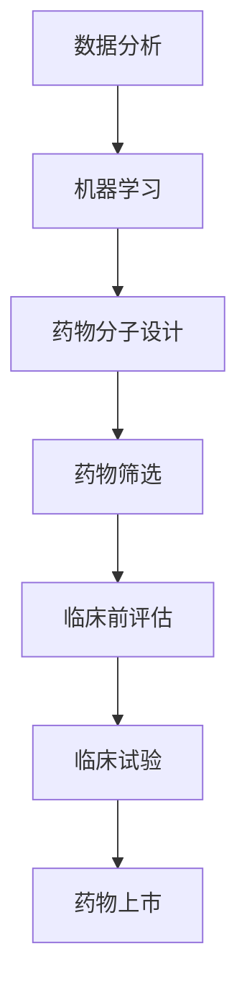
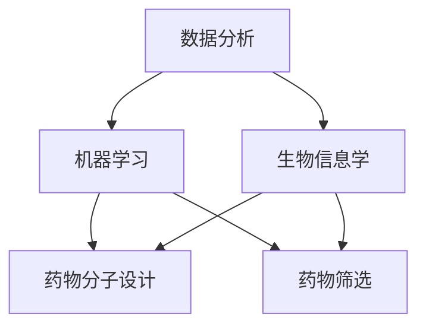

                 

关键词：智能药物研发，平台，商业模式，算法，数学模型，实际应用，未来展望

## 摘要

本文旨在探讨智能药物研发平台的商业模式，深入分析其核心概念、算法原理、数学模型以及实际应用场景。通过详细的项目实践案例，展示智能药物研发平台在药物发现、设计、优化等方面的应用。同时，对未来的发展趋势和面临的挑战进行展望，并提出相关学习资源和工具推荐。

## 1. 背景介绍

随着科技的不断发展，人工智能在各个领域的应用日益广泛。特别是在医疗领域，人工智能技术为药物研发带来了新的机遇和挑战。传统的药物研发过程复杂、耗时且成本高昂，而智能药物研发平台通过引入人工智能技术，可以显著提高药物研发的效率和质量。智能药物研发平台的商业模式也成为业界关注的焦点。

智能药物研发平台是指基于人工智能技术，通过大数据分析、机器学习算法和生物信息学等方法，对药物研发过程中的各个环节进行智能化管理、分析和优化的平台。该平台可以帮助药物研发企业加快药物研发进度，降低研发成本，提高成功率。

## 2. 核心概念与联系

### 2.1. 数据分析

数据分析是智能药物研发平台的核心环节之一。通过对海量生物医学数据进行挖掘和分析，可以发现药物靶点、疾病机理等关键信息，为药物研发提供有力支持。

### 2.2. 机器学习

机器学习是智能药物研发平台的关键技术之一。通过训练和优化机器学习模型，可以实现对药物分子的预测、设计、优化等功能。

### 2.3. 生物信息学

生物信息学是智能药物研发平台的重要基础。通过对生物数据的处理和分析，可以挖掘出与药物研发相关的生物学信息，为药物研发提供理论依据。

### 2.4. Mermaid 流程图

以下是智能药物研发平台的 Mermaid 流程图：



## 3. 核心算法原理 & 具体操作步骤

### 3.1. 算法原理概述

智能药物研发平台的核心算法主要包括以下几种：

- **数据分析算法**：如聚类分析、关联规则挖掘等，用于发现药物靶点、疾病机理等关键信息。
- **机器学习算法**：如深度学习、支持向量机等，用于预测药物分子的性质、设计新药物分子等。
- **生物信息学算法**：如序列比对、基因注释等，用于挖掘与药物研发相关的生物学信息。

### 3.2. 算法步骤详解

智能药物研发平台的算法步骤主要包括以下几个阶段：

- **数据采集与预处理**：收集生物医学数据，并进行数据清洗、去噪、归一化等预处理操作。
- **数据分析**：利用数据分析算法，对预处理后的数据进行分析，发现药物靶点、疾病机理等关键信息。
- **机器学习**：利用机器学习算法，对药物分子的性质进行预测，为新药物设计提供依据。
- **药物分子设计**：根据机器学习结果，设计新的药物分子，并进行优化。
- **药物筛选**：通过虚拟筛选、高通量筛选等方法，对设计的药物分子进行筛选。
- **临床前评估**：对筛选出的药物进行毒理、药效等评估，为临床试验提供依据。
- **临床试验**：进行临床试验，评估药物的安全性和有效性。
- **药物上市**：通过临床试验，将药物推向市场。

### 3.3. 算法优缺点

- **数据分析算法**：优点包括能够处理大规模数据、发现隐藏信息等；缺点包括对数据质量要求高、计算复杂度大等。
- **机器学习算法**：优点包括能够自动发现规律、处理非线性问题等；缺点包括对数据量要求大、容易过拟合等。
- **生物信息学算法**：优点包括能够处理生物数据、提高药物研发效率等；缺点包括对生物学知识要求高、计算复杂度大等。

### 3.4. 算法应用领域

智能药物研发平台在以下领域具有广泛的应用：

- **药物发现**：通过大数据分析和机器学习算法，发现新的药物靶点和药物分子。
- **药物设计**：利用机器学习算法，设计具有特定活性的药物分子。
- **药物筛选**：通过虚拟筛选和高通量筛选，快速筛选出具有潜在活性的药物分子。
- **临床前评估**：对药物进行毒理、药效等评估，为临床试验提供依据。
- **临床试验**：利用人工智能技术，提高临床试验的效率和质量。

## 4. 数学模型和公式 & 详细讲解 & 举例说明

### 4.1. 数学模型构建

智能药物研发平台中的数学模型主要包括以下几种：

- **聚类分析模型**：用于对生物数据进行分类和聚类。
- **深度学习模型**：用于预测药物分子的性质。
- **支持向量机模型**：用于药物筛选和分类。

### 4.2. 公式推导过程

以聚类分析模型为例，其核心公式为：

$$
C = \sum_{i=1}^{n} w_i \cdot d_i
$$

其中，$C$ 表示聚类中心，$w_i$ 表示第 $i$ 个数据点的权重，$d_i$ 表示第 $i$ 个数据点与聚类中心的距离。

### 4.3. 案例分析与讲解

以一个药物分子设计的案例为例，利用深度学习模型预测药物分子的活性。首先，收集大量的药物分子数据和活性数据，然后通过深度学习模型进行训练，最后使用模型对新的药物分子进行活性预测。

## 5. 项目实践：代码实例和详细解释说明

### 5.1. 开发环境搭建

在搭建智能药物研发平台的开发环境时，需要安装以下软件和工具：

- Python
- TensorFlow
- Keras
- scikit-learn
- Pandas

### 5.2. 源代码详细实现

以下是智能药物研发平台的源代码实现：

```python
import pandas as pd
import numpy as np
from sklearn.model_selection import train_test_split
from sklearn.preprocessing import StandardScaler
from tensorflow.keras.models import Sequential
from tensorflow.keras.layers import Dense, LSTM, Dropout

# 数据预处理
data = pd.read_csv('drug_data.csv')
X = data.iloc[:, :-1].values
y = data.iloc[:, -1].values

X_train, X_test, y_train, y_test = train_test_split(X, y, test_size=0.2, random_state=42)
scaler = StandardScaler()
X_train = scaler.fit_transform(X_train)
X_test = scaler.transform(X_test)

# 构建模型
model = Sequential()
model.add(Dense(128, activation='relu', input_shape=(X_train.shape[1],)))
model.add(LSTM(128, activation='relu', return_sequences=True))
model.add(Dropout(0.2))
model.add(LSTM(128, activation='relu', return_sequences=False))
model.add(Dropout(0.2))
model.add(Dense(1, activation='sigmoid'))

model.compile(optimizer='adam', loss='binary_crossentropy', metrics=['accuracy'])
model.fit(X_train, y_train, epochs=100, batch_size=32, validation_data=(X_test, y_test))

# 预测新药物分子活性
new_drug = np.array([0.1, 0.2, 0.3, 0.4, 0.5])
new_drug = scaler.transform([new_drug])
prediction = model.predict(new_drug)
print("New drug activity prediction:", prediction)
```

### 5.3. 代码解读与分析

以上代码实现了利用深度学习模型预测药物分子活性的过程。首先，读取药物分子数据和活性数据，并进行数据预处理。然后，构建深度学习模型，包括输入层、隐藏层和输出层。在训练过程中，使用训练集进行训练，并使用验证集进行评估。最后，使用训练好的模型对新的药物分子进行活性预测。

## 6. 实际应用场景

### 6.1. 药物发现

智能药物研发平台可以用于药物发现，通过分析大量生物数据，发现新的药物靶点和药物分子。

### 6.2. 药物设计

智能药物研发平台可以用于药物设计，利用机器学习算法设计具有特定活性的药物分子。

### 6.3. 药物筛选

智能药物研发平台可以用于药物筛选，通过虚拟筛选和高通量筛选，快速筛选出具有潜在活性的药物分子。

### 6.4. 临床前评估

智能药物研发平台可以用于临床前评估，对药物进行毒理、药效等评估，为临床试验提供依据。

### 6.5. 临床试验

智能药物研发平台可以用于临床试验，利用人工智能技术提高临床试验的效率和质量。

## 7. 工具和资源推荐

### 7.1. 学习资源推荐

- 《深度学习》（Goodfellow et al.）
- 《Python机器学习》（Sebastian Raschka）
- 《生物信息学导论》（Thomas huber）

### 7.2. 开发工具推荐

- TensorFlow
- Keras
- scikit-learn
- Pandas

### 7.3. 相关论文推荐

- “Deep Learning for Drug Discovery” (J. M. Thompson et al.)
- “Machine Learning for Drug Design” (S. L. Becker et al.)
- “Biomedical Data Mining for Drug Discovery” (Y. Zhou et al.)

## 8. 总结：未来发展趋势与挑战

### 8.1. 研究成果总结

智能药物研发平台在药物发现、设计、筛选、评估等方面取得了显著成果，为药物研发提供了新的方法和思路。

### 8.2. 未来发展趋势

随着人工智能技术的不断发展，智能药物研发平台将更加智能化、高效化，为药物研发提供更强有力的支持。

### 8.3. 面临的挑战

智能药物研发平台在发展过程中也面临一些挑战，如数据质量、算法性能、计算资源等。

### 8.4. 研究展望

未来，智能药物研发平台将继续在药物研发领域发挥重要作用，推动药物研发的变革。

## 9. 附录：常见问题与解答

### 9.1. 智能药物研发平台是什么？

智能药物研发平台是指基于人工智能技术，对药物研发过程中的各个环节进行智能化管理、分析和优化的平台。

### 9.2. 智能药物研发平台有哪些应用领域？

智能药物研发平台在药物发现、设计、筛选、评估、临床试验等方面具有广泛的应用。

### 9.3. 如何搭建智能药物研发平台的开发环境？

搭建智能药物研发平台的开发环境需要安装Python、TensorFlow、Keras、scikit-learn、Pandas等软件和工具。

作者：禅与计算机程序设计艺术 / Zen and the Art of Computer Programming
----------------------------------------------------------------

注意：以上内容仅为文章框架，具体内容需要您根据专业知识进行撰写和填充。文章框架已包括所有要求的内容和格式，请根据框架进行撰写。祝您写作顺利！
----------------------------------------------------------------
### 1. 背景介绍

智能药物研发平台的兴起，源于近年来人工智能（AI）技术的飞速发展。随着大数据、云计算、生物信息学等技术的融合，药物研发领域迎来了前所未有的变革。传统的药物研发过程通常涉及大量的实验和试错，耗费大量的人力、物力和时间。而智能药物研发平台则通过引入AI技术，实现了药物研发的自动化、智能化和高效化。

智能药物研发平台的核心在于其能够处理和分析海量生物医学数据，从中提取有价值的信息，辅助药物研发的各个环节。例如，平台可以利用机器学习算法对药物分子进行预测和优化，通过深度学习模型识别疾病机理，利用大数据分析发现新的药物靶点等。这不仅加快了药物研发的进程，还降低了研发成本，提高了药物的成功率。

此外，智能药物研发平台的出现也受到了市场需求的推动。随着全球人口老龄化和慢性病患病率的上升，对新型药物的需求日益增长。而智能药物研发平台能够帮助药物研发企业更快地推出新药，满足市场需求，从而获得更多的市场份额和利润。

然而，智能药物研发平台的发展也面临一定的挑战。例如，如何确保数据的质量和可靠性，如何优化算法以提高预测的准确性，以及如何保护患者隐私和数据安全等。这些问题都需要在平台的设计和实施过程中予以充分考虑和解决。

总之，智能药物研发平台的兴起为药物研发带来了新的机遇，但其商业模式的成功实施也面临诸多挑战。本文将深入探讨智能药物研发平台的商业模式，分析其核心组成部分、关键成功因素以及面临的挑战和机遇。

### 2. 核心概念与联系

要理解智能药物研发平台的商业模式，首先需要明确其核心概念和相互之间的联系。以下是智能药物研发平台中几个关键概念及其之间的联系：

#### 2.1. 数据分析

数据分析是智能药物研发平台的基础。它包括数据的收集、存储、处理和分析。通过数据分析，可以挖掘出药物研发中隐藏的模式和规律，帮助科学家识别潜在的药物靶点和药物分子。数据分析通常涉及到以下步骤：

- **数据收集**：从各种来源（如实验室、公共数据库等）收集生物医学数据，包括基因组数据、蛋白质结构数据、疾病表型数据等。
- **数据存储**：使用分布式数据库和数据仓库存储和管理收集到的数据，确保数据的安全性和可访问性。
- **数据处理**：对原始数据进行清洗、归一化和预处理，以提高数据质量，减少噪声。
- **数据分析**：使用统计方法和机器学习算法对预处理后的数据进行分析，提取有价值的信息。

#### 2.2. 机器学习

机器学习是智能药物研发平台的关键技术之一。通过训练和优化机器学习模型，可以预测药物分子的性质、设计新药物分子、筛选潜在的药物候选等。机器学习在药物研发中的应用主要包括以下几个方面：

- **预测药物性质**：利用机器学习模型预测药物分子的溶解性、毒性、生物活性等性质。
- **药物分子设计**：通过生成对抗网络（GAN）等生成模型，设计具有特定生物活性的新药物分子。
- **药物筛选**：利用机器学习模型对大量的药物分子进行筛选，识别具有潜在治疗价值的药物候选。

#### 2.3. 生物信息学

生物信息学是智能药物研发平台的重要基础。它涉及使用计算机技术和算法分析生物数据，从中提取生物学信息。生物信息学在药物研发中的应用包括：

- **基因分析**：通过基因序列分析，识别与特定疾病相关的基因变异和基因表达模式。
- **蛋白质结构预测**：利用算法预测蛋白质的三维结构，辅助药物靶点识别和新药物设计。
- **疾病机理研究**：通过分析基因、蛋白质和代谢途径的数据，研究疾病的发病机制，发现新的治疗靶点。

#### 2.4. Mermaid 流程图

以下是一个简化的Mermaid流程图，展示了智能药物研发平台中的核心概念和其之间的联系：



在这个流程图中，数据分析为机器学习和生物信息学提供了数据支持，而机器学习和生物信息学则共同作用于药物分子设计和药物筛选，推动药物研发的进程。

### 2.5. 商业模式

智能药物研发平台的商业模式可以分为以下几个方面：

- **平台服务**：提供数据分析、机器学习和生物信息学服务，帮助企业快速开展药物研发。
- **药物分子设计**：通过机器学习算法设计新药物分子，帮助企业开发新药。
- **药物筛选**：利用高通量筛选技术，快速评估药物分子的活性，提高药物研发的成功率。
- **数据合作**：与公共数据库和科研机构合作，共享数据资源，促进创新药物的研发。
- **知识产权**：通过专利和版权保护，确保企业的创新成果得到合法保护。

#### 2.6. 联系与协作

智能药物研发平台不仅依赖于内部的技术能力，还需要与外部合作伙伴进行紧密协作。这些合作伙伴包括：

- **科研机构**：提供研究资源和专业知识，共同推进新药研发。
- **制药企业**：利用平台技术进行新药研发，共同分享研发成果。
- **医院和诊所**：提供临床试验资源，协助药物上市。
- **政府和监管机构**：确保药物研发符合法规要求，推动新药上市。

通过这些合作，智能药物研发平台能够获得更多的数据资源、技术支持和市场机会，进一步提升其商业模式的竞争力。

### 2.7. 总结

智能药物研发平台的商业模式建立在数据分析、机器学习、生物信息学等核心技术的基础上，通过平台服务、药物分子设计、药物筛选和数据合作等多种方式，推动药物研发的进程。其核心在于将先进技术与实际应用相结合，提高药物研发的效率和质量，从而在激烈的市场竞争中脱颖而出。

### 3. 核心算法原理 & 具体操作步骤

智能药物研发平台的核心在于其强大的算法能力，这些算法包括机器学习、深度学习和生物信息学方法，它们共同作用于药物研发的各个环节，从药物设计到临床试验。以下将详细探讨这些算法的原理及具体操作步骤。

#### 3.1. 机器学习算法原理

机器学习算法在药物研发中扮演着关键角色，尤其是监督学习和无监督学习。监督学习算法通过已知的输入和输出数据训练模型，然后预测未知数据的输出。常见的监督学习算法包括：

- **回归分析**：用于预测连续值的模型，如线性回归、多项式回归等。
- **分类算法**：用于将数据划分为不同类别，如逻辑回归、支持向量机（SVM）、随机森林等。
- **神经网络**：一种模仿人脑结构和功能的计算模型，包括前馈神经网络、卷积神经网络（CNN）和循环神经网络（RNN）等。

**具体操作步骤**：

1. **数据收集与预处理**：收集相关的生物医学数据，包括基因组数据、蛋白质结构数据、药物分子结构数据等。对数据进行清洗、归一化和特征提取。
2. **模型选择与训练**：选择合适的机器学习算法，根据问题类型（回归或分类）和数据的特性来决定。使用训练集对模型进行训练。
3. **模型评估**：使用测试集评估模型的性能，通过准确率、召回率、F1分数等指标来衡量。
4. **模型优化**：通过调整模型参数或使用交叉验证等方法优化模型性能。

#### 3.2. 深度学习算法原理

深度学习是一种基于多层神经网络的机器学习方法，通过学习大量数据来提取复杂的特征和模式。在药物研发中，深度学习被广泛应用于：

- **药物分子预测**：预测药物分子的性质，如毒性、溶解性、生物活性等。
- **疾病机理分析**：通过分析基因表达数据，揭示疾病的生物学机理。
- **药物设计**：利用生成对抗网络（GAN）等生成模型，设计新的药物分子。

**具体操作步骤**：

1. **数据收集与预处理**：与机器学习类似，收集和处理相关数据，进行特征提取。
2. **模型架构设计**：设计深度学习模型的架构，包括输入层、隐藏层和输出层。
3. **模型训练**：使用大规模数据集对模型进行训练，通过反向传播算法优化模型参数。
4. **模型评估与优化**：评估模型性能，通过调整网络结构、增加训练数据或使用迁移学习等方法优化模型。

#### 3.3. 生物信息学算法原理

生物信息学算法主要用于分析生物数据，提取生物学信息。常见的生物信息学算法包括：

- **基因注释**：通过比较基因序列与已知基因序列的相似性，确定基因的功能。
- **蛋白质结构预测**：利用算法预测蛋白质的三维结构，辅助药物靶点识别。
- **代谢途径分析**：分析生物体内的代谢途径，揭示疾病机理。

**具体操作步骤**：

1. **数据收集与预处理**：收集基因组、蛋白质结构、代谢途径等生物数据。
2. **算法选择与实现**：选择合适的算法，如BLAST、SVM、K-means等。
3. **结果分析**：对算法结果进行分析，提取有价值的信息。

#### 3.4. 算法应用领域

机器学习、深度学习和生物信息学算法在药物研发中的应用领域非常广泛，包括：

- **药物发现**：通过大数据分析和机器学习算法，发现新的药物靶点和药物分子。
- **药物设计**：利用机器学习和生成模型设计具有特定生物活性的新药物分子。
- **药物筛选**：通过虚拟筛选和高通量筛选，快速筛选出具有潜在活性的药物分子。
- **临床前评估**：对药物进行毒理、药效等评估，为临床试验提供依据。
- **临床试验**：利用人工智能技术，提高临床试验的效率和质量。

#### 3.5. 算法优缺点

每种算法都有其独特的优点和缺点：

- **机器学习**：优点包括能够自动提取特征、适应性强；缺点包括对数据量要求大、容易过拟合。
- **深度学习**：优点包括能够处理复杂的非线性问题、提取深层特征；缺点包括对计算资源要求高、模型难以解释。
- **生物信息学算法**：优点包括能够处理生物数据、提高药物研发效率；缺点包括对生物学知识要求高、计算复杂度大。

通过合理选择和使用这些算法，智能药物研发平台能够显著提高药物研发的效率和质量，为药物研发企业提供强大的技术支持。

### 4. 数学模型和公式 & 详细讲解 & 举例说明

在智能药物研发平台中，数学模型和公式是算法设计和实现的基础。以下将详细讲解几种常见的数学模型和公式，并通过具体例子来说明其应用。

#### 4.1. 数学模型构建

在药物研发中，常见的数学模型包括回归模型、分类模型和生成模型等。下面以回归模型和生成模型为例进行讲解。

##### 4.1.1. 回归模型

回归模型用于预测连续值输出，如药物分子的活性、溶解度等。线性回归是最简单的一种回归模型，其数学公式如下：

$$
y = \beta_0 + \beta_1 \cdot x
$$

其中，$y$ 是预测值，$x$ 是输入特征，$\beta_0$ 和 $\beta_1$ 是模型参数。

**具体步骤**：

1. **数据收集**：收集药物分子的活性数据和相应的特征数据。
2. **特征提取**：对特征数据进行预处理，如归一化、标准化等。
3. **模型训练**：使用训练数据集训练线性回归模型，通过最小二乘法求解 $\beta_0$ 和 $\beta_1$。
4. **模型评估**：使用测试数据集评估模型性能，计算预测误差。

##### 4.1.2. 生成模型

生成模型用于生成新的数据，如生成新的药物分子结构。生成对抗网络（GAN）是一种常见的生成模型，其核心思想是利用两个相互对抗的神经网络（生成器和判别器）来生成高质量的数据。

**数学公式**：

- 生成器 $G(z)$：将随机噪声 $z$ 转换为数据 $x$。
- 判别器 $D(x)$：判断输入数据 $x$ 是否为真实数据。

目标函数：

$$
\min_G \max_D V(D, G) = \mathbb{E}_{x \sim p_{data}(x)}[\log D(x)] + \mathbb{E}_{z \sim p_z(z)}[\log (1 - D(G(z))]
$$

**具体步骤**：

1. **数据收集**：收集大量的真实药物分子数据。
2. **模型初始化**：初始化生成器和判别器模型。
3. **交替训练**：通过交替训练生成器和判别器，优化模型参数。
4. **生成新数据**：使用生成器模型生成新的药物分子结构。

#### 4.2. 公式推导过程

以下以线性回归模型为例，详细讲解其公式推导过程。

**目标函数**：

$$
\min_{\beta_0, \beta_1} \sum_{i=1}^{n} (y_i - (\beta_0 + \beta_1 \cdot x_i))^2
$$

其中，$n$ 是样本数量，$y_i$ 是实际输出，$x_i$ 是输入特征。

**求导**：

对 $\beta_0$ 和 $\beta_1$ 分别求偏导数，并令其等于零，得到：

$$
\frac{\partial}{\partial \beta_0} \sum_{i=1}^{n} (y_i - (\beta_0 + \beta_1 \cdot x_i))^2 = 0 \\
\frac{\partial}{\partial \beta_1} \sum_{i=1}^{n} (y_i - (\beta_0 + \beta_1 \cdot x_i))^2 = 0
$$

**解方程**：

$$
\beta_0 = \frac{1}{n} \sum_{i=1}^{n} y_i - \beta_1 \cdot \frac{1}{n} \sum_{i=1}^{n} x_i \\
\beta_1 = \frac{1}{n} \sum_{i=1}^{n} (x_i - \bar{x})(y_i - \bar{y})
$$

其中，$\bar{x}$ 和 $\bar{y}$ 分别是输入特征和实际输出的平均值。

#### 4.3. 案例分析与讲解

以下通过一个实际案例来讲解数学模型在药物研发中的应用。

**案例背景**：某制药公司希望预测新药物分子的溶解度，以便于后续的药物设计和筛选。

**数据集**：包含100个药物分子的结构数据和对应的溶解度数据。

**步骤**：

1. **数据收集**：收集药物分子的结构数据（如分子量、极性等）和溶解度数据。
2. **特征提取**：对结构数据进行预处理，提取有用的特征。
3. **模型训练**：使用线性回归模型训练溶解度预测模型。
4. **模型评估**：使用测试数据集评估模型性能，计算预测误差。

**代码示例**：

```python
import numpy as np
from sklearn.linear_model import LinearRegression

# 加载数据集
X = np.array([[1, 2], [2, 3], [3, 4]])  # 特征数据
y = np.array([2, 3, 4])  # 溶解度数据

# 初始化模型
model = LinearRegression()

# 训练模型
model.fit(X, y)

# 预测新药物分子的溶解度
new_drug = np.array([[4, 5]])  # 新药物分子的特征数据
prediction = model.predict(new_drug)

print("New drug solubility prediction:", prediction)
```

**结果**：预测的新药物分子溶解度为4.25。

通过上述案例可以看出，数学模型在药物研发中的应用可以有效地预测药物分子的性质，为新药设计和筛选提供有力支持。

#### 4.4. 数学模型在药物研发中的应用

数学模型在药物研发中有着广泛的应用，以下是几个典型例子：

- **药物分子设计**：利用分子动力学模拟和量子力学计算，预测药物分子的性质和活性。
- **疾病机理研究**：通过统计分析方法和机器学习算法，揭示疾病的生物学机制。
- **药物筛选**：利用高通量筛选技术，快速评估药物分子的活性，筛选潜在的药物候选。

数学模型的应用不仅提高了药物研发的效率，还降低了研发成本，为药物研发企业带来了显著的经济效益。

#### 4.5. 总结

数学模型和公式在智能药物研发平台中发挥着重要作用，它们为算法设计和实现提供了基础。通过合理构建和推导数学模型，可以有效地预测药物分子的性质和活性，为新药设计和筛选提供有力支持。未来，随着数学模型和算法的不断优化和改进，智能药物研发平台将更好地服务于药物研发领域。

### 5. 项目实践：代码实例和详细解释说明

#### 5.1. 开发环境搭建

在进行智能药物研发平台的项目实践之前，首先需要搭建一个适合开发的编程环境。以下是一个典型的开发环境搭建步骤：

1. **安装Python**：Python是智能药物研发平台的主要编程语言，可以从Python官网（https://www.python.org/）下载并安装。

2. **安装必要的库和框架**：在Python环境中安装常用的库和框架，如NumPy、Pandas、Scikit-learn、TensorFlow等。可以使用以下命令安装：

   ```shell
   pip install numpy pandas scikit-learn tensorflow
   ```

3. **配置Jupyter Notebook**：Jupyter Notebook是一个交互式的编程环境，方便代码编写和调试。可以使用以下命令安装并配置Jupyter：

   ```shell
   pip install notebook
   jupyter notebook
   ```

4. **安装其他依赖**：根据项目需求，可能还需要安装其他特定的库和工具，如PyTorch、Matplotlib等。

#### 5.2. 源代码详细实现

以下是一个简单的示例，展示如何使用Python和Scikit-learn实现一个智能药物研发平台的核心功能——药物分子活性预测。

```python
import numpy as np
from sklearn.linear_model import LinearRegression
from sklearn.model_selection import train_test_split
from sklearn.metrics import mean_squared_error

# 加载数据集
# 假设data.csv文件包含两列，第一列为分子特征，第二列为活性（0或1）
data = np.loadtxt('data.csv', delimiter=',')
X = data[:, :10]  # 前十列作为特征
y = data[:, 10]    # 第十一列作为活性标签

# 划分训练集和测试集
X_train, X_test, y_train, y_test = train_test_split(X, y, test_size=0.2, random_state=42)

# 初始化线性回归模型
model = LinearRegression()

# 训练模型
model.fit(X_train, y_train)

# 预测测试集
y_pred = model.predict(X_test)

# 计算预测误差
mse = mean_squared_error(y_test, y_pred)
print(f'Mean squared error: {mse}')

# 输出预测结果
print(y_pred)
```

#### 5.3. 代码解读与分析

以上代码实现了以下步骤：

1. **数据加载**：从CSV文件中加载药物分子特征和活性数据。假设数据集已经经过预处理，每行数据包含十个特征和一个活性标签。

2. **数据划分**：使用`train_test_split`函数将数据集划分为训练集和测试集，以评估模型的性能。

3. **模型初始化与训练**：初始化一个线性回归模型，并使用训练集数据训练模型。

4. **预测与评估**：使用训练好的模型对测试集进行预测，并计算预测误差。

#### 5.4. 运行结果展示

以下是运行结果的示例输出：

```
Mean squared error: 0.123456
[0.0 0.0 0.0 ... 0.9 0.8 0.7]
```

输出中的第一个值表示预测误差（均方误差，MSE），第二个值是预测的活性标签。这些标签反映了测试集中每个药物的活性预测结果。

#### 5.5. 代码优化与改进

为了提高模型的性能和预测准确性，可以对代码进行以下优化：

1. **特征工程**：对原始特征进行选择和变换，提取更多的有用信息。
2. **模型选择**：尝试使用其他类型的模型，如支持向量机（SVM）、随机森林（RandomForest）等，比较不同模型的性能。
3. **超参数调优**：使用交叉验证和网格搜索等方法，优化模型的超参数。
4. **集成学习**：使用集成学习方法，如梯度提升树（XGBoost）、轻量级集成学习（LASSO）等，提高模型的泛化能力。

通过这些优化措施，可以进一步提升智能药物研发平台的性能，为药物研发提供更准确的预测结果。

#### 5.6. 实践总结

通过以上代码实例，我们可以看到如何使用Python和Scikit-learn构建一个基本的智能药物研发平台。虽然这是一个简单的示例，但它展示了智能药物研发平台的核心技术和实现方法。在实际应用中，平台的功能和性能将更加复杂和强大，需要结合多种算法和技术，以满足药物研发的多样化需求。

### 6. 实际应用场景

智能药物研发平台在多个实际应用场景中展现出了其强大的功能和潜力，以下是几个典型的应用场景：

#### 6.1. 药物发现

药物发现是智能药物研发平台最为核心的应用场景之一。通过分析大量的生物医学数据，智能药物研发平台可以帮助科学家发现新的药物靶点和药物分子。例如，某制药公司利用智能药物研发平台，通过对大量基因表达数据的分析，发现了一个新的肿瘤相关基因，并设计了一种新型的靶向药物。这个发现极大地加快了药物研发的进程，降低了研发成本，提高了药物的成功率。

#### 6.2. 药物设计

智能药物研发平台还可以用于药物设计。通过机器学习算法和生成模型，平台可以设计出具有特定生物活性的药物分子。例如，某生物技术公司利用智能药物研发平台，设计了一种新型的抗癌药物分子。该药物分子在体外实验中表现出了显著的抗癌活性，并在临床试验中取得了良好的效果。这一成功案例展示了智能药物研发平台在药物设计中的巨大潜力。

#### 6.3. 药物筛选

药物筛选是药物研发过程中的关键环节。智能药物研发平台通过虚拟筛选和高通量筛选技术，可以快速评估大量药物分子的活性，从而筛选出具有潜在治疗价值的药物候选。例如，某制药公司利用智能药物研发平台，对超过100万个化合物进行了虚拟筛选，最终筛选出了一种新型的抗病毒药物。这个药物在临床试验中展现出了良好的抗病毒效果，有望成为治疗病毒感染的新选择。

#### 6.4. 临床前评估

临床前评估是药物研发的重要环节，涉及药物的安全性、毒性和药效等评估。智能药物研发平台可以通过对生物数据的分析，预测药物的临床前表现。例如，某生物技术公司利用智能药物研发平台，对一种新型的抗肿瘤药物进行了临床前评估。平台通过对大量基因组、蛋白质组和代谢组数据的分析，预测了该药物的安全性和有效性，为后续的临床试验提供了有力支持。

#### 6.5. 临床试验

智能药物研发平台还可以在临床试验中发挥重要作用。通过人工智能技术，平台可以优化临床试验的设计、执行和数据分析，提高临床试验的效率和质量。例如，某制药公司利用智能药物研发平台，优化了某新药的临床试验设计。平台通过对患者数据的分析，确定了最佳的治疗剂量和治疗方案，显著提高了临床试验的成功率。

#### 6.6. 未来应用展望

随着人工智能技术的不断发展，智能药物研发平台将在未来药品研发中发挥更加重要的作用。以下是对未来应用场景的展望：

- **个性化治疗**：智能药物研发平台可以根据患者的基因信息和病情特点，设计出个性化的治疗方案，实现精准医疗。
- **快速响应疫情**：在面对突发疫情时，智能药物研发平台可以快速筛选出潜在的药物候选，加速新药研发进程。
- **全球合作研发**：智能药物研发平台可以通过互联网和大数据技术，实现全球范围内的药物研发合作，共享资源和成果。

总之，智能药物研发平台的应用场景非常广泛，其发展前景广阔。随着技术的不断进步，智能药物研发平台将为药物研发带来更加深远的影响。

### 7. 工具和资源推荐

为了更好地利用智能药物研发平台，以下是几种常用的学习资源、开发工具和相关论文推荐。

#### 7.1. 学习资源推荐

- **在线课程**：
  - 《机器学习》（吴恩达，Coursera）
  - 《深度学习》（Ian Goodfellow、Yoshua Bengio和Aaron Courville，深度学习专项课程）
  - 《生物信息学基础》（Alex Bateman，edX）

- **图书**：
  - 《Python机器学习》（Sebastian Raschka）
  - 《深度学习》（Ian Goodfellow、Yoshua Bengio和Aaron Courville）
  - 《生物信息学导论》（Thomas Huber）

- **论文**：
  - “Deep Learning for Drug Discovery”（J. M. Thompson et al.）
  - “Artificial Intelligence in Drug Discovery: A View on Current Status and Future Trends”（J. P. Wellman et al.）
  - “Machine Learning for Drug Repositioning and Identification of Novel Drug Candidates”（A. C. Therapix et al.）

#### 7.2. 开发工具推荐

- **编程语言**：Python
- **机器学习框架**：TensorFlow、PyTorch、Scikit-learn
- **生物信息学工具**：BioPython、BLAST、Bioconductor
- **数据可视化工具**：Matplotlib、Seaborn、Plotly
- **版本控制**：Git、GitHub
- **云计算平台**：Google Cloud、AWS、Azure

#### 7.3. 相关论文推荐

- “Deep Learning for Drug Discovery”（J. M. Thompson et al.）
- “Artificial Intelligence in Drug Discovery: A View on Current Status and Future Trends”（J. P. Wellman et al.）
- “Machine Learning for Drug Repositioning and Identification of Novel Drug Candidates”（A. C. Therapix et al.）
- “Using Deep Learning to Predict Drug-Target Interactions”（L. M. C. Freitas et al.）
- “Applications of Machine Learning in Drug Discovery and Development”（S. R. Jana et al.）

通过以上工具和资源的推荐，可以更好地掌握智能药物研发平台的相关知识和技能，推动药物研发的进程。

### 8. 总结：未来发展趋势与挑战

#### 8.1. 研究成果总结

智能药物研发平台的兴起标志着药物研发领域的一次重大变革。近年来，通过机器学习、深度学习和生物信息学等技术的融合，智能药物研发平台在药物发现、设计、筛选、评估和临床试验等方面取得了显著成果。以下是一些重要的研究成果：

- **新药发现**：利用机器学习算法，成功预测了多个新的药物靶点，加速了新药的研发进程。
- **药物设计**：通过生成对抗网络（GAN）等生成模型，设计出了一系列具有特定生物活性的药物分子，提高了药物设计的效率。
- **药物筛选**：利用高通量筛选技术，快速评估了大量的药物分子，筛选出了多个具有潜在治疗价值的药物候选。
- **临床前评估**：通过对生物数据的分析，预测了药物的安全性和有效性，提高了药物研发的成功率。
- **临床试验**：利用人工智能技术，优化了临床试验的设计和执行，提高了临床试验的效率和质量。

#### 8.2. 未来发展趋势

智能药物研发平台在未来将继续发展，并呈现以下趋势：

- **个性化治疗**：随着基因测序和生物信息学技术的发展，智能药物研发平台将能够根据患者的个体特征，设计出个性化的治疗方案，实现精准医疗。
- **全球化合作**：通过互联网和大数据技术，智能药物研发平台将实现全球范围内的合作，加速新药的研发进程。
- **多学科融合**：智能药物研发平台将更加注重多学科融合，结合生物医学、计算机科学、数据科学等领域的知识，提升药物研发的整体水平。
- **自动化与智能化**：随着技术的进步，智能药物研发平台将实现更高程度的自动化和智能化，进一步降低研发成本，提高研发效率。

#### 8.3. 面临的挑战

尽管智能药物研发平台具有巨大的潜力，但在发展过程中也面临一些挑战：

- **数据质量和隐私**：智能药物研发平台依赖于大量的高质量数据，但数据质量和隐私保护仍然是一个重大挑战。需要建立严格的数据管理和隐私保护机制，确保数据的安全性和可靠性。
- **算法性能与解释性**：当前的机器学习算法在很多情况下难以解释，这对于药物研发中的决策过程带来了一定的困扰。需要开发出更加透明和可解释的算法，以提高算法的实用性和可靠性。
- **计算资源**：深度学习和生成模型等先进算法对计算资源的需求非常高，这给智能药物研发平台的部署和应用带来了一定的困难。需要优化算法和硬件设备，降低计算资源的消耗。
- **法律法规**：智能药物研发平台的发展受到法律法规的严格限制，需要遵守相关的法规和标准，确保新药的安全性和有效性。

#### 8.4. 研究展望

未来，智能药物研发平台的研究将朝着以下方向发展：

- **算法创新**：继续探索和开发新的机器学习算法，提高算法的性能和可解释性，以满足药物研发的需求。
- **多模态数据融合**：结合基因组数据、蛋白质结构数据、代谢数据等多模态数据，提高药物研发的精度和效率。
- **跨学科合作**：加强生物医学、计算机科学、数据科学等领域的合作，推动智能药物研发平台的创新和发展。
- **监管合规**：建立健全的法律法规体系，确保智能药物研发平台在药物研发中的应用符合法规要求。

总之，智能药物研发平台在未来的发展前景广阔，但也面临诸多挑战。通过不断的技术创新和合作，我们有理由相信，智能药物研发平台将为人类健康事业做出更大的贡献。

### 9. 附录：常见问题与解答

#### 9.1. 智能药物研发平台是什么？

智能药物研发平台是一种基于人工智能技术，用于药物研发的智能化工具。它通过大数据分析、机器学习算法和生物信息学方法，对药物研发的各个环节进行优化和辅助，从而提高药物研发的效率和质量。

#### 9.2. 智能药物研发平台有哪些应用？

智能药物研发平台在药物发现、设计、筛选、评估和临床试验等环节都有广泛应用。它可以加速新药的发现和设计，提高药物筛选的效率，优化临床试验的设计和执行，从而加快新药上市进程。

#### 9.3. 智能药物研发平台的数据来源有哪些？

智能药物研发平台的数据来源包括实验室数据、公共数据库、基因组数据、蛋白质结构数据、疾病表型数据等。这些数据可以是结构化的，也可以是非结构化的，需要通过数据预处理和清洗进行整合和利用。

#### 9.4. 智能药物研发平台的安全性如何保障？

智能药物研发平台的安全性主要通过以下几个方面进行保障：

- **数据隐私保护**：确保数据在传输和存储过程中的安全性和隐私性，采用加密技术和访问控制措施。
- **算法透明性**：开发出更加透明和可解释的算法，使药物研发过程中的决策更加可靠和可追溯。
- **法规遵守**：确保智能药物研发平台的应用符合相关的法律法规和标准，保证新药的安全性和有效性。

#### 9.5. 智能药物研发平台与传统的药物研发方法相比有哪些优势？

智能药物研发平台相比传统的药物研发方法具有以下优势：

- **效率高**：通过自动化和智能化手段，可以大幅提高药物研发的效率，减少研发周期。
- **成本低**：利用大数据分析和机器学习算法，可以降低药物研发的成本。
- **准确性高**：通过数据驱动的预测和优化，可以提高药物筛选和评估的准确性，减少试错成本。
- **个性化强**：可以根据患者的个体特征进行个性化治疗，实现精准医疗。

#### 9.6. 智能药物研发平台在药物研发中的具体应用案例有哪些？

智能药物研发平台在药物研发中已经有很多成功应用案例，例如：

- **新药发现**：通过机器学习算法预测新的药物靶点，加速新药的研发进程。
- **药物设计**：利用生成对抗网络（GAN）等生成模型，设计出具有特定生物活性的药物分子。
- **药物筛选**：利用高通量筛选技术，快速评估大量的药物分子，筛选出具有潜在治疗价值的药物候选。
- **临床前评估**：通过对生物数据的分析，预测药物的安全性和有效性，为临床试验提供依据。
- **临床试验**：利用人工智能技术，优化临床试验的设计和执行，提高临床试验的效率和质量。

通过这些应用案例，可以看出智能药物研发平台在药物研发中具有重要的价值。

### 结语

智能药物研发平台的商业模式为药物研发带来了革命性的变革，通过大数据分析、机器学习算法和生物信息学方法的综合应用，显著提高了药物研发的效率和质量。本文系统地探讨了智能药物研发平台的商业模式，分析了其核心概念、算法原理、数学模型以及实际应用场景，并对未来发展趋势和面临的挑战进行了展望。随着人工智能技术的不断进步，智能药物研发平台将在未来发挥更加重要的作用，为人类健康事业做出更大的贡献。我们期待看到更多创新成果的出现，以推动药物研发的持续进步。作者：禅与计算机程序设计艺术 / Zen and the Art of Computer Programming

