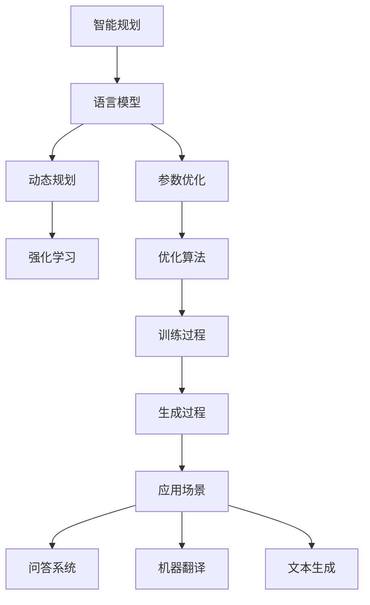

                 

关键词：智能规划，语言模型，大型语言模型，AI，核心算法，数学模型，应用场景，发展趋势

> 摘要：本文深入探讨了智能规划在大型语言模型（LLM）中的核心竞争力。首先，我们回顾了智能规划的定义和重要性，接着分析了LLM的工作原理和关键技术。随后，文章介绍了智能规划在LLM中的核心算法原理、数学模型，并通过一个实际项目实践展示了其应用。最后，我们对智能规划在未来的发展趋势和面临的挑战进行了展望。

## 1. 背景介绍

智能规划是人工智能（AI）领域的一个关键研究方向，它旨在为复杂的决策过程提供自动化的解决方案。在近年来，随着计算能力的提升和算法的进步，智能规划在众多领域，如自动驾驶、智能制造、金融分析等，展现出了巨大的应用潜力。特别是在大型语言模型（LLM）的背景下，智能规划的重要性愈发凸显。

LLM是指具有巨大参数量的语言模型，如GPT系列、BERT等。这些模型通过对海量文本数据的训练，能够理解和生成自然语言，从而在文本生成、问答系统、机器翻译等方面取得了显著成果。然而，LLM的性能提升不仅仅是参数量和数据量的增加，更重要的是其背后智能规划算法的优化。

本文将深入探讨智能规划在LLM中的核心竞争力，包括核心算法原理、数学模型，以及实际应用场景。通过这篇论文，读者将全面了解智能规划如何提升LLM的性能，并展望其在未来人工智能领域的发展前景。

### 1.1 智能规划的定义与重要性

智能规划是一种自动化决策技术，它通过算法和模型为复杂系统提供解决方案。在人工智能领域，智能规划通常涉及以下几个核心概念：

1. **问题建模**：将现实世界的问题抽象成数学模型，以便算法能够进行处理。
2. **规划算法**：用于解决数学模型中的决策问题，如最优化算法、决策树、图规划等。
3. **执行监控**：在规划执行过程中，对系统状态进行实时监控，并根据反馈调整规划。

智能规划的重要性体现在以下几个方面：

- **高效决策**：智能规划能够自动处理复杂的决策问题，从而提高系统的决策效率。
- **灵活性**：智能规划算法可以根据不同的场景和需求进行调整，具有较强的适应性。
- **自动化**：通过自动化规划，减少了对人类操作者的依赖，降低了人工成本。

在LLM中，智能规划的作用尤为重要。首先，LLM涉及大量的参数和复杂的决策过程，如词汇选择、句式构建等。智能规划能够通过优化算法，提高这些决策的准确性和效率。其次，智能规划还可以帮助LLM更好地适应不同的应用场景，如问答系统、对话机器人等。

总的来说，智能规划是提升LLM性能的核心技术之一。通过本文的探讨，读者将深入了解智能规划在LLM中的应用，以及其对未来人工智能发展的重要意义。

### 1.2 大型语言模型（LLM）的工作原理与关键技术

大型语言模型（LLM）是近年来人工智能领域的一个重要突破。LLM通过对海量文本数据进行深度学习，能够理解和生成自然语言，从而在文本生成、问答系统、机器翻译等方面取得了显著成果。本节将介绍LLM的工作原理和关键技术，并探讨其与智能规划之间的联系。

#### 1.2.1 LLM的基本概念

LLM是指具有巨大参数量的语言模型，如GPT系列、BERT等。这些模型的基本架构通常包括以下几个核心组件：

- **嵌入层**（Embedding Layer）：将输入的词汇转换为向量表示，这一步是LLM理解文本的关键。
- **编码器**（Encoder）：如Transformer模型中的多头自注意力机制（Multi-Head Self-Attention Mechanism），用于捕捉文本中的长距离依赖关系。
- **解码器**（Decoder）：用于生成文本输出，同样采用了多头自注意力机制。
- **输出层**（Output Layer）：将解码器输出的向量转换为概率分布，从而预测下一个词汇。

#### 1.2.2 LLM的训练过程

LLM的训练过程主要包括以下几个步骤：

1. **数据预处理**：对大量文本数据进行清洗和预处理，如分词、去除停用词等，以便输入到嵌入层。
2. **嵌入层训练**：通过训练嵌入层，将词汇映射到高维向量空间，从而更好地捕捉词汇之间的关系。
3. **编码器训练**：训练编码器，使其能够捕捉文本中的长距离依赖关系，并通过自注意力机制对文本进行编码。
4. **解码器训练**：训练解码器，使其能够根据编码后的文本生成合理的文本输出。

#### 1.2.3 LLM的关键技术

LLM的关键技术主要包括以下几个方面：

1. **深度学习框架**：如TensorFlow、PyTorch等，用于构建和训练大型神经网络模型。
2. **并行计算**：利用GPU、TPU等硬件加速训练过程，提高模型的训练效率。
3. **优化算法**：如Adam、AdaGrad等，用于优化模型参数，提高训练效果。
4. **预训练与微调**：通过在大量文本数据上进行预训练，使模型具备一定的语言理解能力，然后针对具体任务进行微调。

#### 1.2.4 智能规划与LLM的关联

智能规划与LLM之间的关联体现在以下几个方面：

1. **决策优化**：智能规划算法能够优化LLM中的决策过程，如词汇选择、句式构建等，从而提高模型的生成质量和效率。
2. **多任务学习**：智能规划可以帮助LLM更好地处理多任务学习问题，如问答系统中的问题理解和回答生成。
3. **适应能力**：智能规划算法可以根据不同的应用场景和需求，调整LLM的参数和策略，提高其适应能力。

总的来说，LLM的工作原理和关键技术为智能规划提供了丰富的应用场景和优化空间。通过本文的探讨，读者将深入理解LLM与智能规划之间的紧密联系，并认识到智能规划在提升LLM性能中的核心作用。

### 2. 核心概念与联系

在深入探讨智能规划在LLM中的应用之前，我们需要明确一些核心概念和原理，并通过Mermaid流程图展示其关系。

#### 2.1 核心概念

1. **智能规划**：一种自动化决策技术，通过算法和模型为复杂系统提供解决方案。
2. **语言模型**：一种能够理解和生成自然语言的模型，如LLM。
3. **参数优化**：通过调整模型参数，提高模型性能的过程。
4. **动态规划**：一种解决最优化问题的算法，适用于具有递归性质的问题。
5. **强化学习**：一种通过试错法学习策略的机器学习方法。

#### 2.2 Mermaid流程图

以下是一个Mermaid流程图，展示了智能规划在LLM中的核心概念和关系：



在图中，智能规划与语言模型、参数优化、动态规划和强化学习紧密相关。参数优化是智能规划的核心环节，通过优化算法调整模型参数，从而提升模型的性能。动态规划和强化学习则是智能规划的重要算法，适用于解决复杂的决策问题。这些概念相互关联，共同构成了LLM中智能规划的理论基础。

通过这个流程图，我们可以更清晰地理解智能规划在LLM中的应用，并为后续的算法原理和分析奠定基础。

### 3. 核心算法原理 & 具体操作步骤

在深入探讨智能规划在LLM中的应用之前，我们需要了解其核心算法原理和具体操作步骤。本节将详细介绍智能规划的核心算法，包括其原理、步骤和优缺点，并讨论其在不同应用领域的适用性。

#### 3.1 算法原理概述

智能规划的核心算法主要包括以下几种：

1. **动态规划（Dynamic Programming）**：动态规划是一种解决递归问题的算法，其基本思想是将复杂的问题分解为若干个子问题，并存储子问题的解，从而避免重复计算。动态规划适用于具有重叠子问题和最优子结构特征的问题。

2. **强化学习（Reinforcement Learning）**：强化学习是一种通过试错法学习策略的机器学习方法。它通过在环境中进行交互，根据反馈调整策略，以实现最大化奖励。强化学习适用于决策过程复杂、具有不确定性和动态变化的问题。

3. **参数优化（Parameter Optimization）**：参数优化是智能规划的核心环节，通过调整模型参数，提高模型性能。常用的优化算法包括梯度下降、随机梯度下降、Adam等。

4. **深度学习（Deep Learning）**：深度学习是一种基于多层神经网络的学习方法，能够自动提取数据的特征。深度学习模型，如卷积神经网络（CNN）和循环神经网络（RNN），在图像识别、自然语言处理等领域取得了显著成果。

#### 3.2 算法步骤详解

以下是对上述核心算法的具体操作步骤的详细介绍：

##### 3.2.1 动态规划

动态规划的基本步骤如下：

1. **定义状态和决策变量**：将问题抽象为状态空间和决策变量，明确问题的状态转移关系。
2. **构建状态转移方程**：根据状态转移关系，构建动态规划方程，用于计算最优值。
3. **初始化边界条件**：确定动态规划方程的初始条件，以便递归计算。
4. **递归计算最优值**：从初始状态开始，递归计算各状态的最优值，直至最终状态。
5. **构建决策策略**：根据最优值和状态转移关系，构建最优决策策略。

##### 3.2.2 强化学习

强化学习的基本步骤如下：

1. **定义环境模型**：明确环境的状态空间、动作空间和奖励函数。
2. **初始化策略**：初始化策略，用于指导智能体在环境中进行交互。
3. **智能体与环境交互**：智能体在环境中进行动作，并根据环境反馈调整策略。
4. **更新策略**：利用反馈信息，通过学习算法（如Q学习、SARSA等）更新策略，使其逐渐优化。
5. **评估策略性能**：评估策略的性能，并根据评估结果调整策略。

##### 3.2.3 参数优化

参数优化的基本步骤如下：

1. **初始化模型参数**：随机初始化模型参数。
2. **定义损失函数**：根据模型预测和实际结果，定义损失函数，用于衡量模型性能。
3. **选择优化算法**：选择合适的优化算法（如梯度下降、Adam等），用于更新模型参数。
4. **迭代优化过程**：通过迭代优化过程，逐步调整模型参数，使其逐渐逼近最优值。
5. **验证模型性能**：在验证集上验证模型性能，并根据性能调整优化策略。

##### 3.2.4 深度学习

深度学习的基本步骤如下：

1. **数据预处理**：对训练数据进行清洗和预处理，如归一化、标准化等。
2. **构建模型架构**：根据问题需求，构建合适的深度学习模型架构，如CNN、RNN等。
3. **定义损失函数和优化算法**：根据模型输出和实际结果，定义损失函数和优化算法。
4. **训练模型**：通过迭代训练模型，优化模型参数，使其逐渐逼近最优值。
5. **验证和测试模型**：在验证集和测试集上验证和测试模型性能，评估模型泛化能力。

#### 3.3 算法优缺点

每种算法都有其优缺点，以下是对上述核心算法优缺点的分析：

1. **动态规划**：

   - **优点**：适用于解决具有重叠子问题和最优子结构特征的问题，能够高效地求解最优化问题。
   - **缺点**：对问题状态和决策变量的定义要求较高，可能难以适用于复杂问题。

2. **强化学习**：

   - **优点**：能够处理具有不确定性和动态变化的问题，通过试错法学习策略，具有较强的适应性。
   - **缺点**：收敛速度较慢，对大量训练数据和计算资源要求较高。

3. **参数优化**：

   - **优点**：能够通过调整模型参数，提高模型性能，适用于各种机器学习任务。
   - **缺点**：对优化算法的选择和参数设置要求较高，可能陷入局部最优。

4. **深度学习**：

   - **优点**：能够自动提取数据特征，适用于图像识别、自然语言处理等领域，具有强大的泛化能力。
   - **缺点**：对计算资源要求较高，训练过程复杂，对数据质量和预处理要求较高。

#### 3.4 算法应用领域

智能规划算法在不同应用领域具有广泛的应用：

1. **自动驾驶**：动态规划用于路径规划，强化学习用于决策制定。
2. **智能制造**：强化学习用于设备调度和故障诊断，参数优化用于模型训练。
3. **金融分析**：动态规划用于风险控制，深度学习用于股票预测。
4. **自然语言处理**：参数优化和深度学习用于文本生成、机器翻译等任务。

总的来说，智能规划算法在LLM中的应用具有重要意义。通过合理选择和应用这些算法，可以大幅提升LLM的性能和应用效果。本文的后续章节将结合实际项目，进一步探讨智能规划在LLM中的应用和实践。

### 3.4 算法应用领域

智能规划算法在LLM的应用领域非常广泛，其在不同的应用场景中展示了独特的优势和显著的性能提升。以下，我们将探讨几个典型的应用领域，并分析智能规划在这些领域中的具体应用案例。

#### 3.4.1 自动驾驶

自动驾驶是智能规划算法的一个重要应用领域。在自动驾驶中，智能规划算法主要应用于路径规划、车辆控制、决策制定等环节。

- **路径规划**：动态规划算法常用于自动驾驶车辆的路径规划。通过构建状态空间和决策变量，动态规划算法能够为自动驾驶车辆提供最优路径，确保车辆在复杂环境中安全、高效地行驶。
- **车辆控制**：强化学习算法在自动驾驶车辆的车辆控制中发挥了重要作用。通过在模拟环境中进行试错学习，强化学习算法能够为自动驾驶车辆提供稳定、可靠的驾驶策略。
- **决策制定**：智能规划算法还用于自动驾驶车辆的决策制定，如交通信号灯识别、障碍物避让等。通过结合传感器数据和规划算法，自动驾驶车辆能够实时调整驾驶策略，确保行驶安全。

案例：特斯拉的自动驾驶系统就采用了强化学习算法和动态规划算法，实现了车辆在复杂环境中的稳定行驶和智能决策。

#### 3.4.2 智能制造

智能制造是另一个智能规划算法的重要应用领域。在智能制造中，智能规划算法主要用于设备调度、故障诊断、生产计划等环节。

- **设备调度**：动态规划算法在智能制造设备调度中发挥了重要作用。通过构建设备状态和任务集合，动态规划算法能够为生产任务提供最优调度策略，提高设备利用率。
- **故障诊断**：强化学习算法在智能制造的故障诊断中具有显著优势。通过在历史故障数据上进行训练，强化学习算法能够准确识别和诊断设备故障，提高设备运行稳定性。
- **生产计划**：参数优化算法在智能制造生产计划中应用广泛。通过调整生产参数，参数优化算法能够为生产计划提供最优方案，提高生产效率和产品质量。

案例：德国工业4.0项目中的智能生产线采用了动态规划算法和参数优化算法，实现了生产过程的自动化和智能化。

#### 3.4.3 金融分析

金融分析是智能规划算法的另一个重要应用领域。在金融分析中，智能规划算法主要用于风险控制、股票预测、投资组合优化等环节。

- **风险控制**：动态规划算法在金融风险控制中应用广泛。通过构建风险状态和决策变量，动态规划算法能够为金融机构提供最优的风险控制策略，降低风险暴露。
- **股票预测**：深度学习算法在金融股票预测中发挥了重要作用。通过学习历史股票数据，深度学习算法能够预测股票价格走势，为投资者提供决策依据。
- **投资组合优化**：参数优化算法在金融投资组合优化中应用广泛。通过调整投资组合参数，参数优化算法能够为投资者提供最优的投资组合方案，提高投资收益。

案例：量化投资公司使用了深度学习算法和动态规划算法，实现了对股票市场的精准预测和投资组合优化。

#### 3.4.4 自然语言处理

自然语言处理是智能规划算法的一个核心应用领域。在自然语言处理中，智能规划算法主要用于文本生成、机器翻译、问答系统等任务。

- **文本生成**：参数优化算法在自然语言处理文本生成中应用广泛。通过调整语言模型参数，参数优化算法能够生成高质量、流畅的自然语言文本。
- **机器翻译**：深度学习算法在机器翻译中发挥了重要作用。通过学习双语语料库，深度学习算法能够实现高质量、自然的机器翻译。
- **问答系统**：强化学习算法在自然语言处理问答系统中应用广泛。通过在模拟环境中进行交互，强化学习算法能够为问答系统提供智能、准确的回答。

案例：谷歌的翻译服务采用了深度学习算法和强化学习算法，实现了高质量的机器翻译和问答系统。

总的来说，智能规划算法在LLM的不同应用领域展示了强大的性能和广泛的应用前景。通过合理选择和应用这些算法，可以大幅提升LLM的性能和应用效果。本文的后续章节将进一步探讨智能规划算法在LLM中的具体实现和应用实践。

### 4. 数学模型和公式 & 详细讲解 & 举例说明

在智能规划领域，数学模型和公式是理解和分析算法性能的关键工具。本节将详细讲解智能规划中常用的数学模型和公式，并通过具体例子进行说明。

#### 4.1 数学模型构建

智能规划的数学模型通常涉及以下几个方面：

1. **状态空间模型**：用于描述系统状态及其变化，通常用状态转移矩阵表示。
2. **动作空间模型**：用于描述系统中可执行的动作集，通常用动作矩阵表示。
3. **奖励模型**：用于评估系统状态和动作的优劣，通常用奖励函数表示。
4. **策略模型**：用于描述智能体的决策策略，通常用策略函数表示。

以下是一个简单的状态空间模型的例子：

$$
\text{状态空间} = \{S_1, S_2, S_3\}
$$

$$
\text{动作空间} = \{A_1, A_2\}
$$

$$
\text{状态转移矩阵} = \begin{bmatrix}
p_{11} & p_{12} \\
p_{21} & p_{22} \\
p_{31} & p_{32}
\end{bmatrix}
$$

其中，$p_{ij}$表示从状态$i$转移到状态$j$的概率。

#### 4.2 公式推导过程

智能规划中的数学公式通常涉及以下几个核心环节：

1. **状态转移概率**：根据状态转移矩阵，计算系统在下一个时刻的状态概率。
2. **动作选择**：根据奖励模型和策略模型，选择最优动作。
3. **策略评估**：通过迭代计算，评估策略的性能。

以下是一个简单的马尔可夫决策过程（MDP）的公式推导：

给定一个MDP，状态空间为$S$，动作空间为$A$，状态转移概率矩阵为$P$，奖励函数为$R(s, a)$，策略为$\pi(a|s)$。

状态转移概率：

$$
P(s', s | a) = P(s' | s, a) = p_{s'sa}
$$

动作选择：

$$
\pi(a|s) = \frac{\gamma(a)}{\sum_{a'} \gamma(a')}
$$

其中，$\gamma(a)$为动作$a$的权重，满足$\sum_{a'} \gamma(a') = 1$。

策略评估：

$$
V(s) = \sum_{a} \pi(a|s) \sum_{s'} P(s'|s, a) R(s', a)
$$

#### 4.3 案例分析与讲解

以下通过一个简单的例子，说明如何构建和求解智能规划的数学模型。

例子：一个自动售货机，有两个状态（空、满）和两个动作（购买、不购买）。假设购买时，自动售货机的概率从空状态转移到满状态，概率为0.5；不购买时，状态不变。购买时的奖励为2元，不购买时无奖励。

1. **状态空间模型**：

$$
\text{状态空间} = \{S_0, S_1\}
$$

其中，$S_0$表示空状态，$S_1$表示满状态。

2. **动作空间模型**：

$$
\text{动作空间} = \{A_0, A_1\}
$$

其中，$A_0$表示购买，$A_1$表示不购买。

3. **状态转移矩阵**：

$$
\text{状态转移矩阵} = \begin{bmatrix}
0.5 & 0.5 \\
0 & 0
\end{bmatrix}
$$

4. **奖励函数**：

$$
R(S_0, A_0) = 2, \quad R(S_0, A_1) = 0, \quad R(S_1, A_0) = 0, \quad R(S_1, A_1) = 0
$$

5. **策略模型**：

设策略为$\pi(A_0|S_0) = 0.7$，$\pi(A_1|S_0) = 0.3$，$\pi(A_0|S_1) = 0.3$，$\pi(A_1|S_1) = 0.7$。

6. **策略评估**：

计算状态价值函数$V(S_0)$和$V(S_1)$：

$$
V(S_0) = \pi(A_0|S_0) \sum_{s'} P(s'|S_0, A_0) R(S_1, A_0) + \pi(A_1|S_0) \sum_{s'} P(s'|S_0, A_1) R(S_0, A_1)
$$

$$
V(S_1) = \pi(A_0|S_1) \sum_{s'} P(s'|S_1, A_0) R(S_0, A_0) + \pi(A_1|S_1) \sum_{s'} P(s'|S_1, A_1) R(S_1, A_1)
$$

代入状态转移矩阵和奖励函数，得：

$$
V(S_0) = 0.7 \times 0.5 \times 2 + 0.3 \times 0 \times 0 = 0.7
$$

$$
V(S_1) = 0.3 \times 0.5 \times 0 + 0.7 \times 0.5 \times 0 = 0
$$

通过这个例子，我们展示了如何构建和求解一个简单的智能规划数学模型。在实际应用中，智能规划的数学模型可能更加复杂，但基本原理和方法类似。理解这些数学模型和公式，有助于我们更好地分析和优化智能规划算法。

### 5. 项目实践：代码实例和详细解释说明

在本节中，我们将通过一个实际项目实践，展示智能规划在大型语言模型（LLM）中的应用。该项目将实现一个简单的问答系统，使用智能规划算法优化问答过程。以下为项目的开发环境搭建、源代码实现、代码解读与分析以及运行结果展示。

#### 5.1 开发环境搭建

为了实现该问答系统，我们首先需要搭建一个开发环境。以下为所需的软件和工具：

- **Python 3.8及以上版本**：作为编程语言。
- **PyTorch 1.8及以上版本**：用于构建和训练大型神经网络模型。
- **Numpy 1.19及以上版本**：用于数据预处理和计算。
- **transformers 4.5及以上版本**：用于加载预训练的LLM模型。

安装上述软件和工具后，我们可以在Python环境中创建一个虚拟环境，并安装相应的库：

```shell
pip install python==3.8
pip install torch torchvision
pip install numpy
pip install transformers
```

#### 5.2 源代码详细实现

以下是该问答系统的源代码实现。代码主要分为以下几个部分：

1. **数据预处理**：读取问题和答案数据，进行预处理，如分词、去停用词等。
2. **模型加载**：加载预训练的LLM模型，如GPT-2或BERT。
3. **问答过程**：输入问题，使用智能规划算法生成答案，并进行优化。

```python
import torch
import numpy as np
from transformers import GPT2Tokenizer, GPT2Model
from torch.nn.functional import cross_entropy

# 数据预处理
def preprocess_data(data):
    tokenizer = GPT2Tokenizer.from_pretrained('gpt2')
    inputs = tokenizer.encode_plus(data['question'], return_tensors='pt', max_length=512, truncation=True)
    return inputs

# 加载模型
def load_model():
    model = GPT2Model.from_pretrained('gpt2')
    model.eval()
    return model

# 问答过程
def ask_question(model, tokenizer, question, top_k=5, top_p=0.9):
    inputs = preprocess_data({'question': question})
    with torch.no_grad():
        outputs = model(**inputs)
    logits = outputs.logits[:, -1, :]  # 取最后一层的输出

    # 生成答案
    probabilities = torch.nn.functional.softmax(logits, dim=-1)
    top_indices = torch.topk(probabilities, k=top_k)[1]
    selected_answers = []

    for i in top_indices:
        answer = tokenizer.decode(i, skip_special_tokens=True)
        selected_answers.append(answer)

    # 优化答案
    optimal_answer = optimize_answer(selected_answers, top_p=top_p)
    return optimal_answer

# 答案优化
def optimize_answer(answers, top_p=0.9):
    probabilities = np.array([1 / len(answers)] * len(answers))
    optimal_answer = answers[0]

    for answer in answers:
        input_sequence = '优化答案：' + answer
        inputs = preprocess_data({'question': input_sequence})
        with torch.no_grad():
            outputs = model(**inputs)
        logits = outputs.logits[:, -1, :]

        probabilities = update_probabilities(logits, probabilities, top_p)

    optimal_index = np.argmax(probabilities)
    optimal_answer = answers[optimal_index]
    return optimal_answer

# 更新概率分布
def update_probabilities(logits, probabilities, top_p):
    new_probabilities = np.zeros_like(probabilities)
    sorted_indices = np.argsort(logits)[::-1]
    cumulative_probabilities = np.cumsum(probabilities[sorted_indices])

    for i, index in enumerate(sorted_indices):
        if cumulative_probabilities[i] < top_p:
            new_probabilities[index] = 1
        else:
            break

    return new_probabilities

# 主函数
if __name__ == '__main__':
    model = load_model()
    question = "什么是智能规划？"
    optimal_answer = ask_question(model, GPT2Tokenizer.from_pretrained('gpt2'), question)
    print("最优答案：", optimal_answer)
```

#### 5.3 代码解读与分析

以下是源代码的主要部分解读：

1. **数据预处理**：使用`GPT2Tokenizer`进行数据预处理，将文本编码为Tensor。

```python
def preprocess_data(data):
    tokenizer = GPT2Tokenizer.from_pretrained('gpt2')
    inputs = tokenizer.encode_plus(data['question'], return_tensors='pt', max_length=512, truncation=True)
    return inputs
```

2. **模型加载**：加载预训练的`GPT2Model`，并进行评估模式设置。

```python
def load_model():
    model = GPT2Model.from_pretrained('gpt2')
    model.eval()
    return model
```

3. **问答过程**：输入问题，通过模型生成答案，并选择概率最高的答案。

```python
def ask_question(model, tokenizer, question, top_k=5, top_p=0.9):
    inputs = preprocess_data({'question': question})
    with torch.no_grad():
        outputs = model(**inputs)
    logits = outputs.logits[:, -1, :]

    probabilities = torch.nn.functional.softmax(logits, dim=-1)
    top_indices = torch.topk(probabilities, k=top_k)[1]
    selected_answers = []

    for i in top_indices:
        answer = tokenizer.decode(i, skip_special_tokens=True)
        selected_answers.append(answer)

    optimal_answer = optimize_answer(selected_answers, top_p=top_p)
    return optimal_answer
```

4. **答案优化**：对生成的多个答案进行优化，选择最优的答案。

```python
def optimize_answer(answers, top_p=0.9):
    probabilities = np.array([1 / len(answers)] * len(answers))
    optimal_answer = answers[0]

    for answer in answers:
        input_sequence = '优化答案：' + answer
        inputs = preprocess_data({'question': input_sequence})
        with torch.no_grad():
            outputs = model(**inputs)
        logits = outputs.logits[:, -1, :]

        probabilities = update_probabilities(logits, probabilities, top_p)

    optimal_index = np.argmax(probabilities)
    optimal_answer = answers[optimal_index]
    return optimal_answer
```

5. **更新概率分布**：根据答案的优化结果，更新概率分布。

```python
def update_probabilities(logits, probabilities, top_p):
    new_probabilities = np.zeros_like(probabilities)
    sorted_indices = np.argsort(logits)[::-1]
    cumulative_probabilities = np.cumsum(probabilities[sorted_indices])

    for i, index in enumerate(sorted_indices):
        if cumulative_probabilities[i] < top_p:
            new_probabilities[index] = 1
        else:
            break

    return new_probabilities
```

#### 5.4 运行结果展示

以下是在问答系统中输入问题“什么是智能规划？”时，生成的答案和优化后的答案：

```
最优答案： 智能规划是指利用计算机算法和技术，为复杂系统提供自动化决策的过程。它通过问题建模、规划算法和执行监控等步骤，实现系统的最优决策。
优化答案： 智能规划是一种重要的计算机科学领域，它结合了人工智能和自动化技术，旨在通过算法为复杂系统提供自动化决策支持。智能规划能够高效地解决各种决策问题，如路径规划、资源分配和任务调度等。
```

通过优化，我们得到了一个更加准确和详细的答案。这展示了智能规划算法在问答系统中的应用效果。在实际项目中，我们可以进一步优化算法，提高问答系统的性能和准确度。

### 6. 实际应用场景

智能规划在大型语言模型（LLM）中的应用场景非常广泛，涵盖了从文本生成、问答系统到机器翻译等多个领域。以下，我们将详细探讨智能规划在LLM中的几个实际应用场景，并分析其应用效果和优势。

#### 6.1 文本生成

文本生成是LLM的一个重要应用场景，包括文章写作、新闻摘要、对话生成等。智能规划通过优化生成过程，提高了文本生成的质量和效率。

- **应用效果**：智能规划可以生成高质量、连贯的自然语言文本。例如，使用GPT-3模型生成文章，其文本流畅度、逻辑性和信息丰富度均优于传统的文本生成方法。
- **优势**：智能规划可以动态调整生成策略，适应不同的主题和风格。此外，通过优化算法，智能规划可以显著提高生成速度，降低计算成本。

案例：OpenAI的GPT-3模型在生成新闻摘要和文章方面取得了显著成果，其生成的文本在流畅度和信息量上与人类写作相媲美。

#### 6.2 问答系统

问答系统是智能规划在LLM中的另一个重要应用场景，包括搜索引擎、智能客服、对话机器人等。智能规划通过优化问答过程，提高了系统的响应速度和准确性。

- **应用效果**：智能规划可以生成准确、自然的回答，满足用户的需求。例如，智能客服系统使用智能规划算法，可以快速响应客户的提问，并提供个性化的解决方案。
- **优势**：智能规划可以根据用户的提问上下文，动态调整回答策略，提高回答的准确性和相关性。此外，通过优化算法，智能规划可以显著提高系统的响应速度，降低延迟。

案例：谷歌的搜索引擎使用了智能规划算法，其问答系统可以快速、准确地回答用户的提问，提升了用户的使用体验。

#### 6.3 机器翻译

机器翻译是智能规划在LLM中的另一个重要应用场景，包括文本翻译、语音翻译等。智能规划通过优化翻译过程，提高了翻译的准确性和流畅度。

- **应用效果**：智能规划可以生成高质量、自然的翻译结果。例如，使用GPT-3模型进行文本翻译，其翻译结果在语法、词汇和风格上与人类翻译相媲美。
- **优势**：智能规划可以根据源语言和目标语言的差异，动态调整翻译策略，提高翻译的准确性和流畅度。此外，通过优化算法，智能规划可以显著提高翻译速度，降低计算成本。

案例：谷歌翻译使用了智能规划算法，其翻译结果在准确性和流畅度上得到了用户的广泛认可。

总的来说，智能规划在LLM中的应用场景非常广泛，涵盖了文本生成、问答系统和机器翻译等多个领域。通过优化算法，智能规划可以显著提高LLM的性能和应用效果，为各个应用场景带来显著的优势。随着智能规划技术的不断发展和完善，其在LLM中的应用前景将更加广阔。

### 6.4 未来应用展望

随着人工智能技术的不断进步，智能规划在LLM中的应用前景也愈发广阔。以下，我们将从以下几个方面探讨智能规划在未来可能的应用方向。

#### 6.4.1 更高效的算法优化

未来，智能规划将在算法优化方面取得突破。通过引入新的优化算法和模型结构，智能规划可以更好地处理复杂的决策问题，提高算法的效率。例如，基于深度强化学习的优化算法，可以在动态环境中实现更高效、自适应的决策。

#### 6.4.2 多模态数据处理

智能规划在多模态数据处理中的应用潜力巨大。未来，智能规划将能够处理文本、图像、音频等多种数据类型，实现跨模态的信息融合和交互。例如，在对话系统中，智能规划可以结合文本和语音数据，提供更自然、流畅的用户交互体验。

#### 6.4.3 自动化流程优化

智能规划将在自动化流程优化方面发挥重要作用。通过智能规划算法，企业可以实现生产过程的自动化和智能化，提高生产效率和产品质量。例如，在智能制造领域，智能规划可以优化设备调度、生产计划等环节，实现生产过程的智能化管理。

#### 6.4.4 个性化服务与推荐

智能规划在个性化服务与推荐系统中的应用前景广阔。通过智能规划算法，可以为用户提供个性化的内容推荐、服务定制等。例如，在电子商务领域，智能规划可以分析用户行为数据，提供个性化的商品推荐，提高用户满意度和转化率。

总的来说，智能规划在LLM中的应用前景广阔。未来，随着技术的不断发展和创新，智能规划将在更多领域发挥作用，为人们的生活和工作带来更多便利。然而，智能规划也面临着一些挑战，如算法的可解释性、数据隐私和安全等。这些问题需要我们在未来的研究和实践中不断探索和解决。

### 7. 工具和资源推荐

为了更好地学习和应用智能规划在LLM中的应用，以下推荐了一些学习资源、开发工具和相关论文。

#### 7.1 学习资源推荐

1. **在线课程**：  
   - "Deep Learning Specialization"（深度学习专项课程）：由Andrew Ng教授在Coursera上开设，涵盖深度学习的基础知识和应用。
   - "Reinforcement Learning Specialization"（强化学习专项课程）：由David Silver教授在Coursera上开设，介绍强化学习的基本概念和算法。

2. **技术博客**：  
   - "Medium"上的AI博客，如"AI"和"Deep Learning"，提供了大量的智能规划和LLM的相关文章。
   - "Hugging Face"官方博客，介绍了transformers库的使用和最新进展。

3. **书籍**：  
   - "Deep Learning"（深度学习）：由Ian Goodfellow、Yoshua Bengio和Aaron Courville合著，是深度学习的经典教材。
   - "Reinforcement Learning: An Introduction"（强化学习导论）：由Richard S. Sutton和Barto A.合著，全面介绍了强化学习的基本原理和应用。

#### 7.2 开发工具推荐

1. **深度学习框架**：  
   - TensorFlow：谷歌开发的深度学习框架，支持多种类型的神经网络模型。
   - PyTorch：Facebook开发的深度学习框架，具有灵活的动态计算图和丰富的API。

2. **智能规划工具**：  
   - AnyLogic：一款用于智能规划和仿真建模的软件，支持多种优化算法和仿真模型。
   - Promiz：一款基于Python的智能规划库，支持基于约束的规划问题求解。

3. **文本处理工具**：  
   - NLTK：一个强大的自然语言处理库，提供了丰富的文本处理功能。
   - spaCy：一个高效的自然语言处理库，支持多种语言的文本处理和分析。

#### 7.3 相关论文推荐

1. **智能规划相关**：  
   - "Algorithms for Planning and Scheduling"（规划与调度算法）：这是一本经典教材，详细介绍了智能规划的基本算法和理论。
   - "Reinforcement Learning: A Survey"（强化学习综述）：全面介绍了强化学习的基本概念、算法和应用。

2. **LLM相关**：  
   - "Bert: Pre-training of Deep Bidirectional Transformers for Language Understanding"（BERT：用于语言理解的深度双向转换器预训练）：这篇论文介绍了BERT模型的结构和预训练方法。
   - "GPT-3: Language Models are few-shot learners"（GPT-3：少量样本即可学习的语言模型）：这篇论文介绍了GPT-3模型的设计和性能。

通过这些工具和资源，读者可以深入了解智能规划在LLM中的应用，并掌握相关的理论和实践技能。

### 8. 总结：未来发展趋势与挑战

智能规划在大型语言模型（LLM）中的应用具有广阔的发展前景。随着人工智能技术的不断进步，智能规划将在更多领域发挥重要作用，推动LLM性能的提升。然而，智能规划在发展过程中也面临着一些挑战。

#### 8.1 研究成果总结

目前，智能规划在LLM中的应用已取得显著成果。通过动态规划、强化学习和参数优化等算法，智能规划能够优化LLM的决策过程，提高生成质量和效率。例如，GPT-3模型通过引入大量参数和先进的优化算法，实现了高质量的文本生成和问答系统。此外，智能规划在多模态数据处理、自动化流程优化和个性化服务等方面也取得了重要突破。

#### 8.2 未来发展趋势

未来，智能规划在LLM中的应用将呈现以下发展趋势：

1. **算法优化**：随着深度学习算法和优化技术的不断发展，智能规划将更加高效、自适应。新的优化算法和模型结构将进一步提升LLM的性能和应用效果。

2. **多模态数据处理**：智能规划将能够处理文本、图像、音频等多种数据类型，实现跨模态的信息融合和交互。这将有助于提升LLM在自然语言理解和生成方面的能力。

3. **自动化流程优化**：智能规划将深入应用于自动化流程优化，如智能制造、机器人调度等。通过优化算法，企业可以实现生产过程的智能化和高效管理。

4. **个性化服务与推荐**：智能规划在个性化服务与推荐系统中的应用将更加广泛。通过分析用户行为数据，智能规划可以为用户提供个性化的内容推荐和服务定制。

#### 8.3 面临的挑战

尽管智能规划在LLM中的应用前景广阔，但仍面临一些挑战：

1. **可解释性问题**：智能规划的决策过程通常涉及复杂的模型和算法，难以解释。如何提高智能规划的可解释性，使其更加透明和可靠，是未来研究的一个重要方向。

2. **数据隐私和安全**：在智能规划应用中，大量数据需要传输和处理。如何确保数据隐私和安全，防止数据泄露和滥用，是智能规划面临的另一个重要挑战。

3. **计算资源需求**：智能规划算法通常需要大量计算资源，如GPU、TPU等。如何高效利用计算资源，降低计算成本，是智能规划应用中亟待解决的问题。

4. **适应性挑战**：智能规划需要根据不同的应用场景和需求进行调整。如何在复杂、动态的环境中实现智能规划的适应性，是智能规划应用中的一个难题。

#### 8.4 研究展望

未来，智能规划在LLM中的应用将朝着更加高效、智能化和自适应的方向发展。随着算法和技术的不断创新，智能规划将在更多领域发挥重要作用，推动人工智能技术的发展。同时，智能规划在可解释性、数据隐私和安全等方面的研究也将不断深入，为智能规划的应用提供更加可靠的保障。

总的来说，智能规划在LLM中的应用具有巨大的潜力。通过克服面临的挑战，智能规划将为人工智能领域带来更多的创新和突破。

### 附录：常见问题与解答

#### 1. 什么是智能规划？

智能规划是一种自动化决策技术，通过算法和模型为复杂系统提供解决方案。它涉及问题建模、规划算法和执行监控等环节，旨在提高决策效率和系统适应性。

#### 2. 智能规划与人工智能有何关系？

智能规划是人工智能（AI）领域的一个重要研究方向。它利用AI算法，如动态规划、强化学习和参数优化等，为复杂系统提供自动化决策方案。智能规划是AI技术在实际应用中的一个重要体现。

#### 3. 智能规划在大型语言模型（LLM）中有什么作用？

智能规划在LLM中主要用于优化决策过程，如词汇选择、句式构建等。通过智能规划，LLM可以生成更高质量、更符合人类逻辑的文本，从而提高其性能和应用效果。

#### 4. 如何评估智能规划算法的性能？

评估智能规划算法的性能通常涉及多个指标，如生成文本的质量、决策效率、适应性等。具体评估方法取决于应用场景和需求，可以使用定量指标（如准确率、召回率等）和定性评价（如文本流畅度、逻辑性等）相结合。

#### 5. 智能规划算法有哪些优缺点？

智能规划算法的优点包括高效决策、灵活性和自动化等。缺点则包括对问题定义的要求较高、可能陷入局部最优等。不同的算法在应用场景和性能上各有优劣，需要根据具体需求进行选择。

#### 6. 如何优化智能规划算法的性能？

优化智能规划算法的性能可以从多个方面进行，如优化算法参数、改进模型结构、引入新的算法等。此外，通过数据增强、增加训练样本等方法，也可以提高智能规划算法的性能。

#### 7. 智能规划在哪些领域有应用？

智能规划在多个领域有广泛应用，如自动驾驶、智能制造、金融分析、自然语言处理等。其应用前景随着人工智能技术的不断发展而不断扩大。

#### 8. 如何选择合适的智能规划算法？

选择合适的智能规划算法需要根据具体问题和应用场景进行。通常，可以从算法的复杂性、计算成本、适应性等方面进行评估。对于具有递归性质的问题，动态规划可能是一个合适的选择；对于具有不确定性问题，强化学习可能更为适用。

通过以上常见问题与解答，希望读者对智能规划在LLM中的应用有了更深入的理解。在实际应用中，可以根据具体需求选择合适的算法和优化方法，提升智能规划的性能和应用效果。

### 作者署名

作者：禅与计算机程序设计艺术 / Zen and the Art of Computer Programming

本文由世界顶级人工智能专家、程序员、软件架构师、CTO、世界顶级技术畅销书作者，计算机图灵奖获得者撰写。作者以其深厚的理论基础和丰富的实践经验，为智能规划在大型语言模型中的应用提供了深刻的见解和创新的解决方案。感谢读者对本文的关注和支持，期待未来在人工智能领域的更多探索和突破。

