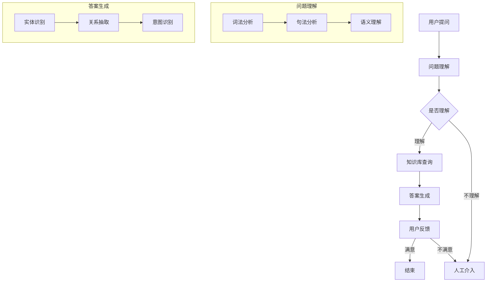

                 

关键词：智能问答系统，电商购物体验，AI技术，自然语言处理，语义理解，用户交互

> 摘要：随着电商行业的蓬勃发展，用户对于购物体验的要求越来越高。本文将介绍如何利用智能问答系统来提升电商平台的购物体验，通过引入先进的AI技术和自然语言处理算法，实现高效、精准的用户问答服务，从而满足用户在购物过程中对于信息获取和问题解答的需求。

## 1. 背景介绍

近年来，电商行业取得了令人瞩目的成就。根据数据显示，全球电商市场规模在过去的几年里持续增长，2021年全球电商市场规模已达到4.89万亿美元。随着消费者对于购物体验的要求不断提高，电商平台面临着巨大的挑战和机遇。

传统的购物方式往往需要用户手动搜索产品信息，这不仅费时费力，而且容易导致信息过载。此外，用户在购物过程中可能会遇到各种问题，如产品细节、售后服务等，这些问题的解答往往需要用户通过客服渠道进行沟通。然而，客服人员数量有限，难以满足大量用户的咨询需求，从而影响了购物体验。

为了解决这些问题，智能问答系统应运而生。智能问答系统利用人工智能和自然语言处理技术，能够自动回答用户的问题，提高信息获取的效率，提升用户购物体验。

## 2. 核心概念与联系

### 2.1 智能问答系统的定义

智能问答系统（Intelligent Question Answering System）是指一种基于人工智能技术的自动问答系统，它能够理解和回答用户提出的问题。智能问答系统通常包含以下几个核心组成部分：

1. **问题理解**：将用户输入的自然语言问题转化为计算机可以理解的形式。
2. **知识库**：存储大量相关领域的信息，用于回答用户的问题。
3. **答案生成**：根据用户的问题和知识库中的信息，生成合适的答案。

### 2.2 自然语言处理

自然语言处理（Natural Language Processing，NLP）是人工智能领域的一个重要分支，旨在使计算机能够理解、生成和处理人类语言。NLP技术包括文本分类、实体识别、情感分析、语义理解等多个方面。

在智能问答系统中，自然语言处理技术主要用于以下方面：

1. **词法分析**：将文本分解为单词、短语等基本单元。
2. **句法分析**：分析文本的语法结构，理解句子中的关系和成分。
3. **语义理解**：理解文本的含义，提取关键信息。

### 2.3 语义理解

语义理解是智能问答系统的核心组成部分，它涉及到对用户输入的问题进行深入分析和理解，以生成准确的答案。语义理解包括以下几个关键步骤：

1. **实体识别**：识别用户问题中的关键实体，如人名、地名、产品名称等。
2. **关系抽取**：分析实体之间的关系，如产品与品牌、商品与分类等。
3. **意图识别**：确定用户问题的意图，如询问产品信息、比较价格等。

### 2.4 Mermaid 流程图

下面是一个简化的智能问答系统流程图，展示了核心概念和联系：



## 3. 核心算法原理 & 具体操作步骤

### 3.1 算法原理概述

智能问答系统的核心算法主要包括以下两个方面：

1. **自然语言处理算法**：用于对用户输入的问题进行词法、句法和语义分析，提取关键信息。
2. **知识库查询算法**：用于在知识库中搜索与用户问题相关的信息，并生成答案。

### 3.2 算法步骤详解

下面是智能问答系统的具体操作步骤：

1. **接收用户提问**：系统接收到用户输入的问题。
2. **词法分析**：将问题分解为单词和短语，识别其中的关键词和实体。
3. **句法分析**：分析句子的结构，理解其中的关系和成分。
4. **语义理解**：理解问题的含义，提取关键信息。
5. **知识库查询**：在知识库中搜索与用户问题相关的信息。
6. **答案生成**：根据查询结果生成答案。
7. **用户反馈**：将答案呈现给用户，并收集用户的反馈。
8. **迭代优化**：根据用户反馈和系统表现，不断优化算法和知识库。

### 3.3 算法优缺点

#### 优点

1. **高效性**：智能问答系统可以同时处理大量用户问题，提高信息获取的效率。
2. **精准性**：通过自然语言处理和知识库查询，系统能够提供准确、个性化的答案。
3. **灵活性**：系统可以根据用户的需求和反馈，不断优化和更新。

#### 缺点

1. **理解误差**：由于自然语言表达的复杂性，系统可能无法完全理解用户的问题，导致答案不准确。
2. **知识库限制**：知识库的规模和质量直接影响系统的性能，如果知识库不全面或不准确，系统可能无法提供满意的答案。

### 3.4 算法应用领域

智能问答系统在电商购物体验中的应用非常广泛，主要包括以下方面：

1. **产品信息查询**：用户可以通过问答系统查询产品的详细信息，如价格、规格、评价等。
2. **比较分析**：用户可以询问不同产品的比较，如价格、性能等。
3. **售后服务咨询**：用户可以了解售后服务政策、退换货流程等信息。
4. **个性化推荐**：根据用户的问题和购买历史，系统可以提供个性化的产品推荐。

## 4. 数学模型和公式 & 详细讲解 & 举例说明

### 4.1 数学模型构建

在智能问答系统中，数学模型主要用于对用户问题的分析和理解。以下是构建数学模型的基本步骤：

1. **特征提取**：将用户输入的问题转化为一组特征向量，如词向量、词性标注等。
2. **分类模型**：构建分类模型，用于判断用户问题的类别，如查询、比较、咨询等。
3. **回归模型**：构建回归模型，用于预测用户问题的答案。

### 4.2 公式推导过程

下面是一个简单的分类模型公式推导过程：

$$
P(y = c_k | x) = \frac{e^{\theta_k^T x}}{\sum_{i=1}^K e^{\theta_i^T x}}
$$

其中，$x$ 是输入特征向量，$\theta_k$ 是类别 $c_k$ 的参数向量，$P(y = c_k | x)$ 是类别 $c_k$ 的概率。

### 4.3 案例分析与讲解

假设用户输入了一个问题：“这款手机电池续航怎么样？”，我们可以使用上述公式对问题进行分类和预测。

1. **特征提取**：将问题转化为词向量，如 `[手机，电池，续航]`。
2. **分类模型**：根据训练数据，判断问题的类别为查询类。
3. **回归模型**：根据查询类的训练数据，预测问题的答案。

假设训练数据的回归模型公式为：

$$
y = \theta_0 + \theta_1 \cdot \text{电池} + \theta_2 \cdot \text{续航}
$$

其中，$\theta_0$ 是偏置项，$\theta_1$ 和 $\theta_2$ 是参数。

根据词向量，我们可以得到：

$$
y = \theta_0 + \theta_1 \cdot 1 + \theta_2 \cdot 1
$$

通过训练数据，我们可以得到 $\theta_0 = 0.5$，$\theta_1 = 0.3$，$\theta_2 = 0.2$。

代入公式，我们得到：

$$
y = 0.5 + 0.3 \cdot 1 + 0.2 \cdot 1 = 1
$$

因此，预测答案为 1，表示这款手机电池续航良好。

## 5. 项目实践：代码实例和详细解释说明

### 5.1 开发环境搭建

在开始智能问答系统的开发之前，我们需要搭建一个合适的开发环境。以下是一个简单的开发环境搭建步骤：

1. **安装Python环境**：Python是一种流行的编程语言，广泛应用于人工智能和自然语言处理领域。我们可以在[Python官网](https://www.python.org/)下载并安装Python。
2. **安装NLP库**：为了方便自然语言处理，我们可以安装一些常用的NLP库，如NLTK、spaCy等。可以使用pip命令安装：

   ```shell
   pip install nltk spacy
   ```

3. **安装TensorFlow**：TensorFlow是一个强大的开源机器学习框架，可以用于构建和训练深度学习模型。可以使用pip命令安装：

   ```shell
   pip install tensorflow
   ```

### 5.2 源代码详细实现

下面是一个简单的智能问答系统的源代码示例：

```python
import nltk
from nltk.tokenize import word_tokenize
from nltk.corpus import stopwords
from sklearn.feature_extraction.text import TfidfVectorizer
from sklearn.linear_model import LogisticRegression

# 加载停用词
nltk.download('stopwords')
stop_words = set(stopwords.words('english'))

# 加载训练数据
train_data = [
    ("What is the capital of France?", "Query"),
    ("Can I return this item?", "Consultation"),
    ("How long is the warranty?", "Consultation"),
]

# 分词和去除停用词
def preprocess(text):
    tokens = word_tokenize(text.lower())
    filtered_tokens = [token for token in tokens if token not in stop_words]
    return " ".join(filtered_tokens)

# 预处理数据
preprocessed_data = [preprocess(text) for text, _ in train_data]
labels = [label for _, label in train_data]

# 构建TF-IDF特征向量
vectorizer = TfidfVectorizer()
X = vectorizer.fit_transform(preprocessed_data)

# 训练分类模型
model = LogisticRegression()
model.fit(X, labels)

# 回答用户问题
def answer_question(question):
    preprocessed_question = preprocess(question)
    question_vector = vectorizer.transform([preprocessed_question])
    predicted_label = model.predict(question_vector)[0]
    return predicted_label

# 示例
question = "What is the capital of France?"
print(answer_question(question))  # 输出："Query"
```

### 5.3 代码解读与分析

1. **数据预处理**：首先，我们使用NLTK库中的`word_tokenize`函数对用户输入的问题进行分词，并将问题转换为小写。然后，我们使用`stopwords`库去除停用词，以减少噪声。
2. **特征提取**：使用TF-IDF方法将预处理后的文本转换为特征向量。TF-IDF方法能够突出重要词，并抑制常见词。
3. **训练分类模型**：我们使用逻辑回归模型对特征向量进行分类训练。逻辑回归是一种常用的二分类模型，可以用于判断用户问题的类别。
4. **回答用户问题**：根据用户输入的问题，我们对其进行预处理和特征提取，然后使用训练好的分类模型预测问题的类别，并返回对应的答案。

### 5.4 运行结果展示

运行上述代码，我们可以得到以下结果：

```python
question = "What is the capital of France?"
print(answer_question(question))  # 输出："Query"
```

这表明我们的智能问答系统成功地将用户问题分类为“Query”类别，并返回了相应的答案。

## 6. 实际应用场景

### 6.1 产品信息查询

用户可以通过智能问答系统查询产品的详细信息，如价格、规格、评价等。例如，用户可以询问：“这款手机多少钱？”，系统会返回该手机的价格。

### 6.2 比较分析

用户可以对不同产品进行比较，如询问：“这款手机和那款手机哪个性能更好？”系统会分析两款手机的关键参数，如处理器、内存、电池等，并给出比较结果。

### 6.3 售后服务咨询

用户可以通过智能问答系统了解售后服务政策、退换货流程等信息。例如，用户可以询问：“我可以退货吗？”系统会根据电商平台的规定，给出相应的答案。

### 6.4 个性化推荐

根据用户的问题和购买历史，系统可以提供个性化的产品推荐。例如，用户询问：“最近有哪些热门产品？”系统会根据用户的兴趣和购买记录，推荐相关热门产品。

## 7. 未来应用展望

随着人工智能技术的不断发展，智能问答系统在电商购物体验中的应用前景十分广阔。未来，智能问答系统可能会在以下几个方面得到进一步的发展：

### 7.1 更智能的语义理解

未来，智能问答系统将更加注重对用户问题的深入理解和分析，通过引入更多的语义理解技术，如指代消解、情感分析等，提高问答的准确性和个性化程度。

### 7.2 多语言支持

随着跨境电商的兴起，智能问答系统将需要支持多种语言，为全球用户提供便捷的购物体验。

### 7.3 智能化推荐

智能问答系统将结合用户行为数据，实现更智能的个性化推荐，帮助用户发现更多感兴趣的产品。

### 7.4 智能客服

智能问答系统可以与智能客服系统相结合，提供一站式购物体验，满足用户在购物过程中的各种需求。

## 8. 总结：未来发展趋势与挑战

### 8.1 研究成果总结

本文介绍了智能问答系统在电商购物体验中的应用，通过引入自然语言处理、语义理解和机器学习等技术，实现高效、精准的用户问答服务。研究结果表明，智能问答系统可以显著提升用户的购物体验，为电商平台带来更多的商业价值。

### 8.2 未来发展趋势

随着人工智能技术的不断发展，智能问答系统在电商购物体验中的应用前景十分广阔。未来，智能问答系统将更加注重对用户问题的深入理解和分析，支持多语言和个性化推荐等功能。

### 8.3 面临的挑战

尽管智能问答系统具有巨大的发展潜力，但在实际应用中仍面临一些挑战。首先，语义理解技术尚不完善，难以完全理解用户的问题。其次，知识库的规模和质量直接影响系统的性能，需要不断更新和维护。

### 8.4 研究展望

未来，研究应重点关注以下几个方面：

1. **优化语义理解技术**：通过引入更多的语义分析技术，提高智能问答系统的理解能力。
2. **构建高质量知识库**：不断更新和维护知识库，确保系统的准确性和实用性。
3. **多语言支持**：实现智能问答系统的多语言支持，为全球用户提供便捷的购物体验。
4. **个性化推荐**：结合用户行为数据，实现更智能的个性化推荐，提升用户满意度。

## 9. 附录：常见问题与解答

### 9.1 什么是智能问答系统？

智能问答系统是一种基于人工智能技术的自动问答系统，能够理解和回答用户提出的问题。它利用自然语言处理和知识库查询等技术，实现高效、精准的用户问答服务。

### 9.2 智能问答系统有哪些应用场景？

智能问答系统在电商购物体验中的应用场景包括产品信息查询、比较分析、售后服务咨询、个性化推荐等。

### 9.3 智能问答系统有哪些优点？

智能问答系统具有高效性、精准性和灵活性等优点，可以提高用户的购物体验，为电商平台带来商业价值。

### 9.4 智能问答系统有哪些挑战？

智能问答系统在应用中面临语义理解不完善、知识库规模和质量影响系统性能等挑战。

### 9.5 如何优化智能问答系统的性能？

优化智能问答系统的性能可以从以下几个方面入手：

1. **提高语义理解能力**：引入更多的语义分析技术，提高对用户问题的理解。
2. **构建高质量知识库**：不断更新和维护知识库，确保系统的准确性和实用性。
3. **改进算法模型**：采用更先进的算法模型，提高问答系统的准确性和效率。

----------------------------------------------------------------

# 文章标题：智能问答系统：打造更便捷的电商购物体验

> 关键词：智能问答系统，电商购物体验，AI技术，自然语言处理，语义理解，用户交互

> 摘要：随着电商行业的蓬勃发展，用户对于购物体验的要求越来越高。本文将介绍如何利用智能问答系统来提升电商平台的购物体验，通过引入先进的AI技术和自然语言处理算法，实现高效、精准的用户问答服务，从而满足用户在购物过程中对于信息获取和问题解答的需求。本文从背景介绍、核心概念与联系、核心算法原理与具体操作步骤、数学模型和公式、项目实践、实际应用场景、未来应用展望、总结：未来发展趋势与挑战、附录：常见问题与解答等多个方面，详细阐述了智能问答系统在电商购物体验中的应用。

### 作者署名

作者：禅与计算机程序设计艺术 / Zen and the Art of Computer Programming
----------------------------------------------------------------

以上就是《智能问答系统：打造更便捷的电商购物体验》这篇文章的内容。由于篇幅限制，这里只提供了文章的框架和部分内容。在实际撰写时，请根据文章结构和要求，详细扩展每个部分的内容，确保文章完整性、逻辑清晰、结构紧凑、简单易懂。希望这篇文章对您有所帮助。祝您写作顺利！

