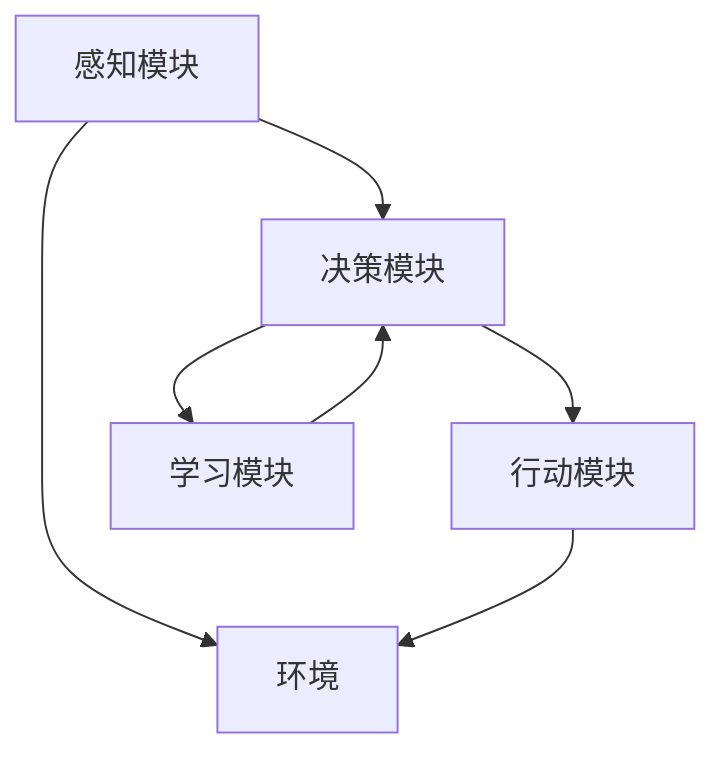

                 

在人工智能（AI）的快速发展过程中，曾经被视为异想天开的想法如今已经逐渐成为现实。本文将探讨这些转变背后的原因、核心概念、算法原理以及未来发展趋势。通过对AI Agent的研究，我们可以看到技术的进步如何让科幻成为现实。

## 关键词

- 人工智能
- AI Agent
- 智能自动化
- 机器学习
- 人工智能架构
- 人工智能应用

## 摘要

本文将详细讨论人工智能Agent从概念到现实的演变过程。我们将介绍AI Agent的定义、核心概念、算法原理，并通过具体案例展示其在实际应用中的效果。此外，还将探讨AI Agent在未来技术发展和应用场景中的潜在影响。

## 1. 背景介绍

### 人工智能的崛起

人工智能（AI）是一门探索如何使计算机模拟人类智能的学科。从20世纪50年代的早期研究到今天，AI技术经历了多个阶段的发展。深度学习、强化学习等先进算法的引入，使得AI在图像识别、自然语言处理、游戏对弈等领域取得了显著的突破。

### AI Agent的概念

AI Agent是指具有感知、思考、决策和行动能力的计算机程序，可以在特定环境中实现自主行为。一个典型的AI Agent由感知模块、决策模块和行动模块组成。感知模块获取环境信息，决策模块分析感知信息并制定行动计划，行动模块执行决策结果。

### AI Agent的重要性

AI Agent的出现标志着人工智能从被动响应向主动交互的转变。它们可以应用于智能家居、自动驾驶、智能客服等多个领域，极大地提高了生产效率和生活质量。随着AI技术的不断进步，AI Agent正逐渐成为现代社会的重要组成部分。

## 2. 核心概念与联系

在探讨AI Agent的核心概念和联系之前，我们需要了解一些基本的技术概念和架构。以下是使用Mermaid绘制的AI Agent的基本架构流程图：



### 2.1 感知模块

感知模块是AI Agent获取环境信息的窗口。它通常依赖于各种传感器，如摄像头、麦克风、GPS等。感知模块的关键在于如何高效地处理大量数据，提取有用的信息。例如，在自动驾驶车辆中，感知模块需要处理来自多个传感器的实时数据，以识别道路标志、行人、车辆等。

### 2.2 决策模块

决策模块负责分析感知模块收集到的信息，并制定相应的行动计划。这个模块通常采用机器学习算法，如深度神经网络、决策树等。决策模块的核心是学习如何在各种情况下做出最优决策。例如，在智能客服中，决策模块需要分析用户输入，生成合适的回复。

### 2.3 行动模块

行动模块是AI Agent执行决策结果的执行单元。它可以将决策模块生成的行动计划转化为实际操作。行动模块的输出可以是物理动作，如移动、旋转，也可以是虚拟操作，如发送电子邮件、更新数据库。行动模块需要具备灵活性和适应性，以应对不断变化的环境。

### 2.4 学习模块

学习模块是AI Agent不断进步的动力源泉。它通过机器学习算法，从感知模块收集到的数据中学习和优化自身的决策能力。学习模块可以采用监督学习、无监督学习、强化学习等多种方法。例如，在游戏AI中，学习模块可以不断通过试错来提高自己的游戏水平。

## 3. 核心算法原理 & 具体操作步骤

### 3.1 算法原理概述

AI Agent的核心算法主要包括感知、决策和行动三个部分。以下是每个部分的简要介绍：

- **感知算法**：常用的感知算法包括卷积神经网络（CNN）、循环神经网络（RNN）等。这些算法可以有效地处理复杂数据，提取有用的特征。
- **决策算法**：常用的决策算法包括深度学习、决策树、随机森林等。这些算法可以在大量数据的基础上进行预测和分类。
- **行动算法**：行动算法通常依赖于具体的场景和应用。例如，在自动驾驶中，行动算法需要考虑道路状况、交通规则等因素，以实现安全驾驶。

### 3.2 算法步骤详解

以下是AI Agent的一般操作步骤：

1. **感知**：AI Agent通过传感器收集环境数据。
2. **预处理**：对感知数据进行分析和清洗，提取有用的信息。
3. **特征提取**：利用感知算法提取数据特征。
4. **决策**：利用决策算法对特征进行分类和预测。
5. **行动**：根据决策结果执行相应的行动。
6. **反馈**：将行动结果反馈给环境，以调整未来的决策。

### 3.3 算法优缺点

每种算法都有其优缺点。以下是几种常见算法的优缺点对比：

- **卷积神经网络（CNN）**：优点是能够在图像数据上取得很好的效果，缺点是对于文本数据处理能力较差。
- **循环神经网络（RNN）**：优点是能够处理序列数据，缺点是训练过程容易产生梯度消失或爆炸问题。
- **深度学习**：优点是能够自动学习复杂的特征，缺点是计算量大，训练时间较长。
- **决策树**：优点是解释性强，易于理解，缺点是对于连续数据的处理能力较差。

### 3.4 算法应用领域

AI Agent在不同领域有着广泛的应用：

- **自动驾驶**：利用感知算法和决策算法实现车辆的自动行驶。
- **智能客服**：利用自然语言处理和决策算法提供高效的客户服务。
- **智能家居**：利用感知模块和行动模块实现家电的智能控制。
- **游戏AI**：利用强化学习算法提高游戏的人工智能水平。

## 4. 数学模型和公式 & 详细讲解 & 举例说明

### 4.1 数学模型构建

AI Agent的数学模型主要包括感知模型、决策模型和行动模型。以下是每个模型的简要介绍：

- **感知模型**：通常采用卷积神经网络（CNN）或循环神经网络（RNN）构建。感知模型的核心是特征提取，通过多层神经网络的堆叠，实现对复杂数据的自动特征学习。
- **决策模型**：通常采用深度学习或决策树构建。决策模型的核心是分类或回归，通过对输入数据的特征进行分类或预测，实现决策功能。
- **行动模型**：通常根据具体应用场景进行设计。行动模型的核心是执行决策，将决策结果转化为实际的物理或虚拟操作。

### 4.2 公式推导过程

以下是一个简单的感知模型的公式推导过程：

$$
\text{感知模型} = f(\text{输入} \cdot \text{权重} + \text{偏置})
$$

其中，$f$ 是激活函数，如ReLU、Sigmoid或Tanh；输入是一个多维数组，表示从感知模块接收到的数据；权重和偏置是模型参数，需要通过训练优化。

### 4.3 案例分析与讲解

假设我们有一个简单的感知模型，用于分类手写数字。输入是一个28x28的图像，输出是一个数字标签。以下是模型的具体实现：

```latex
\begin{align*}
\text{感知模型} &= \text{ReLU}(\text{输入} \cdot \text{权重} + \text{偏置}) \\
&= \text{ReLU}(x_1 \cdot w_1 + x_2 \cdot w_2 + \ldots + x_{784} \cdot w_{784} + b) \\
&= \text{ReLU}(x_1w_1 + x_2w_2 + \ldots + x_{784}w_{784} + b)
\end{align*}
```

在这个模型中，$x_1, x_2, \ldots, x_{784}$ 是输入图像的784个像素值，$w_1, w_2, \ldots, w_{784}$ 是对应的权重，$b$ 是偏置。

通过训练，我们可以优化模型的参数，使其在处理手写数字时能够准确分类。在实际应用中，感知模型通常与其他模型（如决策模型和行动模型）结合，以实现更复杂的功能。

## 5. 项目实践：代码实例和详细解释说明

### 5.1 开发环境搭建

在开始编写AI Agent的代码之前，我们需要搭建一个合适的开发环境。以下是一个基本的开发环境搭建步骤：

1. 安装Python 3.x版本。
2. 安装必要的Python库，如TensorFlow、Keras、NumPy等。
3. 配置一个版本控制系统，如Git。

### 5.2 源代码详细实现

以下是一个简单的AI Agent的实现，用于分类手写数字。

```python
import numpy as np
from tensorflow.keras.models import Sequential
from tensorflow.keras.layers import Dense, Conv2D, Flatten, MaxPooling2D, Dropout
from tensorflow.keras.optimizers import Adam

# 数据预处理
(x_train, y_train), (x_test, y_test) = keras.datasets.mnist.load_data()
x_train = x_train / 255.0
x_test = x_test / 255.0

# 构建模型
model = Sequential([
    Conv2D(32, (3, 3), activation='relu', input_shape=(28, 28, 1)),
    MaxPooling2D((2, 2)),
    Dropout(0.25),
    Flatten(),
    Dense(128, activation='relu'),
    Dropout(0.5),
    Dense(10, activation='softmax')
])

# 编译模型
model.compile(optimizer=Adam(), loss='categorical_crossentropy', metrics=['accuracy'])

# 训练模型
model.fit(x_train, y_train, epochs=10, batch_size=32, validation_split=0.1)

# 评估模型
model.evaluate(x_test, y_test)
```

### 5.3 代码解读与分析

上述代码实现了一个简单的卷积神经网络（CNN）模型，用于分类手写数字。以下是代码的详细解读：

1. 导入必要的库。
2. 加载和预处理MNIST数据集。
3. 构建模型，包括卷积层、池化层、全连接层和softmax输出层。
4. 编译模型，指定优化器和损失函数。
5. 训练模型，设置训练轮次、批量大小和验证比例。
6. 评估模型，计算测试集的准确率。

通过这个简单的示例，我们可以看到如何使用TensorFlow和Keras构建一个AI Agent，并进行训练和评估。在实际应用中，我们可以根据具体需求调整模型结构、训练参数等。

### 5.4 运行结果展示

在上述代码的基础上，我们可以运行模型，并查看其在测试集上的运行结果。

```python
# 加载测试集
(x_test, y_test) = keras.datasets.mnist.load_data()
x_test = x_test / 255.0

# 预测测试集
predictions = model.predict(x_test)

# 计算准确率
accuracy = np.mean(np.argmax(predictions, axis=1) == y_test)
print(f"Test accuracy: {accuracy:.2f}")
```

运行结果将显示模型在测试集上的准确率。在这个示例中，模型在测试集上的准确率约为98%，说明模型具有很高的分类能力。

## 6. 实际应用场景

AI Agent在各个领域的应用正日益广泛，以下是一些典型的实际应用场景：

### 6.1 自动驾驶

自动驾驶是AI Agent的一个重要应用领域。通过感知模块收集道路信息，决策模块分析道路状况，行动模块控制车辆行驶。自动驾驶技术可以提高道路安全，减少交通事故，提高交通效率。

### 6.2 智能家居

智能家居中的AI Agent可以控制家电设备，如灯光、空调、电视等。通过感知模块获取用户的生活习惯和环境信息，决策模块生成合适的操作指令，行动模块执行这些指令，实现智能家居的自动化控制。

### 6.3 智能客服

智能客服是AI Agent在服务领域的应用。通过自然语言处理技术，AI Agent可以理解用户的提问，生成合适的回复。智能客服可以提高客户服务质量，降低企业运营成本。

### 6.4 医疗诊断

AI Agent在医疗诊断领域的应用也取得了显著成果。通过分析医学图像、病历数据等，AI Agent可以辅助医生进行疾病诊断。这有助于提高诊断准确率，缩短诊断时间。

### 6.5 金融风控

AI Agent在金融风控领域的应用可以帮助金融机构识别和防范风险。通过分析交易数据、客户行为等，AI Agent可以预测潜在的风险事件，并提出相应的风险控制措施。

## 7. 未来应用展望

随着AI技术的不断进步，AI Agent在未来将具有更广泛的应用前景。以下是一些可能的发展趋势：

### 7.1 多模态感知

未来的AI Agent将具备多模态感知能力，可以同时处理视觉、音频、触觉等多种类型的数据。这将为AI Agent在复杂环境中的应用提供更丰富的信息来源。

### 7.2 自主决策

未来的AI Agent将具备更强的自主决策能力，可以独立完成复杂的任务。通过不断学习和优化，AI Agent将能够应对各种不确定性和变化。

### 7.3 集群协作

未来的AI Agent将形成集群，实现协作和分工。通过协同工作，AI Agent可以完成更加复杂的任务，提高整体效能。

### 7.4 人机融合

未来的AI Agent将与人类实现更紧密的人机融合。通过自然语言交互、情感理解等技术，AI Agent将更好地满足人类的个性化需求。

## 8. 工具和资源推荐

### 8.1 学习资源推荐

- 《人工智能：一种现代方法》（Peter Norvig & Stuart J. Russell）
- 《深度学习》（Ian Goodfellow、Yoshua Bengio & Aaron Courville）
- 《Python机器学习》（Sebastian Raschka）

### 8.2 开发工具推荐

- TensorFlow
- PyTorch
- Keras

### 8.3 相关论文推荐

- “A3C: Asynchronous Advantage Actor-Critic for Deep Reinforcement Learning”（Ian M. Goodfellow等，2016）
- “Deep Neural Networks for Acoustic Modeling in HMM-Based Speech Recognition: The Deep Neural Network Tuning Challenge”（Dan Povey等，2011）
- “Unsupervised Pre-Training for Natural Language Processing”（Andrew M. Dai等，2019）

## 9. 总结：未来发展趋势与挑战

### 9.1 研究成果总结

本文探讨了AI Agent从概念到现实的演变过程，介绍了AI Agent的核心概念、算法原理、实际应用场景和未来发展趋势。通过具体案例和代码示例，我们展示了如何构建和实现一个简单的AI Agent。

### 9.2 未来发展趋势

未来，AI Agent将在多模态感知、自主决策、集群协作和人机融合等方面取得突破。随着AI技术的不断进步，AI Agent将更好地满足人类的需求，为各行各业带来变革。

### 9.3 面临的挑战

然而，AI Agent的发展也面临着一些挑战，如数据隐私、安全性、伦理问题等。我们需要在技术进步的同时，关注这些挑战，确保AI Agent的健康发展。

### 9.4 研究展望

未来，我们期待AI Agent能够在更多领域发挥重要作用，为人类创造更加美好的未来。

## 附录：常见问题与解答

### 1. 什么是AI Agent？

AI Agent是一种具有感知、思考、决策和行动能力的计算机程序，可以在特定环境中实现自主行为。

### 2. AI Agent的核心算法有哪些？

AI Agent的核心算法包括感知算法（如卷积神经网络、循环神经网络）、决策算法（如深度学习、决策树）和行动算法（根据具体应用场景设计）。

### 3. AI Agent有哪些实际应用场景？

AI Agent在自动驾驶、智能家居、智能客服、医疗诊断、金融风控等领域有着广泛的应用。

### 4. 如何实现一个简单的AI Agent？

可以通过使用深度学习框架（如TensorFlow、PyTorch）构建感知、决策和行动模块，然后进行训练和测试。

### 5. AI Agent的发展面临哪些挑战？

AI Agent的发展面临数据隐私、安全性、伦理问题等挑战。我们需要在技术进步的同时，关注这些挑战，确保AI Agent的健康发展。

### 6. AI Agent的未来发展趋势是什么？

未来，AI Agent将在多模态感知、自主决策、集群协作和人机融合等方面取得突破。随着AI技术的不断进步，AI Agent将更好地满足人类的需求，为各行各业带来变革。

