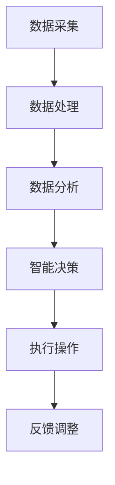
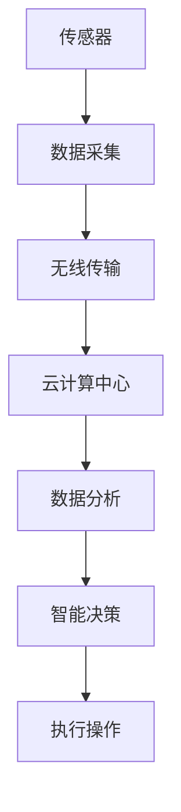

                 

关键词：智慧农业、精准种植、自动化养殖、2050年、未来趋势、技术发展、AI应用、物联网

> 摘要：随着科技的不断进步，智慧农业正逐步改变着传统的种植与养殖模式。本文将探讨2050年智慧农业的愿景，包括精准种植和自动化养殖的核心技术、应用场景及其对未来农业发展的深远影响。

## 1. 背景介绍

### 1.1 智慧农业的定义与发展历程

智慧农业是指通过应用信息技术、物联网、大数据分析、人工智能等先进技术，实现农业生产过程智能化、管理科学化、服务网络化的一种新型农业发展模式。智慧农业的发展历程可以追溯到20世纪末，随着互联网技术的普及和信息处理能力的提升，智慧农业逐渐成为现代农业发展的重要方向。

### 1.2 精准种植与自动化养殖的概念

精准种植是基于土壤、气候、作物生长状况等数据，通过精准施肥、灌溉、病虫害防治等手段，实现作物高产高效。自动化养殖则是利用传感器、自动化控制系统等，实现养殖环境的智能监控和动物行为的自动化管理，从而提高养殖效率和质量。

## 2. 核心概念与联系

### 2.1 数据驱动与智能决策

智慧农业的核心在于数据驱动的智能决策。通过收集和分析土壤、气候、作物、动物等各方面的数据，为种植和养殖提供精准的指导。以下是一个使用Mermaid绘制的流程图，展示了数据驱动与智能决策的过程：



### 2.2 物联网在智慧农业中的应用

物联网技术是智慧农业实现数据采集和传输的关键。以下是一个物联网在智慧农业中的应用流程图：



## 3. 核心算法原理 & 具体操作步骤

### 3.1 算法原理概述

智慧农业中常用的算法包括数据挖掘、机器学习、深度学习等。这些算法可以用于预测作物生长趋势、病虫害发生、动物健康状况等，从而指导农业生产决策。

### 3.2 算法步骤详解

1. **数据收集**：通过各种传感器收集土壤、气候、作物、动物等数据。
2. **数据处理**：对收集到的数据进行清洗、整合，去除噪声和冗余信息。
3. **数据建模**：利用数据挖掘和机器学习算法构建预测模型。
4. **模型评估**：通过交叉验证等方法评估模型性能。
5. **模型部署**：将模型部署到云计算平台，供农业生产决策使用。

### 3.3 算法优缺点

- **优点**：提高农业生产效率，降低成本，减少环境污染。
- **缺点**：算法实现和部署成本较高，对数据质量要求较高。

### 3.4 算法应用领域

- **精准种植**：预测作物生长状况，优化种植策略。
- **自动化养殖**：监测动物健康状况，调整养殖环境。

## 4. 数学模型和公式 & 详细讲解 & 举例说明

### 4.1 数学模型构建

智慧农业中的数学模型主要包括预测模型、优化模型等。以下是一个简单的预测模型：

$$
y_t = \sum_{i=1}^{n} w_i x_{it} + \epsilon_t
$$

其中，$y_t$是预测值，$x_{it}$是输入特征，$w_i$是权重，$\epsilon_t$是误差项。

### 4.2 公式推导过程

以线性回归模型为例，推导过程如下：

$$
\min_{w} \sum_{i=1}^{n} (y_i - \sum_{j=1}^{n} w_j x_{ij})^2
$$

对$w$求导并令其等于0，得到：

$$
w = (X^T X)^{-1} X^T y
$$

其中，$X$是输入特征矩阵，$y$是目标值向量。

### 4.3 案例分析与讲解

以精准施肥为例，假设某作物的生长状况与土壤湿度、光照强度、温度等特征有关，构建线性回归模型预测作物产量。通过数据训练和模型评估，优化施肥策略，提高作物产量。

## 5. 项目实践：代码实例和详细解释说明

### 5.1 开发环境搭建

- 硬件环境：计算机、传感器等设备。
- 软件环境：Python、Matplotlib、Scikit-learn等。

### 5.2 源代码详细实现

```python
# 导入相关库
import numpy as np
import matplotlib.pyplot as plt
from sklearn.linear_model import LinearRegression

# 生成模拟数据
np.random.seed(0)
n_samples = 100
X = np.random.rand(n_samples, 3)  # 生成3个特征
y = 2 * X[:, 0] + 3 * X[:, 1] + 4 * X[:, 2] + np.random.randn(n_samples) * 0.1

# 构建线性回归模型
model = LinearRegression()
model.fit(X, y)

# 可视化模型结果
plt.scatter(X[:, 0], y, color='blue')
plt.plot(X[:, 0], model.predict(X)[:, 0], color='red')
plt.xlabel('Feature 1')
plt.ylabel('Target')
plt.show()
```

### 5.3 代码解读与分析

代码首先导入了必要的库，然后生成模拟数据，接着构建线性回归模型，并通过可视化展示了模型预测结果。

## 6. 实际应用场景

### 6.1 精准种植

以某农业公司为例，通过安装土壤湿度传感器、光照强度传感器、温度传感器等，实时监测作物生长环境，根据模型预测结果调整灌溉和施肥策略，提高作物产量。

### 6.2 自动化养殖

以某畜牧场为例，通过安装动物行为传感器、温度传感器、湿度传感器等，实时监控动物健康状况，调整养殖环境，提高养殖效率。

## 7. 未来应用展望

### 7.1 人工智能与农业深度融合

随着人工智能技术的不断发展，智慧农业将进一步与人工智能深度融合，实现更加智能化的种植和养殖。

### 7.2 跨界合作与资源共享

智慧农业的发展需要各方力量的合作，包括政府、企业、科研机构等。通过跨界合作和资源共享，共同推动智慧农业的发展。

## 8. 工具和资源推荐

### 8.1 学习资源推荐

- 《深度学习》（Goodfellow et al.）
- 《机器学习》（周志华）

### 8.2 开发工具推荐

- Python
- Jupyter Notebook
- TensorFlow
- PyTorch

### 8.3 相关论文推荐

- "Deep Learning for Smart Agriculture"
- "IoT-based Smart Farming: A Survey"

## 9. 总结：未来发展趋势与挑战

### 9.1 研究成果总结

智慧农业在精准种植和自动化养殖领域取得了显著成果，但仍面临许多挑战。

### 9.2 未来发展趋势

- 人工智能与农业的深度融合
- 跨界合作与资源共享

### 9.3 面临的挑战

- 数据质量与安全性
- 算法优化与成本控制
- 政策支持与产业生态

### 9.4 研究展望

未来智慧农业的发展将继续深入，为人类可持续发展做出更大贡献。

## 10. 附录：常见问题与解答

### 10.1 智慧农业的核心技术是什么？

智慧农业的核心技术包括物联网、大数据分析、人工智能、自动化控制等。

### 10.2 精准种植的具体应用场景有哪些？

精准种植可以应用于水稻、小麦、蔬菜等多种作物的种植，提高产量和品质。

### 10.3 自动化养殖的优势有哪些？

自动化养殖可以提高养殖效率，降低劳动成本，提高动物健康状况。

---

**作者：禅与计算机程序设计艺术 / Zen and the Art of Computer Programming**

