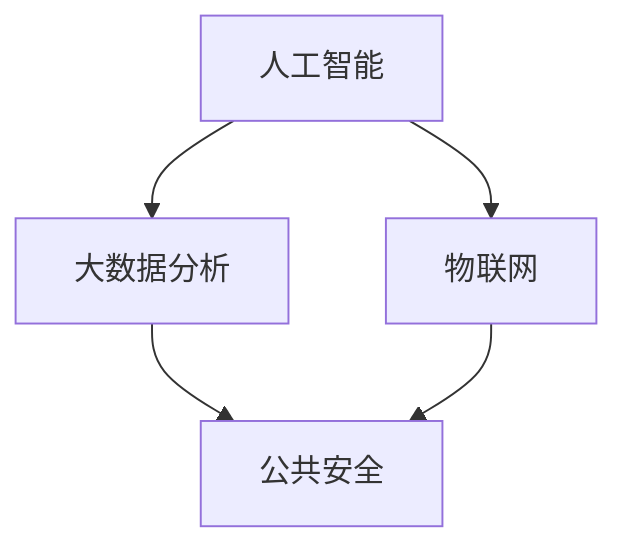

                 

关键词：智能安防、公共安全、隐私保护、人工智能、大数据分析、物联网

> 摘要：本文探讨了2050年智能安防系统的可能发展方向，分析了人工智能、大数据分析、物联网等技术在公共安全与隐私保护中的应用。通过对比现有技术，探讨了未来智能安防系统可能面临的挑战与机遇，并提出了一系列优化策略和展望。

## 1. 背景介绍

随着科技的不断进步，人工智能、大数据分析、物联网等新技术在各个领域得到了广泛应用。特别是在公共安全领域，智能安防系统的应用已经取得了显著成效。然而，随着技术的不断演进，未来的智能安防系统将面临更多的挑战和机遇。本文旨在探讨2050年智能安防系统的发展方向，重点关注公共安全与隐私保护的关系。

### 1.1 公共安全的重要性

公共安全是国家和社会稳定的基础，直接关系到人民群众的切身利益。随着城市化进程的加快和人口规模的不断扩大，公共安全面临的挑战日益严峻。传统的安防手段已经难以满足日益复杂的安全需求，迫切需要新的技术手段来提升公共安全水平。

### 1.2 隐私保护的必要性

在智能安防系统中，大量个人信息被收集、存储和处理。这些信息的泄露可能导致个人隐私受到侵犯，甚至引发严重的社会问题。因此，如何在保障公共安全的同时，有效保护个人隐私，成为智能安防系统发展的重要课题。

### 1.3 人工智能在智能安防中的应用

人工智能技术具有强大的数据分析和决策能力，在智能安防领域具有广泛的应用前景。通过人脸识别、行为识别、车辆识别等技术，人工智能可以实现对潜在威胁的实时监测和预警，提升公共安全水平。

## 2. 核心概念与联系

在构建未来的智能安防系统时，我们需要了解一些核心概念，并理解它们之间的联系。以下是几个关键概念及其相互关系：

### 2.1 人工智能

人工智能（AI）是一种模拟人类智能的技术，包括机器学习、深度学习、自然语言处理等子领域。人工智能技术在智能安防中主要用于数据分析和决策。

### 2.2 大数据分析

大数据分析是一种利用海量数据进行分析的技术，可以帮助我们更好地理解数据中的模式和趋势。在智能安防中，大数据分析可以用于预测潜在的安全事件。

### 2.3 物联网

物联网（IoT）是一种将物理设备和互联网相结合的技术，可以实现对设备的实时监控和管理。在智能安防中，物联网可以用于构建分布式监测网络。

### 2.4 公共安全与隐私保护

公共安全与隐私保护之间存在一定的矛盾。在保障公共安全的过程中，我们需要收集和处理大量的个人数据，但这也可能侵犯个人隐私。因此，如何在保障公共安全的同时保护个人隐私，是智能安防系统需要解决的重要问题。

### 2.5 Mermaid 流程图

以下是一个简单的Mermaid流程图，展示了智能安防系统的核心概念和它们之间的联系：



## 3. 核心算法原理 & 具体操作步骤

### 3.1 算法原理概述

智能安防系统中的核心算法主要包括人脸识别、行为识别和车辆识别。这些算法基于深度学习和计算机视觉技术，可以实现对图像和视频数据的实时分析和处理。

### 3.2 算法步骤详解

以人脸识别为例，其基本步骤如下：

1. 数据采集：通过摄像头或其他传感器收集人脸图像。
2. 数据预处理：对采集到的人脸图像进行降噪、对齐等预处理操作。
3. 特征提取：使用深度学习模型提取人脸特征。
4. 模型训练：使用大量人脸数据训练深度学习模型。
5. 预测与决策：将实时采集的人脸图像与训练好的模型进行匹配，判断是否为已知人员。

### 3.3 算法优缺点

人脸识别算法具有高准确性和实时性的优点，但在面对极端光照、遮挡等场景时，可能存在识别错误的风险。此外，人脸识别算法也面临隐私保护方面的挑战。

### 3.4 算法应用领域

人脸识别算法在智能安防中具有广泛的应用，如出入口管理、监控视频分析等。此外，行为识别和车辆识别算法也在智能安防领域得到广泛应用。

## 4. 数学模型和公式 & 详细讲解 & 举例说明

### 4.1 数学模型构建

在智能安防系统中，常用的数学模型包括概率模型和决策树模型。以下是一个简单的概率模型示例：

$$
P(A|B) = \frac{P(B|A)P(A)}{P(B)}
$$

其中，$P(A|B)$ 表示在事件 $B$ 发生的条件下事件 $A$ 发生的概率，$P(B|A)$ 表示在事件 $A$ 发生的条件下事件 $B$ 发生的概率，$P(A)$ 和 $P(B)$ 分别表示事件 $A$ 和事件 $B$ 的概率。

### 4.2 公式推导过程

概率模型的推导基于贝叶斯定理。贝叶斯定理描述了在已知某些条件下，某个事件发生的概率。以下是一个简单的推导过程：

假设有两个事件 $A$ 和 $B$，且它们之间相互独立。那么，我们有：

$$
P(A \cap B) = P(A)P(B)
$$

将上式两边同时除以 $P(B)$，得到：

$$
P(A|B) = \frac{P(A \cap B)}{P(B)} = \frac{P(A)P(B)}{P(B)} = P(A)
$$

同理，我们可以推导出：

$$
P(B|A) = \frac{P(A \cap B)}{P(A)} = \frac{P(A)P(B)}{P(A)} = P(B)
$$

综合上述推导，我们得到了贝叶斯定理：

$$
P(A|B) = \frac{P(B|A)P(A)}{P(B)}
$$

### 4.3 案例分析与讲解

假设我们有一个监控视频，其中包含了一个嫌疑人的人脸图像。我们想通过人脸识别算法判断该嫌疑人是否是已知犯罪嫌疑人。此时，我们可以使用概率模型来计算嫌疑人为犯罪嫌疑人的概率。

首先，我们需要收集大量已知的犯罪嫌疑人人脸图像，并使用深度学习模型提取人脸特征。然后，我们可以使用以下公式计算嫌疑人为犯罪嫌疑人的概率：

$$
P(\text{犯罪嫌疑人}|\text{人脸图像}) = \frac{P(\text{人脸图像}|\text{犯罪嫌疑人})P(\text{犯罪嫌疑人})}{P(\text{人脸图像})}
$$

其中，$P(\text{犯罪嫌疑人}|\text{人脸图像})$ 表示在已知人脸图像的条件下，嫌疑人为犯罪嫌疑人的概率；$P(\text{人脸图像}|\text{犯罪嫌疑人})$ 表示在已知嫌疑人为犯罪嫌疑人的条件下，出现该人脸图像的概率；$P(\text{犯罪嫌疑人})$ 表示犯罪嫌疑人的先验概率；$P(\text{人脸图像})$ 表示出现该人脸图像的总概率。

在实际应用中，我们可以通过大量数据训练深度学习模型，并使用贝叶斯网络来计算上述概率。这样，我们就可以根据嫌疑人为犯罪嫌疑人的概率来判断其是否是犯罪嫌疑人。

## 5. 项目实践：代码实例和详细解释说明

### 5.1 开发环境搭建

为了实现智能安防系统中的算法，我们需要搭建一个合适的开发环境。以下是一个简单的开发环境搭建步骤：

1. 安装Python：下载并安装Python 3.x版本。
2. 安装深度学习框架：安装TensorFlow或PyTorch等深度学习框架。
3. 安装OpenCV：用于图像处理。

### 5.2 源代码详细实现

以下是一个简单的人脸识别算法的代码示例：

```python
import cv2
import tensorflow as tf

# 加载预训练的人脸识别模型
model = tf.keras.models.load_model('face_recognition_model.h5')

# 读取摄像头视频流
cap = cv2.VideoCapture(0)

while True:
    # 读取一帧视频
    ret, frame = cap.read()
    
    # 人脸检测
    face_cascade = cv2.CascadeClassifier('haarcascade_frontalface_default.xml')
    faces = face_cascade.detectMultiScale(frame, scaleFactor=1.1, minNeighbors=5, minSize=(30, 30))
    
    for (x, y, w, h) in faces:
        # 人脸识别
        face_region = frame[y:y+h, x:x+w]
        face_region = cv2.resize(face_region, (128, 128))
        face_embedding = model.predict(tf.expand_dims(face_region, axis=0))
        
        # 判断是否为已知人员
        # ...（此处省略代码）
    
    # 显示视频帧
    cv2.imshow('Video', frame)
    
    if cv2.waitKey(1) & 0xFF == ord('q'):
        break

# 释放摄像头资源
cap.release()
cv2.destroyAllWindows()
```

### 5.3 代码解读与分析

上述代码实现了一个人脸识别的基本流程：

1. 加载预训练的人脸识别模型。
2. 使用摄像头实时捕获视频帧。
3. 使用人脸检测器检测视频帧中的人脸区域。
4. 对每个检测到的人脸区域进行人脸识别。
5. 判断识别结果并显示视频帧。

### 5.4 运行结果展示

在运行上述代码时，摄像头会实时捕获视频帧，并在检测到人脸时显示人脸识别的结果。通过调整人脸检测器和识别模型的参数，我们可以优化识别的准确性和实时性。

## 6. 实际应用场景

### 6.1 智能社区

在智能社区中，智能安防系统可以实现对出入口、公共场所等区域的实时监控。通过人脸识别、行为识别等技术，可以实现对潜在威胁的实时监测和预警，提升社区安全水平。

### 6.2 智能交通

在智能交通领域，智能安防系统可以实现对车辆违章、交通事故等行为的实时监控和预警。通过车辆识别、行为识别等技术，可以提升交通安全管理水平。

### 6.3 智能工厂

在智能工厂中，智能安防系统可以实现对员工出入、设备运行状态的实时监控。通过人脸识别、行为识别等技术，可以提升生产安全管理水平。

### 6.4 未来应用展望

随着技术的不断进步，智能安防系统在未来将会有更多的应用场景。例如，通过物联网技术，我们可以实现对家庭、企业等场所的实时监控和预警；通过大数据分析，我们可以预测潜在的安全事件，并采取相应的预防措施。

## 7. 工具和资源推荐

### 7.1 学习资源推荐

- 《深度学习》（Ian Goodfellow、Yoshua Bengio、Aaron Courville 著）
- 《Python数据分析》（Wes McKinney 著）
- 《计算机视觉：算法与应用》（Richard Szeliski 著）

### 7.2 开发工具推荐

- TensorFlow：用于构建和训练深度学习模型。
- PyTorch：用于构建和训练深度学习模型。
- OpenCV：用于图像处理和计算机视觉。

### 7.3 相关论文推荐

- "Face Recognition: A Survey"（Varghese, S., & Sivanandam, S.）
- "Deep Learning for Image Recognition: A Brief Review"（R. S. Chellappa, A. K. K. Ali, and V. Laxminarayanan）
- "IoT Security: A Comprehensive Review"（A. Khan, M. A. Imran, and M. U. A.哈米德）

## 8. 总结：未来发展趋势与挑战

### 8.1 研究成果总结

随着人工智能、大数据分析、物联网等技术的不断发展，智能安防系统在公共安全与隐私保护方面取得了显著成果。人脸识别、行为识别、车辆识别等技术已经广泛应用于实际场景，为提升公共安全水平提供了有力支持。

### 8.2 未来发展趋势

未来，智能安防系统将继续向智能化、自动化、网络化方向发展。随着技术的进步，智能安防系统将更加高效、精准，同时也会面临更多的挑战。

### 8.3 面临的挑战

- 技术挑战：如何提高算法的准确性和实时性，降低错误率。
- 隐私保护：如何在保障公共安全的同时，有效保护个人隐私。
- 法律法规：如何制定合理的法律法规，规范智能安防系统的发展。

### 8.4 研究展望

未来，智能安防系统的研究将重点关注以下几个方面：

- 算法的优化与创新：提高算法的准确性和实时性，降低错误率。
- 隐私保护的机制：研究如何有效保护个人隐私，构建隐私保护机制。
- 法律法规的完善：制定合理的法律法规，规范智能安防系统的发展。

## 9. 附录：常见问题与解答

### 9.1 人工智能在智能安防中的应用有哪些？

人工智能在智能安防中的应用主要包括人脸识别、行为识别、车辆识别等。这些技术可以实现对潜在威胁的实时监测和预警，提升公共安全水平。

### 9.2 智能安防系统如何保护个人隐私？

智能安防系统可以通过以下措施来保护个人隐私：

- 数据加密：对采集到的个人数据进行加密存储。
- 数据匿名化：对个人数据进行匿名化处理，避免直接识别个人身份。
- 用户权限管理：对系统访问权限进行严格管理，防止数据泄露。
- 监管与法律约束：遵守相关法律法规，接受监管部门的监督。

### 9.3 智能安防系统的未来发展前景如何？

智能安防系统在未来将继续向智能化、自动化、网络化方向发展。随着技术的进步，智能安防系统将更加高效、精准，为公共安全提供有力支持。同时，智能安防系统也将面临更多的挑战，如隐私保护、算法优化等。

---

作者：禅与计算机程序设计艺术 / Zen and the Art of Computer Programming

