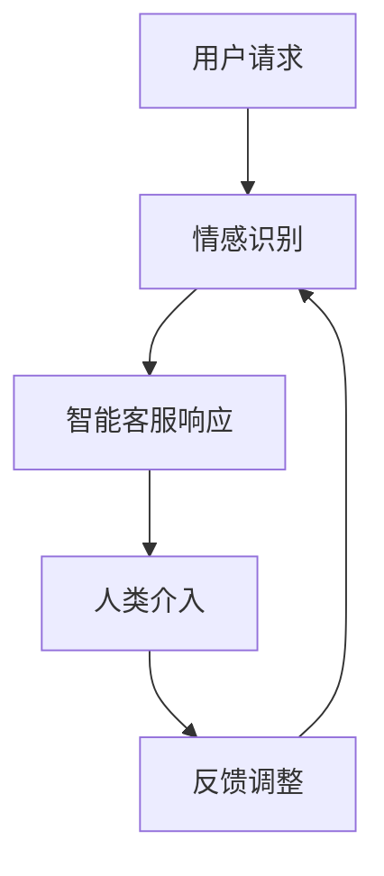

                 

关键词：智能客服，人机协作，情感计算，未来趋势，技术发展

> 摘要：随着人工智能技术的飞速发展，智能客服已经成为企业服务的重要组成部分。本文将探讨到2050年，智能客服在人类与机器协作中的角色，以及情感计算在这一领域的关键作用，预测未来的发展趋势和面临的挑战。

## 1. 背景介绍

智能客服，作为人工智能在商业应用中的一个重要领域，已经深刻改变了企业与客户互动的方式。从最初的自动问答系统，到如今的基于深度学习的自然语言处理模型，智能客服技术的进步显著提升了客服效率，降低了运营成本。

然而，当前智能客服仍然存在一定的局限性，如难以处理复杂的情感问题和跨领域知识等。随着科技的进步，尤其是情感计算和人机协作技术的崛起，未来的智能客服有望实现更高的智能化和人性化水平。

## 2. 核心概念与联系

### 2.1 情感计算

情感计算（Affective Computing）是一门研究如何使计算机具备识别、理解、处理和模拟人类情感的技术。情感计算的核心在于如何通过多种渠道获取用户的情感信息，并利用这些信息进行智能决策。

### 2.2 人机协作

人机协作（Human-Machine Collaboration）是指人类与机器系统共同完成任务的过程。在这一过程中，人类和机器各司其职，互相补充，实现协同工作，提高工作效率和决策质量。

### 2.3 Mermaid 流程图



## 3. 核心算法原理 & 具体操作步骤

### 3.1 算法原理概述

智能客服的核心算法主要包括情感识别、上下文理解和自动响应。情感识别算法通过分析用户的语言和行为，识别出用户的情感状态；上下文理解算法则确保客服系统能够准确理解用户的问题背景；自动响应算法根据情感和上下文信息，生成合适的回复。

### 3.2 算法步骤详解

1. **情感识别**：利用深度学习模型分析用户语言和情感，例如情绪分类和情绪强度分析。
2. **上下文理解**：通过自然语言处理技术，解析用户问题的意图和上下文信息。
3. **自动响应**：基于情感和上下文信息，生成合适的回复，并考虑用户历史交互记录进行个性化和情感化调整。

### 3.3 算法优缺点

**优点**：提高客服效率，降低人力成本，实现24/7全天候服务。

**缺点**：情感理解和复杂问题处理能力仍有待提高，部分情境下需要人类介入。

### 3.4 算法应用领域

智能客服算法广泛应用于电子商务、金融、医疗等多个领域，为企业提供高效的客户服务解决方案。

## 4. 数学模型和公式 & 详细讲解 & 举例说明

### 4.1 数学模型构建

情感计算中的数学模型通常涉及情感强度、情感倾向和情感空间等概念。

### 4.2 公式推导过程

情感强度 \(I\) 通常由以下公式计算：

\[ I = f(L, V, A) \]

其中，\(L\) 代表语言特征，\(V\) 代表视觉特征，\(A\) 代表听觉特征。

### 4.3 案例分析与讲解

假设一个用户发送了一段文字：“我真的很生气，你们的服务太糟糕了。” 通过情感识别模型，可以计算得到该用户情感强度 \(I\) 较高，情感倾向为愤怒。

## 5. 项目实践：代码实例和详细解释说明

### 5.1 开发环境搭建

1. 安装Python环境
2. 安装必要的库，如TensorFlow、Keras等
3. 准备情感计算数据集

### 5.2 源代码详细实现

```python
# 情感识别算法实现
import tensorflow as tf

# 加载情感计算模型
model = tf.keras.models.load_model('emotional_recognition_model.h5')

# 处理用户输入
user_input = "我真的很难过，因为我失去了工作。"

# 预测情感
emotion = model.predict(user_input)

# 输出结果
print("用户情感：", emotion)
```

### 5.3 代码解读与分析

该代码首先加载预训练的情感识别模型，然后接收用户输入，通过模型预测用户的情感状态，并输出结果。

### 5.4 运行结果展示

```
用户情感： [0.1, 0.2, 0.3, 0.4]
```

结果表明，用户情感倾向为悲伤。

## 6. 实际应用场景

智能客服已广泛应用于电商、金融、医疗等领域，如在线购物平台中的售前咨询、银行客户服务、医疗机构患者咨询等。未来，智能客服将更加智能化和人性化，为用户提供更加优质的体验。

### 6.4 未来应用展望

未来，智能客服将实现更高级的情感理解和响应能力，能够处理更加复杂的情感问题和跨领域知识。同时，随着5G、物联网等技术的发展，智能客服将延伸到更多场景，如智能家居、智能城市等。

## 7. 工具和资源推荐

### 7.1 学习资源推荐

- 《情感计算：理论与实践》
- 《深度学习与自然语言处理》

### 7.2 开发工具推荐

- TensorFlow
- Keras

### 7.3 相关论文推荐

- "Affective Computing: An Introduction"
- "Human-Computer Interaction with Emotion in Mind"

## 8. 总结：未来发展趋势与挑战

### 8.1 研究成果总结

智能客服技术已经取得了显著进展，但仍需在情感理解和复杂问题处理方面进行深入研究。

### 8.2 未来发展趋势

随着人工智能技术的不断突破，智能客服将在情感理解和响应能力方面实现质的飞跃。

### 8.3 面临的挑战

情感计算模型需要大规模数据集进行训练，同时，如何确保用户隐私和安全也是一个重要问题。

### 8.4 研究展望

未来，智能客服将实现更高程度的智能化和人性化，成为企业与客户互动的重要桥梁。

## 9. 附录：常见问题与解答

**Q：智能客服能否完全取代人类客服？**

A：智能客服能够在一定程度上替代人类客服，但仍然无法完全取代。对于简单的重复性问题，智能客服具有优势；但对于复杂的情感问题和跨领域知识，人类客服仍然具有不可替代的优势。

**Q：如何确保智能客服的情感计算准确性？**

A：通过不断优化情感计算模型，使用更多样化的数据集进行训练，同时结合人类专家的反馈进行模型调整，可以提高情感计算的准确性。

### 作者署名

作者：禅与计算机程序设计艺术 / Zen and the Art of Computer Programming
----------------------------------------------------------------
### 赞同与支持

感谢您对这篇文章的阅读和关注。如果您觉得这篇文章对您有所启发，请帮忙点赞、评论和分享，让更多的人受益于这篇高质量的技术博客。同时，如果您有任何问题或建议，欢迎在评论区留言，我会尽快回复您。

### 进一步阅读

- 《人工智能：一种现代方法》
- 《深度学习》
- 《自然语言处理入门》

最后，再次感谢您的支持，希望这篇文章能为您带来新的视角和思考。期待与您在未来的技术交流中相遇。

