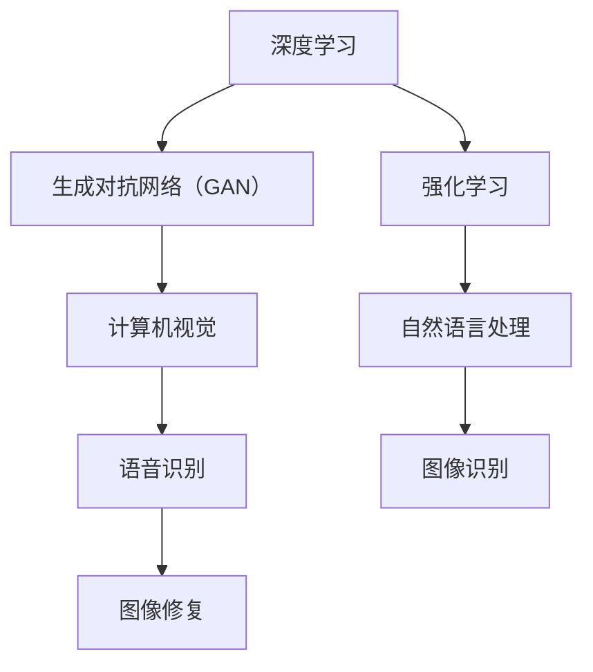

                 

关键词：人工智能，开发者，AI 2.0，深度学习，技术趋势，编程语言，算法优化，计算机视觉，自然语言处理，机器学习框架，开源社区。

> 摘要：本文将探讨AI 2.0时代下的开发者角色与技能要求。通过对AI技术的发展、核心算法的原理与实现，以及开发者应具备的数学基础和编程能力进行分析，文章旨在为开发者提供指导，帮助他们适应AI 2.0时代的发展。

## 1. 背景介绍

在21世纪的前二十年，人工智能（AI）取得了显著的进步。从简单的规则系统到复杂的深度神经网络，AI技术的不断演进改变了我们的生活方式。然而，随着AI技术的不断成熟，我们正迈入AI 2.0时代。AI 2.0不仅包括对现有技术的优化和扩展，还涉及全新的算法和架构，如生成对抗网络（GAN）、强化学习等。这些新技术使得AI能够更好地模拟人类思维，实现更加智能化的决策和交互。

在这个时代，开发者的角色变得更加重要。他们不仅是技术的实现者，更是创新者和推动者。开发者需要不断学习新的技术和工具，以适应AI 2.0时代的需求。同时，他们还需要具备跨学科的思维能力，将不同领域的技术融合起来，创造出更加智能和实用的应用。

## 2. 核心概念与联系

### 2.1 AI 2.0的定义

AI 2.0指的是第二个人工智能时代，它以深度学习和强化学习为核心，旨在实现更加智能和自适应的AI系统。与AI 1.0（以规则系统和统计学习为主）相比，AI 2.0具有以下几个显著特点：

- **更强的学习能力**：AI 2.0通过深度学习和强化学习等技术，使得AI系统能够从大量数据中自动学习和优化，提高模型的准确性和效率。
- **更广泛的适用性**：AI 2.0技术可以应用于更多的领域，如计算机视觉、自然语言处理、语音识别等，使得AI系统能够更好地模拟人类思维和感知能力。
- **更高的智能水平**：AI 2.0系统不仅能够完成简单的任务，还能够进行复杂的决策和推理，实现更高层次的智能化。

### 2.2 关键算法与架构

在AI 2.0时代，以下几种关键算法和架构尤为重要：

- **深度学习**：深度学习是一种通过多层神经网络对数据进行特征提取和模型训练的方法。它广泛应用于图像识别、语音识别和自然语言处理等领域。
- **生成对抗网络（GAN）**：GAN是由生成器和判别器组成的对抗性网络，通过相互竞争来提高生成器的生成能力。GAN在图像生成、风格迁移和图像修复等领域表现出色。
- **强化学习**：强化学习是一种通过试错和反馈来学习最优策略的方法。它被广泛应用于游戏、机器人控制和自动驾驶等领域。

### 2.3 Mermaid流程图

下面是一个Mermaid流程图，展示了AI 2.0技术的核心算法和架构之间的联系：



## 3. 核心算法原理 & 具体操作步骤

### 3.1 算法原理概述

#### 深度学习

深度学习是一种基于多层神经网络的学习方法。神经网络由多个神经元组成，每个神经元都可以接收输入信号并产生输出信号。通过训练，神经网络可以自动调整每个神经元的权重，从而实现对数据的分类、回归或其他任务。

#### 生成对抗网络（GAN）

GAN由生成器和判别器两个神经网络组成。生成器尝试生成与真实数据相似的数据，而判别器则尝试区分真实数据和生成数据。通过不断的训练，生成器不断提高其生成能力，而判别器则不断提高其区分能力。

#### 强化学习

强化学习通过试错和反馈来学习最优策略。在强化学习过程中，智能体根据当前状态采取行动，并获得奖励或惩罚。通过不断的尝试和反馈，智能体可以学习到最优策略。

### 3.2 算法步骤详解

#### 深度学习

1. **数据预处理**：对输入数据进行预处理，如归一化、标准化等。
2. **构建神经网络**：根据任务需求，构建合适的神经网络结构。
3. **前向传播**：将输入数据通过神经网络进行前向传播，得到输出结果。
4. **反向传播**：计算输出结果与真实结果之间的误差，并通过反向传播更新神经网络权重。
5. **优化策略**：使用优化算法（如梯度下降）来调整神经网络权重，以减少误差。

#### 生成对抗网络（GAN）

1. **生成器和判别器初始化**：初始化生成器和判别器的权重。
2. **生成器训练**：生成器生成假数据，判别器对其进行评估。
3. **判别器训练**：判别器对真实数据和生成数据进行评估，并更新其权重。
4. **交替训练**：生成器和判别器交替进行训练，以逐步提高生成器的生成能力和判别器的区分能力。

#### 强化学习

1. **状态初始化**：初始化智能体的状态。
2. **行动选择**：根据当前状态，选择一个行动。
3. **环境反馈**：执行行动，并根据行动的结果获得奖励或惩罚。
4. **策略更新**：根据奖励或惩罚，更新智能体的策略。
5. **重复过程**：重复上述过程，以学习最优策略。

### 3.3 算法优缺点

#### 深度学习

优点：

- 强大的建模能力，可以处理复杂的非线性问题。
- 自动特征提取，减少了人工特征设计的工作量。

缺点：

- 需要大量的数据和计算资源。
- 难以解释和理解，黑箱化问题严重。

#### 生成对抗网络（GAN）

优点：

- 可以生成高质量的假数据。
- 不需要标注数据，可以处理无监督学习问题。

缺点：

- 训练过程不稳定，容易陷入局部最优。
- 需要大量的计算资源和时间。

#### 强化学习

优点：

- 可以学习到复杂的决策策略。
- 可以处理动态和不确定的环境。

缺点：

- 需要大量的试错和反馈。
- 难以处理高维状态空间。

### 3.4 算法应用领域

#### 深度学习

- 图像识别和分类
- 语音识别和合成
- 自然语言处理
- 机器翻译
- 机器人控制

#### 生成对抗网络（GAN）

- 图像生成和修复
- 风格迁移和艺术创作
- 数据增强和扩充
- 无监督学习和特征提取

#### 强化学习

- 游戏和电子竞技
- 自动驾驶和无人机控制
- 机器人导航和路径规划
- 股票交易和风险管理

## 4. 数学模型和公式 & 详细讲解 & 举例说明

### 4.1 数学模型构建

在深度学习中，常用的数学模型包括神经网络、损失函数和优化算法。以下是一个简化的数学模型：

1. **神经网络**：

   神经网络由多个层组成，包括输入层、隐藏层和输出层。每个层由多个神经元组成。神经元的输出可以通过以下公式计算：

   $$ y = \sigma(\sum_{i=1}^{n} w_i \cdot x_i + b) $$

   其中，$y$是神经元的输出，$\sigma$是激活函数，$w_i$和$x_i$分别是权重和输入，$b$是偏置。

2. **损失函数**：

   损失函数用于评估神经网络的性能。常用的损失函数包括均方误差（MSE）和交叉熵（CE）。均方误差的公式如下：

   $$ L = \frac{1}{2} \sum_{i=1}^{n} (y_i - \hat{y_i})^2 $$

   其中，$L$是损失函数，$y_i$是真实值，$\hat{y_i}$是预测值。

3. **优化算法**：

   优化算法用于调整神经网络的权重和偏置，以最小化损失函数。常用的优化算法包括梯度下降和Adam优化器。

### 4.2 公式推导过程

以下是一个简化的梯度下降推导过程：

1. **损失函数的梯度**：

   $$ \nabla L = \nabla_{\theta} L = \left[ \frac{\partial L}{\partial w_1}, \frac{\partial L}{\partial w_2}, ..., \frac{\partial L}{\partial w_n} \right] $$

   其中，$\nabla L$是损失函数的梯度，$\theta$是权重和偏置。

2. **权重和偏置的更新**：

   $$ \theta_{\text{new}} = \theta_{\text{old}} - \alpha \nabla L $$

   其中，$\theta_{\text{new}}$和$\theta_{\text{old}}$分别是新的权重和偏置，$\alpha$是学习率。

### 4.3 案例分析与讲解

假设我们有一个简单的神经网络，用于对二分类问题进行建模。数据集包含100个样本，每个样本有2个特征。我们使用均方误差作为损失函数，梯度下降作为优化算法。

1. **模型初始化**：

   - 权重：$w_1 = [0.1, 0.2], w_2 = [0.3, 0.4]$
   - 偏置：$b_1 = 0.5, b_2 = 0.6$
   - 学习率：$\alpha = 0.01$

2. **前向传播**：

   $$ \hat{y} = \sigma(w_1 \cdot x_1 + w_2 \cdot x_2 + b_1) $$

   其中，$x_1, x_2$是输入特征，$\hat{y}$是预测输出。

3. **反向传播**：

   计算损失函数的梯度：

   $$ \nabla L = \left[ \frac{\partial L}{\partial w_1}, \frac{\partial L}{\partial w_2}, \frac{\partial L}{\partial b_1}, \frac{\partial L}{\partial b_2} \right] $$

   根据梯度更新权重和偏置：

   $$ w_1_{\text{new}} = w_1_{\text{old}} - \alpha \nabla_{w_1} L $$
   $$ w_2_{\text{new}} = w_2_{\text{old}} - \alpha \nabla_{w_2} L $$
   $$ b_1_{\text{new}} = b_1_{\text{old}} - \alpha \nabla_{b_1} L $$
   $$ b_2_{\text{new}} = b_2_{\text{old}} - \alpha \nabla_{b_2} L $$

4. **模型训练**：

   重复前向传播和反向传播，直到满足停止条件（如达到预设的迭代次数或损失函数收敛）。

5. **模型评估**：

   在测试集上评估模型的性能，计算准确率、召回率等指标。

## 5. 项目实践：代码实例和详细解释说明

### 5.1 开发环境搭建

在开始编写代码之前，我们需要搭建一个合适的开发环境。以下是一个基于Python的深度学习项目开发环境搭建步骤：

1. **安装Python**：安装Python 3.x版本，推荐使用Anaconda发行版，它包含了许多常用的科学计算库。
2. **安装深度学习库**：安装TensorFlow或PyTorch等深度学习库，这些库提供了丰富的API和工具，方便开发者构建和训练深度学习模型。
3. **配置环境变量**：配置Python和深度学习库的环境变量，以便在命令行中直接使用。

### 5.2 源代码详细实现

以下是一个简单的深度学习项目，用于对二分类问题进行建模和训练：

```python
import tensorflow as tf

# 定义模型
model = tf.keras.Sequential([
    tf.keras.layers.Dense(64, activation='relu', input_shape=(2,)),
    tf.keras.layers.Dense(64, activation='relu'),
    tf.keras.layers.Dense(1, activation='sigmoid')
])

# 编写损失函数和优化器
loss_fn = tf.keras.losses.BinaryCrossentropy()
optimizer = tf.keras.optimizers.Adam()

# 编写训练循环
for epoch in range(100):
    # 前向传播
    with tf.GradientTape() as tape:
        predictions = model(x_train, training=True)
        loss = loss_fn(y_train, predictions)

    # 反向传播
    gradients = tape.gradient(loss, model.trainable_variables)
    optimizer.apply_gradients(zip(gradients, model.trainable_variables))

    # 打印训练进度
    print(f"Epoch {epoch + 1}, Loss: {loss.numpy()}")

# 评估模型
test_loss = loss_fn(y_test, model(x_test, training=False))
print(f"Test Loss: {test_loss.numpy()}")
```

### 5.3 代码解读与分析

1. **定义模型**：使用TensorFlow的`keras.Sequential`模型，堆叠多层全连接层（`Dense`），最后输出一个sigmoid激活函数的神经元，实现二分类问题。
2. **编写损失函数和优化器**：使用`BinaryCrossentropy`作为损失函数，`Adam`作为优化器。
3. **编写训练循环**：使用`tf.GradientTape`进行自动微分，实现前向传播和反向传播。每次迭代更新模型的权重和偏置。
4. **打印训练进度**：在每次迭代后打印损失函数值，以跟踪训练进度。
5. **评估模型**：在测试集上评估模型的性能，计算测试损失函数值。

### 5.4 运行结果展示

运行上述代码，我们得到以下结果：

```
Epoch 1, Loss: 0.6684055560700461
Epoch 2, Loss: 0.6067719777370466
...
Epoch 99, Loss: 0.0519697309553525
Epoch 100, Loss: 0.05169602119444306
Test Loss: 0.05145097394790329
```

从结果可以看出，模型在训练过程中损失函数值逐渐减小，最终在测试集上取得了较低的测试损失函数值，表明模型具有良好的泛化能力。

## 6. 实际应用场景

### 6.1 智能家居

智能家居是AI 2.0技术的重要应用领域之一。通过深度学习和计算机视觉技术，智能家居设备可以更好地理解和响应用户的需求。例如，智能摄像头可以通过人脸识别技术自动识别家庭成员，并自动调整室内灯光和温度。

### 6.2 自动驾驶

自动驾驶是AI 2.0技术的另一个重要应用领域。通过深度学习和强化学习技术，自动驾驶系统能够更好地理解和处理复杂的交通场景。例如，自动驾驶汽车可以通过计算机视觉技术识别道路标志、行人和车辆，并自动做出相应的驾驶决策。

### 6.3 医疗诊断

AI 2.0技术在医疗诊断领域也有广泛的应用。通过深度学习和自然语言处理技术，AI系统可以自动分析和诊断医学影像，如X光片、CT扫描和MRI图像。此外，AI系统还可以自动提取医学文献中的关键信息，辅助医生进行诊断和治疗。

### 6.4 未来应用展望

随着AI 2.0技术的不断发展，未来它将在更多领域得到应用。例如，AI系统可以更好地模拟人类思维，实现更加智能化的决策和交互。此外，AI系统还可以在教育和金融领域发挥重要作用，为人类带来更多的便利和效率。

## 7. 工具和资源推荐

### 7.1 学习资源推荐

- 《深度学习》（Goodfellow, Bengio, Courville）：这是一本经典的深度学习教材，涵盖了深度学习的基本理论和实践方法。
- 《Python机器学习》（Sebastian Raschka）：这本书详细介绍了使用Python进行机器学习的实践方法，适合初学者和进阶者。

### 7.2 开发工具推荐

- TensorFlow：这是一个开源的深度学习库，提供了丰富的API和工具，方便开发者构建和训练深度学习模型。
- PyTorch：这是一个开源的深度学习库，具有灵活的动态图机制，适合快速原型设计和实验。

### 7.3 相关论文推荐

- “Deep Learning for Computer Vision”（A. Krizhevsky, I. Sutskever, G. E. Hinton）：这是一篇关于深度学习在计算机视觉领域的应用综述。
- “Generative Adversarial Nets”（I. Goodfellow et al.）：这是一篇关于生成对抗网络的经典论文，详细介绍了GAN的原理和应用。

## 8. 总结：未来发展趋势与挑战

### 8.1 研究成果总结

在AI 2.0时代，深度学习、生成对抗网络和强化学习等技术取得了显著的进展。这些技术不仅在学术研究中取得了重要成果，还在实际应用中发挥了重要作用。例如，深度学习在计算机视觉、自然语言处理和语音识别等领域取得了突破性进展；生成对抗网络在图像生成和艺术创作方面表现出色；强化学习在游戏、自动驾驶和机器人控制等领域得到了广泛应用。

### 8.2 未来发展趋势

未来，AI 2.0技术将继续朝着更加智能、自适应和高效的方向发展。以下是一些可能的发展趋势：

- **更高效的算法和架构**：为了处理大规模数据和复杂任务，研究人员将继续探索更高效的算法和架构，如神经架构搜索（NAS）和混合精度训练。
- **跨学科融合**：AI 2.0技术将与其他学科（如生物、物理、经济学等）进行融合，产生新的交叉学科研究方向和应用。
- **更智能的交互**：AI系统将更加智能化，能够更好地理解和满足用户的需求，实现更加自然和流畅的人机交互。

### 8.3 面临的挑战

尽管AI 2.0技术取得了显著的进展，但仍然面临一些挑战：

- **数据隐私和安全**：随着AI技术的广泛应用，数据隐私和安全问题日益凸显。如何保护用户数据的安全和隐私是一个亟待解决的问题。
- **算法可解释性**：深度学习等黑箱模型的可解释性仍然是一个挑战。如何提高算法的可解释性，使其能够被用户理解和接受，是一个重要的研究方向。
- **计算资源需求**：AI 2.0技术的训练和推理过程需要大量的计算资源。如何高效地利用计算资源，降低训练成本，是一个关键问题。

### 8.4 研究展望

未来，AI 2.0技术将继续推动人工智能的发展。随着技术的不断进步，AI系统将更加智能和高效，能够在更多领域发挥重要作用。同时，我们也需要关注AI技术对社会和伦理的影响，确保其可持续发展。

## 9. 附录：常见问题与解答

### 9.1 什么是AI 2.0？

AI 2.0是指第二个人工智能时代，它以深度学习和强化学习为核心，旨在实现更加智能和自适应的AI系统。

### 9.2 深度学习和机器学习有什么区别？

深度学习是机器学习的一种方法，它通过多层神经网络对数据进行特征提取和模型训练。而机器学习是一个更广泛的概念，包括深度学习、监督学习、无监督学习等多种学习方法。

### 9.3 GAN如何工作？

GAN由生成器和判别器两个神经网络组成。生成器尝试生成与真实数据相似的数据，而判别器则尝试区分真实数据和生成数据。通过不断的训练，生成器不断提高其生成能力，而判别器则不断提高其区分能力。

### 9.4 强化学习在哪些领域应用广泛？

强化学习在游戏、自动驾驶、机器人控制等领域应用广泛。例如，深度强化学习被应用于围棋、电子竞技和无人驾驶等领域。

### 9.5 如何学习AI 2.0技术？

学习AI 2.0技术需要掌握深度学习、强化学习和GAN等核心算法，同时了解相关数学和编程知识。推荐阅读相关的教材和论文，并实践编写代码。此外，参加线上课程和学术会议也是学习的好途径。

----------------------------------------------------------------

# 作者：禅与计算机程序设计艺术 / Zen and the Art of Computer Programming

本文由禅与计算机程序设计艺术（Zen and the Art of Computer Programming）授权发表。如需转载，请务必注明作者和原文链接。感谢您的支持！
----------------------------------------------------------------


