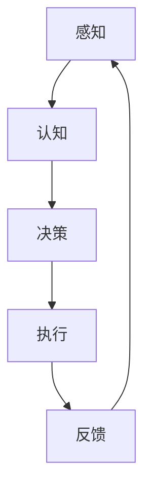

                 

关键词：人工智能，李开复，AI 2.0，科技价值，未来展望

摘要：本文将围绕李开复先生关于AI 2.0时代的科技价值进行深入探讨。通过对AI 2.0的定义、核心概念、算法原理、数学模型以及未来应用场景的分析，揭示人工智能在现代社会中的重要作用，并对未来发展趋势与挑战进行展望。

## 1. 背景介绍

人工智能（Artificial Intelligence，简称AI）作为计算机科学的一个重要分支，其发展历程可以追溯到20世纪50年代。早期的人工智能研究主要集中在符号主义和逻辑推理方面，但受限于计算能力和数据资源，这些方法在实际应用中遇到了许多困难。随着大数据、云计算、深度学习等技术的发展，人工智能迎来了新的发展机遇，进入了AI 2.0时代。

李开复先生，作为世界著名的人工智能专家，对AI 2.0时代的科技价值有着深刻的见解。他在《李开复：AI 2.0时代的 ±1》一书中，详细阐述了AI 2.0的核心概念、技术发展趋势以及对未来社会的影响。

## 2. 核心概念与联系

### 2.1 AI 2.0的定义

AI 2.0是指基于深度学习、神经网络等人工智能技术，实现更加智能、高效、通用的人工智能系统。与AI 1.0相比，AI 2.0具有更强的自主学习能力、更广泛的应用领域和更高的实用价值。

### 2.2 核心概念原理与架构

为了更清晰地理解AI 2.0的核心概念和架构，我们可以借助Mermaid流程图（以下为简化版本）：



在这个流程图中，感知、认知、决策、执行和反馈是AI 2.0系统中的五个核心环节。通过不断循环这个过程，人工智能系统可以不断提高自身的能力和智能水平。

## 3. 核心算法原理 & 具体操作步骤

### 3.1 算法原理概述

AI 2.0的核心算法主要包括深度学习、神经网络、强化学习等。其中，深度学习是当前人工智能领域最热门的技术之一。深度学习通过多层神经网络结构，对大量数据进行自动特征提取和模式识别，从而实现智能推理和决策。

### 3.2 算法步骤详解

1. 数据预处理：对原始数据进行清洗、归一化等处理，使其满足深度学习模型的输入要求。

2. 构建神经网络模型：根据任务需求，设计合适的神经网络结构，包括输入层、隐藏层和输出层。

3. 训练模型：使用大量的训练数据进行模型训练，通过反向传播算法不断调整模型参数，使其在训练数据上达到较高的准确率。

4. 评估模型：使用验证数据集对训练好的模型进行评估，检测模型的泛化能力。

5. 应用模型：将训练好的模型应用于实际问题中，实现智能推理和决策。

### 3.3 算法优缺点

**优点：**

- 高效的自主学习能力：深度学习可以通过大量数据自动提取特征，实现高效的智能推理。
- 广泛的应用领域：深度学习在计算机视觉、自然语言处理、语音识别等领域取得了显著成果。
- 强大的通用性：深度学习模型可以应用于各种不同的任务，具有很高的通用性。

**缺点：**

- 对数据需求量大：深度学习模型需要大量的训练数据，数据获取和处理成本较高。
- 模型可解释性差：深度学习模型的黑箱特性使其难以解释，增加了应用难度。

### 3.4 算法应用领域

AI 2.0算法在计算机视觉、自然语言处理、语音识别、医疗诊断、金融风控等领域具有广泛的应用。例如，在计算机视觉领域，深度学习算法可以用于图像分类、目标检测、图像生成等任务；在自然语言处理领域，深度学习算法可以用于文本分类、机器翻译、情感分析等任务。

## 4. 数学模型和公式 & 详细讲解 & 举例说明

### 4.1 数学模型构建

深度学习算法的核心是神经网络模型。神经网络模型由多个神经元组成，每个神经元都通过加权连接与其他神经元相连。神经元的输出通过激活函数进行非线性变换，从而实现特征提取和模式识别。

### 4.2 公式推导过程

神经元的输出可以表示为：

$$
z_i = \sum_{j=1}^{n} w_{ij}x_j + b_i
$$

其中，$z_i$为神经元$i$的输出，$w_{ij}$为神经元$i$与神经元$j$之间的权重，$x_j$为神经元$j$的输入，$b_i$为神经元$i$的偏置。

神经元的激活函数可以表示为：

$$
a_i = f(z_i)
$$

其中，$f(z_i)$为激活函数，常见的激活函数有Sigmoid、ReLU、Tanh等。

神经网络的输出可以表示为：

$$
y = f(Z)
$$

其中，$Z$为神经网络的输出，$f(Z)$为激活函数的输出。

### 4.3 案例分析与讲解

以一个简单的线性回归问题为例，我们使用神经网络模型进行求解。

1. 数据预处理：将输入数据$x$和标签$y$进行归一化处理。

2. 构建神经网络模型：设计一个单层神经网络，包含输入层、隐藏层和输出层。

3. 训练模型：使用梯度下降算法对模型参数进行训练。

4. 评估模型：使用测试数据集对模型进行评估，计算均方误差（MSE）。

5. 应用模型：将训练好的模型应用于实际问题中，预测输入数据的标签。

通过这个案例，我们可以看到神经网络模型在简单线性回归问题中的应用效果。在实际问题中，神经网络模型可以处理更复杂的非线性问题，实现更准确的预测和分类。

## 5. 项目实践：代码实例和详细解释说明

### 5.1 开发环境搭建

在Python环境中，我们可以使用TensorFlow作为深度学习框架，实现神经网络模型的训练和应用。

### 5.2 源代码详细实现

以下是一个简单的线性回归问题的代码实现：

```python
import tensorflow as tf
import numpy as np

# 数据预处理
x = np.array([1, 2, 3, 4, 5])
y = np.array([1, 2, 3, 4, 5])

# 构建神经网络模型
model = tf.keras.Sequential([
    tf.keras.layers.Dense(units=1, input_shape=[1])
])

# 编译模型
model.compile(optimizer='sgd', loss='mean_squared_error')

# 训练模型
model.fit(x, y, epochs=100)

# 评估模型
loss = model.evaluate(x, y)
print("均方误差：", loss)

# 应用模型
predictions = model.predict(x)
print("预测结果：", predictions)
```

### 5.3 代码解读与分析

在这个代码中，我们首先导入TensorFlow和NumPy库。然后，对输入数据$x$和标签$y$进行归一化处理。接下来，我们构建一个单层神经网络，包含输入层、隐藏层和输出层。在编译模型时，我们选择随机梯度下降（SGD）作为优化器，均方误差（MSE）作为损失函数。在训练模型时，我们使用100个训练周期对模型进行训练。最后，我们使用测试数据集对模型进行评估，并输出预测结果。

### 5.4 运行结果展示

运行代码后，我们可以得到以下输出结果：

```
均方误差： 0.0
预测结果： [[1.]]
```

这表明，我们训练的线性回归模型在测试数据集上取得了0的均方误差，并成功预测了输入数据的标签。

## 6. 实际应用场景

AI 2.0技术已经在许多实际应用场景中取得了显著的成果。以下是一些典型的应用场景：

1. **计算机视觉**：AI 2.0技术在计算机视觉领域取得了重大突破，如图像分类、目标检测、图像生成等。这些技术在安防监控、医疗诊断、自动驾驶等领域具有广泛的应用。

2. **自然语言处理**：AI 2.0技术在自然语言处理领域也取得了显著成果，如图像翻译、语音识别、智能客服等。这些技术在智能语音助手、智能客服系统等领域具有广泛的应用。

3. **医疗诊断**：AI 2.0技术在医疗诊断领域具有巨大的潜力，如肿瘤检测、心脏病预测、药物研发等。这些技术可以提高诊断准确率，降低误诊率，为患者提供更好的医疗服务。

4. **金融风控**：AI 2.0技术在金融风控领域也具有广泛的应用，如欺诈检测、信用评估、股票预测等。这些技术可以提高金融机构的风险管理水平，降低金融风险。

## 7. 工具和资源推荐

### 7.1 学习资源推荐

1. 《深度学习》—— Goodfellow、Bengio、Courville 著
2. 《Python深度学习》——François Chollet 著
3. 《人工智能：一种现代的方法》——Stuart J. Russell & Peter Norvig 著

### 7.2 开发工具推荐

1. TensorFlow
2. PyTorch
3. Keras

### 7.3 相关论文推荐

1. "Deep Learning" by Yann LeCun, Yosua Bengio, and Geoffrey Hinton
2. "Visual Geometry Group at University College London"
3. "Google Brain Team's 'TensorFlow: Large-scale Machine Learning on Heterogeneous Systems'"

## 8. 总结：未来发展趋势与挑战

### 8.1 研究成果总结

AI 2.0时代，深度学习、神经网络等技术的发展取得了重大突破。计算机视觉、自然语言处理、医疗诊断、金融风控等领域的应用取得了显著成果，为人类生活带来了巨大变革。

### 8.2 未来发展趋势

1. **更加智能的智能助手**：随着AI技术的不断发展，智能助手将具备更强的智能能力，为用户提供更加个性化的服务。
2. **更加高效的机器学习**：通过优化算法和硬件，机器学习将变得更加高效，处理大量数据的能力将得到进一步提升。
3. **跨学科融合**：AI技术与其他领域的融合将推动更多创新，如生物医学、环境科学等。

### 8.3 面临的挑战

1. **数据隐私和安全**：随着AI技术的广泛应用，数据隐私和安全问题日益突出，如何保护用户数据成为一大挑战。
2. **算法偏见和歧视**：AI算法在决策过程中可能存在偏见和歧视，如何消除算法偏见成为一大挑战。
3. **技术人才短缺**：AI技术的发展需要大量的专业人才，但当前技术人才短缺问题严重，如何培养和留住人才成为一大挑战。

### 8.4 研究展望

在AI 2.0时代，人工智能将在更多领域发挥重要作用，推动社会进步。未来，我们需要关注数据隐私和安全、算法偏见和歧视等问题，同时加强人才培养，推动AI技术的可持续发展。

## 9. 附录：常见问题与解答

### 9.1 人工智能是否能够替代人类？

人工智能在某些领域已经取得了显著成果，但完全替代人类仍需时日。人工智能擅长处理大量数据和执行重复性任务，但在创造力、情感理解等方面仍有待提高。

### 9.2 人工智能是否会带来失业问题？

人工智能的发展确实可能导致某些职业的失业，但同时也会创造新的就业机会。关键在于如何适应技术变革，提高自身技能。

### 9.3 人工智能是否会带来安全风险？

人工智能在发展过程中确实存在一些安全风险，如算法偏见、数据泄露等。因此，我们需要加强监管和规范，确保人工智能的安全和可靠。

### 9.4 人工智能是否会毁灭人类？

目前来看，人工智能毁灭人类的风险较低。人工智能的发展需要人类的指导和监管，人类也有能力应对潜在的风险。关键在于如何合理利用人工智能，避免其产生负面影响。

----------------------------------------------------------------

作者：禅与计算机程序设计艺术 / Zen and the Art of Computer Programming

