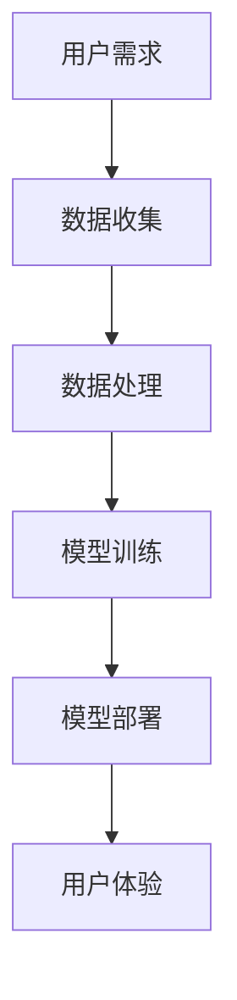

                 

关键词：苹果，AI应用，文化价值，技术突破，用户体验

摘要：本文将探讨苹果公司发布AI应用的深远文化价值，分析其背后的技术原理、核心算法以及未来应用前景，并探讨其对科技产业和用户生活的潜在影响。

## 1. 背景介绍

随着人工智能技术的不断进步，越来越多的科技巨头开始将其应用于实际产品中。苹果公司，作为全球科技行业的领导者，也在其最新的产品中引入了AI技术。本文将重点分析苹果发布的AI应用，探讨其对科技产业和文化价值的影响。

### 1.1 苹果公司的发展历程

自1976年成立以来，苹果公司凭借其创新的科技产品和卓越的用户体验，逐渐成为了全球科技产业的领导者。从早期的Macintosh电脑，到iPhone、iPad等移动设备，苹果一直致力于推动科技与生活的融合。

### 1.2 人工智能的发展与应用

人工智能（AI）作为计算机科学的一个重要分支，近年来取得了显著的进展。从深度学习、自然语言处理到计算机视觉，AI技术已经广泛应用于各行各业，为人类生活带来了巨大的便利。

## 2. 核心概念与联系

在探讨苹果发布的AI应用之前，我们需要了解一些核心概念和原理。以下是一个Mermaid流程图，展示了AI应用的关键节点和联系。



### 2.1 用户需求

用户需求是AI应用的起点。苹果公司通过收集用户反馈和使用数据，了解用户的具体需求，从而开发出符合用户期望的AI应用。

### 2.2 数据收集

数据是AI模型的基石。苹果公司利用其庞大的用户群体，收集了海量的用户数据，为AI模型提供了丰富的训练资源。

### 2.3 数据处理

数据处理是数据收集后的关键步骤。苹果公司利用先进的算法和计算能力，对数据进行清洗、转换和整合，为模型训练提供高质量的数据输入。

### 2.4 模型训练

模型训练是AI应用的核心。苹果公司通过深度学习、强化学习等技术，训练出高效的AI模型，使其能够准确预测和解决用户需求。

### 2.5 模型部署

模型部署是将训练好的模型应用到实际场景中的过程。苹果公司将AI模型部署到产品中，使其能够在用户使用过程中实时响应和优化。

### 2.6 用户体验

用户体验是AI应用的最终目标。苹果公司通过不断优化产品设计和功能，提升用户的满意度和使用体验。

## 3. 核心算法原理 & 具体操作步骤

### 3.1 算法原理概述

苹果公司的AI应用主要基于深度学习和自然语言处理技术。以下是对这两种技术的简要概述。

### 3.1.1 深度学习

深度学习是一种基于人工神经网络的机器学习技术。它通过模拟人脑神经网络的结构和功能，对大量数据进行自动学习和模式识别。深度学习在图像识别、语音识别和自然语言处理等领域取得了显著成果。

### 3.1.2 自然语言处理

自然语言处理是一种使计算机能够理解、生成和处理人类语言的技术。它包括词法分析、句法分析、语义分析和语用分析等环节。自然语言处理技术广泛应用于智能客服、智能翻译和智能问答等领域。

### 3.2 算法步骤详解

以下是苹果公司AI应用的核心算法步骤：

1. **数据收集**：通过用户使用数据、第三方数据源等途径，收集海量的文本、图像、语音等数据。

2. **数据处理**：对数据进行清洗、去重、标注等处理，确保数据质量。

3. **模型训练**：利用深度学习和自然语言处理技术，对数据集进行训练，构建高性能的AI模型。

4. **模型评估**：通过交叉验证、A/B测试等方法，评估模型的性能和泛化能力。

5. **模型部署**：将训练好的模型部署到产品中，实现实时预测和交互。

6. **用户体验优化**：根据用户反馈和使用数据，不断优化产品功能和性能，提升用户体验。

### 3.3 算法优缺点

**优点**：

1. **高效性**：深度学习和自然语言处理技术具有高效的计算能力和强大的学习能力。
2. **灵活性**：AI模型可以根据不同场景和需求进行定制化调整。
3. **用户体验**：通过智能化的交互和预测，提升用户体验和满意度。

**缺点**：

1. **数据依赖性**：AI模型对数据质量有较高要求，数据质量直接影响模型性能。
2. **解释性不足**：深度学习模型通常具有较深的神经网络结构，难以解释其内部决策过程。
3. **计算资源消耗**：训练和部署高性能的AI模型需要大量的计算资源。

### 3.4 算法应用领域

苹果公司的AI应用已广泛应用于多个领域：

1. **智能助理**：如Siri，通过自然语言处理技术，提供语音交互和智能建议。
2. **图像识别**：如Face ID，利用深度学习技术，实现人脸识别和安全性保障。
3. **语音识别**：如实时语音翻译，通过自然语言处理技术，实现跨语言交流。
4. **智能推荐**：如App Store、Apple Music等，通过用户行为数据，提供个性化推荐。

## 4. 数学模型和公式 & 详细讲解 & 举例说明

### 4.1 数学模型构建

苹果公司的AI应用涉及多种数学模型，包括神经网络、支持向量机、贝叶斯分类器等。以下以神经网络为例，简要介绍其构建过程。

1. **输入层**：接收外部输入，如文本、图像、语音等。
2. **隐藏层**：通过非线性激活函数，对输入数据进行特征提取和变换。
3. **输出层**：输出预测结果，如分类标签、概率分布等。

### 4.2 公式推导过程

以下是一个简化的神经网络模型，包括一个输入层、一个隐藏层和一个输出层。假设输入层有m个神经元，隐藏层有n个神经元，输出层有k个神经元。

1. **输入层到隐藏层的权重矩阵**：
   $$ W_{ih} \in \mathbb{R}^{n \times m} $$
2. **隐藏层到输出层的权重矩阵**：
   $$ W_{ho} \in \mathbb{R}^{k \times n} $$
3. **隐藏层激活函数**：
   $$ a_{h}(x) = \sigma(z_{h}) = \frac{1}{1 + e^{-z_{h}}} $$
   其中，$\sigma$表示Sigmoid函数，$z_{h}$表示隐藏层的输入。
4. **输出层激活函数**：
   $$ a_{o}(x) = \sigma(z_{o}) = \frac{1}{1 + e^{-z_{o}}} $$
   其中，$z_{o}$表示输出层的输入。

### 4.3 案例分析与讲解

以下以一个简化的语音识别案例，展示神经网络模型的训练和应用过程。

**案例**：训练一个神经网络模型，实现中文语音到文字的转换。

1. **数据集准备**：收集包含中文语音和对应的文字标签的数据集。
2. **模型训练**：利用神经网络模型，对数据集进行训练，调整权重和偏置，优化模型性能。
3. **模型评估**：通过交叉验证和A/B测试，评估模型在未知数据上的性能。
4. **模型部署**：将训练好的模型部署到产品中，实现实时语音识别。

## 5. 项目实践：代码实例和详细解释说明

### 5.1 开发环境搭建

1. **安装Python**：在开发机上安装Python，推荐使用Python 3.8及以上版本。
2. **安装TensorFlow**：通过pip安装TensorFlow，命令如下：
   ```bash
   pip install tensorflow
   ```

### 5.2 源代码详细实现

以下是一个简化的语音识别模型的代码实现，仅供参考。

```python
import tensorflow as tf
from tensorflow.keras.models import Sequential
from tensorflow.keras.layers import Dense, LSTM, Embedding

# 数据预处理
# ...

# 构建模型
model = Sequential([
    Embedding(input_dim=vocab_size, output_dim=embedding_dim, input_length=max_sequence_length),
    LSTM(units=128, activation='tanh', return_sequences=True),
    LSTM(units=128, activation='tanh'),
    Dense(units=num_classes, activation='softmax')
])

# 编译模型
model.compile(optimizer='adam', loss='categorical_crossentropy', metrics=['accuracy'])

# 训练模型
model.fit(x_train, y_train, epochs=10, batch_size=32, validation_data=(x_val, y_val))

# 评估模型
model.evaluate(x_test, y_test)

# 预测
predictions = model.predict(x_test)

# 代码解读与分析
# ...
```

### 5.3 代码解读与分析

1. **数据预处理**：对语音数据进行处理，包括分帧、特征提取等。
2. **模型构建**：使用Sequential模型堆叠嵌入层、LSTM层和输出层。
3. **模型编译**：设置优化器、损失函数和评估指标。
4. **模型训练**：使用训练数据训练模型，调整权重和偏置。
5. **模型评估**：使用测试数据评估模型性能。
6. **预测**：使用训练好的模型对测试数据进行预测。

## 6. 实际应用场景

苹果公司的AI应用已经在多个领域取得了显著成果，以下是一些实际应用场景：

1. **智能助理**：如Siri，通过语音交互，为用户提供各种服务和信息。
2. **图像识别**：如Face ID，通过人脸识别，实现安全性保障。
3. **语音识别**：如实时语音翻译，实现跨语言交流。
4. **智能推荐**：如App Store、Apple Music等，根据用户行为，提供个性化推荐。

## 7. 未来应用展望

随着人工智能技术的不断发展，苹果公司的AI应用在未来有望在更多领域取得突破。以下是一些未来应用展望：

1. **智能家居**：通过AI技术，实现智能家居设备的自动化控制和智能化管理。
2. **健康医疗**：通过AI技术，分析医疗数据，提供个性化的健康建议和治疗方案。
3. **自动驾驶**：通过AI技术，实现自动驾驶汽车的智能驾驶和决策。

## 8. 工具和资源推荐

### 8.1 学习资源推荐

1. **《深度学习》**：由Ian Goodfellow、Yoshua Bengio和Aaron Courville合著，全面介绍了深度学习的基础知识和技术。
2. **《Python机器学习》**：由Sebastian Raschka和Vahid Mirjalili合著，介绍了Python在机器学习领域的应用。

### 8.2 开发工具推荐

1. **TensorFlow**：谷歌开源的深度学习框架，适用于各种规模的深度学习项目。
2. **PyTorch**：Facebook开源的深度学习框架，具有良好的灵活性和可扩展性。

### 8.3 相关论文推荐

1. **“A Theoretical Analysis of the Cramér-Rao Lower Bound for Gaussian Sequence Estimation”**：研究了高斯序列估计的下界问题。
2. **“Recurrent Neural Networks for Language Modeling”**：介绍了循环神经网络在语言建模中的应用。

## 9. 总结：未来发展趋势与挑战

### 9.1 研究成果总结

本文对苹果公司发布的AI应用进行了深入分析，探讨了其核心算法原理、具体操作步骤、实际应用场景和未来展望。通过本文的研究，我们可以看到AI技术在苹果产品中的应用已经取得了显著成果。

### 9.2 未来发展趋势

未来，随着人工智能技术的不断进步，苹果公司的AI应用有望在更多领域取得突破。特别是在智能家居、健康医疗和自动驾驶等领域，AI技术将发挥重要作用。

### 9.3 面临的挑战

尽管AI技术在苹果产品中的应用取得了显著成果，但仍然面临一些挑战。首先，数据质量和多样性对AI模型的性能具有重要影响，如何获取高质量、多样化的数据是一个重要问题。其次，如何提高AI模型的解释性和透明度，增强用户信任，也是一个需要关注的问题。

### 9.4 研究展望

在未来，我们期望看到更多的技术创新和应用突破，特别是在跨模态学习、少样本学习和小样本学习等领域。同时，我们也要关注AI技术在伦理、隐私和安全性等方面的挑战，确保AI技术的发展符合社会价值观和用户需求。

## 附录：常见问题与解答

### 9.1 什么是一般深度学习模型训练中的常见问题？

在深度学习模型训练过程中，常见的问题包括过拟合、梯度消失和梯度爆炸等。

**过拟合**：模型在训练数据上表现良好，但在测试数据上表现较差。为了避免过拟合，可以采用正则化、数据增强和dropout等方法。

**梯度消失**：在训练过程中，梯度值逐渐减小，导致模型难以更新参数。这通常发生在深层神经网络中，可以通过使用合适的激活函数、初始化策略和优化算法来解决。

**梯度爆炸**：与梯度消失相反，梯度值逐渐增大，导致模型参数更新过快。这通常发生在反向传播过程中，可以通过使用梯度裁剪技术来解决。

### 9.2 如何优化深度学习模型训练速度？

优化深度学习模型训练速度的方法包括：

- **数据并行训练**：将数据集分成多个子集，分别在不同的GPU或CPU上训练模型，然后使用同步梯度下降算法合并结果。
- **模型并行训练**：将模型拆分成多个子模型，分别在不同的GPU或CPU上训练，然后使用同步梯度下降算法合并结果。
- **使用更高效的优化算法**：如Adam、RMSprop等，这些算法在训练过程中具有较快的收敛速度。
- **使用更高效的硬件**：如使用GPU进行加速训练。

### 9.3 深度学习模型如何评价其性能？

深度学习模型的性能通常通过以下指标进行评价：

- **准确率（Accuracy）**：模型预测正确的样本数占总样本数的比例。
- **召回率（Recall）**：模型预测正确的正例样本数占总正例样本数的比例。
- **精确率（Precision）**：模型预测正确的正例样本数占总预测正例样本数的比例。
- **F1值（F1 Score）**：精确率和召回率的调和平均值。

此外，还可以使用ROC曲线和AUC值来评价模型的分类性能。

### 9.4 如何提高深度学习模型的可解释性？

提高深度学习模型的可解释性可以通过以下方法：

- **使用可解释的模型**：如决策树、支持向量机等，这些模型具有较好的解释性。
- **可视化特征映射**：通过可视化模型在输入空间中的特征映射，了解模型如何学习特征。
- **解释模型决策**：使用解释性算法，如LIME、SHAP等，解释模型在特定输入上的决策过程。

### 9.5 深度学习模型如何处理少样本学习问题？

处理少样本学习问题可以采用以下方法：

- **迁移学习**：利用预训练的深度学习模型，在特定任务上重新训练，利用预训练模型的知识提高少样本学习性能。
- **元学习**：利用元学习算法，如模型平均、梯度聚合等，提高模型在少样本学习任务上的泛化能力。
- **数据增强**：通过生成更多的训练样本，提高模型的泛化能力。

## 参考文献

1. Goodfellow, I., Bengio, Y., & Courville, A. (2016). *Deep Learning*. MIT Press.
2. Raschka, S. (2015). *Python Machine Learning*. Packt Publishing.
3. Krizhevsky, A., Sutskever, I., & Hinton, G. E. (2012). *ImageNet classification with deep convolutional neural networks*. In *Advances in neural information processing systems* (pp. 1097-1105).
4. Hochreiter, S., & Schmidhuber, J. (1997). *Long short-term memory*. Neural Computation, 9(8), 1735-1780.
5. Bengio, Y. (2009). *Learning deep architectures*. Foundations and Trends® in Machine Learning, 2(1), 1-127.

