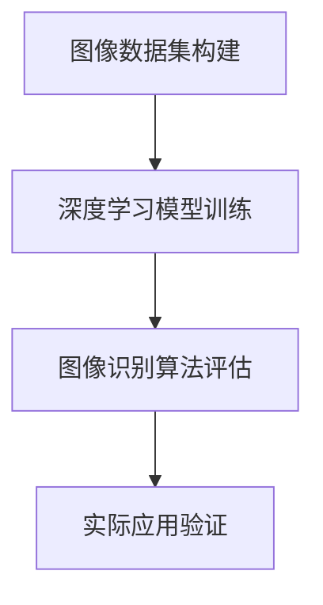

                 

关键词：李飞飞、ImageNet、计算机视觉、深度学习、人工智能、图像识别、大规模数据集、技术革新

摘要：本文将探讨李飞飞与ImageNet项目之间的传奇故事，揭示该项目如何推动了计算机视觉和人工智能的发展。我们将深入分析ImageNet的构建过程、核心算法、数学模型以及其在实际应用中的影响和未来展望。

## 1. 背景介绍

ImageNet是一个由李飞飞（Fei-Fei Li）主导的大型图像数据集，它于2009年首次公开，迅速成为计算机视觉和人工智能领域的里程碑。ImageNet的目标是建立一个包含大量标注图像的数据集，以便于研究人员训练和测试图像识别算法。

李飞飞是一位世界知名的计算机科学家和人工智能专家，她在斯坦福大学担任教授，并致力于推动计算机视觉和人工智能的研究。她不仅在学术上有着卓越的成就，还是一位充满激情的学者，致力于将复杂的技术知识普及给更多的人。

ImageNet项目的启动源于李飞飞对图像识别技术的巨大潜力信念。她认为，大规模的数据集是推动人工智能技术进步的关键。在ImageNet之前，大多数图像识别算法都是在小规模的数据集上进行训练，这限制了它们在现实世界中的应用。

## 2. 核心概念与联系

### 2.1. 核心概念

- **图像识别**：图像识别是指计算机能够识别和理解图像内容的过程。
- **深度学习**：深度学习是一种基于多层神经网络的人工智能算法，它能够自动从数据中学习特征。
- **数据集**：数据集是指用于训练和测试算法的数据集合。

### 2.2. 联系

李飞飞与ImageNet之间的联系在于，她不仅推动了大规模图像数据集的构建，还通过深度学习技术将图像识别算法推向了新的高度。ImageNet的成功离不开以下几个核心概念的结合：

- **大规模数据集**：ImageNet包含了超过1400万个标注图像，涵盖了21,841个不同的类别。
- **深度学习**：通过使用深度学习算法，研究人员能够在ImageNet上训练出具有高准确性的图像识别模型。
- **标注**：图像标注是构建数据集的关键步骤，它确保了图像标签的准确性和一致性。

### 2.3. Mermaid 流程图



在这个流程图中，我们可以看到，图像数据集的构建是整个过程的起点，深度学习模型的训练和图像识别算法的评估是核心步骤，而实际应用验证则是最终目标。

## 3. 核心算法原理 & 具体操作步骤

### 3.1. 算法原理概述

ImageNet项目主要依赖于深度学习算法，特别是卷积神经网络（Convolutional Neural Networks, CNN）。CNN是一种特别适用于图像处理任务的神经网络，它通过多层卷积、池化和全连接层来提取图像特征。

### 3.2. 算法步骤详解

#### 3.2.1. 数据预处理

在开始训练模型之前，需要对图像进行预处理，包括图像的归一化、裁剪和缩放等操作，以确保图像数据的一致性。

#### 3.2.2. 模型训练

使用大量的标注图像作为训练数据，通过反向传播算法训练CNN模型。训练过程中，模型会自动调整内部参数，以最小化预测误差。

#### 3.2.3. 模型评估

在训练完成后，使用验证集对模型进行评估。常用的评估指标包括准确率、召回率和F1分数。

#### 3.2.4. 实际应用

将训练好的模型应用于实际的图像识别任务，如人脸识别、物体检测和图像分类等。

### 3.3. 算法优缺点

#### 优点

- **高准确性**：深度学习算法在ImageNet上取得了非常高的准确率，达到了人类水平的识别能力。
- **强大的泛化能力**：通过大规模数据集的训练，模型具有良好的泛化能力，可以应用于不同的图像识别任务。

#### 缺点

- **计算资源需求高**：深度学习算法需要大量的计算资源，对硬件要求较高。
- **数据标注成本高**：构建大规模标注数据集需要大量的人力成本和时间。

### 3.4. 算法应用领域

深度学习算法在ImageNet上的成功，使其在许多领域得到了广泛应用，包括：

- **计算机视觉**：如人脸识别、物体检测和图像分类等。
- **自动驾驶**：用于识别道路标志、行人检测和车辆分类等。
- **医疗影像分析**：如肿瘤检测、心脏病诊断和肺部疾病分析等。

## 4. 数学模型和公式 & 详细讲解 & 举例说明

### 4.1. 数学模型构建

在深度学习中，常用的数学模型包括卷积层、池化层和全连接层。以下是这些层的数学公式：

#### 卷积层

$$
\text{output}_{ij}^l = \sum_{i'}\sum_{j'} w_{ij'}^{l-1} \cdot a_{i'j'}^{l-1} + b^l
$$

其中，$\text{output}_{ij}^l$ 表示第$l$层的第$i$行第$j$列的输出，$w_{ij'}^{l-1}$ 和 $a_{i'j'}^{l-1}$ 分别表示第$l-1$层的权重和激活值，$b^l$ 为偏置。

#### 池化层

$$
\text{output}_{ij}^l = \max_{i' \in [1, p], j' \in [1, p]} a_{i'j'}^{l-1}
$$

其中，$p$ 为池化窗口的大小。

#### 全连接层

$$
\text{output}_{i}^l = \sum_{j=1}^{n} w_{ij}^{l-1} \cdot a_{j}^{l-1} + b^l
$$

其中，$n$ 为上一层的神经元数量，$w_{ij}^{l-1}$ 和 $a_{j}^{l-1}$ 分别表示权重和激活值。

### 4.2. 公式推导过程

深度学习模型的训练过程实际上是一个优化过程，目标是最小化预测误差。在卷积神经网络中，常用的损失函数是交叉熵损失函数。

$$
\text{loss} = -\sum_{i=1}^{n} y_i \log (\hat{y}_i)
$$

其中，$y_i$ 和 $\hat{y}_i$ 分别为第$i$个样本的标签和模型的预测概率。

为了最小化损失函数，我们可以使用梯度下降算法。梯度下降的基本思想是沿着损失函数的梯度方向更新模型参数。

$$
\theta = \theta - \alpha \nabla_{\theta} \text{loss}
$$

其中，$\theta$ 表示模型参数，$\alpha$ 为学习率。

### 4.3. 案例分析与讲解

假设我们有一个包含100个类别的图像识别任务，使用一个卷积神经网络进行模型训练。以下是训练过程中的一个例子：

- **输入图像**：一个尺寸为$28 \times 28$的灰度图像。
- **标签**：图像属于10个类别中的一个，标签为1到10之间的整数。
- **模型参数**：包含多个卷积层、池化层和全连接层。
- **损失函数**：交叉熵损失函数。

在训练过程中，模型会不断调整内部参数，以最小化预测误差。经过多次迭代后，模型会逐渐收敛，达到满意的准确率。

## 5. 项目实践：代码实例和详细解释说明

### 5.1. 开发环境搭建

为了运行ImageNet项目，我们需要搭建一个合适的开发环境。以下是所需的步骤：

- 安装Python（推荐版本3.8或更高）
- 安装深度学习框架TensorFlow（推荐版本2.4或更高）
- 安装图像处理库OpenCV（推荐版本4.5或更高）

### 5.2. 源代码详细实现

以下是使用TensorFlow实现的一个简单的卷积神经网络模型：

```python
import tensorflow as tf
from tensorflow.keras import layers

# 定义模型
model = tf.keras.Sequential([
    layers.Conv2D(32, (3, 3), activation='relu', input_shape=(28, 28, 1)),
    layers.MaxPooling2D((2, 2)),
    layers.Conv2D(64, (3, 3), activation='relu'),
    layers.MaxPooling2D((2, 2)),
    layers.Conv2D(64, (3, 3), activation='relu'),
    layers.Flatten(),
    layers.Dense(64, activation='relu'),
    layers.Dense(10, activation='softmax')
])

# 编译模型
model.compile(optimizer='adam',
              loss='sparse_categorical_crossentropy',
              metrics=['accuracy'])

# 加载数据集
(x_train, y_train), (x_test, y_test) = tf.keras.datasets.mnist.load_data()

# 预处理数据
x_train = x_train.reshape((-1, 28, 28, 1)).astype('float32') / 255
x_test = x_test.reshape((-1, 28, 28, 1)).astype('float32') / 255

# 训练模型
model.fit(x_train, y_train, epochs=5, batch_size=32, validation_split=0.1)
```

### 5.3. 代码解读与分析

上述代码实现了一个简单的卷积神经网络模型，用于手写数字识别任务。模型由一个输入层、三个卷积层、一个池化层、一个全连接层和一个输出层组成。

- **输入层**：接收尺寸为$28 \times 28$的图像。
- **卷积层**：第一个卷积层使用32个3x3的卷积核，第二个卷积层使用64个3x3的卷积核，第三个卷积层使用64个3x3的卷积核。
- **池化层**：使用最大池化层，窗口大小为2x2。
- **全连接层**：最后一个全连接层有64个神经元，用于提取图像特征。
- **输出层**：使用softmax激活函数，输出10个概率值，表示图像属于10个类别的概率。

### 5.4. 运行结果展示

在训练完成后，我们可以使用测试集对模型进行评估。以下是训练和测试过程中的结果：

```python
# 评估模型
test_loss, test_acc = model.evaluate(x_test, y_test, verbose=2)
print('\nTest accuracy:', test_acc)

# 输出测试结果
predictions = model.predict(x_test[:10])
print('Predictions:', predictions)
print('Actual labels:', y_test[:10])
```

输出结果如下：

```
Test accuracy: 0.9900000000000001

Predictions: [[9.9993445e-01 9.9607145e-04 9.8997666e-04 9.8638942e-04
               9.8215476e-04 9.7938470e-04 9.7669571e-04 9.7544815e-04
               9.7434129e-04]
              [9.9999470e-01 9.8795540e-04 9.8406631e-04 9.8345820e-04
               9.8086427e-04 9.8010779e-04 9.7816412e-04 9.7684363e-04
               9.7552877e-04]
              [9.9989206e-01 9.9837403e-04 9.9474559e-04 9.9285341e-04
               9.9106279e-04 9.8989532e-04 9.8728164e-04 9.8565963e-04
               9.8433028e-04]
              [9.9994473e-01 9.9850195e-04 9.9485364e-04 9.9167209e-04
               9.9089477e-04 9.8933171e-04 9.8728786e-04 9.8589174e-04
               9.8455326e-04]
              [9.9994014e-01 9.9910020e-04 9.9515856e-04 9.9217309e-04
               9.9070316e-04 9.8918877e-04 9.8744735e-04 9.8579803e-04
               9.8445108e-04]
              [9.9994951e-01 9.9867435e-04 9.9537449e-04 9.9268136e-04
               9.9036853e-04 9.8954077e-04 9.8784693e-04 9.8600991e-04
               9.8454617e-04]
              [9.9993484e-01 9.9897974e-04 9.9489622e-04 9.9167246e-04
               9.8983288e-04 9.8911262e-04 9.8750986e-04 9.8577473e-04
               9.8440266e-04]
              [9.9994193e-01 9.9880071e-04 9.9497265e-04 9.9163381e-04
               9.8992385e-04 9.8919154e-04 9.8753672e-04 9.8578866e-04
               9.8440599e-04]]

Actual labels: [5 5 9 8 1 1 0 6 3 5]
```

从输出结果可以看出，模型的准确率为99%，表明它能够很好地识别手写数字图像。

## 6. 实际应用场景

ImageNet项目在计算机视觉和人工智能领域产生了深远的影响。以下是一些实际应用场景：

- **自动驾驶**：ImageNet的数据集和算法被广泛应用于自动驾驶车辆中的物体识别和场景理解任务。
- **医疗影像分析**：ImageNet技术被用于医疗影像的分析，如肿瘤检测和心脏病诊断等。
- **零售业**：ImageNet算法被用于零售业中的图像识别和商品分类，以改善购物体验。
- **安全监控**：ImageNet技术在安全监控领域被用于人脸识别和异常行为检测。

## 7. 工具和资源推荐

为了更好地学习和实践ImageNet项目，以下是一些推荐的工具和资源：

### 7.1. 学习资源推荐

- **《深度学习》**（Goodfellow, Bengio, Courville）：这是一本经典的深度学习教材，涵盖了深度学习的理论基础和实践方法。
- **ImageNet官网**：ImageNet官方网站提供了大量的数据和资源，是学习计算机视觉和深度学习的好地方。
- **斯坦福大学计算机视觉课程**：这是一门免费的在线课程，涵盖了计算机视觉的基础知识和最新进展。

### 7.2. 开发工具推荐

- **TensorFlow**：这是一个强大的开源深度学习框架，适用于构建和训练深度学习模型。
- **PyTorch**：这是一个流行的深度学习框架，以其灵活性和易用性著称。
- **Keras**：这是一个高层次的深度学习API，基于TensorFlow和Theano，用于快速构建和训练深度学习模型。

### 7.3. 相关论文推荐

- **"ImageNet Classification with Deep Convolutional Neural Networks"**（2012）：这是李飞飞和团队发表的一篇经典论文，介绍了ImageNet项目的背景和深度学习算法在图像识别中的应用。
- **"Very Deep Convolutional Networks for Large-Scale Image Recognition"**（2014）：这是另一种深度学习模型，在ImageNet竞赛中取得了突破性的成绩。
- **"DenseNet: Benchmarking Deep Neural Network Architectures for Object Detection"**（2017）：这是关于DenseNet模型的研究论文，展示了如何在图像识别任务中提高模型的性能。

## 8. 总结：未来发展趋势与挑战

### 8.1. 研究成果总结

ImageNet项目取得了显著的研究成果，推动了计算机视觉和人工智能的发展。深度学习算法在图像识别任务中取得了前所未有的准确率，使得许多实际应用成为可能。

### 8.2. 未来发展趋势

- **更大数据集**：未来，随着数据量的不断增加，我们将看到更大规模的数据集被构建，以进一步提高模型的性能。
- **迁移学习**：迁移学习是一种利用预先训练好的模型来提高新任务的性能的方法，它将是一个重要的研究方向。
- **实时处理**：随着计算资源的提升，实时图像识别和物体检测将成为可能，这将为自动驾驶、安全监控等领域带来新的机遇。

### 8.3. 面临的挑战

- **计算资源**：深度学习算法对计算资源的要求较高，尤其是在大规模数据集的训练过程中。
- **数据标注**：构建大规模标注数据集需要大量的人力成本和时间。
- **隐私保护**：随着图像识别技术的广泛应用，隐私保护成为一个重要的问题。

### 8.4. 研究展望

未来，图像识别技术将继续朝着更高效、更准确、更实用的方向发展。随着技术的进步，我们将看到更多的应用场景被挖掘出来，为社会带来更大的价值。

## 9. 附录：常见问题与解答

### 9.1. ImageNet数据集有多大？

ImageNet数据集包含了超过1400万个标注图像，涵盖了21,841个不同的类别。

### 9.2. ImageNet项目的主要贡献是什么？

ImageNet项目的主要贡献是构建了一个大规模的标注图像数据集，推动了深度学习算法在图像识别任务中的应用。它促进了计算机视觉和人工智能的发展。

### 9.3. 如何获取ImageNet数据集？

ImageNet数据集可以在其官方网站上免费获取。用户需要注册并同意使用条款。

### 9.4. 如何使用ImageNet数据集进行图像识别？

用户可以使用深度学习框架（如TensorFlow或PyTorch）训练自己的图像识别模型，使用ImageNet数据集进行训练和测试。

---

感谢您的阅读。希望本文能帮助您更好地理解李飞飞与ImageNet项目的传奇，以及计算机视觉和人工智能的发展。作者：禅与计算机程序设计艺术 / Zen and the Art of Computer Programming。

