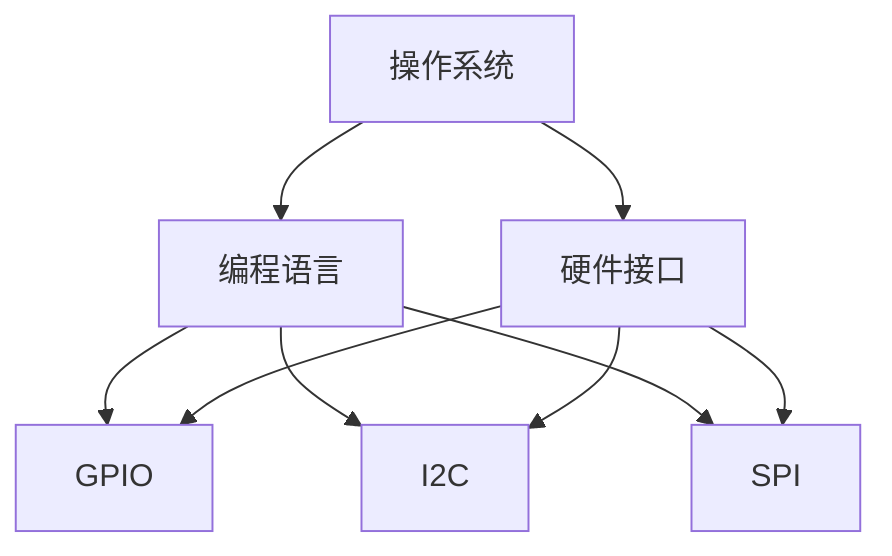

                 

 **关键词：**树莓派，Linux，单板计算机，编程，开发环境，应用场景

**摘要：**本文将深入探讨树莓派编程，以基于 Linux 的单板计算机为核心，详细介绍其背景、核心概念、算法原理、数学模型、项目实践以及应用前景。通过本文的阅读，读者将全面了解树莓派编程的魅力，掌握其实际应用的方法。

## 1. 背景介绍

树莓派（Raspberry Pi）是一款由英国慈善组织 Raspberry Pi 基金会开发的微型计算机。自 2012 年首次发布以来，树莓派因其低廉的价格、高度的灵活性以及易于使用的特性，迅速在全球范围内获得了广泛的关注和认可。树莓派是一款基于 Linux 的单板计算机，其核心组件包括一个处理器、内存、存储设备、输入输出接口等。树莓派的尺寸小巧，适合进行各种嵌入式系统和物联网项目的开发。

树莓派的应用场景非常广泛，包括智能家居、机器人、无人机、物联网设备等。它不仅适用于学生和教育领域，还为开发者提供了一个低成本、高效率的开发平台。本文将主要探讨树莓派的编程技术，帮助读者掌握其开发方法。

## 2. 核心概念与联系

在深入探讨树莓派编程之前，我们首先需要了解一些核心概念和它们之间的联系。这些概念包括操作系统、编程语言、硬件接口等。

### 2.1 操作系统

操作系统是计算机的核心软件，负责管理计算机的硬件资源和软件资源。树莓派使用的是 Linux 操作系统，这是因为 Linux 具有开源、稳定、安全性高等优点。树莓派上的 Linux 操作系统可以定制，以适应不同的应用场景。

### 2.2 编程语言

编程语言是用于编写计算机程序的语言。树莓派支持多种编程语言，如 Python、C/C++、Java 等。Python 是最常用于树莓派编程的语言，因为其简单易学、易于实现和强大的库支持。

### 2.3 硬件接口

树莓派提供了丰富的硬件接口，包括 GPIO、I2C、SPI 等。这些接口可以用于连接各种传感器、显示屏、电机等外部设备，实现树莓派的智能化和自动化。

下面是一个 Mermaid 流程图，展示了这些核心概念之间的关系：



## 3. 核心算法原理 & 具体操作步骤

树莓派编程的核心在于算法的设计和实现。以下我们将介绍一种常用的算法——基于 Python 的 PID 控制算法。

### 3.1 算法原理概述

PID（比例-积分-微分）控制是一种常见的控制算法，用于调节系统的输出，使其稳定并接近目标值。PID 控制器通过三个参数（比例 P、积分 I、微分 D）来调整控制量，以达到最佳的控制效果。

### 3.2 算法步骤详解

1. 初始化 PID 参数。
2. 计算当前误差值。
3. 计算 PID 控制器的输出。
4. 根据输出调整控制量。
5. 重复步骤 2-4，直到达到目标值。

下面是一个简单的 PID 控制算法实现：

```python
import time

# 初始化 PID 参数
Kp = 1.0
Ki = 0.1
Kd = 0.05
integral = 0
prev_error = 0

# 计算 PID 控制器的输出
error = setpoint - measured_value
output = Kp * error + Ki * integral + Kd * (error - prev_error)
integral += error
prev_error = error

# 根据输出调整控制量
control_value = output

# 等待一段时间，再次计算
time.sleep(0.1)
```

### 3.3 算法优缺点

PID 控制算法的优点在于简单易懂、稳定性好、易于实现。然而，其缺点是对于非线性系统和复杂系统，PID 控制效果可能不佳。

### 3.4 算法应用领域

PID 控制算法广泛应用于工业控制、智能家居、机器人等领域。例如，在智能家居中，可以用于调节温度、湿度等环境参数；在机器人中，可以用于控制运动速度、方向等。

## 4. 数学模型和公式 & 详细讲解 & 举例说明

在树莓派编程中，数学模型和公式是算法实现的基础。以下我们将介绍一种常用的数学模型——基于牛顿迭代法的平方根计算。

### 4.1 数学模型构建

牛顿迭代法的平方根计算公式如下：

$$x_{n+1} = \frac{1}{2} \left( x_n + \frac{n}{x_n} \right)$$

其中，$x_n$ 为第 $n$ 次迭代的平方根估计值，$n$ 为要计算的平方根的值。

### 4.2 公式推导过程

牛顿迭代法的平方根计算是基于牛顿迭代法的原理，通过对函数 $f(x) = x^2 - n$ 进行迭代，逐步逼近平方根的值。

### 4.3 案例分析与讲解

假设我们要计算 25 的平方根，我们可以按照以下步骤进行：

1. 初始化估计值：$x_0 = 1$。
2. 进行第一次迭代：$x_1 = \frac{1}{2} \left( 1 + \frac{25}{1} \right) = 13$。
3. 进行第二次迭代：$x_2 = \frac{1}{2} \left( 13 + \frac{25}{13} \right) = 5$。
4. 进行第三次迭代：$x_3 = \frac{1}{2} \left( 5 + \frac{25}{5} \right) = 5$。

经过三次迭代，我们得到了 25 的精确平方根 5。

## 5. 项目实践：代码实例和详细解释说明

以下是一个基于树莓派的智能家居项目实例，该实例使用 Python 编程语言实现。

### 5.1 开发环境搭建

1. 下载并安装 Raspberry Pi OS。
2. 配置无线网络连接。
3. 安装 Python 和相关库（如 GPIO、PyTk 等）。

### 5.2 源代码详细实现

```python
import time
import GPIO

# 初始化 GPIO
GPIO.setmode(GPIO.BCM)
GPIO.setup(18, GPIO.OUT)

# 创建 PWM 对象
p = GPIO.PWM(18, 1000)

# 设置 PWM 占空比
p.start(0)

# 调节灯泡亮度
def adjust_brightness(value):
    p.ChangeDutyCycle(value)

# 关闭灯泡
def off():
    p.stop()

# 打开灯泡
def on():
    adjust_brightness(100)

# 主函数
def main():
    on()
    time.sleep(5)
    off()
    time.sleep(5)
    adjust_brightness(50)

# 执行主函数
if __name__ == "__main__":
    main()
```

### 5.3 代码解读与分析

该代码首先导入了时间库和 GPIO 库，然后初始化了 GPIO 并设置了 PWM 输出。接着，创建了 PWM 对象，并定义了调节灯泡亮度和关闭灯泡的函数。最后，在主函数中，打开灯泡 5 秒，然后关闭 5 秒，最后调节灯泡亮度为 50%。

### 5.4 运行结果展示

执行代码后，树莓派会按照预设的步骤操作灯泡，实现智能家居的简单控制。

## 6. 实际应用场景

树莓派编程在许多实际应用场景中表现出色。以下是一些典型的应用场景：

1. **智能家居**：通过树莓派，可以实现灯光控制、温度监控、家电控制等功能，提升家居智能化水平。
2. **机器人**：树莓派可以用于控制机器人，实现行走、语音识别、图像识别等功能。
3. **物联网**：树莓派可以作为物联网设备的核心控制器，实现数据采集、传输和处理。
4. **教育**：树莓派在教育领域有着广泛的应用，帮助学生了解计算机编程和硬件知识。
5. **科学实验**：树莓派可以用于科学实验，如气象监测、环境监测等。

## 7. 工具和资源推荐

### 7.1 学习资源推荐

- 《树莓派从入门到精通》
- 《Python 编程实战》
- 《Linux 命令与shell脚本编程大全》

### 7.2 开发工具推荐

- PyCharm
- Visual Studio Code
- Thonny

### 7.3 相关论文推荐

- “Raspberry Pi: A Tiny, Low-Cost Computer for Education and Beyond”
- “Python Programming: From Beginner to Expert”
- “Linux System Programming: Techniques and Tools for Developing Linux System Software”

## 8. 总结：未来发展趋势与挑战

### 8.1 研究成果总结

近年来，树莓派编程技术取得了显著成果，包括硬件性能的提升、软件生态的完善、应用场景的拓展等。这些成果为树莓派编程的发展奠定了坚实基础。

### 8.2 未来发展趋势

未来，树莓派编程将在以下几个方面发展：

1. **硬件性能提升**：随着硬件技术的进步，树莓派的性能将进一步提升，满足更多复杂应用的需求。
2. **软件生态优化**：树莓派的软件生态将不断完善，提供更多便捷的编程工具和资源。
3. **应用领域拓展**：树莓派编程将在智能家居、机器人、物联网等领域继续拓展，实现更多创新应用。

### 8.3 面临的挑战

树莓派编程在发展过程中也面临一些挑战：

1. **硬件限制**：树莓派的硬件性能相对于一些专业计算机仍有差距，难以满足部分高性能需求。
2. **安全性问题**：随着树莓派应用场景的拓展，安全性问题日益凸显，需要加强安全防护。
3. **编程门槛**：虽然树莓派编程相对简单，但仍有一定门槛，需要进一步降低学习难度。

### 8.4 研究展望

未来，树莓派编程将继续发展，成为计算机编程领域的重要一环。我们期待看到更多创新应用和研究成果，推动树莓派编程技术的不断进步。

## 9. 附录：常见问题与解答

### 9.1 树莓派如何安装操作系统？

树莓派安装操作系统可以通过多种方式，如 SD 卡、USB 设备等。具体步骤如下：

1. 下载 Raspberry Pi OS 镜像。
2. 使用工具（如 Win32DiskImager、balenaEtcher）将镜像写入 SD 卡。
3. 将 SD 卡插入树莓派。
4. 连接显示器、键盘、鼠标，启动树莓派。

### 9.2 如何在树莓派上安装 Python？

在树莓派上安装 Python 可以通过以下步骤：

1. 启动树莓派，进入命令行界面。
2. 使用以下命令安装 Python：

   ```bash
   sudo apt update
   sudo apt install python3
   ```

3. 安装完成后，可以使用 `python3` 命令启动 Python 解释器。

### 9.3 树莓派编程中如何使用 GPIO？

在树莓派编程中，可以使用 GPIO 库来操作 GPIO 引脚。以下是简单的 GPIO 使用示例：

1. 导入 GPIO 库：

   ```python
   import RPi.GPIO as GPIO
   ```

2. 初始化 GPIO：

   ```python
   GPIO.setmode(GPIO.BCM)
   ```

3. 设置 GPIO 引脚为输出模式：

   ```python
   GPIO.setup(18, GPIO.OUT)
   ```

4. 控制引脚输出高低电平：

   ```python
   GPIO.output(18, GPIO.HIGH)
   time.sleep(1)
   GPIO.output(18, GPIO.LOW)
   time.sleep(1)
   ```

5. 关闭 GPIO：

   ```python
   GPIO.cleanup()
   ```

## 结束语

树莓派编程是一门充满魅力和挑战的技术领域。通过本文的介绍，我们全面了解了树莓派编程的背景、核心概念、算法原理、数学模型、项目实践以及应用前景。希望本文能为您在树莓派编程领域提供有益的指导，激发您的研究热情。

**作者：禅与计算机程序设计艺术 / Zen and the Art of Computer Programming**<|im_end|>

