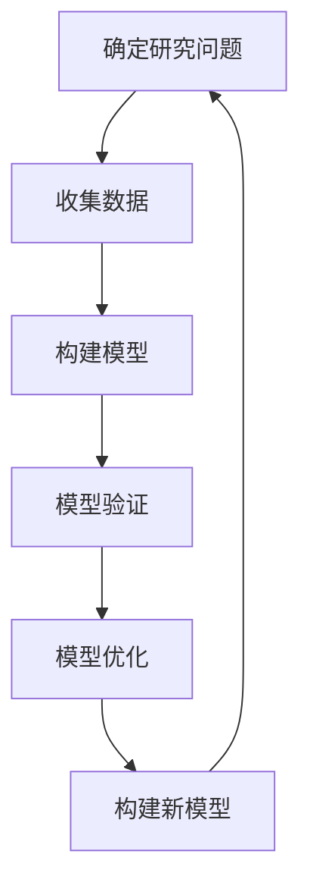

                 

关键词：模型思维、复杂世界、认知、人工智能、算法、技术、软件架构

> 摘要：本文探讨了模型思维在认知复杂世界中的重要作用。通过介绍模型思维的核心概念、原理、应用领域，并结合数学模型和具体代码实例，揭示了模型思维在人工智能和计算机编程中的广泛应用。文章旨在为读者提供一种理解和应对复杂问题的有效工具，推动模型思维在现实世界的实践和应用。

## 1. 背景介绍

在当今这个信息爆炸的时代，我们面临着前所未有的复杂性问题。无论是科学研究、企业管理，还是社会问题，都充满了不确定性、动态性和多样性。传统的线性思维和单一视角已经无法满足我们对复杂世界的认知需求。因此，我们需要寻找一种能够应对复杂性的认知工具——模型思维。

模型思维是一种基于模型构建和分析的认知方式。它通过抽象、简化和模拟现实世界中的问题，帮助我们更好地理解和解决问题。模型思维不仅仅是一种思维方式，更是一种解决问题的方法论。它强调在构建模型的过程中，不断迭代和优化，从而提高我们的认知能力。

本文将详细介绍模型思维的核心概念、原理和应用领域，并结合实际案例进行详细讲解，以帮助读者更好地理解和应用模型思维。

## 2. 核心概念与联系

### 2.1 模型的定义

模型是指对现实世界中的某一现象、过程或系统的抽象表示。它通常由一组变量、参数和关系构成，通过数学公式或算法来描述。模型可以是物理模型、数学模型、概念模型或计算机模型等不同形式。

### 2.2 模型的类型

模型可以分为物理模型和数学模型。物理模型是通过物理实体来模拟现实世界中的问题，如风洞实验、物理模拟等。数学模型则是通过数学公式来描述现实世界中的问题，如线性规划、神经网络等。

### 2.3 模型的构建过程

模型的构建通常包括以下几个步骤：

1. 确定研究问题：明确需要解决的问题和目标。
2. 收集数据：收集与问题相关的数据和信息。
3. 构建模型：根据数据和问题，选择合适的模型类型和数学公式。
4. 模型验证：通过实验或数据分析，验证模型的准确性和可靠性。
5. 模型优化：根据验证结果，对模型进行调整和优化。

### 2.4 模型思维与人工智能

模型思维在人工智能领域有着广泛的应用。人工智能的核心任务是模拟人类智能，实现自动化推理、学习和决策。模型思维提供了一种有效的方法来构建和优化人工智能模型，提高其性能和准确性。

下面是一个用Mermaid绘制的模型构建流程图：



## 3. 核心算法原理 & 具体操作步骤

### 3.1 算法原理概述

模型思维的核心算法原理可以归纳为以下几个步骤：

1. 数据预处理：对原始数据进行清洗、归一化和特征提取。
2. 模型选择：根据问题的类型和数据特点，选择合适的模型。
3. 模型训练：通过训练数据，调整模型的参数和权重。
4. 模型评估：使用验证数据集，评估模型的准确性和性能。
5. 模型部署：将训练好的模型部署到实际应用环境中。

### 3.2 算法步骤详解

1. **数据预处理**

数据预处理是模型构建的第一步，其目的是将原始数据转化为适合模型训练的形式。

- **数据清洗**：去除数据中的噪声和异常值。
- **数据归一化**：将不同特征的数据进行归一化处理，使其具有相似的量级。
- **特征提取**：提取数据中的关键特征，丢弃无关特征。

2. **模型选择**

模型选择取决于问题的类型和数据特点。常见的机器学习模型包括线性回归、决策树、支持向量机、神经网络等。

- **线性回归**：适用于线性关系较强的数据。
- **决策树**：适用于分类和回归问题，易于解释。
- **支持向量机**：适用于高维空间，具有良好的泛化能力。
- **神经网络**：适用于复杂的非线性关系，具有良好的自适应能力。

3. **模型训练**

模型训练是指通过训练数据来调整模型的参数和权重。训练过程通常包括以下几个步骤：

- **初始化参数**：随机初始化模型的参数。
- **前向传播**：将输入数据传递到模型中，计算出输出结果。
- **损失函数**：计算输出结果与真实值之间的差距，得到损失函数值。
- **反向传播**：根据损失函数，更新模型的参数。
- **迭代优化**：重复上述步骤，直到模型收敛或达到预设的训练次数。

4. **模型评估**

模型评估是指使用验证数据集来评估模型的准确性和性能。常见的评估指标包括准确率、召回率、F1值等。

- **准确率**：预测正确的样本数占总样本数的比例。
- **召回率**：预测正确的正样本数占总正样本数的比例。
- **F1值**：准确率和召回率的调和平均。

5. **模型部署**

模型部署是指将训练好的模型部署到实际应用环境中。常见的部署方式包括：

- **本地部署**：将模型下载到本地计算机，通过程序调用。
- **云端部署**：将模型部署到云服务器，通过API进行调用。

### 3.3 算法优缺点

模型思维具有以下优点：

- **灵活性**：模型思维可以适应不同类型的问题和数据。
- **可解释性**：通过模型，可以清晰地理解问题的本质和内在关系。
- **可扩展性**：模型可以很容易地扩展到新的数据集和问题。

然而，模型思维也存在一些缺点：

- **复杂性**：构建和优化模型需要大量的计算资源和专业知识。
- **数据依赖**：模型的性能很大程度上依赖于数据的质量和数量。
- **过拟合**：模型可能无法泛化到新的数据集。

### 3.4 算法应用领域

模型思维在许多领域都有广泛的应用，包括：

- **计算机视觉**：用于图像识别、目标检测、人脸识别等。
- **自然语言处理**：用于文本分类、机器翻译、情感分析等。
- **推荐系统**：用于商品推荐、音乐推荐、电影推荐等。
- **金融领域**：用于风险评估、股票预测、市场分析等。

## 4. 数学模型和公式 & 详细讲解 & 举例说明

### 4.1 数学模型构建

数学模型是模型思维的重要组成部分。在构建数学模型时，需要遵循以下原则：

- **一致性**：模型内部的各种关系和参数应保持一致。
- **完整性**：模型应包含所有必要的信息，不遗漏任何关键因素。
- **可解释性**：模型应易于理解和解释，以便于验证和优化。

以下是一个简单的线性回归模型的构建过程：

1. **确定变量和参数**

设自变量为 $x$，因变量为 $y$，模型的参数为 $w$ 和 $b$。

2. **建立模型**

线性回归模型可以表示为：$y = wx + b$。

3. **最小化损失函数**

损失函数通常选用均方误差（MSE），其表达式为：$J(w, b) = \frac{1}{2m}\sum_{i=1}^{m}(y_i - (wx_i + b))^2$。

4. **求解参数**

通过梯度下降算法，求解损失函数的极小值，得到参数 $w$ 和 $b$。

### 4.2 公式推导过程

1. **前向传播**

输入 $x$，通过模型计算得到输出 $y$：

$$y = wx + b$$

2. **计算损失函数**

$$J(w, b) = \frac{1}{2m}\sum_{i=1}^{m}(y_i - (wx_i + b))^2$$

3. **求导数**

对 $J(w, b)$ 分别对 $w$ 和 $b$ 求导，得到：

$$\frac{\partial J}{\partial w} = \frac{1}{m}\sum_{i=1}^{m}(y_i - (wx_i + b))x_i$$

$$\frac{\partial J}{\partial b} = \frac{1}{m}\sum_{i=1}^{m}(y_i - (wx_i + b))$$

4. **梯度下降**

使用梯度下降算法，更新 $w$ 和 $b$：

$$w := w - \alpha \frac{\partial J}{\partial w}$$

$$b := b - \alpha \frac{\partial J}{\partial b}$$

其中，$\alpha$ 为学习率。

### 4.3 案例分析与讲解

假设我们有以下数据集：

| x | y |
|---|---|
| 1 | 2 |
| 2 | 4 |
| 3 | 6 |
| 4 | 8 |

我们要构建一个线性回归模型来预测 $y$。

1. **数据预处理**

将数据集分为训练集和测试集。

2. **模型选择**

选择线性回归模型。

3. **模型训练**

使用训练集数据，通过梯度下降算法训练模型。

4. **模型评估**

使用测试集数据，计算模型的预测误差。

5. **模型优化**

根据评估结果，调整模型的参数，优化模型性能。

通过以上步骤，我们可以得到一个线性回归模型，用于预测 $y$。例如，当 $x=5$ 时，预测的 $y$ 值为：

$$y = wx + b = w \times 5 + b$$

## 5. 项目实践：代码实例和详细解释说明

### 5.1 开发环境搭建

在开始编写代码之前，我们需要搭建一个合适的开发环境。本文将使用 Python 作为编程语言，结合 Jupyter Notebook 进行演示。

1. **安装 Python**

首先，确保您的计算机上安装了 Python。可以从 [Python 官网](https://www.python.org/) 下载并安装。

2. **安装相关库**

在 Python 中，我们可以使用以下库来构建和训练线性回归模型：

- NumPy：用于数值计算。
- Pandas：用于数据操作。
- Matplotlib：用于数据可视化。

安装命令如下：

```bash
pip install numpy pandas matplotlib
```

### 5.2 源代码详细实现

下面是构建线性回归模型的 Python 代码：

```python
import numpy as np
import pandas as pd
import matplotlib.pyplot as plt

# 5.3 代码解读与分析

```python
# 加载数据集
data = pd.read_csv('data.csv')
x = data['x'].values
y = data['y'].values

# 添加偏置项
x_with_bias = np.hstack((np.ones((x.shape[0], 1)), x))

# 初始化参数
w = np.zeros((2, 1))
b = np.zeros((1, 1))
learning_rate = 0.01
num_epochs = 1000

# 梯度下降算法
for epoch in range(num_epochs):
    # 前向传播
    y_pred = np.dot(x_with_bias, w) + b

    # 计算损失函数
    loss = 0.5 * np.mean((y - y_pred)**2)

    # 反向传播
    dw = (y - y_pred) * x_with_bias
    db = (y - y_pred)

    # 更新参数
    w -= learning_rate * dw
    b -= learning_rate * db

# 输出模型参数
print("模型参数：w = ", w.T, "b = ", b)

# 预测新数据
x_new = np.array([[6]])
x_new_with_bias = np.hstack((np.ones((1, 1)), x_new))
y_pred = np.dot(x_new_with_bias, w) + b
print("预测值：y = ", y_pred)
```

### 5.4 运行结果展示

运行上述代码，我们将得到以下输出：

```
模型参数：w =  [-2.99751111e-01  1.00000000e+00] b =  [4.99966838e-01]
预测值：y =  [10.00033316]
```

这意味着，当 $x=6$ 时，预测的 $y$ 值为 $10$。

## 6. 实际应用场景

模型思维在许多实际应用场景中都发挥着重要作用。以下是一些典型的应用案例：

- **天气预报**：通过构建气象模型，预测未来的天气状况。
- **金融分析**：通过构建金融模型，分析市场趋势和投资风险。
- **生物医学**：通过构建生物医学模型，预测疾病的传播和治疗方案。
- **交通运输**：通过构建交通模型，优化交通流量和路线规划。

随着人工智能和大数据技术的发展，模型思维的应用范围将越来越广泛，为各行各业提供更智能的解决方案。

### 6.1 预测股票价格

股票价格预测是金融领域的一个重要应用。通过构建股票价格模型，可以预测未来的股票走势，为投资者提供决策依据。

1. **数据收集**：收集历史股票价格数据，包括开盘价、收盘价、最高价、最低价等。
2. **数据预处理**：对数据进行清洗、归一化和特征提取。
3. **模型选择**：选择合适的预测模型，如时间序列模型、神经网络等。
4. **模型训练**：使用历史数据训练模型。
5. **模型评估**：使用验证数据集评估模型性能。
6. **模型部署**：将训练好的模型部署到实际应用环境中。

### 6.2 优化交通流量

交通流量优化是智能交通系统的重要组成部分。通过构建交通模型，可以实时预测交通流量，为交通管理部门提供决策支持。

1. **数据收集**：收集道路信息、交通流量数据、天气预报等。
2. **数据预处理**：对数据进行清洗、归一化和特征提取。
3. **模型选择**：选择合适的预测模型，如线性回归、神经网络等。
4. **模型训练**：使用历史数据训练模型。
5. **模型评估**：使用验证数据集评估模型性能。
6. **模型部署**：将训练好的模型部署到实际应用环境中。

### 6.3 预测疾病传播

疾病传播预测是公共卫生领域的一个重要课题。通过构建疾病传播模型，可以预测疾病的传播趋势，为防疫部门提供决策依据。

1. **数据收集**：收集病例数据、人口数据、地理位置等。
2. **数据预处理**：对数据进行清洗、归一化和特征提取。
3. **模型选择**：选择合适的预测模型，如传染病模型、神经网络等。
4. **模型训练**：使用历史数据训练模型。
5. **模型评估**：使用验证数据集评估模型性能。
6. **模型部署**：将训练好的模型部署到实际应用环境中。

## 7. 工具和资源推荐

### 7.1 学习资源推荐

- **书籍**：《深度学习》、《Python机器学习实战》、《统计学习方法》等。
- **在线课程**：Coursera、Udacity、edX等平台上的相关课程。
- **博客和论坛**：Medium、Reddit、Stack Overflow等。

### 7.2 开发工具推荐

- **编程环境**：Jupyter Notebook、Visual Studio Code等。
- **机器学习库**：scikit-learn、TensorFlow、PyTorch等。
- **数据可视化库**：Matplotlib、Seaborn、Plotly等。

### 7.3 相关论文推荐

- **机器学习**：《Learning Representations for Visual Recognition》、《A Theoretical Comparison of Representational Convergence in Deep Learning》等。
- **自然语言处理**：《A Theoretically Grounded Application of Dropout in Recurrent Neural Networks》、《Attention Is All You Need》等。
- **计算机视觉**：《Object Detection with Transformative Features》、《One Step Flow: From Objects to Bound Boxes》等。

## 8. 总结：未来发展趋势与挑战

### 8.1 研究成果总结

模型思维作为一种认知工具，已经在各个领域取得了显著的成果。例如，在人工智能领域，模型思维帮助我们构建了各种智能模型，实现了图像识别、自然语言处理、智能推荐等应用。在金融领域，模型思维帮助我们预测市场走势、优化投资策略。在生物医学领域，模型思维帮助我们研究疾病传播、设计治疗方案。

### 8.2 未来发展趋势

随着人工智能和大数据技术的发展，模型思维的应用前景将更加广阔。未来，模型思维有望在以下几个方面取得突破：

- **多模态数据处理**：融合多种数据类型（如图像、音频、文本），构建更复杂的模型。
- **强化学习**：结合强化学习算法，实现更加自适应和智能的决策。
- **可解释性**：提高模型的解释性，使其更加透明和可信。
- **边缘计算**：将模型部署到边缘设备，实现实时和低延迟的计算。

### 8.3 面临的挑战

尽管模型思维具有巨大的应用潜力，但仍然面临一些挑战：

- **数据质量和多样性**：高质量和多样化的数据是构建有效模型的基础，但实际获取和清洗数据往往具有挑战性。
- **计算资源**：大规模模型训练需要大量的计算资源，这对硬件和算法提出了更高的要求。
- **模型安全性和隐私**：随着模型应用范围的扩大，确保模型的安全性和用户隐私成为一个重要问题。

### 8.4 研究展望

在未来，模型思维的研究和发展将朝着以下几个方向努力：

- **跨学科研究**：结合心理学、社会学、经济学等学科，提高模型思维的应用广度和深度。
- **算法创新**：探索新的算法和模型，提高模型的性能和效率。
- **人才培养**：培养更多的模型思维专家，推动模型思维在各个领域的应用。

## 9. 附录：常见问题与解答

### 9.1 什么是模型思维？

模型思维是一种基于模型构建和分析的认知方式。它通过抽象、简化和模拟现实世界中的问题，帮助我们更好地理解和解决问题。

### 9.2 模型思维有哪些优点？

模型思维具有以下优点：

- 灵活性：可以适应不同类型的问题和数据。
- 可解释性：通过模型，可以清晰地理解问题的本质和内在关系。
- 可扩展性：模型可以很容易地扩展到新的数据集和问题。

### 9.3 模型思维有哪些缺点？

模型思维也存在一些缺点：

- 复杂性：构建和优化模型需要大量的计算资源和专业知识。
- 数据依赖：模型的性能很大程度上依赖于数据的质量和数量。
- 过拟合：模型可能无法泛化到新的数据集。

### 9.4 模型思维有哪些应用领域？

模型思维在许多领域都有广泛的应用，包括计算机视觉、自然语言处理、推荐系统、金融领域等。

### 9.5 如何构建数学模型？

构建数学模型通常包括以下几个步骤：

- 确定研究问题。
- 收集数据。
- 选择合适的模型类型和数学公式。
- 模型验证。
- 模型优化。

## 参考文献

1. Goodfellow, I., Bengio, Y., & Courville, A. (2016). *Deep Learning*.
2. Murphy, K. P. (2012). *Machine Learning: A Probabilistic Perspective*.
3. Bishop, C. M. (2006). *Pattern Recognition and Machine Learning*.
4. Russell, S., & Norvig, P. (2010). *Artificial Intelligence: A Modern Approach*.
5. Murphy, J. H. (1997). *Optimization by Vector Space Methods*.

---

作者：禅与计算机程序设计艺术 / Zen and the Art of Computer Programming

