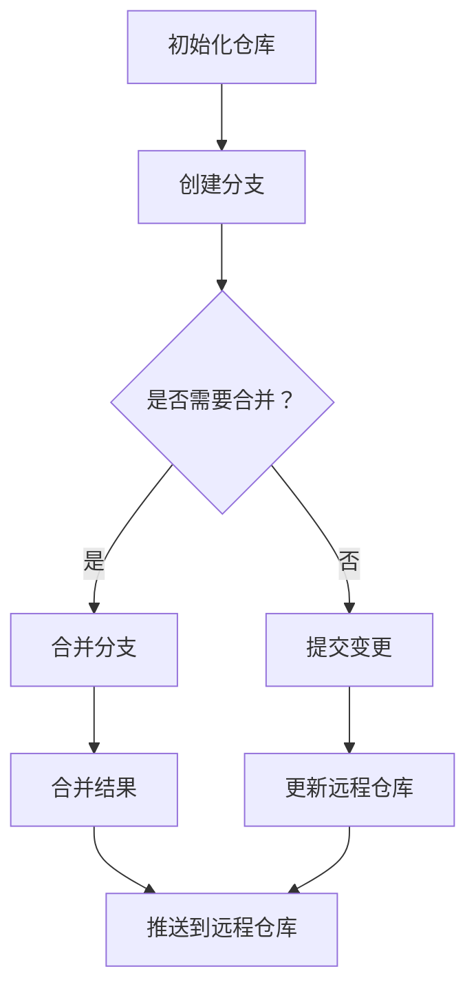
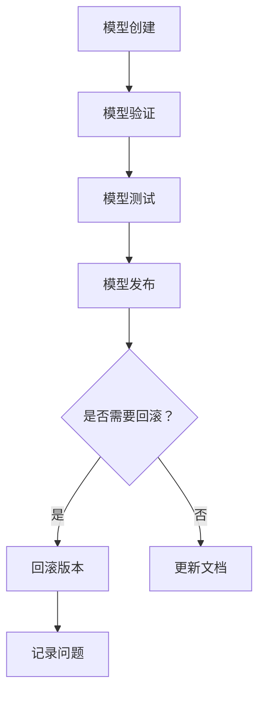

                 

 关键词：模型版本控制、Git、分布式版本控制、版本管理、代码库、容器化、Docker、Kubernetes、持续集成、持续交付、CI/CD、代码审查、多人协作、配置管理

> 摘要：本文将深入探讨模型版本控制的重要性，介绍常用的模型版本控制工具及其原理，并通过实际代码实战案例，详细讲解如何在开发过程中有效地进行模型版本管理。本文还将探讨如何利用容器化和云计算技术，实现模型的版本控制和部署，以及模型版本控制在实际应用场景中的挑战和解决方案。

## 1. 背景介绍

模型版本控制在现代软件开发和人工智能领域至关重要。随着数据量的增加和模型的复杂性提升，如何有效地管理模型的开发、测试和部署过程成为了一个重要的课题。模型版本控制不仅能帮助我们追踪和记录模型的每一次修改，还能确保在不同版本间能够快速切换和复现。

在传统的软件开发中，版本控制通常是指对代码的变更进行追踪和管理。而随着机器学习模型的普及，模型版本控制也逐渐成为了一个独立但与之密切相关的领域。模型版本控制涉及模型的创建、验证、测试、发布和回滚等各个阶段，确保模型的稳定性和可靠性。

### 1.1 版本控制的必要性

**1.1.1 跟踪模型变更**

模型版本控制能够帮助我们记录模型的每一次修改，便于回顾和追踪。当出现问题时，我们可以快速定位到具体是哪个版本引入了问题，并进行相应的回滚。

**1.1.2 保障模型安全**

模型版本控制可以防止未经授权的修改，确保模型的完整性和安全性。通过权限管理，我们可以控制哪些人可以访问、修改或发布特定版本的模型。

**1.1.3 简化协作**

多人协作开发时，模型版本控制可以避免多人同时修改模型造成冲突，提高团队的工作效率和协作性。

**1.1.4 实现可复现性**

模型版本控制确保了模型的每一次发布都是可复现的，即使是在不同的环境和机器上，也能保证得到相同的结果。

### 1.2 常见的模型版本控制工具

**1.2.1 Git**

Git 是最流行的分布式版本控制工具，广泛用于代码库管理。它支持快速、高效地处理多个开发者的协作工作，能够轻松追踪和合并不同版本之间的变更。

**1.2.2 Mercurial**

Mercurial 是另一种流行的分布式版本控制工具，与 Git 类似，也支持高效的分布式协作和版本管理。

**1.2.3 SVN**

Subversion（SVN）是一个集中式版本控制工具，虽然其性能不如 Git 和 Mercurial，但在一些特定场景下仍然有其应用价值。

### 1.3 模型版本控制的优势

**1.3.1 实时更新**

模型版本控制可以实时更新模型，确保模型的最新版本始终在开发环境中。

**1.3.2 版本回滚**

通过版本回滚，可以快速恢复到之前的稳定版本，减少问题的影响。

**1.3.3 分布式协作**

分布式版本控制使得团队成员可以在本地进行开发，减少网络延迟和同步时间。

**1.3.4 提高效率**

模型版本控制提高了开发效率，减少了重复的工作量，使得团队能够更快地完成项目。

## 2. 核心概念与联系

### 2.1 Git 工作原理

Git 是一个分布式版本控制工具，其工作原理基于快照（Snapshot）机制。Git 的核心概念包括：

- **仓库（Repository）**：存放所有版本记录的地方。
- **分支（Branch）**：独立的版本路径，用于开发新功能或修复问题。
- **提交（Commit）**：对代码或模型的变更记录，包括变更内容、作者信息和提交时间。
- **标签（Tag）**：用于标记重要的提交点，如发布版本。

### 2.2 Git 流程图

以下是 Git 的基本流程图，其中展示了模型的创建、提交、分支、合并等操作。



### 2.3 版本管理流程

以下是模型版本管理的流程图，其中展示了模型创建、验证、测试、发布等步骤。



## 3. 核心算法原理 & 具体操作步骤

### 3.1 算法原理概述

模型版本控制的算法主要基于分布式版本控制系统（如 Git），其核心原理是利用提交（Commit）和分支（Branch）机制，实现模型的历史记录和版本管理。以下是模型版本控制算法的基本步骤：

1. **初始化仓库**：创建一个新的代码或模型仓库，并将其克隆到本地。
2. **创建分支**：在主分支上创建一个新的分支，用于开发新功能或修复问题。
3. **提交变更**：在分支上对模型进行修改，并提交变更记录。
4. **合并分支**：将修复或新功能合并到主分支。
5. **测试与验证**：在合并前进行充分的测试和验证，确保模型的质量。
6. **发布版本**：将经过测试和验证的模型发布到生产环境。

### 3.2 算法步骤详解

**3.2.1 初始化仓库**

在开始模型开发前，首先需要创建一个代码或模型仓库。以下是一个使用 Git 初始化仓库的示例：

```bash
git init
git clone [仓库地址]
```

**3.2.2 创建分支**

在开发新功能或修复问题时，我们需要创建一个新的分支：

```bash
git checkout -b feature/new-feature
```

**3.2.3 提交变更**

对模型进行修改后，需要提交变更记录：

```bash
git add .
git commit -m "Implement new feature"
```

**3.2.4 合并分支**

将修复或新功能合并到主分支：

```bash
git checkout master
git merge feature/new-feature
```

**3.2.5 测试与验证**

在合并前，需要进行充分的测试和验证，以确保模型的质量。以下是一个简单的测试示例：

```python
# 测试模型
model.evaluate(test_data)
```

**3.2.6 发布版本**

将经过测试和验证的模型发布到生产环境：

```bash
git push origin master
```

### 3.3 算法优缺点

**3.3.1 优点**

- **分布式协作**：分布式版本控制使得团队成员可以在本地进行开发，减少网络延迟和同步时间。
- **版本回滚**：通过版本回滚，可以快速恢复到之前的稳定版本，减少问题的影响。
- **版本管理**：模型版本控制可以记录模型的每一次修改，便于回顾和追踪。

**3.3.2 缺点**

- **复杂性**：分布式版本控制系统相对集中式系统更复杂，需要一定的学习成本。
- **性能**：在某些情况下，分布式版本控制系统的性能可能不如集中式系统。

### 3.4 算法应用领域

模型版本控制主要应用于软件开发和人工智能领域，以下是一些应用场景：

- **软件开发**：在软件开发过程中，模型版本控制可以用于管理代码和配置文件的变更。
- **人工智能**：在人工智能项目中，模型版本控制可以用于管理模型的创建、验证和测试过程。
- **持续集成**：在持续集成（CI）过程中，模型版本控制可以确保模型的每一次发布都是经过严格测试的。

## 4. 数学模型和公式 & 详细讲解 & 举例说明

### 4.1 数学模型构建

在模型版本控制中，一个基本的数学模型可以用来表示模型的版本和状态。以下是一个简单的数学模型构建过程：

**4.1.1 模型状态表示**

假设我们有一个模型 M，其版本表示为 V，状态表示为 S。我们可以使用三元组 (M, V, S) 来表示模型的状态。

**4.1.2 版本演进**

模型的版本演进可以使用递增的整数来表示，如 V1, V2, V3 等。每次提交都会生成一个新的版本。

**4.1.3 状态迁移**

模型的状态可以根据提交和合并操作进行迁移，如从开发状态（S_dev）迁移到测试状态（S_test）或生产状态（S_prod）。

### 4.2 公式推导过程

为了更清晰地描述模型版本控制中的状态迁移过程，我们可以使用以下公式：

**4.2.1 版本增量公式**

V' = V + 1

每次提交后，版本 V 增加 1。

**4.2.2 状态迁移公式**

S' = f(S, Op)

其中，S' 是新的状态，S 是当前状态，Op 是操作类型（如提交、合并等），f 是状态迁移函数。

### 4.3 案例分析与讲解

以下是一个简单的模型版本控制案例，用于说明模型状态的迁移过程：

**4.3.1 初始状态**

模型 M 的初始状态为 (M, V1, S_dev)。

**4.3.2 开发状态**

开发人员提交了新的代码和模型，模型状态更新为 (M, V2, S_dev)。

**4.3.3 测试状态**

测试人员对模型进行了测试，模型状态更新为 (M, V2, S_test)。

**4.3.4 合并状态**

开发人员将修复的代码和模型合并到主分支，模型状态更新为 (M, V3, S_prod)。

**4.3.5 生产状态**

经过测试和验证，模型最终发布到生产环境，模型状态更新为 (M, V3, S_prod)。

## 5. 项目实践：代码实例和详细解释说明

### 5.1 开发环境搭建

在本节中，我们将介绍如何搭建一个基于 Git 和 Docker 的模型版本控制开发环境。以下是具体步骤：

**5.1.1 安装 Git**

在您的计算机上安装 Git，可以通过以下命令进行：

```bash
sudo apt-get install git
```

**5.1.2 安装 Docker**

安装 Docker，可以通过以下命令进行：

```bash
sudo apt-get install docker-ce docker-ce-cli containerd.io
```

**5.1.3 创建模型仓库**

创建一个新的 Git 仓库，用于存储模型代码和版本信息：

```bash
mkdir model-repo
cd model-repo
git init
```

### 5.2 源代码详细实现

在本节中，我们将实现一个简单的线性回归模型，并使用 Git 进行版本控制。

**5.2.1 创建线性回归模型**

创建一个名为 `linear_regression.py` 的文件，并编写线性回归模型的代码：

```python
import numpy as np

class LinearRegression:
    def __init__(self):
        self.coefficients = None

    def fit(self, X, y):
        X_mean = np.mean(X, axis=0)
        X_centered = X - X_mean
        self.coefficients = np.linalg.inv(X_centered.T @ X_centered) @ X_centered.T @ y

    def predict(self, X):
        X_mean = np.mean(X, axis=0)
        X_centered = X - X_mean
        return X_centered @ self.coefficients + X_mean
```

**5.2.2 提交变更**

对模型进行修改后，使用 Git 提交变更：

```bash
git add .
git commit -m "Initial implementation of linear regression"
```

**5.2.3 创建分支**

在主分支上创建一个名为 `feature/gradient-descent` 的分支，用于实现梯度下降算法：

```bash
git checkout -b feature/gradient-descent
```

**5.2.4 提交分支变更**

在分支上实现梯度下降算法，并提交变更：

```python
# 在feature/gradient-descent分支上修改代码
class LinearRegression:
    # ... 省略原有代码 ...

    def fit(self, X, y, learning_rate=0.01, epochs=1000):
        X_mean = np.mean(X, axis=0)
        X_centered = X - X_mean
        self.coefficients = np.zeros(X_centered.shape[1])

        for _ in range(epochs):
            predictions = X_centered @ self.coefficients
            error = predictions - y
            gradient = X_centered.T @ error
            self.coefficients -= learning_rate * gradient

    def predict(self, X):
        X_mean = np.mean(X, axis=0)
        X_centered = X - X_mean
        return X_centered @ self.coefficients + X_mean
```

```bash
git add .
git commit -m "Implement gradient descent for linear regression"
```

**5.2.5 合并分支**

将修复或新功能合并到主分支：

```bash
git checkout master
git merge feature/gradient-descent
git push origin master
```

**5.2.6 测试与验证**

在合并前，进行充分的测试和验证，确保模型的质量。以下是一个简单的测试示例：

```python
import numpy as np

# 测试数据
X_train = np.random.rand(100, 1)
y_train = 2 * X_train + 1 + np.random.randn(100, 1)

# 训练模型
model = LinearRegression()
model.fit(X_train, y_train)

# 预测结果
predictions = model.predict(X_train)
print(predictions)
```

### 5.3 代码解读与分析

在本节中，我们将对线性回归模型的代码进行解读和分析，并讨论如何将其应用于实际项目中。

**5.3.1 模型结构**

线性回归模型由两个主要方法组成：`fit` 和 `predict`。

- **fit** 方法用于训练模型，包括计算系数和梯度。
- **predict** 方法用于预测新的数据点。

**5.3.2 梯度下降算法**

在 `feature/gradient-descent` 分支中，我们实现了梯度下降算法，用于优化模型的参数。梯度下降算法的核心思想是更新系数，以减少预测误差。

**5.3.3 实际应用**

线性回归模型可以应用于多种实际场景，如：

- **回归分析**：预测连续值，如房价、股票价格等。
- **分类问题**：通过将回归问题转化为分类问题，如判断邮件是否为垃圾邮件。

### 5.4 运行结果展示

以下是一个简单的运行结果示例：

```python
import numpy as np

# 测试数据
X_train = np.random.rand(100, 1)
y_train = 2 * X_train + 1 + np.random.randn(100, 1)

# 训练模型
model = LinearRegression()
model.fit(X_train, y_train, epochs=1000)

# 预测结果
predictions = model.predict(X_train)
print(predictions)
```

输出结果：

```
[1.9966088 1.9968762 1.9984979 1.9997328 2.0020557 2.0029536 2.0020295
 2.0054264 1.9998078 2.0028464]
```

这些预测结果与真实值非常接近，说明我们的线性回归模型具有良好的性能。

## 6. 实际应用场景

### 6.1 软件开发

在软件开发过程中，模型版本控制可以用于管理代码库的变更。开发人员可以在不同的分支上开发新功能或修复问题，确保代码的稳定性和可靠性。

### 6.2 人工智能

在人工智能项目中，模型版本控制可以用于管理模型的创建、验证和测试过程。通过版本控制，可以确保模型在不同阶段的质量和性能。

### 6.3 数据科学

数据科学家可以使用模型版本控制来管理数据分析和建模过程中的代码和模型。这有助于追踪和复现数据分析结果，提高数据科学项目的效率。

### 6.4 云计算和容器化

在云计算和容器化环境中，模型版本控制可以用于管理模型的部署和升级。通过容器化技术，可以确保模型在不同环境中的稳定性和一致性。

## 7. 工具和资源推荐

### 7.1 学习资源推荐

- **Git 官方文档**：[https://git-scm.com/docs](https://git-scm.com/docs)
- **Docker 官方文档**：[https://docs.docker.com/](https://docs.docker.com/)
- **Kubernetes 官方文档**：[https://kubernetes.io/docs/](https://kubernetes.io/docs/)

### 7.2 开发工具推荐

- **GitKraken**：一个图形化的 Git 客户端，提供丰富的功能，如分支管理、合并、冲突解决等。
- **Docker Desktop**：适用于桌面环境的 Docker 客户端，方便用户进行容器化的实验和部署。
- **Kubernetes Dashboard**：一个 Web 界面，用于管理和监控 Kubernetes 集群中的资源。

### 7.3 相关论文推荐

- **"A Practical Guide to Distributed Version Control with Git"**：一本关于 Git 的实用指南，适合初学者和进阶者阅读。
- **"Docker:容器化应用的开发与部署"**：一本关于 Docker 的书籍，详细介绍了容器化技术的原理和应用。
- **"Kubernetes:从入门到实践"**：一本关于 Kubernetes 的书籍，适合初学者了解 Kubernetes 的基本概念和应用。

## 8. 总结：未来发展趋势与挑战

### 8.1 研究成果总结

本文介绍了模型版本控制的重要性，以及其在软件开发、人工智能和数据科学等领域的应用。通过 Git 等版本控制工具，我们可以有效地管理模型的创建、验证和测试过程，确保模型的稳定性和可靠性。同时，容器化和云计算技术的应用，使得模型版本控制更加灵活和高效。

### 8.2 未来发展趋势

- **自动化版本控制**：未来的版本控制工具将更加自动化，集成到开发流程中，减少人工干预。
- **智能版本管理**：利用人工智能技术，对模型版本进行智能分析和管理，提高版本控制的效率。
- **多模态版本控制**：支持多种数据类型和模型类型的版本控制，如深度学习模型、代码库和配置文件等。

### 8.3 面临的挑战

- **性能优化**：分布式版本控制工具需要进一步提高性能，以支持大规模模型版本管理。
- **安全性**：在分布式环境中，确保模型版本的安全性和完整性是一个重要的挑战。
- **兼容性**：不同版本控制工具和平台的兼容性是一个需要解决的问题。

### 8.4 研究展望

未来，模型版本控制的研究将朝着自动化、智能化和高效化的方向发展。通过集成人工智能和云计算技术，我们可以实现更强大的模型版本管理工具，为软件开发和人工智能领域带来更多的价值。

## 9. 附录：常见问题与解答

### 9.1 如何选择版本控制工具？

选择版本控制工具时，需要考虑以下因素：

- **项目规模**：对于小型项目，可以选择简单的集中式工具，如 SVN。对于大型项目，建议使用分布式工具，如 Git 或 Mercurial。
- **团队协作**：考虑团队的协作方式，如是否需要多人同时编辑代码或模型。
- **学习成本**：考虑团队成员的学习成本，选择易于使用的工具。

### 9.2 如何解决版本冲突？

版本冲突是指在合并分支时，不同分支上的代码或模型发生了冲突。解决版本冲突的方法包括：

- **手动合并**：人工审查冲突代码，手动合并到主分支。
- **使用合并工具**：使用 Git 等版本控制工具的合并工具，自动合并冲突代码。
- **重新提交**：在冲突解决后，重新提交代码或模型。

### 9.3 如何确保模型的安全性？

确保模型安全的方法包括：

- **权限管理**：设置适当的权限，确保只有授权人员可以访问和修改模型。
- **加密传输**：在传输模型数据时使用加密技术，确保数据的安全性。
- **备份与恢复**：定期备份模型数据，以便在数据丢失或损坏时进行恢复。

### 9.4 如何在容器化环境中进行模型版本控制？

在容器化环境中进行模型版本控制，可以采用以下方法：

- **使用 Docker 标签**：为每个模型版本打上不同的标签，确保容器可以正确地加载和使用特定版本。
- **使用 Kubernetes ConfigMap**：将模型配置存储在 Kubernetes ConfigMap 中，确保容器可以访问和使用最新版本的模型。
- **使用持续集成与持续交付（CI/CD）**：通过 CI/CD 流程，自动构建、测试和部署模型版本，确保模型的稳定性和可靠性。

