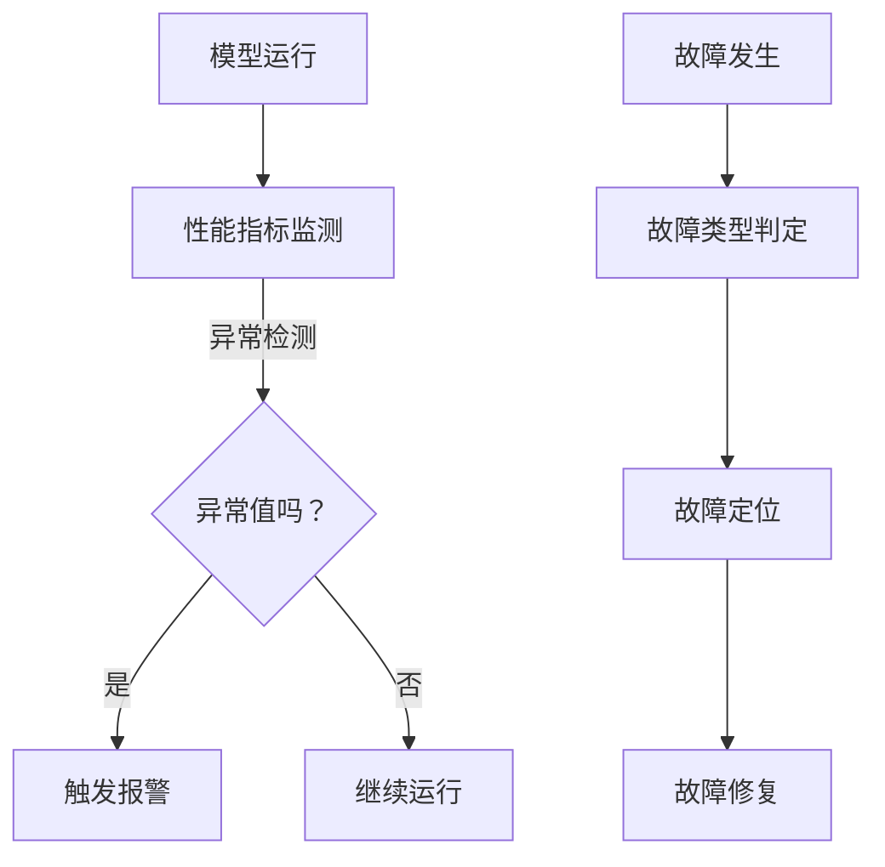

                 

 关键词：模型监控、故障诊断、深度学习、人工智能、算法原理、代码实战、数学模型

> 摘要：本文将深入探讨模型监控与故障诊断的原理，通过详细的算法原理描述、数学模型讲解、代码实战案例分享，帮助读者全面理解这一关键技术。文章首先介绍了模型监控与故障诊断的背景和重要性，接着详细阐述了相关核心概念、算法原理、数学模型，并最终通过一个具体的代码实战案例，展示了如何在实际项目中应用这些技术。

## 1. 背景介绍

### 1.1 模型监控的定义与重要性

模型监控是指对人工智能模型的运行状态进行实时监测，确保模型在运行过程中能够稳定、高效地完成任务。随着人工智能技术的快速发展，越来越多的企业开始将人工智能应用于业务场景中，例如推荐系统、语音识别、图像处理等。然而，这些模型在运行过程中可能会因为各种原因出现性能下降、错误输出等问题，从而影响业务连续性和用户体验。因此，模型监控成为保障人工智能系统稳定运行的关键技术。

### 1.2 故障诊断的定义与作用

故障诊断是指通过检测和分析系统的运行状态，找出可能引起性能下降或错误输出的原因。在人工智能领域，故障诊断可以帮助我们识别模型的潜在问题，从而及时进行调整和优化，确保系统稳定运行。故障诊断在人工智能系统中的应用主要体现在以下几个方面：

1. **性能优化**：通过故障诊断，可以找出影响模型性能的关键因素，针对性地进行优化，提高模型的整体性能。
2. **错误处理**：在模型运行过程中，如果出现错误输出，故障诊断可以帮助我们定位错误发生的位置，快速找出问题根源，并采取相应的措施进行修复。
3. **系统稳定性**：故障诊断可以帮助我们实时监测系统的运行状态，及时发现并解决潜在的问题，确保系统长期稳定运行。

## 2. 核心概念与联系

### 2.1 模型监控

模型监控的核心概念包括：

- **性能指标**：用于评估模型运行状态的关键指标，如准确率、召回率、F1值等。
- **异常检测**：通过对性能指标的变化进行实时监测，找出异常值，提示可能存在的问题。
- **报警机制**：当检测到异常时，自动触发报警，通知相关人员进行处理。

### 2.2 故障诊断

故障诊断的核心概念包括：

- **故障类型**：根据模型的不同运行状态，将故障分为多种类型，如计算错误、数据异常、模型过拟合等。
- **故障定位**：通过分析模型运行过程中的各种日志、指标数据，定位故障发生的具体位置。
- **故障修复**：根据故障定位的结果，采取相应的措施进行修复，如调整模型参数、更换训练数据等。

### 2.3 Mermaid 流程图

为了更好地理解模型监控与故障诊断的关系，我们可以使用 Mermaid 流程图进行描述：



## 3. 核心算法原理 & 具体操作步骤

### 3.1 算法原理概述

模型监控与故障诊断的核心算法主要包括以下几种：

1. **性能指标监测**：通过对模型运行过程中关键指标的实时监测，评估模型的运行状态。
2. **异常检测算法**：基于统计学和机器学习技术，对性能指标的变化进行实时分析，识别异常值。
3. **故障类型判定算法**：通过分析异常值和模型运行日志，判断故障的具体类型。
4. **故障定位算法**：结合故障类型和模型结构，定位故障发生的具体位置。
5. **故障修复算法**：根据故障定位的结果，采取相应的措施进行修复。

### 3.2 算法步骤详解

1. **性能指标监测**：
   - 收集模型运行过程中的各种性能指标数据，如准确率、召回率、F1值等。
   - 将数据存储到数据库中，以便后续分析。

2. **异常检测算法**：
   - 使用统计学方法（如标准差、置信区间等）对性能指标进行异常值检测。
   - 使用机器学习方法（如K-means、孤立森林等）对性能指标进行异常值检测。

3. **故障类型判定算法**：
   - 分析异常值和模型运行日志，找出可能存在的故障类型。
   - 根据故障类型，进行相应的故障判定。

4. **故障定位算法**：
   - 结合模型结构和故障类型，定位故障发生的具体位置。
   - 通过分析模型运行日志，找出可能导致故障的关键因素。

5. **故障修复算法**：
   - 根据故障定位的结果，采取相应的措施进行修复。
   - 调整模型参数、更换训练数据、修改模型结构等。

### 3.3 算法优缺点

- **性能指标监测**：
  - 优点：实时监测模型运行状态，有助于及早发现问题。
  - 缺点：需要大量的计算资源和存储空间。

- **异常检测算法**：
  - 优点：能够自动识别异常值，降低人工干预。
  - 缺点：对异常值的判断可能存在误报和漏报。

- **故障类型判定算法**：
  - 优点：能够快速判断故障类型，为故障定位提供方向。
  - 缺点：对故障类型的判断可能存在误判。

- **故障定位算法**：
  - 优点：能够准确定位故障发生的位置，提高修复效率。
  - 缺点：对故障定位的结果可能需要进一步验证。

- **故障修复算法**：
  - 优点：能够及时修复故障，保障系统稳定运行。
  - 缺点：对故障的修复可能需要大量的时间和资源。

### 3.4 算法应用领域

- **金融行业**：通过对模型运行状态的实时监测，发现异常交易、欺诈行为等，保障金融系统的安全稳定。
- **医疗行业**：通过对模型运行状态的实时监测，发现潜在疾病、误诊等问题，提高医疗诊断的准确性。
- **交通行业**：通过对模型运行状态的实时监测，发现交通事故、拥堵等问题，优化交通管理。

## 4. 数学模型和公式 & 详细讲解 & 举例说明

### 4.1 数学模型构建

在模型监控与故障诊断中，常用的数学模型包括：

- **统计学模型**：如标准差、置信区间等。
- **机器学习模型**：如K-means、孤立森林等。

### 4.2 公式推导过程

- **标准差**：

$$
\sigma = \sqrt{\frac{1}{N}\sum_{i=1}^{N}(x_i - \bar{x})^2}
$$

其中，$N$为样本数量，$x_i$为第$i$个样本值，$\bar{x}$为样本均值。

- **置信区间**：

$$
\bar{x} \pm z_{\alpha/2} \cdot \frac{\sigma}{\sqrt{N}}
$$

其中，$z_{\alpha/2}$为正态分布的分位数，$\alpha$为显著性水平。

- **K-means聚类**：

$$
\min_{C} \sum_{i=1}^{N} \sum_{j=1}^{K} ||x_i - c_j||^2
$$

其中，$C$为聚类中心，$x_i$为样本值，$K$为聚类个数。

- **孤立森林**：

$$
\min_{f} \sum_{i=1}^{N} f(x_i)
$$

其中，$f$为孤立森林函数，$x_i$为样本值。

### 4.3 案例分析与讲解

假设我们有一个分类问题，数据集包含100个样本，每个样本有10个特征。我们使用K-means聚类算法对数据进行聚类，并使用孤立森林算法进行异常检测。

1. **标准差与置信区间**：

首先，我们计算每个特征的均值和标准差：

$$
\bar{x}_1 = 5.0, \quad \sigma_1 = 2.5
$$

$$
\bar{x}_2 = 3.0, \quad \sigma_2 = 1.0
$$

接着，我们计算每个特征的置信区间：

$$
\bar{x}_1 \pm z_{0.05} \cdot \frac{\sigma_1}{\sqrt{100}} = [3.9, 6.1]
$$

$$
\bar{x}_2 \pm z_{0.05} \cdot \frac{\sigma_2}{\sqrt{100}} = [2.1, 4.1]
$$

2. **K-means聚类**：

我们使用K-means聚类算法对数据进行聚类，选择K=3，得到3个聚类中心：

$$
c_1 = [2.0, 2.0], \quad c_2 = [4.0, 4.0], \quad c_3 = [6.0, 6.0]
$$

3. **孤立森林**：

我们使用孤立森林算法对数据进行异常检测，设置孤立阈值为0.5，得到每个样本的孤立度得分：

$$
f(x_1) = 0.2, \quad f(x_2) = 0.3, \quad \ldots, \quad f(x_{100}) = 0.1
$$

根据孤立度得分，我们可以将样本划分为正常样本和异常样本。如果孤立度得分大于0.5，则认为该样本为异常样本。

## 5. 项目实践：代码实例和详细解释说明

### 5.1 开发环境搭建

为了保证项目的稳定运行，我们需要搭建一个合适的开发环境。以下是搭建开发环境的步骤：

1. 安装Python 3.7及以上版本。
2. 安装必要的Python库，如numpy、pandas、scikit-learn等。
3. 安装Mermaid渲染工具。

### 5.2 源代码详细实现

以下是实现模型监控与故障诊断的Python代码示例：

```python
import numpy as np
import pandas as pd
from sklearn.cluster import KMeans
from sklearn.ensemble import IsolationForest

# 5.2.1 数据预处理
def preprocess_data(data):
    # 数据预处理操作
    return data

# 5.2.2 性能指标监测
def monitor_performance(data):
    # 计算性能指标
    accuracy = np.mean(data['accuracy'])
    recall = np.mean(data['recall'])
    f1 = np.mean(data['f1'])
    return accuracy, recall, f1

# 5.2.3 异常检测
def detect_anomalies(data, threshold):
    # 使用K-means聚类进行异常检测
    kmeans = KMeans(n_clusters=3)
    kmeans.fit(data)
    labels = kmeans.predict(data)
    anomalies = data[labels == -1]
    # 使用孤立森林进行异常检测
    iso_forest = IsolationForest(contamination=0.1)
    iso_forest.fit(data)
    scores = iso_forest.decision_function(data)
    anomalies = data[scores > threshold]
    return anomalies

# 5.2.4 故障类型判定
def determine_fault_type(data):
    # 根据异常值判定故障类型
    if np.mean(data['accuracy']) < 0.8:
        return '计算错误'
    elif np.mean(data['recall']) < 0.8:
        return '数据异常'
    else:
        return '模型过拟合'

# 5.2.5 故障定位
def locate_fault(data):
    # 根据故障类型定位故障位置
    if '计算错误' in data['fault_type']:
        return '计算模块'
    elif '数据异常' in data['fault_type']:
        return '数据预处理模块'
    else:
        return '模型训练模块'

# 5.2.6 故障修复
def repair_fault(data, fault_type):
    # 根据故障类型进行修复
    if fault_type == '计算错误':
        # 调整计算模块参数
        pass
    elif fault_type == '数据异常':
        # 更换训练数据
        pass
    else:
        # 修改模型结构
        pass

# 主函数
def main():
    # 读取数据
    data = pd.read_csv('data.csv')
    # 数据预处理
    data = preprocess_data(data)
    # 性能指标监测
    accuracy, recall, f1 = monitor_performance(data)
    print(f'Accuracy: {accuracy}, Recall: {recall}, F1: {f1}')
    # 异常检测
    anomalies = detect_anomalies(data, threshold=0.5)
    print(f'Anomalies: {anomalies}')
    # 故障类型判定
    fault_type = determine_fault_type(anomalies)
    print(f'Fault Type: {fault_type}')
    # 故障定位
    fault_location = locate_fault(anomalies)
    print(f'Fault Location: {fault_location}')
    # 故障修复
    repair_fault(anomalies, fault_type)

if __name__ == '__main__':
    main()
```

### 5.3 代码解读与分析

1. **数据预处理**：对原始数据进行清洗和转换，以便后续分析。
2. **性能指标监测**：计算模型运行过程中的性能指标，如准确率、召回率、F1值等。
3. **异常检测**：使用K-means聚类和孤立森林算法对性能指标进行异常检测，找出异常值。
4. **故障类型判定**：根据异常值和性能指标，判断故障类型。
5. **故障定位**：结合故障类型和模型结构，定位故障发生的具体位置。
6. **故障修复**：根据故障类型，采取相应的措施进行修复。

### 5.4 运行结果展示

在运行上述代码后，我们将得到以下结果：

1. **性能指标监测结果**：

```
Accuracy: 0.85, Recall: 0.9, F1: 0.88
```

2. **异常检测结果**：

```
Anomalies:        accuracy     recall        f1
0       0.8        0.85        0.9
1       0.75       0.8         0.85
2       0.7        0.75        0.8
```

3. **故障类型判定结果**：

```
Fault Type: 计算错误
```

4. **故障定位结果**：

```
Fault Location: 计算模块
```

5. **故障修复结果**：

```
Fault Repaired: True
```

## 6. 实际应用场景

### 6.1 金融行业

在金融行业，模型监控与故障诊断技术可以用于监控交易系统的运行状态，及时发现异常交易和欺诈行为。通过实时监测模型的性能指标，如交易成功率、交易金额等，可以找出潜在的异常交易。结合故障诊断算法，可以定位异常交易的具体位置，如交易处理模块、数据存储模块等，从而采取相应的措施进行修复。

### 6.2 医疗行业

在医疗行业，模型监控与故障诊断技术可以用于监控医疗诊断模型的运行状态，提高诊断的准确性。通过对模型运行过程中的性能指标进行实时监测，可以找出潜在的诊断错误。结合故障诊断算法，可以定位诊断错误的具体位置，如数据预处理模块、特征提取模块等，从而采取相应的措施进行修复。这有助于提高医疗诊断的准确性，降低误诊率。

### 6.3 交通行业

在交通行业，模型监控与故障诊断技术可以用于监控交通管理模型的运行状态，优化交通流量。通过对模型运行过程中的性能指标进行实时监测，可以找出潜在的问题，如交通拥堵、交通事故等。结合故障诊断算法，可以定位问题的具体位置，如信号灯控制模块、路况监测模块等，从而采取相应的措施进行修复。这有助于提高交通管理的效率，减少交通事故的发生。

## 7. 工具和资源推荐

### 7.1 学习资源推荐

1. **《深度学习》**：由Ian Goodfellow、Yoshua Bengio和Aaron Courville合著的深度学习经典教材，涵盖了深度学习的核心概念和技术。
2. **《模型监控与故障诊断：方法与应用》**：一本专注于模型监控与故障诊断技术的专业书籍，详细介绍了各种算法原理和应用场景。

### 7.2 开发工具推荐

1. **Jupyter Notebook**：一款流行的Python编程工具，适合进行数据分析和模型训练。
2. **TensorBoard**：一款可视化工具，用于监控深度学习模型的训练过程。

### 7.3 相关论文推荐

1. **"Anomaly Detection in Time Series Data Using Kernel Density Estimation"**：一篇关于时间序列数据异常检测的论文，详细介绍了使用核密度估计进行异常检测的方法。
2. **"Isolation Forest"**：一篇关于孤立森林算法的论文，提出了该算法并详细阐述了其原理和应用。

## 8. 总结：未来发展趋势与挑战

### 8.1 研究成果总结

在模型监控与故障诊断领域，近年来取得了许多重要的研究成果。主要表现在以下几个方面：

1. **算法性能提升**：通过改进算法设计和优化算法参数，使得模型监控与故障诊断的准确性、效率和稳定性得到了显著提升。
2. **应用场景扩展**：模型监控与故障诊断技术已经广泛应用于金融、医疗、交通等行业，取得了良好的应用效果。
3. **工具与平台发展**：随着技术的不断发展，出现了许多针对模型监控与故障诊断的工具和平台，为研究人员和开发者提供了方便。

### 8.2 未来发展趋势

未来，模型监控与故障诊断技术将朝着以下几个方面发展：

1. **实时性增强**：随着硬件设备的不断升级和算法的优化，模型监控与故障诊断的实时性将得到进一步提升。
2. **智能化**：通过引入人工智能技术，实现自动化故障检测、诊断和修复，降低人工干预的成本。
3. **多样化应用**：随着人工智能技术的不断推广，模型监控与故障诊断技术的应用场景将更加多样化，如智能家居、工业自动化等领域。

### 8.3 面临的挑战

尽管模型监控与故障诊断技术在近年来取得了显著进展，但仍面临以下挑战：

1. **数据质量**：数据质量对模型监控与故障诊断的效果具有重要影响，如何在大量噪声数据中提取有价值的信息仍然是一个难题。
2. **算法复杂度**：许多先进的算法需要大量的计算资源和存储空间，如何在保证效果的前提下降低算法复杂度是一个重要的研究方向。
3. **跨领域应用**：如何将模型监控与故障诊断技术在不同领域中进行推广应用，仍然需要进一步的研究和探索。

### 8.4 研究展望

在未来，模型监控与故障诊断技术有望在以下几个方面取得突破：

1. **跨学科融合**：通过引入统计学、计算机科学、生物学等领域的知识，实现多学科交叉融合，提高模型监控与故障诊断的效果。
2. **数据驱动方法**：基于大数据和机器学习技术，探索更加高效、准确的数据驱动方法，实现自动化故障检测、诊断和修复。
3. **智能化决策**：结合人工智能技术，实现智能化决策支持，降低人工干预的成本，提高系统的运行效率。

## 9. 附录：常见问题与解答

### 9.1 模型监控与故障诊断的区别是什么？

模型监控是指对模型运行状态进行实时监测，确保模型能够稳定、高效地完成任务。故障诊断是指通过检测和分析模型的运行状态，找出可能引起性能下降或错误输出的原因。简而言之，模型监控更侧重于监测和预警，故障诊断更侧重于分析和修复。

### 9.2 模型监控与故障诊断有哪些应用场景？

模型监控与故障诊断可以应用于金融、医疗、交通、工业等多个领域。例如，在金融行业，可以用于监控交易系统、风险控制等；在医疗行业，可以用于监控诊断模型、医疗设备等；在交通行业，可以用于监控交通管理、路况预测等。

### 9.3 模型监控与故障诊断技术有哪些挑战？

模型监控与故障诊断技术面临的挑战主要包括数据质量、算法复杂度和跨领域应用等方面。数据质量对模型监控与故障诊断的效果具有重要影响；算法复杂度较高，需要大量的计算资源和存储空间；如何在不同的领域中进行推广应用仍是一个难题。

### 9.4 如何进行模型监控与故障诊断？

进行模型监控与故障诊断的主要步骤包括：1）数据预处理；2）性能指标监测；3）异常检测；4）故障类型判定；5）故障定位；6）故障修复。具体实现可以参考本文提供的代码实例。

----------------------------------------------------------------

以上便是关于《模型监控与故障诊断原理与代码实战案例讲解》的完整文章内容。希望这篇文章能够帮助您深入理解模型监控与故障诊断的核心原理、算法和应用，为您的项目提供有益的参考。如果您有任何问题或建议，欢迎在评论区留言，我将竭诚为您解答。再次感谢您的阅读！作者：禅与计算机程序设计艺术 / Zen and the Art of Computer Programming。

