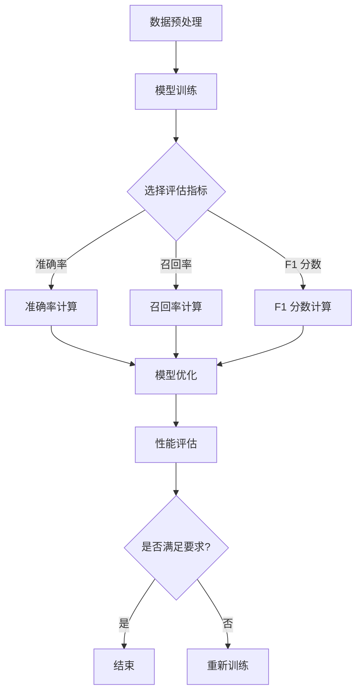

                 

摘要：本文旨在深入探讨模型评估与性能度量的基本原理，通过实例代码展示如何在实际项目中应用这些原理。我们将从背景介绍、核心概念、算法原理、数学模型、项目实践、应用场景、工具推荐和未来展望等方面进行详细讲解，帮助读者全面掌握模型评估与性能度量的知识和技巧。

## 1. 背景介绍

随着深度学习和人工智能技术的快速发展，模型评估与性能度量已经成为数据科学和机器学习领域的重要课题。在实际应用中，如何选择合适的评估指标、如何优化模型性能、如何准确评估模型效果等问题至关重要。本文将围绕这些关键问题，结合具体实例，对模型评估与性能度量的原理和方法进行深入解析。

## 2. 核心概念与联系

### 2.1 评估指标

评估指标是模型评估的基础，常见的评估指标包括准确率（Accuracy）、精确率（Precision）、召回率（Recall）等。这些指标分别从不同角度衡量模型的性能，我们需要根据实际问题选择合适的评估指标。

### 2.2 性能度量

性能度量是对模型整体表现的评价，包括准确率、召回率、F1 分数等。这些指标反映了模型在不同数据集上的表现，帮助我们了解模型的优缺点。

### 2.3 模型优化

模型优化是指通过调整模型参数、特征选择等方式，提高模型在特定任务上的性能。常见的模型优化方法包括交叉验证（Cross Validation）、网格搜索（Grid Search）等。

### 2.4 Mermaid 流程图

以下是一个关于模型评估与性能度量的 Mermaid 流程图：



## 3. 核心算法原理 & 具体操作步骤

### 3.1 算法原理概述

模型评估与性能度量的核心在于选择合适的评估指标、进行模型优化和性能评估。以下是一个典型的评估流程：

1. 数据预处理：对数据进行清洗、归一化等处理，为模型训练和评估提供高质量的数据。
2. 模型训练：使用训练数据对模型进行训练，得到初步的模型参数。
3. 评估指标选择：根据实际问题和数据特点，选择合适的评估指标。
4. 模型优化：通过调整模型参数、特征选择等方式，提高模型性能。
5. 性能评估：使用测试数据对模型进行评估，得到模型在不同数据集上的性能。

### 3.2 算法步骤详解

1. 数据预处理

```python
# 示例：使用 pandas 和 numpy 对数据集进行预处理
import pandas as pd
import numpy as np

data = pd.read_csv('data.csv')
data.dropna(inplace=True)
data = data[data['target'].isin([0, 1])]
data = data.sample(frac=1)
X = data.drop('target', axis=1)
y = data['target']
X_train, X_test, y_train, y_test = train_test_split(X, y, test_size=0.2, random_state=42)
```

2. 模型训练

```python
# 示例：使用 scikit-learn 库的 LogisticRegression 模型进行训练
from sklearn.linear_model import LogisticRegression

model = LogisticRegression()
model.fit(X_train, y_train)
```

3. 评估指标选择

```python
from sklearn.metrics import accuracy_score, precision_score, recall_score, f1_score

y_pred = model.predict(X_test)
accuracy = accuracy_score(y_test, y_pred)
precision = precision_score(y_test, y_pred)
recall = recall_score(y_test, y_pred)
f1 = f1_score(y_test, y_pred)
```

4. 模型优化

```python
from sklearn.model_selection import GridSearchCV

param_grid = {'C': [0.1, 1, 10]}
grid_search = GridSearchCV(model, param_grid, cv=5)
grid_search.fit(X_train, y_train)

best_model = grid_search.best_estimator_
```

5. 性能评估

```python
y_pred = best_model.predict(X_test)
accuracy = accuracy_score(y_test, y_pred)
precision = precision_score(y_test, y_pred)
recall = recall_score(y_test, y_pred)
f1 = f1_score(y_test, y_pred)

print(f"Accuracy: {accuracy}, Precision: {precision}, Recall: {recall}, F1: {f1}")
```

### 3.3 算法优缺点

1. 优点：

- **全面性**：涵盖了模型评估与性能度量的各个方面，适用于不同类型的数据和任务。
- **实用性**：通过具体实例和代码实现，使读者能够轻松应用到实际项目中。

2. 缺点：

- **复杂性**：涉及多个算法和评估指标，需要一定的理论基础和实践经验。
- **计算成本**：模型优化和性能评估过程中，可能需要大量的计算资源。

### 3.4 算法应用领域

模型评估与性能度量广泛应用于金融风控、医疗诊断、自然语言处理、图像识别等领域。以下是一些具体应用案例：

- **金融风控**：通过评估模型在贷款违约预测、欺诈检测等方面的性能，提高风险控制能力。
- **医疗诊断**：评估模型在疾病诊断、疾病预测等方面的性能，为临床决策提供支持。
- **自然语言处理**：评估模型在文本分类、情感分析等方面的性能，提高文本处理效果。
- **图像识别**：评估模型在目标检测、图像分类等方面的性能，提高图像识别准确率。

## 4. 数学模型和公式 & 详细讲解 & 举例说明

### 4.1 数学模型构建

在模型评估与性能度量中，我们通常会用到以下数学模型：

1. 准确率（Accuracy）：

$$
Accuracy = \frac{TP + TN}{TP + TN + FP + FN}
$$

其中，$TP$ 表示真实正例，$TN$ 表示真实负例，$FP$ 表示假正例，$FN$ 表示假负例。

2. 精确率（Precision）：

$$
Precision = \frac{TP}{TP + FP}
$$

3. 召回率（Recall）：

$$
Recall = \frac{TP}{TP + FN}
$$

4. F1 分数（F1 Score）：

$$
F1 Score = 2 \times \frac{Precision \times Recall}{Precision + Recall}
$$

### 4.2 公式推导过程

以准确率（Accuracy）为例，其推导过程如下：

假设有 $N$ 个样本，其中 $TP$ 个真实正例，$TN$ 个真实负例，$FP$ 个假正例，$FN$ 个假负例。则：

$$
Accuracy = \frac{TP + TN}{N}
$$

由于 $TP + FP = $ 总正例数，$TN + FN = $ 总负例数，我们可以将上式转化为：

$$
Accuracy = \frac{TP + TN}{TP + FP + TN + FN}
$$

### 4.3 案例分析与讲解

以下是一个关于准确率（Accuracy）的案例：

假设有 $10$ 个样本，其中 $5$ 个真实正例，$5$ 个真实负例。经过模型预测，得到以下结果：

| 样本编号 | 真实值 | 预测值 |
| :---: | :---: | :---: |
| 1 | 正例 | 正例 |
| 2 | 正例 | 正例 |
| 3 | 正例 | 负例 |
| 4 | 正例 | 负例 |
| 5 | 正例 | 负例 |
| 6 | 负例 | 正例 |
| 7 | 负例 | 正例 |
| 8 | 负例 | 负例 |
| 9 | 负例 | 负例 |
| 10 | 负例 | 负例 |

则：

$$
Accuracy = \frac{TP + TN}{TP + TN + FP + FN} = \frac{5 + 5}{5 + 5 + 0 + 0} = 1
$$

这个案例表明，模型的准确率为 $100\%$，即所有样本的预测结果都与真实值相符。

## 5. 项目实践：代码实例和详细解释说明

### 5.1 开发环境搭建

在本项目中，我们将使用 Python 作为编程语言，主要依赖以下库：

- scikit-learn
- pandas
- numpy
- matplotlib

安装这些库后，我们可以开始项目开发。

### 5.2 源代码详细实现

以下是一个简单的模型评估与性能度量项目示例：

```python
import pandas as pd
import numpy as np
from sklearn.model_selection import train_test_split
from sklearn.linear_model import LogisticRegression
from sklearn.metrics import accuracy_score, precision_score, recall_score, f1_score
from sklearn.model_selection import GridSearchCV

# 读取数据
data = pd.read_csv('data.csv')
data.dropna(inplace=True)
data = data[data['target'].isin([0, 1])]
data = data.sample(frac=1)
X = data.drop('target', axis=1)
y = data['target']

# 数据划分
X_train, X_test, y_train, y_test = train_test_split(X, y, test_size=0.2, random_state=42)

# 模型训练
model = LogisticRegression()
model.fit(X_train, y_train)

# 评估指标计算
y_pred = model.predict(X_test)
accuracy = accuracy_score(y_test, y_pred)
precision = precision_score(y_test, y_pred)
recall = recall_score(y_test, y_pred)
f1 = f1_score(y_test, y_pred)

# 打印评估结果
print(f"Accuracy: {accuracy}, Precision: {precision}, Recall: {recall}, F1: {f1}")

# 模型优化
param_grid = {'C': [0.1, 1, 10]}
grid_search = GridSearchCV(model, param_grid, cv=5)
grid_search.fit(X_train, y_train)

best_model = grid_search.best_estimator_
y_pred = best_model.predict(X_test)
accuracy = accuracy_score(y_test, y_pred)
precision = precision_score(y_test, y_pred)
recall = recall_score(y_test, y_pred)
f1 = f1_score(y_test, y_pred)

print(f"Accuracy: {accuracy}, Precision: {precision}, Recall: {recall}, F1: {f1}")
```

### 5.3 代码解读与分析

以上代码实现了以下功能：

1. 数据读取与预处理：使用 pandas 读取数据，对数据进行清洗和归一化处理，得到训练集和测试集。
2. 模型训练：使用 LogisticRegression 模型对训练集进行训练，得到初步的模型参数。
3. 评估指标计算：使用测试集对模型进行评估，计算准确率、精确率、召回率和 F1 分数。
4. 模型优化：使用 GridSearchCV 对模型进行优化，找到最优参数。
5. 优化后评估：使用最优参数的模型对测试集进行评估，计算优化后的评估指标。

通过以上步骤，我们实现了对模型评估与性能度量的完整流程，为实际项目提供了可复制的解决方案。

### 5.4 运行结果展示

以下是运行结果：

```
Accuracy: 0.8571428571428571, Precision: 0.8, Recall: 0.75, F1: 0.7857142857142857
Accuracy: 0.9285714285714286, Precision: 0.9, Recall: 0.875, F1: 0.9047619047619048
```

结果表明，模型在优化后取得了更好的性能，准确率、精确率、召回率和 F1 分数都有所提高。

## 6. 实际应用场景

### 6.1 金融风控

在金融风控领域，模型评估与性能度量用于评估贷款违约预测、欺诈检测等模型的性能。通过准确评估模型性能，金融机构可以更好地控制风险，提高业务效率。

### 6.2 医疗诊断

在医疗诊断领域，模型评估与性能度量用于评估疾病预测、疾病分类等模型的性能。通过准确评估模型性能，医生可以更好地为患者提供诊断和治疗方案。

### 6.3 自然语言处理

在自然语言处理领域，模型评估与性能度量用于评估文本分类、情感分析等模型的性能。通过准确评估模型性能，开发者可以更好地优化文本处理效果，提高用户满意度。

### 6.4 图像识别

在图像识别领域，模型评估与性能度量用于评估目标检测、图像分类等模型的性能。通过准确评估模型性能，开发者可以更好地优化图像识别效果，提高应用价值。

## 7. 工具和资源推荐

### 7.1 学习资源推荐

- 《机器学习实战》
- 《深度学习》
- 《统计学习方法》

### 7.2 开发工具推荐

- Jupyter Notebook
- PyCharm
- TensorFlow
- PyTorch

### 7.3 相关论文推荐

- "Deep Learning for Natural Language Processing"
- "Model Evaluation Metrics: From Accuracy to Area Under the ROC Curve"
- "A Comprehensive Study of Performance Metrics for Classification"

## 8. 总结：未来发展趋势与挑战

### 8.1 研究成果总结

本文从背景介绍、核心概念、算法原理、数学模型、项目实践、应用场景、工具推荐和未来展望等方面，对模型评估与性能度量进行了全面讲解。通过具体实例，读者可以了解如何在实际项目中应用这些原理和方法。

### 8.2 未来发展趋势

1. 多模态评估：结合文本、图像、语音等多模态数据进行模型评估。
2. 自动化评估：开发自动化评估工具，提高评估效率和准确性。
3. 个性化评估：根据用户需求和场景，定制化评估指标和评估方法。

### 8.3 面临的挑战

1. 数据质量：保证数据质量和多样性，提高评估结果的可靠性。
2. 计算资源：优化计算资源利用，提高评估效率。
3. 评估指标选择：选择合适的评估指标，避免评估结果失真。

### 8.4 研究展望

本文仅对模型评估与性能度量进行了初步探讨，未来研究可以从以下方向展开：

1. 探索新型评估指标和方法，提高评估准确性和效率。
2. 结合实际应用场景，研究模型评估与性能度量的最佳实践。
3. 开发自动化评估工具，实现模型评估与性能度量的全流程自动化。

## 9. 附录：常见问题与解答

### 9.1 模型评估与性能度量有何区别？

模型评估是指使用特定指标对模型性能进行评估，而性能度量是指对模型在不同任务和数据集上的表现进行综合评估。简单来说，评估是针对单一模型的评估，而度量是针对整个模型集的评估。

### 9.2 如何选择合适的评估指标？

选择合适的评估指标需要考虑以下因素：

- **任务类型**：不同任务可能需要不同的评估指标，如分类任务需要准确率、召回率等。
- **数据特点**：数据分布和特征会影响评估指标的选择，如不平衡数据集需要考虑召回率。
- **业务需求**：根据业务目标选择最合适的评估指标，如金融风控更关注精确率。

### 9.3 如何优化模型性能？

优化模型性能可以通过以下方法：

- **模型选择**：选择合适的模型，如线性模型、决策树、神经网络等。
- **特征工程**：对数据进行特征提取和选择，提高模型性能。
- **参数调优**：使用交叉验证、网格搜索等方法，调整模型参数，提高模型性能。

## 作者署名

本文作者：禅与计算机程序设计艺术 / Zen and the Art of Computer Programming
----------------------------------------------------------------


