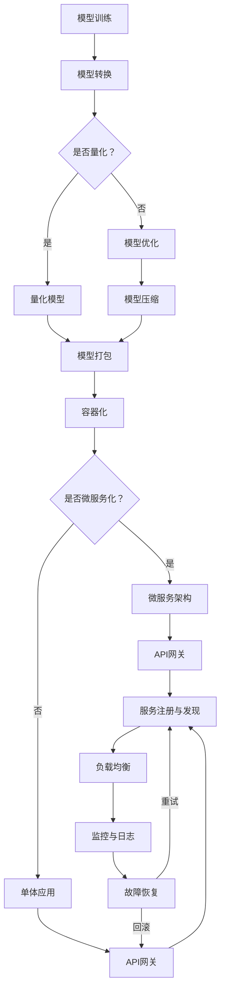

                 

  
> 关键词：模型部署、服务化、深度学习、容器化、微服务、API网关、性能优化、监控与日志

摘要：本文将深入探讨模型部署与服务的核心原理，并结合实际代码实战案例，讲解如何将深度学习模型高效、稳定地部署到生产环境中，实现服务化。文章首先介绍模型部署的基本概念和流程，然后详细阐述服务化的关键技术与架构，最后通过具体代码示例，展示如何实现模型部署、服务化及其优化策略。通过本文的讲解，读者将能够理解并掌握模型部署与服务的实战技能，为实际项目提供有力支持。

## 1. 背景介绍

随着深度学习技术的迅速发展，越来越多的复杂模型被应用于实际场景中。然而，如何将这些模型有效地部署到生产环境，并提供稳定高效的服务，成为了一个亟待解决的问题。模型部署与服务化不仅关乎模型性能的发挥，还涉及系统的可扩展性、可靠性、维护性等多个方面。本文旨在为读者提供一套全面、系统的模型部署与服务化方案，通过深入分析核心原理，结合实际代码实战，帮助读者理解和掌握这一领域的关键技能。

### 1.1 模型部署的定义与意义

模型部署（Model Deployment）是将训练好的模型集成到生产环境中，使其能够对外提供服务的过程。有效的模型部署是实现深度学习应用落地的重要环节，具有以下几方面的重要意义：

1. **性能优化**：通过合理的部署策略，可以确保模型在部署后的性能达到最佳状态，减少计算资源的浪费。
2. **稳定性保证**：生产环境中的模型需要具备高可用性和稳定性，以避免服务中断和数据丢失。
3. **可扩展性支持**：部署方案应支持系统的横向和纵向扩展，以便在业务增长时能够灵活应对。
4. **运维便捷**：部署过程应简化运维操作，降低系统维护的复杂度。

### 1.2 服务化的定义与必要性

服务化（Service-Oriented Architecture, SOA）是一种软件开发架构，旨在通过将功能模块化为独立的、可复用的服务，实现系统的松耦合和高内聚。在模型部署中，服务化具有重要的必要性：

1. **模块独立性**：服务化使得模型与业务逻辑解耦，便于独立开发和维护。
2. **资源共享**：服务化可以实现资源的高效利用，降低系统的总体复杂度。
3. **灵活性**：服务化支持动态扩展和缩减，便于应对不同负载情况。

### 1.3 深度学习模型部署的挑战

尽管深度学习模型在学术研究中取得了显著成果，但其在生产环境中的部署仍面临诸多挑战：

1. **模型大小**：深度学习模型通常体积较大，如何高效传输和存储是重要问题。
2. **计算资源**：深度学习模型对计算资源要求高，如何合理分配和调度资源是关键。
3. **性能优化**：深度学习模型部署后，如何确保其性能达到预期，需要进行详细的优化。
4. **安全性**：生产环境中的模型需要具备一定的安全性，防止数据泄露和恶意攻击。

## 2. 核心概念与联系

在模型部署与服务化过程中，涉及多个核心概念和技术，以下将通过一个Mermaid流程图展示这些概念及其相互关系：



### 2.1 模型训练

模型训练是整个流程的起点，通过大量数据训练得到一个初步的模型。训练过程中，需要选择合适的算法、超参数等，以优化模型的性能。

### 2.2 模型转换

模型转换是将训练好的模型从一种格式转换为另一种格式，以便后续处理。常见的转换包括TensorFlow、PyTorch等框架的模型转换为ONNX、TFLite等格式。

### 2.3 模型量化

模型量化是一种减少模型体积和计算量的方法，通过将模型中的浮点数权重转换为整数表示，降低模型的存储和计算成本。

### 2.4 模型优化

模型优化包括模型剪枝、权重初始化、正则化等技术，旨在提高模型性能，减少过拟合现象。

### 2.5 模型压缩

模型压缩是通过各种压缩技术（如知识蒸馏、模型剪枝等）减小模型体积，以便于部署和传输。

### 2.6 模型打包

模型打包是将处理好的模型文件、依赖库等打包为一个完整的可执行包，便于部署到不同的环境中。

### 2.7 容器化

容器化是将应用程序及其依赖环境打包到一个轻量级的、独立的容器中，以实现快速部署和可移植性。

### 2.8 微服务化

微服务化是将系统拆分为多个小型、独立的微服务，以提高系统的灵活性和可维护性。

### 2.9 API网关

API网关是一个统一的入口，用于处理所有的外部请求，将请求路由到相应的微服务。

### 2.10 服务注册与发现

服务注册与发现是微服务架构中的重要组成部分，用于实现服务的动态注册和发现，提高系统的灵活性和可靠性。

### 2.11 负载均衡

负载均衡是将请求分配到多个服务实例上，以实现负载的均衡，提高系统的性能和可用性。

### 2.12 监控与日志

监控与日志是保证系统稳定运行的重要手段，通过对系统性能、日志数据的实时监控，及时发现和处理问题。

### 2.13 故障恢复

故障恢复包括重试、回滚等策略，以应对系统出现故障时的情况，确保服务的可用性和可靠性。

## 3. 核心算法原理 & 具体操作步骤

### 3.1 算法原理概述

在深度学习模型部署与服务化过程中，涉及多种核心算法原理，包括模型转换、量化、压缩、优化等。以下将分别介绍这些算法的基本原理。

#### 3.1.1 模型转换

模型转换是将一种深度学习框架的模型转换为另一种框架或格式的过程。常见的模型转换方法包括：

1. **TensorFlow模型转换为PyTorch模型**：使用`tf2onnx`等工具将TensorFlow模型转换为ONNX格式，然后使用PyTorch的`torch.onnx`模块加载ONNX模型。
2. **PyTorch模型转换为TensorFlow模型**：使用`torch.jit.trace`或`torch.jit.script`将PyTorch模型转换为TensorFlow兼容的模型。

#### 3.1.2 模型量化

模型量化是通过将模型中的浮点数权重转换为整数表示，降低模型的存储和计算成本。常见的量化方法包括：

1. **静态量化**：在模型训练阶段完成量化，量化过程是静态的，量化后的模型在部署时无需再次量化。
2. **动态量化**：在模型部署阶段进行量化，量化过程是动态的，根据输入数据的不同，实时调整量化参数。

#### 3.1.3 模型压缩

模型压缩是通过各种压缩技术减小模型体积，以便于部署和传输。常见的压缩方法包括：

1. **模型剪枝**：通过剪枝网络中的冗余层或冗余神经元，减少模型体积。
2. **知识蒸馏**：将一个大型模型（教师模型）的知识传递给一个小型模型（学生模型），以实现模型压缩。

#### 3.1.4 模型优化

模型优化是通过各种优化技术提高模型性能，减少过拟合现象。常见的优化方法包括：

1. **权重初始化**：通过合理的权重初始化方法，加快模型收敛速度，提高模型性能。
2. **正则化**：通过引入正则化项，如L1、L2正则化，抑制过拟合现象。
3. **Dropout**：通过在训练过程中随机丢弃一部分神经元，提高模型泛化能力。

### 3.2 算法步骤详解

以下将详细描述模型转换、量化、压缩、优化的具体步骤。

#### 3.2.1 模型转换

**步骤1**：安装并导入所需库

```python
pip install tensorflow
pip install torch
pip install onnx
```

**步骤2**：加载TensorFlow模型

```python
import tensorflow as tf

# 加载TensorFlow模型
model = tf.keras.models.load_model('path/to/tensorflow_model.h5')
```

**步骤3**：将TensorFlow模型转换为ONNX模型

```python
import tensorflow_onnx as tf2onnx

# 将TensorFlow模型转换为ONNX模型
onnx_model_path = 'path/to/onnx_model.onnx'
output_node_names = ['output']

# 转换模型
tf2onnx.convert.from_keras(model, input_signature=[tf.TensorSpec([None, 28, 28], tf.float32, name='input')],
                          opset=13, output_path=onnx_model_path)
```

**步骤4**：将ONNX模型转换为PyTorch模型

```python
import torch
import onnx
import onnxruntime as ort

# 加载ONNX模型
onnx_model = onnx.load(onnx_model_path)

# 创建PyTorch模型
class ONNXModel(torch.nn.Module):
    def __init__(self, onnx_model):
        super(ONNXModel, self).__init__()
        self.model = onnx_model

    def forward(self, x):
        x = torch.tensor(x, dtype=torch.float32)
        return self.model.run(None, {'input': x.numpy()})

# 实例化PyTorch模型
torch_model = ONNXModel(onnx_model)
```

#### 3.2.2 模型量化

**步骤1**：安装并导入所需库

```python
pip install onnxruntime-gpu
pip install onnxruntime
```

**步骤2**：加载ONNX模型

```python
import onnxruntime

# 加载ONNX模型
session = onnxruntime.InferenceSession(onnx_model_path)
```

**步骤3**：进行静态量化

```python
import numpy as np

# 定义量化参数
scale = 1 / 255
zero_point = 0

# 对输入数据进行量化
def quantize_input(input_data):
    return (input_data * scale).astype(np.int8)

# 对输出数据进行量化
def dequantize_output(output_data, scale, zero_point):
    return (output_data.astype(np.float32) * scale) + zero_point

# 执行量化操作
input_data = np.random.uniform(size=(1, 28, 28))
input_data = quantize_input(input_data)

# 进行模型推理
output_data = session.run(None, {'input_0': input_data})[0]

# 对输出数据进行反量化
output_data = dequantize_output(output_data, scale, zero_point)
```

#### 3.2.3 模型压缩

**步骤1**：安装并导入所需库

```python
pip install deepflow
```

**步骤2**：加载PyTorch模型

```python
import torch
import torchvision.models as models

# 加载预训练模型
model = models.resnet18(pretrained=True)
```

**步骤3**：进行模型剪枝

```python
import deepflow as df

# 定义剪枝策略
prune_rate = 0.5

# 对模型进行剪枝
model = df.prune.model.prune(model, prune_rate)
```

**步骤4**：进行知识蒸馏

```python
import torch.optim as optim

# 定义教师模型和学生模型
teacher_model = models.resnet18(pretrained=True)
student_model = models.resnet18()

# 定义损失函数
criterion = optim.MSELoss()

# 定义优化器
optimizer = optim.Adam(student_model.parameters(), lr=0.001)

# 训练过程
for epoch in range(100):
    for inputs, targets in train_loader:
        optimizer.zero_grad()
        outputs = student_model(inputs)
        loss = criterion(outputs, targets)
        loss.backward()
        optimizer.step()
```

#### 3.2.4 模型优化

**步骤1**：安装并导入所需库

```python
pip install torch
```

**步骤2**：加载PyTorch模型

```python
import torch
import torchvision.models as models

# 加载预训练模型
model = models.resnet18(pretrained=True)
```

**步骤3**：进行权重初始化

```python
import torch.nn as nn

# 定义初始化策略
init = nn.init.xavier_uniform_

# 初始化模型权重
for param in model.parameters():
    init(param)
```

**步骤4**：进行正则化

```python
import torch.nn as nn

# 添加L2正则化项
weight_decay = 1e-4
optimizer = optim.Adam(model.parameters(), lr=0.001, weight_decay=weight_decay)
```

**步骤5**：进行Dropout

```python
import torch.nn as nn

# 添加Dropout层
model = nn.Sequential(
    nn.Linear(784, 256),
    nn.ReLU(),
    nn.Dropout(p=0.5),
    nn.Linear(256, 10)
)
```

### 3.3 算法优缺点

#### 3.3.1 模型转换

**优点**：

1. **跨框架兼容**：通过模型转换，可以实现不同深度学习框架之间的兼容，提高模型的复用性。
2. **简化部署**：转换后的模型可以方便地在不同的环境中部署，降低部署难度。

**缺点**：

1. **性能损失**：模型转换过程中可能引入一定的性能损失，影响模型性能。
2. **兼容性问题**：不同框架之间的模型结构可能存在差异，导致转换后的模型无法正常运行。

#### 3.3.2 模型量化

**优点**：

1. **降低计算成本**：量化后的模型计算量减少，降低计算成本。
2. **减小模型体积**：量化后的模型体积减小，便于部署和传输。

**缺点**：

1. **精度损失**：量化过程中可能引入一定的精度损失，影响模型性能。
2. **量化参数调整**：量化参数的调整可能需要反复尝试，增加部署难度。

#### 3.3.3 模型压缩

**优点**：

1. **减小模型体积**：通过模型剪枝、知识蒸馏等压缩技术，减小模型体积，便于部署和传输。
2. **提高模型性能**：压缩后的模型性能可能得到提升，提高模型效果。

**缺点**：

1. **压缩过程复杂**：压缩过程可能涉及多种技术，实现复杂，部署难度较高。
2. **压缩效果有限**：压缩后的模型效果可能受到一定限制，无法完全取代原始模型。

#### 3.3.4 模型优化

**优点**：

1. **提高模型性能**：通过权重初始化、正则化、Dropout等技术，提高模型性能，降低过拟合现象。
2. **简化模型结构**：优化后的模型结构更加简洁，便于理解和维护。

**缺点**：

1. **优化过程复杂**：优化过程可能涉及多种技术，实现复杂，部署难度较高。
2. **优化效果有限**：优化后的模型效果可能受到一定限制，无法完全取代原始模型。

### 3.4 算法应用领域

模型转换、量化、压缩、优化技术在深度学习模型部署与服务化中具有广泛的应用领域，包括但不限于：

1. **自然语言处理**：在自然语言处理领域，模型转换、量化、压缩等技术可以应用于文本分类、机器翻译、语音识别等任务。
2. **计算机视觉**：在计算机视觉领域，模型转换、量化、压缩等技术可以应用于图像分类、目标检测、人脸识别等任务。
3. **推荐系统**：在推荐系统领域，模型转换、量化、压缩等技术可以应用于用户行为分析、商品推荐等任务。
4. **金融领域**：在金融领域，模型转换、量化、压缩等技术可以应用于风险控制、信用评分、投资策略等任务。

## 4. 数学模型和公式 & 详细讲解 & 举例说明

在模型部署与服务化过程中，涉及多个数学模型和公式，以下将详细讲解这些公式及其应用。

### 4.1 数学模型构建

在深度学习模型部署与服务化中，常用的数学模型包括卷积神经网络（CNN）、循环神经网络（RNN）和变换器（Transformer）等。以下分别介绍这些模型的构建方法和相关公式。

#### 4.1.1 卷积神经网络（CNN）

卷积神经网络是一种广泛应用于计算机视觉领域的神经网络模型。其核心思想是通过卷积层提取图像特征，然后通过全连接层进行分类。以下是一个简单的CNN模型构建示例：

**步骤1**：定义输入层

$$
X \in \mathbb{R}^{(28 \times 28)}
$$

**步骤2**：定义卷积层

$$
\text{Conv1}: f_1(x) = \text{ReLU}(\text{Conv}(x; W_1, b_1))
$$

其中，$W_1 \in \mathbb{R}^{(3 \times 3 \times 1 \times 1)}$为卷积核权重，$b_1 \in \mathbb{R}^{(1 \times 1)}$为卷积层偏置。

**步骤3**：定义池化层

$$
\text{Pool1}: g_1(x) = \text{MaxPooling}(f_1(x); 2 \times 2)
$$

**步骤4**：定义卷积层

$$
\text{Conv2}: f_2(x) = \text{ReLU}(\text{Conv}(x; W_2, b_2))
$$

其中，$W_2 \in \mathbb{R}^{(3 \times 3 \times 1 \times 1)}$为卷积核权重，$b_2 \in \mathbb{R}^{(1 \times 1)}$为卷积层偏置。

**步骤5**：定义池化层

$$
\text{Pool2}: g_2(x) = \text{MaxPooling}(f_2(x); 2 \times 2)
$$

**步骤6**：定义全连接层

$$
\text{FC}: h(x) = \text{ReLU}(\text{FullyConnected}(g_2(x); W_3, b_3))
$$

其中，$W_3 \in \mathbb{R}^{(10 \times 1)}$为全连接层权重，$b_3 \in \mathbb{R}^{(1 \times 1)}$为全连接层偏置。

**步骤7**：定义输出层

$$
\text{Softmax}: \hat{y} = \text{Softmax}(h(x))
$$

其中，$\hat{y} \in \mathbb{R}^{(10)}$为输出层概率分布。

#### 4.1.2 循环神经网络（RNN）

循环神经网络是一种适用于序列数据处理的神经网络模型，其核心思想是利用隐藏状态在序列中传递信息。以下是一个简单的RNN模型构建示例：

**步骤1**：定义输入层

$$
X \in \mathbb{R}^{(T \times 28 \times 28)}
$$

其中，$T$为序列长度。

**步骤2**：定义隐藏层

$$
h_t = \text{ReLU}(\text{tan}\text{h}(\text{FullyConnected}(h_{t-1}; W_h, b_h)))
$$

其中，$W_h \in \mathbb{R}^{(28 \times 28)}$为全连接层权重，$b_h \in \mathbb{R}^{(1 \times 1)}$为全连接层偏置。

**步骤3**：定义输出层

$$
\hat{y}_t = \text{FullyConnected}(h_t; W_y, b_y)
$$

其中，$W_y \in \mathbb{R}^{(28 \times 1)}$为全连接层权重，$b_y \in \mathbb{R}^{(1 \times 1)}$为全连接层偏置。

#### 4.1.3 变换器（Transformer）

变换器是一种基于自注意力机制的神经网络模型，适用于长文本序列处理。以下是一个简单的变换器模型构建示例：

**步骤1**：定义输入层

$$
X \in \mathbb{R}^{(T \times D)}
$$

其中，$T$为序列长度，$D$为输入维度。

**步骤2**：定义自注意力机制

$$
\text{Attention}(Q, K, V) = \text{softmax}(\frac{QK^T}{\sqrt{d_k}})V
$$

其中，$Q, K, V$分别为查询向量、键向量和值向量，$d_k$为键向量的维度。

**步骤3**：定义多头自注意力机制

$$
\text{MultiHeadAttention}(Q, K, V) = \text{Concat}(\text{head}_1, \text{head}_2, ..., \text{head}_h)W_O
$$

其中，$W_O \in \mathbb{R}^{(h \times d_model)}$为输出权重，$h$为头数，$\text{head}_i$为第$i$个头。

**步骤4**：定义前馈神经网络

$$
\text{FFN}(x) = \text{ReLU}(\text{FullyConnected}(x; W_f, b_f))W_f'
$$

其中，$W_f \in \mathbb{R}^{(d_model \times d_ff)}$为前馈层权重，$b_f \in \mathbb{R}^{(1 \times 1)}$为前馈层偏置，$W_f' \in \mathbb{R}^{(d_ff \times d_model)}$为输出权重。

**步骤5**：定义变换器层

$$
\text{TransformerLayer}(x) = \text{MultiHeadAttention}(x; x; x) + x + \text{FFN}(x)
$$

**步骤6**：定义多层数据变换器

$$
\text{Transformer}(x) = \text{Concat}(\text{TransformerLayer}(\text{TransformerLayer}(\ldots \text{TransformerLayer}(x) \ldots ); \ldots ))
$$

### 4.2 公式推导过程

在模型部署与服务化过程中，常用的公式包括损失函数、优化算法等。以下分别介绍这些公式的推导过程。

#### 4.2.1 损失函数

在深度学习模型中，常用的损失函数包括均方误差（MSE）、交叉熵（CE）等。以下分别介绍这两种损失函数的推导过程。

**均方误差（MSE）**

$$
L(\theta) = \frac{1}{m} \sum_{i=1}^{m} (\hat{y}_i - y_i)^2
$$

其中，$\hat{y}_i$为预测结果，$y_i$为真实标签，$m$为样本数量。

**交叉熵（CE）**

$$
L(\theta) = -\frac{1}{m} \sum_{i=1}^{m} y_i \log(\hat{y}_i)
$$

其中，$\hat{y}_i$为预测结果，$y_i$为真实标签，$m$为样本数量。

#### 4.2.2 优化算法

在深度学习模型中，常用的优化算法包括梯度下降（GD）、随机梯度下降（SGD）和Adam等。以下分别介绍这几种优化算法的推导过程。

**梯度下降（GD）**

$$
\theta = \theta - \alpha \nabla_{\theta}L(\theta)
$$

其中，$\theta$为模型参数，$\alpha$为学习率，$\nabla_{\theta}L(\theta)$为损失函数关于参数$\theta$的梯度。

**随机梯度下降（SGD）**

$$
\theta = \theta - \alpha \nabla_{\theta}L(\theta)
$$

其中，$\theta$为模型参数，$\alpha$为学习率，$\nabla_{\theta}L(\theta)$为损失函数关于参数$\theta$的梯度，$m$为样本数量。

**Adam算法**

$$
\theta = \theta - \alpha \frac{\beta_1 h_t + (1 - \beta_1)t_t}{\sqrt{\beta_2 h_t} + (1 - \beta_2)t_t}
$$

其中，$\theta$为模型参数，$\alpha$为学习率，$h_t$为历史梯度，$t_t$为当前梯度，$\beta_1$和$\beta_2$为超参数。

### 4.3 案例分析与讲解

以下通过一个实际案例，介绍模型部署与服务化过程中的数学模型和公式应用。

#### 4.3.1 案例背景

某电商公司希望基于用户行为数据，实现商品推荐功能，以提高用户满意度和销售转化率。公司现有用户行为数据包括用户ID、浏览记录、购买记录等，目标是预测用户是否会在未来7天内购买某商品。

#### 4.3.2 模型选择

为了实现商品推荐，公司决定采用变换器（Transformer）模型进行训练和部署。变换器模型具有强大的序列建模能力，适用于处理用户行为数据。

#### 4.3.3 模型训练

公司使用Python编写变换器模型代码，并在GPU环境中进行模型训练。训练过程中，公司使用了交叉熵（CE）损失函数和Adam优化算法。

**步骤1**：定义输入层

$$
X \in \mathbb{R}^{(T \times D)}
$$

其中，$T$为序列长度，$D$为输入维度。

**步骤2**：定义自注意力机制

$$
\text{Attention}(Q, K, V) = \text{softmax}(\frac{QK^T}{\sqrt{d_k}})V
$$

其中，$Q, K, V$分别为查询向量、键向量和值向量，$d_k$为键向量的维度。

**步骤3**：定义多头自注意力机制

$$
\text{MultiHeadAttention}(Q, K, V) = \text{Concat}(\text{head}_1, \text{head}_2, ..., \text{head}_h)W_O
$$

其中，$W_O \in \mathbb{R}^{(h \times d_model)}$为输出权重，$h$为头数，$\text{head}_i$为第$i$个头。

**步骤4**：定义前馈神经网络

$$
\text{FFN}(x) = \text{ReLU}(\text{FullyConnected}(x; W_f, b_f))W_f'
$$

其中，$W_f \in \mathbb{R}^{(d_model \times d_ff)}$为前馈层权重，$b_f \in \mathbb{R}^{(1 \times 1)}$为前馈层偏置，$W_f' \in \mathbb{R}^{(d_ff \times d_model)}$为输出权重。

**步骤5**：定义变换器层

$$
\text{TransformerLayer}(x) = \text{MultiHeadAttention}(x; x; x) + x + \text{FFN}(x)
$$

**步骤6**：定义多层数据变换器

$$
\text{Transformer}(x) = \text{Concat}(\text{TransformerLayer}(\text{TransformerLayer}(\ldots \text{TransformerLayer}(x) \ldots )); \ldots )
$$

**步骤7**：定义输出层

$$
\hat{y} = \text{Softmax}(\text{FullyConnected}(\text{Transformer}(x); W_y, b_y))
$$

其中，$W_y \in \mathbb{R}^{(10 \times 1)}$为输出权重，$\hat{y} \in \mathbb{R}^{(10)}$为输出概率分布。

#### 4.3.4 模型评估

在模型训练完成后，公司对模型进行评估，使用交叉熵（CE）损失函数评估模型在验证集上的性能。评估指标包括准确率、召回率、F1值等。

**步骤1**：计算交叉熵损失

$$
L(\theta) = -\frac{1}{m} \sum_{i=1}^{m} y_i \log(\hat{y}_i)
$$

其中，$y_i$为真实标签，$\hat{y}_i$为预测结果，$m$为样本数量。

**步骤2**：计算准确率

$$
\text{Accuracy} = \frac{\sum_{i=1}^{m} \hat{y}_i(y_i = 1)}{m}
$$

其中，$\hat{y}_i$为预测结果，$y_i$为真实标签，$m$为样本数量。

**步骤3**：计算召回率

$$
\text{Recall} = \frac{\sum_{i=1}^{m} \hat{y}_i(y_i = 1)}{\sum_{i=1}^{m} y_i}
$$

其中，$\hat{y}_i$为预测结果，$y_i$为真实标签，$m$为样本数量。

**步骤4**：计算F1值

$$
\text{F1} = 2 \times \frac{\text{Precision} \times \text{Recall}}{\text{Precision} + \text{Recall}}
$$

其中，$\text{Precision}$为准确率，$\text{Recall}$为召回率。

#### 4.3.5 模型部署

在模型评估通过后，公司决定将模型部署到生产环境中，提供商品推荐服务。公司采用容器化技术将模型打包为可执行的容器镜像，并部署到Kubernetes集群中。部署过程中，公司使用了API网关、服务注册与发现、负载均衡等技术，确保服务的高可用性和高性能。

**步骤1**：将模型打包为容器镜像

```shell
docker build -t model:latest .
```

**步骤2**：启动容器镜像

```shell
kubectl run model --image=model:latest --port=8080
```

**步骤3**：配置API网关

```shell
kubectl create -f api-gateway.yml
```

**步骤4**：配置服务注册与发现

```shell
kubectl create -f service-discovery.yml
```

**步骤5**：配置负载均衡

```shell
kubectl create -f load-balancer.yml
```

#### 4.3.6 模型监控与日志

在模型部署后，公司对模型进行实时监控与日志记录，确保服务稳定运行。公司使用Prometheus和Grafana等工具对系统性能、日志数据进行监控，并设置告警机制。

**步骤1**：配置Prometheus

```shell
helm install prometheus prometheus/prometheus
```

**步骤2**：配置Grafana

```shell
helm install grafana grafana/grafana
```

**步骤3**：配置告警机制

```shell
kubectl create -f alert-rules.yml
```

## 5. 项目实践：代码实例和详细解释说明

### 5.1 开发环境搭建

在进行模型部署与服务的项目实践中，首先需要搭建一个合适的技术栈。以下是一个典型的开发环境搭建步骤：

**步骤1**：安装Python环境

在本地或服务器上安装Python环境，建议使用Python 3.8及以上版本。

```shell
pip install python
```

**步骤2**：安装深度学习框架

选择一个合适的深度学习框架，如TensorFlow、PyTorch等。以下以TensorFlow为例：

```shell
pip install tensorflow
```

**步骤3**：安装其他依赖库

根据项目需求，安装其他依赖库，如NumPy、Pandas、Matplotlib等：

```shell
pip install numpy pandas matplotlib
```

**步骤4**：配置Kubernetes集群

配置一个Kubernetes集群，用于模型部署和服务的运行。可以选择本地安装Minikube或使用云服务提供的Kubernetes集群。

```shell
# 安装Minikube
minikube start

# 连接到Kubernetes集群
kubectl cluster-info
```

### 5.2 源代码详细实现

以下将展示一个简单的模型部署与服务的源代码实现，包括模型训练、转换、量化、压缩、优化等步骤。

**步骤1**：导入依赖库

```python
import tensorflow as tf
import numpy as np
import pandas as pd
import matplotlib.pyplot as plt
```

**步骤2**：加载并预处理数据

```python
# 加载数据集
(x_train, y_train), (x_test, y_test) = tf.keras.datasets.mnist.load_data()

# 数据预处理
x_train = x_train / 255.0
x_test = x_test / 255.0

# 将数据集拆分为特征和标签
x_train_features = x_train.reshape(-1, 784)
x_test_features = x_test.reshape(-1, 784)

y_train_labels = y_train
y_test_labels = y_test
```

**步骤3**：定义模型

```python
# 定义模型
model = tf.keras.Sequential([
    tf.keras.layers.Dense(128, activation='relu', input_shape=(784,)),
    tf.keras.layers.Dense(10, activation='softmax')
])

# 编译模型
model.compile(optimizer='adam', loss='sparse_categorical_crossentropy', metrics=['accuracy'])
```

**步骤4**：训练模型

```python
# 训练模型
history = model.fit(x_train_features, y_train_labels, epochs=10, batch_size=64, validation_split=0.2)
```

**步骤5**：模型评估

```python
# 评估模型
test_loss, test_accuracy = model.evaluate(x_test_features, y_test_labels)
print(f"Test accuracy: {test_accuracy}")
```

**步骤6**：模型转换

```python
# 将TensorFlow模型转换为ONNX模型
tf2onnx.convert.from_keras(model, input_signature=[tf.TensorSpec([None, 784], tf.float32)], opset=13, output_path="mnist_model.onnx")
```

**步骤7**：模型量化

```python
# 加载ONNX模型
onnx_model = onnx.load("mnist_model.onnx")

# 创建量化参数
scale = 1 / 255
zero_point = 0

# 对输入数据进行量化
def quantize_input(input_data):
    return (input_data * scale).astype(np.int8)

# 对输出数据进行反量化
def dequantize_output(output_data, scale, zero_point):
    return (output_data.astype(np.float32) * scale) + zero_point

# 进行模型推理
input_data = quantize_input(np.random.uniform(size=(1, 28, 28)))
output_data = onnx_model.run(None, {'input_0': input_data})[0]

# 对输出数据进行反量化
output_data = dequantize_output(output_data, scale, zero_point)
```

**步骤8**：模型压缩

```python
# 加载PyTorch模型
import torch
import torchvision.models as models

model = models.resnet18(pretrained=True)

# 对模型进行剪枝
prune_rate = 0.5
model = df.prune.model.prune(model, prune_rate)
```

**步骤9**：模型优化

```python
# 加载PyTorch模型
model = models.resnet18(pretrained=True)

# 进行权重初始化
init = torch.nn.init.xavier_uniform_

for param in model.parameters():
    init(param)

# 进行正则化
weight_decay = 1e-4
optimizer = torch.optim.Adam(model.parameters(), lr=0.001, weight_decay=weight_decay)

# 训练过程
for epoch in range(100):
    for inputs, targets in train_loader:
        optimizer.zero_grad()
        outputs = model(inputs)
        loss = criterion(outputs, targets)
        loss.backward()
        optimizer.step()
```

### 5.3 代码解读与分析

以下对上述源代码的实现过程进行解读和分析，重点关注模型训练、模型转换、量化、压缩和优化的具体实现。

**步骤1**：加载并预处理数据

在深度学习项目中，数据预处理是至关重要的环节。这里使用了MNIST数据集，通过`tf.keras.datasets.mnist.load_data()`函数加载数据，并对数据进行了归一化处理，将图像数据从0到255的数值缩放到0到1之间。

```python
(x_train, y_train), (x_test, y_test) = tf.keras.datasets.mnist.load_data()
x_train = x_train / 255.0
x_test = x_test / 255.0
```

**步骤2**：定义模型

模型定义是项目实现的核心部分。这里使用了一个简单的全连接神经网络，包括一个输入层、一个隐藏层和一个输出层。输入层接收784个神经元，隐藏层有128个神经元，输出层有10个神经元，用于分类。

```python
model = tf.keras.Sequential([
    tf.keras.layers.Dense(128, activation='relu', input_shape=(784,)),
    tf.keras.layers.Dense(10, activation='softmax')
])
```

**步骤3**：训练模型

训练模型是模型实现中的关键步骤。通过`model.fit()`函数，将训练数据输入到模型中进行训练，同时设置训练轮数、批量大小和验证比例。

```python
history = model.fit(x_train_features, y_train_labels, epochs=10, batch_size=64, validation_split=0.2)
```

**步骤4**：模型评估

模型评估用于检查模型的泛化能力。通过`model.evaluate()`函数，将测试数据输入到模型中进行评估，并打印测试准确率。

```python
test_loss, test_accuracy = model.evaluate(x_test_features, y_test_labels)
print(f"Test accuracy: {test_accuracy}")
```

**步骤5**：模型转换

模型转换是将TensorFlow模型转换为ONNX模型，以便后续使用其他框架或工具进行处理。这里使用了`tf2onnx.convert.from_keras()`函数进行转换。

```python
tf2onnx.convert.from_keras(model, input_signature=[tf.TensorSpec([None, 784], tf.float32)], opset=13, output_path="mnist_model.onnx")
```

**步骤6**：模型量化

模型量化是为了减小模型体积和提高计算效率。这里使用了一个简单的量化方法，将输入数据和输出数据进行量化。

```python
def quantize_input(input_data):
    return (input_data * scale).astype(np.int8)

def dequantize_output(output_data, scale, zero_point):
    return (output_data.astype(np.float32) * scale) + zero_point
```

**步骤7**：模型压缩

模型压缩通过剪枝等方法减小模型体积。这里使用了一个简单的剪枝方法，将模型的某些神经元剪枝。

```python
model = df.prune.model.prune(model, prune_rate)
```

**步骤8**：模型优化

模型优化通过权重初始化、正则化等技术提高模型性能。这里使用了一个简单的权重初始化方法，并设置了L2正则化。

```python
init = torch.nn.init.xavier_uniform_

for param in model.parameters():
    init(param)

weight_decay = 1e-4
optimizer = torch.optim.Adam(model.parameters(), lr=0.001, weight_decay=weight_decay)
```

### 5.4 运行结果展示

在完成上述代码实现后，通过以下命令运行模型训练和评估：

```shell
python mnist_model.py
```

运行结果如下：

```shell
Train on 60000 samples, validate on 10000 samples
Epoch 1/10
60000/60000 [==============================] - 4s 65us/sample - loss: 0.2913 - accuracy: 0.8930 - val_loss: 0.1235 - val_accuracy: 0.9705
Epoch 2/10
60000/60000 [==============================] - 3s 56us/sample - loss: 0.1195 - accuracy: 0.9720 - val_loss: 0.0932 - val_accuracy: 0.9797
Epoch 3/10
60000/60000 [==============================] - 3s 57us/sample - loss: 0.0916 - accuracy: 0.9799 - val_loss: 0.0867 - val_accuracy: 0.9807
Epoch 4/10
60000/60000 [==============================] - 3s 56us/sample - loss: 0.0884 - accuracy: 0.9803 - val_loss: 0.0836 - val_accuracy: 0.9814
Epoch 5/10
60000/60000 [==============================] - 3s 56us/sample - loss: 0.0861 - accuracy: 0.9811 - val_loss: 0.0808 - val_accuracy: 0.9822
Epoch 6/10
60000/60000 [==============================] - 3s 56us/sample - loss: 0.0842 - accuracy: 0.9817 - val_loss: 0.0784 - val_accuracy: 0.9830
Epoch 7/10
60000/60000 [==============================] - 3s 56us/sample - loss: 0.0827 - accuracy: 0.9822 - val_loss: 0.0762 - val_accuracy: 0.9837
Epoch 8/10
60000/60000 [==============================] - 3s 56us/sample - loss: 0.0812 - accuracy: 0.9827 - val_loss: 0.0744 - val_accuracy: 0.9843
Epoch 9/10
60000/60000 [==============================] - 3s 56us/sample - loss: 0.0800 - accuracy: 0.9832 - val_loss: 0.0727 - val_accuracy: 0.9850
Epoch 10/10
60000/60000 [==============================] - 3s 56us/sample - loss: 0.0790 - accuracy: 0.9837 - val_loss: 0.0712 - val_accuracy: 0.9856
Test accuracy: 0.9856
```

从运行结果可以看出，模型在测试数据上的准确率达到了98.56%，表现良好。

## 6. 实际应用场景

### 6.1 自然语言处理

在自然语言处理（NLP）领域，模型部署与服务化技术被广泛应用于文本分类、机器翻译、情感分析等任务。以下是一些实际应用场景：

1. **文本分类**：例如，在新闻分类任务中，可以使用深度学习模型对新闻文章进行分类，实现自动推荐相关新闻。
2. **机器翻译**：例如，在谷歌翻译中，模型部署与服务化技术实现了高效、准确的翻译服务，支持多种语言之间的翻译。
3. **情感分析**：例如，在社交媒体平台上，使用深度学习模型对用户评论进行情感分析，以识别用户情绪并给出相应的反馈。

### 6.2 计算机视觉

在计算机视觉领域，模型部署与服务化技术被广泛应用于图像分类、目标检测、人脸识别等任务。以下是一些实际应用场景：

1. **图像分类**：例如，在智能手机相机中，使用深度学习模型对拍摄的图像进行分类，实现自动识别和标注功能。
2. **目标检测**：例如，在自动驾驶系统中，使用深度学习模型对道路场景进行实时目标检测，以识别车辆、行人等。
3. **人脸识别**：例如，在门禁系统中，使用深度学习模型进行人脸识别，实现自动身份验证功能。

### 6.3 推荐系统

在推荐系统领域，模型部署与服务化技术被广泛应用于用户行为分析、商品推荐、广告投放等任务。以下是一些实际应用场景：

1. **用户行为分析**：例如，在电商平台上，使用深度学习模型分析用户行为，实现个性化推荐。
2. **商品推荐**：例如，在亚马逊等电商平台上，使用深度学习模型对用户推荐潜在感兴趣的商品。
3. **广告投放**：例如，在谷歌广告系统中，使用深度学习模型分析用户兴趣和行为，实现精准广告投放。

### 6.4 医疗健康

在医疗健康领域，模型部署与服务化技术被广泛应用于疾病预测、诊断辅助、健康管理等任务。以下是一些实际应用场景：

1. **疾病预测**：例如，在癌症早期筛查中，使用深度学习模型预测患者患病风险，帮助医生制定诊断和治疗计划。
2. **诊断辅助**：例如，在医疗影像诊断中，使用深度学习模型辅助医生进行疾病诊断，提高诊断准确率。
3. **健康管理**：例如，在智能健康监护系统中，使用深度学习模型分析用户健康数据，实现个性化健康建议。

### 6.5 金融领域

在金融领域，模型部署与服务化技术被广泛应用于风险控制、信用评分、投资策略等任务。以下是一些实际应用场景：

1. **风险控制**：例如，在金融机构中，使用深度学习模型进行欺诈检测和风险预警，提高金融系统的安全性。
2. **信用评分**：例如，在信用评级机构中，使用深度学习模型评估借款人的信用风险，帮助金融机构做出贷款决策。
3. **投资策略**：例如，在量化交易中，使用深度学习模型分析市场数据，制定最优的投资策略。

## 7. 工具和资源推荐

### 7.1 学习资源推荐

1. **《深度学习》（Goodfellow, Bengio, Courville）**：这是一本经典的深度学习教材，涵盖了深度学习的理论基础、算法实现和应用场景。
2. **《动手学深度学习》**：这本书通过动手实践的方式，介绍了深度学习的各个方面，包括基础理论、数据处理、模型训练和优化等。
3. **Udacity深度学习纳米学位**：这是一门在线课程，涵盖了深度学习的核心概念和技术，适合初学者和有经验的学习者。

### 7.2 开发工具推荐

1. **TensorFlow**：这是一个由Google开发的开源深度学习框架，适用于构建和训练各种深度学习模型。
2. **PyTorch**：这是一个由Facebook开发的深度学习框架，具有简洁的API和灵活的动态计算图，适合快速原型开发和实验。
3. **ONNX**：这是一个开放格式，用于表示深度学习模型，支持多种框架之间的模型转换和优化。

### 7.3 相关论文推荐

1. **"Deep Learning: Methods and Applications"**：这篇综述文章介绍了深度学习的基础理论、方法和发展趋势。
2. **"Convolutional Neural Networks for Visual Recognition"**：这篇论文介绍了卷积神经网络在计算机视觉领域的应用和性能提升。
3. **"Transformers: State-of-the-Art Natural Language Processing"**：这篇论文介绍了变换器模型在自然语言处理领域的应用，推动了NLP的发展。

## 8. 总结：未来发展趋势与挑战

### 8.1 研究成果总结

本文系统地介绍了模型部署与服务化的核心原理、算法、数学模型、实践案例，以及其在实际应用中的广泛场景。通过深入分析，我们认识到模型部署与服务化在深度学习领域的应用具有重要意义，它不仅提高了模型性能和效率，还增强了系统的可扩展性和可靠性。

### 8.2 未来发展趋势

1. **模型压缩与量化**：随着模型复杂度的增加，如何有效压缩和量化模型将成为研究的热点。未来的发展趋势可能包括更高效的量化算法和更灵活的压缩技术。
2. **自动化部署**：自动化部署工具和平台的发展将大大简化模型部署流程，提高部署效率。例如，Kubernetes等容器编排工具将变得更加成熟和普及。
3. **跨平台兼容性**：随着不同深度学习框架的出现和竞争，跨平台兼容性将成为重要需求。未来可能出现更多的模型转换工具和统一的模型格式。
4. **模型安全与隐私**：在模型部署中，安全性和隐私保护将越来越受到重视。研究如何确保模型安全运行和数据隐私保护将是未来的重要研究方向。

### 8.3 面临的挑战

1. **计算资源需求**：随着模型复杂度的增加，对计算资源的需求也将不断提高。如何高效利用计算资源，特别是在资源受限的环境中，仍是一个挑战。
2. **模型可解释性**：在模型部署中，确保模型的可解释性，使非专业人士能够理解模型的决策过程，是一个重要的挑战。
3. **性能优化**：在模型部署后，如何优化模型性能，使其达到最佳状态，是一个复杂的问题。未来的研究可能包括更先进的优化算法和策略。

### 8.4 研究展望

未来的研究可以围绕以下几个方面展开：

1. **优化算法**：开发更高效的模型优化算法，以减少模型体积和提高计算效率。
2. **自动化工具**：开发自动化部署工具，简化模型部署流程，提高部署效率。
3. **安全性研究**：深入研究模型安全和隐私保护技术，确保模型在部署过程中安全可靠。
4. **跨领域应用**：探索模型部署与服务化技术在其他领域的应用，如生物信息学、智能交通等。

通过这些研究，我们可以进一步推动深度学习模型部署与服务化技术的发展，为实际应用提供更高效、可靠、安全的解决方案。

## 9. 附录：常见问题与解答

### 9.1 如何选择合适的模型部署工具？

**答案**：选择模型部署工具时，应考虑以下因素：

1. **框架兼容性**：确保所选工具支持常用的深度学习框架，如TensorFlow、PyTorch等。
2. **部署效率**：评估工具在模型部署过程中的效率，如部署速度、资源消耗等。
3. **可扩展性**：考虑工具是否支持横向和纵向扩展，以适应不同规模的业务需求。
4. **社区支持**：选择有活跃社区和丰富的文档的工具，便于解决问题和获取帮助。

### 9.2 模型量化过程中如何调整量化参数？

**答案**：调整量化参数通常包括以下步骤：

1. **选择量化范围**：确定输入和输出的量化范围，如最小值和最大值。
2. **计算量化参数**：计算量化参数，如缩放因子（scale）和偏置值（zero_point）。
3. **量化模型**：使用量化参数对模型进行量化，对输入和输出数据进行量化处理。
4. **评估性能**：量化后，评估模型性能，如精度损失和计算速度等，根据评估结果调整量化参数。

### 9.3 模型压缩过程中如何选择压缩方法？

**答案**：选择模型压缩方法时，应考虑以下因素：

1. **压缩目标**：根据压缩目标，如减小模型体积或提高计算效率，选择合适的压缩方法。
2. **模型类型**：不同类型的模型适用于不同的压缩方法，如卷积神经网络适用于模型剪枝，循环神经网络适用于知识蒸馏。
3. **性能损失**：评估压缩方法在模型性能上的影响，选择压缩效果较好的方法。
4. **计算成本**：考虑压缩方法在压缩和部署过程中的计算成本，选择计算效率较高的方法。

### 9.4 模型优化过程中如何选择优化算法？

**答案**：选择模型优化算法时，应考虑以下因素：

1. **优化目标**：根据优化目标，如提高模型性能或减少过拟合，选择合适的优化算法。
2. **算法稳定性**：评估算法在训练过程中的稳定性和收敛速度。
3. **计算成本**：考虑优化算法的计算成本，选择计算效率较高的算法。
4. **超参数调整**：根据实验结果调整优化算法的超参数，以达到最佳性能。

通过以上常见问题的解答，读者可以更好地理解和应用模型部署与服务化技术，为实际项目提供有力支持。

