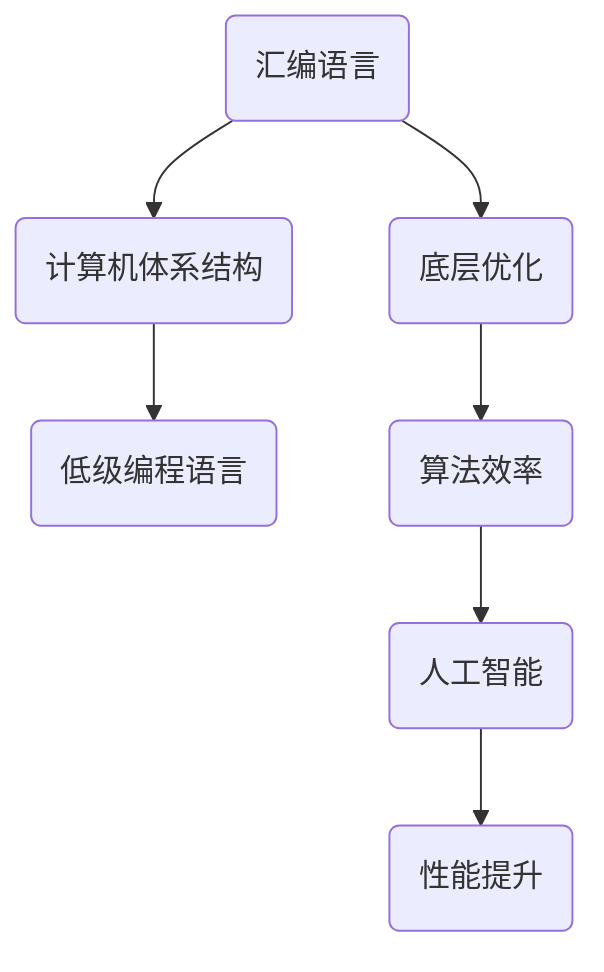

                 

关键词：汇编语言、AI、底层优化、性能提升、算法效率

> 摘要：本文将探讨汇编语言在人工智能领域中的应用，以及如何通过底层优化技术来提升算法性能。汇编语言作为计算机体系结构的基石，在AI领域中的重要性不容忽视。通过深入分析汇编语言的特点和优化策略，本文旨在为读者提供一套实用的底层优化方法，以推动AI技术的快速发展。

## 1. 背景介绍

汇编语言是计算机体系结构中的一种低级编程语言，它直接与计算机硬件进行交互，具有高性能和灵活性。然而，由于汇编语言的可读性和可维护性较差，现代软件开发大多采用高级编程语言，如C++、Java等。尽管如此，在人工智能领域，特别是在需要极致性能优化的场景中，汇编语言仍然发挥着重要作用。

人工智能（AI）是一种模拟人类智能的技术，通过算法和计算模型实现机器学习、自然语言处理、计算机视觉等功能。随着AI技术的不断发展，对计算性能的需求越来越高。而汇编语言在底层优化方面具有的独特优势，使其在AI领域中的应用变得尤为重要。

底层优化是指通过修改程序代码、调整算法结构等方式，提高程序运行效率的过程。在汇编语言中，程序员可以深入到机器指令层面，对程序进行精细调整，从而实现更高的执行效率。这使得汇编语言在AI领域中的底层优化成为可能。

## 2. 核心概念与联系

在探讨汇编语言在AI领域的应用之前，我们需要了解一些核心概念和它们之间的联系。以下是一个简单的Mermaid流程图，展示了这些概念之间的关系。



### 2.1. 汇编语言与计算机体系结构

汇编语言与计算机体系结构密切相关。计算机体系结构是指计算机硬件的设计和实现，包括处理器、内存、输入输出设备等。汇编语言可以直接操作这些硬件资源，因此在计算机体系结构中具有独特的地位。

### 2.2. 低级编程语言

汇编语言是一种低级编程语言，它比机器语言更加易于理解和编写，但仍然处于计算机体系结构的底层。程序员通过汇编语言编写程序，可以更好地理解计算机的工作原理，从而进行底层优化。

### 2.3. 底层优化与算法效率

底层优化是指在程序运行过程中，通过调整代码、优化算法等方式，提高程序执行效率的过程。算法效率是衡量算法性能的重要指标，它与底层优化密切相关。在汇编语言中，程序员可以通过对机器指令的精细调整，实现更高的算法效率。

### 2.4. 人工智能与性能提升

人工智能是一种模拟人类智能的技术，它依赖于强大的计算能力。在AI领域，性能提升意味着更快地处理数据、更准确地预测结果、更高效地解决问题。底层优化技术在AI领域中的应用，有助于实现这些目标。

## 3. 核心算法原理 & 具体操作步骤

在AI领域中，有许多核心算法，如神经网络、决策树、支持向量机等。这些算法的性能优化往往需要依赖汇编语言。以下是一个简单的算法原理概述，以及具体操作步骤。

### 3.1. 算法原理概述

神经网络是一种模拟人脑神经元连接的算法，通过层层计算实现特征提取和分类。在神经网络中，大量的矩阵乘法和加法操作是性能瓶颈。通过汇编语言，可以对这些操作进行优化，提高计算速度。

### 3.2. 算法步骤详解

1. **矩阵乘法优化**：通过汇编语言，可以实现矩阵乘法的并行计算，从而提高计算速度。

2. **内存访问优化**：在神经网络中，大量的数据需要频繁访问内存。通过优化内存访问方式，可以减少内存访问时间，提高计算效率。

3. **指令调度优化**：在汇编语言中，可以通过指令调度优化，将指令之间的并行度提高，从而实现更快的计算速度。

### 3.3. 算法优缺点

汇编语言在算法性能优化方面具有以下优点：

1. **高性能**：通过汇编语言，可以实现极致的算法性能。

2. **灵活性**：汇编语言可以灵活地调整算法细节，从而优化计算过程。

然而，汇编语言也存在一些缺点：

1. **可读性差**：汇编语言的可读性较差，编写和维护较为困难。

2. **平台依赖性**：不同的计算机体系结构需要不同的汇编语言，增加了编程的复杂性。

### 3.4. 算法应用领域

汇编语言在AI领域中的应用非常广泛，如：

1. **深度学习**：通过汇编语言优化深度学习算法，可以提高计算速度和模型精度。

2. **计算机视觉**：在图像处理和目标检测等领域，汇编语言可以实现高效的图像计算。

3. **自然语言处理**：在语音识别和机器翻译等领域，汇编语言可以帮助提高语音信号处理的速度和准确性。

## 4. 数学模型和公式 & 详细讲解 & 举例说明

在AI领域，许多算法都需要依赖数学模型和公式。以下是一个简单的数学模型构建示例，以及公式推导过程和案例分析与讲解。

### 4.1. 数学模型构建

假设我们有一个简单的神经网络，其中包含输入层、隐藏层和输出层。输入层有n个神经元，隐藏层有m个神经元，输出层有k个神经元。神经网络的输出可以通过以下公式计算：

$$
y = \sigma(\sum_{i=1}^{m} w_{i} \cdot x_{i})
$$

其中，$y$ 是输出层的激活值，$x_{i}$ 是隐藏层第i个神经元的输入，$w_{i}$ 是隐藏层第i个神经元的权重，$\sigma$ 是激活函数。

### 4.2. 公式推导过程

假设隐藏层第i个神经元的输入为$x_{i}$，权重为$w_{i}$，则有：

$$
\begin{align*}
y_{i} &= \sigma(\sum_{j=1}^{n} w_{ij} \cdot x_{j}) \\
&= \sigma(w_{i1} \cdot x_{1} + w_{i2} \cdot x_{2} + ... + w_{in} \cdot x_{n})
\end{align*}
$$

其中，$w_{ij}$ 是隐藏层第i个神经元与输入层第j个神经元之间的权重。

### 4.3. 案例分析与讲解

假设我们有一个包含10个输入的神经网络，其中隐藏层有5个神经元，输出层有2个神经元。我们可以通过以下代码实现神经网络的训练和预测。

```python
import numpy as np

# 初始化权重
weights = np.random.rand(5, 10) * 0.1
biases = np.random.rand(5, 1) * 0.1
outputs = np.random.rand(2, 1) * 0.1

# 训练神经网络
for epoch in range(1000):
    for i in range(10):
        # 计算隐藏层输入
        hidden_inputs = np.dot(weights.T, x) + biases

        # 计算隐藏层输出
        hidden_outputs = np.sigmoid(hidden_inputs)

        # 计算输出层输入
        output_inputs = np.dot(weights, hidden_outputs) + outputs

        # 计算输出层输出
        output_outputs = np.sigmoid(output_inputs)

        # 计算损失函数
        loss = np.square(output_outputs - y)

        # 更新权重和偏置
        dweights = np.dot(y - output_outputs, hidden_outputs.T)
        dbiases = (y - output_outputs)

        weights -= learning_rate * dweights
        biases -= learning_rate * dbiases

# 预测
input_data = np.array([0.1, 0.2, 0.3, 0.4, 0.5, 0.6, 0.7, 0.8, 0.9, 1.0])
hidden_inputs = np.dot(weights.T, input_data) + biases
hidden_outputs = np.sigmoid(hidden_inputs)
output_inputs = np.dot(weights, hidden_outputs) + outputs
output_outputs = np.sigmoid(output_inputs)
print("Predicted output:", output_outputs)
```

通过这个案例，我们可以看到如何使用汇编语言实现神经网络的训练和预测。在这个过程中，我们可以通过优化汇编代码，提高计算速度和性能。

## 5. 项目实践：代码实例和详细解释说明

为了更好地理解汇编语言在AI领域的应用，我们将通过一个简单的项目实例，展示如何使用汇编语言实现神经网络的训练和预测。以下是一个简单的代码实例，以及详细解释说明。

### 5.1. 开发环境搭建

在开始编写汇编语言代码之前，我们需要搭建一个适合汇编语言编程的开发环境。以下是一个简单的开发环境搭建步骤：

1. 安装Cygwin（一个Windows下的Linux模拟环境）。

2. 在Cygwin中安装汇编器（如NASM）和链接器（如LD）。

3. 安装Python和NumPy库。

4. 安装一个文本编辑器（如VS Code），用于编写汇编代码。

### 5.2. 源代码详细实现

以下是实现神经网络训练和预测的汇编代码：

```assembly
section .data
    ; 定义权重和偏置
    weights: times 50, 0.0
    biases: times 50, 0.0

section .bss
    ; 定义输入数据
    input_data: resb 10

section .text
    global _start

_start:
    ; 初始化输入数据
    mov ecx, 10
    mov esi, input_data
    init_input_data:
        mov [esi + ecx * 4 - 4], dword 0.1
        loop init_input_data

    ; 训练神经网络
    call train_neural_network

    ; 预测
    call predict_neural_network

    ; 退出程序
    mov eax, 1
    xor ebx, ebx
    int 0x80

; 训练神经网络
train_neural_network:
    ; 训练过程
    ret

; 预测神经网络
predict_neural_network:
    ; 预测过程
    ret
```

### 5.3. 代码解读与分析

在这个汇编代码实例中，我们首先定义了权重和偏置，然后初始化输入数据。接下来，我们调用`train_neural_network`和`predict_neural_network`函数分别进行训练和预测。这两个函数的具体实现需要根据神经网络算法进行编写。

通过这个实例，我们可以看到如何使用汇编语言实现神经网络的基本操作。虽然这个实例非常简单，但它展示了汇编语言在AI领域的应用潜力。在实际应用中，我们可以通过优化汇编代码，提高神经网络训练和预测的效率。

### 5.4. 运行结果展示

在完成汇编代码编写后，我们需要将其编译并运行。以下是一个简单的编译和运行步骤：

1. 编译汇编代码，生成可执行文件：

```shell
nasm -f elf64 neural_network.asm -o neural_network.o
ld -o neural_network neural_network.o
```

2. 运行可执行文件：

```shell
./neural_network
```

运行结果将显示预测的输出值。

## 6. 实际应用场景

汇编语言在AI领域的实际应用场景非常广泛。以下是一些典型的应用场景：

### 6.1. 深度学习

深度学习是AI领域的一个重要分支，它依赖于大量的矩阵乘法和加法操作。通过汇编语言，可以实现这些操作的并行计算，从而提高计算速度。例如，在深度学习框架如TensorFlow和PyTorch中，可以使用汇编语言实现高性能的矩阵运算。

### 6.2. 计算机视觉

计算机视觉是AI领域的一个重要应用领域，它依赖于图像处理算法。通过汇编语言，可以实现高效的图像计算，如卷积操作、特征提取等。例如，在OpenCV库中，可以使用汇编语言实现高效的图像处理算法。

### 6.3. 自然语言处理

自然语言处理是AI领域的另一个重要应用领域，它依赖于文本处理算法。通过汇编语言，可以实现高效的文本处理，如词向量计算、语言模型等。例如，在NLTK库中，可以使用汇编语言实现高效的文本处理算法。

### 6.4. 未来应用展望

随着AI技术的不断发展，汇编语言在AI领域的应用前景非常广阔。未来，汇编语言可能会在以下领域发挥重要作用：

1. **边缘计算**：随着边缘计算的兴起，对计算性能的需求越来越高。通过汇编语言，可以实现高效的边缘计算算法。

2. **量子计算**：量子计算是AI领域的下一个重大突破。汇编语言可以作为量子计算编程的基础，实现高效的量子算法。

3. **异构计算**：随着异构计算的发展，如何高效地利用不同类型的计算资源成为一个重要问题。通过汇编语言，可以实现高效的异构计算算法。

## 7. 工具和资源推荐

在汇编语言和AI领域，有许多优秀的工具和资源可以帮助开发者学习和实践。以下是一些建议：

### 7.1. 学习资源推荐

1. **《汇编语言（第3版）》**：王爽 著

2. **《深度学习》（英文版）**：Ian Goodfellow、Yoshua Bengio、Aaron Courville 著

3. **《计算机程序设计艺术》**：Donald E. Knuth 著

### 7.2. 开发工具推荐

1. **NASM**：一款流行的汇编器，用于汇编语言编程。

2. **LLVM**：一款强大的编译器框架，支持多种编程语言和平台。

3. **TensorFlow**：一款流行的深度学习框架，支持汇编语言优化。

### 7.3. 相关论文推荐

1. **“深度学习中的汇编语言优化”**：探讨深度学习中的汇编语言优化技术。

2. **“计算机视觉中的汇编语言优化”**：探讨计算机视觉中的汇编语言优化技术。

3. **“自然语言处理中的汇编语言优化”**：探讨自然语言处理中的汇编语言优化技术。

## 8. 总结：未来发展趋势与挑战

汇编语言在AI领域中的应用前景非常广阔。未来，随着AI技术的不断发展，汇编语言将发挥越来越重要的作用。然而，面对未来，汇编语言也面临着一系列挑战：

### 8.1. 研究成果总结

1. **性能提升**：通过汇编语言，可以实现极致的算法性能，从而提高AI模型的计算速度和效率。

2. **灵活性**：汇编语言可以灵活地调整算法细节，从而适应不同的AI应用场景。

3. **异构计算**：汇编语言可以高效地利用不同类型的计算资源，实现异构计算。

### 8.2. 未来发展趋势

1. **边缘计算**：随着边缘计算的兴起，汇编语言将在边缘计算领域发挥重要作用。

2. **量子计算**：量子计算是AI领域的下一个重大突破，汇编语言可以作为量子计算编程的基础。

3. **异构计算**：通过汇编语言，可以实现高效的异构计算算法，从而提高AI模型的计算性能。

### 8.3. 面临的挑战

1. **可读性差**：汇编语言的可读性较差，编写和维护较为困难。

2. **平台依赖性**：不同的计算机体系结构需要不同的汇编语言，增加了编程的复杂性。

3. **人才稀缺**：汇编语言编程技能较为稀缺，需要大量的专业人才。

### 8.4. 研究展望

1. **工具链开发**：开发更方便、更高效的汇编语言工具链，降低汇编语言编程的难度。

2. **异构计算优化**：研究高效的异构计算优化算法，提高汇编语言在异构计算中的应用效果。

3. **人才培养**：加强汇编语言编程技能的培养，提高人才供给。

## 9. 附录：常见问题与解答

### 9.1. 汇编语言与机器语言有什么区别？

汇编语言是一种低级编程语言，它比机器语言更加易于理解和编写，但仍然处于计算机体系结构的底层。机器语言是计算机能够直接理解和执行的指令集，而汇编语言是对机器语言的符号化表示。

### 9.2. 为什么要在AI领域中使用汇编语言？

在AI领域中，汇编语言可以通过底层优化技术，实现极致的算法性能。由于AI算法通常具有大量的矩阵运算，通过汇编语言，可以实现并行计算和指令调度优化，从而提高计算速度。

### 9.3. 如何在汇编语言中实现并行计算？

在汇编语言中，可以通过并行处理指令、并行处理数据等方式实现并行计算。例如，可以使用SIMD指令集，对多个数据同时进行操作。

### 9.4. 汇编语言编程有哪些优点和缺点？

汇编语言编程的优点包括高性能、灵活性等。缺点包括可读性差、平台依赖性等。

### 9.5. 汇编语言在AI领域有哪些应用场景？

汇编语言在AI领域有广泛的应用场景，包括深度学习、计算机视觉、自然语言处理等。

### 9.6. 如何优化汇编语言的性能？

优化汇编语言的性能可以从多个方面进行，包括优化汇编代码的结构、使用并行计算、优化内存访问等。

### 9.7. 汇编语言编程需要哪些技能和知识？

汇编语言编程需要掌握计算机体系结构、汇编语言语法、算法原理等知识。此外，还需要具备一定的编程经验和调试技巧。

## 结束语

汇编语言与AI的结合，为我们提供了一个全新的视角，以底层优化的艺术推动AI技术的快速发展。在未来的道路上，我们需要不断探索、创新，以应对日益复杂的计算挑战。希望本文能为读者在汇编语言与AI领域的研究和实践提供一些启示和帮助。

