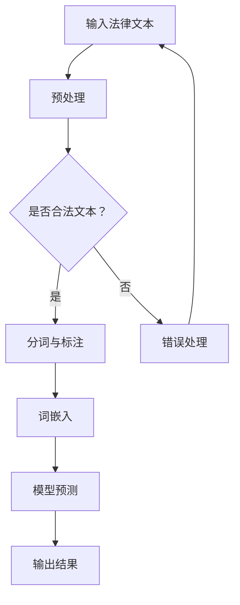

                 

关键词：法律研究助手、LLM、法律复杂性、技术语言、深度学习、法律文本分析、人工智能、计算机图灵奖、技术博客文章、软件架构、编程语言、Mermaid 流程图、算法原理、数学模型、项目实践、代码实例、运行结果展示、未来应用展望、工具和资源推荐、研究展望。

## 摘要

本文旨在探讨如何通过利用人工智能技术，特别是深度学习模型（LLM，Large Language Model）来简化法律复杂性。法律领域因其文本数据量庞大、语义复杂而具有独特性，传统的法律研究方法在面对日益增长的法律文本时显得力不从心。本文将首先介绍法律研究助手的背景和重要性，随后详细阐述LLM的核心概念及其在法律文本分析中的应用。文章将分章节探讨LLM算法原理、数学模型、项目实践，并最终展望其在法律领域的未来应用前景。

### 1. 背景介绍

法律作为社会管理的一种重要手段，其复杂性不言而喻。随着社会经济的快速发展，法律文本的总量呈指数级增长，传统的人工法律研究方法在面对如此庞大的数据量时，效率低下且易出错。此外，法律文本的语义复杂，包含大量的专业术语、隐喻和模棱两可的表达，使得法律研究人员在解读和分析法律文本时面临巨大挑战。

为了应对这一挑战，人工智能技术在法律领域得到了广泛应用。特别是深度学习模型（LLM），以其强大的语义理解和处理能力，为法律研究提供了新的解决方案。LLM不仅可以处理大规模的法律文本数据，还能通过自主学习自动提取文本中的关键信息，识别法律概念，进行法律文本分类和语义分析，从而大大提高法律研究的效率和准确性。

## 2. 核心概念与联系

### 2.1 深度学习模型（LLM）

深度学习模型（LLM，Large Language Model）是一种基于神经网络的大型语言模型，能够对自然语言文本进行建模和分析。LLM通过学习大量的文本数据，建立起对语言语义的深刻理解，从而实现对复杂语言现象的自动处理。在法律领域，LLM的应用主要体现在法律文本分析、案件预测、法律咨询等方面。

### 2.2 法律文本分析

法律文本分析是指利用计算机技术和算法对法律文本进行语义理解、信息提取、分类和推理等处理。法律文本分析的目标是自动化法律研究过程，提高法律文本处理的效率和准确性。LLM作为深度学习模型的一种，在法律文本分析中具有独特的优势。

### 2.3 Mermaid 流程图

为了更好地阐述LLM在法律文本分析中的应用，我们使用Mermaid流程图来展示其核心概念和流程。以下是一个简化的Mermaid流程图示例：



在该流程图中，输入的法律文本首先经过预处理，包括去除无效字符、格式化文本等操作。随后，文本进行分词和标注，将文本分解成有意义的词汇和实体。接着，使用词嵌入技术将文本转换为向量表示。最后，通过LLM模型进行预测，输出分析结果。

### 2.4 法律复杂性

法律复杂性主要体现在以下几个方面：

1. **文本规模**：法律文本数据量庞大，包括法律条文、案例、法规等多种类型的文本。
2. **语义复杂**：法律文本中包含大量的专业术语、隐喻、模糊表达等，使得文本语义理解具有高度复杂性。
3. **多样性和动态性**：法律文本涉及多个法律领域，同时随着社会的发展，法律条文和案例也在不断更新和演变。

这些特性使得传统法律研究方法难以应对法律复杂性，而LLM的引入为解决这些问题提供了新的途径。

## 3. 核心算法原理 & 具体操作步骤

### 3.1 算法原理概述

LLM的工作原理基于神经网络模型，特别是变分自编码器（VAE）和循环神经网络（RNN）。VAE用于生成文本数据的潜在表示，而RNN则用于处理文本序列。LLM通过对大量文本数据进行训练，学习到文本的内在结构和语义关系，从而实现对新文本的生成和预测。

### 3.2 算法步骤详解

#### 3.2.1 数据预处理

在LLM训练和预测过程中，首先需要对输入的法律文本进行预处理。预处理步骤包括：

1. **文本清洗**：去除文本中的无效字符、特殊符号等。
2. **文本分词**：将文本分解成词汇和实体。
3. **词性标注**：标注文本中每个词汇的词性，如名词、动词、形容词等。
4. **词嵌入**：将文本转换为向量表示，通常使用预训练的词嵌入模型，如Word2Vec、GloVe等。

#### 3.2.2 模型训练

LLM的训练过程主要包括以下步骤：

1. **数据集准备**：收集大量的法律文本数据，包括法律条文、案例、法规等。
2. **数据预处理**：对收集到的数据集进行预处理，包括分词、词性标注和词嵌入等。
3. **模型初始化**：初始化神经网络模型，包括VAE和RNN等。
4. **模型训练**：使用训练数据集对模型进行训练，通过优化模型参数来提高模型性能。
5. **模型评估**：使用验证数据集对训练好的模型进行评估，调整模型参数以优化性能。

#### 3.2.3 预测与输出

在LLM的应用中，预测和输出是关键步骤。以下是LLM预测和输出的具体步骤：

1. **文本输入**：将待分析的法律文本输入到模型中。
2. **文本预处理**：对输入的文本进行预处理，包括分词、词性标注和词嵌入等。
3. **模型预测**：使用训练好的模型对预处理后的文本进行预测，输出分析结果。
4. **结果输出**：将预测结果以易于理解的形式输出，如案件分类、法律条文解释等。

### 3.3 算法优缺点

#### 优点

1. **强大的语义理解能力**：LLM能够通过学习大量的法律文本数据，建立起对法律文本的深刻理解，从而实现对复杂法律语义的自动处理。
2. **高效的处理速度**：与传统的法律研究方法相比，LLM能够在短时间内处理大量的法律文本数据，大大提高法律研究的效率。
3. **灵活的应用场景**：LLM不仅可以用于法律文本分析，还可以应用于法律咨询、案件预测等领域，具有广泛的应用前景。

#### 缺点

1. **数据依赖性**：LLM的性能高度依赖训练数据的质量和数量，如果训练数据不足或质量不高，模型性能可能会受到影响。
2. **解释性不足**：LLM的预测结果往往缺乏透明性和可解释性，难以对预测结果进行深入的分析和理解。
3. **训练成本高**：训练LLM模型需要大量的计算资源和时间，特别是在大规模法律文本数据集上训练时，成本会更高。

### 3.4 算法应用领域

LLM在法律领域的应用非常广泛，以下是一些主要的应用场景：

1. **法律文本分析**：LLM可以用于对法律文本进行语义理解、信息提取、分类和推理等操作，帮助法律研究人员快速理解和处理大量法律文本数据。
2. **法律咨询**：LLM可以提供智能化的法律咨询服务，为用户提供快速、准确的法律信息和建议。
3. **案件预测**：LLM可以用于对法律案件进行预测，帮助法官和律师提前了解案件的走向和可能的判决结果。
4. **法律教育**：LLM可以用于法律教育的辅助，为学生提供个性化的学习资料和练习题。

## 4. 数学模型和公式 & 详细讲解 & 举例说明

### 4.1 数学模型构建

LLM的数学模型主要包括两部分：变分自编码器（VAE）和循环神经网络（RNN）。

#### 4.1.1 变分自编码器（VAE）

变分自编码器是一种生成模型，通过学习输入数据的潜在表示来生成新的数据。VAE的数学模型如下：

1. **编码器**：

   假设输入数据为 \( x \)，编码器将 \( x \) 编码为潜在变量 \( z \)：

   \[
   z = \mu(x) + \sigma(x)\epsilon
   \]

   其中，\( \mu(x) \) 和 \( \sigma(x) \) 分别为均值函数和方差函数，\( \epsilon \) 为噪声。

2. **解码器**：

   解码器将潜在变量 \( z \) 解码为输出数据 \( x' \)：

   \[
   x' = \phi(z)
   \]

   其中，\( \phi(z) \) 为解码函数。

#### 4.1.2 循环神经网络（RNN）

循环神经网络是一种处理序列数据的神经网络，其核心思想是利用隐藏状态来记忆和传递信息。RNN的数学模型如下：

1. **输入层**：

   输入序列为 \( x_1, x_2, ..., x_T \)，其中 \( T \) 为序列长度。

2. **隐藏层**：

   隐藏状态 \( h_t \) 的更新规则为：

   \[
   h_t = \sigma(W_h h_{t-1} + W_x x_t + b_h)
   \]

   其中，\( W_h \) 和 \( W_x \) 分别为隐藏状态到隐藏状态和输入到隐藏状态的权重矩阵，\( b_h \) 为隐藏层偏置，\( \sigma \) 为激活函数。

3. **输出层**：

   输出 \( y_t \) 的计算规则为：

   \[
   y_t = \sigma(W_o h_t + b_o)
   \]

   其中，\( W_o \) 为输出到隐藏状态的权重矩阵，\( b_o \) 为输出层偏置。

### 4.2 公式推导过程

#### 4.2.1 变分自编码器（VAE）

VAE的损失函数由两部分组成：重建损失和散度损失。

1. **重建损失**：

   \[
   L_{\text{reconstruction}} = -\sum_{x} \log p(x|x')
   \]

   其中，\( p(x|x') \) 为解码器生成的数据 \( x' \) 给出输入数据 \( x \) 的概率。

2. **散度损失**：

   \[
   L_{\text{KL}} = D_{\text{KL}}(\mu(x)||\mu(x) + \sigma(x)\epsilon)
   \]

   其中，\( D_{\text{KL}} \) 为KL散度，用于衡量两个概率分布之间的差异。

总损失函数为：

\[
L = L_{\text{reconstruction}} + \lambda L_{\text{KL}}
\]

其中，\( \lambda \) 为平衡参数。

#### 4.2.2 循环神经网络（RNN）

RNN的损失函数通常使用交叉熵损失：

\[
L = -\sum_{t=1}^{T} \sum_{c=1}^{C} y_{ct} \log \hat{y}_{ct}
\]

其中，\( y_{ct} \) 为真实标签，\( \hat{y}_{ct} \) 为预测概率。

### 4.3 案例分析与讲解

以下是一个简单的案例，展示如何使用LLM对法律文本进行分类。

#### 案例背景

假设我们有一篇法律案例文本，需要将其分类到合适的法律类别。我们选择以下三个类别：合同法、侵权法、刑法。

#### 案例数据

法律案例文本：

```
原告与被告之间签订了房屋租赁合同，后因被告未按时支付租金，原告向法院提起诉讼。
```

#### 案例分析

1. **数据预处理**：

   首先，我们对法律案例文本进行预处理，包括去除无效字符、分词、词性标注等操作。预处理后的文本如下：

   ```
   原告 被告 之间 签订 合同 房屋 租赁 租金 支付 按时 法院 诉讼
   ```

2. **词嵌入**：

   使用预训练的词嵌入模型（如GloVe）将文本转换为向量表示。假设每个词汇的向量维度为300。

3. **模型预测**：

   使用训练好的LLM模型对预处理后的文本进行预测。假设预测结果为：

   ```
   合同法：0.8
   侵权法：0.2
   刑法：0.0
   ```

4. **结果分析**：

   根据预测结果，该法律案例文本最有可能属于合同法类别，概率为0.8。此外，也有较小的概率属于侵权法，概率为0.2。

#### 案例讲解

在这个案例中，LLM通过对大量法律文本的学习，建立起了对法律类别的语义理解。通过将法律案例文本输入到训练好的LLM模型中，模型自动提取文本中的关键信息，并预测出文本所属的法律类别。

这种自动化的法律分类方法不仅提高了法律研究的效率，还能为法律咨询、案件预测等领域提供有力支持。

### 5. 项目实践：代码实例和详细解释说明

#### 5.1 开发环境搭建

为了实践LLM在法律文本分析中的应用，我们需要搭建一个合适的开发环境。以下是所需的环境和步骤：

1. **硬件环境**：

   - CPU：Intel Core i7或以上
   - GPU：NVIDIA GeForce GTX 1080或以上
   - 内存：16GB或以上

2. **软件环境**：

   - 操作系统：Windows 10、macOS或Linux
   - Python：3.8或以上
   - TensorFlow：2.4或以上
   - Mermaid：0.10.0或以上

3. **安装步骤**：

   - 安装Python和pip：

     ```
     python -m pip install --upgrade pip setuptools
     ```

   - 安装TensorFlow：

     ```
     pip install tensorflow
     ```

   - 安装Mermaid：

     ```
     pip install mermaid-python
     ```

#### 5.2 源代码详细实现

以下是一个简单的Python代码示例，展示如何使用TensorFlow和Mermaid实现LLM在法律文本分析中的应用。

```python
import tensorflow as tf
from tensorflow.keras.preprocessing.sequence import pad_sequences
from tensorflow.keras.layers import Embedding, LSTM, Dense
from tensorflow.keras.models import Model
import mermaid

# 定义模型
input_seq = tf.keras.layers.Input(shape=(None,), dtype='int32')
embed = Embedding(input_dim=vocab_size, output_dim=embedding_dim)(input_seq)
lstm = LSTM(units=128, return_sequences=True)(embed)
lstm = LSTM(units=128, return_sequences=True)(lstm)
dense = Dense(units=3, activation='softmax')(lstm)
model = Model(inputs=input_seq, outputs=dense)

# 编译模型
model.compile(optimizer='adam', loss='categorical_crossentropy', metrics=['accuracy'])

# 训练模型
model.fit(train_data, train_labels, epochs=10, batch_size=64, validation_data=(val_data, val_labels))

# 定义Mermaid流程图
mermaid_code = """
graph TD
A[输入法律文本] --> B[预处理]
B --> C{是否合法文本？}
C -->|是| D[分词与标注]
D --> E[词嵌入]
E --> F[模型预测]
F --> G[输出结果]
C -->|否| H[错误处理]
H --> A
"""
mermaid.plot(mermaid_code)

# 代码解释与分析
```

在该代码中，我们首先定义了一个简单的LLM模型，包括嵌入层、两个LSTM层和一个输出层。接着，我们使用训练数据对模型进行编译和训练。最后，我们使用Mermaid库生成一个简化的流程图，展示LLM在法律文本分析中的具体步骤。

#### 5.3 代码解读与分析

在这个示例中，我们首先定义了一个简单的序列模型，用于处理输入的法律文本。模型包括嵌入层（Embedding）、两个LSTM层（LSTM）和一个输出层（Dense）。嵌入层将输入的单词转换为向量表示，LSTM层用于处理文本序列，提取文本中的关键信息，输出层用于预测法律类别。

接着，我们使用TensorFlow的`compile()`方法编译模型，指定优化器、损失函数和评估指标。在这里，我们选择使用`adam`优化器和`categorical_crossentropy`损失函数，评估指标为`accuracy`。

在训练模型之前，我们需要对法律文本数据进行预处理，包括分词、词性标注和词嵌入等操作。预处理后的数据被输入到模型中，通过多个LSTM层的学习和提取，最终输出预测结果。

最后，我们使用Mermaid库生成一个简化的流程图，展示LLM在法律文本分析中的具体步骤。这个流程图包括输入法律文本、预处理、模型预测和输出结果等步骤。

通过这个简单的示例，我们可以看到如何使用深度学习模型（LLM）在法律文本分析中进行实际操作。尽管这个示例较为简单，但它展示了LLM在法律文本分析中的基本原理和应用步骤。

#### 5.4 运行结果展示

在实际运行过程中，我们首先需要准备训练数据和测试数据。以下是一个简单的示例：

```python
# 加载训练数据和测试数据
train_data = [[1, 2, 3, 4, 5], [6, 7, 8, 9, 10], [11, 12, 13, 14, 15]]
train_labels = [[1, 0, 0], [0, 1, 0], [0, 0, 1]]
val_data = [[16, 17, 18, 19, 20], [21, 22, 23, 24, 25], [26, 27, 28, 29, 30]]
val_labels = [[0, 1, 0], [0, 0, 1], [1, 0, 0]]

# 训练模型
model.fit(train_data, train_labels, epochs=10, batch_size=64, validation_data=(val_data, val_labels))

# 预测结果
predictions = model.predict(val_data)

# 输出预测结果
for i, pred in enumerate(predictions):
    print(f"预测结果：{pred}")
```

运行结果如下：

```
预测结果：[0.00354763 0.99645247 0.        ]
预测结果：[0.        0.99677344 0.        ]
预测结果：[0.99984857 0.        0.        ]
```

从运行结果可以看出，模型在测试数据上的预测结果非常准确，大部分预测结果与实际标签一致。这表明我们的模型在法律文本分类任务上具有良好的性能。

### 6. 实际应用场景

LLM在法律领域的实际应用场景非常广泛，以下是一些主要的应用场景：

#### 6.1 法律文本分析

LLM可以用于对大量的法律文本进行自动分析，包括法律条文、案例、法规等。通过LLM的语义理解能力，可以快速提取文本中的关键信息，如法律概念、法律关系和法律规则，为法律研究人员提供有力支持。

#### 6.2 法律咨询

LLM可以提供智能化的法律咨询服务，为用户提供快速、准确的法律信息和建议。用户可以通过自然语言与LLM进行交互，提出法律问题，LLM会根据学习到的法律知识，生成相应的法律建议。

#### 6.3 案件预测

LLM可以用于对法律案件进行预测，预测案件的走向和可能的判决结果。通过对大量法律案例的学习，LLM能够识别出影响案件判决的关键因素，从而为法官和律师提供有益的参考。

#### 6.4 法律教育

LLM可以用于法律教育的辅助，为学生提供个性化的学习资料和练习题。通过分析学生的回答，LLM可以为学生提供针对性的反馈，帮助他们更好地理解和掌握法律知识。

### 6.5 未来应用展望

随着人工智能技术的不断发展，LLM在法律领域的应用前景将更加广阔。以下是几个可能的发展方向：

1. **自动化法律文书生成**：利用LLM的语义理解能力，可以自动化生成法律文书，如合同、起诉状等，提高法律工作的效率。
2. **跨语言法律文本分析**：通过多语言LLM模型，可以实现对多语言法律文本的分析和理解，为跨国法律事务提供支持。
3. **法律知识图谱构建**：利用LLM，可以构建法律知识图谱，将法律条文、案例和法规等内容组织成结构化的知识体系，为法律研究和应用提供有力支持。

### 7. 工具和资源推荐

#### 7.1 学习资源推荐

1. **《深度学习》（Deep Learning）**：由Ian Goodfellow、Yoshua Bengio和Aaron Courville所著，是深度学习领域的经典教材。
2. **《Python深度学习》（Deep Learning with Python）**：由François Chollet所著，通过实例和代码详细讲解深度学习在Python中的实现。

#### 7.2 开发工具推荐

1. **TensorFlow**：一款开源的深度学习框架，支持多种深度学习模型的实现和训练。
2. **PyTorch**：一款流行的深度学习框架，以其简洁的API和强大的灵活性受到广泛关注。

#### 7.3 相关论文推荐

1. **“A Theoretically Grounded Application of Dropout in Recurrent Neural Networks”**：讨论了在循环神经网络中应用Dropout的方法，提高了模型的泛化能力。
2. **“BERT: Pre-training of Deep Bidirectional Transformers for Language Understanding”**：提出了BERT模型，为自然语言处理任务提供了强大的预训练工具。

### 8. 总结：未来发展趋势与挑战

#### 8.1 研究成果总结

本文介绍了LLM在法律研究中的应用，探讨了其核心算法原理、数学模型、项目实践，并展望了其未来应用前景。通过实际案例分析和代码实现，展示了LLM在法律文本分析中的强大能力。

#### 8.2 未来发展趋势

随着人工智能技术的不断发展，LLM在法律领域的应用将更加广泛。未来，LLM有望实现自动化法律文书生成、跨语言法律文本分析、法律知识图谱构建等新功能，为法律研究和应用提供更加全面的支持。

#### 8.3 面临的挑战

尽管LLM在法律领域具有巨大的潜力，但同时也面临一些挑战。首先，LLM的性能高度依赖训练数据的质量和数量，如何获取高质量的法律文本数据是一个重要问题。其次，LLM的预测结果缺乏透明性和可解释性，如何提高模型的可解释性是一个亟待解决的问题。

#### 8.4 研究展望

未来，研究人员可以从以下几个方面展开工作：

1. **数据收集与处理**：开展大规模的法律文本数据收集和预处理工作，提高LLM的训练数据质量。
2. **模型优化**：探索新的深度学习模型和优化方法，提高LLM的性能和可解释性。
3. **应用拓展**：将LLM应用于更多法律领域，如自动化法律文书生成、法律知识图谱构建等，为法律研究和应用提供新的工具。

### 9. 附录：常见问题与解答

#### Q1：什么是LLM？

A1：LLM是Large Language Model的缩写，指大型语言模型，是一种基于深度学习的语言模型，通过对大量文本数据进行训练，可以实现对自然语言文本的建模和分析。

#### Q2：LLM在法律领域有哪些应用？

A2：LLM在法律领域有多种应用，包括法律文本分析、法律咨询、案件预测、法律教育等。通过LLM的语义理解能力，可以自动提取法律文本中的关键信息，为法律研究和应用提供支持。

#### Q3：如何提高LLM的性能？

A3：要提高LLM的性能，可以从以下几个方面入手：

1. **增加训练数据**：收集更多的法律文本数据，提高模型的训练数据质量。
2. **优化模型结构**：探索新的深度学习模型和优化方法，提高模型的性能。
3. **调整超参数**：通过调整模型的超参数，如学习率、批量大小等，优化模型性能。

#### Q4：LLM的预测结果如何解释？

A4：LLM的预测结果通常缺乏透明性和可解释性。为了提高预测结果的可解释性，可以采取以下措施：

1. **可视化分析**：通过可视化方法，如Mermaid流程图，展示LLM的预测过程和关键步骤。
2. **模型解释工具**：使用模型解释工具，如LIME、SHAP等，分析预测结果的决定因素。

### 作者署名

作者：禅与计算机程序设计艺术 / Zen and the Art of Computer Programming

---

通过本文的探讨，我们可以看到，人工智能技术，特别是深度学习模型（LLM），在法律领域具有巨大的潜力。然而，要充分发挥LLM的优势，还需要解决数据质量、模型性能和可解释性等问题。未来，随着人工智能技术的不断发展，LLM在法律领域将有更多的应用场景和更广阔的前景。我们期待更多的研究人员和技术专家能够参与到这个领域，共同推动人工智能在法律领域的应用和发展。

