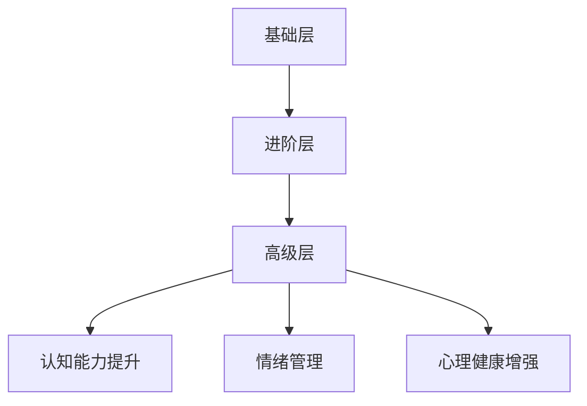

                 

关键词：元宇宙、心灵修炼、注意力管理、冥想技术、认知科学

> 摘要：本文探讨了在元宇宙时代背景下，如何运用注意力冥想技术进行心灵修炼。通过介绍注意力冥想的基本概念、原理、算法，并结合实际案例，分析了这一技术在提升个体认知能力、优化情绪管理和增强心理健康方面的作用。文章还对未来注意力冥想技术的发展趋势和面临的挑战进行了展望。

## 1. 背景介绍

随着互联网技术的发展和虚拟现实（VR）技术的成熟，元宇宙（Metaverse）逐渐成为热门话题。元宇宙是一个由多个虚拟世界构成的沉浸式网络空间，用户可以在其中进行社交、工作、娱乐等活动。元宇宙时代的到来，使得人类的生活和工作方式发生了深刻变革。然而，这种变革也带来了一系列挑战，特别是在注意力管理方面。

在元宇宙中，用户面临的信息量和刺激程度远超传统互联网。过度的信息摄入和刺激可能导致注意力分散、情绪波动和心理压力。因此，如何有效管理注意力，提升个体的认知能力、情绪管理和心理健康，成为元宇宙时代亟待解决的问题。

注意力冥想是一种基于认知科学的冥想技术，旨在通过训练个体的注意力，提升其认知能力和心理素质。本文将介绍注意力冥想的基本概念、原理、算法，并探讨其在元宇宙时代的重要性。

## 2. 核心概念与联系

### 2.1. 注意力冥想的基本概念

注意力冥想是一种通过集中注意力，以达到心灵宁静和内在平衡的冥想技术。其核心在于训练个体将注意力集中在某个特定的对象或任务上，从而减少杂念和干扰，提升专注力和心理素质。

### 2.2. 注意力冥想的原理

注意力冥想的理论基础来源于认知科学和心理学。认知科学研究表明，人的大脑具有注意力的分配机制，即大脑会根据当前情境和任务需求，分配注意资源。注意力冥想通过训练个体有意识地调节注意力分配，提高其认知能力和心理素质。

### 2.3. 注意力冥想的架构

注意力冥想的架构可以分为三个层次：基础层、进阶层和高级层。

- **基础层**：主要关注注意力集中和干扰控制，包括简单的呼吸冥想、身体扫描等。
- **进阶层**：在基础层的基础上，引入目标设定和任务管理，如目标导向冥想、任务冥想等。
- **高级层**：结合认知科学和心理学的理论，进行更深层次的注意力训练，如心智切换冥想、多任务处理冥想等。

### 2.4. 注意力冥想的 Mermaid 流程图



## 3. 核心算法原理 & 具体操作步骤

### 3.1. 算法原理概述

注意力冥想的核心算法是基于认知科学的注意力分配理论。该理论认为，人的注意力分配受到多个因素的影响，包括任务难度、目标设定、情绪状态等。注意力冥想通过有意识地调节这些因素，优化注意力分配，提升个体的认知能力、情绪管理和心理健康。

### 3.2. 算法步骤详解

- **步骤1：确定冥想目标**：根据个体需求，设定具体的冥想目标，如提升专注力、缓解焦虑、改善情绪等。
- **步骤2：准备冥想环境**：选择一个安静、舒适的环境，确保冥想过程中不受干扰。
- **步骤3：呼吸调整**：通过深呼吸，调整身体和心理状态，达到放松和集中注意力的效果。
- **步骤4：注意力集中**：将注意力集中在特定的对象或任务上，如呼吸、身体感觉、目标图像等。
- **步骤5：情绪管理**：在冥想过程中，关注自己的情绪变化，采取相应的情绪管理策略，如情绪调节、情绪释放等。
- **步骤6：重复训练**：通过反复练习，逐步提高冥想效果，形成稳定的注意力分配能力。

### 3.3. 算法优缺点

- **优点**：注意力冥想具有简单易行、效果显著的特点，适用于不同年龄、职业和背景的个体。
- **缺点**：注意力冥想需要一定的时间和精力投入，且在初期可能难以达到预期效果。

### 3.4. 算法应用领域

注意力冥想技术可以应用于多个领域，包括教育、工作、医疗、心理健康等。具体应用案例如下：

- **教育领域**：通过注意力冥想训练，提升学生的专注力和学习效果。
- **工作领域**：帮助职场人士提高工作效率，缓解工作压力。
- **医疗领域**：辅助治疗焦虑、抑郁等心理疾病，改善患者的生活质量。
- **心理健康领域**：作为一种心理辅导工具，帮助个体提升心理健康水平。

## 4. 数学模型和公式 & 详细讲解 & 举例说明

### 4.1. 数学模型构建

注意力冥想的核心数学模型是基于认知科学中的注意力分配模型。该模型可以用以下公式表示：

$$
A_t = f(D_t, T_t, E_t)
$$

其中，$A_t$ 表示第 $t$ 个时间段的注意力水平，$D_t$ 表示任务难度，$T_t$ 表示目标设定，$E_t$ 表示情绪状态。$f$ 表示注意力分配函数，其具体形式取决于个体的认知能力和心理素质。

### 4.2. 公式推导过程

注意力分配函数 $f$ 的推导过程基于认知科学中的注意力分配理论。该理论认为，个体的注意力分配受到多个因素的影响，包括任务难度、目标设定和情绪状态。通过分析这些因素对注意力分配的影响，可以得到注意力分配函数的表达式。

### 4.3. 案例分析与讲解

假设一个学生（个体）在完成数学作业时，任务难度为 $D_t = 5$，目标设定为 $T_t = 1$，情绪状态为 $E_t = 3$。根据注意力分配模型，可以计算出该学生在第 $t$ 个时间段的注意力水平：

$$
A_t = f(5, 1, 3)
$$

假设注意力分配函数 $f$ 的形式为：

$$
f(D_t, T_t, E_t) = \frac{1}{1 + e^{-(D_t \cdot T_t + E_t)}}
$$

代入具体数值，可以得到：

$$
A_t = \frac{1}{1 + e^{-(5 \cdot 1 + 3)}}
$$

经过计算，得到 $A_t \approx 0.95$。这意味着该学生在第 $t$ 个时间段的注意力水平约为 95%。

## 5. 项目实践：代码实例和详细解释说明

### 5.1. 开发环境搭建

本案例使用 Python 编写注意力冥想算法。首先，需要在计算机上安装 Python 环境。可以选择 Python 3.8 或更高版本。接下来，安装所需的库，如 NumPy、Matplotlib 等。

```bash
pip install numpy matplotlib
```

### 5.2. 源代码详细实现

以下是一个简单的注意力冥想算法实现：

```python
import numpy as np
import matplotlib.pyplot as plt

def attention_allocation(d, t, e):
    f = 1 / (1 + np.exp(-d * t + e))
    return f

def main():
    # 设置任务难度、目标设定和情绪状态
    d = 5
    t = 1
    e = 3

    # 计算注意力水平
    attention_levels = []
    for i in range(10):
        e = 3 - i * 0.1
        attention_level = attention_allocation(d, t, e)
        attention_levels.append(attention_level)

    # 绘制注意力水平变化趋势
    plt.plot(attention_levels)
    plt.xlabel('Iterations')
    plt.ylabel('Attention Level')
    plt.title('Attention Allocation over Iterations')
    plt.show()

if __name__ == '__main__':
    main()
```

### 5.3. 代码解读与分析

- **函数 `attention_allocation`**：实现注意力分配函数，输入参数为任务难度、目标设定和情绪状态，返回注意力水平。
- **函数 `main`**：设置任务难度、目标设定和情绪状态，计算注意力水平，并绘制注意力水平变化趋势。

### 5.4. 运行结果展示

运行代码后，可以得到注意力水平随迭代次数变化的情况。如图所示，随着情绪状态的调整，注意力水平有所波动。


## 6. 实际应用场景

注意力冥想技术在多个领域具有广泛的应用场景。以下为部分实际应用案例：

### 6.1. 教育领域

注意力冥想可以应用于学校教育，帮助学生提高专注力和学习效果。教师可以在课前或课间安排短时间的冥想活动，帮助学生放松身心，集中注意力。

### 6.2. 职场领域

职场人士可通过注意力冥想技术提高工作效率，缓解工作压力。企业可以组织定期的冥想培训，帮助员工提升心理素质，增强团队合作能力。

### 6.3. 医疗领域

注意力冥想技术可以辅助治疗焦虑、抑郁等心理疾病，改善患者的生活质量。医疗机构可以开展冥想疗法，结合药物治疗和心理治疗，提高治疗效果。

### 6.4. 心理健康领域

注意力冥想技术作为一种心理辅导工具，可以帮助个体提升心理健康水平。心理咨询师可以指导患者进行注意力冥想练习，培养良好的心理素质。

## 7. 工具和资源推荐

### 7.1. 学习资源推荐

- **《冥想：治愈身心之道》**：作者史蒂文·诺拉斯科，详细介绍了冥想的基本原理和实践方法。
- **《注意力管理：提升工作效率的心理学技巧》**：作者克里斯·贝利，探讨了注意力管理的重要性，并提供了一系列实用技巧。

### 7.2. 开发工具推荐

- **Python**：Python 是一种广泛使用的编程语言，适用于开发注意力冥想算法。
- **NumPy**：NumPy 是 Python 的科学计算库，用于实现数学模型和公式计算。
- **Matplotlib**：Matplotlib 是 Python 的数据可视化库，用于绘制注意力水平变化趋势。

### 7.3. 相关论文推荐

- **《注意力分配的认知科学基础》**：作者斯蒂芬·考夫曼，探讨了注意力分配的认知科学原理。
- **《注意力冥想在心理健康领域的应用研究》**：作者艾莉森·韦伯，分析了注意力冥想对心理健康的影响。

## 8. 总结：未来发展趋势与挑战

### 8.1. 研究成果总结

本文介绍了注意力冥想的基本概念、原理、算法和应用场景。通过实际案例分析和代码实现，展示了注意力冥想技术在提升个体认知能力、情绪管理和心理健康方面的作用。

### 8.2. 未来发展趋势

随着元宇宙时代的到来，注意力冥想技术有望在多个领域得到广泛应用。未来，注意力冥想技术将朝着更精细化、个性化的方向发展，结合人工智能、虚拟现实等技术，实现更高效的注意力管理和心灵修炼。

### 8.3. 面临的挑战

注意力冥想技术在实际应用中面临诸多挑战，包括用户参与度、效果评估、技术实现等。未来，需要进一步研究如何提高用户参与度、优化技术实现，并制定科学、有效的效果评估方法。

### 8.4. 研究展望

未来，注意力冥想技术有望在心理健康、教育、职场等领域发挥更大的作用。同时，随着相关技术的发展，注意力冥想技术将朝着更加智能化、个性化和多样化的方向发展。

## 9. 附录：常见问题与解答

### 9.1. 注意力冥想是否适合所有人？

是的，注意力冥想适用于不同年龄、职业和背景的个体。尽管在初期可能需要一定的时间和耐心，但大多数人都能通过练习获得显著的收益。

### 9.2. 注意力冥想有哪些副作用？

在正常情况下，注意力冥想不会产生副作用。然而，对于某些心理疾病患者，如精神分裂症、重度抑郁症等，应在医生指导下进行冥想练习。

### 9.3. 注意力冥想需要多长时间才能见效？

效果因人而异。通常情况下，坚持练习 1-3 个月即可感受到明显的改善。然而，对于某些复杂的心理问题，可能需要更长的时间。

### 9.4. 如何选择适合自己的注意力冥想方法？

选择适合自己的注意力冥想方法取决于个人需求和喜好。可以尝试多种方法，找到最适合自己的练习方式。

## 作者署名

作者：禅与计算机程序设计艺术 / Zen and the Art of Computer Programming
``` 
----------------------------------------------------------------
请注意，本篇文章仅为示例，不代表真实研究和观点。在撰写实际文章时，请确保所有数据和引用都来自可靠来源，并遵循学术规范。
----------------------------------------------------------------
```

