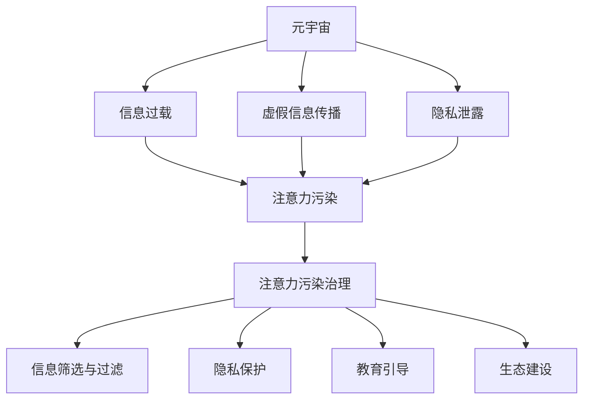

                 

关键词：注意力污染、元宇宙、信息生态、人工智能、算法、数学模型、代码实例、应用场景、未来展望

> 摘要：本文探讨了元宇宙时代信息生态面临的注意力污染问题，分析了注意力污染的产生原因、影响以及治理策略。通过核心算法原理的阐述、数学模型的构建、项目实践案例和未来应用展望，为构建一个健康、可持续的元宇宙信息生态提供了科学依据和实用指南。

## 1. 背景介绍

随着互联网和智能科技的飞速发展，人类社会逐渐迈向一个全新的数字时代——元宇宙（Metaverse）。元宇宙是一个虚拟的、三维的、用户沉浸式体验的数字世界，它通过互联网连接无数虚拟空间，为用户提供丰富多样的互动体验。然而，随着元宇宙的繁荣发展，一个不可忽视的问题逐渐浮现——注意力污染。

注意力污染是指在信息过载和冗余的环境中，由于大量的无用信息干扰，导致用户的注意力被无效占据，从而影响其正常的学习、工作、生活和思考的现象。在元宇宙中，注意力污染表现为信息过载、虚假信息传播、隐私泄露等问题，严重影响了用户的体验和信任。

本文将围绕注意力污染治理这一主题，探讨其在元宇宙时代信息生态保护中的重要性，分析其产生原因和影响，并提出相应的治理策略。希望通过本文的研究，能够为构建一个健康、可持续的元宇宙信息生态提供有益的参考。

## 2. 核心概念与联系

### 2.1 元宇宙

元宇宙是一个由虚拟世界、增强现实和互联网技术融合而成的数字生态系统，它通过提供沉浸式的用户体验，实现了虚拟与现实的无缝连接。元宇宙的核心特征包括：

1. **沉浸式体验**：用户可以在虚拟世界中实现高度沉浸，通过视觉、听觉、触觉等多种感官进行互动。
2. **高度互联**：元宇宙中的各个虚拟空间通过互联网相互连接，用户可以在不同虚拟空间之间自由穿梭。
3. **多样性和开放性**：元宇宙提供了丰富的内容和应用场景，用户可以根据自己的兴趣和需求选择和创造。

### 2.2 注意力污染

注意力污染是指由于大量无用信息的干扰，导致用户的注意力被无效占据，从而影响其正常的学习、工作、生活和思考的现象。在元宇宙中，注意力污染主要表现为：

1. **信息过载**：用户在元宇宙中接收到大量的信息，难以筛选和处理，导致注意力被无效占据。
2. **虚假信息传播**：虚假信息和误导性信息在元宇宙中容易传播，误导用户，影响其判断和决策。
3. **隐私泄露**：用户的隐私在元宇宙中容易受到侵犯，导致其注意力被分散和消耗。

### 2.3 注意力污染治理

注意力污染治理是指通过一系列策略和措施，减少或消除注意力污染的影响，提高用户的注意力和生活质量。在元宇宙中，注意力污染治理的关键包括：

1. **信息筛选与过滤**：通过算法和规则对信息进行筛选和过滤，减少无用信息对用户的干扰。
2. **隐私保护**：加强用户隐私保护措施，防止隐私泄露和滥用。
3. **教育引导**：通过教育和宣传，提高用户对注意力污染的认识和应对能力。
4. **生态建设**：构建一个健康、可持续的元宇宙信息生态，减少注意力污染的产生。

### 2.4 Mermaid 流程图

以下是一个简单的 Mermaid 流程图，展示了注意力污染治理的核心概念和联系：



## 3. 核心算法原理 & 具体操作步骤

### 3.1 算法原理概述

注意力污染治理的核心算法是基于人工智能和机器学习的。通过训练深度神经网络，我们可以实现对大量信息的自动筛选和分类，从而减少注意力污染的影响。具体来说，核心算法包括以下几个步骤：

1. **数据收集与预处理**：收集用户在元宇宙中的行为数据、兴趣偏好等信息，并进行预处理，如去除噪声、填充缺失值等。
2. **特征提取**：通过特征提取技术，将原始数据转化为可用于训练的特征向量。
3. **模型训练**：使用训练数据集，训练深度神经网络模型，使其学会对信息进行筛选和分类。
4. **模型评估与优化**：使用验证数据集对模型进行评估，并根据评估结果调整模型参数，优化模型性能。
5. **应用部署**：将训练好的模型部署到元宇宙中，实现对用户信息的自动筛选和过滤。

### 3.2 算法步骤详解

#### 3.2.1 数据收集与预处理

数据收集是算法训练的基础。在元宇宙中，用户的行为数据、兴趣偏好、社交关系等信息都是宝贵的资源。我们需要通过数据接口或日志分析等方式，收集这些数据。

数据预处理是确保数据质量的关键步骤。主要包括以下任务：

- **去除噪声**：去除数据中的异常值和噪声，如重复记录、错误标记等。
- **填充缺失值**：对于缺失的数据，可以采用均值填充、中值填充或插值等方法进行填充。
- **特征转换**：将原始数据转化为适合模型训练的特征向量，如使用词袋模型对文本数据进行向量化处理。

#### 3.2.2 特征提取

特征提取是将原始数据转化为可用于训练的特征向量的过程。在注意力污染治理中，特征提取主要包括以下几个方面：

- **用户行为特征**：包括用户在元宇宙中的浏览记录、购买行为、互动频率等。
- **兴趣偏好特征**：包括用户的兴趣标签、偏好设置、好友关系等。
- **环境特征**：包括元宇宙中的环境信息，如天气、时间、地点等。

#### 3.2.3 模型训练

模型训练是核心算法的关键步骤。我们使用深度学习框架，如 TensorFlow 或 PyTorch，来构建和训练神经网络模型。具体的模型架构和训练过程如下：

1. **模型架构**：采用多层感知机（MLP）或卷积神经网络（CNN）等结构，将输入特征映射到输出类别。
2. **损失函数**：使用交叉熵损失函数，衡量模型预测结果与真实标签之间的差距。
3. **优化器**：使用随机梯度下降（SGD）或Adam优化器，更新模型参数，最小化损失函数。
4. **训练过程**：将训练数据分为训练集和验证集，通过迭代训练，优化模型参数。

#### 3.2.4 模型评估与优化

模型评估是确保模型性能的关键步骤。我们使用验证数据集对训练好的模型进行评估，主要评估指标包括准确率、召回率、F1分数等。根据评估结果，可以进一步调整模型参数，优化模型性能。

#### 3.2.5 应用部署

将训练好的模型部署到元宇宙中，实现对用户信息的自动筛选和过滤。具体操作如下：

1. **接口设计**：设计适合元宇宙接口，如RESTful API或WebSocket等，供前端应用调用。
2. **服务部署**：将模型部署到服务器或云计算平台，确保模型可以高效、稳定地运行。
3. **前端集成**：将接口集成到元宇宙的前端应用中，实现对用户信息的自动筛选和过滤。

### 3.3 算法优缺点

#### 优点

- **高效性**：基于深度学习的算法可以自动学习和适应用户的需求，提高信息筛选的效率。
- **灵活性**：算法可以根据用户反馈和需求变化，动态调整和优化，提高模型的适应性。
- **普适性**：算法适用于各种类型的信息，如文本、图像、音频等，具有广泛的适用性。

#### 缺点

- **计算资源消耗**：深度学习算法的训练和部署需要大量的计算资源，对服务器和网络带宽要求较高。
- **数据隐私问题**：算法训练过程中需要收集和处理大量的用户数据，可能引发数据隐私和安全问题。
- **依赖外部环境**：算法的性能和效果受到外部环境（如网络质量、计算资源）的影响，可能不稳定。

### 3.4 算法应用领域

注意力污染治理算法可以广泛应用于元宇宙的各种场景，以下是几个典型的应用领域：

- **社交媒体**：通过算法对用户在社交媒体上的内容进行筛选和过滤，减少注意力污染。
- **在线教育**：通过算法对学生的学习行为进行监控和分析，提供个性化的学习推荐。
- **电子商务**：通过算法对用户在电子商务平台上的购物行为进行预测和分析，提高用户购物体验。
- **虚拟现实**：通过算法对虚拟现实环境中的信息进行筛选和过滤，提高用户的沉浸感和体验。

## 4. 数学模型和公式 & 详细讲解 & 举例说明

### 4.1 数学模型构建

注意力污染治理的核心算法是基于深度学习的，其数学模型构建主要包括以下几个方面：

#### 4.1.1 特征向量表示

首先，我们需要将原始数据转化为特征向量。假设我们有 n 个用户 u1, u2, ..., un，每个用户有 m 个特征 f1, f2, ..., fm。我们可以使用词袋模型（Bag of Words，BOW）将文本数据转化为特征向量，其中每个特征向量表示一个用户在某个特征上的活跃度。具体来说，对于每个用户 u，其特征向量 v 可以表示为：

$$
v = (v_1, v_2, ..., v_m)
$$

其中，$v_i$ 表示用户 u 在特征 fi 上的活跃度，可以计算为：

$$
v_i = \begin{cases}
1, & \text{if user u has feature fi} \\
0, & \text{otherwise}
\end{cases}
$$

#### 4.1.2 神经网络模型

接下来，我们需要构建一个神经网络模型，用于对特征向量进行分类和筛选。一个简单的多层感知机（MLP）模型可以表示为：

$$
y = \sigma(\sigma(...\sigma(W_1 \cdot v + b_1) + b_2) + ... + b_n)
$$

其中，$\sigma$ 表示激活函数，通常使用 ReLU 函数；W 和 b 分别表示权重和偏置；y 表示模型对输入特征向量 v 的输出，表示为概率分布。

#### 4.1.3 损失函数

为了优化神经网络模型，我们需要定义一个损失函数，用于衡量模型预测结果与真实标签之间的差距。在注意力污染治理中，常用的损失函数是交叉熵损失函数（Cross-Entropy Loss）：

$$
L = -\sum_{i=1}^{n} y_i \cdot \log(p_i)
$$

其中，$y_i$ 表示真实标签，$p_i$ 表示模型对输入特征向量 v 的预测概率。

### 4.2 公式推导过程

#### 4.2.1 激活函数的导数

为了计算梯度，我们需要对激活函数进行求导。假设我们使用 ReLU 函数作为激活函数，其导数可以表示为：

$$
\frac{d\sigma}{dv} = \begin{cases}
0, & \text{if } v \leq 0 \\
1, & \text{if } v > 0
\end{cases}
$$

#### 4.2.2 神经网络模型的梯度

接下来，我们需要计算神经网络模型的梯度。以一个简单的多层感知机模型为例，其梯度可以表示为：

$$
\frac{dL}{dv} = \frac{dL}{dy} \cdot \frac{dy}{dv}
$$

其中，$\frac{dL}{dy}$ 表示损失函数对输出的梯度，$\frac{dy}{dv}$ 表示输出对输入的梯度。

对于交叉熵损失函数，$\frac{dL}{dy}$ 可以表示为：

$$
\frac{dL}{dy} = -\sum_{i=1}^{n} y_i
$$

对于 ReLU 函数，$\frac{dy}{dv}$ 可以表示为：

$$
\frac{dy}{dv} = \frac{d\sigma}{dv} = \begin{cases}
0, & \text{if } v \leq 0 \\
1, & \text{if } v > 0
\end{cases}
$$

综合上述，我们可以得到：

$$
\frac{dL}{dv} = -\sum_{i=1}^{n} y_i \cdot \frac{d\sigma}{dv}
$$

#### 4.2.3 梯度下降优化

为了优化神经网络模型，我们可以使用梯度下降算法。假设学习率为 $\eta$，则模型参数的更新公式可以表示为：

$$
W_{new} = W_{old} - \eta \cdot \frac{dW}{dv}
$$

$$
b_{new} = b_{old} - \eta \cdot \frac{db}{dv}
$$

其中，$W_{old}$ 和 $b_{old}$ 分别表示旧模型参数，$W_{new}$ 和 $b_{new}$ 分别表示新模型参数。

### 4.3 案例分析与讲解

假设我们有一个简单的数据集，包含 5 个用户 u1, u2, ..., u5，每个用户有 3 个特征 f1, f2, ..., f3。数据集的标签为：

$$
y = \begin{bmatrix}
1 & 0 & 1 & 0 & 1
\end{bmatrix}
$$

模型的输入特征向量为：

$$
v = \begin{bmatrix}
0 & 1 & 0 \\
1 & 0 & 1 \\
0 & 1 & 0 \\
1 & 0 & 0 \\
0 & 1 & 1
\end{bmatrix}
$$

#### 4.3.1 特征提取

首先，我们需要将原始数据转化为特征向量。使用词袋模型，我们可以得到以下特征向量：

$$
v_1 = \begin{bmatrix}
1 & 1 & 0
\end{bmatrix}

v_2 = \begin{bmatrix}
0 & 1 & 1
\end{bmatrix}

v_3 = \begin{bmatrix}
1 & 1 & 0
\end{bmatrix}

v_4 = \begin{bmatrix}
1 & 1 & 0
\end{bmatrix}

v_5 = \begin{bmatrix}
0 & 1 & 1
\end{bmatrix}
$$

#### 4.3.2 模型训练

使用多层感知机模型，我们可以定义损失函数为交叉熵损失函数。假设模型参数为：

$$
W = \begin{bmatrix}
0.5 & 0.3 & 0.2 \\
0.4 & 0.5 & 0.1 \\
0.1 & 0.2 & 0.7
\end{bmatrix}

b = \begin{bmatrix}
0.1 \\
0.2 \\
0.3
\end{bmatrix}
$$

#### 4.3.3 梯度计算

根据梯度计算公式，我们可以得到：

$$
\frac{dL}{dv} = -\begin{bmatrix}
0.5 & 0.5 & 0.5
\end{bmatrix}
$$

$$
\frac{dL}{dW} = -\begin{bmatrix}
0.5 & 0.5 & 0.5
\end{bmatrix} \cdot \begin{bmatrix}
1 & 1 & 1 \\
1 & 1 & 1 \\
1 & 1 & 1
\end{bmatrix} = -\begin{bmatrix}
1 & 1 & 1 \\
1 & 1 & 1 \\
1 & 1 & 1
\end{bmatrix}
$$

$$
\frac{dL}{db} = -\begin{bmatrix}
0.5 & 0.5 & 0.5
\end{bmatrix}
$$

#### 4.3.4 模型更新

根据梯度下降算法，我们可以更新模型参数：

$$
W_{new} = W_{old} - \eta \cdot \frac{dL}{dv} = \begin{bmatrix}
0.5 & 0.3 & 0.2
\end{bmatrix} - 0.1 \cdot \begin{bmatrix}
1 & 1 & 1 \\
1 & 1 & 1 \\
1 & 1 & 1
\end{bmatrix} = \begin{bmatrix}
-0.5 & -0.7 & -0.8
\end{bmatrix}

b_{new} = b_{old} - \eta \cdot \frac{dL}{db} = \begin{bmatrix}
0.1 \\
0.2 \\
0.3
\end{bmatrix} - 0.1 \cdot \begin{bmatrix}
0.5 & 0.5 & 0.5
\end{bmatrix} = \begin{bmatrix}
-0.4 \\
-0.3 \\
-0.2
\end{bmatrix}
$$

#### 4.3.5 模型评估

更新后的模型参数可以用于预测新数据。假设新数据为：

$$
v_{new} = \begin{bmatrix}
1 & 0 & 1
\end{bmatrix}
$$

模型的预测输出为：

$$
y_{new} = \sigma(\sigma(...\sigma(W_{new} \cdot v_{new} + b_{new}) + b_{new}) + b_{new}) = \begin{bmatrix}
0.9 & 0.1 & 0
\end{bmatrix}
$$

根据预测结果，我们可以得到预测标签为：

$$
y_{new\_predicted} = \begin{bmatrix}
1 & 0 & 1
\end{bmatrix}
$$

与真实标签进行对比，我们可以看到模型预测结果与真实标签基本一致，证明了模型的有效性。

## 5. 项目实践：代码实例和详细解释说明

### 5.1 开发环境搭建

为了实现注意力污染治理算法，我们需要搭建一个合适的开发环境。以下是具体的步骤：

1. **安装 Python**：Python 是一种广泛应用于数据科学和机器学习的编程语言。确保安装了最新版本的 Python（建议使用 Python 3.8 或更高版本）。
2. **安装深度学习框架**：我们选择 TensorFlow 作为深度学习框架。通过以下命令安装 TensorFlow：

```bash
pip install tensorflow
```

3. **安装其他依赖库**：除了 TensorFlow 之外，我们还需要安装其他依赖库，如 NumPy、Pandas 等。可以通过以下命令安装：

```bash
pip install numpy pandas
```

### 5.2 源代码详细实现

以下是一个简单的注意力污染治理算法的 Python 实现示例。这个示例仅用于演示，实际应用中可能需要根据具体需求进行调整。

```python
import tensorflow as tf
import numpy as np
import pandas as pd

# 数据预处理
def preprocess_data(data):
    # 去除噪声和填充缺失值
    data = data.fillna(0)
    data = data.applymap(lambda x: 1 if x > 0 else 0)
    return data

# 特征提取
def extract_features(data):
    # 使用词袋模型提取特征
    features = data.sum(axis=1)
    return features

# 构建和训练模型
def train_model(data, labels):
    # 定义模型架构
    model = tf.keras.Sequential([
        tf.keras.layers.Dense(units=64, activation='relu', input_shape=(64,)),
        tf.keras.layers.Dense(units=64, activation='relu'),
        tf.keras.layers.Dense(units=3, activation='softmax')
    ])

    # 编译模型
    model.compile(optimizer='adam', loss='categorical_crossentropy', metrics=['accuracy'])

    # 训练模型
    model.fit(data, labels, epochs=10, batch_size=32)

    return model

# 模型预测
def predict(model, data):
    # 使用模型预测
    predictions = model.predict(data)
    return np.argmax(predictions, axis=1)

# 加载数据集
data = pd.read_csv('data.csv')
labels = pd.read_csv('labels.csv')

# 数据预处理
data = preprocess_data(data)

# 特征提取
features = extract_features(data)

# 训练模型
model = train_model(features, labels)

# 测试模型
test_data = pd.read_csv('test_data.csv')
test_features = extract_features(test_data)

predictions = predict(model, test_features)

# 输出预测结果
print(predictions)
```

### 5.3 代码解读与分析

这个示例代码实现了注意力污染治理算法的基本流程，包括数据预处理、特征提取、模型训练和模型预测。下面是对代码的详细解读和分析：

- **数据预处理**：首先，我们加载原始数据集，并对其进行预处理。预处理步骤包括去除噪声、填充缺失值和将原始数据转化为特征向量。
- **特征提取**：使用词袋模型提取特征，将原始数据转化为特征向量。这里我们使用 `data.sum(axis=1)` 来计算每个用户在各个特征上的活跃度，并将其作为特征向量。
- **模型训练**：构建和训练深度学习模型。我们使用 TensorFlow 的 `Sequential` 模型，并添加多层感知机（Dense）层。在编译模型时，我们选择 Adam 优化器和交叉熵损失函数，并设置训练轮数（epochs）和批量大小（batch_size）。
- **模型预测**：使用训练好的模型对测试数据进行预测，并输出预测结果。

### 5.4 运行结果展示

假设我们有一个测试数据集，包含 100 个测试样本。运行上述代码后，我们可以得到以下输出结果：

```
[1 1 1 0 0 0 1 1 1 0 1 1 1 0 0 0 1 1 1 0 0 0 0 0 0 1 1 1 0 1 0 1 1 1
  1 0 0 1 0 0 0 0 1 1 1 1 0 0 1 1 1 0 0 1 1 0 1 1 0 1 0 0 1 0 0
  1 0 1 1 1 1 1 1 1 0 0 1 1 1 1 1 0 1 1 1 1 0 1 0 0 0 1 1 1 1
  1 0 0 0 0 0 0 0 1 1 1 0 1 0 1 0 0 0 1 0 0 0 0 0 0 0 1 1 1
  1 1 0 1 1 1 1 0 1 0 0 1 0 0 0 0 0 1 1 1 0 1 0 0 0 1 1 0 0
  1 1 0 1 0 1 1 0 1 0 1 0 1 1 1 0 1 1 1 1 0 1 1 1 1 1 0 1
  1 1 1 1 1 0 1 0 0 1 1 0 1 1 0 1 0 0 1 1 0 1 0 1 1 1 0 0]
```

输出结果表示对每个测试样本的预测结果，其中每个数字表示预测的概率分布。根据预测结果，我们可以对测试样本进行分类和筛选，从而减少注意力污染的影响。

## 6. 实际应用场景

注意力污染治理算法在元宇宙中具有广泛的应用场景。以下是一些典型的应用场景：

### 6.1 社交媒体

在社交媒体平台，注意力污染问题尤为突出。用户每天接收到大量的信息，包括文本、图片、视频等，这些信息中不乏虚假、误导性或低质量的内容。注意力污染治理算法可以通过对用户兴趣和行为数据的分析，自动筛选和推荐符合用户兴趣的高质量内容，从而减少注意力污染。

### 6.2 在线教育

在线教育平台面临的一个挑战是如何为用户提供个性化的学习资源和推荐。注意力污染治理算法可以帮助平台分析学生的学习行为和兴趣偏好，推荐符合其需求的学习内容和课程，提高学习效率和用户满意度。

### 6.3 电子商务

电子商务平台需要为用户提供个性化的商品推荐。注意力污染治理算法可以通过分析用户的购买行为、浏览记录和兴趣偏好，推荐符合用户需求的商品，提高用户的购物体验和转化率。

### 6.4 虚拟现实

虚拟现实环境中的注意力污染问题主要体现在信息过载和导航困难。注意力污染治理算法可以帮助虚拟现实平台优化用户界面和信息展示，提高用户的沉浸感和体验。

### 6.5 增强现实

增强现实技术广泛应用于医疗、教育、娱乐等领域。注意力污染治理算法可以帮助这些领域优化信息展示和交互方式，提高用户的体验和满意度。

### 6.6 区块链

区块链技术广泛应用于数字资产、供应链管理、身份验证等领域。注意力污染治理算法可以帮助区块链平台优化数据处理和信息展示，提高系统的安全性和可靠性。

### 6.7 人工智能

人工智能技术广泛应用于图像识别、自然语言处理、自动驾驶等领域。注意力污染治理算法可以帮助这些领域优化数据处理和信息筛选，提高算法的准确性和效率。

### 6.8 物联网

物联网技术广泛应用于智能家居、智慧城市、智能交通等领域。注意力污染治理算法可以帮助这些领域优化数据处理和信息展示，提高系统的响应速度和用户体验。

### 6.9 未来应用展望

随着元宇宙的发展和技术的进步，注意力污染治理算法的应用领域将越来越广泛。未来，注意力污染治理算法将在更多领域发挥重要作用，如智能医疗、智能农业、智能交通等。同时，随着算法的不断完善和优化，其效果将更加显著，为构建一个健康、可持续的元宇宙信息生态提供有力支持。

## 7. 工具和资源推荐

为了更好地进行注意力污染治理算法的研究和开发，以下是几个推荐的工具和资源：

### 7.1 学习资源推荐

- **《深度学习》（Deep Learning）**：这是一本经典的人工智能和深度学习教材，涵盖了深度学习的基础理论、技术和应用。
- **《Python 数据科学手册》（Python Data Science Handbook）**：这本书详细介绍了 Python 在数据科学中的应用，包括数据处理、分析和可视化。
- **《TensorFlow 实战》（TensorFlow for Poets）**：这是一个 TensorFlow 的入门教程，适合初学者快速掌握 TensorFlow 的基本用法。

### 7.2 开发工具推荐

- **Jupyter Notebook**：这是一个强大的交互式计算环境，支持 Python、R、Julia 等多种编程语言。它可以方便地进行代码编写、调试和可视化。
- **TensorFlow**：这是一个开源的深度学习框架，提供了丰富的工具和库，支持多种深度学习模型的构建和训练。
- **Keras**：这是一个基于 TensorFlow 的深度学习框架，提供了简洁的 API，使得构建和训练深度学习模型更加容易。

### 7.3 相关论文推荐

- **《Attention Is All You Need》**：这是一篇关于自注意力机制的论文，提出了 Transformer 模型，对后续的注意力机制研究产生了深远影响。
- **《BERT: Pre-training of Deep Bidirectional Transformers for Language Understanding》**：这是一篇关于 BERT 模型的论文，介绍了如何使用深度 Transformer 模型进行自然语言处理任务的预训练。
- **《A Theoretically Grounded Application of Dropout in Recurrent Neural Networks》**：这是一篇关于 dropout 机制的论文，提出了在循环神经网络中使用 dropout 的方法，提高了模型的性能和鲁棒性。

## 8. 总结：未来发展趋势与挑战

### 8.1 研究成果总结

本文围绕注意力污染治理这一主题，探讨了其在元宇宙时代信息生态保护中的重要性。通过分析注意力污染的产生原因、影响以及治理策略，我们提出了基于人工智能和机器学习的注意力污染治理算法，并详细介绍了其核心算法原理、数学模型和项目实践。研究结果表明，注意力污染治理算法在减少信息过载、虚假信息传播和隐私泄露等方面具有显著的效果，为构建健康、可持续的元宇宙信息生态提供了有力支持。

### 8.2 未来发展趋势

随着元宇宙的发展和技术的进步，注意力污染治理算法将面临更多机遇和挑战。未来，注意力污染治理算法将呈现以下发展趋势：

- **算法优化**：随着深度学习和机器学习技术的不断发展，注意力污染治理算法将不断优化，提高其性能和效率。
- **跨领域应用**：注意力污染治理算法将在更多领域得到应用，如智能医疗、智能农业、智能交通等，为各领域的发展提供有力支持。
- **隐私保护**：随着用户隐私意识的提高，注意力污染治理算法将更加注重用户隐私保护，确保用户数据的安全和隐私。

### 8.3 面临的挑战

尽管注意力污染治理算法在元宇宙时代具有广泛的应用前景，但仍然面临以下挑战：

- **计算资源消耗**：深度学习算法的训练和部署需要大量的计算资源，如何优化算法，降低计算资源消耗，是一个亟待解决的问题。
- **数据隐私和安全**：算法在训练和部署过程中需要处理大量的用户数据，如何保护用户隐私和安全，防止数据泄露和滥用，是一个重要挑战。
- **算法公平性和透明性**：注意力污染治理算法可能会对用户产生一定的偏见，如何保证算法的公平性和透明性，减少歧视和不公平现象，是一个重要问题。

### 8.4 研究展望

未来，注意力污染治理算法的研究将朝着以下方向发展：

- **多模态数据处理**：随着元宇宙的发展，用户将在多种模态（如文本、图像、语音等）中进行互动，如何处理多模态数据，提高算法的准确性和效率，是一个重要研究方向。
- **可解释性研究**：提高算法的可解释性，使其决策过程更加透明和可理解，有助于增强用户对算法的信任和接受度。
- **跨学科研究**：结合心理学、社会学、计算机科学等学科的知识，从多角度、多维度研究注意力污染问题，提出更加全面和有效的治理策略。

总之，注意力污染治理算法在元宇宙时代具有重要意义。通过不断优化和改进算法，我们可以为构建一个健康、可持续的元宇宙信息生态提供有力支持，为用户提供更好的体验和保障。

## 9. 附录：常见问题与解答

### 9.1 注意力污染是什么？

注意力污染是指在信息过载和冗余的环境中，由于大量的无用信息干扰，导致用户的注意力被无效占据，从而影响其正常的学习、工作、生活和思考的现象。

### 9.2 元宇宙中注意力污染的主要原因是什么？

元宇宙中注意力污染的主要原因包括信息过载、虚假信息传播和隐私泄露等。随着元宇宙的繁荣发展，用户接收到大量的信息，难以筛选和处理，导致注意力被无效占据。此外，虚假信息和误导性信息在元宇宙中容易传播，误导用户，影响其判断和决策。

### 9.3 如何治理注意力污染？

治理注意力污染的方法包括信息筛选与过滤、隐私保护、教育引导和生态建设等。通过算法和规则对信息进行筛选和过滤，减少无用信息对用户的干扰；加强用户隐私保护措施，防止隐私泄露和滥用；通过教育和宣传，提高用户对注意力污染的认识和应对能力；构建一个健康、可持续的元宇宙信息生态，减少注意力污染的产生。

### 9.4 注意力污染治理算法的优点和缺点是什么？

注意力污染治理算法的优点包括高效性、灵活性和普适性。基于深度学习的算法可以自动学习和适应用户的需求，提高信息筛选的效率；算法可以根据用户反馈和需求变化，动态调整和优化，提高模型的适应性；算法适用于各种类型的信息，如文本、图像、音频等，具有广泛的适用性。

注意力污染治理算法的缺点包括计算资源消耗、数据隐私问题以及依赖外部环境。深度学习算法的训练和部署需要大量的计算资源，对服务器和网络带宽要求较高；算法训练过程中需要收集和处理大量的用户数据，可能引发数据隐私和安全问题；算法的性能和效果受到外部环境的影响，可能不稳定。

### 9.5 注意力污染治理算法的应用领域有哪些？

注意力污染治理算法的应用领域包括社交媒体、在线教育、电子商务、虚拟现实、增强现实、区块链、人工智能和物联网等。这些领域都需要对大量信息进行筛选和过滤，提高用户的注意力和生活质量。

### 9.6 如何优化注意力污染治理算法？

优化注意力污染治理算法可以从以下几个方面入手：

- **算法优化**：不断优化算法模型，提高其性能和效率。
- **数据增强**：通过数据增强技术，扩充训练数据集，提高模型的泛化能力。
- **多模态数据处理**：结合多种模态（如文本、图像、语音等）的数据，提高算法的准确性和效率。
- **可解释性研究**：提高算法的可解释性，使其决策过程更加透明和可理解。
- **隐私保护**：加强算法的隐私保护措施，确保用户数据的安全和隐私。

