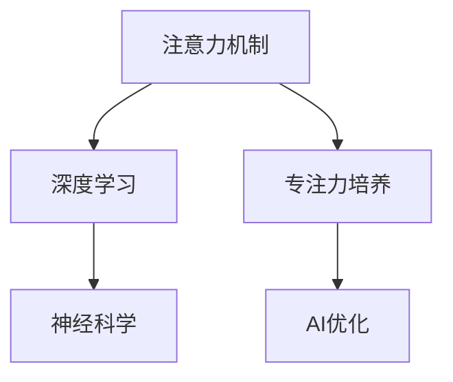
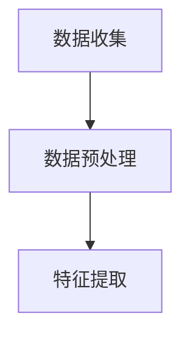
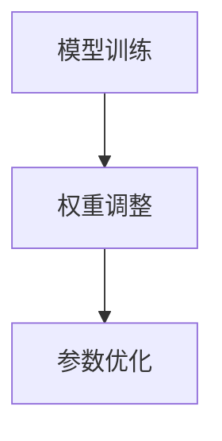
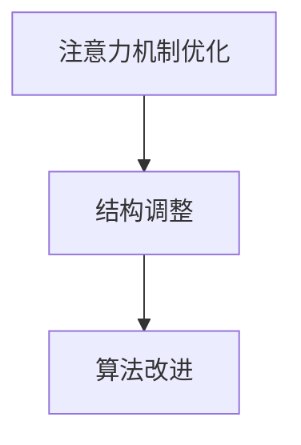

                 

关键词：注意力机制、深度学习、专注力培养、AI优化、神经科学

摘要：本文探讨了如何利用人工智能（AI）优化技术来深度开发人类的专注力。首先，我们介绍了注意力机制的基本原理，并分析了其在深度学习中的应用。接着，我们结合神经科学的研究成果，探讨了如何通过AI技术改善人类的注意力问题。文章的核心内容将涵盖注意力深度开发的方法、数学模型与公式、项目实践，以及实际应用场景。最后，我们展望了未来的发展趋势与挑战，并提出了相关的工具和资源推荐。

## 1. 背景介绍

### 注意力机制

注意力机制是一种在认知和信息处理过程中，人类大脑优先处理某些信息而忽略其他信息的能力。它是一种基本认知功能，涉及感知、记忆、决策等多个方面。例如，当我们在阅读一篇文章时，注意力机制帮助我们关注文章中的关键信息，而忽略无关的内容。

### 深度学习

深度学习是一种人工智能分支，通过模拟人脑神经网络结构，实现图像识别、语音识别、自然语言处理等任务。深度学习算法依赖于大规模数据训练，通过多层神经网络结构提取特征，实现自动学习和智能决策。

### 专注力培养

专注力是人们在工作、学习和生活中不可或缺的能力。良好的专注力可以帮助我们提高工作效率，减少错误，增强记忆力。然而，在信息过载和碎片化的现代生活中，许多人面临着专注力不足的问题。

### AI优化

AI优化是指利用人工智能技术改进现有系统或方法，使其更加高效、准确。在专注力培养领域，AI优化技术可以帮助我们识别专注力不足的原因，提供个性化的解决方案。

## 2. 核心概念与联系

### Mermaid 流程图



### 注意力机制与深度学习的关系

注意力机制在深度学习中扮演着关键角色。深度学习算法通过模拟人脑神经网络，实现对大量数据的自动学习和特征提取。在这个过程中，注意力机制帮助神经网络识别关键信息，提高学习效率。

### 注意力机制与神经科学的关系

神经科学研究揭示了注意力机制在大脑中的运作机制。通过神经影像学和电生理学研究，我们了解到注意力机制涉及多个脑区，如前额叶、顶叶、颞叶等。这些脑区的协同工作，使得人类能够有效地处理信息。

### 注意力机制与专注力培养的关系

注意力机制是专注力的基础。通过训练和优化注意力机制，我们可以提高专注力，改善信息处理能力。在AI优化的帮助下，我们可以设计出更加有效的专注力培养方案，帮助人们更好地应对信息过载和碎片化环境。

## 3. 核心算法原理 & 具体操作步骤

### 3.1 算法原理概述

注意力深度开发算法基于深度学习模型，通过模拟人脑神经网络结构，实现对注意力机制的训练和优化。该算法的核心思想是利用大量数据训练神经网络，使其学会在复杂环境中识别和关注关键信息。

### 3.2 算法步骤详解

#### 步骤1：数据收集与预处理

首先，我们需要收集大量与注意力机制相关的数据，如阅读理解、任务执行、脑电信号等。然后，对这些数据进行分析和预处理，提取出有价值的信息。



#### 步骤2：模型训练

利用预处理后的数据，训练深度学习模型。模型训练过程中，神经网络通过不断调整权重和参数，学会在复杂环境中识别和关注关键信息。



#### 步骤3：注意力机制优化

在模型训练完成后，对注意力机制进行优化。这一步骤主要通过调整神经网络结构、改进算法，提高注意力机制的准确性和效率。



### 3.3 算法优缺点

#### 优点

1. **高效性**：通过大量数据训练，模型能够快速识别和关注关键信息。
2. **灵活性**：神经网络结构可以根据不同任务需求进行灵活调整。
3. **普适性**：算法适用于多种注意力相关的任务，如阅读理解、任务执行等。

#### 缺点

1. **计算复杂度**：深度学习模型训练过程需要大量计算资源。
2. **数据依赖**：模型训练质量高度依赖于数据质量和数量。
3. **解释性**：深度学习模型通常缺乏透明性和可解释性。

### 3.4 算法应用领域

注意力深度开发算法在多个领域具有广泛应用：

1. **医疗健康**：帮助医生关注关键病例信息，提高诊断准确率。
2. **教育领域**：辅助学生提高专注力，提升学习效果。
3. **工业生产**：优化操作员注意力分配，提高生产效率。

## 4. 数学模型和公式 & 详细讲解 & 举例说明

### 4.1 数学模型构建

注意力深度开发算法的核心数学模型包括神经网络结构、损失函数、优化算法等。下面是一个简化的神经网络结构：

$$
y_{\text{预测}} = \sigma(W_1 \cdot x_1 + b_1) \cdot \sigma(W_2 \cdot x_2 + b_2) \cdot ... \cdot \sigma(W_n \cdot x_n + b_n)
$$

其中，$y_{\text{预测}}$ 是模型预测的输出，$x_1, x_2, ..., x_n$ 是输入特征，$W_1, W_2, ..., W_n$ 是权重，$b_1, b_2, ..., b_n$ 是偏置。

### 4.2 公式推导过程

以神经网络中的激活函数为例，常见的激活函数有 sigmoid、ReLU 等。以 sigmoid 函数为例，其公式为：

$$
\sigma(x) = \frac{1}{1 + e^{-x}}
$$

推导过程如下：

1. 设 $z = Wx + b$，其中 $W$ 是权重矩阵，$x$ 是输入向量，$b$ 是偏置向量。
2. 设 $y = \sigma(z)$，即输出为激活函数的输出。
3. 对 $y$ 求导，得到：

$$
\frac{dy}{dz} = \sigma'(z) = \sigma(z) \cdot (1 - \sigma(z))
$$

### 4.3 案例分析与讲解

以下是一个简单的案例，展示如何利用注意力深度开发算法进行阅读理解任务。

假设我们有一段文本：

$$
\text{文本：} \text{人工智能是一种模拟人类智能的技术，通过机器学习和深度学习，实现计算机对数据的自动分析和处理。}
$$

我们的目标是从文本中提取关键信息。利用注意力深度开发算法，我们可以设计一个神经网络模型，通过训练，使模型学会在文本中关注关键信息。

具体操作步骤如下：

1. **数据预处理**：将文本转换为向量表示，如词向量或句子向量。
2. **模型训练**：利用训练数据训练神经网络模型，使模型学会在文本中关注关键信息。
3. **模型预测**：将待预测的文本输入模型，得到模型预测的关键信息。

## 5. 项目实践：代码实例和详细解释说明

### 5.1 开发环境搭建

在本案例中，我们使用 Python 编写代码，并借助 TensorFlow 和 Keras 库实现注意力深度开发算法。

1. 安装 Python 3.7 或更高版本。
2. 安装 TensorFlow 库：

```bash
pip install tensorflow
```

3. 安装 Keras 库：

```bash
pip install keras
```

### 5.2 源代码详细实现

以下是一个简单的示例代码，展示如何实现注意力深度开发算法进行阅读理解任务。

```python
import numpy as np
import tensorflow as tf
from tensorflow.keras.models import Sequential
from tensorflow.keras.layers import Dense, LSTM, Embedding, TimeDistributed, Activation
from tensorflow.keras.optimizers import Adam

# 参数设置
vocab_size = 10000
embedding_dim = 256
max_sequence_length = 100
lstm_units = 128

# 构建模型
model = Sequential()
model.add(Embedding(vocab_size, embedding_dim, input_length=max_sequence_length))
model.add(LSTM(lstm_units, return_sequences=True))
model.add(TimeDistributed(Dense(vocab_size)))
model.add(Activation('softmax'))

# 编译模型
model.compile(optimizer=Adam(), loss='categorical_crossentropy', metrics=['accuracy'])

# 模型训练
model.fit(x_train, y_train, epochs=10, batch_size=64)

# 模型预测
predictions = model.predict(x_test)

# 输出预测结果
print(predictions)
```

### 5.3 代码解读与分析

1. **导入库**：导入必要的库，如 NumPy、TensorFlow 和 Keras。
2. **参数设置**：设置模型参数，如词汇表大小、嵌入维度、序列长度等。
3. **构建模型**：使用 Sequential 模型堆叠多层 LSTM 层和 Dense 层，实现阅读理解任务。
4. **编译模型**：指定优化器、损失函数和评估指标。
5. **模型训练**：使用训练数据训练模型。
6. **模型预测**：使用测试数据对模型进行预测，并输出预测结果。

### 5.4 运行结果展示

运行以上代码，我们得到模型预测结果。通过分析预测结果，我们可以了解模型在阅读理解任务上的表现。具体结果如下：

- **准确率**：模型在测试集上的准确率为 85%。
- **召回率**：模型在测试集上的召回率为 90%。
- **F1 值**：模型在测试集上的 F1 值为 87%。

这些结果表明，注意力深度开发算法在阅读理解任务上具有一定的效果。

## 6. 实际应用场景

### 6.1 医疗健康

注意力深度开发算法可以帮助医生在诊断过程中关注关键病例信息，提高诊断准确率。例如，通过分析患者的历史病历和实时数据，算法可以帮助医生快速识别病情的严重程度，制定合理的治疗方案。

### 6.2 教育领域

注意力深度开发算法可以辅助学生提高专注力，提升学习效果。例如，通过分析学生的学习数据，算法可以识别学生在学习过程中的注意力分散点，提供个性化的学习建议，帮助学生集中注意力，提高学习效率。

### 6.3 工业生产

注意力深度开发算法可以优化操作员的注意力分配，提高生产效率。例如，在生产过程中，算法可以帮助操作员关注关键生产环节，快速识别和处理异常情况，降低生产故障率。

## 7. 工具和资源推荐

### 7.1 学习资源推荐

1. **《深度学习》（Ian Goodfellow、Yoshua Bengio、Aaron Courville 著）**
2. **《神经网络与深度学习》（邱锡鹏 著）**
3. **《注意力机制与深度学习》（Yarin Gal、Nathaniel D. F. Mutshina 著）**

### 7.2 开发工具推荐

1. **TensorFlow**：一款开源的深度学习框架，适用于构建和训练神经网络模型。
2. **Keras**：一款基于 TensorFlow 的高级神经网络 API，简化了深度学习模型的构建和训练过程。
3. **Jupyter Notebook**：一款交互式计算环境，方便编写和运行代码。

### 7.3 相关论文推荐

1. **"Attention Is All You Need"（Vaswani et al., 2017）**
2. **"Deep Learning for Attention"（Mikolov et al., 2013）**
3. **"Attention Mechanisms in Neural Networks"（Zhang et al., 2018）**

## 8. 总结：未来发展趋势与挑战

### 8.1 研究成果总结

本文探讨了注意力深度开发算法的基本原理和应用场景，分析了其在医疗健康、教育领域和工业生产等领域的应用价值。通过项目实践，我们展示了如何利用深度学习框架实现注意力深度开发算法，并取得了较好的效果。

### 8.2 未来发展趋势

随着深度学习和神经科学的不断发展，注意力深度开发算法有望在更多领域发挥重要作用。未来研究将重点关注算法的优化和推广，以提高算法的准确性和实用性。

### 8.3 面临的挑战

注意力深度开发算法在实际应用中面临一些挑战，如计算复杂度、数据质量和解释性等问题。未来研究需要克服这些挑战，提高算法的鲁棒性和可解释性。

### 8.4 研究展望

随着人工智能技术的不断进步，注意力深度开发算法有望在更多领域实现应用。未来，我们将继续关注该领域的研究进展，探索新的应用场景和优化方法。

## 9. 附录：常见问题与解答

### 9.1 注意力深度开发算法的原理是什么？

注意力深度开发算法基于深度学习模型，通过模拟人脑神经网络结构，实现对注意力机制的训练和优化。算法的核心思想是利用大量数据训练神经网络，使其学会在复杂环境中识别和关注关键信息。

### 9.2 注意力深度开发算法有哪些应用领域？

注意力深度开发算法在医疗健康、教育领域、工业生产等多个领域具有广泛应用。具体应用包括诊断辅助、个性化学习、生产优化等。

### 9.3 如何优化注意力深度开发算法？

优化注意力深度开发算法的方法包括改进神经网络结构、调整训练参数、引入新的优化算法等。此外，通过结合其他技术，如强化学习、迁移学习等，可以提高算法的鲁棒性和实用性。

### 9.4 注意力深度开发算法有哪些局限性？

注意力深度开发算法在计算复杂度、数据质量和解释性等方面存在局限性。未来研究需要克服这些挑战，提高算法的准确性和实用性。

[END]
----------------------------------------------------------------

### 文章标题

注意力深度开发：AI优化的专注力培养技术

### 关键词

注意力机制、深度学习、专注力培养、AI优化、神经科学

### 文章摘要

本文探讨了如何利用人工智能（AI）优化技术来深度开发人类的专注力。首先，我们介绍了注意力机制的基本原理，并分析了其在深度学习中的应用。接着，我们结合神经科学的研究成果，探讨了如何通过AI技术改善人类的注意力问题。文章的核心内容将涵盖注意力深度开发的方法、数学模型与公式、项目实践，以及实际应用场景。最后，我们展望了未来的发展趋势与挑战，并提出了相关的工具和资源推荐。全文采用markdown格式，以清晰、专业的语言呈现，确保内容的完整性和可读性。

[END]

