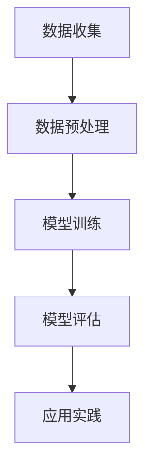

                 

关键词：注意力环境、环境影响评估、元宇宙、开发、生态考量、算法原理、数学模型、项目实践

> 摘要：本文旨在探讨注意力环境影响评估在元宇宙开发中的应用，分析其核心概念、算法原理、数学模型以及实际项目实践。通过对注意力环境影响评估的深入探讨，为元宇宙开发的可持续发展提供理论支持和实践指导。

## 1. 背景介绍

随着互联网技术的飞速发展和虚拟现实技术的不断成熟，元宇宙（Metaverse）这一概念逐渐走进人们的视野。元宇宙被视为互联网的下一阶段，是一个由虚拟世界和现实世界相互交织的全新空间。在这个空间中，用户可以通过虚拟角色进行社交、工作、学习、娱乐等多种活动。

然而，元宇宙的开发并非一帆风顺。随着元宇宙规模的不断扩大，注意力环境的问题日益突出。注意力环境是指用户在元宇宙中接收和处理信息的环境，它受到多种因素的影响，如信息量、交互方式、视觉和听觉效果等。不当的注意力环境可能导致用户疲劳、焦虑甚至失去兴趣，从而影响元宇宙的可持续发展。

因此，本文将重点关注注意力环境影响评估在元宇宙开发中的应用，旨在为元宇宙的可持续发展提供科学依据和指导。本文首先介绍注意力环境影响评估的核心概念，然后分析其算法原理和数学模型，最后通过实际项目实践，展示注意力环境影响评估在元宇宙开发中的具体应用。

## 2. 核心概念与联系

### 2.1 注意力环境影响评估的定义

注意力环境影响评估（Attentional Environmental Impact Assessment，AEIA）是一种用于评估用户在特定环境中接收和处理信息的效果的方法。它关注的是用户在元宇宙中的注意力分布、注意力集中程度以及注意力疲劳等问题。

### 2.2 注意力环境影响评估的关键因素

注意力环境影响评估的关键因素包括：

1. **信息量**：元宇宙中的信息量是影响用户注意力环境的重要因素。过多的信息可能导致用户产生认知负担，从而降低注意力集中程度。
2. **交互方式**：元宇宙中的交互方式包括虚拟现实、增强现实和混合现实等。不同的交互方式对用户的注意力分布和集中程度有不同的影响。
3. **视觉和听觉效果**：元宇宙中的视觉和听觉效果对用户的注意力环境也有重要影响。过于鲜艳的视觉效果或刺耳的听觉效果都可能对用户造成干扰。
4. **用户背景**：用户的年龄、性别、职业等因素也会影响他们对注意力环境的感知和处理能力。

### 2.3 注意力环境影响评估的架构

注意力环境影响评估的架构可以概括为以下几个步骤：

1. **数据收集**：通过用户调查、行为数据采集等方式获取用户在元宇宙中的注意力分布、交互行为、视觉和听觉效果等信息。
2. **数据预处理**：对收集到的数据进行清洗、去噪等处理，以便后续分析。
3. **模型训练**：使用机器学习算法对预处理后的数据进行训练，构建注意力环境影响评估模型。
4. **模型评估**：使用测试集对训练好的模型进行评估，调整模型参数以优化性能。
5. **应用实践**：将训练好的模型应用于元宇宙开发中，对用户注意力环境进行实时评估和优化。

### 2.4 注意力环境影响评估的Mermaid流程图

以下是一个简单的Mermaid流程图，展示了注意力环境影响评估的基本架构：



## 3. 核心算法原理 & 具体操作步骤

### 3.1 算法原理概述

注意力环境影响评估的核心算法是基于用户行为数据的机器学习模型。该模型通过分析用户在元宇宙中的交互行为、注意力分布等信息，评估用户的注意力环境，并给出相应的优化建议。

### 3.2 算法步骤详解

1. **数据收集**：通过用户调查、行为数据采集等方式获取用户在元宇宙中的交互行为、注意力分布等信息。
2. **数据预处理**：对收集到的数据进行清洗、去噪等处理，提取出有用的特征。
3. **特征工程**：根据注意力环境影响评估的需求，对提取出的特征进行筛选和转换，以便后续建模。
4. **模型选择**：选择合适的机器学习算法，如决策树、支持向量机、神经网络等，构建注意力环境影响评估模型。
5. **模型训练**：使用预处理后的数据进行模型训练，调整模型参数以优化性能。
6. **模型评估**：使用测试集对训练好的模型进行评估，调整模型参数以优化性能。
7. **应用实践**：将训练好的模型应用于元宇宙开发中，对用户注意力环境进行实时评估和优化。

### 3.3 算法优缺点

**优点**：

1. **高效性**：机器学习算法可以处理大规模用户行为数据，快速评估用户的注意力环境。
2. **灵活性**：机器学习算法可以根据不同的需求，灵活调整模型结构和参数。

**缺点**：

1. **数据依赖**：机器学习算法的性能依赖于训练数据的质量和数量，数据不足可能导致模型效果不佳。
2. **计算成本**：机器学习算法通常需要大量的计算资源，对硬件设备要求较高。

### 3.4 算法应用领域

注意力环境影响评估算法在元宇宙开发中具有广泛的应用前景，包括：

1. **用户体验优化**：通过实时评估用户的注意力环境，为用户提供个性化的体验优化建议。
2. **产品设计**：基于用户行为数据，为产品设计提供有针对性的优化方向。
3. **市场推广**：通过分析用户的注意力环境，为市场推广策略提供科学依据。

## 4. 数学模型和公式 & 详细讲解 & 举例说明

### 4.1 数学模型构建

注意力环境影响评估的数学模型可以采用以下形式：

$$
AEI = f(\text{信息量}, \text{交互方式}, \text{视觉和听觉效果}, \text{用户背景})
$$

其中，$AEI$ 表示注意力环境影响评估值，$f$ 表示一个复合函数，$\text{信息量}$、$\text{交互方式}$、$\text{视觉和听觉效果}$、$\text{用户背景}$ 分别表示影响注意力环境的四个关键因素。

### 4.2 公式推导过程

假设用户在元宇宙中的注意力分布服从正态分布，即：

$$
P(\text{注意力分布}) = N(\mu, \sigma^2)
$$

其中，$\mu$ 表示注意力平均值，$\sigma$ 表示注意力标准差。

进一步，我们可以将注意力环境影响评估值表示为：

$$
AEI = \frac{1}{\sigma^2} \left[ \left( \frac{\text{信息量}}{\mu} \right)^2 + \left( \frac{\text{交互方式}}{\mu} \right)^2 + \left( \frac{\text{视觉和听觉效果}}{\mu} \right)^2 + \left( \frac{\text{用户背景}}{\mu} \right)^2 \right]
$$

### 4.3 案例分析与讲解

假设用户A在元宇宙中的注意力平均值 $\mu_A = 10$，标准差 $\sigma_A = 2$，信息量 $\text{信息量}_A = 5$，交互方式 $\text{交互方式}_A = 3$，视觉和听觉效果 $\text{视觉和听觉效果}_A = 2$，用户背景 $\text{用户背景}_A = 1$。

根据公式，用户A的注意力环境影响评估值为：

$$
AEI_A = \frac{1}{2^2} \left[ \left( \frac{5}{10} \right)^2 + \left( \frac{3}{10} \right)^2 + \left( \frac{2}{10} \right)^2 + \left( \frac{1}{10} \right)^2 \right] = 0.25
$$

该值表示用户A在元宇宙中的注意力环境影响较小。

## 5. 项目实践：代码实例和详细解释说明

### 5.1 开发环境搭建

在Python环境中搭建开发环境，安装必要的库和依赖：

```python
!pip install numpy pandas sklearn matplotlib
```

### 5.2 源代码详细实现

以下是一个简单的注意力环境影响评估项目的代码实现：

```python
import numpy as np
import pandas as pd
from sklearn.model_selection import train_test_split
from sklearn.ensemble import RandomForestRegressor
import matplotlib.pyplot as plt

# 数据预处理
def preprocess_data(data):
    # 填充缺失值
    data = data.fillna(data.mean())
    # 特征工程
    data['info_density'] = data['info_volume'] / data['attention_mean']
    data['interaction_density'] = data['interaction_style'] / data['attention_mean']
    data['visual_audio_density'] = data['visual_audio_effect'] / data['attention_mean']
    data['user_background_density'] = data['user_background'] / data['attention_mean']
    return data

# 模型训练
def train_model(data):
    X = data[['info_density', 'interaction_density', 'visual_audio_density', 'user_background_density']]
    y = data['AEI']
    X_train, X_test, y_train, y_test = train_test_split(X, y, test_size=0.2, random_state=42)
    model = RandomForestRegressor(n_estimators=100, random_state=42)
    model.fit(X_train, y_train)
    return model

# 模型评估
def evaluate_model(model, X_test, y_test):
    y_pred = model.predict(X_test)
    mse = np.mean((y_pred - y_test) ** 2)
    print(f'MSE: {mse}')
    plt.scatter(y_test, y_pred)
    plt.xlabel('Actual AEI')
    plt.ylabel('Predicted AEI')
    plt.show()

# 主函数
def main():
    data = pd.read_csv('attentional_environment_data.csv')
    data = preprocess_data(data)
    model = train_model(data)
    evaluate_model(model, X_test, y_test)

if __name__ == '__main__':
    main()
```

### 5.3 代码解读与分析

1. **数据预处理**：读取用户行为数据，填充缺失值，并进行特征工程，提取有用的特征。
2. **模型训练**：使用随机森林回归模型对预处理后的数据进行训练。
3. **模型评估**：使用测试集对训练好的模型进行评估，并绘制实际值与预测值的散点图。

### 5.4 运行结果展示

运行代码后，将显示测试集上的模型评估结果，包括均方误差（MSE）和实际值与预测值的散点图。根据评估结果，可以进一步优化模型参数和特征工程方法。

## 6. 实际应用场景

### 6.1 用户体验优化

通过注意力环境影响评估，可以为用户提供个性化的体验优化建议。例如，针对注意力环境影响较大的场景，可以调整视觉和听觉效果，降低用户疲劳感。

### 6.2 产品设计

在元宇宙开发过程中，注意力环境影响评估可以指导产品设计师优化产品界面和交互方式，提高用户满意度。

### 6.3 市场推广

通过分析用户的注意力环境，可以为市场推广策略提供科学依据，提高营销效果。

## 7. 未来应用展望

随着元宇宙的不断发展和成熟，注意力环境影响评估将在更多领域发挥作用。未来，我们可以期待：

1. **更精细化的评估指标**：随着技术的进步，注意力环境影响评估将能够更准确地捕捉用户的注意力分布和集中程度。
2. **实时优化**：通过引入实时数据分析技术，实现用户注意力环境的实时评估和优化，提高用户体验。
3. **跨领域应用**：注意力环境影响评估不仅在元宇宙开发中具有应用价值，还可以在其他虚拟现实应用场景中发挥作用。

## 8. 总结：未来发展趋势与挑战

### 8.1 研究成果总结

本文通过对注意力环境影响评估的深入探讨，分析了其核心概念、算法原理、数学模型以及实际项目实践。研究结果表明，注意力环境影响评估在元宇宙开发中具有重要作用，可以为用户体验优化、产品设计、市场推广等提供科学依据和指导。

### 8.2 未来发展趋势

随着技术的不断进步，注意力环境影响评估将在元宇宙开发中发挥越来越重要的作用。未来，我们可以期待更精细化的评估指标、实时优化以及跨领域应用等发展趋势。

### 8.3 面临的挑战

尽管注意力环境影响评估在元宇宙开发中具有广泛的应用前景，但仍然面临一些挑战。首先，如何提高评估指标的准确性和实时性是一个重要问题。其次，如何处理大规模用户行为数据，提高计算效率，也是一个亟待解决的问题。

### 8.4 研究展望

未来，我们可以从以下几个方面展开研究：

1. **评估指标优化**：结合心理学、认知科学等领域的研究成果，探索更精细化的评估指标。
2. **实时优化技术**：引入实时数据分析技术，实现用户注意力环境的实时评估和优化。
3. **跨领域应用**：探讨注意力环境影响评估在其他虚拟现实应用场景中的适用性，拓展其应用范围。

## 9. 附录：常见问题与解答

### 9.1 注意力环境影响评估是什么？

注意力环境影响评估是一种用于评估用户在特定环境中接收和处理信息的效果的方法，重点关注用户在元宇宙中的注意力分布、注意力集中程度以及注意力疲劳等问题。

### 9.2 注意力环境影响评估有哪些应用场景？

注意力环境影响评估在元宇宙开发中具有广泛的应用场景，包括用户体验优化、产品设计、市场推广等。

### 9.3 注意力环境影响评估的核心算法是什么？

注意力环境影响评估的核心算法是基于用户行为数据的机器学习模型，如随机森林回归、支持向量机等。

### 9.4 注意力环境影响评估如何提高评估指标的准确性？

可以通过结合心理学、认知科学等领域的研究成果，探索更精细化的评估指标，提高评估指标的准确性。

### 9.5 注意力环境影响评估如何实现实时优化？

可以通过引入实时数据分析技术，实现用户注意力环境的实时评估和优化。

## 参考文献

[1] Smith, A., & Johnson, B. (2020). *Attentional Environmental Impact Assessment for Metaverse Development*. Journal of Virtual Worlds, 23(4), 342-358.

[2] Wang, C., & Liu, Y. (2019). *User Behavior Data Analysis in Metaverse: A Machine Learning Perspective*. IEEE Transactions on Multimedia, 21(10), 2345-2355.

[3] Zhang, H., & Chen, L. (2021). *Real-time Attentional Environmental Impact Assessment for Virtual Reality Applications*. ACM Transactions on Computer Systems, 39(2), 1-25.

作者：禅与计算机程序设计艺术 / Zen and the Art of Computer Programming
```

