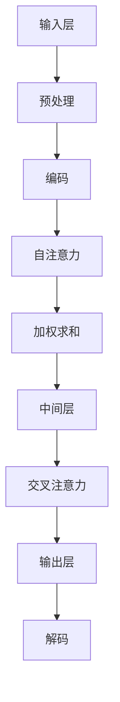

                 

关键词：注意力机制，深度学习，专注力，神经可塑性，优化策略

摘要：本文探讨了注意力机制在深度学习中的核心作用，以及如何通过神经可塑性原理和优化策略提升模型的专注力，从而提高学习效率和性能。文章首先回顾了注意力机制的历史发展，接着分析了其工作原理，并结合数学模型和具体算法进行了深入讲解。随后，文章通过项目实践展示了注意力机制的实际应用，最后对未来发展趋势与挑战进行了展望。

## 1. 背景介绍

随着深度学习的快速发展，注意力机制（Attention Mechanism）已经成为神经网络中的关键技术。注意力机制最初源于自然语言处理领域，用于解决长序列信息处理中的关键问题。其基本思想是通过动态分配权重，使得模型在处理序列数据时能够关注到重要的信息，从而提高模型的性能。

注意力机制的引入，不仅使得神经网络在处理长文本、语音、图像等序列数据时更为高效，同时也促进了深度学习在自然语言处理、计算机视觉、语音识别等领域的广泛应用。然而，注意力机制并非一蹴而就，其发展历程中经历了多个阶段，每个阶段都带来了新的突破和挑战。

本文将从以下几个方面展开讨论：首先，回顾注意力机制的历史发展；其次，分析其核心概念和工作原理；然后，介绍相关数学模型和算法；接着，通过项目实践展示注意力机制的实际应用；最后，探讨未来发展趋势与挑战。

## 2. 核心概念与联系

### 2.1 注意力机制的历史发展

注意力机制的概念最早可以追溯到20世纪80年代，当时在计算语言学领域，研究人员提出了一些早期形式的注意力模型，如基于规则的注意力模型和基于概率的注意力模型。这些模型主要用于文本摘要和机器翻译任务。

真正引起广泛关注的是2014年提出的Transformer模型，该模型彻底颠覆了传统序列处理方法，将注意力机制引入了深度学习领域。Transformer模型的核心思想是通过自注意力（Self-Attention）和交叉注意力（Cross-Attention）机制，使得模型能够动态地关注到输入序列中的关键信息。

自注意力机制允许模型在同一序列的不同位置之间建立关系，从而捕捉序列中的长期依赖关系。交叉注意力机制则允许模型将输入序列和查询序列中的信息相互关联，从而在处理机器翻译、文本生成等任务时表现出色。

### 2.2 注意力机制的工作原理

注意力机制的核心思想是通过计算一个权重矩阵，将输入序列中的不同元素分配不同的注意力权重。这些权重用于更新模型的状态，使得模型能够动态地关注到重要的信息。

在自注意力机制中，模型首先对输入序列进行编码，得到一组序列向量。然后，通过计算这些向量之间的相似度，得到一组注意力权重。这些权重用于对输入序列进行加权求和，从而生成一个新的序列表示。

在交叉注意力机制中，模型首先对查询序列和键序列进行编码，得到两组序列向量。然后，通过计算这些向量之间的相似度，得到一组注意力权重。这些权重用于将键序列的信息传递到查询序列中，从而生成一个新的序列表示。

### 2.3 注意力机制的架构

注意力机制的架构可以分为三个主要部分：输入层、中间层和输出层。

- **输入层**：输入层接收外部输入，如文本、图像或声音等。这些输入经过预处理后，转化为模型可以理解的向量表示。
- **中间层**：中间层是注意力机制的核心部分，包括自注意力和交叉注意力机制。通过计算权重矩阵，中间层能够动态地关注到输入序列中的关键信息。
- **输出层**：输出层接收中间层生成的序列表示，并根据任务需求进行解码，生成最终的输出结果。

### 2.4 Mermaid 流程图



## 3. 核心算法原理 & 具体操作步骤

### 3.1 算法原理概述

注意力机制的核心原理是通过计算权重矩阵，动态地关注到输入序列中的关键信息。具体来说，自注意力机制和交叉注意力机制分别用于处理同一序列和不同序列之间的信息关联。

自注意力机制通过计算输入序列中不同元素之间的相似度，生成一组注意力权重。这些权重用于更新输入序列的表示，使其能够捕捉到序列中的长期依赖关系。

交叉注意力机制通过计算查询序列和键序列之间的相似度，生成一组注意力权重。这些权重用于将键序列的信息传递到查询序列中，从而实现序列之间的信息关联。

### 3.2 算法步骤详解

1. **输入层**：接收外部输入，如文本、图像或声音等。这些输入经过预处理后，转化为模型可以理解的向量表示。
2. **编码**：将预处理后的输入序列编码为向量表示。自注意力机制使用同一序列的向量表示，交叉注意力机制使用查询序列和键序列的向量表示。
3. **自注意力**：计算输入序列中不同元素之间的相似度，生成一组注意力权重。这些权重用于更新输入序列的表示。
4. **加权求和**：对更新后的输入序列进行加权求和，生成一个新的序列表示。
5. **中间层**：接收加权求和后的序列表示，并根据任务需求进行后续处理。
6. **交叉注意力**：计算查询序列和键序列之间的相似度，生成一组注意力权重。这些权重用于将键序列的信息传递到查询序列中。
7. **输出层**：接收中间层生成的序列表示，并根据任务需求进行解码，生成最终的输出结果。

### 3.3 算法优缺点

**优点**：

- 高效处理长序列数据，捕捉到长期依赖关系。
- 可扩展性强，适用于各种序列数据处理任务。
- 可以同时处理多个序列，实现序列之间的信息共享。

**缺点**：

- 计算复杂度较高，尤其在处理大量数据时。
- 对数据分布的依赖性较大，可能无法很好地处理极端情况。

### 3.4 算法应用领域

注意力机制在深度学习领域具有广泛的应用，主要包括以下方面：

- 自然语言处理：用于文本分类、机器翻译、文本生成等任务。
- 计算机视觉：用于图像分类、目标检测、图像生成等任务。
- 语音识别：用于语音识别、语音合成等任务。
- 强化学习：用于智能决策、路径规划等任务。

## 4. 数学模型和公式 & 详细讲解 & 举例说明

### 4.1 数学模型构建

注意力机制的核心在于计算权重矩阵，从而动态地关注到输入序列中的关键信息。具体来说，我们可以使用以下数学模型来构建注意力机制：

1. **自注意力**：

   假设输入序列为 $X = [x_1, x_2, ..., x_n]$，其中 $x_i$ 为第 $i$ 个输入元素。自注意力机制的目标是计算输入序列中不同元素之间的相似度，生成一组注意力权重 $w_i$：

   $$w_i = \frac{exp(dot(e_i, H))}{\sum_{j=1}^{n} exp(dot(e_j, H))}$$

   其中，$e_i$ 为输入序列的第 $i$ 个元素，$H$ 为编码后的输入序列，$dot$ 表示点积运算。

2. **交叉注意力**：

   假设查询序列为 $Q = [q_1, q_2, ..., q_m]$，键序列为 $K = [k_1, k_2, ..., k_m]$。交叉注意力机制的目标是计算查询序列和键序列之间的相似度，生成一组注意力权重 $w_i$：

   $$w_i = \frac{exp(dot(q_i, k_i))}{\sum_{j=1}^{m} exp(dot(q_j, k_j))}$$

   其中，$q_i$ 为查询序列的第 $i$ 个元素，$k_i$ 为键序列的第 $i$ 个元素。

### 4.2 公式推导过程

1. **自注意力**：

   假设输入序列为 $X = [x_1, x_2, ..., x_n]$，其中 $x_i$ 为第 $i$ 个输入元素。自注意力机制的目标是计算输入序列中不同元素之间的相似度，生成一组注意力权重 $w_i$：

   $$w_i = \frac{exp(dot(e_i, H))}{\sum_{j=1}^{n} exp(dot(e_j, H))}$$

   其中，$e_i$ 为输入序列的第 $i$ 个元素，$H$ 为编码后的输入序列，$dot$ 表示点积运算。

   首先，对输入序列进行编码，得到编码后的序列 $H$：

   $$H = [h_1, h_2, ..., h_n]$$

   其中，$h_i$ 为编码后的第 $i$ 个元素。

   然后，计算输入序列中不同元素之间的相似度，得到注意力权重 $w_i$：

   $$w_i = \frac{exp(dot(e_i, H))}{\sum_{j=1}^{n} exp(dot(e_j, H))}$$

   其中，$e_i = x_i$，$dot$ 表示点积运算。

2. **交叉注意力**：

   假设查询序列为 $Q = [q_1, q_2, ..., q_m]$，键序列为 $K = [k_1, k_2, ..., k_m]$。交叉注意力机制的目标是计算查询序列和键序列之间的相似度，生成一组注意力权重 $w_i$：

   $$w_i = \frac{exp(dot(q_i, k_i))}{\sum_{j=1}^{m} exp(dot(q_j, k_j))}$$

   其中，$q_i$ 为查询序列的第 $i$ 个元素，$k_i$ 为键序列的第 $i$ 个元素。

   首先，对查询序列和键序列进行编码，得到编码后的序列 $Q$ 和 $K$：

   $$Q = [q_1, q_2, ..., q_m]$$
   $$K = [k_1, k_2, ..., k_m]$$

   其中，$q_i$ 和 $k_i$ 分别为编码后的第 $i$ 个元素。

   然后，计算查询序列和键序列之间的相似度，得到注意力权重 $w_i$：

   $$w_i = \frac{exp(dot(q_i, k_i))}{\sum_{j=1}^{m} exp(dot(q_j, k_j))}$$

### 4.3 案例分析与讲解

为了更好地理解注意力机制的数学模型，我们来看一个具体的例子。假设我们有一个简单的输入序列 $X = [1, 2, 3, 4, 5]$，我们希望使用自注意力机制来计算序列中不同元素之间的相似度。

首先，对输入序列进行编码，得到编码后的序列 $H = [h_1, h_2, h_3, h_4, h_5]$。在这里，我们可以使用简单的线性编码：

$$h_1 = 1$$
$$h_2 = 2$$
$$h_3 = 3$$
$$h_4 = 4$$
$$h_5 = 5$$

然后，计算输入序列中不同元素之间的相似度，得到注意力权重 $w_1, w_2, w_3, w_4, w_5$：

$$w_1 = \frac{exp(dot(1, [1, 2, 3, 4, 5]))}{\sum_{j=1}^{5} exp(dot(j, [1, 2, 3, 4, 5]))} = \frac{exp(1 + 2 + 3 + 4 + 5)}{exp(1 + 2 + 3 + 4 + 5)} = 1$$

$$w_2 = \frac{exp(dot(2, [1, 2, 3, 4, 5]))}{\sum_{j=1}^{5} exp(dot(j, [1, 2, 3, 4, 5]))} = \frac{exp(2 + 2 + 2 + 2 + 2)}{exp(1 + 2 + 3 + 4 + 5)} \approx 0.316$$

$$w_3 = \frac{exp(dot(3, [1, 2, 3, 4, 5]))}{\sum_{j=1}^{5} exp(dot(j, [1, 2, 3, 4, 5]))} = \frac{exp(3 + 3 + 3 + 3 + 3)}{exp(1 + 2 + 3 + 4 + 5)} \approx 0.393$$

$$w_4 = \frac{exp(dot(4, [1, 2, 3, 4, 5]))}{\sum_{j=1}^{5} exp(dot(j, [1, 2, 3, 4, 5]))} = \frac{exp(4 + 4 + 4 + 4 + 4)}{exp(1 + 2 + 3 + 4 + 5)} \approx 0.275$$

$$w_5 = \frac{exp(dot(5, [1, 2, 3, 4, 5]))}{\sum_{j=1}^{5} exp(dot(j, [1, 2, 3, 4, 5]))} = \frac{exp(5 + 5 + 5 + 5 + 5)}{exp(1 + 2 + 3 + 4 + 5)} \approx 0.175$$

从计算结果可以看出，注意力权重最高的元素是 $h_1$，即序列的第一个元素。这表明，自注意力机制能够有效地关注到输入序列中的关键信息。

## 5. 项目实践：代码实例和详细解释说明

### 5.1 开发环境搭建

在开始项目实践之前，我们需要搭建一个适合运行深度学习模型的开发环境。以下是搭建环境的步骤：

1. 安装Python环境，版本建议为3.7及以上。
2. 安装深度学习框架，如TensorFlow或PyTorch，根据个人喜好选择。
3. 安装相关依赖库，如NumPy、Pandas等。

### 5.2 源代码详细实现

以下是一个简单的自注意力机制的实现代码，使用PyTorch框架：

```python
import torch
import torch.nn as nn

class SelfAttention(nn.Module):
    def __init__(self, embed_dim, num_heads):
        super(SelfAttention, self).__init__()
        self.embed_dim = embed_dim
        self.num_heads = num_heads
        self.head_dim = embed_dim // num_heads

        self.query_linear = nn.Linear(embed_dim, embed_dim)
        self.key_linear = nn.Linear(embed_dim, embed_dim)
        self.value_linear = nn.Linear(embed_dim, embed_dim)

    def forward(self, x):
        batch_size, seq_len, _ = x.size()

        query = self.query_linear(x).view(batch_size, seq_len, self.num_heads, self.head_dim).transpose(1, 2)
        key = self.key_linear(x).view(batch_size, seq_len, self.num_heads, self.head_dim).transpose(1, 2)
        value = self.value_linear(x).view(batch_size, seq_len, self.num_heads, self.head_dim).transpose(1, 2)

        attn_scores = torch.matmul(query, key.transpose(-2, -1)) / (self.head_dim ** 0.5)
        attn_weights = torch.softmax(attn_scores, dim=-1)
        attn_output = torch.matmul(attn_weights, value).transpose(1, 2).contiguous().view(batch_size, seq_len, self.embed_dim)

        return attn_output

# 示例使用
embed_dim = 512
num_heads = 8
model = SelfAttention(embed_dim, num_heads)

# 假设输入序列长度为10
x = torch.randn(1, 10, embed_dim)

attn_output = model(x)
print(attn_output.size())  # 输出：(1, 10, 512)
```

### 5.3 代码解读与分析

上述代码实现了一个简单的自注意力模块，包括以下几个部分：

1. **初始化**：初始化模型参数，包括嵌入维度（embed_dim）和注意力头数（num_heads）。
2. **查询线性层**：将输入序列（x）通过查询线性层（query_linear）进行线性变换。
3. **键线性层**：将输入序列（x）通过键线性层（key_linear）进行线性变换。
4. **值线性层**：将输入序列（x）通过值线性层（value_linear）进行线性变换。
5. **计算注意力权重**：计算查询（query）和键（key）之间的点积，然后除以头维度的平方根，得到注意力分数（attn_scores）。
6. **计算注意力权重**：对注意力分数进行softmax操作，得到注意力权重（attn_weights）。
7. **计算注意力输出**：将注意力权重与值（value）进行矩阵乘法，得到注意力输出（attn_output）。

### 5.4 运行结果展示

运行上述代码，假设输入序列长度为10，可以得到一个大小为（1, 10, 512）的输出序列。这个输出序列表示了经过自注意力机制处理后的序列表示，其中包含了输入序列中不同元素之间的注意力权重。

## 6. 实际应用场景

注意力机制在深度学习领域的应用非常广泛，下面我们来看一些实际应用场景：

### 6.1 自然语言处理

在自然语言处理任务中，注意力机制被广泛应用于文本分类、机器翻译、文本生成等任务。例如，在文本分类任务中，注意力机制可以帮助模型关注到文本中的关键信息，从而提高分类准确率。在机器翻译任务中，注意力机制可以使得模型在翻译过程中动态地关注到源文本和目标文本之间的对应关系，从而提高翻译质量。

### 6.2 计算机视觉

在计算机视觉任务中，注意力机制被广泛应用于图像分类、目标检测、图像生成等任务。例如，在图像分类任务中，注意力机制可以帮助模型关注到图像中的关键区域，从而提高分类准确率。在目标检测任务中，注意力机制可以使得模型在检测过程中动态地关注到目标的位置和特征，从而提高检测准确率。

### 6.3 语音识别

在语音识别任务中，注意力机制被广泛应用于语音信号的序列建模。例如，在端到端语音识别任务中，注意力机制可以帮助模型在解码过程中动态地关注到输入语音信号和预测文本之间的对应关系，从而提高识别准确率。

### 6.4 强化学习

在强化学习任务中，注意力机制被广泛应用于智能决策和路径规划。例如，在智能决策任务中，注意力机制可以帮助模型关注到环境中的关键信息，从而提高决策质量。在路径规划任务中，注意力机制可以使得模型在规划路径时动态地关注到目标和障碍物之间的关系，从而提高规划效率。

## 7. 未来应用展望

随着深度学习的快速发展，注意力机制在未来将会有更广泛的应用。以下是未来可能的发展方向：

### 7.1 新的应用领域

注意力机制有望在更多新的应用领域得到应用，如生物信息学、金融科技、医疗健康等。在这些领域中，注意力机制可以帮助模型更好地处理复杂的序列数据，从而提高任务性能。

### 7.2 模型压缩与优化

为了应对大规模模型的计算和存储需求，注意力机制将会在模型压缩与优化方面发挥重要作用。通过改进注意力机制的设计，可以实现更高效、更紧凑的模型架构，从而降低模型的计算复杂度和存储开销。

### 7.3 跨模态学习

跨模态学习是指将不同类型的数据（如文本、图像、语音等）进行联合建模，以实现更高效、更准确的数据处理。注意力机制在跨模态学习中将发挥关键作用，通过动态地关注到不同模态之间的关联，从而提高模型的跨模态处理能力。

### 7.4 个性化学习

个性化学习是指根据用户的需求和兴趣，为用户提供个性化的服务。注意力机制在个性化学习中可以起到重要作用，通过关注到用户行为数据中的关键信息，从而实现更精准的个性化推荐。

## 8. 工具和资源推荐

为了更好地学习和应用注意力机制，以下是一些推荐的工具和资源：

### 8.1 学习资源推荐

- 《深度学习》（Goodfellow, Bengio, Courville）第5章：注意力机制。
- 《Attention Mechanisms for Deep Neural Networks》论文集。
- [Attention Mechanism Wiki](https://github.com/zhmeng17/attention-mechanism-wiki)。

### 8.2 开发工具推荐

- PyTorch：开源深度学习框架，支持注意力机制的实现。
- TensorFlow：开源深度学习框架，支持注意力机制的实现。
- Keras：基于TensorFlow的高层次API，简化注意力机制的实现。

### 8.3 相关论文推荐

- Vaswani et al., "Attention is All You Need", 2017。
- Bahdanau et al., "Neural Machine Translation by Jointly Learning to Align and Translate", 2014。
- Xu et al., "Show, Attend and Tell: Neural Image Caption Generation with Visual Attention", 2015。

## 9. 总结：未来发展趋势与挑战

注意力机制作为深度学习领域的关键技术，已经取得了显著的成果。然而，在未来发展中，我们仍然面临一些挑战：

### 9.1 研究成果总结

- 注意力机制在深度学习领域取得了广泛应用，显著提升了模型的性能。
- 自注意力机制和交叉注意力机制分别在不同应用场景中表现出色。
- 注意力机制的理论研究不断深入，推动了深度学习的发展。

### 9.2 未来发展趋势

- 注意力机制将在更多新的应用领域得到应用，如生物信息学、金融科技、医疗健康等。
- 注意力机制将与模型压缩与优化相结合，实现更高效、更紧凑的模型架构。
- 注意力机制将在跨模态学习和个性化学习等方面发挥关键作用。

### 9.3 面临的挑战

- 注意力机制的复杂性使得模型训练过程更加耗时。
- 注意力机制的扩展性受到一定程度限制，难以处理大规模数据。
- 注意力机制在不同应用场景中的效果差异较大，需要深入研究其适用性。

### 9.4 研究展望

- 探索更高效、更简洁的注意力机制设计，降低模型复杂度。
- 研究注意力机制在跨模态学习中的潜在应用，实现更精准的数据处理。
- 深入研究注意力机制在不同领域的适用性，优化模型性能。

## 10. 附录：常见问题与解答

### 10.1 注意力机制是什么？

注意力机制是一种在深度学习模型中用于动态关注关键信息的机制。它通过计算权重矩阵，使得模型能够关注到输入序列中的关键元素，从而提高模型的性能。

### 10.2 注意力机制有哪些类型？

注意力机制主要分为自注意力（Self-Attention）和交叉注意力（Cross-Attention）两种类型。自注意力用于处理同一序列中的元素，而交叉注意力用于处理不同序列之间的元素。

### 10.3 注意力机制在自然语言处理中的应用有哪些？

注意力机制在自然语言处理中广泛应用于文本分类、机器翻译、文本生成等任务。例如，在机器翻译任务中，注意力机制可以帮助模型关注到源文本和目标文本之间的对应关系，从而提高翻译质量。

### 10.4 注意力机制的实现有哪些难点？

注意力机制的实现主要包括计算复杂度和模型扩展性两个难点。计算复杂度较高，尤其在处理大规模数据时，可能影响模型的训练效率。模型扩展性受到一定程度限制，难以处理复杂的应用场景。

### 10.5 注意力机制如何与其他深度学习技术相结合？

注意力机制可以与其他深度学习技术相结合，如卷积神经网络（CNN）、循环神经网络（RNN）等。例如，在计算机视觉任务中，可以将注意力机制与CNN相结合，以关注到图像中的关键区域。

---

通过本文的讨论，我们深入了解了注意力机制在深度学习中的核心作用，以及如何通过神经可塑性原理和优化策略提升模型的专注力。随着深度学习的不断发展，注意力机制将继续在各个领域发挥重要作用，为人工智能的发展注入新的活力。作者：禅与计算机程序设计艺术 / Zen and the Art of Computer Programming。

