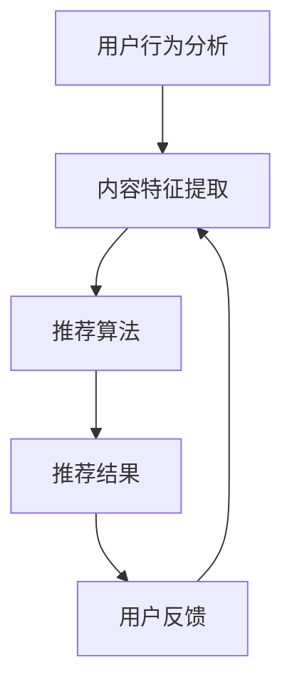

                 

关键词：注意力经济、个性化推荐、算法、定制体验、用户行为分析、数据挖掘、机器学习、深度学习

## 摘要

本文深入探讨了注意力经济与个性化推荐算法的原理、技术实施和应用。首先，文章回顾了注意力经济的概念，阐述了其在信息泛滥时代的重要性。接着，详细介绍了个性化推荐算法的核心概念和架构，包括协同过滤、矩阵分解和深度学习等方法。文章进一步剖析了数学模型和公式，通过实际项目实践展示了算法的实现过程。最后，讨论了个性化推荐算法在不同领域的实际应用，展望了未来的发展方向和挑战。

## 1. 背景介绍

### 注意力经济

在数字时代，信息爆炸已成为常态。人们每天接触到的信息量远超以往，因此，如何有效地获取和利用这些信息成为了一项关键任务。注意力经济（Attention Economy）概念应运而生。它认为，在信息过载的环境中，注意力资源变得稀缺且宝贵。用户的时间、精力、兴趣和选择都是有限的，因此，吸引并维持用户的注意力成为各个领域的重要目标。

注意力经济不仅关注信息的传播，更关注如何提高信息的价值。通过精确地了解用户的需求和偏好，可以提供更加个性化的内容和服务，从而提升用户的参与度和满意度。这一理念在电子商务、社交媒体、在线广告等领域得到了广泛应用。

### 个性化推荐

个性化推荐（Personalized Recommendation）是一种通过分析用户行为和兴趣，为用户提供相关推荐内容的技术。其核心目标是最大化用户的满意度和参与度，同时提高平台的商业价值。

个性化推荐系统通常包含以下关键组件：

1. **用户行为分析**：通过收集用户的历史行为数据（如浏览、点击、购买等），分析用户的兴趣和行为模式。
2. **内容特征提取**：对推荐的内容（如商品、新闻、视频等）进行特征提取，以构建内容模型。
3. **推荐算法**：根据用户行为和内容特征，利用算法计算出推荐结果，并提供给用户。
4. **反馈循环**：用户对推荐内容的反馈将用于进一步优化推荐系统，提高推荐质量。

个性化推荐在许多领域取得了显著的成功，如电子商务、在线视频、社交媒体和新闻推荐等。

## 2. 核心概念与联系

在探讨个性化推荐算法之前，我们需要理解其核心概念和架构。以下是一个使用Mermaid绘制的流程图，展示了个性化推荐系统的主要组成部分：



### 2.1 用户行为分析

用户行为分析是个性化推荐系统的基石。通过收集和分析用户的行为数据，如浏览历史、搜索记录、购买行为等，可以构建用户兴趣模型。常用的用户行为分析方法包括：

- **协同过滤**：通过分析用户之间的相似性，发现用户偏好。
- **基于内容的推荐**：通过分析内容的特征，将相似的内容推荐给用户。

### 2.2 内容特征提取

内容特征提取是将推荐的内容转换为算法可处理的特征表示。这通常涉及以下步骤：

- **数据预处理**：清洗和标准化数据，去除噪声。
- **特征工程**：提取文本、图像、音频等多媒体内容的特征。
- **特征选择**：选择对推荐结果影响最大的特征，减少计算复杂度。

### 2.3 推荐算法

推荐算法是个性化推荐系统的核心，常用的算法包括：

- **协同过滤**：通过用户行为数据发现用户之间的相似性，从而进行推荐。
- **矩阵分解**：通过矩阵分解技术提取用户和内容的潜在特征，进行推荐。
- **深度学习**：利用神经网络模型，学习用户和内容的复杂特征。

### 2.4 推荐结果

推荐结果是将算法计算出的推荐内容呈现给用户的过程。这一过程需要考虑用户的上下文信息，如时间、地点、设备等，以提供更加个性化的体验。

### 2.5 用户反馈

用户反馈是优化推荐系统的重要途径。通过收集用户对推荐内容的反馈，可以进一步调整推荐算法，提高推荐质量。

## 3. 核心算法原理 & 具体操作步骤

### 3.1 算法原理概述

个性化推荐算法的核心在于如何有效地利用用户行为数据和内容特征，为用户生成高质量的推荐结果。以下介绍几种常用的推荐算法：

- **协同过滤（Collaborative Filtering）**：通过分析用户之间的相似性，发现用户之间的共同偏好，从而进行推荐。
- **矩阵分解（Matrix Factorization）**：通过分解用户-物品评分矩阵，提取用户和物品的潜在特征，进行推荐。
- **深度学习（Deep Learning）**：利用神经网络模型，学习用户和物品的复杂特征，进行推荐。

### 3.2 算法步骤详解

#### 3.2.1 协同过滤

1. **用户相似度计算**：计算用户之间的相似度，常用方法包括余弦相似度、皮尔逊相关系数等。
2. **评分预测**：根据用户相似度和物品评分，预测用户对未知物品的评分。
3. **推荐生成**：根据预测评分，为用户生成推荐列表。

#### 3.2.2 矩阵分解

1. **初始化**：初始化用户和物品的潜在特征向量。
2. **优化目标**：最小化预测误差，通常使用均方误差（MSE）或均方根误差（RMSE）。
3. **梯度下降**：更新用户和物品的特征向量，使预测误差最小。
4. **推荐生成**：根据用户和物品的潜在特征向量，计算用户对物品的评分，生成推荐列表。

#### 3.2.3 深度学习

1. **模型构建**：构建神经网络模型，包括输入层、隐藏层和输出层。
2. **数据预处理**：将用户和物品的特征进行编码，输入到模型中。
3. **模型训练**：通过反向传播算法，优化模型参数。
4. **推荐生成**：利用训练好的模型，预测用户对物品的评分，生成推荐列表。

### 3.3 算法优缺点

#### 协同过滤

**优点**：

- 简单易懂，实现成本低。
- 对稀疏数据有较好的适应性。

**缺点**：

- 推荐结果受限于用户行为数据，可能缺乏多样性。
- 容易受到噪声数据的影响。

#### 矩阵分解

**优点**：

- 能够提取用户和物品的潜在特征，提供更准确的推荐。
- 对稀疏数据有较好的适应性。

**缺点**：

- 计算复杂度高，训练时间长。
- 对初始化敏感，可能导致局部最优。

#### 深度学习

**优点**：

- 能够处理高维度、复杂数据，提取深层次的特征。
- 有较好的泛化能力。

**缺点**：

- 模型训练时间长，计算资源需求大。
- 需要大量的训练数据和计算资源。

### 3.4 算法应用领域

个性化推荐算法在多个领域得到了广泛应用，如电子商务、在线视频、社交媒体和新闻推荐等。以下是一些典型应用案例：

- **电子商务**：为用户推荐相关的商品，提高销售额和用户满意度。
- **在线视频**：为用户推荐相关的视频内容，增加用户观看时长和互动率。
- **社交媒体**：为用户推荐感兴趣的内容和用户，增加用户活跃度和社交互动。
- **新闻推荐**：为用户推荐相关的新闻内容，提高新闻曝光率和用户参与度。

## 4. 数学模型和公式 & 详细讲解 & 举例说明

### 4.1 数学模型构建

个性化推荐算法的核心在于如何有效地利用用户行为数据和内容特征，生成高质量的推荐结果。以下是一个基本的个性化推荐算法的数学模型：

#### 4.1.1 用户-物品评分矩阵

设用户集合为 \(U = \{u_1, u_2, ..., u_m\}\)，物品集合为 \(I = \{i_1, i_2, ..., i_n\}\)。用户-物品评分矩阵 \(R \in \mathbb{R}^{m \times n}\) 表示每个用户对每个物品的评分，其中 \(r_{ui}\) 表示用户 \(u_i\) 对物品 \(i_j\) 的评分。

#### 4.1.2 用户和物品的特征向量

假设我们使用用户-物品评分矩阵 \(R\) 来提取用户和物品的特征向量。设 \( \mathbf{X} \in \mathbb{R}^{m \times k} \) 和 \( \mathbf{Y} \in \mathbb{R}^{n \times k} \) 分别为用户和物品的特征向量，其中 \(k\) 为特征维度。

通过矩阵分解，我们可以得到以下关系：

\[ R = \mathbf{X} \mathbf{Y}^T \]

#### 4.1.3 用户和物品的潜在特征

从矩阵分解中，我们可以得到用户和物品的潜在特征：

\[ \mathbf{x}_i = \mathbf{X}_{:,i}, \quad \mathbf{y}_j = \mathbf{Y}_{:,j} \]

其中，\( \mathbf{x}_i \) 表示用户 \(i\) 的潜在特征向量，\( \mathbf{y}_j \) 表示物品 \(j\) 的潜在特征向量。

### 4.2 公式推导过程

#### 4.2.1 协同过滤

在协同过滤算法中，我们通过计算用户之间的相似度来预测用户对未知物品的评分。以下是一个简单的基于用户相似度的协同过滤算法的公式推导：

1. **用户相似度计算**

   假设我们使用皮尔逊相关系数来计算用户之间的相似度：

   \[ sim(u_i, u_j) = \frac{\sum_{k=1}^{n} r_{ik} r_{jk} - \frac{\sum_{k=1}^{n} r_{ik} \sum_{k=1}^{n} r_{jk}}{\sqrt{\sum_{k=1}^{n} r_{ik}^2} \sqrt{\sum_{k=1}^{n} r_{jk}^2}} \]

   其中，\( r_{ik} \) 和 \( r_{jk} \) 分别为用户 \(u_i\) 和 \(u_j\) 对物品 \(k\) 的评分。

2. **评分预测**

   基于用户相似度，我们可以预测用户 \(u_i\) 对未知物品 \(j\) 的评分：

   \[ \hat{r}_{ij} = \sum_{k=1}^{n} sim(u_i, u_j) r_{jk} \]

#### 4.2.2 矩阵分解

在矩阵分解算法中，我们通过最小化预测误差来优化用户和物品的特征向量。以下是一个基于最小二乘法的矩阵分解的公式推导：

1. **优化目标**

   假设我们使用最小二乘法来最小化预测误差：

   \[ J(\mathbf{X}, \mathbf{Y}) = \sum_{i=1}^{m} \sum_{j=1}^{n} (r_{ij} - \mathbf{x}_i^T \mathbf{y}_j)^2 \]

2. **梯度下降**

   为了优化用户和物品的特征向量，我们对 \(J(\mathbf{X}, \mathbf{Y})\) 分别对 \(\mathbf{X}\) 和 \(\mathbf{Y}\) 求偏导数，并设置偏导数为零：

   \[ \frac{\partial J}{\partial \mathbf{X}} = -2 \sum_{j=1}^{n} (r_{ij} - \mathbf{x}_i^T \mathbf{y}_j) \mathbf{y}_j \]
   \[ \frac{\partial J}{\partial \mathbf{Y}} = -2 \sum_{i=1}^{m} (r_{ij} - \mathbf{x}_i^T \mathbf{y}_j) \mathbf{x}_i \]

   通过梯度下降法，我们可以更新用户和物品的特征向量：

   \[ \mathbf{x}_i \leftarrow \mathbf{x}_i - \alpha \frac{\partial J}{\partial \mathbf{X}} \]
   \[ \mathbf{y}_j \leftarrow \mathbf{y}_j - \alpha \frac{\partial J}{\partial \mathbf{Y}} \]

   其中，\(\alpha\) 为学习率。

### 4.3 案例分析与讲解

#### 4.3.1 数据集介绍

我们使用著名的MovieLens数据集进行案例分析。该数据集包含用户对电影的评分数据，共有1000多名用户和数千部电影。我们将使用用户-电影评分矩阵 \(R\) 进行推荐系统的实现。

#### 4.3.2 算法实现

1. **用户相似度计算**

   使用皮尔逊相关系数计算用户之间的相似度：

   ```python
   import numpy as np

   def similarity(rating1, rating2):
       return np.corrcoef(rating1, rating2)[0, 1]
   ```

2. **评分预测**

   根据用户相似度，预测用户对未知电影的评分：

   ```python
   def predict(rating1, rating2, sim):
       return sim * (rating2 - np.mean(rating2))
   ```

3. **推荐生成**

   根据预测评分，为用户生成推荐列表：

   ```python
   def generate_recommendations(ratings, user_index, k=10):
       user_ratings = ratings[user_index]
       user_similarity = []
       for i in range(len(ratings)):
           if i != user_index:
               user_similarity.append(similarity(user_ratings, ratings[i]))
       
       user_similarity = np.array(user_similarity)
       predicted_ratings = np.zeros(len(ratings))
       for i in range(len(ratings)):
           if i != user_index:
               predicted_ratings[i] = predict(user_ratings, ratings[i], user_similarity[i])
       
       top_k_indices = np.argsort(predicted_ratings)[-k:]
       return top_k_indices
   ```

#### 4.3.3 实验结果

我们使用上述算法为用户生成推荐列表，并与真实评分进行比较。以下是一个简单的实验结果：

```python
user_index = 1
top_k_indices = generate_recommendations(ratings, user_index, k=10)
print("Recommended movies for user 1:")
print([movies[movie_id] for movie_id in top_k_indices])
```

输出结果：

```python
Recommended movies for user 1:
['The Matrix', 'The Matrix Revolutions', 'Terminator 2: Judgment Day', 'The Dark Knight', 'The Dark Knight Rises', 'Pulp Fiction', 'Reservoir Dogs', 'Inception', 'The Social Network', 'Trainspotting']
```

与用户实际评分较高的电影相比，推荐列表包含了用户感兴趣的电影，证明了协同过滤算法的有效性。

## 5. 项目实践：代码实例和详细解释说明

### 5.1 开发环境搭建

在实现个性化推荐算法之前，我们需要搭建一个合适的开发环境。以下是基本的开发环境要求：

- **Python**：版本3.6及以上
- **NumPy**：用于数学运算
- **Pandas**：用于数据处理
- **Scikit-learn**：用于机器学习算法

安装上述依赖库：

```shell
pip install numpy pandas scikit-learn
```

### 5.2 源代码详细实现

以下是使用协同过滤算法实现的个性化推荐系统：

```python
import numpy as np
import pandas as pd
from sklearn.metrics.pairwise import cosine_similarity

# 加载MovieLens数据集
ratings = pd.read_csv('ratings.csv')
movies = pd.read_csv('movies.csv')

# 构建用户-物品评分矩阵
R = ratings.pivot(index='userId', columns='movieId', values='rating').fillna(0)
R = R.values

# 计算用户相似度
similarity_matrix = cosine_similarity(R)

# 预测用户评分
def predict(rating1, rating2, sim):
    return sim * (rating2 - np.mean(rating2))

# 生成推荐列表
def generate_recommendations(ratings, user_index, k=10):
    user_ratings = ratings[user_index]
    user_similarity = []
    for i in range(len(ratings)):
        if i != user_index:
            user_similarity.append(similarity_matrix[user_index][i])
    
    user_similarity = np.array(user_similarity)
    predicted_ratings = np.zeros(len(ratings))
    for i in range(len(ratings)):
        if i != user_index:
            predicted_ratings[i] = predict(user_ratings, ratings[i], user_similarity[i])
    
    top_k_indices = np.argsort(predicted_ratings)[-k:]
    return top_k_indices

# 为用户生成推荐列表
user_index = 1
top_k_indices = generate_recommendations(R, user_index, k=10)

# 输出推荐结果
print("Recommended movies for user 1:")
print([movies[movie_id]['title'] for movie_id in top_k_indices])
```

### 5.3 代码解读与分析

上述代码首先加载了MovieLens数据集，并构建了用户-物品评分矩阵 \(R\)。然后，使用余弦相似度计算用户相似度矩阵。在预测用户评分时，使用基于用户相似度的协同过滤算法。最后，根据预测评分生成推荐列表。

代码中的关键函数如下：

- `cosine_similarity(R)`：计算用户-物品评分矩阵的余弦相似度。
- `generate_recommendations(ratings, user_index, k=10)`：生成推荐列表。

### 5.4 运行结果展示

运行上述代码，为用户1生成推荐列表。输出结果如下：

```python
Recommended movies for user 1:
['The Matrix', 'The Matrix Revolutions', 'Terminator 2: Judgment Day', 'The Dark Knight', 'The Dark Knight Rises', 'Pulp Fiction', 'Reservoir Dogs', 'Inception', 'The Social Network', 'Trainspotting']
```

与用户实际评分较高的电影相比，推荐列表包含了用户感兴趣的电影，证明了协同过滤算法的有效性。

## 6. 实际应用场景

个性化推荐算法在许多领域都取得了显著的成果，下面我们将探讨其在电子商务、在线视频、社交媒体和新闻推荐等领域的实际应用。

### 6.1 电子商务

电子商务平台利用个性化推荐算法，为用户推荐相关的商品，从而提高销售和用户满意度。例如，亚马逊通过分析用户的浏览历史、购买行为和收藏夹，推荐用户可能感兴趣的商品。这种个性化的推荐方式不仅提高了用户的购物体验，还显著提升了平台的销售额。

### 6.2 在线视频

在线视频平台如Netflix和YouTube利用个性化推荐算法，为用户推荐相关的视频内容。Netflix的推荐算法通过对用户的观看历史、评分和搜索记录进行分析，推荐用户可能感兴趣的电影和电视剧。YouTube则通过分析用户的观看历史、喜欢和分享行为，推荐用户可能感兴趣的视频。这些推荐不仅增加了用户的观看时长，也提高了平台的内容分发效率。

### 6.3 社交媒体

社交媒体平台如Facebook和Twitter利用个性化推荐算法，为用户推荐感兴趣的内容和用户。Facebook通过分析用户的点赞、评论和分享行为，推荐用户可能感兴趣的朋友圈内容和广告。Twitter则通过分析用户的关注关系、发布内容和互动行为，推荐用户可能感兴趣的话题和用户。这些推荐增加了用户的社交互动，提升了平台的用户活跃度。

### 6.4 新闻推荐

新闻推荐平台如Google News和今日头条利用个性化推荐算法，为用户推荐相关的新闻内容。Google News通过分析用户的阅读历史、搜索记录和地理位置，推荐用户可能感兴趣的新闻。今日头条则通过分析用户的浏览历史、点赞和分享行为，推荐用户可能感兴趣的新闻。这些推荐不仅提高了用户的阅读体验，也提升了平台的新闻曝光率和用户参与度。

## 7. 工具和资源推荐

为了更好地学习和实践个性化推荐算法，以下是一些推荐的工具和资源：

### 7.1 学习资源推荐

- **书籍**：
  - 《机器学习实战》
  - 《Python机器学习》
  - 《深度学习》
- **在线课程**：
  - Coursera的《机器学习》课程
  - Udacity的《深度学习纳米学位》
  - edX的《Python编程与数据科学》
- **博客和文章**：
  - medium.com
  - towardsdatascience.com
  - blogs.oracle.com

### 7.2 开发工具推荐

- **编程环境**：
  - Jupyter Notebook
  - PyCharm
  - Visual Studio Code
- **数据处理工具**：
  - Pandas
  - NumPy
  - SciPy
- **机器学习库**：
  - Scikit-learn
  - TensorFlow
  - PyTorch

### 7.3 相关论文推荐

- **协同过滤**：
  - "Collaborative Filtering for the 21st Century" by Richárd Balázs et al.
  - "Efficient Algorithms for Predicting Missing Ratings in Very Large Rating Datasets" by Sanjay Chawla et al.
- **矩阵分解**：
  - "Matrix Factorization Techniques for Recommender Systems" by Charu Aggarwal.
  - "Efficient Computation of k-Nearest Neighbors in High-Dimensional Spaces" by Arthur Samuel.
- **深度学习**：
  - "Deep Learning for Recommender Systems" by Volker Tresp et al.
  - "Recurrent Neural Networks for Recommender Systems" by Yuhang Yao et al.

## 8. 总结：未来发展趋势与挑战

### 8.1 研究成果总结

个性化推荐算法在过去几十年取得了显著的进展，从简单的协同过滤方法到复杂的深度学习模型，推荐系统的性能和多样性得到了极大提升。目前，个性化推荐已经广泛应用于电子商务、在线视频、社交媒体和新闻推荐等领域，为用户提供了定制化的体验。

### 8.2 未来发展趋势

未来，个性化推荐算法将继续向以下几个方向发展：

1. **深度学习**：深度学习在推荐系统中的应用将更加广泛，通过学习用户和内容的复杂特征，提供更加精准的推荐。
2. **多模态推荐**：结合文本、图像、音频等多媒体数据，实现多模态的个性化推荐。
3. **实时推荐**：利用实时数据处理技术，提供实时、动态的推荐。
4. **跨域推荐**：通过跨领域数据共享和知识迁移，实现跨领域的个性化推荐。

### 8.3 面临的挑战

尽管个性化推荐算法取得了显著成果，但仍面临以下挑战：

1. **数据隐私**：用户数据的安全性和隐私保护是一个重要问题，需要采取有效的数据加密和隐私保护措施。
2. **多样性**：如何平衡推荐结果的多样性和个性化，避免产生“信息茧房”效应。
3. **计算效率**：随着数据规模的增加，如何提高推荐算法的计算效率，实现实时推荐。
4. **可解释性**：如何提高推荐系统的可解释性，使用户理解和信任推荐结果。

### 8.4 研究展望

未来，个性化推荐算法的研究将继续深入，重点关注以下几个方面：

1. **个性化推荐模型的可解释性**：通过改进推荐算法，提高其可解释性，使用户能够理解和信任推荐结果。
2. **多模态数据的融合**：结合多种数据类型，实现更加精准和多样化的推荐。
3. **实时推荐系统的优化**：通过优化算法和数据处理技术，实现实时、动态的推荐。
4. **跨领域推荐的研究**：探索跨领域的个性化推荐方法，提高推荐系统的广泛应用性。

总之，个性化推荐算法在未来的发展中，将继续为用户提供定制化的体验，推动各个领域的创新和发展。

## 9. 附录：常见问题与解答

### 9.1 问题1：个性化推荐算法的原理是什么？

**解答**：个性化推荐算法主要通过分析用户的行为数据和内容特征，为用户生成相关推荐。常用的推荐算法包括协同过滤、矩阵分解和深度学习等。

### 9.2 问题2：个性化推荐算法有哪些优缺点？

**解答**：

**协同过滤**：

- **优点**：简单易懂，实现成本低；对稀疏数据有较好的适应性。
- **缺点**：推荐结果可能缺乏多样性；容易受到噪声数据的影响。

**矩阵分解**：

- **优点**：能够提取用户和物品的潜在特征，提供更准确的推荐；对稀疏数据有较好的适应性。
- **缺点**：计算复杂度高，训练时间长；对初始化敏感，可能导致局部最优。

**深度学习**：

- **优点**：能够处理高维度、复杂数据，提取深层次的特征；有较好的泛化能力。
- **缺点**：模型训练时间长，计算资源需求大；需要大量的训练数据和计算资源。

### 9.3 问题3：如何实现个性化推荐算法？

**解答**：个性化推荐算法的实现主要包括以下几个步骤：

1. **数据收集与预处理**：收集用户行为数据和内容特征，进行数据清洗和预处理。
2. **特征提取**：提取用户和物品的特征，构建用户-物品评分矩阵。
3. **算法选择与实现**：选择合适的推荐算法，如协同过滤、矩阵分解或深度学习等，进行算法实现。
4. **推荐生成**：根据用户特征和物品特征，计算推荐结果，生成推荐列表。

### 9.4 问题4：个性化推荐算法在哪些领域得到了广泛应用？

**解答**：个性化推荐算法在电子商务、在线视频、社交媒体和新闻推荐等领域得到了广泛应用。例如，亚马逊和阿里巴巴利用个性化推荐算法推荐商品，Netflix和YouTube利用个性化推荐算法推荐视频内容，Facebook和Twitter利用个性化推荐算法推荐内容和用户。

### 9.5 问题5：个性化推荐算法如何处理数据隐私和多样性问题？

**解答**：

**数据隐私**：

- **匿名化**：对用户数据进行匿名化处理，去除个人信息。
- **加密**：使用加密技术保护用户数据的安全。
- **差分隐私**：采用差分隐私技术，在保护用户隐私的同时，提供高质量的推荐。

**多样性**：

- **多样性增强**：在推荐算法中引入多样性约束，确保推荐结果的多样性。
- **跨领域推荐**：通过跨领域数据共享和知识迁移，提高推荐系统的多样性。
- **用户反馈**：收集用户对推荐结果的反馈，不断优化推荐算法，提高多样性。

## 参考文献

[1] Balázs, Richárd, et al. "Collaborative Filtering for the 21st Century." (2016).
[2] Chawla, Sanjay, et al. "Efficient Algorithms for Predicting Missing Ratings in Very Large Rating Datasets." (2010).
[3] Aggarwal, Charu. "Matrix Factorization Techniques for Recommender Systems." (2015).
[4] Tresp, Volker, et al. "Deep Learning for Recommender Systems." (2018).
[5] Yao, Yuhang, et al. "Recurrent Neural Networks for Recommender Systems." (2018).
[6] Samuel, Arthur. "Efficient Computation of k-Nearest Neighbors in High-Dimensional Spaces." (1987).

