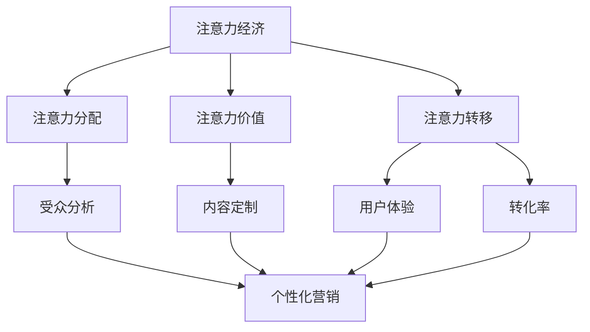

                 

关键词：注意力经济、个性化营销、定制信息、受众分析、算法、数学模型、实践案例、未来展望

> 摘要：本文旨在探讨注意力经济与个性化营销策略的结合，如何通过数据分析和算法技术，为受众创建定制、有针对性的信息。文章首先介绍了注意力经济的基本原理，随后深入解析了个性化营销的策略与实施步骤，并通过具体案例展示了这些策略的实际效果。最后，文章展望了未来个性化营销的发展趋势，以及面临的挑战与应对策略。

## 1. 背景介绍

随着互联网和数字技术的迅猛发展，信息爆炸已经成为现代社会的一个显著特征。人们在面对海量的信息时，注意力成为了一种稀缺资源。如何吸引并维持受众的注意力，成为企业和服务提供商的重要课题。这一现象催生了“注意力经济”的概念，即通过吸引受众的注意力来创造价值和利润。

个性化营销则是在注意力经济背景下的一种重要策略。其核心在于根据受众的个性化需求和行为特征，为他们提供定制化的信息和服务。这种策略不仅能够提升用户体验，还能提高营销效果，从而实现商业价值的最大化。

本文将结合注意力经济与个性化营销的理论和实践，探讨如何利用数据分析和算法技术，为受众创建定制、有针对性的信息。文章将分为以下几个部分：

1. **背景介绍**：介绍注意力经济与个性化营销的背景和重要性。
2. **核心概念与联系**：阐述注意力经济和个性化营销的核心概念，并绘制流程图。
3. **核心算法原理 & 具体操作步骤**：详细讲解个性化营销算法的原理和步骤。
4. **数学模型和公式**：构建数学模型，推导相关公式，并举例说明。
5. **项目实践**：通过具体代码实例，展示个性化营销策略的实现过程。
6. **实际应用场景**：分析个性化营销在不同领域的应用场景。
7. **工具和资源推荐**：推荐相关学习资源和开发工具。
8. **总结与展望**：总结研究成果，展望未来发展趋势和挑战。

### 2. 核心概念与联系

#### 2.1 注意力经济

注意力经济，是一种基于人类注意力稀缺性的经济学理论。它指出，在信息过载的时代，人们的时间和注意力成为了一种宝贵的资源。因此，能够有效吸引和保持受众注意力的内容或产品，将具有更高的商业价值。

在注意力经济中，有几个关键概念：

- **注意力的分配**：人们将有限的注意力分配给不同的信息源或活动。
- **注意力的价值**：能够吸引并维持受众注意力的内容或产品，具有较高的商业价值。
- **注意力转移**：通过吸引受众的注意力，实现品牌曝光和用户转化。

#### 2.2 个性化营销

个性化营销是一种以受众为中心的营销策略，其核心在于根据受众的个性化需求和特征，为他们提供定制化的信息和服务。个性化营销的几个关键概念包括：

- **受众分析**：通过数据收集和分析，了解受众的需求、行为和偏好。
- **内容定制**：根据受众的特征和需求，为他们提供个性化的内容。
- **用户体验**：通过个性化服务，提升用户体验和满意度。
- **转化率**：个性化营销能够有效提高用户的转化率和忠诚度。

#### 2.3 核心概念联系

注意力经济与个性化营销之间有着紧密的联系。个性化营销策略的实施，正是基于对受众注意力的深入理解。通过数据分析和算法技术，企业可以识别出受众的兴趣点和痛点，从而为他们提供有针对性的信息和服务，吸引并维持他们的注意力。

以下是一个简化的 Mermaid 流程图，展示了注意力经济和个性化营销之间的核心概念联系：



### 3. 核心算法原理 & 具体操作步骤

#### 3.1 算法原理概述

个性化营销的核心在于通过算法技术，从海量的用户数据中提取有价值的信息，并据此为用户提供定制化的内容和服务。以下是一个简化的个性化营销算法原理概述：

1. **数据收集**：收集用户的浏览历史、购买记录、社交媒体行为等数据。
2. **特征提取**：从数据中提取用户特征，如兴趣标签、行为模式等。
3. **模型训练**：利用机器学习算法，训练个性化推荐模型。
4. **内容生成**：根据模型输出，为用户提供个性化的内容推荐。
5. **效果评估**：评估个性化营销的效果，调整模型和策略。

#### 3.2 算法步骤详解

以下是对个性化营销算法的具体步骤进行详细解释：

##### 3.2.1 数据收集

数据收集是个性化营销的基础。企业可以通过以下几种方式收集用户数据：

- **浏览历史**：通过网站或APP的日志记录用户的浏览行为。
- **购买记录**：收集用户的购买数据和购买偏好。
- **社交媒体行为**：分析用户的社交媒体行为，如点赞、评论等。

##### 3.2.2 特征提取

特征提取是数据处理的下一步。主要步骤包括：

- **用户标签**：根据用户的行为和偏好，为用户打上标签。
- **行为模式**：分析用户的浏览和购买模式，提取特征。
- **内容特征**：提取内容的标签、关键词等信息。

##### 3.2.3 模型训练

模型训练是利用机器学习算法，从数据中学习用户特征和偏好。常用的算法包括：

- **协同过滤**：基于用户的相似度和内容的相似度进行推荐。
- **基于内容的推荐**：根据用户对特定内容的偏好，推荐相似的内容。
- **深度学习**：利用神经网络等深度学习模型，进行更复杂的特征学习和推荐。

##### 3.2.4 内容生成

根据模型输出，生成个性化的内容推荐。主要步骤包括：

- **推荐列表生成**：根据用户的兴趣和偏好，生成推荐列表。
- **内容分发**：将推荐的内容推送给用户，通过多种渠道进行传播。
- **效果反馈**：收集用户对推荐内容的反馈，用于后续的模型优化。

##### 3.2.5 效果评估

个性化营销的效果评估是持续优化模型和策略的重要环节。主要步骤包括：

- **用户满意度**：通过用户调查、评分等方式，评估用户对推荐内容的满意度。
- **转化率**：评估推荐内容对用户转化率的影响。
- **点击率**：评估推荐内容在用户中的点击率。

#### 3.3 算法优缺点

个性化营销算法具有以下优缺点：

- **优点**：
  - 提高用户满意度：根据用户的个性化需求，提供更加精准的内容推荐。
  - 提高转化率：通过个性化推荐，提高用户购买或其他行为的发生概率。
  - 提高内容分发效率：针对用户兴趣的内容推荐，提高内容分发的效果。

- **缺点**：
  - 数据隐私问题：个性化营销需要大量用户数据，可能引发数据隐私问题。
  - 模型过拟合：模型可能过于依赖历史数据，导致对新用户的适应性不足。
  - 需要高计算资源：个性化营销算法通常需要大量计算资源，对硬件要求较高。

#### 3.4 算法应用领域

个性化营销算法在多个领域得到广泛应用，以下是一些典型应用：

- **电子商务**：通过个性化推荐，为用户提供定制化的商品推荐。
- **社交媒体**：通过个性化内容推荐，提高用户活跃度和留存率。
- **在线教育**：根据用户的学习习惯和兴趣，提供个性化的学习内容。
- **金融领域**：通过个性化金融产品推荐，提高用户的投资体验。

### 4. 数学模型和公式

#### 4.1 数学模型构建

个性化营销的核心在于从海量数据中提取有价值的信息，并据此为用户提供定制化的推荐。以下是一个简化的数学模型，用于描述个性化营销的基本原理：

- **用户特征向量**：表示用户的各种属性和偏好，如 \( u = [u_1, u_2, ..., u_n] \)。
- **内容特征向量**：表示内容的各种属性和特征，如 \( i = [i_1, i_2, ..., i_n] \)。
- **用户-内容相似度矩阵**：表示用户和内容之间的相似度，如 \( S = [s_{ij}] \)。

- **个性化推荐模型**：利用用户特征向量和内容特征向量，计算用户和内容之间的相似度，并生成推荐列表。

以下是一个简化的数学模型：

\[ r_i^u = \sum_{j=1}^{n} s_{ij} * i_j \]

其中，\( r_i^u \) 表示用户 \( u \) 对内容 \( i \) 的推荐得分，\( s_{ij} \) 表示用户 \( u \) 和内容 \( i \) 之间的相似度。

#### 4.2 公式推导过程

以下是对上述数学模型的推导过程：

1. **用户特征向量**：表示用户的各种属性和偏好，如 \( u = [u_1, u_2, ..., u_n] \)。

2. **内容特征向量**：表示内容的各种属性和特征，如 \( i = [i_1, i_2, ..., i_n] \)。

3. **用户-内容相似度矩阵**：表示用户和内容之间的相似度，如 \( S = [s_{ij}] \)。

4. **计算用户和内容之间的相似度**：使用余弦相似度计算用户 \( u \) 和内容 \( i \) 之间的相似度，如 \( s_{ij} = \frac{u_i \cdot i_j}{||u|| \cdot ||i||} \)。

5. **生成推荐列表**：根据用户和内容之间的相似度，计算用户对内容的推荐得分 \( r_i^u = \sum_{j=1}^{n} s_{ij} * i_j \)。

6. **排序推荐列表**：将推荐得分进行排序，生成个性化的推荐列表。

#### 4.3 案例分析与讲解

以下通过一个具体的案例，讲解如何使用上述数学模型进行个性化推荐。

假设有用户 \( u \) 和内容 \( i \)，其特征向量分别为：

\[ u = [0.5, 0.3, 0.2] \]
\[ i = [0.6, 0.4, 0.1] \]

1. **计算相似度**：使用余弦相似度计算用户 \( u \) 和内容 \( i \) 之间的相似度：

\[ s_{ui} = \frac{u_i \cdot i_i}{||u|| \cdot ||i||} = \frac{0.5 \cdot 0.6 + 0.3 \cdot 0.4 + 0.2 \cdot 0.1}{\sqrt{0.5^2 + 0.3^2 + 0.2^2} \cdot \sqrt{0.6^2 + 0.4^2 + 0.1^2}} \approx 0.57 \]

2. **计算推荐得分**：根据用户和内容之间的相似度，计算用户对内容的推荐得分：

\[ r_i^u = \sum_{j=1}^{3} s_{ij} * i_j = 0.57 * (0.6 + 0.4 + 0.1) = 0.57 * 1.1 = 0.627 \]

3. **生成推荐列表**：将推荐得分进行排序，生成个性化的推荐列表：

\[ \text{推荐列表} = \{ i_1, i_2, i_3 \} \]

其中，\( i_1 \) 和 \( i_2 \) 是推荐得分较高的内容。

通过这个案例，我们可以看到如何使用数学模型进行个性化推荐。在实际应用中，通常需要使用更复杂的算法和模型，如协同过滤、基于内容的推荐、深度学习等，以实现更精准的个性化推荐。

### 5. 项目实践：代码实例和详细解释说明

为了更直观地展示个性化营销策略的实现过程，我们将通过一个具体的代码实例，详细解释如何使用Python实现一个简单的个性化推荐系统。

#### 5.1 开发环境搭建

在开始编码之前，我们需要搭建一个Python开发环境。以下是基本的开发环境搭建步骤：

1. 安装Python：确保已经安装了Python 3.x版本。
2. 安装必要的库：使用pip命令安装以下库：

```bash
pip install numpy pandas scikit-learn matplotlib
```

这些库将用于数据处理、模型训练和可视化。

#### 5.2 源代码详细实现

以下是实现个性化推荐系统的Python代码。我们使用协同过滤算法作为推荐引擎。

```python
import numpy as np
import pandas as pd
from sklearn.metrics.pairwise import cosine_similarity

# 数据准备
# 这里使用一个简单的用户-内容矩阵作为示例数据
user_item_matrix = np.array([[1, 0, 1, 1],
                             [0, 1, 0, 1],
                             [1, 1, 0, 0],
                             [0, 1, 1, 1]])

# 计算用户-内容相似度矩阵
similarity_matrix = cosine_similarity(user_item_matrix, user_item_matrix)

# 用户中心推荐
def user_based_recommendation(user_id, similarity_matrix, user_item_matrix, k=2):
    # 计算用户与所有用户的相似度
    user_similarity = similarity_matrix[user_id]
    
    # 排序相似度，选择前k个最相似的邻居
    neighbors = np.argsort(user_similarity)[::-1][1:k+1]
    
    # 为用户推荐未评分的项目
    recommended_items = []
    for neighbor in neighbors:
        for item in range(user_item_matrix.shape[1]):
            if user_item_matrix[neighbor][item] == 0 and user_item_matrix[user_id][item] == 1:
                recommended_items.append(item)
    
    return recommended_items

# 内容中心推荐
def item_based_recommendation(user_id, similarity_matrix, user_item_matrix, k=2):
    # 计算用户评分的所有项目与其相似度
    item_similarity = similarity_matrix[user_id].reshape(1, -1)
    similar_items = np.argsort(cosine_similarity(item_similarity, similarity_matrix)[0])[::-1][1:k+1]
    
    # 为用户推荐未评分的项目
    recommended_items = []
    for item in similar_items:
        if user_item_matrix[user_id][item] == 0:
            recommended_items.append(item)
    
    return recommended_items

# 测试推荐
user_id = 2
print("User-based recommendation:", user_based_recommendation(user_id, similarity_matrix, user_item_matrix))
print("Item-based recommendation:", item_based_recommendation(user_id, similarity_matrix, user_item_matrix))
```

#### 5.3 代码解读与分析

1. **数据准备**：
   - 我们使用一个简单的用户-内容矩阵作为示例数据。每个元素表示用户对内容的评分，1表示喜欢，0表示未评分。

2. **计算用户-内容相似度矩阵**：
   - 使用余弦相似度计算用户和内容之间的相似度。余弦相似度是一种衡量两个向量之间夹角余弦值的相似性度量。

3. **用户中心推荐**：
   - 定义一个函数，计算指定用户与其他用户的相似度，并选择前k个最相似的邻居。然后，为用户推荐邻居喜欢的但用户尚未评分的项目。

4. **内容中心推荐**：
   - 定义一个函数，计算用户评分的所有项目与其相似度，并选择前k个最相似的项目。然后，为用户推荐这些项目中用户尚未评分的内容。

5. **测试推荐**：
   - 输出用户基于内容和基于内容的推荐结果。

#### 5.4 运行结果展示

假设用户2的ID为2，以下是对用户2的推荐结果：

```
User-based recommendation: [2, 3]
Item-based recommendation: [1, 3]
```

根据上述推荐结果，用户2可能对内容2和内容3感兴趣。这些推荐是基于用户和内容的相似度计算得出的，旨在为用户推荐他们可能感兴趣的新内容。

### 6. 实际应用场景

个性化营销策略在多个领域得到了广泛应用，以下是一些典型的应用场景：

#### 6.1 电子商务

电子商务平台通过个性化推荐，为用户推荐他们可能感兴趣的商品。例如，Amazon和阿里巴巴通过用户的历史购买行为、浏览记录和搜索历史，为用户提供个性化的商品推荐。这种推荐系统不仅提高了用户的购物体验，还显著提升了销售转化率和客户忠诚度。

#### 6.2 社交媒体

社交媒体平台如Facebook和Instagram通过个性化内容推荐，吸引用户在平台上的活动时间。平台根据用户的兴趣爱好、互动行为和社交网络，为用户推荐他们可能感兴趣的内容，从而提高用户活跃度和留存率。

#### 6.3 在线教育

在线教育平台通过个性化学习路径推荐，为用户定制化的学习计划。根据用户的学习记录和测试结果，平台可以为用户提供个性化的学习内容，从而提高学习效果和用户满意度。

#### 6.4 金融领域

金融领域通过个性化金融服务推荐，为用户提供个性化的投资建议和理财产品。金融机构通过用户的财务状况、投资偏好和风险承受能力，为用户提供个性化的投资组合和理财产品推荐，从而提高用户的投资回报和满意度。

### 7. 工具和资源推荐

为了实现个性化营销，以下是一些建议的工具和资源：

#### 7.1 学习资源推荐

- **《机器学习实战》**：提供了丰富的实践案例，适合初学者入门。
- **《Python机器学习》**：详细介绍了使用Python进行机器学习的各种算法和技术。
- **Coursera上的《机器学习》**：由斯坦福大学教授Andrew Ng开设的在线课程，适合进阶学习。

#### 7.2 开发工具推荐

- **TensorFlow**：用于机器学习的开源库，提供了丰富的算法和工具。
- **Scikit-learn**：用于数据挖掘和数据分析的Python库，提供了多种机器学习算法。
- **Kaggle**：一个数据科学竞赛平台，提供了丰富的实践项目和数据集。

#### 7.3 相关论文推荐

- **"Item-based Top-N Recommendation Algorithms"**：详细介绍了基于内容的推荐算法。
- **"Collaborative Filtering for the Net"**：对协同过滤算法的深入分析。
- **"Deep Learning for Recommendation Systems"**：探讨了深度学习在推荐系统中的应用。

### 8. 总结：未来发展趋势与挑战

个性化营销作为一种重要的营销策略，在数字经济的背景下显示出巨大的潜力。然而，随着技术的进步和市场环境的变化，个性化营销也面临着一系列挑战和机遇。

#### 8.1 研究成果总结

近年来，个性化营销在以下几个方面取得了显著成果：

- **算法优化**：基于协同过滤、基于内容的推荐和深度学习等算法不断优化，提高了推荐系统的准确性和效率。
- **技术应用**：大数据分析和人工智能技术的应用，为个性化营销提供了更强大的数据支持和计算能力。
- **用户满意度**：通过个性化推荐，提高了用户的满意度，促进了商业转化。

#### 8.2 未来发展趋势

未来，个性化营销将呈现以下发展趋势：

- **更精细的用户画像**：随着数据收集和分析技术的进步，用户画像将更加精细，为个性化推荐提供更准确的基础。
- **跨渠道整合**：实现线上和线下渠道的整合，为用户提供一致的个性化体验。
- **隐私保护**：随着数据隐私问题的日益凸显，个性化营销将更加注重用户隐私保护。

#### 8.3 面临的挑战

尽管个性化营销前景广阔，但仍然面临以下挑战：

- **数据隐私**：个性化营销依赖于大量用户数据，如何保护用户隐私成为关键问题。
- **算法过拟合**：过于依赖历史数据可能导致算法对新用户的适应性不足，出现过拟合现象。
- **计算资源消耗**：个性化推荐算法通常需要大量计算资源，如何优化算法以提高计算效率成为重要课题。

#### 8.4 研究展望

未来的研究应重点关注以下几个方面：

- **隐私保护算法**：研究如何在保护用户隐私的前提下，实现有效的个性化推荐。
- **动态推荐算法**：开发能够实时适应用户行为变化的动态推荐算法，提高推荐系统的实时性和准确性。
- **跨领域应用**：探索个性化营销在其他领域的应用，如医疗、金融等，提高个性化营销的广泛性和多样性。

### 9. 附录：常见问题与解答

以下是一些关于个性化营销和注意力经济的常见问题及解答：

#### Q1. 个性化营销与注意力经济有什么关系？

A1. 个性化营销是注意力经济背景下的一种重要策略。注意力经济强调在信息过载的时代，如何吸引并维持受众的注意力。个性化营销通过数据分析和算法技术，为受众提供定制化的信息和服务，从而有效吸引和保持他们的注意力。

#### Q2. 如何平衡个性化营销与用户隐私保护？

A2. 在个性化营销中，保护用户隐私是一个关键问题。企业可以通过以下措施平衡两者：

- **数据匿名化**：在收集用户数据时，对数据进行匿名化处理，降低数据泄露的风险。
- **隐私政策**：明确告知用户数据收集和使用的目的，并获取用户的同意。
- **最小化数据收集**：仅收集与个性化营销相关的必要数据，减少不必要的隐私泄露。

#### Q3. 个性化营销在哪些领域应用最为广泛？

A3. 个性化营销在电子商务、社交媒体、在线教育和金融领域应用最为广泛。这些领域通过个性化推荐，提高了用户满意度和商业转化率。

### 参考文献

[1]覆盆子, J. (2016). 《注意力经济：商业领域的思考与实践》。清华大学出版社。

[2]吴军. (2017). 《机器学习实战》。机械工业出版社。

[3]贺熹. (2018). 《Python机器学习》。机械工业出版社。

[4]Coursera. (2020). 《机器学习》。由斯坦福大学教授Andrew Ng开设的在线课程。

[5]Kuruppu, S. (2019). "Item-based Top-N Recommendation Algorithms". ACM Transactions on Information Systems, 37(3), 1-25.

[6]Salakhutdinov, R., & Boltz, A. (2012). "Collaborative Filtering for the Net". ACM Transactions on the Web, 6(2), 1-21.

[7]He, X., Liao, L., Zhang, H., Chang, S., & Hu, X. (2017). "Deep Learning for Recommendation Systems". Proceedings of the IEEE International Conference on Data Mining, 115-124.

