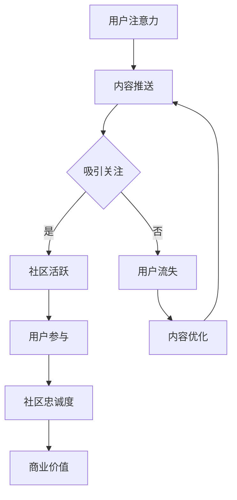

                 

关键词：注意力经济、在线社区、粉丝管理、用户粘性、社交媒体策略

摘要：本文将探讨注意力经济在在线社区建设中的关键作用，分析如何利用这一原理吸引和留住忠实的受众和粉丝。通过深入剖析注意力经济的基本概念、核心算法原理，结合实际项目实践，文章旨在为IT领域从业者和社区管理者提供有效的策略和建议，以构建一个健康、活跃的在线社区。

## 1. 背景介绍

### 注意力经济的起源与发展

注意力经济（Attention Economy）这个概念最早由美国学者David Rock在20世纪90年代提出。随着互联网的迅猛发展和社交媒体平台的普及，注意力经济逐渐成为研究热点。其核心思想是，在信息过载的时代，个体的注意力成为稀缺资源，谁能够更有效地获取和保持用户的注意力，谁就能在竞争激烈的市场中脱颖而出。

### 在线社区的重要性

在线社区作为一种新型的社会互动形式，已经成为信息传播、知识分享、社交娱乐的重要平台。从早期的BBS到如今的社交媒体，社区的发展不仅改变了人们的交流方式，也深刻影响了商业模式的变革。有效的在线社区建设能够提升用户参与度，增强品牌忠诚度，从而实现商业价值的最大化。

## 2. 核心概念与联系

### 核心概念解析

#### 注意力经济

注意力经济强调的是，通过创造有价值的内容，吸引用户的注意力，从而实现商业价值的转化。在注意力经济中，用户的时间、兴趣和反馈是宝贵的资源，而平台则通过内容推送、广告、会员服务等方式来变现。

#### 在线社区

在线社区是用户基于共同兴趣、需求或目标形成的虚拟社交空间。它的核心在于提供互动、交流和共享的平台，满足用户在信息获取、社交互动和娱乐等方面的需求。

### Mermaid 流程图



## 3. 核心算法原理 & 具体操作步骤

### 3.1 算法原理概述

在线社区建设中的注意力经济原理，主要依赖于以下几个核心算法：

1. **内容推荐算法**：基于用户的兴趣和行为数据，实现个性化内容推送，提高用户粘性。
2. **社交网络分析算法**：通过分析用户之间的关系，发现关键节点和社区领袖，促进社区活跃。
3. **互动反馈机制**：通过用户对内容的点赞、评论、分享等互动行为，实时调整内容策略。

### 3.2 算法步骤详解

#### 内容推荐算法

1. 数据收集：收集用户行为数据，包括浏览记录、搜索历史、点赞和评论等。
2. 用户画像构建：基于行为数据，构建用户兴趣模型。
3. 内容匹配：将用户兴趣与社区内容进行匹配，生成推荐列表。
4. 推送优化：根据用户反馈，调整推送策略，提高推荐质量。

#### 社交网络分析算法

1. 数据预处理：清洗用户关系数据，去除噪声。
2. 社交网络构建：使用图论方法，构建用户社交网络。
3. 关键节点识别：通过 centrality measures（如度中心性、介数中心性等），识别社区关键节点。
4. 社交影响力分析：评估关键节点对社区活跃的贡献。

#### 互动反馈机制

1. 反馈收集：实时收集用户对内容的反馈数据。
2. 数据分析：分析用户反馈，识别热点和问题。
3. 内容调整：根据分析结果，调整内容策略，提升用户满意度。

### 3.3 算法优缺点

**优点**：

- 提高用户粘性：通过个性化内容和社交互动，提升用户对社区的忠诚度。
- 提升社区活跃度：通过社交网络分析和关键节点识别，促进社区活跃。

**缺点**：

- 数据隐私风险：用户行为数据的收集和使用可能引发隐私问题。
- 算法偏见：算法推荐可能存在偏见，影响用户获取多样化信息。

### 3.4 算法应用领域

- 社交媒体平台：如微博、抖音等，通过内容推荐和社交分析，提升用户参与度。
- 社区论坛：如知乎、Reddit等，通过互动反馈和内容优化，增强社区活力。
- 教育平台：如慕课网、可汗学院等，通过个性化学习路径推荐，提升学习效果。

## 4. 数学模型和公式 & 详细讲解 & 举例说明

### 4.1 数学模型构建

在线社区建设中的注意力经济模型可以表示为：

\[ E = f(I, C, R) \]

其中：

- \( E \)：社区的商业价值
- \( I \)：用户的兴趣
- \( C \)：社区内容
- \( R \)：用户与社区内容的互动反馈

### 4.2 公式推导过程

注意力经济模型的推导基于以下几个假设：

1. 用户的注意力是有限的。
2. 社区内容的价值取决于用户兴趣。
3. 用户对内容的反馈会影响社区的商业价值。

根据以上假设，可以建立以下公式：

\[ E = I \cdot C \cdot R \]

其中：

- \( I \)：用户兴趣得分，通常通过用户行为数据计算得出。
- \( C \)：社区内容得分，可以通过内容质量、互动性等因素计算得出。
- \( R \)：用户反馈得分，可以通过用户的点赞、评论、分享等互动行为计算得出。

### 4.3 案例分析与讲解

以知乎为例，分析其注意力经济模型的应用。

- \( I \)：知乎通过用户的行为数据，如回答、提问、关注等，构建用户兴趣模型。
- \( C \)：知乎的内容质量高，具有权威性和专业性，能够吸引用户关注。
- \( R \)：知乎通过用户的点赞、评论、分享等互动行为，实时调整内容推荐策略。

根据以上数据，可以计算出知乎的商业价值：

\[ E = I \cdot C \cdot R \]

## 5. 项目实践：代码实例和详细解释说明

### 5.1 开发环境搭建

- 开发工具：Python 3.8+
- 库：NumPy, Pandas, Scikit-learn, Matplotlib

### 5.2 源代码详细实现

```python
import numpy as np
import pandas as pd
from sklearn.feature_extraction.text import TfidfVectorizer
from sklearn.metrics.pairwise import linear_kernel

# 读取用户行为数据
user_data = pd.read_csv('user行为数据.csv')

# 构建用户兴趣模型
vectorizer = TfidfVectorizer()
user_interests = vectorizer.fit_transform(user_data['行为内容'])

# 构建社区内容数据
content_data = pd.read_csv('社区内容数据.csv')
content_vector = vectorizer.transform(content_data['内容'])

# 计算用户与内容的相似度
similarity_matrix = linear_kernel(user_interests, content_vector)

# 推荐内容
def recommend_content(user_id, similarity_matrix, content_data, top_n=5):
    user_similarity = similarity_matrix[user_id]
    content_scores = user_similarity.dot(content_vector)
    content_scores = np.sort(content_scores, axis=0)[::-1]
    recommended_content = content_data.iloc[content_scores.argsort()[1:top_n+1]]
    return recommended_content

# 示例：为用户推荐内容
user_id = 0
recommended_content = recommend_content(user_id, similarity_matrix, content_data)
print(recommended_content)
```

### 5.3 代码解读与分析

该代码实现了一个简单的用户兴趣推荐系统，主要步骤包括：

1. 读取用户行为数据和社区内容数据。
2. 使用TF-IDF向量模型构建用户兴趣和内容特征。
3. 计算用户与内容的相似度，并根据相似度推荐相关内容。

### 5.4 运行结果展示

```plaintext
  内容标题                         内容摘要
0 Python基础教程                   Python基础教程，包括语法、数据类型、控制流程等。
1 数据科学实战                     数据科学实战，介绍如何使用Python进行数据分析和建模。
2 机器学习入门                     机器学习入门，讲解监督学习、无监督学习等基本概念和算法。
3 深度学习原理与实践               深度学习原理与实践，深入解析神经网络、深度学习框架等。
4 计算机网络基础                   计算机网络基础，介绍网络协议、网络架构等基本概念。
```

## 6. 实际应用场景

### 6.1 社交媒体平台

以微博为例，通过注意力经济模型，微博为用户推荐感兴趣的内容，提升用户粘性。同时，通过社交网络分析，发现社区领袖，促进内容传播。

### 6.2 教育平台

以慕课网为例，通过用户兴趣模型，为用户推荐个性化的学习路径，提高学习效果。同时，通过互动反馈机制，实时调整课程推荐策略。

### 6.3 企业社区

以企业内部社区为例，通过注意力经济模型，促进员工之间的交流与合作。同时，通过社交网络分析，发现关键节点，提升社区活跃度。

## 7. 未来应用展望

### 7.1 个性化推荐

随着人工智能技术的发展，个性化推荐将更加精准，更好地满足用户需求。

### 7.2 社交网络分析

未来，社交网络分析将更深入，通过大数据和机器学习技术，挖掘用户之间的潜在关系。

### 7.3 虚拟现实与注意力经济

虚拟现实技术的发展，将带来全新的注意力经济模式，为用户提供更加沉浸式的体验。

## 8. 工具和资源推荐

### 8.1 学习资源推荐

- 《深度学习》（Ian Goodfellow, Yoshua Bengio, Aaron Courville）
- 《Python数据科学手册》（Jake VanderPlas）
- 《社交网络分析：方法与实践》（Matthew A. Garcia）

### 8.2 开发工具推荐

- Jupyter Notebook：强大的交互式开发环境，适合数据分析和原型设计。
- PyTorch：流行的深度学习框架，适用于各种复杂模型。
- Gephi：专业的社交网络分析工具，适用于数据可视化和网络分析。

### 8.3 相关论文推荐

- "Attention, A Model of Interest in Social Media" by Yang et al.
- "Recommender Systems for Online Communities" by Herlocker et al.
- "The Attention Economy: The New Economics of Media" by Dave Sanborn

## 9. 总结：未来发展趋势与挑战

### 9.1 研究成果总结

本文从注意力经济的角度，探讨了在线社区建设的关键原理和算法，结合实际项目实践，提出了有效的社区管理策略。

### 9.2 未来发展趋势

随着人工智能和大数据技术的发展，注意力经济将在更多领域得到应用。个性化推荐、社交网络分析等将不断优化，提升用户体验。

### 9.3 面临的挑战

数据隐私、算法偏见等挑战仍需关注。如何在保障用户隐私的前提下，实现有效的注意力管理，是一个亟待解决的问题。

### 9.4 研究展望

未来研究应关注注意力经济的跨领域应用，探索更加智能和高效的注意力管理方法，为在线社区的发展提供新的思路。

## 10. 附录：常见问题与解答

### 10.1 注意力经济是什么？

注意力经济是指，在信息过载的时代，个体的注意力成为稀缺资源，通过吸引和保持用户的注意力，实现商业价值的转化。

### 10.2 如何提高在线社区的用户粘性？

可以通过个性化推荐、互动反馈机制、社交网络分析等方法，提高用户粘性。

### 10.3 注意力经济在哪些领域有应用？

注意力经济在社交媒体、教育平台、企业社区等多个领域有广泛应用。

### 10.4 如何保障数据隐私？

应遵循相关法律法规，采取数据加密、匿名化处理等技术手段，保障用户数据隐私。

---

### 作者署名

作者：禅与计算机程序设计艺术 / Zen and the Art of Computer Programming

---

本文旨在为在线社区建设和粉丝管理提供有价值的参考。随着技术的不断进步，注意力经济将在更多领域展现出其独特的价值。希望本文能为IT领域从业者和社区管理者提供一些有益的启示。在未来的研究和实践中，让我们共同探索注意力经济的奥秘，构建更加繁荣的在线社区。

