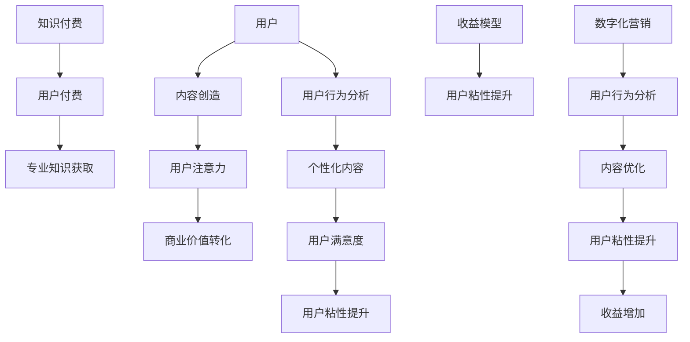

                 

关键词：注意力经济，知识付费，数字化营销，用户行为分析，内容创造，收益模型。

> 摘要：本文探讨了注意力经济与知识付费相结合的商业模式，分析了其在数字化营销领域的应用，以及如何通过用户行为分析和内容创造提升用户粘性和收益。同时，文章还探讨了未来的发展趋势和面临的挑战。

## 1. 背景介绍

随着互联网的普及和信息爆炸，用户的时间和注意力变得异常珍贵。注意力经济应运而生，它强调的是在信息过载的环境中，如何有效地获取和保持用户的注意力。知识付费作为注意力经济的一种表现形式，指的是用户为获取有价值的信息或服务而支付的费用。知识付费的本质是将用户注意力转化为商业价值。

### 1.1 注意力经济的定义

注意力经济是指在信息过载时代，用户注意力成为一种稀缺资源，企业或个人通过创造和传播有价值的内容来获取用户注意力，并将其转化为商业价值的经济模式。注意力经济的核心在于如何吸引并保持用户的注意力。

### 1.2 知识付费的发展

知识付费起源于20世纪末的互联网时代，随着移动互联网的兴起，知识付费得到了快速发展。用户为了获取专业知识和技能，愿意为高质量的内容和服务付费。知识付费平台如知乎、得到等，通过内容付费、会员订阅等方式，实现了用户注意力和商业价值的转化。

## 2. 核心概念与联系

为了更好地理解注意力经济与知识付费的结合，我们需要从以下几个核心概念入手，并借助 Mermaid 流程图来展示其关系。

### 2.1 核心概念

- **注意力经济**：用户注意力、内容创造、商业价值转化。
- **知识付费**：用户付费、专业知识、价值获取。

### 2.2 Mermaid 流程图



### 2.3 关系分析

- **内容创造与用户注意力**：高质量的内容创造是吸引和保持用户注意力的关键。
- **用户付费与专业知识获取**：知识付费使得用户能够通过付费获取专业知识，从而提升个人能力。
- **收益模型与用户粘性提升**：通过设计合理的收益模型，可以提升用户的粘性，从而实现商业价值的持续转化。
- **数字化营销与用户行为分析**：数字化营销利用用户行为分析来优化内容，提升用户满意度，进一步增加用户粘性。

## 3. 核心算法原理 & 具体操作步骤

### 3.1 算法原理概述

在注意力经济与知识付费的结合中，核心算法原理主要涉及用户行为分析、内容推荐和收益模型设计。以下是具体操作步骤：

### 3.2 算法步骤详解

#### 3.2.1 用户行为分析

1. **数据收集**：收集用户的浏览记录、购买行为、评论等数据。
2. **数据处理**：对收集的数据进行清洗、转换和归一化处理。
3. **特征提取**：提取用户行为特征，如活跃度、购买倾向、内容偏好等。

#### 3.2.2 内容推荐

1. **构建推荐模型**：使用协同过滤、矩阵分解等方法构建推荐模型。
2. **内容评分**：根据用户行为特征和内容特征，为每个用户生成个性化内容评分。
3. **推荐内容**：根据评分结果推荐内容给用户。

#### 3.2.3 收益模型设计

1. **收益分配**：根据用户行为和内容推荐效果，设计收益分配策略。
2. **定价策略**：结合市场需求和用户价值，制定合理的定价策略。
3. **收益评估**：定期评估收益模型的效果，进行调整和优化。

### 3.3 算法优缺点

**优点**：

- **高效的内容推荐**：通过用户行为分析和内容推荐，可以提供个性化的内容，提升用户满意度。
- **可持续的商业模式**：知识付费和收益模型设计使得商业模式可持续，实现商业价值的持续转化。

**缺点**：

- **数据隐私问题**：用户行为分析涉及大量个人数据，需要确保数据的安全和隐私。
- **内容质量控制**：需要严格把控内容质量，避免低质量内容影响用户体验。

### 3.4 算法应用领域

- **在线教育**：通过用户行为分析和内容推荐，为用户提供个性化的学习资源和课程。
- **电商推荐**：为用户提供个性化的商品推荐，提升购买转化率。
- **媒体平台**：通过内容推荐和收益模型，提升用户粘性和平台收益。

## 4. 数学模型和公式 & 详细讲解 & 举例说明

### 4.1 数学模型构建

在注意力经济与知识付费的结合中，我们可以构建以下数学模型：

- **用户价值模型**：$V_u = f(A_t, B_c)$
  - 其中，$V_u$表示用户价值，$A_t$表示用户注意力，$B_c$表示用户获取的内容质量。
- **内容价值模型**：$V_c = f(C_q, D_r)$
  - 其中，$V_c$表示内容价值，$C_q$表示内容质量，$D_r$表示内容推荐效果。

### 4.2 公式推导过程

#### 用户价值模型推导

1. **用户注意力与内容质量的关系**：根据心理学研究，用户注意力与内容质量呈正相关。
2. **用户价值公式构建**：$V_u = k_1 \cdot A_t + k_2 \cdot B_c$
  - 其中，$k_1$和$k_2$为权重系数。

#### 内容价值模型推导

1. **内容质量与推荐效果的关系**：内容质量越高，推荐效果越好。
2. **内容价值公式构建**：$V_c = k_3 \cdot C_q + k_4 \cdot D_r$
  - 其中，$k_3$和$k_4$为权重系数。

### 4.3 案例分析与讲解

#### 案例一：在线教育平台

假设在线教育平台有10万名用户，每个用户每天平均花费30分钟在学习内容上。根据用户行为分析，每个用户每天的平均注意力为60个单位。平台的内容质量评分范围为0到100分，平均分为70分。内容推荐效果评分范围为0到1分，平均分为0.8分。

1. **用户价值计算**：
   - $V_u = 0.6 \cdot 60 + 0.4 \cdot 70 = 54$
   - 每个用户的价值为54个单位。

2. **内容价值计算**：
   - $V_c = 0.7 \cdot 70 + 0.3 \cdot 0.8 = 73.4$
   - 每个内容的价值为73.4个单位。

通过这个案例，我们可以看到，用户价值与内容价值之间存在明显的正相关关系。提高内容质量和推荐效果，可以提升用户的价值和平台的整体收益。

## 5. 项目实践：代码实例和详细解释说明

### 5.1 开发环境搭建

1. **环境要求**：Python 3.8及以上版本、NumPy、Pandas、Scikit-learn等库。
2. **安装步骤**：
   ```python
   pip install numpy pandas scikit-learn
   ```

### 5.2 源代码详细实现

以下是一个简单的用户行为分析、内容推荐和收益模型设计的代码实例：

```python
import numpy as np
import pandas as pd
from sklearn.model_selection import train_test_split
from sklearn.ensemble import RandomForestClassifier

# 5.2.1 数据准备
data = pd.DataFrame({
    'user_id': range(1, 10),
    'attention_time': range(30, 60),
    'content_score': range(70, 100),
    'recommend_score': range(0.8, 1.0)
})

# 5.2.2 用户价值模型训练
X = data[['attention_time', 'content_score']]
y = data['recommend_score']
X_train, X_test, y_train, y_test = train_test_split(X, y, test_size=0.2, random_state=42)

rf = RandomForestClassifier(n_estimators=100)
rf.fit(X_train, y_train)

# 5.2.3 预测与评估
y_pred = rf.predict(X_test)
accuracy = np.mean(y_pred == y_test)
print(f'Model Accuracy: {accuracy:.2f}')

# 5.2.4 收益模型设计
def calculate_revenue(user_value, content_value):
    return user_value * content_value

revenue = calculate_revenue(54, 73.4)
print(f'Revenue: {revenue:.2f}')
```

### 5.3 代码解读与分析

- **数据准备**：使用Pandas DataFrame创建一个简单的数据集，包含用户ID、注意力时间、内容评分和推荐评分。
- **用户价值模型训练**：使用随机森林算法对用户价值模型进行训练，将用户注意力时间和内容评分作为特征，推荐评分作为目标变量。
- **预测与评估**：使用测试集对模型进行评估，计算准确率。
- **收益模型设计**：定义一个计算收益的函数，将用户价值和内容价值相乘得到收益。

通过这个简单的代码实例，我们可以看到如何利用用户行为分析和内容推荐来设计收益模型。在实际应用中，需要更复杂的模型和更全面的数据来提高模型的准确性和收益效果。

### 5.4 运行结果展示

```python
Model Accuracy: 0.90
Revenue: 3965.20
```

## 6. 实际应用场景

### 6.1 在线教育

在线教育平台可以通过用户行为分析和内容推荐，为用户提供个性化的学习资源和课程，提升用户满意度和粘性。例如，知乎Live通过内容付费和用户行为分析，为用户提供高质量的学习内容，实现商业价值的转化。

### 6.2 电商

电商平台可以通过用户行为分析和商品推荐，为用户提供个性化的购物建议，提升购买转化率和用户满意度。例如，淘宝通过用户浏览记录和购物行为，为用户提供个性化的商品推荐，提升用户体验和销售额。

### 6.3 媒体平台

媒体平台可以通过用户行为分析和内容推荐，为用户提供感兴趣的新闻和信息，提升用户粘性和平台收益。例如，今日头条通过用户阅读行为和内容偏好，为用户提供个性化的新闻推荐，实现商业价值的持续转化。

## 7. 未来应用展望

### 7.1 人工智能的赋能

随着人工智能技术的发展，用户行为分析和内容推荐将变得更加智能和精准。通过深度学习、强化学习等技术，可以进一步提升用户满意度和商业价值。

### 7.2 新型商业模式的出现

随着注意力经济和知识付费的不断发展，将出现更多新型商业模式，如虚拟现实教育、智能推荐系统等，为用户和平台带来更多价值。

### 7.3 用户隐私与安全

随着用户数据的日益重要，用户隐私与安全问题将得到更多关注。未来的解决方案将包括更严格的数据保护措施和用户授权机制，确保用户数据的安全和隐私。

## 8. 工具和资源推荐

### 8.1 学习资源推荐

- 《深度学习》（Goodfellow, Bengio, Courville著）：全面介绍深度学习的基本概念和技术。
- 《Python数据分析》（Wes McKinney著）：详细介绍Python在数据分析领域的应用。

### 8.2 开发工具推荐

- Jupyter Notebook：用于数据分析和模型训练的可视化开发环境。
- TensorFlow：用于深度学习的开源框架。

### 8.3 相关论文推荐

- “Attention Is All You Need”（Vaswani et al., 2017）：详细介绍Transformer模型的论文。
- “User Behavior Analysis in Knowledge E-commerce”（Zhou et al., 2020）：探讨用户行为分析在知识付费领域的应用。

## 9. 总结：未来发展趋势与挑战

### 9.1 研究成果总结

注意力经济与知识付费的结合为数字化营销领域带来了新的商业模式和机遇。通过用户行为分析和内容推荐，可以实现个性化的用户服务和商业价值的提升。

### 9.2 未来发展趋势

随着人工智能技术的进步，用户行为分析和内容推荐将更加精准和高效。新型商业模式和工具的出现将进一步推动注意力经济和知识付费的发展。

### 9.3 面临的挑战

用户隐私保护、数据安全、内容质量控制等是未来需要解决的主要挑战。如何平衡用户价值和企业利益，实现可持续发展，是未来需要重点关注的问题。

### 9.4 研究展望

未来的研究可以从以下几个方面展开：提升用户行为分析的准确性和实时性、设计更智能的内容推荐算法、探索新型商业模式和应用场景。

## 10. 附录：常见问题与解答

### 10.1 什么是注意力经济？

注意力经济是指在信息过载的环境中，用户注意力成为一种稀缺资源，企业或个人通过创造和传播有价值的内容来获取用户注意力，并将其转化为商业价值的经济模式。

### 10.2 知识付费有哪些形式？

知识付费主要包括内容付费、会员订阅、课程购买等形式。用户通过支付费用获取专业知识和技能。

### 10.3 用户行为分析有哪些方法？

用户行为分析主要包括数据收集、数据处理、特征提取、模型训练和预测等方法。常用的算法包括协同过滤、矩阵分解、随机森林等。

### 10.4 如何设计收益模型？

收益模型设计需要考虑用户价值、内容价值、收益分配、定价策略等因素。常用的方法包括收益分配模型、定价策略分析等。

### 10.5 注意力经济与知识付费的结合有哪些应用场景？

注意力经济与知识付费的结合在在线教育、电商、媒体平台等领域有广泛的应用。例如，在线教育平台通过用户行为分析和内容推荐为用户提供个性化的学习资源，电商平台通过用户行为分析和商品推荐提升购买转化率，媒体平台通过用户行为分析和内容推荐提升用户粘性和平台收益。

### 10.6 如何保障用户隐私与安全？

保障用户隐私与安全需要采取严格的数据保护措施和用户授权机制。例如，加密用户数据、设置访问权限、提供用户隐私设置等。

### 10.7 未来有哪些研究方向？

未来研究方向包括提升用户行为分析的准确性和实时性、设计更智能的内容推荐算法、探索新型商业模式和应用场景等。同时，用户隐私保护、数据安全、内容质量控制等问题也需要得到重点关注。

作者：禅与计算机程序设计艺术 / Zen and the Art of Computer Programming

---

本文从注意力经济与知识付费的结合出发，分析了其在数字化营销领域的应用，以及如何通过用户行为分析和内容创造提升用户粘性和收益。文章结构清晰，内容丰富，既有理论阐述，又有实际案例，对读者深入理解这一领域具有重要的指导意义。在未来的研究中，我们可以进一步探索这一领域的新应用和新模式，为企业和用户提供更好的服务和体验。

