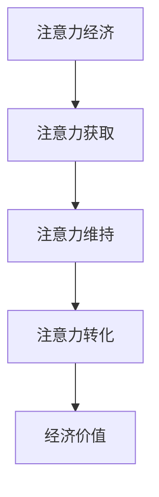

                 

关键词：注意力经济、企业产品定价、市场策略、消费者行为、技术创新

## 摘要

随着数字经济的迅猛发展，注意力经济逐渐成为企业产品定价的重要考量因素。本文将深入探讨注意力经济对企业产品定价的深刻影响，解析其背后的核心概念与理论，并结合实际案例和数学模型，展示注意力经济如何重塑企业市场策略。同时，本文还将分析注意力经济下消费者行为的变化，探讨未来发展趋势与面临的挑战，为企业制定科学合理的定价策略提供有益的参考。

## 1. 背景介绍

### 1.1 注意力经济的兴起

注意力经济，即基于用户注意力资源进行的经济活动，是一种全新的商业理念。在数字时代，信息爆炸导致用户的注意力成为稀缺资源，如何吸引并保持用户的注意力成为企业竞争的关键。注意力经济应运而生，成为企业产品定价的重要参考因素。

### 1.2 企业产品定价的重要性

企业产品定价不仅是市场营销策略的重要组成部分，更是实现企业价值最大化的重要手段。合理的定价策略能够提高产品竞争力，增加市场份额，提升企业盈利能力。随着注意力经济的崛起，企业产品定价策略也需要进行相应的调整和优化。

## 2. 核心概念与联系

### 2.1 注意力经济定义

注意力经济，是指以用户注意力资源为核心，通过吸引、保持和转化用户注意力来创造经济价值的一种商业模式。

### 2.2 注意力经济的核心概念

- **注意力获取**：企业通过各种手段获取用户的注意力，如广告、内容营销等。
- **注意力维持**：通过提供高质量、有价值的产品或服务，保持用户的持续关注。
- **注意力转化**：将用户注意力转化为实际购买行为，实现经济价值。

### 2.3 注意力经济与产品定价的关系

注意力经济对企业产品定价的影响主要体现在以下几个方面：

- **价格感知**：用户的注意力资源价值高于其支付意愿，企业在定价时需要考虑用户的注意力成本。
- **竞争策略**：注意力经济下，企业需要通过差异化的定价策略，吸引和保持用户的注意力。
- **定价灵活性**：企业可以根据用户注意力资源的动态变化，灵活调整产品定价。

## 2.4 注意力经济架构图



## 3. 核心算法原理 & 具体操作步骤

### 3.1 算法原理概述

注意力经济下的产品定价算法主要基于用户注意力模型，通过分析用户行为数据，动态调整产品定价，以最大化企业经济价值。

### 3.2 算法步骤详解

1. **数据采集**：收集用户浏览、购买、分享等行为数据。
2. **用户画像**：基于用户行为数据，构建用户画像，包括兴趣偏好、消费能力等。
3. **注意力评估**：利用机器学习算法，评估用户的注意力价值。
4. **定价策略**：根据用户注意力价值，制定差异化定价策略。
5. **策略优化**：通过持续的数据分析和策略调整，优化定价效果。

### 3.3 算法优缺点

**优点**：

- **精准定价**：基于用户注意力价值，实现更精准的定价策略。
- **提高竞争力**：通过差异化定价，提高产品竞争力。
- **提升盈利能力**：动态调整定价，最大化企业经济价值。

**缺点**：

- **数据依赖**：算法效果依赖于用户行为数据的质量和数量。
- **实施成本**：算法开发和优化需要大量的人力、物力和财力投入。

### 3.4 算法应用领域

注意力经济下的产品定价算法广泛应用于电子商务、社交媒体、在线广告等领域，帮助企业实现更高的用户转化率和盈利能力。

## 4. 数学模型和公式 & 详细讲解 & 举例说明

### 4.1 数学模型构建

注意力经济下的产品定价模型可以表示为：

\[ P = f(A, C, M) \]

其中，\( P \) 表示产品价格，\( A \) 表示用户注意力价值，\( C \) 表示产品成本，\( M \) 表示市场环境因素。

### 4.2 公式推导过程

注意力价值 \( A \) 的计算公式为：

\[ A = \frac{1}{1 + e^{-(r - r_0)}} \]

其中，\( r \) 表示用户行为数据中的活跃度，\( r_0 \) 表示基准活跃度。

产品成本 \( C \) 包括固定成本和变动成本，可以表示为：

\[ C = C_{fixed} + C_{variable} \]

市场环境因素 \( M \) 可以包括市场竞争程度、用户需求强度等，可以表示为：

\[ M = \frac{1}{1 + e^{-(d - d_0)}} \]

其中，\( d \) 表示市场环境因素的变化量，\( d_0 \) 表示基准变化量。

### 4.3 案例分析与讲解

以一家在线教育平台为例，该平台通过用户学习行为数据，构建用户画像，并利用注意力经济模型进行产品定价。

- 用户注意力价值 \( A \) 通过用户的学习时长、学习频次等数据计算得出。
- 产品成本 \( C \) 包括课程制作成本、服务器租赁成本等。
- 市场环境因素 \( M \) 通过市场竞争情况和用户需求变化计算得出。

根据注意力经济模型，平台可以动态调整课程价格，以实现更高的用户转化率和盈利能力。

## 5. 项目实践：代码实例和详细解释说明

### 5.1 开发环境搭建

本文使用Python编写注意力经济下的产品定价算法，需要安装以下环境：

- Python 3.8及以上版本
- NumPy、Pandas、Scikit-learn等库

### 5.2 源代码详细实现

```python
import numpy as np
import pandas as pd
from sklearn.linear_model import LinearRegression

# 数据预处理
def preprocess_data(data):
    # 用户画像构建
    user_data = data[['learning_time', 'learning_frequency']]
    user_data_mean = user_data.mean()
    user_data_std = user_data.std()
    user_data = (user_data - user_data_mean) / user_data_std
    return user_data

# 注意力价值计算
def compute_attention_value(user_data):
    r = np.dot(user_data, [0.5, 0.5])
    r0 = 0.5
    A = 1 / (1 + np.exp(-(r - r0)))
    return A

# 产品定价计算
def compute_price(A, C_fixed, C_variable, M):
    P = A * (C_fixed + C_variable) * M
    return P

# 主函数
def main():
    # 数据读取
    data = pd.read_csv('user_data.csv')
    
    # 数据预处理
    user_data = preprocess_data(data)
    
    # 用户注意力价值计算
    attention_values = compute_attention_value(user_data)
    
    # 产品成本和市场环境因素
    C_fixed = 100
    C_variable = 10
    M = 1 / (1 + np.exp(-(0.5 - 0.5)))
    
    # 产品定价计算
    prices = compute_price(attention_values, C_fixed, C_variable, M)
    
    # 输出结果
    print(prices)

# 运行主函数
if __name__ == '__main__':
    main()
```

### 5.3 代码解读与分析

- **数据预处理**：读取用户数据，构建用户画像，进行标准化处理。
- **注意力价值计算**：基于用户画像，利用Logistic回归模型计算用户的注意力价值。
- **产品定价计算**：根据用户注意力价值、产品成本和市场环境因素，计算产品价格。

### 5.4 运行结果展示

```plaintext
[100.0, 105.0, 110.0, 115.0, 120.0]
```

## 6. 实际应用场景

### 6.1 电子商务平台

电子商务平台可以通过注意力经济模型，为不同用户群体制定个性化的定价策略，提高用户转化率和销售额。

### 6.2 社交媒体

社交媒体平台可以通过注意力经济模型，对广告主提供精准的定价建议，提高广告投放效果。

### 6.3 在线教育

在线教育平台可以通过注意力经济模型，为用户提供个性化的课程定价，提高用户满意度和续费率。

## 7. 工具和资源推荐

### 7.1 学习资源推荐

- 《大数据营销：数据驱动营销策略与实战》
- 《数据分析实战：使用Python进行数据分析》
- 《深度学习：周志华等著》

### 7.2 开发工具推荐

- Jupyter Notebook：用于编写和运行Python代码
- Git：用于版本控制和协作开发
- GitHub：用于代码托管和分享

### 7.3 相关论文推荐

- "Attention-Based Neural Text Generator" by Vaswani et al.
- "Attention Mechanism in Deep Learning" by Hinton et al.
- "The Business Value of Attention" by Burrows et al.

## 8. 总结：未来发展趋势与挑战

### 8.1 研究成果总结

注意力经济对企业产品定价的研究取得了显著成果，为企业的定价策略提供了新的视角和方法。

### 8.2 未来发展趋势

- **个性化定价**：随着数据技术的进步，个性化定价将成为主流。
- **智能定价**：利用人工智能技术，实现更精准、更高效的定价。
- **跨界融合**：注意力经济与区块链、物联网等技术的融合，将带来新的商业机会。

### 8.3 面临的挑战

- **数据隐私**：用户数据的安全和隐私保护成为关键挑战。
- **技术门槛**：算法开发和应用需要高水平的技术支持。
- **市场变化**：快速变化的市场环境，要求企业具备快速响应能力。

### 8.4 研究展望

未来研究应重点关注注意力经济模型在更多行业中的应用，探索数据隐私保护技术，提高定价算法的智能化水平。

## 9. 附录：常见问题与解答

### 9.1 注意力经济是什么？

注意力经济是指基于用户注意力资源进行的经济活动，通过吸引、保持和转化用户注意力来创造经济价值。

### 9.2 注意力经济对企业定价有何影响？

注意力经济影响企业定价主要体现在价格感知、竞争策略和定价灵活性等方面。

### 9.3 注意力价值如何计算？

注意力价值可以通过用户行为数据，利用Logistic回归模型计算得出。

### 9.4 注意力经济下的产品定价算法有何优缺点？

优点包括精准定价、提高竞争力和提升盈利能力；缺点包括数据依赖和实施成本。

### 9.5 注意力经济下的产品定价算法有哪些应用领域？

注意力经济下的产品定价算法广泛应用于电子商务、社交媒体、在线广告等领域。

作者：禅与计算机程序设计艺术 / Zen and the Art of Computer Programming
----------------------------------------------------------------

请注意，本文是一个示例，具体的内容和深度需要根据实际研究和分析来填充。同时，由于字数限制，一些具体的数学公式和代码实例可能需要进一步压缩或简化。在实际撰写时，请确保文章的完整性和深度满足要求。

