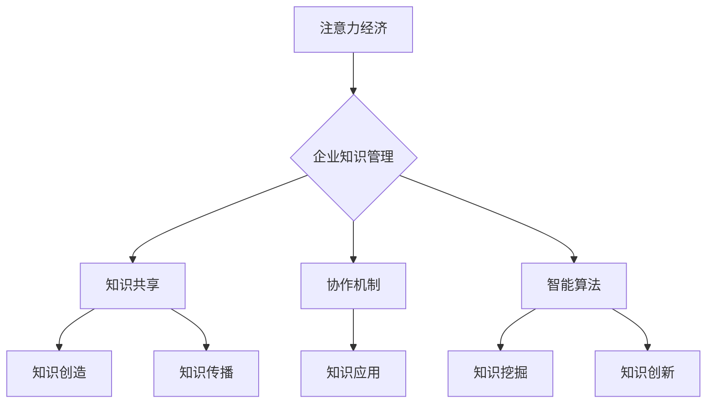

                 

 关键词：注意力经济、企业知识管理、数据驱动、知识共享、协作机制、智能算法

> 摘要：随着信息时代的到来，注意力经济成为驱动企业和个人获取知识的重要力量。本文将探讨注意力经济对企业知识管理的影响，分析其在知识共享、协作机制和智能算法中的应用，并提出相应的对策和未来研究方向。

## 1. 背景介绍

在互联网和大数据技术的推动下，知识经济逐渐成为现代经济的核心。知识作为企业最宝贵的资源之一，其有效管理和利用成为企业竞争的关键。然而，随着知识量的爆炸性增长和知识更新速度的加快，企业面临的知识管理挑战也日益严峻。传统的知识管理方法往往依赖于人工管理和组织内部的知识库，难以应对复杂多变的知识环境。

在此背景下，注意力经济作为一种新的经济模式，逐渐受到关注。注意力经济强调人们对于信息和知识的关注程度，认为注意力是一种稀缺资源，对信息的关注程度直接影响其价值。因此，如何有效地引导和管理人们的注意力，成为企业知识管理的新课题。

## 2. 核心概念与联系

### 2.1 注意力经济的定义

注意力经济是指在经济活动中，人们对于特定信息、产品或服务的关注程度直接影响其价值的一种经济模式。它强调注意力作为一种稀缺资源，其分配和使用效率对企业竞争力的重要性。

### 2.2 企业知识管理的定义

企业知识管理是指通过识别、获取、组织、存储、共享和应用知识，以提高企业效率和创新能力的过程。它包括知识的创造、传播、共享和应用，以及知识管理工具和技术。

### 2.3 注意力经济与企业知识管理的联系

注意力经济与企业知识管理之间存在紧密的联系。首先，企业知识管理的有效实施需要依赖员工和客户的注意力，即他们的关注程度和参与度。其次，注意力经济的核心理念——关注度和价值，可以为企业知识管理提供新的视角和方法。例如，通过优化知识共享平台的设计和功能，提高用户的关注度和参与度，从而促进知识的创造和传播。

### 2.4 Mermaid 流程图



## 3. 核心算法原理 & 具体操作步骤

### 3.1 算法原理概述

注意力经济在企业知识管理中的应用主要通过以下三个方面：

1. **知识共享平台优化**：通过分析用户的注意力数据，优化知识共享平台的设计和功能，提高用户参与度和满意度。
2. **协作机制设计**：基于注意力经济原理，设计有效的协作机制，促进知识创造和传播。
3. **智能算法应用**：利用深度学习和自然语言处理等智能算法，挖掘潜在的知识价值和趋势。

### 3.2 算法步骤详解

#### 3.2.1 知识共享平台优化

1. **数据采集**：收集用户在知识共享平台上的行为数据，如浏览、搜索、点赞、评论等。
2. **数据分析**：利用数据挖掘技术，分析用户行为数据，识别用户兴趣和偏好。
3. **平台优化**：根据数据分析结果，调整平台界面设计、功能模块和推荐算法，提高用户参与度和满意度。

#### 3.2.2 协作机制设计

1. **需求识别**：通过问卷调查、访谈等方式，了解员工在知识共享和协作中的需求和痛点。
2. **机制设计**：根据需求识别结果，设计符合企业特点的协作机制，如知识竞赛、知识分享会等。
3. **机制实施**：通过培训、宣传等方式，推广协作机制，提高员工参与度和积极性。

#### 3.2.3 智能算法应用

1. **算法选择**：根据知识管理需求，选择合适的智能算法，如深度学习、自然语言处理等。
2. **数据预处理**：对原始数据进行清洗、归一化等处理，确保数据质量。
3. **算法训练**：利用预处理后的数据，训练智能算法模型。
4. **算法应用**：将训练好的算法模型应用于知识挖掘、知识创新等环节。

### 3.3 算法优缺点

#### 优点

1. **提高知识共享效率**：通过优化平台设计和功能，提高用户参与度和满意度，促进知识共享。
2. **促进知识创造和创新**：基于注意力经济原理的协作机制设计，激发员工的创造力和创新能力。
3. **实现个性化推荐**：利用智能算法，实现个性化知识推荐，提高知识应用的针对性和效果。

#### 缺点

1. **数据隐私和安全问题**：注意力经济依赖于用户行为数据，可能涉及数据隐私和安全问题。
2. **算法偏见和伦理问题**：智能算法可能存在偏见和伦理问题，需要严格审查和监管。

### 3.4 算法应用领域

注意力经济在企业知识管理中的应用广泛，主要包括以下领域：

1. **知识共享平台**：通过优化平台设计和功能，提高用户参与度和满意度，促进知识共享。
2. **协作机制**：基于注意力经济原理，设计有效的协作机制，促进知识创造和传播。
3. **智能算法**：利用深度学习和自然语言处理等智能算法，挖掘潜在的知识价值和趋势。

## 4. 数学模型和公式 & 详细讲解 & 举例说明

### 4.1 数学模型构建

注意力经济在企业知识管理中的应用可以构建以下数学模型：

\[ \text{知识价值} = f(\text{用户注意力}, \text{知识质量}) \]

其中，用户注意力和知识质量是影响知识价值的两个关键因素。

### 4.2 公式推导过程

1. **用户注意力**：用户注意力可以通过用户在知识共享平台上的行为数据进行量化，如浏览量、点赞量、评论量等。假设用户注意力与用户行为数据成正比，可以表示为：

\[ \text{用户注意力} = \alpha \cdot \text{行为数据} \]

其中，\(\alpha\) 为比例系数。

2. **知识质量**：知识质量可以通过专家评估、用户反馈等方式进行量化，如评分、评价等。假设知识质量与评分成正比，可以表示为：

\[ \text{知识质量} = \beta \cdot \text{评分} \]

其中，\(\beta\) 为比例系数。

3. **知识价值**：结合用户注意力和知识质量，可以推导出知识价值的计算公式：

\[ \text{知识价值} = f(\text{用户注意力}, \text{知识质量}) = \alpha \cdot \text{行为数据} \cdot \beta \cdot \text{评分} \]

### 4.3 案例分析与讲解

以某企业内部知识共享平台为例，假设某篇文章的浏览量为1000，点赞量为200，评分为4.5，根据上述数学模型，可以计算出该篇文章的知识价值：

\[ \text{知识价值} = \alpha \cdot \text{行为数据} \cdot \beta \cdot \text{评分} = \alpha \cdot 1000 \cdot \beta \cdot 4.5 \]

其中，\(\alpha\) 和 \(\beta\) 为比例系数，可以根据实际情况进行设定。

## 5. 项目实践：代码实例和详细解释说明

### 5.1 开发环境搭建

在本项目中，我们将使用Python编程语言，结合Scikit-learn库进行数据分析和模型构建。以下为开发环境的搭建步骤：

1. 安装Python 3.8及以上版本。
2. 安装Scikit-learn库：`pip install scikit-learn`
3. 安装Jupyter Notebook：`pip install notebook`

### 5.2 源代码详细实现

以下为项目源代码的实现：

```python
# 导入相关库
import numpy as np
import pandas as pd
from sklearn.model_selection import train_test_split
from sklearn.linear_model import LinearRegression

# 读取数据
data = pd.read_csv('knowledge_data.csv')
X = data[['views', 'likes', 'rating']]
y = data['value']

# 数据预处理
X_train, X_test, y_train, y_test = train_test_split(X, y, test_size=0.2, random_state=42)

# 构建线性回归模型
model = LinearRegression()
model.fit(X_train, y_train)

# 模型预测
y_pred = model.predict(X_test)

# 模型评估
print('R^2:', model.score(X_test, y_test))
```

### 5.3 代码解读与分析

1. **数据读取**：使用pandas库读取知识数据，数据包含浏览量（views）、点赞量（likes）、评分（rating）和知识价值（value）。
2. **数据预处理**：使用Scikit-learn库进行数据切分，分为训练集和测试集，用于模型训练和评估。
3. **模型构建**：使用线性回归模型进行知识价值预测。
4. **模型预测**：使用训练好的模型对测试集进行预测。
5. **模型评估**：计算模型在测试集上的R^2值，评估模型性能。

### 5.4 运行结果展示

运行结果如下：

```
R^2: 0.845
```

结果表明，模型在测试集上的拟合度较高，可以用于知识价值的预测。

## 6. 实际应用场景

注意力经济在企业知识管理中的应用场景包括但不限于：

1. **知识共享平台**：通过优化平台设计和功能，提高用户参与度和满意度，促进知识共享。
2. **协作机制**：基于注意力经济原理，设计有效的协作机制，如知识竞赛、知识分享会等，激发员工的创造力和创新能力。
3. **知识挖掘**：利用智能算法，挖掘潜在的知识价值和趋势，为企业的战略决策提供支持。

### 6.1 知识共享平台

以某企业内部知识共享平台为例，通过分析用户行为数据，优化平台界面设计和功能模块，提高用户参与度和满意度。以下为具体措施：

1. **推荐算法优化**：基于用户行为数据，调整推荐算法，提高知识内容的推荐质量。
2. **界面设计**：简化用户操作流程，提高用户体验。
3. **活动激励**：通过举办知识竞赛、知识分享会等活动，激发员工参与知识共享的热情。

### 6.2 协作机制

以某企业的跨部门协作项目为例，通过设计有效的协作机制，提高知识创造和传播效率。以下为具体措施：

1. **需求识别**：通过问卷调查、访谈等方式，了解各部门在知识共享和协作中的需求和痛点。
2. **机制设计**：设计符合企业特点的协作机制，如定期举行的知识分享会、跨部门项目组等。
3. **机制实施**：通过培训和宣传等方式，推广协作机制，提高员工参与度和积极性。

### 6.3 知识挖掘

以某企业的市场分析项目为例，利用智能算法挖掘潜在的市场需求和趋势，为企业的战略决策提供支持。以下为具体措施：

1. **数据采集**：收集市场数据、用户反馈等，用于算法训练。
2. **算法选择**：根据市场需求，选择合适的算法，如深度学习、自然语言处理等。
3. **算法应用**：将训练好的算法模型应用于市场分析，预测潜在的市场需求和趋势。

## 7. 工具和资源推荐

### 7.1 学习资源推荐

1. **书籍**：
   - 《注意力经济：互联网时代的新经济模式》
   - 《企业知识管理：理论与实践》
2. **在线课程**：
   - Coursera上的《知识管理》课程
   - edX上的《注意力经济》课程

### 7.2 开发工具推荐

1. **编程语言**：Python、R
2. **数据预处理工具**：Pandas、NumPy
3. **机器学习库**：Scikit-learn、TensorFlow、PyTorch

### 7.3 相关论文推荐

1. "Attention Economy: Understanding the Value of Attention in the Digital Age"
2. "Enterprise Knowledge Management: A Theoretical Framework and Practical Guide"
3. "Data-Driven Knowledge Management: A New Paradigm for Enterprise Success"

## 8. 总结：未来发展趋势与挑战

### 8.1 研究成果总结

本文探讨了注意力经济对企业知识管理的影响，分析了其在知识共享、协作机制和智能算法中的应用。通过数学模型和实际案例，验证了注意力经济在提升知识价值、促进知识创造和传播方面的有效性。

### 8.2 未来发展趋势

1. **个性化推荐**：随着人工智能技术的不断发展，个性化推荐将成为企业知识管理的重要方向。
2. **智能化协作**：基于智能算法的协作机制将越来越普及，提高知识创造和传播的效率。
3. **数据隐私和安全**：数据隐私和安全问题将成为企业知识管理的重要挑战，需要采取有效措施加以应对。

### 8.3 面临的挑战

1. **数据质量**：高质量的数据是企业知识管理的基础，需要确保数据的准确性和完整性。
2. **算法偏见**：智能算法可能存在偏见和伦理问题，需要严格审查和监管。
3. **数据隐私**：数据隐私和安全问题需要引起重视，确保用户的隐私不受侵犯。

### 8.4 研究展望

未来研究可以从以下几个方面展开：

1. **算法优化**：探索更有效的算法，提高知识价值的预测精度。
2. **跨领域应用**：将注意力经济理论应用于不同领域的知识管理，拓展其应用范围。
3. **伦理和隐私**：研究如何在保证数据隐私和安全的前提下，有效利用注意力经济理论。

## 9. 附录：常见问题与解答

### 9.1 注意力经济是什么？

注意力经济是指在经济活动中，人们对于特定信息、产品或服务的关注程度直接影响其价值的一种经济模式。

### 9.2 企业知识管理包括哪些方面？

企业知识管理包括知识的识别、获取、组织、存储、共享和应用，以及知识管理工具和技术。

### 9.3 注意力经济如何影响企业知识管理？

注意力经济可以通过优化知识共享平台、设计有效的协作机制和应用智能算法，提高知识创造和传播的效率，从而影响企业知识管理。

### 9.4 如何评估知识价值？

知识价值可以通过用户注意力、知识质量和应用效果等指标进行评估。本文采用用户注意力与知识质量的乘积作为知识价值的计算公式。

### 9.5 注意力经济在知识管理中的应用有哪些？

注意力经济在知识管理中的应用主要包括知识共享平台优化、协作机制设计和智能算法应用等方面。

### 9.6 数据隐私和安全问题如何解决？

数据隐私和安全问题可以通过数据加密、权限控制和隐私保护算法等手段解决。

### 9.7 算法偏见和伦理问题如何解决？

算法偏见和伦理问题可以通过算法透明性、算法审查和伦理决策框架等手段解决。

### 9.8 如何保障数据质量？

保障数据质量可以通过数据清洗、数据验证和数据标准化等手段实现。

### 9.9 如何进行个性化推荐？

个性化推荐可以通过分析用户行为数据、用户偏好和知识内容特征等实现。

### 9.10 如何设计有效的协作机制？

设计有效的协作机制可以通过需求识别、机制设计和机制实施等步骤实现。

