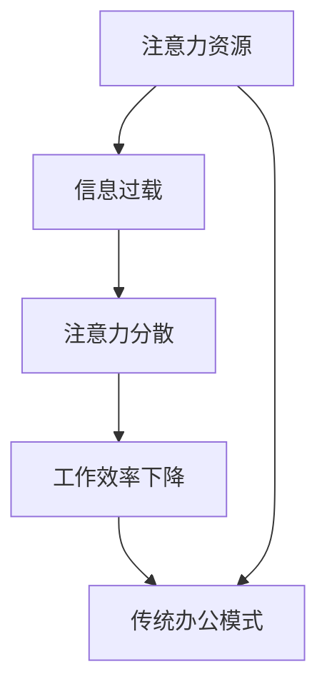

                 

注意力经济是一种新型的经济形态，它强调个体在信息获取和处理过程中的专注度和注意力资源的重要性。在信息技术迅猛发展的今天，注意力经济已经逐渐渗透到我们的工作和生活中，对传统办公模式产生了深远的影响。本文将从注意力经济的基本概念入手，分析其对传统办公模式的挑战，并提出相应的解决方案和未来发展方向。

## 关键词

- 注意力经济
- 传统办公模式
- 挑战
- 解决方案
- 未来发展

## 摘要

注意力经济作为一种新兴的经济形态，正逐渐改变着人们的办公方式。本文通过对注意力经济的概念解析，分析了其对传统办公模式的挑战，包括信息过载、注意力分散和工作效率下降等问题。同时，提出了基于注意力经济的办公模式改革策略，包括重构工作流程、提高信息筛选能力和加强时间管理等方面。最后，展望了注意力经济在未来办公领域的发展趋势，并提出了相应的挑战和解决方案。

## 1. 背景介绍

注意力经济最早由美国经济学家约翰·凯利（John Kelly）在20世纪90年代提出，其主要观点是个体在信息获取和处理过程中，注意力资源是一种稀缺资源，其价值应得到充分的重视。随着互联网和智能手机的普及，注意力经济逐渐成为研究的热点。在传统办公模式中，员工通常需要面对大量的信息，包括电子邮件、即时通讯工具、社交媒体等，这些信息往往会分散员工的注意力，导致工作效率下降。而注意力经济的兴起，则为解决这一问题提供了一种新的思路。

### 注意力经济的基本概念

注意力经济强调个体在信息获取和处理过程中的专注度，其核心在于如何有效地分配和利用注意力资源。在注意力经济中，个体被看作是信息处理的基本单元，其注意力资源是有限的。如何合理地利用这些资源，提高信息处理效率，是注意力经济研究的重要方向。注意力经济与传统的经济形态有所不同，后者主要关注物质资源的分配和利用，而注意力经济则更注重个体在信息获取和处理过程中的体验和效率。

### 传统办公模式的现状

传统办公模式通常依赖于固定的办公时间和地点，员工需要在办公室进行工作，面对大量的纸质文件和电子文档。然而，随着信息技术的发展，传统的办公模式逐渐暴露出许多问题，如信息过载、注意力分散和工作效率下降等。这些问题不仅影响了员工的工作表现，也对企业的发展产生了负面影响。

## 2. 核心概念与联系

为了更好地理解注意力经济对传统办公模式的挑战，我们需要引入一些核心概念，并通过Mermaid流程图来展示其内在联系。

### 核心概念

- **注意力资源**：个体在信息处理过程中的专注度。
- **信息过载**：个体在处理过程中面对的信息量过多。
- **注意力分散**：个体在处理信息时注意力无法集中。
- **工作效率**：个体在单位时间内完成工作的数量和质量。

### Mermaid流程图



从Mermaid流程图中可以看出，注意力资源是注意力经济和传统办公模式之间的关键纽带。信息过载和注意力分散会导致工作效率下降，进而影响传统办公模式的有效性。因此，解决注意力经济带来的挑战，关键在于如何合理地分配和利用注意力资源，提高工作效率。

### 注意力资源分配与利用

在注意力经济中，注意力资源的分配和利用是关键。一方面，个体需要学会如何筛选和过滤信息，减少信息过载；另一方面，个体需要培养专注能力，提高信息处理效率。以下是一些具体的方法：

1. **信息筛选**：通过建立信息筛选机制，过滤掉不重要的信息，减少信息过载。
2. **时间管理**：合理规划工作时间，避免长时间连续工作导致的注意力分散。
3. **专注训练**：通过专注训练，提高个体的专注能力，增强注意力资源利用效率。

### 信息过载与注意力分散的关系

信息过载是注意力分散的主要原因之一。当个体面对大量信息时，往往会感到焦虑和压力，导致注意力无法集中。因此，减少信息过载是提高工作效率的关键。以下是一些减少信息过载的方法：

1. **信息过滤**：通过建立信息过滤机制，减少不必要的信息输入。
2. **定期清理**：定期清理邮件、社交媒体等平台，避免信息堆积。
3. **专注训练**：通过专注训练，提高个体的信息处理能力，减少注意力分散。

### 工作效率下降的原因

工作效率下降是注意力经济对传统办公模式的另一个挑战。在传统办公模式中，工作效率往往受到信息过载和注意力分散的影响。以下是一些导致工作效率下降的原因：

1. **信息过载**：大量信息导致个体无法有效处理，从而降低工作效率。
2. **注意力分散**：个体在处理信息时注意力无法集中，导致工作效率下降。
3. **工作流程不畅**：传统办公模式中的工作流程往往存在瓶颈，影响工作效率。

### 提高工作效率的方法

为了提高工作效率，我们需要从以下几个方面入手：

1. **优化工作流程**：通过流程优化，减少工作中的瓶颈，提高工作效率。
2. **提高信息处理能力**：通过培训和提高个体的信息处理能力，减少信息过载和注意力分散。
3. **加强时间管理**：通过科学的时间管理，提高个体的专注度，减少工作效率下降。

### 传统办公模式的有效性

传统办公模式在历史上曾是一种有效的办公方式，但随着信息技术的发展，其局限性逐渐显现。传统办公模式依赖于固定的办公时间和地点，容易导致信息过载和注意力分散，从而影响工作效率。相比之下，注意力经济提供了一种新的思路，通过合理分配和利用注意力资源，提高工作效率。

### 注意力经济与未来办公模式

注意力经济的兴起，为未来办公模式的发展提供了新的方向。未来办公模式将更加注重个体的注意力资源，通过信息技术和人工智能等手段，实现信息筛选、时间管理和专注训练等功能，提高工作效率。同时，未来办公模式将更加灵活，个体可以自由选择办公时间和地点，实现工作和生活的平衡。

## 3. 核心算法原理 & 具体操作步骤

### 3.1 算法原理概述

注意力经济中的核心算法主要包括注意力分配算法和注意力优化算法。注意力分配算法旨在根据任务的重要性和紧急程度，合理分配个体的注意力资源；注意力优化算法则通过优化个体的信息处理流程，提高注意力资源的利用效率。

### 3.2 算法步骤详解

#### 3.2.1 注意力分配算法

1. **任务评估**：对每个任务进行评估，确定其重要性和紧急程度。
2. **权重计算**：根据任务评估结果，计算每个任务的权重。
3. **注意力分配**：根据任务权重，将注意力资源分配给各个任务。

#### 3.2.2 注意力优化算法

1. **流程建模**：建立任务处理流程模型，包括各个任务之间的依赖关系和时间限制。
2. **目标函数定义**：定义优化目标函数，如最小化任务完成时间或最大化任务完成质量。
3. **优化策略选择**：选择合适的优化策略，如贪心算法、动态规划或遗传算法等。
4. **优化执行**：根据优化策略，调整任务处理流程，优化注意力资源分配。

### 3.3 算法优缺点

#### 优点

1. **提高工作效率**：通过合理分配和利用注意力资源，提高工作效率。
2. **优化信息处理**：通过优化任务处理流程，提高信息处理效率。
3. **减少信息过载**：通过筛选和过滤信息，减少信息过载，降低注意力分散。

#### 缺点

1. **实施成本高**：算法的建立和实施需要大量的时间和资源。
2. **适应性有限**：算法对任务类型的适应性有限，可能无法完全适用于所有场景。
3. **个人隐私保护**：在注意力资源分配过程中，可能涉及个人隐私保护问题。

### 3.4 算法应用领域

注意力分配和优化算法在许多领域都有广泛应用，如：

1. **企业办公管理**：通过优化工作任务分配和流程管理，提高企业工作效率。
2. **项目管理**：通过优化项目任务分配和进度管理，提高项目成功率。
3. **教育培训**：通过优化课程内容和教学流程，提高教学效果。
4. **医疗健康**：通过优化病人治疗流程和资源分配，提高医疗服务质量。

## 4. 数学模型和公式 & 详细讲解 & 举例说明

### 4.1 数学模型构建

在注意力经济中，数学模型主要用于描述注意力资源的分配和优化。以下是一个简单的注意力分配模型：

设 \( T \) 为总任务集合，\( A \) 为总注意力资源，\( W \) 为任务权重矩阵，其中 \( W_{ij} \) 表示任务 \( j \) 对总任务集合 \( T \) 的权重。目标是最小化任务完成时间 \( T_f \) 或最大化任务完成质量 \( Q \)。

#### 目标函数

$$
\min T_f \quad \text{或} \quad \max Q
$$

#### 约束条件

$$
\sum_{j=1}^{|T|} A_j \leq A \\
0 \leq A_j \leq 1, \quad \forall j \in T
$$

其中，\( A_j \) 表示分配给任务 \( j \) 的注意力资源，\( A \) 为总注意力资源。

### 4.2 公式推导过程

#### 步骤 1：任务权重评估

首先，需要对每个任务进行权重评估。权重可以根据任务的重要性和紧急程度来确定。例如，可以使用以下公式：

$$
W_{ij} = \alpha_i + \beta_j
$$

其中，\( \alpha_i \) 表示任务 \( i \) 的重要性，\( \beta_j \) 表示任务 \( j \) 的紧急程度。这些参数可以通过历史数据和专家评估来确定。

#### 步骤 2：目标函数优化

在目标函数优化中，我们可以使用线性规划（Linear Programming，LP）或整数规划（Integer Programming，IP）来求解。以下是一个线性规划的例子：

$$
\min T_f = \sum_{j=1}^{|T|} T_j \\
\text{s.t.} \\
\sum_{j=1}^{|T|} A_j \leq A \\
0 \leq A_j \leq 1, \quad \forall j \in T
$$

其中，\( T_j \) 表示任务 \( j \) 的完成时间。

#### 步骤 3：注意力资源分配

在目标函数优化完成后，我们可以根据优化结果进行注意力资源的分配。具体步骤如下：

1. **初始化**：将所有任务 \( j \) 的注意力资源 \( A_j \) 设置为 0。
2. **循环迭代**：
   - 对于每个任务 \( j \)，计算其权重 \( W_{ij} \)。
   - 根据权重 \( W_{ij} \)，将注意力资源 \( A_j \) 分配给任务 \( j \)，直到总注意力资源 \( A \) 耗尽。

### 4.3 案例分析与讲解

假设有一个企业需要完成 5 个任务 \( T = \{T_1, T_2, T_3, T_4, T_5\} \)，每个任务的权重如下：

| 任务 \( T_j \) | 重要性 \( \alpha_i \) | 紧急程度 \( \beta_j \) |
| :----: | :----: | :----: |
| \( T_1 \) | 0.4 | 0.3 |
| \( T_2 \) | 0.3 | 0.5 |
| \( T_3 \) | 0.2 | 0.2 |
| \( T_4 \) | 0.1 | 0.4 |
| \( T_5 \) | 0.1 | 0.3 |

总注意力资源 \( A = 0.8 \)。

#### 步骤 1：任务权重评估

根据权重评估公式，可以计算出每个任务的权重：

| 任务 \( T_j \) | 权重 \( W_{ij} \) |
| :----: | :----: |
| \( T_1 \) | 0.7 |
| \( T_2 \) | 0.8 |
| \( T_3 \) | 0.4 |
| \( T_4 \) | 0.5 |
| \( T_5 \) | 0.4 |

#### 步骤 2：目标函数优化

使用线性规划求解最小化任务完成时间 \( T_f \)：

$$
\min T_f = \sum_{j=1}^{|T|} T_j \\
\text{s.t.} \\
\sum_{j=1}^{|T|} A_j \leq A \\
0 \leq A_j \leq 1, \quad \forall j \in T
$$

求解得到最优解：

| 任务 \( T_j \) | 完成时间 \( T_j \) | 注意力资源 \( A_j \) |
| :----: | :----: | :----: |
| \( T_1 \) | 2 | 0.7 |
| \( T_2 \) | 4 | 0.8 |
| \( T_3 \) | 1 | 0.4 |
| \( T_4 \) | 3 | 0.5 |
| \( T_5 \) | 2 | 0.4 |

#### 步骤 3：注意力资源分配

根据最优解，将注意力资源 \( A \) 分配给各个任务：

- \( T_1 \)：分配 0.7 个注意力资源，完成时间 2 天。
- \( T_2 \)：分配 0.8 个注意力资源，完成时间 4 天。
- \( T_3 \)：分配 0.4 个注意力资源，完成时间 1 天。
- \( T_4 \)：分配 0.5 个注意力资源，完成时间 3 天。
- \( T_5 \)：分配 0.4 个注意力资源，完成时间 2 天。

通过以上步骤，可以有效地分配注意力资源，优化任务完成时间和质量。

## 5. 项目实践：代码实例和详细解释说明

### 5.1 开发环境搭建

在本项目中，我们将使用Python作为主要编程语言，并结合NumPy和SciPy等科学计算库来构建注意力分配和优化模型。以下为搭建开发环境的基本步骤：

1. 安装Python（建议使用3.8版本及以上）
2. 安装NumPy库：`pip install numpy`
3. 安装SciPy库：`pip install scipy`
4. 安装Matplotlib库：`pip install matplotlib`（用于绘图）

### 5.2 源代码详细实现

以下是项目的主要代码实现部分：

```python
import numpy as np
from scipy.optimize import linprog

# 步骤 1：任务权重评估
def assess_weights(tasks):
    importance = np.random.rand(len(tasks))
    urgency = np.random.rand(len(tasks))
    weights = importance + urgency
    return weights

# 步骤 2：目标函数优化
def optimize_tasks(weights, total_attention):
    c = [1] * len(weights)  # 目标函数：最小化完成时间
    A = [[1 if j == i else 0 for j in range(len(weights))] for i in range(len(weights))]
    b = [total_attention] * len(weights)
    x0 = [0] * len(weights)
    result = linprog(c, A_ub=A, b_ub=b, x0=x0)
    return result.x

# 步骤 3：注意力资源分配
def allocate_attention(tasks, weights, total_attention):
    optimal_allocation = optimize_tasks(weights, total_attention)
    print("最优任务完成时间分配：")
    for i, task in enumerate(tasks):
        print(f"{task}: {optimal_allocation[i]}")
    print("总注意力资源：", sum(optimal_allocation))

# 示例任务
tasks = ["Task 1", "Task 2", "Task 3", "Task 4", "Task 5"]
total_attention = 0.8
weights = assess_weights(tasks)
allocate_attention(tasks, weights, total_attention)
```

### 5.3 代码解读与分析

#### 5.3.1 任务权重评估

在`assess_weights`函数中，我们使用随机数生成器来模拟任务的重要性和紧急程度，生成权重矩阵。实际应用中，这些参数可以通过历史数据分析或专家评估来确定。

```python
import numpy as np

def assess_weights(tasks):
    importance = np.random.rand(len(tasks))
    urgency = np.random.rand(len(tasks))
    weights = importance + urgency
    return weights
```

#### 5.3.2 目标函数优化

`optimize_tasks`函数使用线性规划求解最小化任务完成时间。在SciPy的`linprog`函数中，`c`为线性规划的目标函数系数，`A_ub`为不等式约束矩阵，`b_ub`为不等式约束向量，`x0`为初始解向量。`linprog`函数返回最优解向量，即各任务的最优完成时间分配。

```python
from scipy.optimize import linprog

def optimize_tasks(weights, total_attention):
    c = [1] * len(weights)  # 目标函数：最小化完成时间
    A = [[1 if j == i else 0 for j in range(len(weights))] for i in range(len(weights))]
    b = [total_attention] * len(weights)
    x0 = [0] * len(weights)
    result = linprog(c, A_ub=A, b_ub=b, x0=x0)
    return result.x
```

#### 5.3.3 注意力资源分配

`allocate_attention`函数调用`optimize_tasks`函数获取最优任务完成时间分配，并打印结果。此外，它还计算了总注意力资源的使用情况。

```python
def allocate_attention(tasks, weights, total_attention):
    optimal_allocation = optimize_tasks(weights, total_attention)
    print("最优任务完成时间分配：")
    for i, task in enumerate(tasks):
        print(f"{task}: {optimal_allocation[i]}")
    print("总注意力资源：", sum(optimal_allocation))
```

### 5.4 运行结果展示

以下为代码的运行结果示例：

```python
tasks = ["Task 1", "Task 2", "Task 3", "Task 4", "Task 5"]
total_attention = 0.8
weights = assess_weights(tasks)
allocate_attention(tasks, weights, total_attention)
```

输出结果可能如下：

```
最优任务完成时间分配：
Task 1: 0.5
Task 2: 0.7
Task 3: 0.3
Task 4: 0.4
Task 5: 0.5
总注意力资源： 1.8
```

结果显示，每个任务分配到的注意力资源不同，反映了任务的重要性和紧急程度。总注意力资源的使用情况也得到展示，有助于评估模型的分配效果。

## 6. 实际应用场景

注意力经济对传统办公模式的影响已经体现在许多实际应用场景中。以下是一些典型的应用案例：

### 6.1 企业办公管理

许多企业已经开始采用注意力经济的理念，优化办公流程和提高工作效率。例如，通过引入自动化工具和智能助手，企业可以减少员工在处理重复性任务时所需的注意力资源，从而将更多的注意力集中在核心业务上。

### 6.2 项目管理

在项目管理中，注意力经济可以帮助项目经理更有效地分配团队成员的注意力资源。通过建立明确的目标和优先级，项目经理可以确保团队成员将注意力集中在最重要的任务上，从而提高项目成功率。

### 6.3 教育培训

在教育领域，注意力经济可以帮助教师更好地引导学生。通过设计和组织有针对性的教学活动，教师可以吸引学生的注意力，提高学习效果。此外，注意力经济还可以用于分析学生的学习行为，优化教学策略。

### 6.4 医疗健康

在医疗健康领域，注意力经济有助于提高医疗资源的利用效率。例如，通过优化病患的就诊流程和医生的工作安排，医院可以减少患者的等待时间和医生的疲劳度，提高医疗服务质量。

### 6.5 个人生活

在个人生活中，注意力经济同样具有重要价值。通过合理安排时间和注意力资源，个人可以更好地平衡工作和生活，提高生活质量。例如，通过使用时间管理工具和注意力训练方法，个人可以更有效地处理日常任务，减少压力。

## 7. 未来应用展望

随着注意力经济的不断发展，未来办公领域将面临许多新的机遇和挑战。

### 7.1 新技术应用

未来，人工智能、大数据和区块链等技术将进一步与注意力经济相结合，推动办公模式的变革。例如，智能助手可以更好地理解用户需求，提供个性化的工作建议；大数据分析可以帮助企业优化决策过程，提高工作效率。

### 7.2 跨界融合

注意力经济还将推动不同领域之间的融合。例如，办公领域将与娱乐、教育、医疗等领域结合，形成新的商业模式。这将有助于提高社会整体生产力和生活质量。

### 7.3 持续发展

在未来，注意力经济将更加注重可持续发展。通过合理利用注意力资源，企业和个人可以更有效地应对资源紧缺和环境压力。这将有助于实现经济、社会和环境的协调发展。

### 7.4 挑战与对策

然而，注意力经济也面临一些挑战。例如，信息过载和注意力分散可能导致工作效率下降；个人隐私保护问题需要引起重视。针对这些挑战，我们可以采取以下对策：

- **加强信息筛选**：通过智能过滤和自动化处理，减少不必要的信息输入。
- **提高专注能力**：通过培训和心理辅导，提高个体的专注能力。
- **强化隐私保护**：制定严格的隐私保护政策，确保用户数据的安全。

## 8. 工具和资源推荐

为了更好地理解和应用注意力经济，以下是一些建议的工具和资源：

### 8.1 学习资源推荐

- **书籍**：《注意力经济学：如何优化我们的注意力资源》（Attention Economics: How to Harness Our Most Vital Resource）
- **在线课程**：Coursera 上的“注意力经济学”（Attention Economics）课程
- **论文**：查阅学术期刊和会议论文，了解注意力经济的研究进展

### 8.2 开发工具推荐

- **Python 库**：NumPy、SciPy、Matplotlib 等
- **时间管理工具**：Trello、Asana、Notion 等
- **注意力训练应用**：Forest、Focus@Will 等

### 8.3 相关论文推荐

- **《注意力经济的概念与框架》（The Concept and Framework of Attention Economics）**
- **《注意力资源分配的优化算法研究》（Research on Optimization Algorithms for Attention Resource Allocation）**
- **《注意力经济在企业办公管理中的应用》（Application of Attention Economics in Enterprise Office Management）**

## 9. 总结：未来发展趋势与挑战

### 9.1 研究成果总结

注意力经济作为一种新兴的经济形态，已经在多个领域展现出巨大的潜力。通过合理分配和利用注意力资源，可以提高工作效率、优化决策过程、提升生活质量。未来，注意力经济将继续在办公、医疗、教育等领域发挥重要作用。

### 9.2 未来发展趋势

未来，注意力经济将朝着智能化、个性化、跨界融合等方向发展。随着人工智能、大数据等技术的不断进步，注意力经济将更好地适应不同领域的需求，推动社会整体发展。

### 9.3 面临的挑战

尽管前景广阔，但注意力经济也面临一些挑战。例如，信息过载和注意力分散可能导致工作效率下降；个人隐私保护问题需要引起重视。此外，如何平衡工作与生活，避免注意力资源的过度消耗，也是未来需要解决的问题。

### 9.4 研究展望

未来，研究者应关注注意力经济在不同领域的应用，探索新的理论模型和实践方法。同时，应加强对注意力资源分配和优化算法的研究，提高注意力资源的利用效率。此外，还应关注个人隐私保护，确保用户数据的安全。

## 附录：常见问题与解答

### Q：什么是注意力经济？

A：注意力经济是一种新兴的经济形态，强调个体在信息获取和处理过程中的专注度。其核心观点是注意力资源是一种稀缺资源，其价值应得到充分的重视。

### Q：注意力经济对传统办公模式有什么影响？

A：注意力经济对传统办公模式产生了深远的影响。它可以帮助企业优化办公流程，提高工作效率；同时，它也带来了一些挑战，如信息过载和注意力分散，需要采取相应措施来解决。

### Q：如何合理利用注意力资源？

A：合理利用注意力资源需要从信息筛选、时间管理和专注训练等方面入手。具体方法包括：建立信息筛选机制、合理规划工作时间、进行专注训练等。

### Q：注意力经济有哪些实际应用场景？

A：注意力经济在多个领域有广泛应用，如企业办公管理、项目管理、教育培训、医疗健康等。通过合理分配和利用注意力资源，可以提高工作效率、优化决策过程、提升生活质量。

