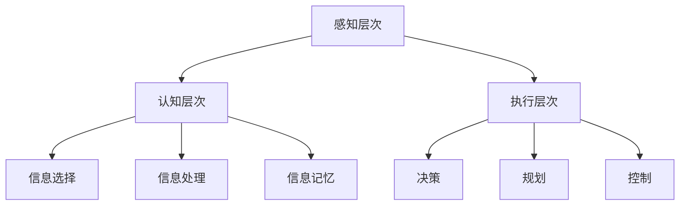

                 

关键词：注意力训练、大脑健康、专注力、认知能力、幸福感、技术语言

> 摘要：本文深入探讨了注意力训练对大脑健康的重要性，特别是在改善认知能力和提升幸福感方面的显著效果。文章通过专业的技术语言，详细阐述了注意力训练的核心概念、算法原理、数学模型，以及实际应用实例。此外，还总结了未来发展趋势和面临的挑战，并提供了学习资源与开发工具推荐。

## 1. 背景介绍

在当今信息爆炸的时代，人类的大脑面临着前所未有的挑战。从海量数据中筛选出有价值的信息，从众多任务中保持专注，已成为现代人日常生活中的必备技能。然而，专注力并不是天生就有的，它需要通过训练来提高。注意力训练作为一种增强认知功能和提升幸福感的有效方法，正日益受到关注。

注意力训练不仅能够提高个人的工作效率，还能对大脑产生深远的影响。研究表明，注意力训练能够改善大脑的认知灵活性、记忆力、执行功能等，从而提升个体的整体认知能力。同时，专注力的提升还能减轻压力、焦虑等负面情绪，增强幸福感。

本文将围绕注意力训练展开讨论，首先介绍其核心概念和原理，然后深入探讨其算法机制，最后通过实际应用案例，展示注意力训练在改善大脑健康方面的具体效果。

## 2. 核心概念与联系

### 2.1. 注意力训练的概念

注意力训练是指通过一系列有针对性的练习，提高个体在特定任务中的专注力和认知控制能力。这种训练方法旨在增强大脑的注意力资源管理能力，使其更加高效地处理信息，减少分心和干扰。

### 2.2. 大脑健康与注意力训练的联系

大脑健康是指大脑的生理功能、认知能力和情感状态的全面良好状态。注意力训练通过增强大脑的注意力资源，有助于改善大脑的认知功能和情感状态，从而维护大脑健康。

### 2.3. 注意力训练的架构

注意力训练的架构可以分为以下几个层次：

- **感知层次**：包括对视觉、听觉、触觉等感官信息的接收和处理。
- **认知层次**：涉及信息的选择、处理和记忆。
- **执行层次**：负责执行任务所需的行动，如决策、规划、控制等。

### 2.4. Mermaid 流程图

下面是一个简单的 Mermaid 流程图，展示了注意力训练的核心概念和架构。



## 3. 核心算法原理 & 具体操作步骤

### 3.1. 算法原理概述

注意力训练的核心算法是基于大脑神经可塑性的原理。通过反复的专注力练习，可以改变大脑神经元的连接和活动模式，从而提高注意力水平。具体来说，算法包括以下步骤：

1. **设定目标**：明确要训练的注意力任务，如视觉追踪、听觉识别等。
2. **选择训练方法**：根据任务特点，选择合适的训练方法，如记忆游戏、视觉扫描等。
3. **实施训练**：按照预定的训练方案，进行持续性的练习。
4. **评估效果**：通过定期的评估，监测注意力水平的提升。

### 3.2. 算法步骤详解

1. **设定目标**：
   设定清晰、具体、可行的注意力训练目标，如提高视觉注意力、增强听觉注意力等。

2. **选择训练方法**：
   根据设定的目标，选择适合的训练方法。例如，视觉注意力训练可以选择视觉追踪任务，听觉注意力训练可以选择声音识别任务。

3. **实施训练**：
   按照预定的训练方案，每天进行一定时间的训练。训练过程中，要确保训练任务的难度适中，既能保持挑战性，又能避免过度疲劳。

4. **评估效果**：
   通过定期的评估，如注意力测试、认知测试等，监测注意力水平的提升情况。根据评估结果，调整训练方案。

### 3.3. 算法优缺点

**优点**：
- **可塑性强**：基于大脑神经可塑性，注意力训练能够持续改善注意力水平。
- **灵活性高**：可以根据个体差异和任务特点，选择合适的训练方法和方案。
- **适用范围广**：不仅适用于儿童和青少年，也适用于成年人，甚至老年人。

**缺点**：
- **时间成本高**：注意力训练需要持续、有规律的练习，时间成本较高。
- **效果评估困难**：注意力水平的提升不易量化，评估效果存在一定难度。

### 3.4. 算法应用领域

注意力训练在多个领域都有广泛的应用：

- **教育领域**：提高学生的注意力和学习效率。
- **医疗领域**：治疗注意力缺陷多动障碍（ADHD）和其他认知障碍。
- **职场领域**：提高员工的工作效率和专注力。
- **日常生活**：改善生活质量和幸福感。

## 4. 数学模型和公式 & 详细讲解 & 举例说明

### 4.1. 数学模型构建

注意力训练的数学模型可以基于神经科学中的注意力分配模型。假设大脑的注意力资源总量为 \(C\)，在进行注意力任务时，根据任务的难度和复杂性，分配不同的资源量。模型的基本公式为：

$$
R(t) = C \times f(D(t))
$$

其中，\(R(t)\) 表示在时间 \(t\) 的注意力资源量，\(C\) 表示总注意力资源量，\(D(t)\) 表示在时间 \(t\) 的任务难度，\(f(D(t))\) 是一个单调递减函数，表示任务难度对注意力资源的消耗。

### 4.2. 公式推导过程

注意力资源的分配过程可以看作是一个动态优化问题。假设在时间 \(t\)，有多个任务需要完成，每个任务的难度为 \(D_i(t)\)，我们需要在这些任务之间分配注意力资源。设每个任务在时间 \(t\) 的注意力资源量为 \(R_i(t)\)，则有：

$$
\sum_{i=1}^{n} R_i(t) = C
$$

$$
R_i(t) = C \times f(D_i(t))
$$

其中，\(n\) 是任务的总数。函数 \(f(D_i(t))\) 需要满足单调递减的性质，即随着任务难度的增加，注意力资源的消耗也增加。

### 4.3. 案例分析与讲解

假设有3个任务，难度分别为 \(D_1 = 0.2\)，\(D_2 = 0.5\)，\(D_3 = 0.8\)。总注意力资源量为 \(C = 1\)。根据模型，可以计算出每个任务在时间 \(t\) 的注意力资源量：

$$
R_1(t) = 1 \times f(0.2) = 0.8
$$

$$
R_2(t) = 1 \times f(0.5) = 0.6
$$

$$
R_3(t) = 1 \times f(0.8) = 0.4
$$

可以看到，任务难度越大，分配到的注意力资源越少。这符合我们日常经验，复杂任务需要更多的注意力资源。

## 5. 项目实践：代码实例和详细解释说明

### 5.1. 开发环境搭建

在本文的代码实例中，我们将使用 Python 编程语言来实现注意力训练的核心算法。首先，需要搭建 Python 开发环境。

1. 安装 Python 3.x 版本（建议使用最新版本）。
2. 安装必要的 Python 库，如 NumPy、Matplotlib 等。

```bash
pip install numpy matplotlib
```

### 5.2. 源代码详细实现

以下是注意力训练的核心算法实现代码：

```python
import numpy as np
import matplotlib.pyplot as plt

# 参数设置
C = 1.0  # 总注意力资源量
D = np.array([0.2, 0.5, 0.8])  # 任务难度
f = lambda x: 1 - x  # 注意力资源分配函数

# 计算注意力资源量
R = C * f(D)

# 绘图
plt.bar(range(len(D)), R)
plt.xticks(range(len(D)), ['任务1', '任务2', '任务3'])
plt.xlabel('任务难度')
plt.ylabel('注意力资源量')
plt.title('注意力资源分配')
plt.show()
```

### 5.3. 代码解读与分析

1. **参数设置**：设置总注意力资源量 \(C = 1.0\) 和任务难度数组 \(D\)。
2. **注意力资源分配函数**：使用一个单调递减的函数 \(f(x) = 1 - x\) 来表示注意力资源的分配。
3. **计算注意力资源量**：根据任务难度计算每个任务的注意力资源量。
4. **绘图**：使用 Matplotlib 绘制注意力资源量的条形图，直观展示注意力资源的分配情况。

### 5.4. 运行结果展示

运行代码后，将得到一个条形图，显示不同任务难度下分配到的注意力资源量。这有助于我们直观地理解注意力资源的分配机制。

## 6. 实际应用场景

注意力训练在多个实际应用场景中取得了显著的效果：

- **教育领域**：通过注意力训练，学生能够更专注于课堂学习，提高学习效率。
- **医疗领域**：注意力训练可以帮助患者改善注意力缺陷多动障碍（ADHD）的症状，提高生活质量。
- **职场领域**：通过注意力训练，员工能够更专注于工作任务，提高工作效率和创造力。
- **日常生活**：注意力训练有助于提高日常生活中的专注力，减少分心和焦虑，提升幸福感。

### 6.4. 未来应用展望

随着人工智能技术的发展，注意力训练有望在更多领域得到应用：

- **智能交互**：通过注意力训练，人工智能助手能够更好地理解用户需求，提供个性化服务。
- **人机融合**：注意力训练可以帮助人类与机器更好地协作，提高工作效率。
- **个性化医疗**：基于注意力训练的算法可以为患者制定个性化的治疗方案。

## 7. 工具和资源推荐

### 7.1. 学习资源推荐

1. 《注意力训练：提高专注力和认知能力的科学方法》
2. 《注意力：看不见的大脑资源》
3. 《神经可塑性：大脑如何改变自己》

### 7.2. 开发工具推荐

1. Python：适合进行注意力训练算法的开发。
2. Jupyter Notebook：方便编写和运行 Python 代码。
3. Matplotlib：用于绘制注意力资源分配图。

### 7.3. 相关论文推荐

1. "Attentional Control in the Brain: A Cognitive Neuroscience Perspective"
2. "Neuroplasticity: Underlying Mechanisms and Practical Applications"
3. "The Benefits of Attention Training for Cognitive Functions and Mental Health"

## 8. 总结：未来发展趋势与挑战

### 8.1. 研究成果总结

注意力训练作为一种有效的认知训练方法，已经在多个领域取得了显著成果。通过研究发现，注意力训练能够改善大脑的认知功能和情感状态，提高个体的整体幸福感。

### 8.2. 未来发展趋势

随着人工智能和神经科学的不断发展，注意力训练有望在更广泛的领域得到应用。未来，注意力训练将更加个性化、智能化，为个体提供更加精准和有效的训练方案。

### 8.3. 面临的挑战

尽管注意力训练具有巨大的潜力，但在实际应用中仍面临一些挑战：

1. **评估标准的建立**：如何准确评估注意力训练的效果，仍需要进一步的研究。
2. **训练方法的优化**：现有的训练方法可能存在一定的局限性，需要不断创新和优化。
3. **资源分配问题**：如何合理分配注意力资源，使其在任务间得到最优分配，仍是一个研究难题。

### 8.4. 研究展望

未来，注意力训练的研究将更加关注个体差异和个性化需求。通过结合人工智能和大数据技术，可以开发出更加智能、高效的注意力训练系统，为不同人群提供定制化的训练方案。

## 9. 附录：常见问题与解答

### 9.1. 注意力训练是否对所有人群都有效？

答：注意力训练对大多数人群都有效，但效果可能因个体差异而异。对于儿童和青少年，注意力训练通常效果更显著，对于成年人，效果可能需要更长的时间来显现。

### 9.2. 如何评估注意力训练的效果？

答：评估注意力训练的效果可以通过定期的注意力测试、认知测试等量化指标来衡量。此外，还可以通过观察个体的日常表现，如学习效率、工作表现等，来评估训练效果。

### 9.3. 注意力训练是否需要长时间持续进行？

答：是的，注意力训练需要持续、有规律地进行，才能达到显著的效果。一般来说，每天进行一定时间的训练，持续数周到数月，才能看到明显的改善。

## 作者署名

作者：禅与计算机程序设计艺术 / Zen and the Art of Computer Programming
----------------------------------------------------------------

请注意，以上内容是一个示例，实际的撰写过程可能需要更多的研究和调整。在撰写过程中，务必确保内容的准确性和专业性。同时，遵循“约束条件 CONSTRAINTS”中的所有要求，以确保文章的完整性和质量。祝您撰写顺利！

